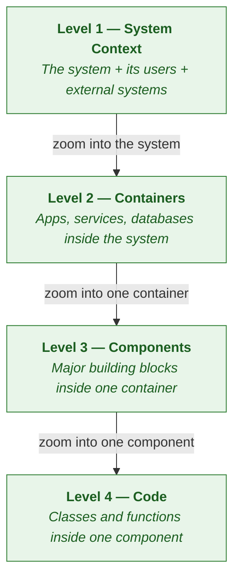
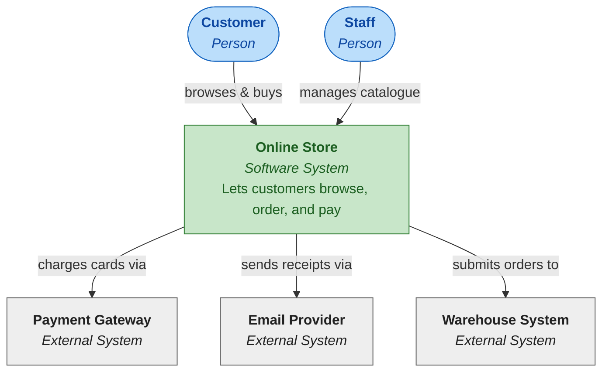
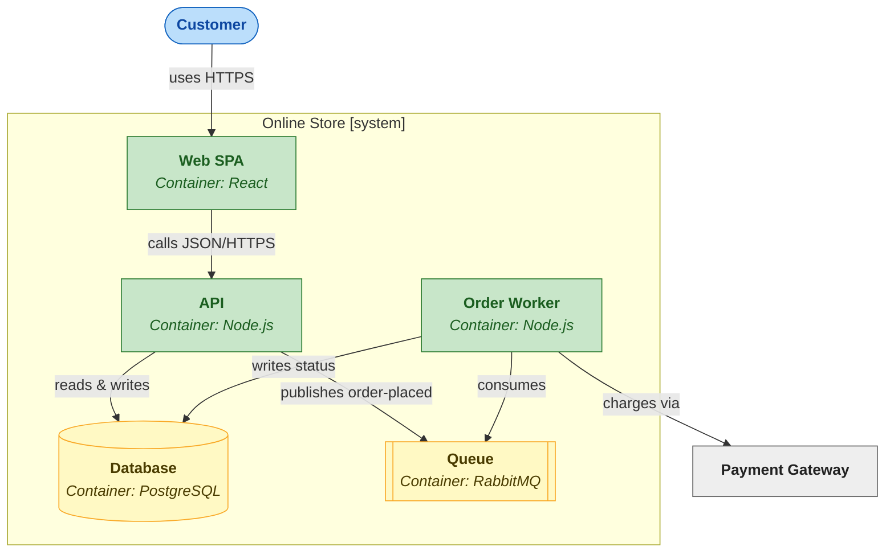
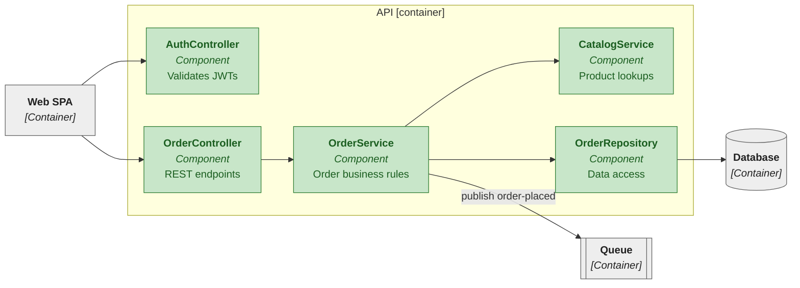
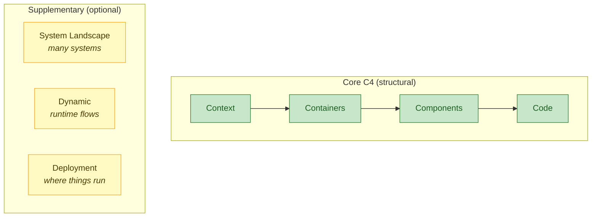

> **Approach:** C4 Model for Visualising Software Architecture
> **Author:** Simon Brown
> **Reference:** [c4model.com](https://c4model.com)
> **Nature:** Notation-agnostic, hierarchical, documentation-oriented

---

## Table of Contents

- [Table of Contents](#table-of-contents)
- [1. The Problem C4 Solves](#1-the-problem-c4-solves)
- [2. The Four Core Levels at a Glance](#2-the-four-core-levels-at-a-glance)
- [3. Level 1 — System Context](#3-level-1--system-context)
- [4. Level 2 — Containers](#4-level-2--containers)
- [5. Level 3 — Components](#5-level-3--components)
- [6. Level 4 — Code](#6-level-4--code)
- [7. Supplementary Diagrams](#7-supplementary-diagrams)
- [8. Notation Is Not Prescribed](#8-notation-is-not-prescribed)
- [9. Common Pitfalls](#9-common-pitfalls)
- [10. When C4 Shines vs. When It Doesn't](#10-when-c4-shines-vs-when-it-doesnt)
- [11. A Minimal Workflow to Adopt C4](#11-a-minimal-workflow-to-adopt-c4)
- [12. Further Reading](#12-further-reading)

---

## 1. The Problem C4 Solves

Most software architecture diagrams fail for the same three reasons:

1. **They mix abstraction levels.** A single box labelled "Database" sits next to a box labelled "JWT-validation function" — the reader cannot tell whether they are looking at an entire system or a single line of code.
2. **They have no shared vocabulary.** One team's "service" is another team's "module" is another team's "microservice." Conversations about the diagram become conversations about the diagram's labels.
3. **They try to show everything at once.** A diagram that fits on a single A3 page but covers the whole company is, almost by definition, useless to any individual reader.

C4 addresses all three by borrowing a metaphor from **Google Maps**: you never look at a globe and a street map at the same time. You *zoom*. C4 defines four well-named zoom levels and insists that a single diagram shows only one of them.

```
World map         ──► Level 1: System Context
Country map       ──► Level 2: Containers
City map          ──► Level 3: Components
Street map        ──► Level 4: Code
```

The result is a set of diagrams any one of which a reader can absorb in under a minute, and together form a coherent, navigable model of the system.

---

## 2. The Four Core Levels at a Glance

Each level zooms inside a single element of the level above it.



A useful way to remember the progression:

| Level | Name | Primary audience | What a box represents |
|---|---|---|---|
| 1 | System Context | Everyone (including non-technical) | A whole software system |
| 2 | Container | Technical staff inside and outside the team | A deployable or runnable unit (app, service, DB, file system) |
| 3 | Component | Developers working on that container | A logical grouping of code with a clear responsibility |
| 4 | Code | Developers implementing that component | A class, function, or data structure |

You do **not** need to draw all four. Most teams draw Level 1 and 2 always, Level 3 for the containers that matter, and Level 4 almost never.

---

## 3. Level 1 — System Context

A System Context diagram shows **the software system you care about as a single black box**, together with the people who use it and the other systems it integrates with.

It is the only C4 diagram that is genuinely useful to non-technical stakeholders. Its job is to answer *"what are we building, and what does it talk to?"* — nothing else.

**Include:**

- Your system (one box, centre of the diagram).
- User types / personas (stick figures or boxes).
- External systems you depend on or are depended on by.

**Exclude:**

- Internal structure of your system (that's Level 2).
- Protocols, databases, technologies (those belong on Level 2 and beyond).

Example — a fictional online store:



Notice that the diagram says nothing about *how* the store works internally — it only says what it does and who it talks to. That restraint is the whole point.

---

## 4. Level 2 — Containers

A Container diagram zooms inside the single system box from Level 1 and shows the **separately deployable or runnable units** that make it up.

> A **container** in C4 is *not* a Docker container. It is anything that needs its own runtime: a web app, an API, a desktop app, a mobile app, a database, a message broker, a serverless function, a file system, a batch job. Some of these will happen to run inside Docker; many will not.

**Include:**

- Each runnable unit as its own box, labelled with its technology.
- The major data stores (databases, caches, queues, object storage).
- Arrows labelled with the protocol and purpose (e.g., "reads orders via HTTPS/JSON").

**Exclude:**

- Internal structure of any container (that's Level 3).
- Classes, functions, or files.

Example — the same online store, one level deeper:



A good Container diagram is the single most useful drawing any project can produce. It is dense enough to be informative and shallow enough that every developer, SRE, and architect on the project can keep the whole picture in their head.

---

## 5. Level 3 — Components

A Component diagram zooms inside **one** of the containers from Level 2 and shows the major logical pieces that make up the code inside it.

A **component** in C4 is a logical grouping of related functionality with a well-defined responsibility. In practice this often corresponds to a namespace, package, module, or directory — but the key test is *responsibility*, not *folder layout*.

**Include:**

- Components (named after their responsibility, not their class).
- How they call or subscribe to one another.
- External dependencies of this container that are relevant to the call flow.

**Exclude:**

- Individual classes (those are Level 4).
- Other containers' internals.
- UI pixel-level details.

You draw a Component diagram **per container**, and only for containers complex enough to warrant it.

Example — zooming into the API container:



The components on this diagram explain *how* the API container fulfils its responsibilities. A new developer assigned to that container should be able to pick up a ticket after reading nothing but this one diagram plus the Container diagram above it.

---

## 6. Level 4 — Code

A Code diagram zooms inside **one** component from Level 3 and shows the classes, interfaces, functions, and data structures that implement it.

In practice, Level 4 diagrams are:

- **Optional.** Most teams never draw them.
- **Often auto-generated.** A UML class diagram from your IDE is a perfectly valid Level 4 artifact.
- **Rarely worth drawing by hand.** Code changes too frequently for hand-drawn class diagrams to stay accurate.

They *are* worth producing when:

- You are **teaching** (a textbook, an onboarding doc, a blog post).
- You are documenting a **critical algorithm** whose design is non-obvious from the source.
- The class structure is the **primary design decision** worth remembering (e.g., a carefully chosen application of the Visitor pattern).

For everyday work, prefer to let the code itself be the Level-4 document and invest your diagramming effort in Levels 1–3 instead.

---

## 7. Supplementary Diagrams

Beyond the four core levels, C4 offers three optional diagram types. You reach for them only when the core levels cannot answer the question at hand.

**System Landscape.** When your organisation has many systems, a System Landscape diagram shows several Level-1 contexts side by side. It is Level 1 *for the enterprise*, not for a single product.

**Dynamic diagram.** Core C4 diagrams are structural (who talks to whom). A Dynamic diagram shows a specific runtime scenario — essentially a sequence diagram drawn using the same boxes as your Level 2 or Level 3 view. Good for explaining a single important flow (login, checkout, payment reconciliation).

**Deployment diagram.** Shows which Level-2 containers run on which physical or logical nodes — servers, pods, regions, devices. Useful when deployment topology is a meaningful part of the design (multi-region, edge computing, specialised hardware).



---

## 8. Notation Is Not Prescribed

C4 is deliberately **notation-agnostic**. It does not mandate any particular shape, colour, arrow style, or tool. You can draw a perfectly valid C4 diagram on a whiteboard with a permanent marker.

What C4 *does* ask of every diagram:

- **A title** that names the system and the level (e.g., "Online Store — Container diagram").
- **A legend** if you use colour or shape to mean anything.
- **Every box labelled** with at least:
  - Name (what it is)
  - Type in `[brackets]` or italics (Person, System, Container, Component)
  - Technology for Levels 2–3 (e.g., "Node.js", "PostgreSQL")
  - A short sentence describing its responsibility
- **Every arrow labelled** with the purpose and, where meaningful, the protocol.

Tools that work well with C4:

- **Mermaid** — text-based, versions cleanly in Git, renders in Markdown-based docs.
- **PlantUML** — text-based, has an official `C4-PlantUML` extension with purpose-built shapes.
- **Structurizr** — Simon Brown's own tool; models the system as code and renders multiple views automatically.
- **draw.io / Lucidchart / Miro** — fine for whiteboard-style diagrams; harder to keep in sync with the codebase.

The best tool is the one your team will actually keep up to date. A slightly ugly Mermaid diagram committed next to the code almost always beats a beautiful Lucidchart diagram that nobody has opened in eighteen months.

---

## 9. Common Pitfalls

**Mixing Containers and Components in one diagram.** A box labelled "PostgreSQL" next to a box labelled "OrderController" is a level violation. Split into two diagrams.

**Treating "Container" as "Docker container".** A PostgreSQL database is a C4 container whether it runs on a cloud-managed service, a bare-metal VM, or inside Kubernetes. The word is older than Docker.

**Drawing Level 4 for everything.** Hand-drawn class diagrams go stale within weeks. Let the IDE generate them on demand.

**Unlabelled arrows.** An arrow with no label forces every reader to guess whether it means a function call, a database query, or an event. State the purpose and the protocol.

**"Everything on one page" diagrams.** If your diagram needs a magnifying glass to read, you have confused density with information. Split it across levels.

**Inventing custom shapes.** Readers have to learn your notation before they can learn your system. Stick to boxes, labels, and arrows unless you have a strong reason to deviate.

---

## 10. When C4 Shines vs. When It Doesn't

**C4 shines when:**

- You need to **onboard** new developers to a long-lived system.
- You need to **communicate across teams** or with non-developer stakeholders.
- You want architecture documentation that **ages gracefully** alongside the code.
- You are designing a system with **more than a couple of deployable units**.

**C4 is weaker when:**

- The system is a short-lived **research prototype** — the overhead outweighs the benefit.
- The essence is **data flow**, not structure — a dataflow diagram (DFD) is often clearer.
- The system is **highly event-driven** with dozens of asynchronous paths — event-storming or sequence diagrams may communicate intent better than static structure.
- You are documenting **a single critical algorithm** — a flowchart or pseudocode is often more direct.

C4 is a vocabulary for the structural, long-lived skeleton of a system. It does not replace sequence diagrams, ER diagrams, dataflow diagrams, or state machines — it complements them.

---

## 11. A Minimal Workflow to Adopt C4

You do not have to buy into C4 all at once. A realistic adoption path:

1. **Start with a single Level 1 diagram.** Draw your system as one box, its users, and its external dependencies. Commit it next to the code.
2. **Add Level 2 once you have more than one runnable thing.** If your product is a single binary on a single server, skip this until it isn't.
3. **Add Level 3 only for containers that warrant it.** A five-endpoint API usually doesn't. A domain-heavy service with a dozen modules usually does.
4. **Skip Level 4 unless teaching or preserving a non-obvious design decision.**
5. **Treat diagrams as code.** Keep them in the repo, review them in PRs, regenerate them (Structurizr, Mermaid) rather than re-drawing.
6. **Revisit on every architectural change.** If a diagram is wrong and no one is willing to fix it, that is a signal that nobody is using it — delete it honestly rather than leave it to mislead.

---

## 12. Further Reading

- **[c4model.com](https://c4model.com)** — Simon Brown's canonical site, including abbreviated notation guides and worked examples.
- **"Software Architecture for Developers"** — Simon Brown. Book-length treatment; the motivation and philosophy behind C4.
- **Structurizr** — [structurizr.com](https://structurizr.com). Model-as-code tooling from the author of C4. Lets one model produce all four views automatically.
- **`C4-PlantUML`** — community PlantUML extension with purpose-built C4 shapes: [github.com/plantuml-stdlib/C4-PlantUML](https://github.com/plantuml-stdlib/C4-PlantUML).

> This page is a generalised reference; case studies elsewhere in this book (e.g., the `pi-mono` walkthrough) refer back to these levels when they label a diagram as a "C4 component view" or similar.
