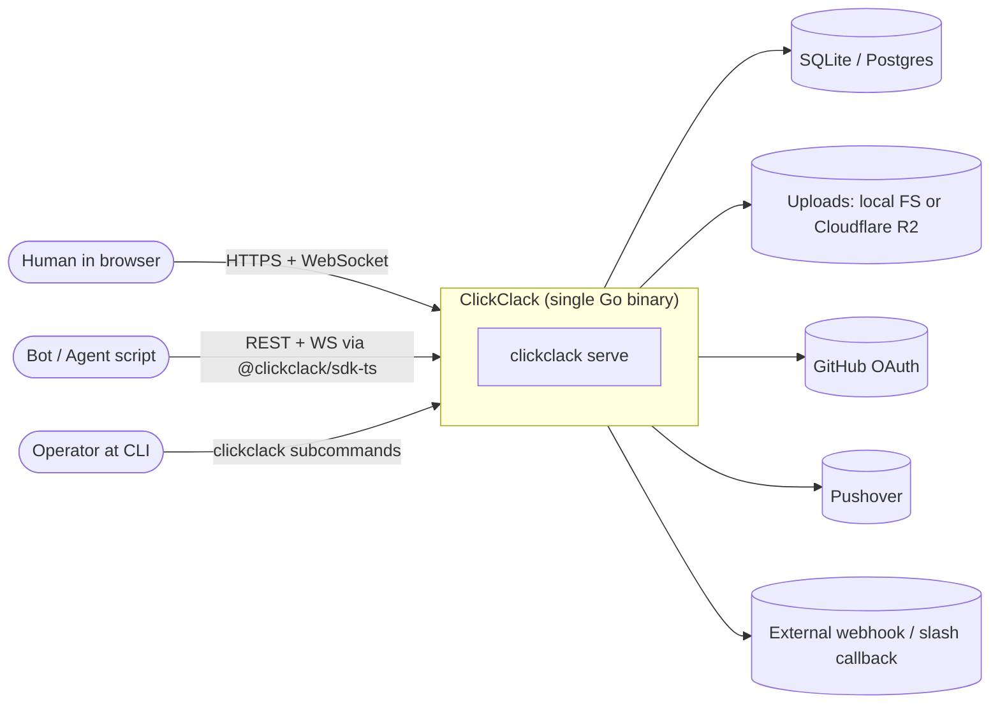
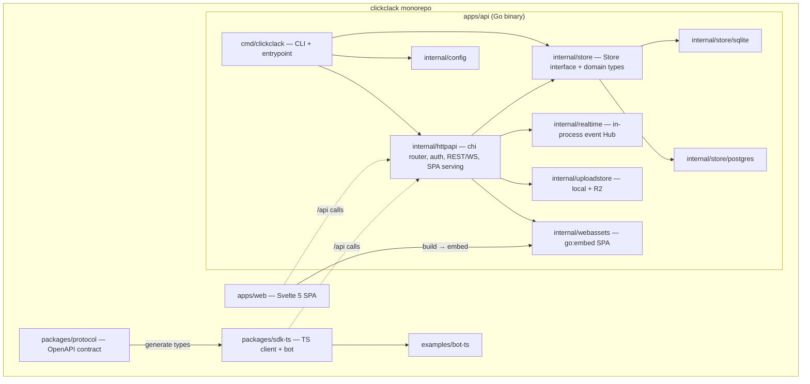
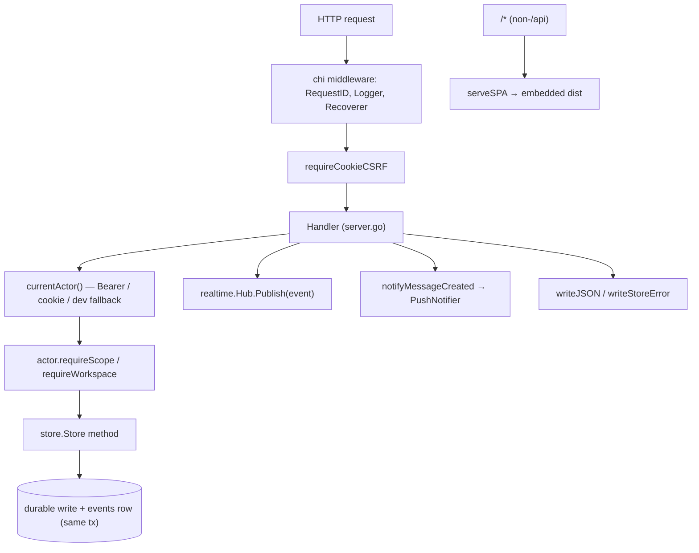
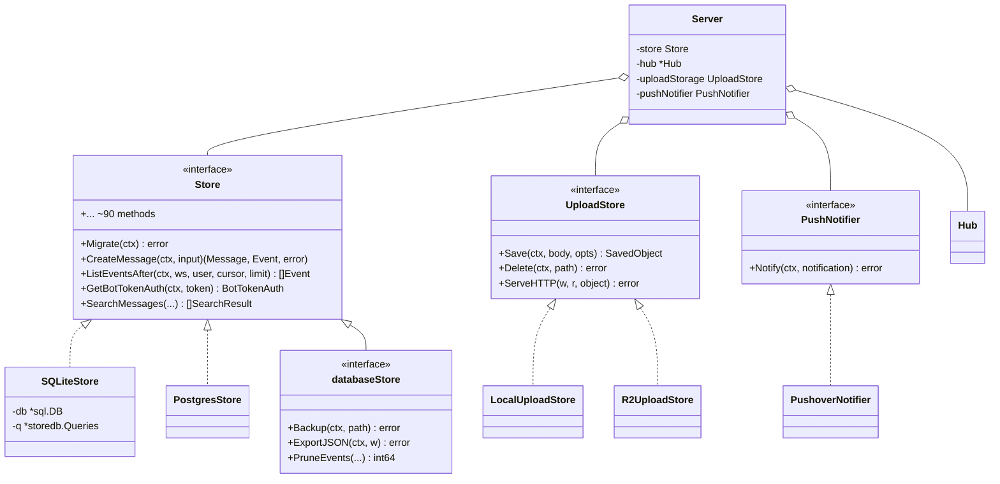
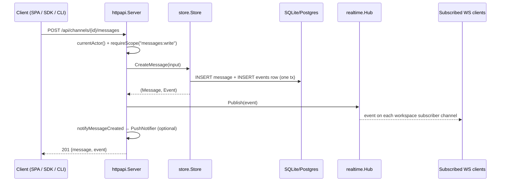

> Source: `github.com/openclaw/clickclack` · Analyzed: 2026-06-06 · Type: **Hybrid** (single-binary application + published TypeScript packages)

## 1. Overview

ClickClack is a self-hostable, API-first realtime team chat ("Slack-style threads,
Discord-ish warmth") for OpenClaw agents and humans. It ships as **one Go binary**
that embeds the Svelte SPA, the SQL migrations, and the built static assets — no
separate web server, no extra services (`README.md`, `docs/architecture/overview.md`).

**Repo type — Hybrid, with evidence:**

- **Application** signals: a runnable entry point at `apps/api/cmd/clickclack/main.go`
  (`func main` → `serve`/`migrate`/`admin`/`backup`/`export` subcommands); deployment
  config (`Dockerfile`, `Dockerfile.cloudflare`, `.goreleaser.yml`, `wrangler.jsonc`);
  it wires concrete dependencies (`httpapi.New(st, realtime.NewHub(), …)`).
- **Library** signals: a pnpm workspace (`pnpm-workspace.yaml`) publishing
  `@clickclack/sdk-ts` (a framework-neutral client) and `packages/protocol`
  (an OpenAPI contract described as the source of truth).
- It is also a **frontend app** (`apps/web`, a Svelte 5 SPA) that is compiled and
  then embedded into the Go binary.

**Tech stack:**

| Area | Choice |
|------|--------|
| Backend | Go 1.26, `go-chi/chi` router, `coder/websocket`, `oklog/ulid` |
| Storage | SQLite via `modernc.org/sqlite` (default, WAL + FTS5); Postgres via `jackc/pgx` (alt) |
| Frontend | Svelte 5 + SvelteKit (static adapter), Vite, `marked` + `dompurify`, `virtua` |
| SDK | TypeScript, OpenAPI-generated types (`packages/protocol/openapi.yaml`) |
| Tooling | pnpm, `tsgo` (typecheck), `oxlint`/`oxfmt`, `sqlc`, Playwright (e2e) |
| Deploy | Single binary, Docker (Alpine), Cloudflare Workers/Containers, GoReleaser |

## 2. System Context  <!-- C4 Level 1 -->



The browser SPA, bot scripts (through the TypeScript SDK), and the agent-friendly CLI
all speak the same `/api` surface. Durable state lives in the database; uploads live in
a pluggable blob store; GitHub, Pushover, and outbound webhooks are optional external
integrations.

## 3. High-Level Structure  <!-- C4 Level 2 -->



| Path | Responsibility |
|------|----------------|
| `apps/api/cmd/clickclack` | CLI dispatch + single-binary entrypoint (`serve`, `migrate`, `admin`, `backup`, `export`, and agent client mode `send`/`list`/`open`/`reply`). |
| `apps/api/internal/httpapi` | chi router, auth resolution, REST + WebSocket handlers, CSRF, SPA serving, GitHub OAuth, Pushover, webhooks/slash. |
| `apps/api/internal/store` | Backend-neutral `Store` interface and all domain types (`types.go`). |
| `apps/api/internal/store/sqlite` | SQLite implementation: embedded migrations, FTS search, backup, JSON export. |
| `apps/api/internal/store/postgres` | Postgres implementation behind the same `Store` interface. |
| `apps/api/internal/realtime` | In-process per-workspace pub/sub `Hub` for live event fan-out. |
| `apps/api/internal/uploadstore` | `Store` interface for blob storage with `local` and `r2` backends. |
| `apps/api/internal/config` | Flag → env → JSON-file config resolution. |
| `apps/api/internal/webassets` | `go:embed dist/*` — the built SPA baked into the binary. |
| `apps/web` | Svelte 5 SPA (chat UI + public product site). |
| `packages/protocol` | `openapi.yaml` contract — source of truth for the API. |
| `packages/sdk-ts` | Framework-neutral `ClickClackClient` + `ClickClackBot`. |

## 4. Components  <!-- C4 Level 3: inside apps/api/internal/httpapi -->

The HTTP layer is the heart of the application. Every handler follows the same shape:
resolve the actor, check scope/workspace, call the store, then publish any returned
events to the realtime hub.



Key files in `internal/httpapi`:

- `server.go` — `Server` struct, the chi route table (`Handler()`), `currentActor`,
  CSRF gate, WebSocket endpoint, event-delivery gating, SPA fallback.
- `auth.go`, `github.go` — session/magic-link/bot-token auth and GitHub OAuth flow.
- `bot_scope.go` — bot-token workspace/resource scoping (`requireBotChannelWorkspace`, `requireBotMessageResource`).
- `mutations.go`, `features.go` — message/DM/upload mutation handlers and feature endpoints.
- `notifications.go`, `pushover.go` — push-notification fan-out via the `PushNotifier` interface.
- `quotes.go` — quoted-message handling.

## 5. OOP & Class Architecture

ClickClack is idiomatic Go: behavior is organized around **interfaces with concrete
implementations** rather than inheritance. Three interface seams define the system.



**Design patterns in use:**

- **Strategy / Dependency Inversion** — `store.Store` (`store/types.go:625`) is the
  central abstraction. `main.go`'s `openStore()` picks `sqlite` or `postgres` from the
  DB URL scheme; handlers never see dialect-specific SQL. Same pattern for
  `uploadstore.Store` (local vs R2) and `httpapi.PushNotifier`.
- **Interface composition** — `databaseStore` in `main.go:32` embeds `store.Store` and
  adds operational methods (`Backup`, `ExportJSON`, `PruneEvents`) needed only by CLI
  ops, keeping the runtime `Store` surface narrower.
- **Dependency injection via constructor** — `httpapi.New(store, hub, Options{…})`
  receives all collaborators; `Options` carries optional config (upload storage, OAuth,
  push notifier), with `nil` meaning "feature off".
- **Generated repository** — `sqlc` produces `storedb.Queries` (`store/sqlite/sqlc.yaml`,
  `sqlc.yaml`); hand-written store methods wrap those typed queries.
- **Outbox pattern** — store mutations return both the entity and `Event` row(s)
  written in the *same transaction*, so a subscriber can never observe an event whose
  durable write is missing (`docs/architecture/overview.md`).
- **Value-object actor** — `httpapi.actor` (`server.go:45`) bundles the resolved user,
  bot-token id, workspace, and scopes, with `requireScope` / `requireWorkspace` methods.

On the TypeScript side, `ClickClackClient` (`packages/sdk-ts/src/index.ts`) groups
endpoints into namespaced sub-objects (`auth`, `workspaces`, `channels`, `messages`,
`threads`, `dms`, `events`, …), and `ClickClackBot` composes a client with a WebSocket
event loop (`start`/`stop`).

## 6. Key Flows

### 6.1 Send a message (write + realtime fan-out)



### 6.2 Realtime subscribe + cursor recovery

```mermaid
sequenceDiagram
    participant C as SPA (realtime.svelte.ts)
    participant H as httpapi.websocket
    participant S as store.Store
    participant Hub as realtime.Hub

    C->>H: GET /api/realtime/ws?workspace_id=..&after_cursor=..
    H->>H: auth + requireWorkspace
    H->>Hub: Subscribe(workspaceID) → (chan, unsubscribe)
    H->>S: ListEventsAfter(cursor, 500)  %% backlog replay
    S-->>H: missed events
    H-->>C: replay backlog (deduped, per-user gated)
    loop live
        Hub-->>H: new event
        H->>H: shouldDeliverEventToActor()
        H-->>C: event (client stores event.cursor in localStorage)
    end
    Note over C,H: On disconnect, SPA reconnects with last cursor;<br/>HTTP GET /api/realtime/events is the pull fallback.
```

The WebSocket is an **update pipe only** — durable truth is the DB. The `Hub`
(`realtime/hub.go`) is a per-workspace `map[chan store.Event]` with non-blocking sends
(`select { case ch <- event: default: }`), so a slow subscriber drops live frames and
recovers them via cursor replay rather than back-pressuring the publisher.

## 7. Extension Points

- **New storage backend** — implement `store.Store` (+ the `databaseStore` ops) and add
  a branch in `main.go:openStore()`. SQLite and Postgres already prove the seam.
- **New blob backend** — implement `uploadstore.Store` (`Save`/`Delete`/`ServeHTTP`)
  and wire it in `openUploadStorage()`.
- **New notifier** — implement `httpapi.PushNotifier`; pass it via `Options.PushNotifier`.
- **Bots & apps** — create bot tokens (`clickclack admin bot create`) with scoped
  permissions; install apps, slash commands, and event subscriptions (outbound webhooks)
  per workspace through the `/api/workspaces/{id}/…` endpoints.
- **Integrations** — Mattermost-shaped incoming webhook (`/api/hooks/mattermost/{channel_id}`)
  and slash callback (`/api/hooks/slash/{channel_id}`) accept drop-in scripts.
- **Clients** — build on `@clickclack/sdk-ts` (`ClickClackClient` / `ClickClackBot`),
  generated from the `packages/protocol` OpenAPI contract; see `examples/bot-ts`.
- **Auth** — magic-link and GitHub OAuth are config-gated; the actor-resolution chain in
  `currentActor()` is the place new auth methods slot in.

## 8. Key Abstractions / Glossary

- **Store** — the backend-neutral persistence contract; the single most important
  interface in the system. Returns domain entities *plus* outbox `Event`s.
- **Event / cursor** — a durable, ordered record of "something changed". Clients hold a
  `cursor` to replay anything missed. Ephemeral events (typing/presence) bypass the log.
- **Hub** — in-process realtime fan-out, scoped per workspace; non-durable.
- **Actor** — the resolved caller (human user, or bot identity + token scopes +
  workspace) used for authorization on every request.
- **Workspace / Channel / Thread / DM** — the chat hierarchy. Threads are one level deep
  (no nesting). DMs cap at `MaxDirectConversationMembers = 32`.
- **Route ID** — short, public, ULID-derived identifiers with semantic prefixes
  (`wsp_`, `chn_`, `dm_`, `msg_`) used in shareable URLs; legacy vs new route forms are
  both resolvable (`resolveRoute`).
- **Nonce** — client-supplied idempotency key so optimistic UIs can match the server
  reply to a pending placeholder and retry safely.
- **Guest / waiting room** — open GitHub logins (without a moderator org) become
  waiting-room guests with a daily post budget (`GuestPostLimit = 3`) until approved.
- **Outbox** — the discipline of writing the `events` row in the same transaction as the
  durable change that produced it.

## 9. Open Questions & Notes

- **sqlc / generated code not fully inspected.** I read the public store interface and
  the SQLite `Open`/`Migrate` bootstrap, but not every generated `storedb.Queries` body.
  Per-method SQL behavior is taken from the interface signatures and store-level comments.
- **Two migration trees exist.** `apps/api/internal/store/{sqlite,postgres}/migrations`
  are embedded (authoritative for the running binary), while `infra/migrations/sqlite`
  mirrors them. I did not diff the two sets; treat `apps/api/.../migrations` as the
  source the binary actually applies (`//go:embed migrations/*.sql` in `sqlite.go`).
- **Cloudflare path.** `Dockerfile.cloudflare`, `wrangler.jsonc`, `infra/cloudflare/worker.ts`,
  and `cloudflare-seed/` indicate a Workers/Containers deployment with Postgres + R2,
  but I did not trace the worker glue end-to-end; details in `docs/deployment.md`.
- **`withHTTPDeadlines` vs router wiring.** `newHTTPServer` wraps the handler with
  per-request read deadlines (WebSocket-exempt); confirmed in `server.go`, but the full
  timeout interplay with long-poll endpoints was not exhaustively tested here.
- **Postgres parity.** The Postgres implementation mirrors the SQLite file layout
  one-to-one; I assumed behavioral parity from the shared `Store` interface rather than
  reading both implementations method-by-method.
- For authoritative, change-scoped detail, the in-repo `docs/` tree (each file has a
  `read_when` hint) and `SPEC.md` are the canonical companions to this overview.
```
