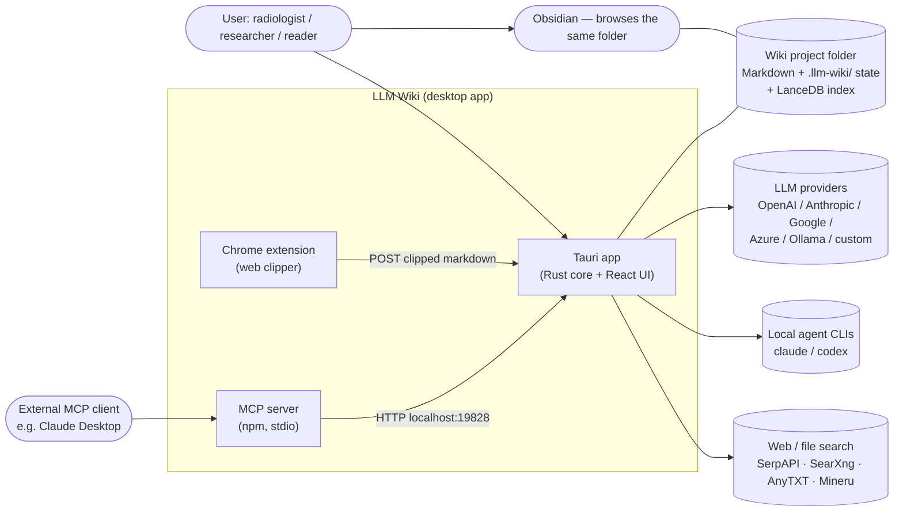
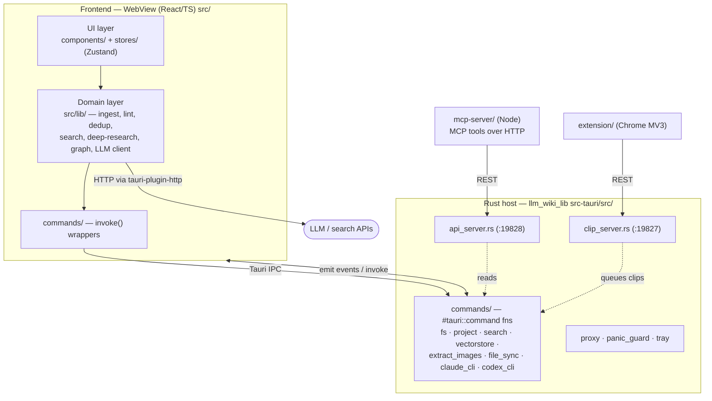
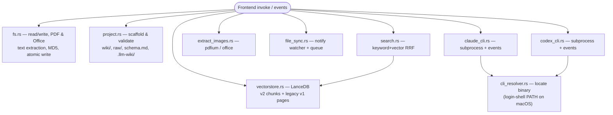
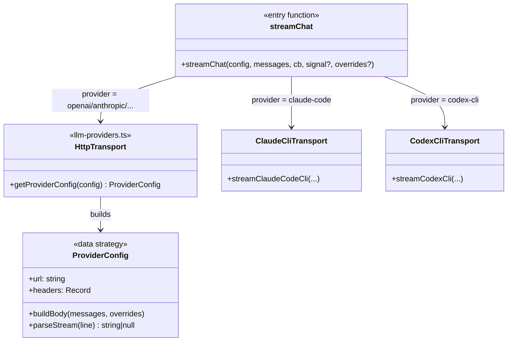
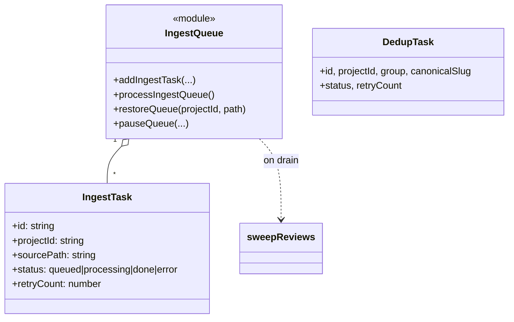
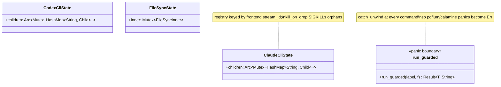
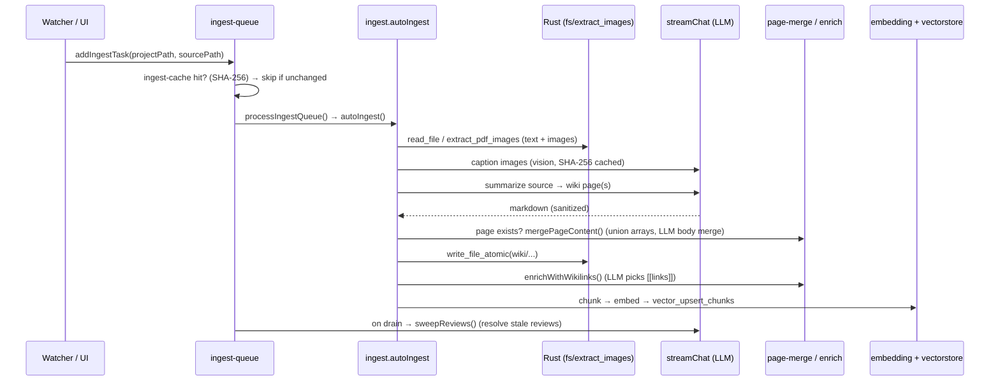
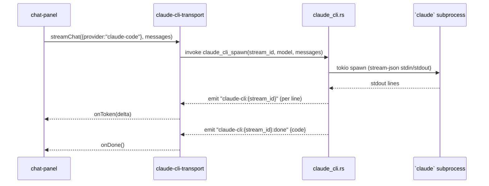

> Source: cloned `llm_wiki` repo (`com.llmwiki.app`, upstream `nashsu/llm_wiki`) · Analyzed: 2026-06-16 · Type: **Application** (multi-process Tauri desktop app) with two companion surfaces — an **MCP server** (library/tool) and a **Chrome extension**.
> Scope: architecturally significant code only. Generated code, vendored libs (`Readability.js`, `Turndown.js`, `pdfium/`), and `*.test.ts` fixtures are skipped except where they reveal design intent.

---

## 1. Overview

**What it is.** LLM Wiki is a desktop app that turns an LLM into a *disciplined wiki maintainer*. Instead of re-deriving knowledge from raw documents on every query (classic RAG), the LLM **incrementally builds and maintains a persistent, interlinked Markdown wiki** that sits between you and your raw sources. You curate sources and ask questions; the LLM does the reading, summarizing, cross-referencing, deduplicating, and bookkeeping. The wiki is just a folder of Markdown files — Obsidian-compatible, git-friendly. The product idea is stated verbatim in `llm-wiki.md`; this repo is one concrete instantiation of that pattern.

**Repo type & evidence.** Primarily an **Application**:
- Runnable entry points: `src-tauri/src/main.rs` → `llm_wiki_lib::run()`; web entry `src/main.tsx`; `index.html`.
- Deployment/bundle config: `src-tauri/tauri.conf.json` (`bundle.targets: "all"`, per-OS `tauri.{macos,windows,linux}.conf.json`, icons, code-signing manifest).
- Wires *concrete* dependencies (LanceDB, pdfium, specific LLM providers) rather than exposing abstractions for callers.

It also ships two **hybrid surfaces** that *are* import/integration boundaries:
- `mcp-server/` — a standalone npm package (`bin: llm-wiki-mcp`) that any MCP client (Claude Desktop, etc.) can spawn; it is a thin client over the desktop app's local HTTP API.
- `extension/` — a Manifest V3 Chrome extension (the web clipper) that POSTs to the app's local clip server.

**Tech stack.**

| Layer | Technology |
|-------|-----------|
| Desktop shell | **Tauri 2** (Rust host + system WebView) |
| Backend language | **Rust 2021** (`llm_wiki_lib` crate) |
| Frontend | **React 19 + TypeScript** (strict), **Vite 8** |
| State | **Zustand 5** (9 stores) |
| Styling/UI | **Tailwind 4**, **@base-ui/react** (shadcn-style primitives), `lucide-react` |
| Editor | **Milkdown** (WYSIWYG) + **react-markdown** / remark / rehype-katex (read mode) |
| Graph viz | **sigma 3** + **@react-sigma/core** + **graphology** (Louvain communities, ForceAtlas2) |
| Vector store | **LanceDB** (Rust) |
| Doc parsing | **pdfium-render**, **calamine**, **docx-rs**, **office_oxide** (Rust) |
| Local servers | **tiny_http** (API :19828, clip :19827), Rust-side HTTP via **reqwest** |
| Agent transport | **tokio::process** spawning `claude` / `codex` CLIs |
| MCP | `@modelcontextprotocol/sdk` (Node, stdio transport) |
| i18n | i18next (`en`, `zh`) |

---

## 2. System Context  *(C4 Level 1)*



The wiki folder is the **system of record** — plain Markdown the user can open in Obsidian or commit to git. The app never locks the user in: every LLM, every search provider, and the vector index are optional and swappable.

---

## 3. High-Level Structure  *(C4 Level 2 — containers/processes)*



| Path | Responsibility |
|------|----------------|
| `src/main.tsx`, `src/App.tsx` | Web entry; project lifecycle, startup hydration (configs, last project, update check), auto-save & clip watcher wiring. |
| `src/components/` | React UI: layout shell, 8 feature views, editor, graph, settings, shadcn-style `ui/` primitives. |
| `src/stores/` | 9 Zustand stores — the single source of truth the UI renders from. |
| `src/lib/` | **Domain/business logic** (~130 modules): the ingest/lint/dedup/search/research/graph pipelines and the LLM provider abstraction. Largely framework-free, heavily unit-tested. |
| `src/commands/` | Thin typed wrappers over Tauri `invoke()` (`fs.ts`, `file-sync.ts`). |
| `src-tauri/src/lib.rs` | Tauri builder: plugin registration, state managers, command registration, window-close behavior. |
| `src-tauri/src/commands/` | Rust `#[tauri::command]` handlers — filesystem + doc text/image extraction, project scaffold, LanceDB, file watcher, CLI subprocess transports. |
| `src-tauri/src/api_server.rs` | Local REST API (`:19828`) consumed by the MCP server and any local agent. |
| `src-tauri/src/clip_server.rs` | Local HTTP (`:19827`) for the Chrome clipper. |
| `mcp-server/src/` | MCP server exposing 8 read/trigger tools backed by the REST API. |
| `extension/` | Web clipper (Readability + Turndown → Markdown → POST `/clip`). |

### Why two languages, two local servers

- **Rust does what the WebView can't or shouldn't**: native filesystem, PDF/Office parsing (panic-prone C libs), the LanceDB vector index, subprocess management, and — crucially — **outbound HTTP that bypasses browser CORS** (`tauri-plugin-http`'s reqwest leaves from Rust, so CORS-hostile LLM endpoints like MiniMax / Volcengine Ark still work). See the comment block in `lib.rs:147`.
- **Two HTTP servers** exist because they serve different clients with different trust models: `clip_server` (:19827) accepts unauthenticated localhost clips from the browser; `api_server` (:19828) is token-gated and read-mostly, designed for agents/MCP.

---

## 4. Components  *(C4 Level 3)*

### 4a. Frontend domain layer (`src/lib/`)

The heart of the app. Organized by capability, not by class hierarchy — these are **functional pipelines** that compose. Key clusters:

```mermaid
flowchart TD
    subgraph LLM["LLM access"]
        client["llm-client.ts\nstreamChat() — transport dispatch"]
        providers["llm-providers.ts\ngetProviderConfig() strategy"]
        ccli["claude-cli-transport.ts"]
        xcli["codex-cli-transport.ts"]
        emb["embedding.ts"]
        vis["vision-caption.ts"]
    end
    subgraph Pipe["Core pipelines"]
        ingest["ingest.ts + ingest-queue.ts"]
        lint["lint.ts"]
        sweep["sweep-reviews.ts"]
        dedup["dedup*.ts (+ queue)"]
        research["deep-research.ts"]
        srch["search.ts"]
    end
    subgraph Wiki["Wiki domain"]
        merge["page-merge.ts"]
        links["enrich-wikilinks.ts"]
        graph["wiki-graph.ts"]
        fm["frontmatter.ts / wiki-schema.ts"]
    end
    ingest --> client
    ingest --> merge --> client
    ingest --> links --> client
    ingest --> emb
    ingest --> sweep --> client
    lint --> client
    dedup --> client
    research --> srch
    research --> client
    client --> providers
    client --> ccli
    client --> xcli
    srch -->|invoke search_project| rust([Rust search.rs])
    emb -->|invoke vector_*| rust
```

**LLM access**
- `llm-client.ts` — `streamChat(config, messages, callbacks, signal?, overrides?)`. Single entry for all chat; dispatches by `config.provider`: `claude-code` → `claude-cli-transport`, `codex-cli` → `codex-cli-transport`, otherwise HTTP via `llm-providers`. `StreamCallbacks { onToken, onReasoningToken?, onDone, onError }`.
- `llm-providers.ts` — `getProviderConfig(config): ProviderConfig` returns `{ url, headers, buildBody(), parseStream() }`. This is the **Strategy pattern expressed as data**: OpenAI-compatible, Anthropic, Google, Azure, Ollama, and many endpoint-specific quirks (DeepSeek thinking, Kimi temperature limits, GLM vision) each supply their own `buildBody`/`parseStream`.
- `claude-cli-transport.ts` / `codex-cli-transport.ts` — turn the local `claude`/`codex` CLI into a streaming chat backend by invoking the Rust spawn command and subscribing to its event stream.
- `embedding.ts`, `vision-caption.ts`, `image-caption-pipeline.ts` — embeddings (auto-halve on "input too long") and SHA-256-cached image captioning via a vision model.
- `context-budget.ts`, `has-usable-llm.ts`, `reasoning-detector.ts`, `tauri-fetch.ts` — context-window allocation, "is an LLM configured?" (`PROVIDERS_WITHOUT_KEY = {ollama, custom, claude-code, codex-cli}`), reasoning-token extraction, and the CORS-bypassing fetch.

**Core pipelines**
- `ingest.ts` (`autoIngest`) — the master orchestrator (detailed in §6).
- `ingest-queue.ts` / `dedup-queue.ts` — **persistent async work queues** (`IngestTask` / `DedupTask`) that survive app restart, retry ≤3×, pause/restore on project switch, persist to `.llm-wiki/*-queue.json`, and resolve projects by stable UUID.
- `lint.ts` — structural + semantic wiki health checks → `LintResult[]`.
- `sweep-reviews.ts` — post-ingest, two-stage (rule-based then LLM) auto-resolution of stale Review items.
- `dedup*.ts` — embedding pre-filter (`dedup_embedding.ts` cosine candidates) → LLM duplicate detection (`dedup.ts`) → merge (`dedup-runner.ts`), with a user "not duplicates" whitelist (`dedup-storage.ts`).
- `deep-research.ts` — queue → collect web/AnyTXT sources → LLM synthesis → file a wiki page.
- `search.ts` — delegates to the Rust `search_project` command (hybrid keyword + vector, RRF).

**Wiki domain** — `page-merge.ts` (conflict-safe page merging with body-shrink guard), `enrich-wikilinks.ts` (LLM picks terms → deterministic `[[link]]` insertion), `wiki-graph.ts` (build directed wikilink graph + Louvain communities), `frontmatter.ts` (two-pass YAML repair for LLM-corrupted frontmatter), `wiki-schema.ts` (type→directory routing from `schema.md`), plus source identity/lifecycle and project persistence helpers.

> **Design note — testability via injection.** Pure-logic modules take the LLM call as a parameter (`MergeFn` in `page-merge.ts`, `DedupLlmCall` in `dedup.ts`) so tests run without a network. The repo has an extensive `*.scenarios.test.ts` / `*.real-llm.test.ts` split — most logic is verified against mocks, with an opt-in real-LLM suite.

### 4b. Rust backend (`src-tauri/src/commands/`)



- `fs.rs` — filesystem + `preprocess_file`/`read_file` that extract text from PDF (pdfium → `## Page N` Markdown) and Office (`calamine`/`office_oxide`), with a `.cache/` of extracted text and a global pdfium lock (`lock_pdfium()`), all behind `spawn_blocking`.
- `vectorstore.rs` — LanceDB at `.llm-wiki/lancedb/`. **v2** table `wiki_chunks_v2` (chunk-level, `chunk_id = "${page_id}#${idx}"`) is current; **v1** `wiki_vectors` (page-level) is legacy with explicit migration commands (`vector_legacy_row_count`, `vector_drop_legacy`). Per-project `RwLock`; upsert = delete-all-chunks-for-page then add.
- `search.rs` — CJK-aware tokenization, scans `wiki/*.md`, scores (filename/title/content bonuses), optionally embeds the query and searches LanceDB, fuses with **Reciprocal Rank Fusion (k=60)**; returns `mode: keyword | hybrid`.
- `file_sync.rs` — `notify` watcher over `raw/sources/`, debounced, MD5-diffed against a `FileSnapshot`, producing a persisted `FileChangeQueue` of `FileChangeTask`s; ignores the app's own writes for a few seconds.
- `claude_cli.rs` / `codex_cli.rs` — spawn the agent CLI with `tokio::process`, drain stdout line-by-line emitting `claude-cli:{stream_id}` / `codex-cli:{stream_id}` Tauri events and a final `:done` event with the exit code; `cli_resolver.rs` finds the binary (and on macOS reconstructs the login-shell `PATH` so version-manager shims resolve).
- `extract_images.rs` — PDF (pdfium, re-encoded to PNG) and Office image extraction, deterministic ordering, SHA-256 per image for the caption dedup cache.

### 4c. Local servers & MCP

- `api_server.rs` (:19828) — token-gated REST: `GET /health`, `/api/v1/projects`, `/projects/{id}/files`, `/files/content`, `/reviews`, `POST /search`, `GET /graph`, `POST /sources/rescan`. Auth via `?token=`, `X-LLM-Wiki-Token`, or `Authorization: Bearer` (constant-time compare); rate-limited.
- `clip_server.rs` (:19827) — `GET /status`, `GET|POST /project`, `GET|POST /projects`, `GET /clips/pending`, `POST /clip` (writes clipped Markdown into `raw/sources/`).
- `mcp-server/src/index.ts` — a `Server` (stdio) exposing `llm_wiki_{status, projects, files, read_file, reviews, search, graph, rescan_sources}`; each tool calls `LlmWikiApiClient` (`api-client.ts`) against :19828 and gates on `health.mcpEnabled`.

---

## 5. OOP & Class Architecture

This codebase is deliberately **not** class-heavy. The frontend domain follows a *functional-core / imperative-shell* style: pure functions over plain data, with side effects (FS, network, Tauri IPC) pushed to the edges. The genuine "object" structures live in three places — the **provider strategy**, the **persistent queues**, and the **Rust state registries**. Below are the patterns that actually exist in the code (named, located, and justified).

### 5a. Provider strategy + transport dispatch (frontend)



**Pattern: Strategy as data.** `getProviderConfig()` (`llm-providers.ts:801`) returns a record whose `buildBody`/`parseStream` *are* the per-provider algorithm. Adding a provider = adding a branch that returns a new `ProviderConfig`, never touching `streamChat`. `streamChat` itself is a **dispatcher** choosing among three transports (HTTP, Claude CLI, Codex CLI) by `config.provider`. This is why local CLI agents and cloud APIs are interchangeable everywhere downstream (ingest, lint, merge, research all just call `streamChat`).

### 5b. Persistent work queues (frontend)

`ingest-queue.ts` and `dedup-queue.ts` are the same shape: a task record + a module-level processor + JSON persistence keyed by project UUID.



**Pattern: durable queue / resumable job.** Tasks outlive the process (persisted to `.llm-wiki/`), survive folder moves (UUID keys, resolved via `project-identity.ts`), retry on failure, and trigger a downstream `sweepReviews()` when the queue drains. `project-mutex.ts`'s `withProjectLock()` serializes all wiki writes so concurrent ingest/dedup/user-edit can't corrupt state.

### 5c. Zustand stores as state slices (frontend)

Nine stores, each owning one slice; the UI is a pure projection of them. `wiki-store.ts` is central: `project`, `fileTree`, `selectedFile`, the 8-value `activeView` (`chat | wiki | sources | search | graph | lint | review | settings`), and every config object (`llmConfig`, `providerConfigs`, `embeddingConfig`, `searchApiConfig`, `multimodalConfig`, `proxyConfig`, `apiConfig`, …). Others: `chat-store`, `review-store`, `lint-store`, `research-store`, `activity-store`, `file-sync-store`, `update-store`, `zoom-store`.

### 5d. Rust state registries & guards



**Patterns in Rust:** (1) **Command pattern** — every capability is a `#[tauri::command]` registered in `lib.rs:205`. (2) **Subprocess registry** — `ClaudeCliState`/`CodexCliState` hold `Arc<Mutex<HashMap<stream_id, Child>>>` so the frontend can spawn/kill streams by id. (3) **Panic boundary** — `panic_guard::run_guarded` wraps commands so a panic in a third-party parser becomes a returned error instead of unwinding across the FFI boundary (the release profile sets `panic = "unwind"` precisely for this). (4) **MCP client class** — `LlmWikiApiClient` in `mcp-server/` is one of the few genuine classes, a typed HTTP facade over the REST API.

---

## 6. Key Flows

### 6a. Ingest a source → wiki pages (the central flow)



A single source can touch 10–15 wiki pages (matching the `llm-wiki.md` design goal). Every LLM step routes through `streamChat`, so the same flow works whether the user configured a cloud API or a local `claude`/`codex` agent.

### 6b. Chat backed by a local CLI agent



### 6c. Web clip → ingest

`Chrome extension (Readability+Turndown → Markdown)` → `POST :19827/clip` → `clip_server` writes to `raw/sources/` and queues it → `file_sync` watcher detects the new file → frontend `FileChangeQueue` → (auto or manual) `ingest-queue` → flow 6a.

### 6d. Search (hybrid RRF)

`search.ts` → invoke `search_project` → Rust tokenizes (CJK-aware) and scores `wiki/*.md` (keyword) + optionally embeds the query and searches LanceDB v2 (vector) → **RRF fusion** → ranked `ProjectSearchResult[]` (pages + image hits). The MCP `llm_wiki_search` tool reuses the *same* backend via :19828.

---

## 7. Extension Points

| Want to… | Extend here |
|----------|-------------|
| Add an LLM provider | Add a branch in `llm-providers.ts:getProviderConfig()` returning a `ProviderConfig`; presets in `components/settings/llm-presets.ts`. No change to callers. |
| Add a local agent backend | New transport module + a `streamChat` dispatch branch (mirrors `claude-cli-transport`) + a Rust `*_cli.rs` spawn command. |
| Add a search/web provider | Branch in `web-search.ts` / `anytxt-search.ts` (`resolveSearchConfig`). |
| Add a wiki page type | Edit the project's `schema.md` (type→directory routing parsed by `wiki-schema.ts`); knowledge-tree groups it automatically. |
| Add a backend capability | New `#[tauri::command]` in `src-tauri/src/commands/`, registered in `lib.rs` `invoke_handler!`, wrapped in `run_guarded`. |
| Add an MCP tool | Add to the `ListTools` array + `CallTool` switch in `mcp-server/src/index.ts`, backed by an `api_server.rs` endpoint. |
| Add a main view | Extend the `activeView` union in `wiki-store.ts` + a case in `content-area.tsx` + a nav item in `icon-sidebar.tsx`. |
| Add a language | New `src/i18n/<lang>.json` (an `i18n-parity.test.ts` guards key coverage). |

---

## 8. Key Abstractions / Glossary

- **Wiki / source / schema** — the three layers from `llm-wiki.md`: immutable `raw/sources/`, LLM-owned `wiki/*.md`, and `schema.md` (conventions the LLM follows).
- **`index.md` / `log.md`** — content catalog and append-only chronological log; the LLM's navigation aids at moderate scale (no embeddings required to function).
- **Ingest / Lint / Review / Sweep / Dedup / Deep Research** — the six maintenance operations, each a `src/lib/` pipeline.
- **Review item** — a flagged issue (`contradiction | duplicate | missing-page | confirm | suggestion`) the user resolves; `sweep-reviews` auto-clears stale ones.
- **Chunk (v2) vs page (v1)** — the LanceDB index is chunk-level now (`wiki_chunks_v2`); page-level is legacy with migration commands.
- **RRF** — Reciprocal Rank Fusion (k=60), merges keyword and vector rankings in `search.rs`.
- **Transport** — how a chat request reaches a model: HTTP provider, Claude CLI subprocess, or Codex CLI subprocess; all behind `streamChat`.
- **`stream_id`** — frontend-generated key correlating a spawned CLI subprocess with its Tauri event topic.
- **`.llm-wiki/`** — hidden per-project state dir: `project.json` (UUID), queues, snapshots, `review.json`, `lancedb/`, caches.
- **Project UUID** — stable id in `.llm-wiki/project.json`; survives folder moves so queues/registry keep resolving.

---

## 9. Open Questions & Notes

- **Filename convention.** The skill's default is `<system_name>_system_oop_architecture.md`; this file was written to the user-requested path `_docs/llm_wiki_architecture.md` instead. No sibling `*_ux_design.md` exists in `_docs/`, so there is nothing to cross-link.
- **Confidence.** Container boundaries, ports, event topics, the `activeView` union, the provider-strategy shape, and the Rust command list were read directly from source and verified. Module-level descriptions in §4a/§4b lean on a systematic interface read (signatures + doc comments) rather than full bodies — exact internal logic of less-central modules (`graph-insights.ts`, `graph-relevance.ts`, `lint-fixes.ts`, `mineru.ts`, `wikilink-transform.ts`, `scheduled-import.ts`) was not traced line-by-line.
- **Search index cost.** `search.rs` scans `wiki/*.md` on every query (no persistent full-text index). The code comments treat this as acceptable for typical project sizes (≲10k files); it would be the first thing to revisit at large scale (the upstream `llm-wiki.md` even suggests bolting on `qmd` for this).
- **Process-wide proxy env.** `proxy.rs` uses `std::env::set_var` (process-global, technically racy); justified in-code because it's applied once at startup and only re-applied on explicit user toggle, and reqwest re-reads it per client.
- **`reset-project-state.ts`, `auto-save.ts`, `clip-watcher.ts`** are wired in `App.tsx` but their internals were inferred from call sites, not fully read.
- **`assets/llm_wiki_arch.jpg`** is the project's own architecture image — worth a glance to confirm this reverse-engineered model against the authors' intent.

---

*Generated by reverse-engineering the cloned repository; every path, symbol, port, and event name above was taken from the actual source. Where certainty was lower, it is flagged in §9 rather than smoothed over in the diagrams.*
