> Source: <https://github.com/inkeep/open-knowledge> (local clone, branch `main`, `30397303`, v0.66.2) · Date: 2026-08-29 · Mode: Explain · Type: Hybrid
> See also: [User-Facing API & UX/DX](/case-studies/apps/open_knowledge_ux_design/)

---

## 1. Overview

**OpenKnowledge** is a local-first, WYSIWYG Markdown knowledge base. You point it at a folder of
`.md`/`.mdx` files and get three co-equal ways to edit the *same bytes on disk*: a rich editor
(desktop app or browser), any AI agent (over MCP or ACP), and your own text editor. There is no
database — `docs/content/reference/core-concepts.md` states the thesis directly: *"the file system
is the database"*, with git as the only persistence dependency.

The hard problem it solves is **concurrent multi-writer editing of plain Markdown files without
losing fidelity**. A human types in a ProseMirror WYSIWYG surface, an agent writes through an HTTP
API, and a `git pull` rewrites the file underneath — all three must converge on one byte stream. The
architecture's centre of gravity is therefore a **CRDT spine** (Yjs + Hocuspocus) with a bidirectional
**bridge** between `Y.Text('source')` (the canonical bytes) and a ProseMirror fragment (the editable
tree), guarded by an explicit, testable invariant.

### Type classification: **Hybrid**

| Evidence | Reading |
|---|---|
| `packages/cli/package.json` → `"private": false`, `bin: { ok, open-knowledge }`, `exports: { ".": … }`, published as `@inkeep/open-knowledge` | Library **and** CLI application |
| `packages/desktop/package.json` → `main: out/main/index.js`, `electron-builder.yml`, `productName: OpenKnowledge` | Packaged desktop application |
| `packages/server/src/boot.ts` → `bootServer()` binds an HTTP + WS listener | Long-running server application |
| `packages/core/package.json` → nine subpath `exports` (`./server`, `./git-repository`, `./shadow-repo-layout`, …) consumed by three sibling packages | Internal library |

It is dominantly an **application** (three entry points that run), with a published package surface
layered on the same code. Section weighting below follows the App/Hybrid column.

### Tech stack

| Layer | Technology |
|---|---|
| Language / runtime | TypeScript (ESM, `type: module`), Node.js ≥ 24, one Rust crate (`packages/native-config`, napi-rs) |
| Monorepo | pnpm workspaces + Turborepo (`turbo.json`), Changesets, Biome + oxlint (+ 22 custom GritQL plugins in `biome-plugins/`) |
| CRDT / collaboration | `yjs`, `@hocuspocus/server` 4.0.0-rc.1, `@hocuspocus/provider`, `y-protocols`, `@tiptap/y-tiptap` |
| Document model | TipTap 3 / ProseMirror; `unified` + `remark`/`mdast`/`micromark` + `@handlewithcare/remark-prosemirror` |
| HTTP | `hono` + `@hono/node-server`, raw `node:http`, `sirv` (static), `ws` |
| Agent protocols | `@modelcontextprotocol/sdk` (MCP), `@agentclientprotocol/sdk` (ACP) |
| Git | `simple-git` + raw git plumbing via `execFile` |
| Search | `@orama/orama` (lexical BM25); optional embeddings via any OpenAI-compatible endpoint |
| Frontend | React 19, Vite, TailwindCSS + Radix/shadcn, CodeMirror 6 (source mode), `@xterm/xterm` (terminal), Excalidraw, Mermaid, Lingui (i18n, 13 locales) |
| Desktop | Electron + `electron-vite` + `electron-builder` (mac/win/linux) |
| Validation | `zod` (API + config schemas), `ajv` (frontmatter JSON Schema), `markdownlint` |
| Observability | OpenTelemetry SDK (traces + metrics) with a local file sink; `pino` logging |
| Docs site | Next.js 16 + Fumadocs (`docs/`) |

---

## 2. System Context — C4 Level 1

Who uses OpenKnowledge, and what it reaches out to. Note that *nothing in the inner box is a
network service you operate*: the whole system runs on the user's machine, and every external
dependency is optional or on-demand.

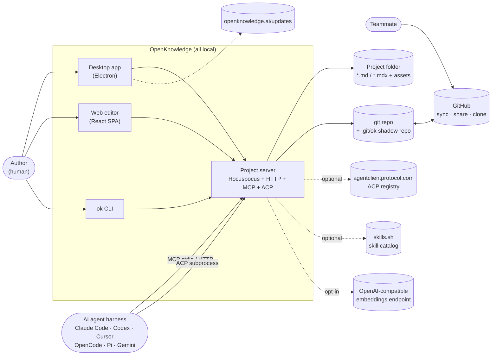

**Trust posture is part of the context.** `packages/server/src/ingress-policy.ts` +
`http/api-pipeline.ts` encode a loopback-only default with no server-side auth; exposing the server
off-machine requires an explicit `server.allowExternal` consent interlock that is deliberately
*per-machine and never committed to git*.

---

## 3. High-Level Structure — C4 Level 2

Seven workspace packages plus a docs site. The dependency direction is strictly one way:
`core` ← `server` ← `cli` ← `desktop`, with `app` depending on `core` + `server` types only.

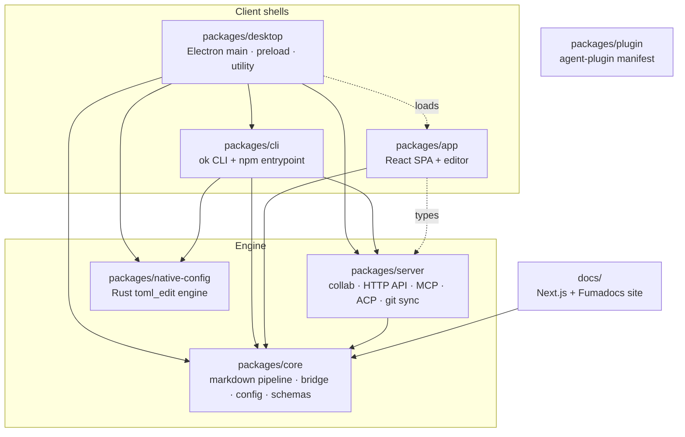

| Path | Package | Responsibility |
|---|---|---|
| `packages/core` | `@inkeep/open-knowledge-core` | The domain kernel. Markdown ⇄ ProseMirror pipeline (`src/markdown/`), the CRDT bridge (`src/bridge/`), TipTap fidelity extensions (`src/extensions/`), layered config schema (`src/config/`), Zod API schemas (`src/schemas/`), shadow-repo layout rules, skills catalog, i18n. Contains **no I/O policy** — it is imported by every other package. |
| `packages/server` | `@inkeep/open-knowledge-server` | The project server. Hosts Hocuspocus, the `/api/*` surface, the MCP server, the ACP thread manager, git persistence + the sync engine, and every index (backlinks, tags, derived documents, local targets). The largest and architecturally most significant container. |
| `packages/cli` | `@inkeep/open-knowledge` (**published**) | Commander v14 CLI (`ok`) with ~30 commands, plus the npm library entrypoint. Owns editor/MCP-config integration writing, GitHub auth, diagnostics, and the stdio MCP proxy (`src/mcp/`). |
| `packages/app` | `@inkeep/open-knowledge-app` | The React 19 SPA served at `/`. TipTap WYSIWYG + CodeMirror source mode, file tree, tabs, command palette, agent panel, terminal dock, settings. |
| `packages/desktop` | `@inkeep/open-knowledge-desktop` | Electron shell. `main/` (windows, menus, IPC, updater, terminals), `preload/` (context bridge), `utility/server-entry.ts` (hosts `bootServer()` in a `utilityProcess`), `shared/` (typed IPC contract). |
| `packages/native-config` | `@inkeep/open-knowledge-native-config` | Rust + napi-rs binding over `toml_edit`. Exists so MCP-config writes into a user's `.codex/config.toml` are **format-preserving** — comments and formatting survive byte-for-byte. |
| `packages/plugin` | `@inkeep/open-knowledge-plugin` | Data-only agent-plugin manifest (`plugin.json` + `mcp.json`) conforming to `agent-plugins.org` schemas. |
| `docs/` | `@inkeep/open-knowledge-docs` | The public documentation site (openknowledge.ai/docs). |

### Process model

Three deployment shapes share **one** boot path (`bootServer()` in `packages/server/src/boot.ts`,
whose own docblock names its three consumers):

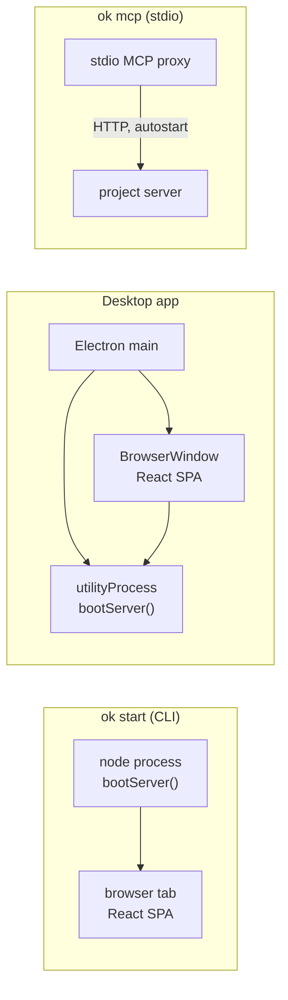

One server serves **everything on one port**: the SPA, `/api/*`, `/mcp`, and the `/collab` WebSocket.
Its URL is advertised through `.ok/local/server.lock`, which is how a second `ok start` reuses rather
than collides, and how the desktop app attaches.

---

## 4. Components — inside `packages/server`

The server is the container worth zooming into. Six clusters, drawn in the order a request traverses
them.

### 4.1 Transport and admission

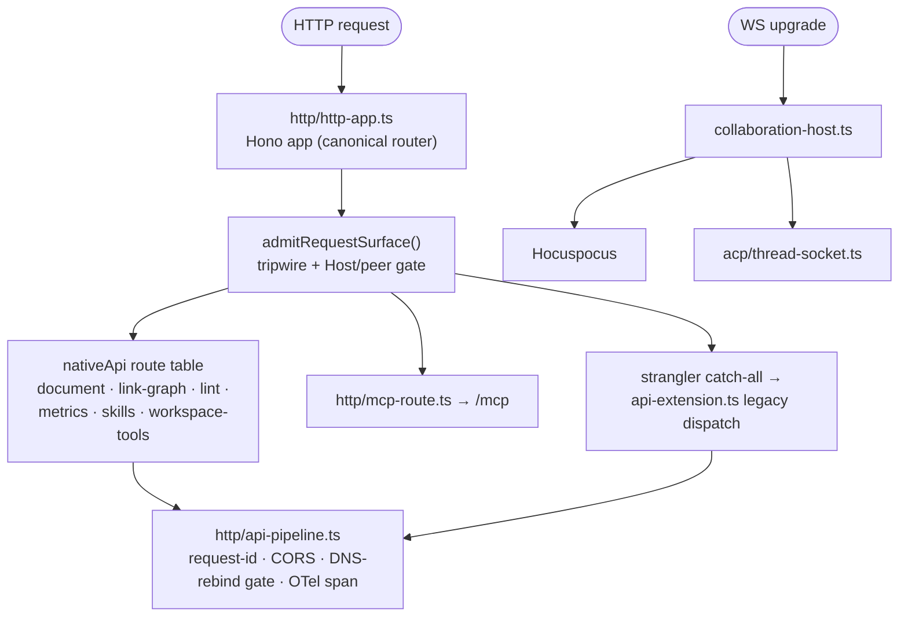

Two details worth naming, both documented in-source:

- **Strangler fig migration.** `http/http-app.ts` says it plainly: a Hono app owns top-level routing,
  and any surface not yet ported falls through a catch-all into the pre-existing raw-Node dispatch
  *byte-for-byte unchanged*. Routes migrate one group at a time (`document-routes.ts`,
  `link-graph-routes.ts`, `lint-routes.ts`, `metrics-routes.ts`, `skills-read-routes.ts`,
  `workspace-tools-routes.ts` have already moved).
- **One shared admission pipeline.** Because native routes sit *above* the catch-all they would
  bypass the legacy `onRequest` hook — a security regression. `api-pipeline.ts` was extracted so both
  route tables run the identical, order-sensitive gate chain.

### 4.2 The CRDT write spine

Every writer — human keystroke, agent MCP call, ACP `fs/write`, disk change from `git pull` — is
funnelled into the same Yjs document. This is the system's single most important design decision.

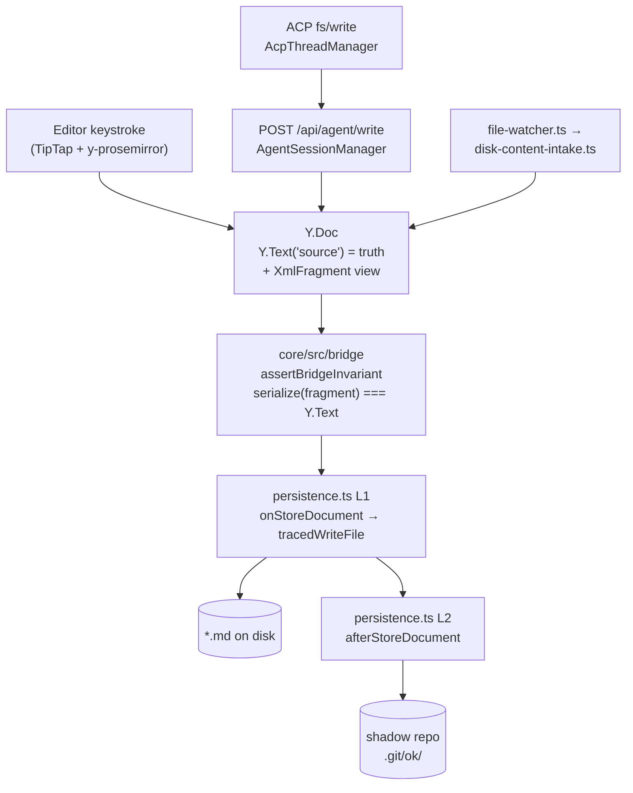

`persistence.ts`'s docblock states the contract: **Y.Text-is-truth** — the ProseMirror fragment's
serialization is the *comparator's right-hand side*, never the body of truth. Layer 1 debounces
CRDT→disk at 2 s (max 10 s); Layer 2 debounces disk→git at 15 s idle with exponential backoff under
git lock contention.

### 4.3 Indexes and derived state

All rebuildable, all cached under `.ok/local/cache/<branch>/`:
`BacklinkIndex` (`backlink-index.ts`), `TagIndex` (`tag-index.ts`), `DerivedDocumentIndex`
(`derived-document-index.ts`), `LocalTargetIndex` (`local-target-index.ts`), `CommentIndex`
(`comments/comment-index.ts`), the `basenameIndex` for wiki-embed resolution, and — opt-in —
`VectorCache` + `SemanticSearchService` under `embeddings/`.

### 4.4 The agent surface

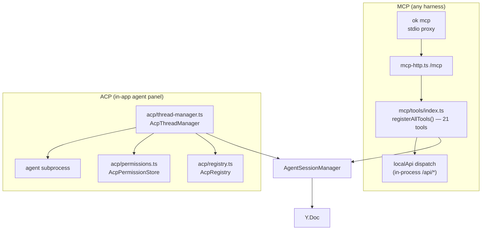

Both agent surfaces converge on `AgentSessionManager`, so *attribution works identically* whether an
agent writes through MCP or through an in-app ACP thread — the `AcpThreadManager` docblock is
explicit that markdown writes reuse `AgentSessionManager` sessions "so write-flash, activity panel,
and per-session undo all work exactly as MCP agent writes do."

### 4.5 Git, sync, and the shadow repo

The **shadow repo** (`shadow-repo.ts`) is a bare repo at `<gitdir>/ok/` with `core.worktree` pointed
at the project root. It stores per-writer WIP refs and checkpoints so the timeline/attribution
features never touch the user's staging area or history. `SyncEngine` (`sync-engine.ts`) is a typed
state machine doing background fetch/merge/push against GitHub, with `ConflictStore` holding merge
conflicts and `MaintenanceCoordinator` + `ShadowOpGate` serializing shadow operations.

### 4.6 Client push — CC1

`CC1Broadcaster` (`cc1-broadcast.ts`) pushes server-originated events to browsers over a synthetic
`__system__` Yjs document: `server-info`, `disk-ack`, `branch-switched`, config validation
rejections, derived-view updates. Payloads are Zod-validated and the contract is versioned
(`CC1_CONTRACT_VERSION`).

---

## 5. OOP & Class Architecture

The codebase is **function-first with a thin class layer**: classes are used exactly where there is
long-lived mutable state or a resource lifecycle to own. Everything stateless (the markdown
handlers, the bridge algorithms, config merging, path safety) is plain functions.

### 5.1 Composition root

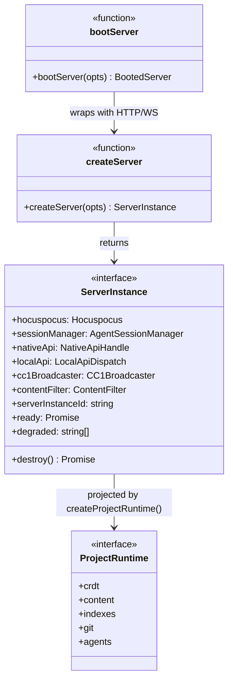

`ServerInstance` is the composition root's product; `ProjectRuntime` (`project-runtime.ts`) is a
deliberately **coarse-grained facade** over it. Its docblock is a textbook statement of the deep-module
principle: *"A seam is promoted to its own injection point only when a second implementation exists
to test it against — speculative seam placement is itself a retrofit risk."* Transport concerns
(port, routes, CORS, lock dir) are explicitly excluded.

### 5.2 Long-lived stateful services

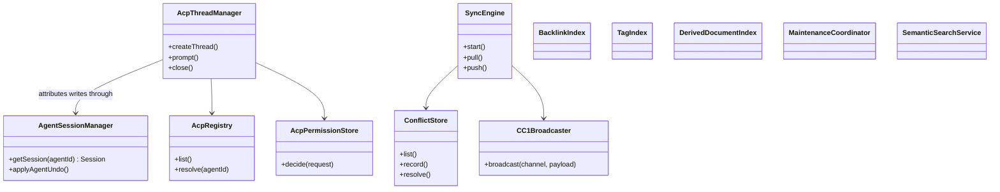

### 5.3 The document model

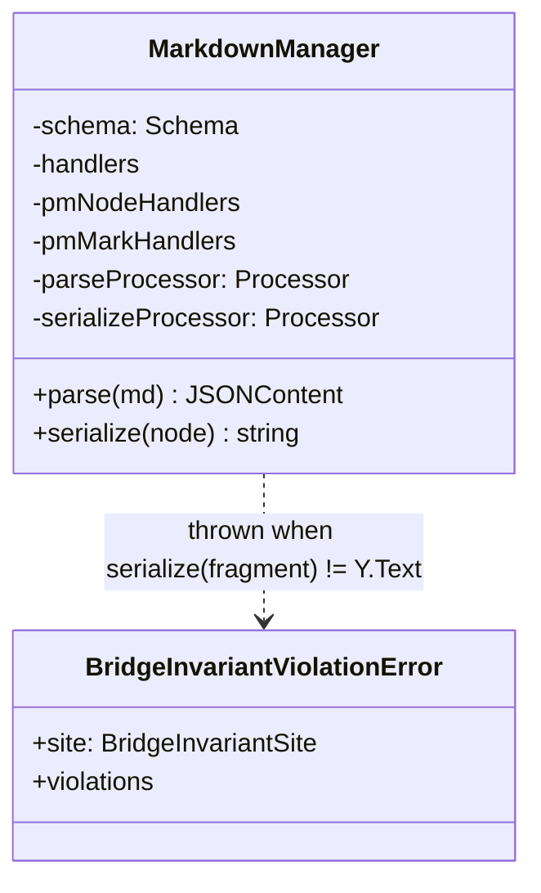

`MarkdownManager` (`core/src/markdown/index.ts`) is the deepest module in the system: a large
interior (a full `unified` parse pipeline, a ProseMirror schema built from ~30 fidelity extensions,
and two handler tables) behind essentially two methods. `md-manager.ts` in the server documents the
consolidation of five duplicate instances into one production singleton, on the grounds that the
class is *stateless with respect to document content*.

### 5.4 Patterns actually in use

| Pattern | Where it lives | Why |
|---|---|---|
| **Composition root** | `server-factory.ts` `createServer()` → `ServerInstance`; `boot.ts` wraps it in transport | One place assembles the object graph; three consumers (CLI, Electron utility, tests) share it |
| **Facade / deep module** | `project-runtime.ts` `ProjectRuntime` | Capability services build against a coarse boundary instead of constructor internals |
| **Extension (host-plugin)** | Hocuspocus `Extension`s: `createApiExtension()`, the persistence extension, `createConflictLifecycleSeedExtension()` | Lets the same HTTP API work under both the production server and the Vite dev plugin |
| **Registry** | `mcp/tools/index.ts` `registerAllTools()`; `AcpRegistry`; `core/src/registry/` `createRegistry()` (JSX components); `CHECKPOINT_KIND_REGISTRY` | Adding a tool/agent/component is a registration, not a fork |
| **Strangler fig** | `http/http-app.ts` Hono app over the legacy raw-Node dispatch | Incremental router migration with byte-for-byte parity |
| **Observer / broadcaster** | `CC1Broadcaster`, `AgentFocusBroadcaster`, `AgentPresenceBroadcaster`, `server-observers.ts` | Server-originated push over the CRDT transport |
| **Bridge / adapter** | `core/src/bridge/` between `Y.Text` and the ProseMirror fragment | The core translation with an asserted invariant |
| **Command** | `packages/cli/src/commands/*.ts`, each exporting a `Command` factory | Commander tree assembled in `cli.ts` |
| **State machine** | `SyncEngine`; `ReadinessState` (`pending`/`ready`/`failed`/`draining`) | Explicit lifecycle over implicit booleans |
| **Typed error hierarchy** | ~40 named `Error` subclasses (`ManagedRename*Error`, `Git*Error`, `Single File*Error`, `BridgeMergeContentLossError`, …) | Errors carry the recovery instruction, not just a string |

### 5.5 Executable architecture rules

Worth calling out because it is unusual: `biome-plugins/` holds **22 custom GritQL lint plugins** that
encode architectural invariants as CI-enforced rules — `no-blind-agent-host-fanout.grit`,
`no-loosely-typed-webcontents-ipc.grit`, `no-unportaled-editor-content.grit`,
`class-proof-registration-discipline.grit`, `require-windowshide-on-spawn.grit`,
`no-roundtrip-identity-oracle.grit`. Design intent that would ordinarily rot in a doc is compiled
into the linter.

---

## 6. Key Flows

### 6.1 Representative end-to-end: an agent writes a document

Traced through `mcp/tools/write.ts` → `http/local-api-dispatch.ts` → `api-extension.ts` →
`agent-sessions.ts` → `persistence.ts`.

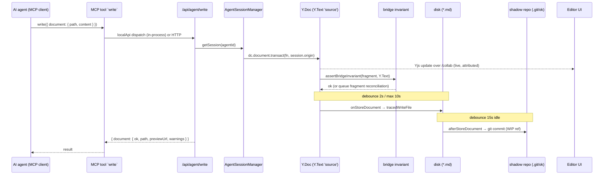

The per-session **frozen transaction origin** is load-bearing: because each agent session mints its
own origin at birth, the UI can flash the right author colour, the activity panel can attribute the
change, and per-session undo can be scoped — all from one mechanism.

### 6.2 External change intake (`git pull`, or you edit in Vim)

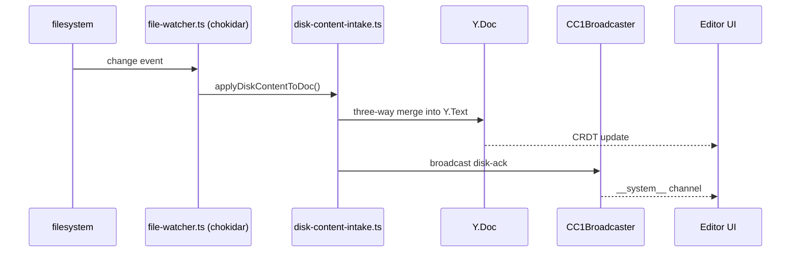

### 6.3 Boot

`ok start` → `bootStartServer()` → `bootServer()` → `createServer()`: git preflight
(`assertGitAvailable`) → ingress policy → `ProjectRuntime` construction → shadow-repo init +
file-watcher subscription (`ready`) → post-readiness generated-index sweep. Subsystems that fail
init are collected into `ServerInstance.degraded` rather than aborting boot — a real availability
choice, reported over `/readyz`.

---

## 7. Extension Points

| Extension point | Mechanism |
|---|---|
| **New MCP tool** | Create `packages/server/src/mcp/tools/<name>.ts` exporting `register(...)`, then call it from `mcp/tools/index.ts`. The file's own docblock states this as the procedure. |
| **New agent harness** | Zero code for MCP harnesses — `packages/cli/src/integrations/` + `EDITOR_TARGETS` write the harness's config file surgically. ACP agents come from the runtime-fetched registry (`acp/registry.ts`); unlisted ones from `.ok/local/acp-agents.json`. |
| **Agent Skills** | `packages/server/assets/skills/` ships skill packs (`codebase-wiki`, `entity-vault`, `knowledge-base`, `okf`, `plain-notes`, `software-lifecycle`, `worldbuilding`, `writing-pipeline`). Third-party skills import from skills.sh / git / local path into `.agents/skills/` with provenance in `.ok/skills-lock.json`. Procedural guidance ships as skills *deliberately instead of* as MCP tools, to avoid tool-list token cost. |
| **Markdown node / mark** | Add a TipTap extension in `core/src/extensions/`, register it in `shared.ts`, and add the mdast⇄PM handler pair in `core/src/markdown/`. |
| **JSX components in documents** | `core/src/registry/built-ins.ts` — the component registry driving `palette` and the prop panels. |
| **Content rules** | `contentRules.markdownlint` (native `.markdownlint.*`) and `contentRules.frontmatter` (JSON Schema files mapped by glob) — both project-committed, both off by default. |
| **Config** | Layered YAML: CLI flags > env > `.ok/local/config.yml` > `.ok/config.yml` > `~/.ok/global.yml` > Zod defaults. Field registry in `core/src/config/field-registry.ts`; a `schema-snapshot.json` is drift-checked in CI. |
| **Themes** | base16 palettes in `appearance.customTheme`; saved themes persisted server-side (`saved-themes-store.ts`). |
| **Hocuspocus extensions** | Anything implementing `Extension` can join `createServer()`'s stack. |

---

## 8. Key Abstractions / Glossary

| Term | Meaning |
|---|---|
| **Content dir** | The folder treated as the knowledge base (`content.dir`, default the project root). Everything outside is invisible to editor, search, and agents. |
| **`.ok/`** | Project directory. `.ok/config.yml` is committed; `.ok/local/` is machine-local and gitignored (server lock, principal, sync state, caches, telemetry). |
| **Bridge** | The `Y.Text('source')` ⇄ ProseMirror-fragment translation layer (`core/src/bridge/`) and its invariant `serialize(fragment) === Y.Text`. |
| **Y.Text-is-truth** | The rule that `Y.Text('source')` holds the canonical bytes; the fragment is a derived view used as the comparator's RHS. |
| **Shadow repo** | Bare git repo at `<gitdir>/ok/` holding per-writer WIP refs, checkpoints, and upstream imports. Powers timeline, attribution, and recovery without touching the user's index or history. |
| **Checkpoint** | A project-wide restore point committed into the shadow repo; addressed by SHA. |
| **Principal** | The local writer identity (`.ok/local/principal.json`) used for edit attribution. |
| **Writer id** | Namespaced actor on a shadow commit (`agent-*` for agent sessions), the basis of per-session undo and the activity panel. |
| **CC1** | The versioned server→client push contract carried over the synthetic `__system__` Yjs document. |
| **MCP** | Model Context Protocol — the 21-tool agent-facing API (`mcp/tools/`). |
| **ACP** | Agent Client Protocol — the in-app agent panel's protocol; OK spawns the agent as a subprocess and acts as the ACP *client*. |
| **Skill** | A folder with `SKILL.md` loaded by an agent harness on description match. One real source folder plus managed copies/symlinks at editor-specific locations. |
| **Ingress policy** | The boot-built object gating HTTP, WS upgrade, and per-route admission — one object so the surfaces cannot disagree. |
| **Derived index** | Any rebuildable lookup structure (backlinks, tags, basenames, local targets, vectors) cached under `.ok/local/cache/<branch>/`. |
| **OKF** | OpenKnowledge Format — the optional structured-project convention validated by `lint/okf-project-validator.ts`. |

---

## 9. Open Questions & Notes

**Method.** Explain mode, read from the clone at `main` @ `30397303`. This codebase carries
unusually rich module docblocks; where a claim above quotes intent (Y.Text-is-truth, the strangler
migration, the `ProjectRuntime` grain rationale, ACP write attribution) it is paraphrasing an
in-source comment, not inferring from structure. Claims were traced through file headers and public
interfaces; I did not read most function bodies.

**Determined by reading, but worth verifying against a running system:**

1. **Debounce and backoff numbers** (L1 2 s/10 s, L2 15 s idle, 32× backoff) come from
   `persistence.ts`'s docblock. Defaults are configurable (`commitDebounceMs`); I did not confirm the
   runtime values.
2. **"21 tools"** is the count stated in `docs/content/reference/mcp.mdx`; `mcp/tools/` holds 24
   non-test `.ts` files, several of which are shared helpers (`shared.ts`, `verb-schemas.ts`,
   `path-safety.ts`, `advisory-warnings.ts`). The two are consistent, but the authoritative count is
   whatever `registerAllTools()` registers.

**Not determined from the evidence:**

3. **Strangler migration progress.** Six route groups are natively routed; I did not enumerate how
   much still falls through the legacy dispatch in `api-extension.ts`, nor whether a deletion date is
   planned.
4. **`packages/plugin` version skew.** It sits at `0.3.1` while the fixed group is at `0.66.2`, and it
   contains only `plugin.json` + `mcp.json`. Whether it is independently released or vestigial is not
   determinable from the repo.
5. **Public-mirror allowlist.** `AGENTS.md` states this repo is *generated from an allowlist* and that
   source-only folders may be absent. Some architectural surface may therefore exist upstream and not
   here — nothing in the clone looked truncated, but the doc cannot rule it out.
6. **Concurrency limits.** `AgentSessionCapacityError` implies a session cap and
   `agent-sessions.eviction.test.ts` implies eviction; the actual policy and limits were not read.
7. **Rust ↔ Node boundary.** `packages/native-config` is used for TOML MCP-config writes. Whether the
   JS fallback path (`commands/mcp-toml-surgical-write.test.ts` exists) is a full equivalent or a
   degraded mode was not established.
