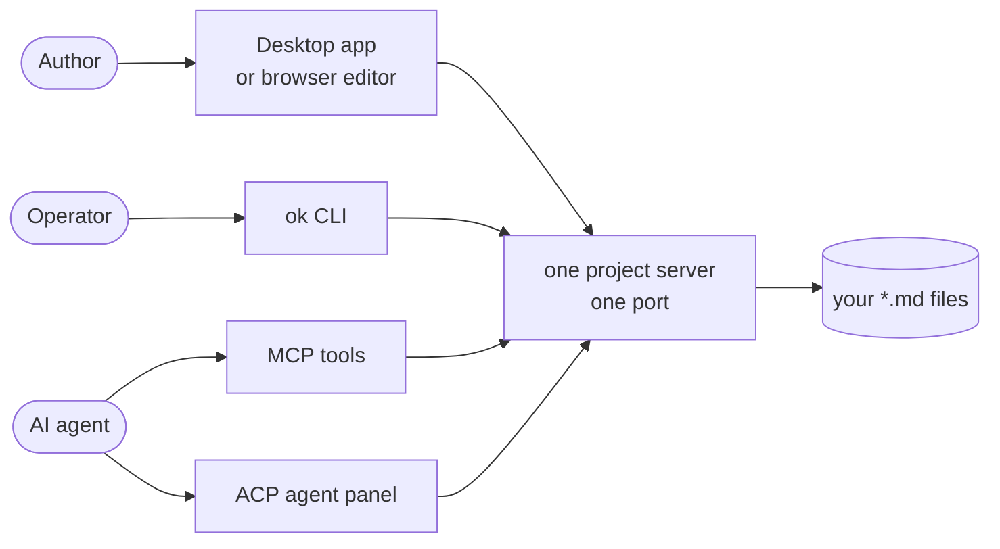
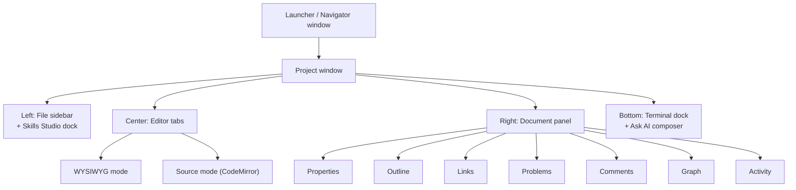
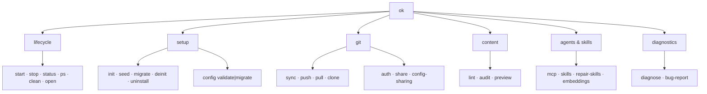
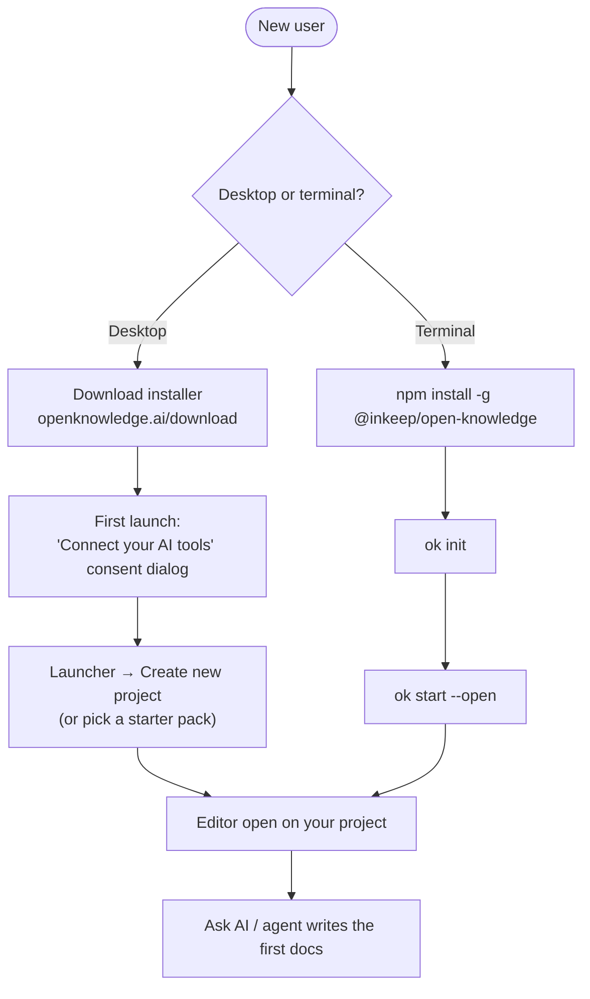
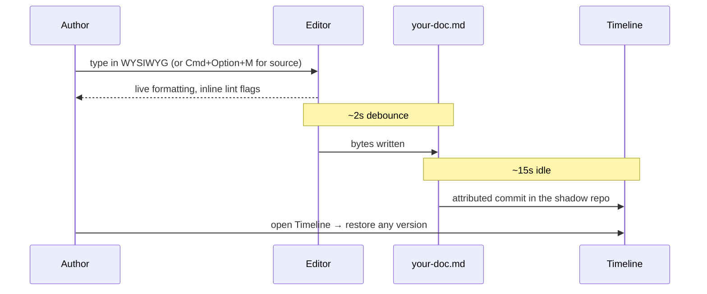
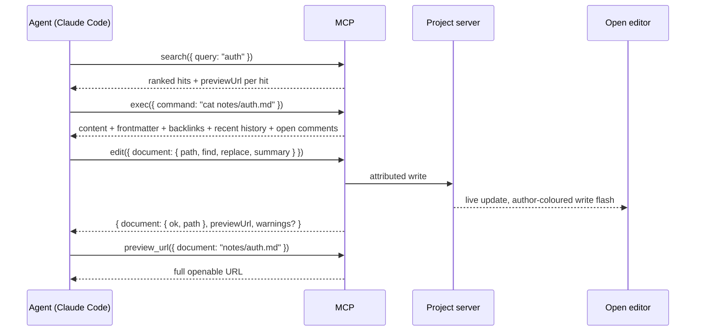
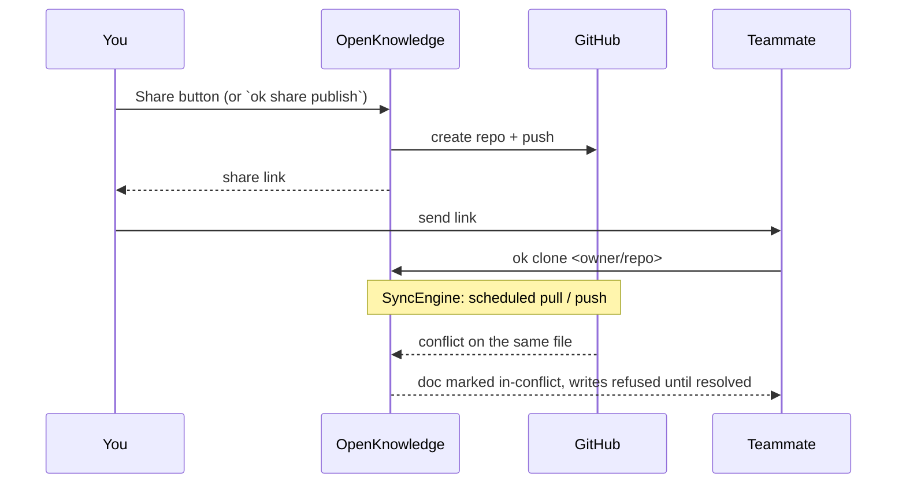
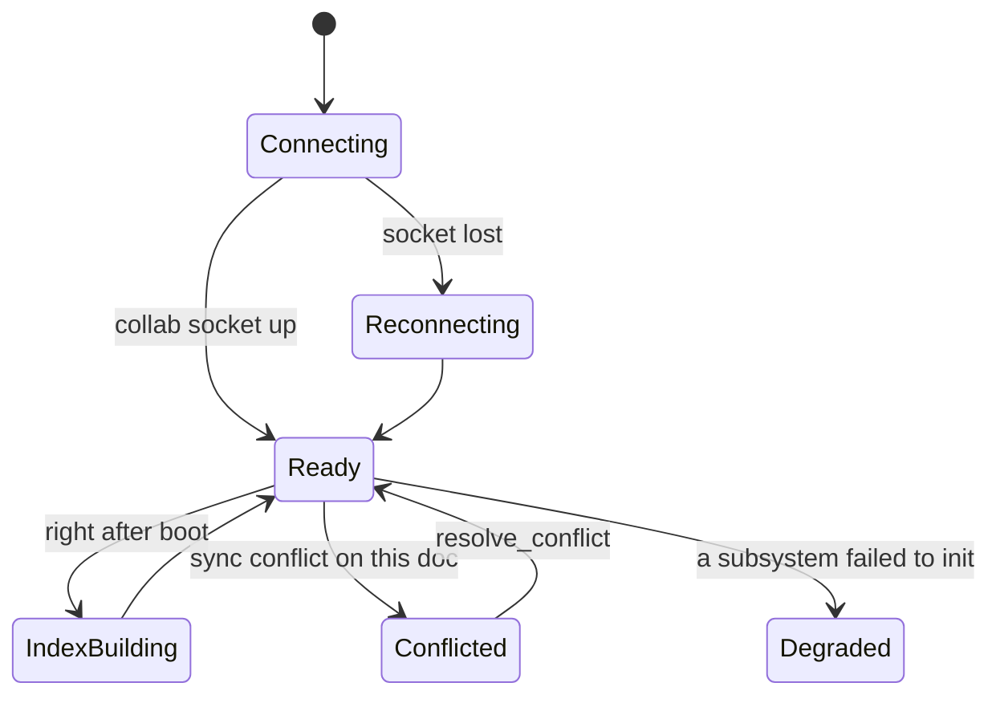

> Source: <https://github.com/inkeep/open-knowledge> (local clone, branch `main`, `30397303`, v0.66.2) · Date: 2026-08-29 · Mode: Explain · Surface: Hybrid (GUI + CLI + Agent API)
> See also: [System & OOP Architecture](/case-studies/apps/open_knowledge_system_oop_architecture/)

---

## Cheat Sheet

**Get running** (every command verified in §2.2)

```bash
npm install -g @inkeep/open-knowledge   # or download the desktop app
cd your-project
ok init                                 # scaffold .ok/ + wire up your AI editors
ok start --open                         # serve editor + API + MCP + collab on one port
ok notes.md                             # open one loose file, no project needed
ok status                               # is a server running for this project?
ok sync                                 # commit, pull, push
```

**Editor keys** (§2.1)

| Key | Action |
|---|---|
| `Cmd+P` | Command palette (always) |
| `Cmd+K` | Command palette — or add a link when text is selected |
| `Cmd+Option+M` | Toggle WYSIWYG ⇄ source |
| `Cmd+L` | Ask AI composer |
| `Cmd+J` / `` Ctrl+` `` | Show/hide terminal |
| `/` | Slash insert menu |

**Agent tools** (§2.3 — the 21-tool MCP surface; these five carry most traffic)

```jsonc
exec  { "command": "cat notes/auth.md", "cwd": "/abs/project" }   // read + frontmatter + backlinks + history
search{ "query": "token refresh" }                                 // ranked workspace search
write { "document": { "path": "notes/auth.md", "content": "…" } }  // create / overwrite
edit  { "document": { "path": "notes/auth.md", "find": "…", "replace": "…" } }
links { "kind": ["dead", "orphans", "hubs"] }                      // graph health
```

---

## 1. Overview

OpenKnowledge turns any folder of Markdown into a knowledge base you can edit three ways —
**a WYSIWYG editor**, **any AI agent**, and **your own text editor** — all against the same files on
disk. Nothing is locked in a database; git is the only persistence dependency.

### Surface type: **Hybrid**, with four distinct consumers

| Surface | User | Evidence |
|---|---|---|
| **GUI app** | Author | `packages/app/src/App.tsx` (React SPA), `packages/desktop/` (Electron), `docs/content/features/editor.mdx` |
| **CLI** | Operator at a terminal | `packages/cli/src/cli.ts` — Commander v14 program named `open-knowledge`, `bin: { ok, open-knowledge }` |
| **Agent API (MCP + ACP)** | Autonomous agent | `packages/server/src/mcp/tools/index.ts` (21 tools), `packages/server/src/acp/` |
| **Web API** | Remote MCP client / browser | `/mcp`, `/api/*`, `/collab` on one port; `docs/content/remote-control/` |

A fifth surface exists but is **not** a public one: `packages/cli/src/index.ts`'s programmatic exports
say so in their first line — *"Public surface consumed by `@inkeep/open-knowledge-desktop` from
Electron main."* Treat the npm package as a CLI + MCP server, not an SDK.

**How the user reaches the system.** Everything runs locally. Whichever door you come in
through — desktop window, browser tab, terminal, or agent — you land on the same project server, and
the same bytes on disk.



---

## 2. Surface Map

### 2.1 GUI — the editor



Navigation is **hash-based** inside one SPA — there is no multi-page router. Verified prefixes in
`packages/app/src/lib/doc-hash.ts`:

| Route | Destination |
|---|---|
| `#/<path/to/doc>` | A document (per-segment percent-decoded) |
| `#/<doc>#<anchor>` | A document scrolled to a heading |
| `#/__asset__/<path>` | An asset viewer (image, PDF, video, audio) |
| `#/__skills__` | The Skills hub, full pane |
| `#/__skill__/<name>` | A global skill |
| `#/__skill-file__/<…>` | One file inside a skill bundle |
| `#/__skill-preview__/<…>` | A pre-install skill preview |
| `#/<folder>/.ok/templates/<name>` | A folder template |

**Keyboard surface** (from `docs/content/features/editor.mdx`; on Windows/Linux `Ctrl` for `Cmd`,
`Alt` for `Option`):

| Key | Action |
|---|---|
| `Cmd+P` | Command palette from anywhere (works with text selected) |
| `Cmd+K` | Command palette — or add/edit a link when text is selected |
| `Cmd+T` / `Cmd+1`…`Cmd+8` / `Cmd+9` / `Cmd+Shift+T` | New tab / jump to tab / last tab / reopen closed |
| `Ctrl+Tab` / `Ctrl+Shift+Tab` | Next / previous tab |
| `Cmd+Option+S` / `Cmd+Option+B` | Show-hide left sidebar / right document panel |
| `Cmd+Option+M` | Toggle visual ⇄ source editor, keeping your place |
| `Cmd+Option+E` | View in source — jump to the Markdown behind the block at the cursor |
| `Cmd+F` / `Cmd+Option+F` (`Ctrl+H`) / `Cmd+G` | Find / find-and-replace / next match |
| `Cmd+J`, `` Ctrl+` ``, `Cmd+Shift+J` | Terminal: toggle / toggle / new tab (with a selection: stage the passage) |
| `Cmd+L` | Ask AI composer |
| `Cmd+Shift+M` / `Cmd+Shift+Enter` | Comment on selection / send checked comments to an agent |
| `Cmd+N` / `Cmd+Shift+N` / `Cmd+D` / `Cmd+Delete` | New file / new folder / duplicate / move to trash |
| `Cmd+O` / `Cmd+Shift+P` | Open folder / switch project |
| `Cmd+Shift+D` | Start a bug report (desktop) |
| `/` in the body | Slash insert menu (headings, tables, callouts, math, `mermaid`, `html preview`) |

**Settings** (`packages/app/src/components/settings/`) is a dialog with four nav groups —
`user`, `project`, `plugins`, `integrations` — carrying these sections: Account, AI Tools, Attachments,
Built-in Skills, Configure Agents, Content Rules, Hotkeys, Integrations, Link Previews, Linting,
Network Access, Okignore, Project AI Tools, Project Skill, Project Templates, Search, Sharing, Skills
Manager, Slides Plugin, Sync, Templates Manager, Terminal, Theme Plugin.

### 2.2 CLI — the `ok` command tree



| Command | What the user does with it |
|---|---|
| `ok` | Launch the desktop app; falls back to `ok start` if it isn't installed |
| `ok <file.md>` | Open one Markdown file — an ephemeral session if it is outside any project |
| `ok start` | Start the server: UI + API + MCP + collab on one port. `-p/--port`, `--bind`, `--idle-shutdown`, `--only server`, `--mode app`, `--no-open-browser` |
| `ok init` | Scaffold `.ok/` and register the MCP server with detected editors. `--mcp/--no-mcp`, `--content-dir`, `--skills`, `--no-skills`, `--json` |
| `ok open <target>` | Open a doc, folder, or skill in the app. `--skill`, `--project <dir>` |
| `ok stop` / `ok status` / `ok ps` / `ok clean` | Stop this project's server / report state / list every running server (`--json`) / prune a stale lock |
| `ok mcp` | Run the MCP stdio server for this project — what editor configs point at |
| `ok sync` / `ok push` / `ok pull` | Commit-pull-push / push / pull (`--json` emits JSONL progress) |
| `ok clone <owner/repo>` | Clone from GitHub and open it |
| `ok auth login\|status\|repos\|pat\|signout\|git-credential` | GitHub authentication |
| `ok share owners\|name-check\|publish` | Publish-to-GitHub flow (the editor's Share button spawns this) |
| `ok config-sharing share\|unshare\|status` | Commit OK's config with the content, or keep it out of git |
| `ok lint` | Headless Markdown lint of a project, folder, or file (`--json`) |
| `ok audit` | Unified validation audit — lint + broken internal links (`--json`) |
| `ok preview` | Show what content the watcher will track (read-only) |
| `ok seed` | Scaffold a starter pack |
| `ok skills installed\|import <source>` | List skills across all agents / import one (`--json`) |
| `ok repair-skills` | Force the project + user-global `SKILL.md` reclaim sweep |
| `ok embeddings set-key\|clear-key\|status` | Semantic-search provider key (`--json`) |
| `ok config validate\|migrate` | Check the merged config / drop retired keys (`--scope`, `--dry-run`) |
| `ok migrate notion [dir]` | Clean a Notion export in place (dry-run unless `--apply`) |
| `ok diagnose process\|bundle\|health` | Diagnostic bundles and health checks (`--json` NDJSON) |
| `ok bug-report` | Generate a redacted diagnostic zip |
| `ok deinit` / `ok uninstall` | Reverse one project's footprint / reverse OK's whole outside-project footprint (`--dry-run`, `--yes`, `--json`) |

Global flags on every command: `--cwd <path>`, `--log-level <silent\|error\|warn\|info\|debug\|trace>`,
`--color` / `--no-color`, `--version`.

Two commands are deliberately hidden from `--help`: `ok cowork` (an unadvertised Claude-Desktop
escape hatch, `{ hidden: true }`) and `ok ui` (a tombstone that exits 1 with "run `ok start` instead").

### 2.3 Agent API — MCP tools

21 tools, from `docs/content/reference/mcp.mdx` and `packages/server/src/mcp/tools/index.ts`. Every
tool takes a `cwd` (an absolute path inside the target project) selecting which project the call
lands on.

| Group | Tools |
|---|---|
| **Read** | `exec`, `search`, `links`, `history`, `skills`, `config`, `palette`, `preview_url`, `share_link`, `lint`, `audit` |
| **Write** | `write`, `edit`, `delete`, `move`, `install`, `import`, `checkpoint`, `restore_version` |
| **Conflicts** | `conflicts`, `resolve_conflict` |

The four write verbs are **polymorphic CRUD over a target**: `write`/`edit`/`delete` nest per-target
fields inside the address key and take exactly one target per call — `document`, `folder`, `template`,
`skill`, plus `asset` on `write`/`delete` and a `documents` batch on `write`. `move` takes flat
`from`/`to` and auto-detects the kind.

`exec`, `config`, and `palette` answer straight off disk with no server; every other tool routes
through the project server, which auto-starts on the first call that needs it (gated by
`OK_MCP_AUTOSTART`).

### 2.4 Agent API — ACP (in-app agents)

Agents run *inside* the app in the Agents panel. The catalog comes from the Agent Client Protocol
registry at runtime (`packages/server/src/acp/registry.ts`), with featured ids pinned:
`claude-acp`, `codex-acp`, `gemini`, `cursor`, `github-copilot-cli`, `opencode`. Unlisted agents come
from a machine-local `.ok/local/acp-agents.json` — deliberately never committed, so a teammate's clone
cannot inject a spawnable command onto your machine.

### 2.5 Web API

Not a documented public REST API — it is the SPA's own backend plus the remote MCP endpoint. The two
addresses a user is told about:

| Endpoint | Purpose |
|---|---|
| `https://<external-url>/` | The editor in a browser |
| `https://<external-url>/mcp` | Streamable-HTTP MCP for remote agents |

Behind them sit `/collab` (Yjs WebSocket), `/readyz`, and ~40 `/api/*` routes (`/api/documents`,
`/api/search`, `/api/backlinks`, `/api/history`, `/api/lint`, `/api/skills/*`, `/api/config`,
`/api/server-info`, …). These are internal to the app and versioned with it; treat them as unstable.

---

## 3. Entry & Onboarding

Two install paths, one destination.



**Smallest hello world:**

```bash
cd any-folder-with-markdown
ok notes.md
```

That needs no project at all. `ok init` asks exactly two questions — where to register the MCP server
(user, project, or both) and whether to commit OK's config alongside your content or keep it local to
this machine. First launch of the desktop app asks one consent question covering MCP registration and
whether to put `ok` on your `PATH`.

**What onboarding does for you, and what it asks first.** `ok init` writes MCP entries into whichever
editors it detects — Claude Code, Claude Desktop, Cursor, Codex, OpenCode, OpenClaw, Pi, Antigravity,
LM Studio, Hermes. The write is *surgical*: only its own entry, with your comments and formatting
preserved (this is the reason `packages/native-config` exists as a Rust `toml_edit` binding). A config
it cannot parse safely is left byte-for-byte untouched and reported as `left unchanged (<reason>)`
rather than rewritten.

**Prerequisites are checked, not assumed.** Node ≥ 24 and `git` — `ok start` runs a git preflight and
exits `78` with a fix instruction if git is missing or too old.

---

## 4. Key User Journeys

### 4.1 Author writes; the file on disk changes



No save button, ever. Two debounces separate "the file is current" from "the version is checkpointed",
and the Timeline panel is where the second one becomes visible.

### 4.2 Agent edits a doc while the author watches



The author sees the change land *while it lands*, coloured and attributed to that agent, with the
Activity panel showing the diff — not a file that silently changed under them.

### 4.3 Sharing with a teammate



Auto-sync is a per-machine choice with three modes — **Manual** (`off`), **Auto (Pull only)**
(`follow`), **Auto (Pull and Push)** (`full`) — surfaced by an onboarding modal the first time you open
a project with a remote. A maintainer can pre-answer it for everyone via a committed `autoSync.default`.

---

## 5. Interaction & State

### 5.1 GUI states



What the author actually sees: a **Connecting banner** while the socket is down; a **branch-recycle
banner** after a branch switch invalidates open documents; **tinted rows with count badges** in the
file sidebar for docs with validation problems (clicking the badge opens the Problems panel on that
file); inline lint squiggles as you type; and a **write flash** in the agent's colour when an agent
edits the doc you are looking at. Boot is not binary — a subsystem that fails to initialize is
collected into a degraded list and reported on `/readyz` rather than aborting the server.

### 5.2 CLI contract

| Exit code | Meaning |
|---|---|
| `0` | Success — including "a server is already running", which prints its URL and exits 0 rather than colliding |
| `1` | Command failed |
| `2` | Timeout / abnormal termination (diagnose paths) |
| `78` | `EX_CONFIG` — a configuration-shaped refusal: bad env var, git missing or too old, or exposure attempted without the `server.allowExternal` consent interlock |

**Stream discipline is a real contract, not a convention.** `ok mcp` speaks JSON-RPC on stdout, so
every advisory the CLI prints — the resolved project root, retired config keys, ignored committed
keys — goes to **stderr**. `--json` is available on ~20 commands; several long-running ones
(`sync`, `push`, `pull`, `clone`, `auth login`) emit **JSONL progress events** instead of a single blob,
and `diagnose health` emits NDJSON, one check result per line.

### 5.3 Agent-facing error contract

The MCP surface reports three distinct kinds of "not simply fine":

1. **Refusals.** A mutating tool refuses a doc whose sync state is `conflict`, and points at
   `conflicts({ kind: "content" })` → `resolve_conflict` as the recovery path.
2. **Advisory warnings.** `write`/`edit` results may carry a `warnings` array discriminated by `kind`:
   `content-divergence` and `disk-edit-reconciled` mean the stored doc differs from what the call
   composed (re-read before editing further); `mermaid-parse-error` means the write landed but the
   fence will not render.
3. **Not-ready, distinguished from empty.** Right after boot, `search` returns an empty result set
   with `ready: false` — explicitly *not* the same as "no matches". Retry rather than concluding.

Output is capped rather than truncated silently: audits cap at 10 files × 10 diagnostics with
**accurate totals** and an `omittedWarningCount`. `lint` and `audit` also return `ran`, naming which
check families actually executed — a family absent from `ran` was not checked, so the agent can tell
"clean" from "not looked at".

---

## 6. Information Architecture / API Ergonomics

**One port, one URL.** The server serves the SPA, `/api/*`, `/mcp`, and `/collab` from a single
listener, advertised in `.ok/local/server.lock`. A second `ok start` reads that lock, prints the
running URL, and exits 0. This is why "which port is my thing on" never comes up.

**Project resolution is uniform.** CLI commands invoked from a subdirectory walk up to the nearest
enclosing `.ok/config.yml` — the same rule the MCP server uses — and *disclose the resolved root on
stderr*, because a monorepo root with `content.dir: .` is a large surprise if it happens silently.

**Naming.** CLI verbs are ordinary and paired (`init`/`deinit`, `start`/`stop`, `push`/`pull`,
`share`/`unshare`). Two distinct namespaces are kept deliberately apart:
`ok share …` publishes to GitHub, `ok config-sharing …` toggles whether OK's own config is committed.

**Convention over configuration.** Links are plain relative Markdown links (`[text](./sibling.md)`) —
no wiki-link dialect to learn, and they stay portable to GitHub, Obsidian, and VS Code. Backlinks are
never written by hand; they are computed.

### AX note — the surface as an agent experiences it

A likely consumer here is autonomous, and the design shows several deliberate accommodations:

- **Enriched reads collapse round trips.** `exec` does not just `cat` — every read returns frontmatter,
  backlinks, recent history, open comments, and (with the frontmatter plugin on) the JSON Schema files
  governing the doc. One call answers what would otherwise be five.
- **Guidance is not a tool.** `mcp/tools/index.ts` states the reasoning explicitly: procedural
  workflows ship as **skill guidance** (`packages/server/assets/skills/`) loaded on description match,
  *"rather than costing tool-list tokens every turn."* Token economy is an architectural constraint here,
  not an afterthought.
- **Polymorphic verbs over a tool-per-noun sprawl.** Four write verbs replaced eight narrower tools;
  the one soft constraint ("exactly one target") is enforced by a **teaching error** rather than a
  schema rejection.
- **Errors that teach the next move.** Conflict refusals name the recovery call. `ready: false`
  distinguishes cold-index from empty. `ran` distinguishes clean from unchecked.
- **Output mirrors input.** `write({ folder })` returns `{ folder: {…} }`; a batch returns
  `{ documents: [ … ] }`. The response shape is predictable from the call shape.
- **Preview URLs respect the human.** Read/write tools return *route-only* `previewUrl`s to identify a
  doc; opening one requires a deliberate `preview_url` call, and that call carries an `autoOpen`
  boolean reflecting the user's preference — resolved fresh every call, so a mid-session toggle
  propagates within one call. An agent that respects it does not steal the user's browser.

For a full evaluative AX audit rather than this description, use the `ax-interface` lens.

---

## 7. Configuration & Customization

**Three YAML layers, scoped by intent** (`docs/content/reference/configuration.mdx`):

| File | Scope | Committed? |
|---|---|---|
| `.ok/config.yml` | This project, shared with the team | yes |
| `~/.ok/global.yml` | Every project, this user | n/a |
| `.ok/local/config.yml` | This project, this machine | no (gitignored) |

Precedence: **CLI flags > env vars > project-local > project > user > defaults**. Leaf values override;
arrays replace rather than concatenate. A key set in a file *more specific than its declared scope* is
ignored — and named on stderr with its per-machine fix, because a committed `server.bind` would
otherwise refuse to boot for every teammate who clones.

**Three ways to edit the same thing:** the Settings dialog (`Cmd+,`), your IDE (the file ships a
`$schema` comment for autocomplete and inline descriptions), or `ok config validate`. Edits anywhere
reflect everywhere — an open Settings pane refreshes live.

**What is actually tunable:** content dir and attachment folder; content rules (markdownlint,
frontmatter JSON Schemas, link validation severity); appearance (light/dark, 13 UI languages, base16
color themes including a custom editor, sidebar toggles); auto-sync mode and intervals; server bind /
port / external URL / exposure consent / idle shutdown; editor preferences (word wrap, preview tabs,
agent preview auto-open); terminal enable + Windows shell override; semantic search (endpoint, model,
dimensions); link previews; telemetry local sink (size caps and an attribute denylist); Slidev plugin.

**Retired keys are handled, not ignored.** A key the schema no longer reads is dropped from the loaded
config and *reported with its replacement*; `ok config migrate --scope … --dry-run` removes them for
you, and refuses to invent a translation where the replacement is not one-to-one.

**Two customization surfaces beyond config:** `.okignore` (gitignore syntax, honoured alongside
`.gitignore`, picked up live without a restart) controls what the editor, search, and agents can see;
and folder-level `.ok/frontmatter.yml` + `.ok/templates/` give a folder its own properties and its own
new-document templates, resolving leaf-to-root.

**Egress is opt-in and enumerated.** `docs/content/reference/what-open-knowledge-writes.mdx` lists
every file written and every byte that leaves the machine. Nothing about your content leaves by
default; semantic search, diagnostic bundles, GitHub sync, and link previews are each individually
opt-in or on-demand, and each names its egress in the config table itself.

---

## 8. Open Questions & Notes

**Method.** Explain mode, from the clone at `main` @ `30397303`. The CLI tree and MCP catalog were
enumerated from source (`packages/cli/src/cli.ts` + `commands/*.ts`,
`packages/server/src/mcp/tools/index.ts`); GUI behaviour, shortcuts, and config semantics come from
`docs/content/` — which is shipped *from this repo*, so it is first-party evidence, but it is
documentation rather than code and could lag the implementation.

**Not verified by running the software:**

1. **No live run.** I did not build or start the app, so nothing here is confirmed against actual
   rendered UI or actual `--help` output. Flag lists per command were read from `.option()` calls; I
   enumerated flags exhaustively only for `init`, `start`, `open`, `sync`, and the `--json` family.
2. **Shortcut coverage is the documented set.** `HotkeysSection.tsx` exists in Settings, implying
   shortcuts are user-remappable. Whether the table in §2.1 is the complete registry, and what the
   remapping surface allows, was not determined.
3. **Command palette contents.** `command-palette-commands.ts`, `-recents`, `-search`, `-semantic`,
   `-tag-search` show it is a multi-source omnibar, but I did not enumerate the command list.

**Genuinely open:**

4. **`/api/*` stability.** I have treated these as internal, on the strength of their absence from the
   docs and the in-progress strangler migration in `http/http-app.ts`. Nothing states a public
   contract, but nothing forbids one either — if you plan to script against `/api/*`, confirm upstream.
5. **Exit-code completeness.** `0`, `1`, `2`, `78` are the codes observed in `process.exit()` calls
   across `commands/`. Whether that is the documented full contract, or whether some commands surface
   codes through thrown errors instead, was not established.
6. **`ok cowork`.** Hidden, unadvertised, and explicitly marked "do not re-advertise" in `cli.ts`. It is
   listed in §2.2 for completeness of the inventory; it is not part of the intended surface.
7. **Multi-user identity.** `docs/content/remote-control/overview.mdx` states plainly that there are no
   user accounts — everyone who can reach the server has full read/write as the same owner, and access
   control is entirely the network edge's job. Whether accounts are planned is not determinable here.
