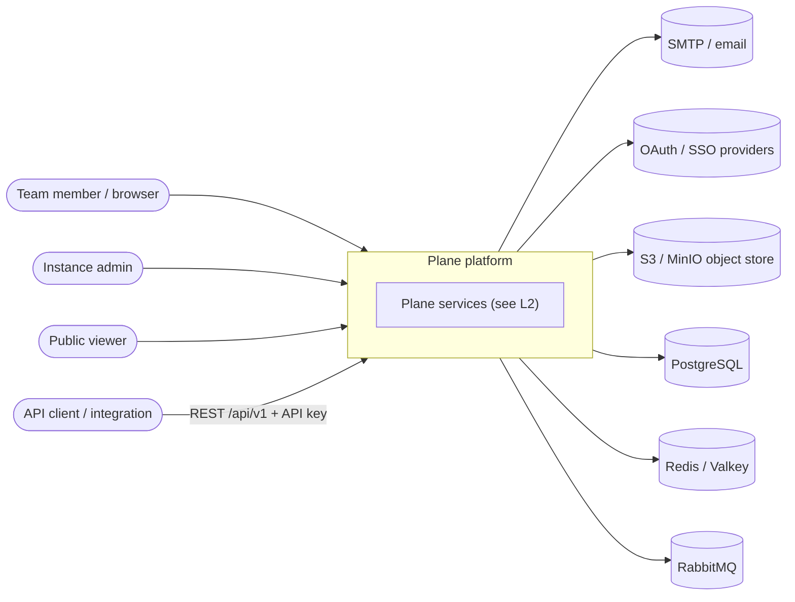
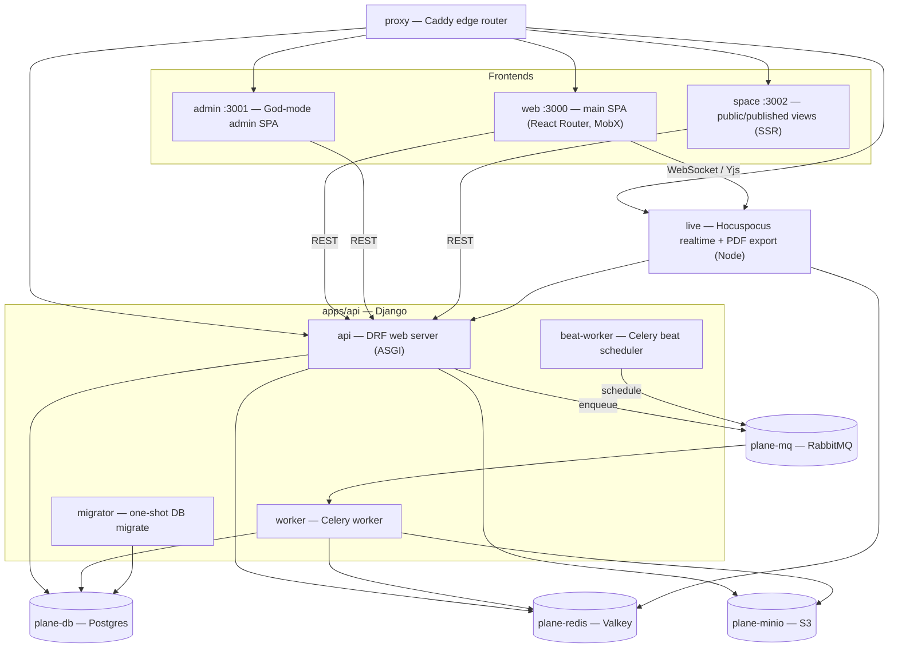
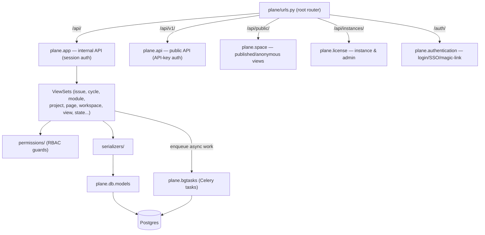
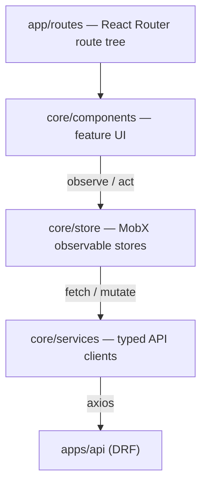
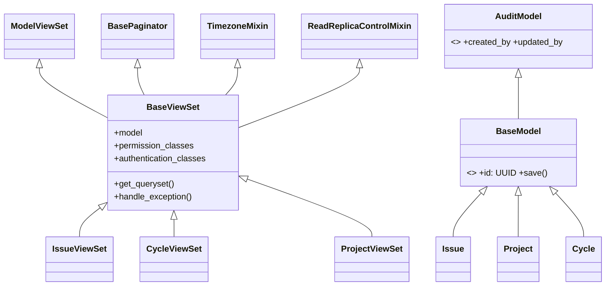
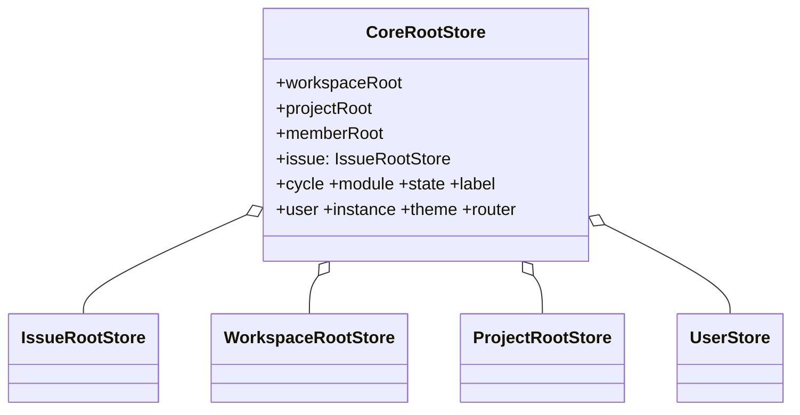
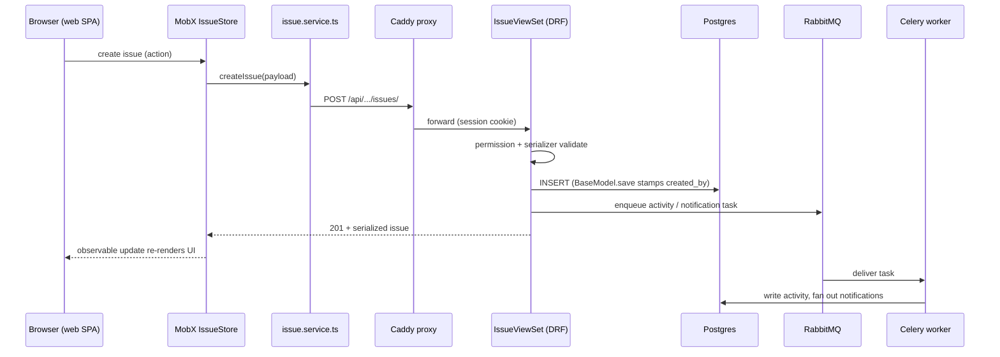
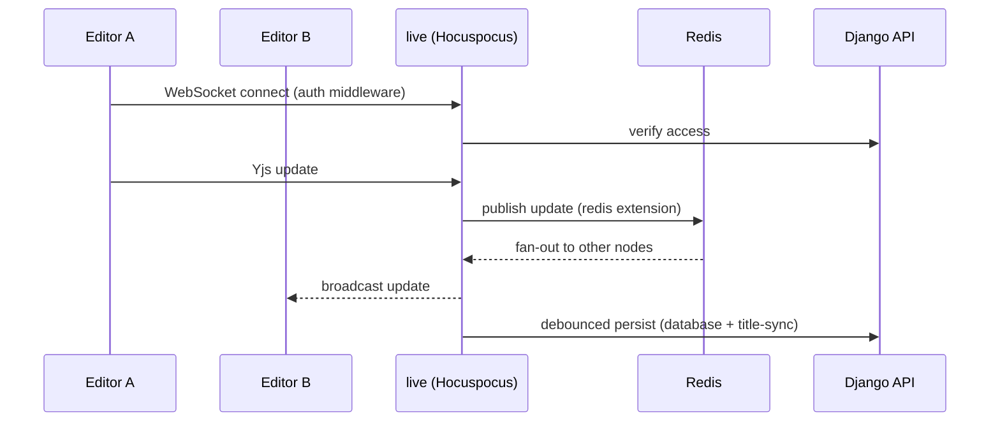

> Source: [makeplane/plane](https://github.com/makeplane/plane) (branch `preview`, monorepo v1.3.1) · Analyzed: 2026-07-17 · Type: **Application** (multi-service monorepo)

## 1. Overview

**Plane** is an open-source project-management platform — work items (issues), cycles, modules, views, pages, and roadmaps — that ships both as a hosted cloud product and as a self-hostable stack. This repository is the **community edition (CE)**: a single **pnpm + Turborepo monorepo** holding several deployable services and a set of shared TypeScript libraries.

**Type classification — Application.** The evidence is unambiguous: multiple runnable entry points (Django `manage.py`/`asgi.py`, Node `apps/live/src/start.ts`, three React-Router client apps), a `docker-compose.yml` wiring the whole stack, and per-service `Dockerfile.*`. It is *not* a library — nothing here is published for external import; the `packages/*` are internal (`workspace:*`) only. There is a secondary "public API" surface (`/api/v1/`) but that is a feature of the app, not a distributed package.

**Tech stack:**
- **Backend** (`apps/api`): Python / **Django** + **Django REST Framework**, **Celery** (worker + beat) for async/scheduled jobs, **drf-spectacular** for OpenAPI. Served via ASGI/WSGI.
- **Frontends** (`apps/web`, `apps/admin`, `apps/space`): **React 19** + **React Router 7** (Vite), **MobX** (`mobx-react`) for state, **Tailwind**. `web`/`admin` are client-only SPAs (`ssr: false`); `space` runs SSR via `react-router-serve`.
- **Realtime** (`apps/live`): **Node** + **Hocuspocus** (Yjs) collaborative server, **Effect** platform, plus server-side **PDF export** (`@react-pdf`).
- **Edge** (`apps/proxy`): **Caddy** reverse proxy.
- **Infra**: PostgreSQL 15, Redis/**Valkey**, **RabbitMQ** (Celery broker), **MinIO** (S3-compatible object store).
- **Shared packages** (`packages/*`): `editor`, `ui`, `propel`, `services`, `shared-state`, `types`, `constants`, `hooks`, `i18n`, `logger`, `utils`, `decorators`, config packages.

---

## 2. System Context (C4 L1)

Who and what interacts with Plane, and the external systems it depends on.

- **Team members** use the main web app; **instance admins** use the God-mode admin app; **public viewers** consume published boards/pages via `space`; **API clients** hit the versioned `/api/v1/` REST surface with an API key.
- Plane depends on Postgres (system of record), Redis/Valkey (cache + Hocuspocus pub/sub + Celery result backend), RabbitMQ (Celery broker), an S3-compatible store for file assets, SMTP for notifications, and external OAuth/SSO providers for authentication.

---

## 3. High-Level Structure (C4 L2)

The compose stack decomposes into edge, frontends, backend request/worker tiers, the realtime server, and stateful backing services.

| Path | Responsibility |
|------|----------------|
| `apps/proxy` | Caddy reverse proxy; routes external traffic to frontends, API, and live; enforces upload size limits |
| `apps/web` | Primary user-facing SPA: work items, cycles, modules, views, pages, dashboards |
| `apps/admin` | Instance administration ("God mode"): instance config, auth providers, workspaces |
| `apps/space` | Public, unauthenticated rendering of published boards/pages (SSR) |
| `apps/api` | Django + DRF backend — the system of record and all business logic; runs as web server, Celery worker, and beat scheduler from one image |
| `apps/live` | Hocuspocus/Yjs realtime document collaboration for the rich-text editor; also server-side PDF export |
| `packages/*` | Shared TS libraries imported by the frontends (see §7/§8) |

---

## 4. Components (C4 L3)

The `apps/api` Django project is the architectural center of gravity. Its URL router (`plane/urls.py`) fans requests into distinct Django "apps", each a layered stack of **URLs → ViewSets → Serializers → Models**.

### 4a. Backend request pipeline & URL surfaces

Key backend component groups (all under `apps/api/plane/`):

- **`app/`** — the internal API consumed by `web`/`admin`. `app/views/` is organized by domain (`issue/`, `cycle/`, `module/`, `project/`, `page/`, `workspace/`, `view/`, `state/`, `analytic/`, `notification/`, …), each mirrored by an `app/urls/*.py` and `app/serializers/`. Guarded by `app/permissions/`.
- **`api/`** — the **public, versioned** REST API (`/api/v1/`) with its own `views/`, `serializers/`, rate limiting (`rate_limit.py`), and API-key middleware.
- **`authentication/`** — pluggable auth: `provider/` + `adapter/` for OAuth/SSO, magic links, session management (`session.py`).
- **`space/`** — read paths for publicly shared work (deploy boards, published pages).
- **`license/`** — instance registration, admin/God-mode backing, telemetry.
- **`bgtasks/`** — Celery tasks: email/notification stacking, exports, hard-delete, issue automation, webhook dispatch, page/version sync, etc. Scheduled via the `celery.py` beat schedule.
- **`db/`** — the domain models (system of record) and migrations.
- **`middleware/`, `throttles/`, `utils/`** — cross-cutting: DB read-replica routing (`db_routing.py`), request-size limits, paginators, filters, exporters, permissions helpers.

### 4b. Frontend component layers (`apps/web`)

Each React app follows the same three-layer client architecture: **routes → MobX stores → services → REST**.

- **`app/`** — routing only (`routes.ts`, `root.tsx`, `provider.tsx`, `entry.client.tsx`); route groups like `(all)`, `(home)`.
- **`core/store/`** — MobX stores grouped by domain (`issue/`, `project/`, `workspace/`, `cycle.store.ts`, `module.store.ts`, `pages/`, `member/`, `user/`, `notifications/`, …), composed under a single `root.store.ts`.
- **`core/services/`** — one typed client per resource (`issue/`, `cycle.service.ts`, `project/`, `page/`, `workspace.service.ts`, `auth.service.ts`, `file-upload.service.ts`, …) over a shared axios `api.service.ts`.
- **`core/components/`, `core/layouts/`, `core/hooks/`** — feature UI, shells, and reactive hooks. Reusable primitives come from `@plane/ui`, `@plane/propel`, `@plane/editor`.

---

## 5. OOP & Class Architecture

Two distinct OOP idioms coexist: **Django class-based views + models** on the backend, and **MobX store classes** on the frontend.

### 5a. Backend — layered base classes

Every domain view extends a shared `BaseViewSet` that mixes in timezone activation, read-replica control, and pagination; every model extends `BaseModel` (UUID PK) which extends `AuditModel` (auto `created_by`/`updated_by` via `crum`).

- **`BaseViewSet`** (`plane/app/views/base.py`) — the Template-Method/mixin backbone: default `IsAuthenticated`, `BaseSessionAuthentication`, `DjangoFilterBackend + SearchFilter`, centralized `handle_exception`, and an opt-in read-replica switch (`use_read_replica`). The public API mirrors this with its own base under `plane/api/views/base.py`.
- **`BaseModel`** (`plane/db/models/base.py`) — UUID primary keys and an overridden `save()` that auto-stamps `created_by`/`updated_by` from the current request user (thread-local via `crum`).

### 5b. Frontend — composite root store

The MobX layer is a **composite/aggregate root**: `CoreRootStore` owns one store instance per domain and wires them together, so any component can reach the whole state tree reactively.

Domain sub-trees (`IssueRootStore`, `WorkspaceRootStore`, `MemberRootStore`, …) are themselves composites of finer stores, mirroring the backend's domain decomposition. Cross-app reusable stores (e.g. `WorkItemFilterStore`) live in `@plane/shared-state`.

### 5c. Live server — Hocuspocus extensions

`apps/live` composes a Hocuspocus server from pluggable **extensions** (`database`, `redis`, `logger`, `title-sync`, `force-close-handler`) and thin **controllers** (`collaboration`, `document`, `health`, `pdf-export`) — a plugin/pipeline pattern rather than inheritance.

---

## 6. Key Flows

### 6a. Authenticated write (create a work item)

### 6b. Realtime collaborative editing (pages)

---

## 7. Extension Points

- **New backend domain** — add a model under `plane/db/models/`, a ViewSet extending `BaseViewSet`, a serializer, a URL module in `plane/app/urls/`, and (if async) a task in `plane/bgtasks/`. The base classes supply auth, filtering, pagination, and audit stamping for free.
- **Auth providers** — drop a provider/adapter pair under `plane/authentication/provider/` + `adapter/`; SSO/OAuth are pluggable.
- **Public API** — extend `plane/api/` (versioned, API-key authenticated) independently of the internal `plane/app/` surface.
- **Scheduled/async work** — register a Celery task and, if periodic, add it to the beat schedule in `plane/celery.py`.
- **Live server behavior** — add a Hocuspocus extension (`apps/live/src/extensions/`) or controller (`apps/live/src/controllers/`).
- **Frontend state/UI** — add a MobX store wired into `CoreRootStore`, a matching service client, and consume shared primitives from `@plane/ui`, `@plane/propel`, `@plane/editor`; cross-app logic goes in `@plane/shared-state`.
- **Webhooks** — outbound integration via the `webhook` model + `webhook_task.py`.

---

## 8. Key Abstractions / Glossary

**Domain terms** (Plane's product model):
- **Workspace** — top-level tenant/organization boundary; contains projects and members.
- **Project** — a container for work items, cycles, modules, views, pages.
- **Work item / Issue** — the core unit of work (the code still says "issue").
- **Cycle** — a time-boxed sprint with burn-down tracking.
- **Module** — a grouping of work items toward a sub-goal.
- **View** — a saved, filtered slice of work items.
- **Page** — a collaborative rich-text document (edited live via `apps/live`).
- **Intake** — inbound triage queue for incoming issues.
- **State** — workflow status of a work item; **Label**, **Estimate**, **Cycle/Module** are its attributes.
- **Deploy board / Space** — publicly published, anonymous-readable views.
- **Instance / God mode** — the self-hosted deployment and its admin surface (`apps/admin`, `plane.license`).

**Core types:**
- **`BaseViewSet`** — DRF viewset base adding auth, filtering, pagination, timezone, read-replica routing.
- **`BaseModel` / `AuditModel`** — UUID-PK base with automatic created/updated-by audit stamping.
- **`CoreRootStore`** — the frontend composite root aggregating all MobX domain stores.
- **Service** — a typed axios client (one per resource) that stores call to reach the REST API.
- **Hocuspocus extension** — a plugin that adds persistence/pub-sub/logging to the realtime server.

**Shared packages:** `@plane/editor` (the rich-text editor), `@plane/ui` + `@plane/propel` (component libraries), `@plane/services` (shared API clients), `@plane/shared-state` (cross-app MobX stores), `@plane/types`, `@plane/constants`, `@plane/hooks`, `@plane/i18n`, `@plane/logger`, `@plane/utils`, `@plane/decorators` (Express controller/route decorators, used by `live`).

---

## 9. Open Questions & Notes

- **CE vs. EE split.** This repo is the community edition. Commit history references `plane-ee` / `plane-cloud` and security scoping fixes, implying an enterprise superset exists elsewhere; feature-flagged or paywalled capabilities are not fully visible here. Store/base-class naming (`BaseAnalyticsStore`, `BasePowerKStore`) suggests these bases are designed to be extended by the EE build.
- **`packages/propel` vs `packages/ui`.** Both are component libraries with no `description` in `package.json`; the precise division of labor between them was not verified from source and is inferred from usage.
- **`@plane/services` vs `apps/web/core/services`.** A shared services package coexists with per-app service directories; which clients are canonical vs. app-specific was not traced exhaustively.
- **Read replica routing.** `ReadReplicaControlMixin` + `middleware/db_routing.py` indicate primary/replica DB splitting, but the replica topology is deployment-configured and not defined in this repo.
- **`apps/space` SSR** runs server-side (`react-router-serve`) while `web`/`admin` are static SPAs — the asymmetry is intentional (public pages need SSR for SEO/first paint) but not documented in-repo.
- Exact worker→queue routing (which `bgtasks` run on which queues) was read from `celery.py`'s beat schedule only; per-task queue assignments were not exhaustively enumerated.

