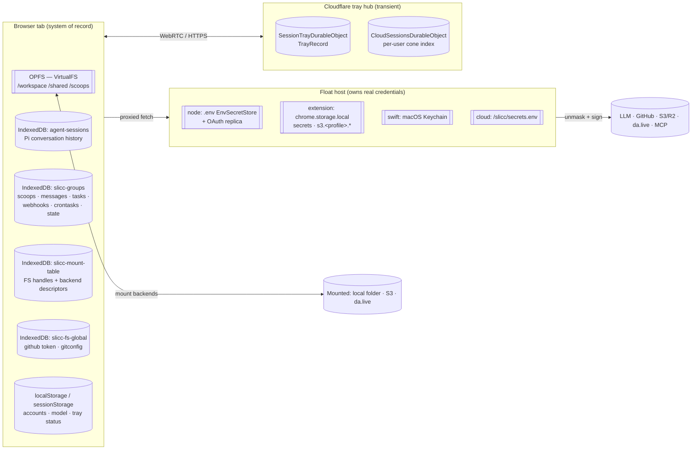
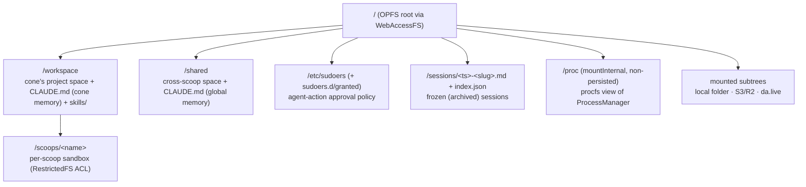
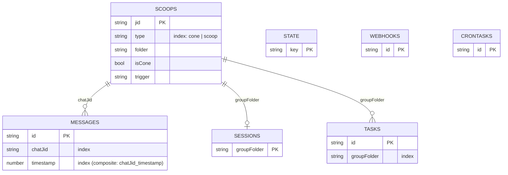
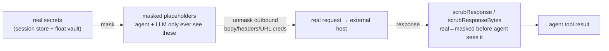
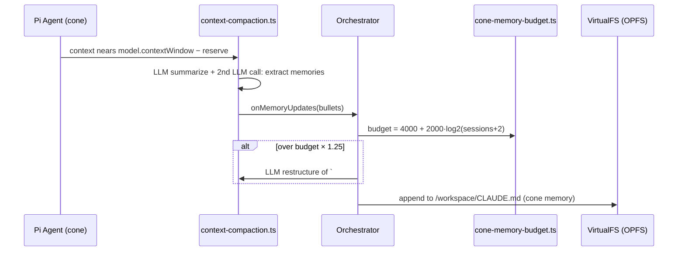

> Source: `github.com/ai-ecoverse/slicc` (`sliccy` npm pkg, v5.29.x) · Analyzed: 2026-07-03 · Data system: **Hybrid** — browser-side File/Blob store (VFS/OPFS) + NoSQL document stores (IndexedDB) + a secret-masking data-in-motion pipeline + ephemeral coordination state (Durable Objects)
> See also: [System & OOP Architecture](./slicc_system_oop_architecture.md)

## 1. Overview

SLICC is **browser-first**: its guiding principle is *"the browser is the OS — all logic and state run client-side; the server is a stateless relay."* Consequently there is **no central application database**. The **system of record is inside the user's browser**: a POSIX-like virtual filesystem persisted to **OPFS**, plus a handful of **IndexedDB** databases holding conversation history, the scoop registry, scheduled licks, and mount metadata. Data leaving the browser (LLM calls, git pushes, S3/da.live, arbitrary `fetch`) passes through a **secret-masking pipeline** so real credentials never reach the model or an unintended host. Cross-browser "tray" sessions are coordinated by a Cloudflare Worker whose Durable Objects hold **transient** routing/leadership state — explicitly *"coordination infrastructure, not canonical session storage."*

**Classification — evidence.** *File/Blob-centric:* `packages/webapp/src/fs/virtual-fs.ts` wraps ZenFS `WebAccessFS` over OPFS (`backend: 'opfs'`). *NoSQL/document:* four IndexedDB databases declared with `indexedDB.open` + `createObjectStore` (`agent-sessions`, `slicc-groups`, `slicc-mount-table`, `slicc-fs-global`). *Data-in-motion:* `@slicc/shared-ts` `SecretsPipeline` (mask → unmask → scrub). *Ephemeral coordination:* `SessionTrayDurableObject` / `CloudSessionsDurableObject` with reclaim TTLs. Hence **Hybrid**.

**Tech.** OPFS + ZenFS (`@zenfs/core`, `@zenfs/dom` `WebAccessFS`); IndexedDB (raw, no ORM); `isomorphic-git` over the VFS; Web Crypto (`crypto.subtle`) for HMAC masking + SigV4; Cloudflare Durable Objects; per-float credential vaults (`.env` file / `chrome.storage.local` / macOS Keychain / e2b sandbox file).

## 2. Data Landscape

| Store | Kind | Holds | Written by | Read by |
|-------|------|-------|------------|---------|
| **VirtualFS / OPFS** | File/blob (ZenFS `WebAccessFS`) | `/workspace`, `/shared`, `/scoops/<name>`, `/etc/sudoers`, `/sessions`, skills, sprinkles | shell, file tools, git, skills | agent, shell, UI, git |
| `agent-sessions` | IndexedDB (`sessions`, keyPath `id`) | Pi `AgentMessage[]` per scoop/cone (`SessionData`) | `SessionStore.save` after each turn | `restoreSession` on init |
| `slicc-groups` | IndexedDB v3 (7 stores) | scoop registry, chat transcript, scheduled tasks, `/state`, webhooks, crontasks | Orchestrator, LickManager | Orchestrator, UI, scheduler |
| `slicc-mount-table` | IndexedDB v2 (`mounts`, `mount-entries`) | `FileSystemDirectoryHandle`s + `BackendDescriptor` keyed by `targetPath` | `mount` command | `mount-recovery` on restore |
| `slicc-fs-global` | IndexedDB (VirtualFS instance) | cross-cwd global state: GitHub PAT, global gitconfig | git provider, `upskill` | `GitCommands` |
| **SessionSecretStore** | in-memory (per process/SW) | agent-set session secrets (`name/value/domains`) | `secret` command | `SecretsPipeline` unmask |
| Per-float vault | `.env` / `chrome.storage.local` / Keychain / sandbox file | persisted user secrets, OAuth tokens, `s3.<profile>.*` | secrets UI / `secret` cmd | fetch-proxy signer |
| `SessionTrayDurableObject` | CF Durable Object | `TrayRecord` (tokens, controllers, leader, previews) | worker routes | leader/follower signaling |
| `CloudSessionsDurableObject` | CF Durable Object | per-user `ConeEntry[]` + names-only `coneConfigIndex` | `/api/cloud/*` | dashboard |
| localStorage | KV (page origin) | `slicc_accounts`, `selected-model`, `slicc_cloud_managed`, `slicc_oauth_extra_domains`, `slicc.leaderTrayStatus`, telemetry flags | UI, boot | UI, worker shim |

## 3. Data Models / Schema (data at rest)

Two schema surfaces matter: the **VFS layout** (the primary blob namespace) and the **`slicc-groups` IndexedDB** (the closest thing to a relational core).

### 3.1 VFS namespace (conceptual — the file/blob store)

- **Backend:** ZenFS `WebAccessFS` on OPFS in browsers; ZenFS `InMemory` under Node/Vitest (feature-detected via `navigator.storage.getDirectory`). A metadata sidecar (`index.toJSON()`) is written back so ZenFS can reload the tree on boot.
- **Isolation:** `RestrictedFS` enforces per-scoop path ACLs; a scoop sees only `/scoops/<name>/` + `/shared/`. `sudo-fs.ts` wraps the same handle for agent-action approvals.
- **Default content:** `packages/vfs-root/` (agent `CLAUDE.md`, `/etc/sudoers`, skills, sprinkles) is bundled via `import.meta.glob` and copied in on init/reset.
- `/proc` and mounted trees are *not* persisted into OPFS — `/proc` is a live view; mounts bridge to external `FileSystemDirectoryHandle`/S3/da.live.

### 3.2 `slicc-groups` IndexedDB (logical schema)

Declared in `packages/webapp/src/scoops/db.ts` (DB version 3). Keys and indexes are the real ones from the migrations:

| Store | Key | Indexes | Holds |
|-------|-----|---------|-------|
| `scoops` | `jid` | `type` | `RegisteredScoop` registry (cone + scoops) |
| `messages` | `id` | `chatJid`, `timestamp`, `chatJid_timestamp` | `ChannelMessage` chat transcript |
| `sessions` | `groupFolder` | — | per-scoop session pointer |
| `tasks` | `id` | `groupFolder` | `ScheduledTask` |
| `state` | `key` | — | misc runtime KV |
| `webhooks` | `id` | — | `WebhookEntry` (lick triggers) |
| `crontasks` | `id` | — | `CronTaskEntry` (lick triggers) |

Schema evolution is explicit and versioned: `runMigrationV1` (fresh install), `runMigrationV2` (renames legacy `groups` → `scoops`, remapping each record via `mapLegacyGroupToScoop`), `runMigrationV3` (adds `webhooks` + `crontasks`).

### 3.3 Pi conversation store (`agent-sessions`)

Separate DB, one object store `sessions` keyed by `id` (`SessionData { id, messages: AgentMessage[], createdAt }`). This is where the **Pi agent loop's history** rests; `restoreSession()` runs `stripOrphanedToolResults` before rehydrating `agent.state.messages` (see the system doc §5.6).

### 3.4 `slicc-mount-table` (mount persistence)

Two stores: `mounts` (raw `FileSystemDirectoryHandle` objects, only for `kind:'local'`) and `mount-entries` (`MountTableEntry { targetPath, descriptor: BackendDescriptor }`, a discriminated union over `local | s3 | da`). Keyed by `targetPath`; `mount-recovery.ts` reconstructs the right backend per-kind on session restore.

## 4. Dataflow & Lineage (data in motion)

### 4.1 The secret-masking pipeline (the dominant transform)

Every agent-initiated outbound HTTP request goes through `createProxiedFetch()` → the fetch proxy → `SecretsPipeline` (`@slicc/shared-ts`). Masking is **format-preserving HMAC**: `masked = prefix + hex(HMAC-SHA256(sessionId + secretName, realValue))` (`secret-masking.ts:70`), values shorter than `MIN_MASKABLE_SECRET_LENGTH = 9` dropped.

- **Directionality:** outbound `unmask` (masked → real, at the trusted float boundary), inbound `scrub` (real → masked, idempotent) so a leaked secret in a response never reaches the model. A second defense-in-depth scrub runs in `tool-adapter.ts` on every tool result.
- **Where reals rest, by float:** node-server `EnvSecretStore` (`.env` file) + `OauthSecretStore`; extension `chrome.storage.local` (persisted secrets + `s3.<profile>.*`); swift `Keychain` (`SecretInjector.swift`, mask-parity-tested); cloud sandbox `/slicc/secrets.env`. **Session secrets** (`SessionSecretStore`) are in-memory only and never persisted — "vanish on session end."
- The agent **never holds S3/IMS credentials**: mount backends are signing-naive; they emit logical requests that a `sign-and-forward` transport (SigV4 for S3, Bearer for da.live) fulfills on the float side.

### 4.2 One traced datum — a durable memory bullet

The cone's *private* memory rests in `/workspace/CLAUDE.md`; the *shared* global memory (`/shared/CLAUDE.md`) is edited only via the explicit `update_global_memory` tool. Frozen ("New session") archives are written to `/sessions/<ts>-<slug>.md` with a `slicc:session-data` block + `/sessions/index.json`.

## 5. System of Record & Ownership

| Entity | Authoritative store | Derived / cached copies |
|--------|--------------------|-------------------------|
| Project & workspace files | **VFS / OPFS** (`/workspace`, `/shared`) | mounts bridge to *external* SoR (local folder, S3, da.live) — those are the SoR for mounted subtrees |
| Conversation history | **`agent-sessions`** IndexedDB (Pi `AgentMessage[]`) | in-memory `agent.state.messages`; chat-transcript copy in `slicc-groups/messages` (capped, UI-facing) |
| Scoop registry | **`slicc-groups/scoops`** | in-memory `Orchestrator.scoops` map |
| Scheduled licks | **`slicc-groups/webhooks` + `crontasks`** | worker relays events; does not own them |
| Cone / scoop memory | **VFS** `/workspace/CLAUDE.md`, `/shared/CLAUDE.md` | embedded into system prompt at turn time |
| GitHub token / gitconfig | **`slicc-fs-global`** VFS | masked replica pushed to fetch-proxy |
| Real secrets | **per-float vault** (`.env` / `chrome.storage.local` / Keychain / sandbox) | masked placeholders (non-reversible HMAC) everywhere else |
| Tray leadership & routing | **`SessionTrayDurableObject`** — but *transient*, TTL-reclaimed | leader-side browser owns the real session; DO is a relay |

**Multi-source-of-truth flags.** (1) Chat data exists in *two* places by design: the canonical Pi history in `agent-sessions` versus a size-capped UI transcript in `slicc-groups/messages` (`transcript-limits.ts` caps the latter — the canonical history must **never** be routed through those caps). (2) Mounted subtrees live in the VFS namespace but their SoR is the external backend; the `RemoteMountCache` (TTL + ETag, IDB-backed) is explicitly a cache, not authority.

## 6. Storage & Access

- **VFS:** single global `/` mount on OPFS; `fs.walk()` + `path-utils.ts` for traversal; `FsWatcher` invalidates the `.jsh`/`.bsh` script catalog (bypassed for mounted trees where external writes are invisible to the watcher). Large trees should be *mounted*, not copied into IndexedDB.
- **IndexedDB indexes:** the only non-trivial access path is `slicc-groups/messages`, indexed on `chatJid`, `timestamp`, and the composite `chatJid_timestamp` for per-scoop chronological transcript reads. Everything else is primary-key `get`/`put`.
- **Mount cache:** `RemoteMountCache` keys on path with TTL + ETag revalidation, backed by IndexedDB, to keep S3/da.live reads cheap.
- **Preview cache:** worker-side Cloudflare cache keyed with a per-preview `cacheVersion` (bumped by `preview.purge`) so `serve` output invalidates correctly.
- **Tray TURN/ICE:** `SessionTrayDurableObject` caches ICE servers and refreshes before `TURN_CREDENTIAL_TTL_SECONDS = 86400`.

## 7. Lifecycle & Governance (declared artifacts only)

- **Schema evolution:** IndexedDB `onupgradeneeded` migration chains — `slicc-groups` v1→v2→v3, `slicc-mount-table` v1→v2. The legacy LightningFS/`slicc-fs` IndexedDB backend is fully removed; `slicc-fs-cleanup` deletes the leftover database on request.
- **Retention / TTL (worker):** `TRAY_RECLAIM_TTL_MS = 1 hour` (desktop trays), `HOSTED_TRAY_RECLAIM_TTL_MS = 30 days` (hosted trays), branched by `reclaimMsForTray`. Trays not reclaimed in time are expired (`expiredAt`) and their `previews` map cleared. Cloud cones are capped per-user (`CONE_CAP_RUNNING` / `CONE_CAP_PAUSED`, default 1 / 5).
- **Secret governance:** masking is non-reversible (HMAC); the model never sees real values. `CloudSessionsDurableObject` persists a **names-only** `coneConfigIndex` (model + provider ids + secret *names*, never values) — "the worker never persists bundle values and never logs them." Session secrets are memory-only. POSIX-invalid / dot-namespaced secrets (`s3.<profile>.*`, `oauth.<id>.token`) are filtered out of `$ENV`/`printenv` by `fetchSecretEnvVars`.
- **Approvals as data:** `/etc/sudoers` + `/etc/sudoers.d/*` in the VFS are the agent-action policy; writes to them always require human approval regardless of policy (hardcoded in `matchPath`), and "Always" grants append to `/etc/sudoers.d/granted`.

## 8. Open Questions & External Assumptions

- **External SoR out of scope.** For mounted subtrees the true system of record is the remote (a local folder, an S3/R2 bucket, a da.live site). This doc maps only the VFS-side handle/descriptor + cache; the remote's schema, retention, and access policy are not in this repo.
- **OPFS durability/quota** is browser- and origin-governed (eviction under storage pressure, per-origin quota). No explicit quota or eviction policy is declared in the repo — treat OPFS persistence as best-effort, not guaranteed.
- **No migrations for `agent-sessions` / `slicc-fs-global`** beyond initial `createObjectStore` were observed; their version histories were not traced in full. Confirm against the files before assuming a stable on-disk shape.
- **Keychain / sandbox vault internals** (`SecretInjector.swift`, e2b `/slicc/secrets.env`) were mapped from package docs and interface surfaces, not read line-by-line; the swift store is asserted mask-compatible via cross-impl vector tests but its at-rest encoding wasn't inspected here.
- **Durable Object storage is deliberately transient.** The tray/cloud DO state is coordination metadata with TTL reclaim — do not treat `TrayRecord`/`ConeEntry` as a durable record of user sessions; the browser leader remains the session's owner.
