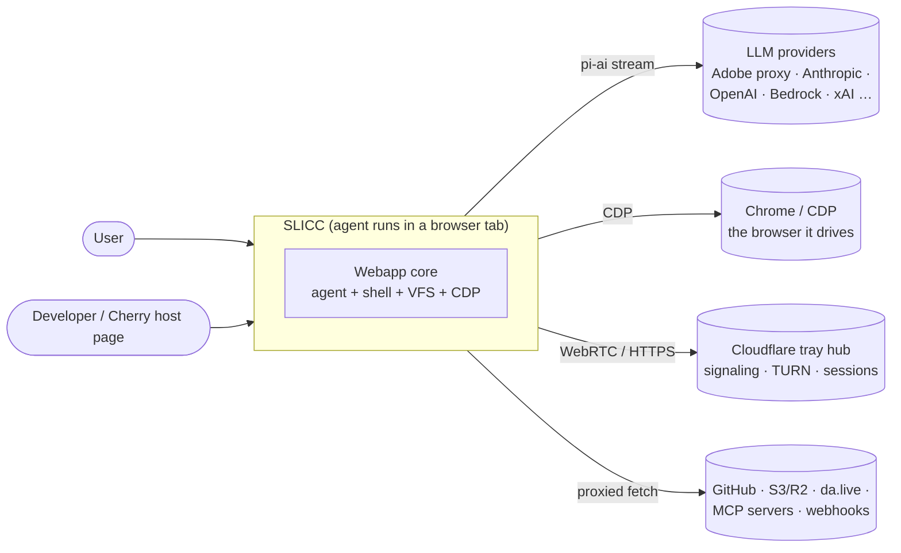
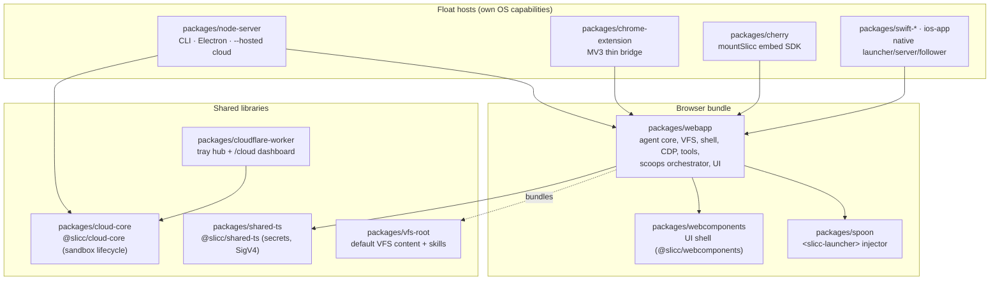
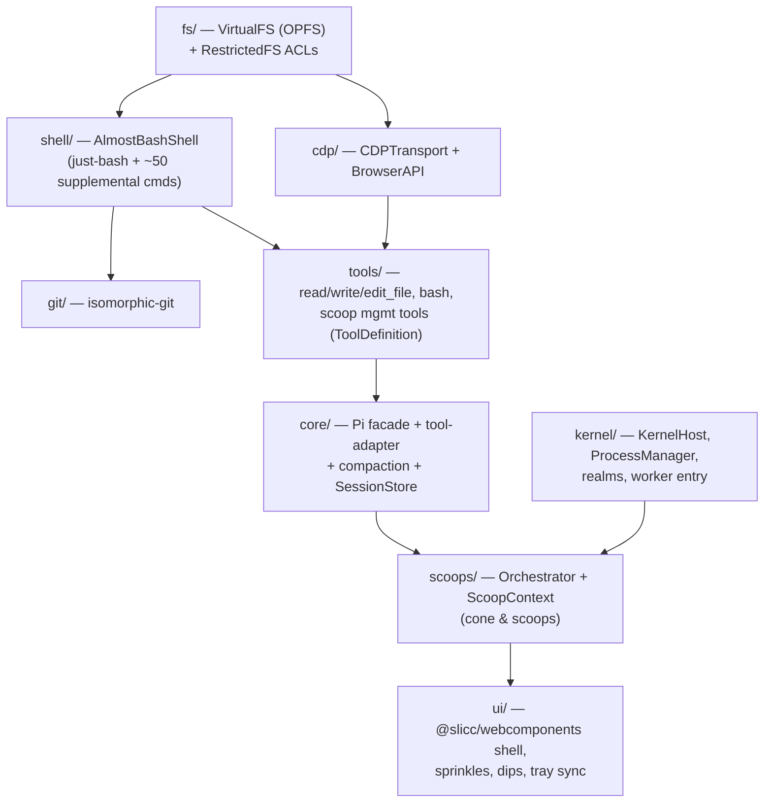
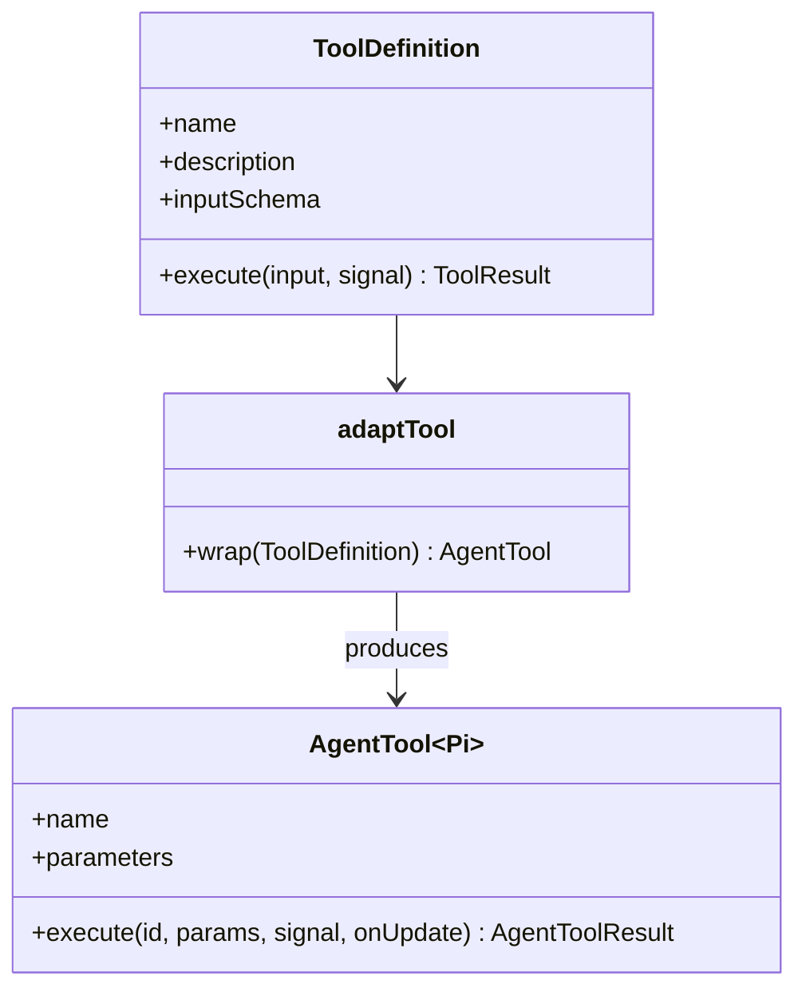
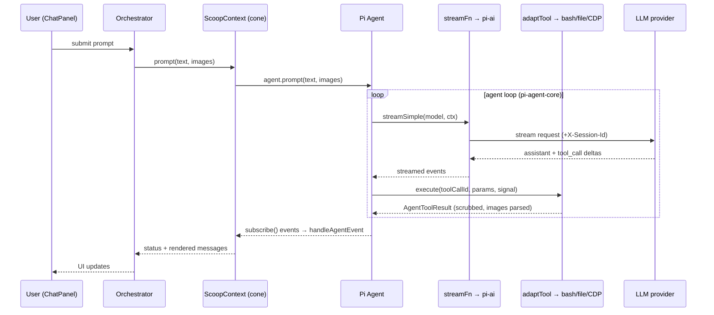
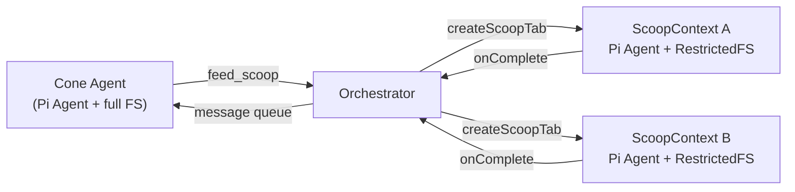

> Source: `github.com/ai-ecoverse/slicc` (`sliccy` npm pkg, v5.29.x) · Analyzed: 2026-07-03 · Type: **Hybrid** (browser application + published library packages)
> See also: [Data Architecture](./slicc_data_architecture.md) — where the data rests and how it moves.

## 1. Overview

**SLICC** ("Self-Licking Ice Cream Cone") is a **browser-native AI coding/automation agent**. The agent runtime lives *inside* a Chrome tab and drives the very browser it runs in: it exposes a real shell (`just-bash` in TypeScript), a POSIX-like virtual filesystem (OPFS), git (`isomorphic-git`), browser automation over CDP, and multi-agent delegation — all client-side. The server is a thin, stateless relay ("the browser is the OS").

The LLM agent loop itself is **not** written in this repo. SLICC embeds **Pi** ([`pi-mono`](https://github.com/earendil-works/pi-mono)) as its agent engine: `@earendil-works/pi-agent-core` (the tool-calling loop + state machine) and `@earendil-works/pi-ai` (LLM streaming, model registry, provider abstraction). SLICC is the *orchestration layer* ("the claw") wrapped around Pi — §5 and §6 detail exactly how.

**Repo type — evidence.** It is *application-first*: `package.json` declares `"bin": { "slicc": "dist/node-server/index.js" }`, a `dev` entry (`tsx packages/node-server/src/index.ts`), and multiple runtime "floats" (CLI, extension, Electron, cloud, iOS). It is *also a library*: it publishes workspace packages with public APIs — `@ai-ecoverse/cherry` (`mountSlicc` embed SDK), `@slicc/cloud-core`, `@slicc/shared-ts`, `@ai-ecoverse/spoon`, `@slicc/webcomponents`. Hence **Hybrid**, app-leaning.

**Tech stack.** TypeScript (strict) monorepo via npm workspaces; Vite bundling; Vitest tests. Browser primitives: OPFS, DedicatedWorker, Service Worker, WASM, `chrome.debugger`/CDP, WebRTC. Node ≥ 22 for the CLI float. Swift (SwiftUI + Hummingbird) for native macOS/iOS. Cloudflare Worker + Durable Objects for the "tray" coordination hub. Agent engine: **Pi** (`pi-agent-core` / `pi-ai` `^0.79`).

## 2. System Context (C4 L1)



SLICC is used by an end user (chat + browser work) and by developers embedding it into third-party pages via the Cherry SDK. It depends on an LLM provider (default: an Adobe-hosted Claude proxy), the Chrome it controls over CDP, external services reached through a secret-masking fetch proxy, and the Cloudflare "tray" worker for cross-browser session coordination.

## 3. High-Level Structure (C4 L2 — workspace packages)



| Path | Responsibility |
|------|----------------|
| `packages/webapp/` | The core: VFS → shell/git → CDP → tools → **core agent (Pi)** → scoops orchestrator → UI. All floats load this. |
| `packages/node-server/` | CLI/Electron/cloud host: launches Chrome, proxies CDP, signs credentials, opens `/licks-ws`. Serves *no UI*. |
| `packages/chrome-extension/` | MV3 thin bridge: service worker pins a hosted leader tab, pass-through-proxies `chrome.debugger`. |
| `packages/cherry/` | Host-side `mountSlicc` SDK — embeds the webapp as a capability-limited follower in a third-party page. |
| `packages/cloud-core/` | `@slicc/cloud-core` — sandbox-lifecycle abstraction (e2b) shared by node-server + worker. |
| `packages/shared-ts/` | `@slicc/shared-ts` — secret masking pipeline, SigV4 signer (pure Web Crypto). |
| `packages/cloudflare-worker/` | Stateless tray/teleport hub, TURN creds, `/cloud` dashboard. |
| `packages/vfs-root/` | Default filesystem content (agent `CLAUDE.md`, skills, sprinkles) bundled into the VFS. |

## 4. Components (C4 L3 — inside `packages/webapp/src/`)

The webapp is a **layered stack**; each layer wraps the one below and exposes a narrow interface upward.



- **`fs/`** — `VirtualFS` (POSIX-like, OPFS-backed; in-memory under Node tests); `RestrictedFS` adds path ACLs so a scoop can't see the whole tree; `mount/` bridges S3/R2, da.live, and local FS-Access folders.
- **`shell/`** — `AlmostBashShell` wraps **just-bash** (a *pure-TypeScript* bash interpreter, not WASM) plus supplemental commands (`git`, `node -e`, `python3 -c`, `playwright-cli`, `workflow`, `mcp`, `agent`, `usb`/`serial`/`hid`, …). New capabilities are shell commands, not tools ("agents love the CLI").
- **`cdp/`** — `CDPTransport` interface with three impls: WebSocket (CLI), `chrome.debugger` (extension), `CherryHostTransport` (synthetic CDP over postMessage). `BrowserAPI` gives a Playwright-style surface.
- **`tools/`** — the *active* model-facing tool surface is deliberately tiny: file tools + `bash` + cone-only scoop-management tools. Browser work goes *through* `bash`, not dedicated tools.
- **`core/`** — the **Pi integration seam** (§5).
- **`scoops/`** — the multi-agent orchestration layer (§6).
- **`kernel/`** — `KernelHost` boots the whole thing in a DedicatedWorker; `ProcessManager` tracks every async unit (scoop turns, tool calls, shell execs) with real pids and Unix signals, surfaced at `/proc`.

## 5. How Pi Is Used (the core integration)

Pi is consumed through a **single facade module**, `packages/webapp/src/core/index.ts`, which re-exports the two Pi packages so the rest of the codebase never imports `@earendil-works/*` directly for the loop:

```ts
// packages/webapp/src/core/index.ts
export { Agent, agentLoop, agentLoopContinue } from '@earendil-works/pi-agent-core';
export type { AgentTool, AgentMessage, StreamFn, ThinkingLevel, ... } from '@earendil-works/pi-agent-core';
export { stream, streamSimple, getModel, getModels, getProviders,
         registerApiProvider } from '@earendil-works/pi-ai';
export type { Model, Message, ToolCall, AssistantMessage, ... } from '@earendil-works/pi-ai';
```

The division of labor:

| Concern | Owned by | Owned by SLICC |
|---------|----------|----------------|
| Agent loop (assistant ↔ tool-call turns), streaming, retries-inside-a-turn | **`pi-agent-core` `Agent`** | — |
| LLM HTTP streaming, model registry, provider protocol | **`pi-ai` `streamSimple` / `getModel` / `registerApiProvider`** | — |
| What tools exist, sandboxing, isolation | — | `tools/` + `RestrictedFS` |
| System prompt, memory, skills, model choice | — | `ScoopContext` |
| Context compaction policy | — | `core/context-compaction.ts` (hooked into Pi) |
| Multi-agent (cone + scoops) | — | `scoops/orchestrator.ts` |
| Conversation persistence | — | `core/session.ts` (`SessionStore`) |

### 5.1 One `Agent` per scoop

Every agent (the main "cone" and each sub-agent "scoop") owns exactly one Pi `Agent` instance, constructed in `ScoopContext.init()` (`packages/webapp/src/scoops/scoop-context.ts:657`):

```ts
this.agent = new Agent({
  initialState: { model, tools, systemPrompt, messages: restoredMessages, thinkingLevel },
  getApiKey: () => getApiKey() ?? undefined,
  transformContext: compactFn,        // ← SLICC's context compaction, §5.4
  streamFn: streamWithSessionId,      // ← wraps pi-ai streamSimple, §5.3
  afterToolCall: async (context) => { /* capture StructuredOutput tool result */ },
});
this.unsubscribe = this.agent.subscribe((event) => this.handleAgentEvent(event));
```

Four injection seams make Pi bend to SLICC's runtime: `tools`, `transformContext`, `streamFn`, and `afterToolCall`. The `Agent`'s `state` is *mutable and owned by SLICC* — `scoop-context.ts` writes `agent.state.messages`, `agent.state.model`, `agent.state.systemPrompt`, and `agent.state.thinkingLevel` directly to swap models, edit history, and hot-update the prompt mid-session.

A turn is one call: `await agent.prompt(text, images)` (wrapped in a 3-attempt retry loop in `runAgentWithRetries`). `agent.subscribe(...)` streams `AgentEvent`s that `handleAgentEvent` translates into UI updates and scoop routing. `agent.abort()` + `agent.clearAllQueues()` implement the stop button.

### 5.2 Tool adaptation (legacy → Pi)

SLICC's tools are written against a simple internal `ToolDefinition` (`execute(input) → ToolResult`). `core/tool-adapter.ts` wraps each one as a Pi `AgentTool` with Pi's richer signature `execute(toolCallId, params, signal?, onUpdate?) → AgentToolResult`. The adapter also:

- spawns a `kind:'tool'` entry in the `ProcessManager` so `ps`/`/proc` see the tool run and `kill` works,
- mirrors the agent-loop `AbortSignal` onto that process (→ 130/143/137 exit codes),
- runs a defense-in-depth **real→masked secret scrub** on the result before Pi sees it,
- parses `` markers into Pi `ImageContent` blocks (resizing over-limit images).



### 5.3 Streaming seam (`streamFn`)

Pi's default LLM call is `pi-ai` `streamSimple`. SLICC injects a thin wrapper (`buildSessionHelpers`, `scoop-context.ts:584`) that adds the Adobe proxy's required `X-Session-Id` header when the provider is `adobe`, and otherwise passes straight through. This is the single chokepoint where SLICC threads per-session identity into every model call.

### 5.4 Context compaction seam (`transformContext`)

Pi calls `transformContext(context)` before each turn. SLICC supplies `createCompactContext` (`core/context-compaction.ts`), which fires an **LLM-summarized compaction** when the conversation approaches `model.contextWindow − reserveTokens` (the *real* window forwarded from the resolved model — e.g. ~983K for a 1M-window Claude, not a hardcoded 200K). For the cone it also runs a second, prompt-cache-friendly LLM call to extract durable memories into `/workspace/CLAUDE.md`.

### 5.5 Providers & models

Providers are **auto-discovered** from `pi-ai` (`getProviders`/`getModels`) and augmented by SLICC: built-ins in `providers/built-in/` and external drop-in configs in `packages/webapp/providers/*.ts` register via `registerApiProvider`. SLICC layers capability shims on top of Pi's model metadata (e.g. Claude adaptive-thinking / temperature quirks in `providers/adaptive-thinking.ts` + `claude-model-version.ts`) — always at the provider layer, never the call site. One-off, non-loop LLM calls (titles, quick classification) use `pi-ai` `completeSimple` via `providers/quick-llm.ts`.

### 5.6 Persistence

`core/session.ts` `SessionStore` persists Pi's `AgentMessage[]` to IndexedDB keyed by session id, so a scoop resumes across page reloads; `restoreSession()` strips orphaned tool-results before rehydrating `agent.state.messages`.

## 6. Key Flows

### 6.1 A cone turn, end to end



Before each turn Pi calls SLICC's `transformContext` (compaction); on completion `SessionStore.save` persists the new `AgentMessage[]`.

### 6.2 Cone → scoop delegation

The **cone** (main agent, `isCone: true`) delegates to isolated **scoops** via the cone-only `feed_scoop` tool. `Orchestrator` creates each scoop with its own `ScoopContext` → its own Pi `Agent`, `RestrictedFS` sandbox (`/scoops/{name}/` + `/shared/`), shell, and conversation. Scoops receive **complete self-contained prompts** — they never see the cone's history. Completion is routed back to the cone's message queue.



The `agent` shell command (`agent-bridge.ts` → `globalThis.__slicc_agent`) spawns *ephemeral* one-shot scoops (`notifyOnComplete: false`), and `workflow run` fans out to many such sub-agents from a plain-JS orchestration script — both reuse the same `Orchestrator` + Pi `Agent` machinery.

## 7. Extension Points

- **Skills** — the primary extension surface. Drop a `SKILL.md` under `/workspace/skills/` (install-managed) or discover read-only `.agents/`/`.claude/` and marketplace skills anywhere in the VFS. "New agent capabilities should be `SKILL.md` files, not code changes."
- **Shell commands** — `.jsh` (JS shell script, discovered anywhere on the VFS), `.bsh` (browser-page navigation helper), `.workflow.js` (saved workflows). Auto-discovered as top-level commands.
- **Providers** — drop a `.ts` in `packages/webapp/providers/`; auto-registered via `registerApiProvider`. Override model capabilities via `modelOverrides` / `getModelIds`.
- **MCP servers** — `mcp add <url> <name>` registers a server, writes a `.jsh` alias shim, and materializes MCP Apps as sprinkles.
- **Sprinkles & dips** — `.shtml` panels and inline chat UI, rendered in sandboxed iframes.
- **Floats** — new runtime hosts implement the thin-bridge contract (own CDP + OAuth + signing locally; load the hosted webapp). Cherry adds a *third* `CDPTransport` for embedded followers.

## 8. Key Abstractions / Glossary

| Term | Meaning | Code |
|------|---------|------|
| **Cone** | The main agent ("sliccy"). Full FS, all tools. | `RegisteredScoop { isCone: true }`, `orchestrator.ts` |
| **Scoop** | Isolated sub-agent with a sandboxed FS + own Pi `Agent`. | `scoop-context.ts`, `restricted-fs.ts` |
| **Lick** | External event that triggers a scoop (webhook, cron, workflow completion, navigate handoff). | `LickManager`, `lick-manager.ts` |
| **Float** | A runtime host: CLI, extension, Electron, hosted-cloud, Cherry. | `resolveFloatTopology()`, `float-topology.ts` |
| **Tray** | Multi-browser leader/follower session coordination via the Cloudflare worker. | `tray-*-sync.ts`, `cloudflare-worker/` |
| **Cherry** | The webapp embedded (`?cherry=1`) in a third-party page as a capability-limited follower. | `packages/cherry/`, `cherry-host-transport.ts` |
| **Pi Agent** | `pi-agent-core` `Agent` — the tool-calling loop instance SLICC owns per scoop. | `scoop-context.ts:657` |
| **KernelHost** | Single boot sequence (orchestrator + licks + bridge) run in a DedicatedWorker. | `kernel/host.ts` |
| **just-bash** | Pure-TypeScript bash interpreter behind `AlmostBashShell`. | `shell/almost-bash-shell.ts` |

## 9. Open Questions & Notes

- **Depth of the Pi loop is intentionally opaque here.** `Agent`'s internal loop (turn scheduling, tool-call parallelism, streaming reassembly, in-turn retries) lives in `@earendil-works/pi-agent-core` (external). This doc grounds only the *seams* SLICC uses (`initialState`, `streamFn`, `transformContext`, `afterToolCall`, `subscribe`, `state`, `prompt`, `abort`); the loop internals were not read from source.
- **Pi version pinning matters.** `pi-ai ^0.79` is the analyzed range, but several provider shims exist specifically because a *pinned* older pi-ai (noted as 0.75.3 in `webapp/CLAUDE.md`) lagged newer Claude models. The effective runtime pin should be confirmed against `package-lock.json` before relying on any capability.
- **Two type systems.** Legacy `ToolDefinition` (`tools/`) vs Pi `AgentTool` (`core/`), bridged only by `tool-adapter.ts`. New tools should be authored as `ToolDefinition` and adapted — not written against Pi directly.
- **Swift/iOS floats** (`swift-*`, `ios-app`) were mapped from package docs, not read line-by-line; they reimplement the tray/sync protocol natively rather than consuming the TS webapp.
- **Diagrams are curated, not exhaustive.** The webapp has ~18 top-level subsystems; §4 shows the load-bearing spine. Tray/teleport, secrets pipeline, speech, and mounts are real subsystems intentionally left as glossary/edge references to keep the core legible.
