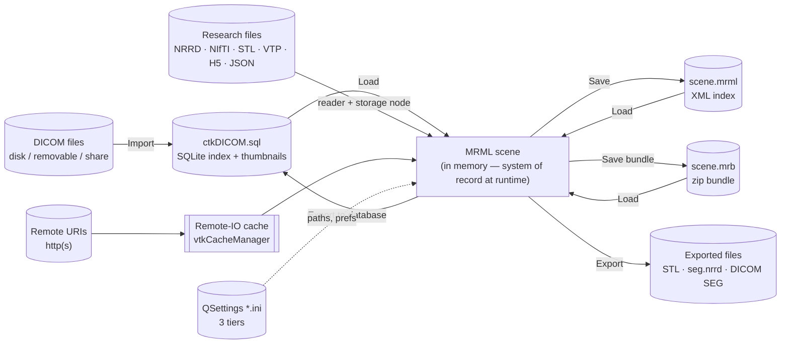
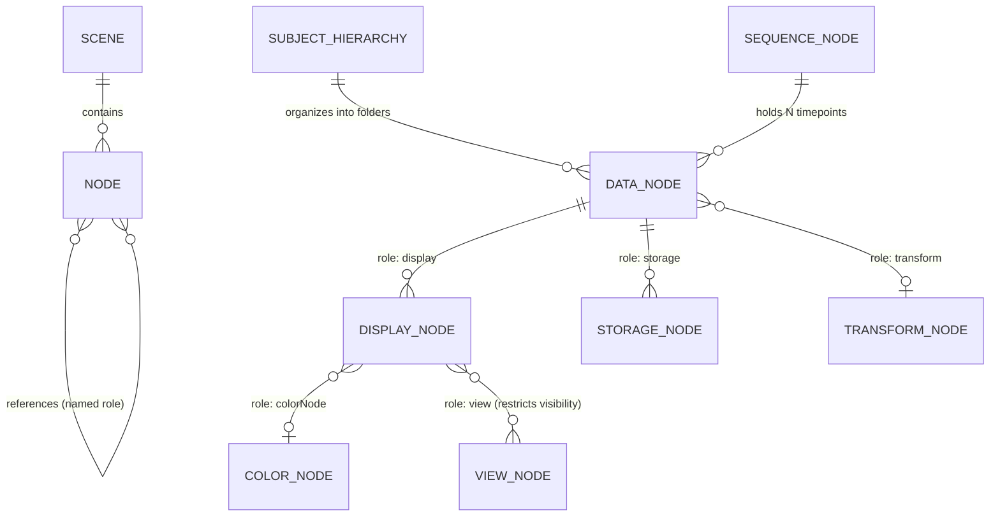
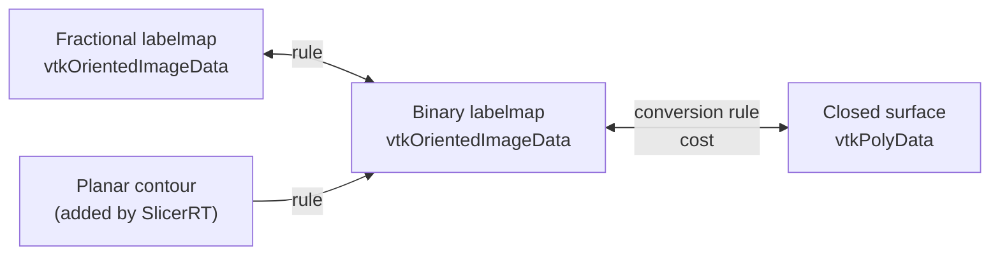
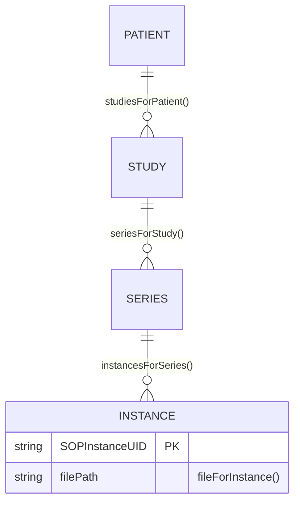
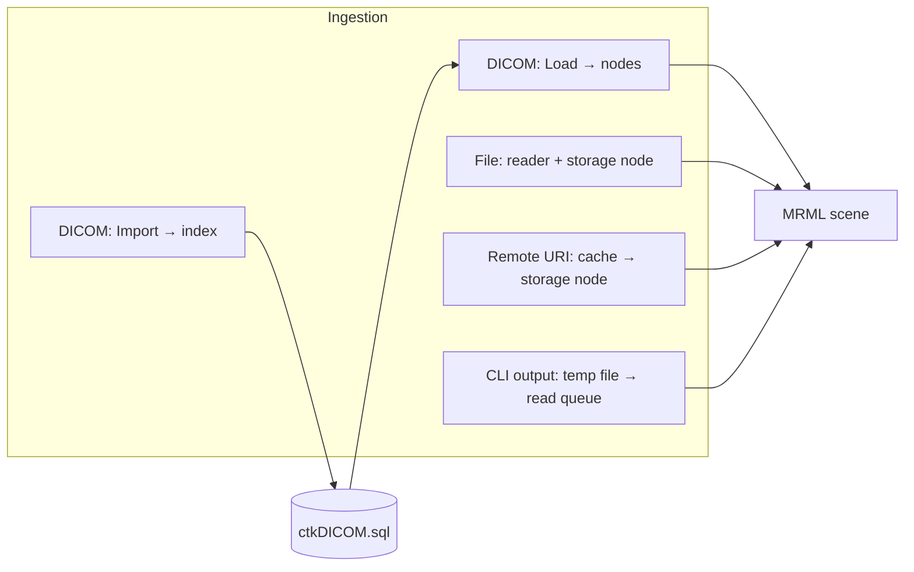
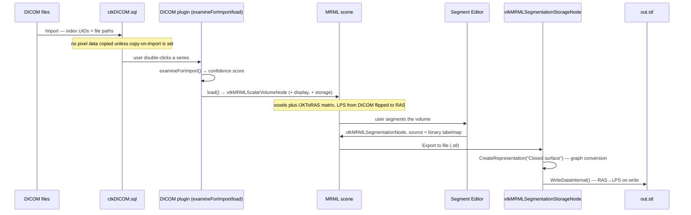
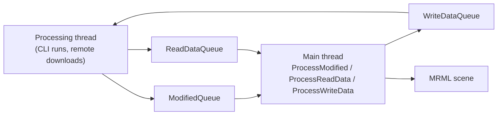

> Source: `https://github.com/slicer/slicer.git` (branch `main`, Slicer 5.11.0) · Date: 2026-09-04 · Mode: Explain · Data system: **Hybrid** — in-memory object graph (primary) + file/blob store + embedded SQLite index + caches
> See also: [System & OOP Architecture](/case-studies/apps/slicer_system_oop_architecture/) · [Surface Architecture (UX/DX)](/case-studies/apps/slicer_ux_design/) · [Extension Mechanism](/case-studies/patterns-in-the-wild/slicer-extension-mechanism/)

---

## 1. Overview

3D Slicer has no server-side database and no ORM. Its **system of record at runtime is an
in-memory object graph** — the *MRML scene* — and everything else in the data landscape
exists to fill it, persist it, or index the files that feed it.

That single fact drives every design decision below:

- The scene is a **flat list of typed nodes with named references**, not a nested document.
- Persistence is **index + external bulk data**: an XML file (`.mrml`) listing nodes, each
  file-backed node pointing at a separate real image/mesh/transform file. `.mrb` is the same
  thing zipped.
- The DICOM database is an **index, not a store** — it catalogues files on disk so a user can
  find a series; loading still means materializing nodes in the scene.
- Because the scene is in memory, **memory is the capacity limit**, and "save" is an explicit
  user act. There is no autosave, no transaction log, no rollback beyond an
  off-by-default undo stack.

### Data-system classification — Hybrid

| Facet | Type | Evidence |
|---|---|---|
| Runtime store | **Document / graph, in memory** | `vtkMRMLScene` holds nodes addressed by string ID; nodes link by named reference roles (`vtkMRMLNode::SetNodeReferenceID`) |
| Persistence | **File / blob** | `vtkMRMLStorageNode` subclasses write NRRD, NIfTI, STL, VTP, H5 …; scene index is `.mrml` XML, bundle is `.mrb` zip |
| Catalogue | **Embedded OLTP (SQLite)** | `ctkDICOM.sql` opened by `slicer.dicomDatabase.openDatabase()` (`Modules/Scripted/DICOM/DICOM.py:353`) |
| Cache | **File cache with size policy** | `vtkCacheManager` — `RemoteCacheLimit`, `RemoteCacheFreeBufferSize`, `ClearCache()` |
| Config | **INI key-value** | `QSettings::IniFormat`, three tiers (`qSlicerCoreApplication.cxx:297,1406,1438`) |

### Tech

| Concern | Technology |
|---|---|
| In-memory model | VTK object graph (`vtkMRMLNode` / `vtkMRMLScene`), reference-counted |
| Image I/O | ITK (via `vtkITK`, `ITKFactoryRegistration`), Teem (NRRD/DWI), VTK readers |
| DICOM | DCMTK + `ctkDICOMDatabase` on SQLite; `pydicom` in the Python DICOM layer |
| Scene serialization | Hand-rolled XML writer in `vtkMRMLNode::WriteXML` / `ReadXMLAttributes`; `.mrb` = zip |
| JSON payloads | RapidJSON (C++), recommended for new storage nodes |
| Tabular | `vtkMRMLTableNode`, plus `vtkMRMLTableSQLiteStorageNode` for SQLite-backed tables |

---

## 2. Data Landscape



| Store | Kind | Holds | Written by | Read by |
|---|---|---|---|---|
| **MRML scene** | In-memory graph | Every loaded dataset + all display/view state | Every module, every reader, `vtkSlicerApplicationLogic` read queue | Every module, displayable managers, Python, HTTP handlers |
| **`ctkDICOM.sql`** | SQLite (CTK schema) | Patient/study/series/instance index, file paths, thumbnails | DICOM module *Import*; *Export to database* | DICOM browser, `DICOMRequestHandler` (DICOMweb), DICOM plugins |
| **DICOM file store** | Directory tree next to the SQLite file | The actual `.dcm` instances | DICOM import (copy mode) / export | `slicer.dicomDatabase.fileForInstance()` |
| **Research file store** | Arbitrary user paths | NRRD, NIfTI, STL, PLY, OBJ, VTP, `.h5`/`.tfm` transforms, `.mrk.json`, `.csv` | Storage nodes on save/export | Storage nodes on load |
| **Scene files** | `.mrml` (XML index) / `.mrb` (zip) | Node list + attributes + references; `.mrb` also embeds the referenced data files | `vtkMRMLScene::Commit()`; `qSlicerSceneBundleReader` on the read side | `vtkMRMLScene::Connect()` / `Import()` |
| **Remote-IO cache** | File cache with size cap | Files fetched from `http(s)` URIs referenced by storage nodes | `vtkHTTPHandler` via `vtkDataIOManager` | `vtkCacheManager::FindCachedFile()` |
| **Settings** | INI files, three tiers | Paths, preferences, module enable/ignore lists, extension registration | Settings dialog, extensions manager | Startup (`qSlicerApplicationHelper`) |
| **Temporary dir** | Scratch files | CLI module input/output marshalling | `vtkSlicerCLIModuleLogic` | The CLI process |

---

## 3. Data Models / Schema

### 3.1 Conceptual — the node graph



Read the diagram as the three-way split that defines MRML: a dataset is **data** (what it
is) + **display** (how to draw it, one per view style) + **storage** (how to persist it, one
per format). Any of the three can be missing; `CreateDefaultDisplayNodes()` and
`CreateDefaultStorageNode()` fill the gaps.

### 3.2 Logical — every node's common columns

Every node, regardless of type, carries the same envelope (`vtkMRMLNode`):

| Field | Type | Notes |
|---|---|---|
| `ID` | string, **PK, scene-unique** | Generated by `vtkMRMLScene::GenerateUniqueID()`; convention `vtkMRML<Type>Node<n>` |
| `Name` | string | Not unique; display label only |
| `Attributes` | `map<string,string>` | Free-form key/value. Convention: prefix with module name + `.` (e.g. `DoseVolumeHistogram.Unit`) to avoid clashes. Usable as a filter in node-selector widgets |
| `NodeReferences` | map<role → [ID]> | The FK mechanism; a role may hold many IDs (`AddNodeReferenceID`) |
| `HideFromEditors`, `Selectable`, `Selected` | bool | GUI behaviour flags, persisted |
| `SingletonTag` | string, nullable | If set, the scene enforces one instance per (tag, class) — `GetSingletonNode()`. Used by view/layout/selection/interaction nodes |
| `NodeTagName` | string, class-level | The XML element name in a `.mrml` file |

**Node references are the schema.** There is no join table and no foreign-key constraint —
a reference is a role string plus a target ID, resolved lazily. This is what lets an
extension add a new relationship (`myRole → someNodeID`) between two core node types
*without modifying either class*.

### 3.3 Physical — the `.mrml` file

The on-disk form is a direct dump of the node list. Real excerpt from
`Libs/MRML/Core/Testing/NonLinearTransformScene.mrml`:

```xml
<MRML version="Slicer4.4.0" userTags="">
 <TransformStorage id="vtkMRMLTransformStorageNode1" name="TransformStorage"
   hideFromEditors="true" fileName="TestData/Bspline-f-m.tfm" useCompression="1" />
 <BSplineTransform id="vtkMRMLBSplineTransformNode1" name="Bspline-f-m"
   storageNodeRef="vtkMRMLTransformStorageNode1"
   references="storage:vtkMRMLTransformStorageNode1;" userTags="" />
</MRML>
```

Three things this shows:

1. One XML element per node; the element name is `GetNodeTagName()`.
2. `references="role:targetID;role2:targetID2;"` — the generic reference serialization
   (`storageNodeRef` is a legacy alias kept for compatibility).
3. `fileName` is **relative to the `.mrml`** — bulk data is never inline. A `.mrml` alone is
   useless without its sibling data files; that is precisely why `.mrb` exists.

**`.mrb`** = zip containing a `.mrml` plus every referenced data file
(`qSlicerSceneBundleReader.cxx:72` accepts `*.mrb`, `*.zip`, `*.xar`). Self-contained and
portable at the cost of rewriting every file on every save.

### 3.4 Physical — the core node types

| Node class | Payload | Default file formats |
|---|---|---|
| `vtkMRMLScalarVolumeNode` (and vector/label/DTI siblings) | `vtkImageData` + `IJKToRAS` 4×4 matrix | NRRD, NIfTI, MetaImage, DICOM |
| `vtkMRMLModelNode` | `vtkPolyData` or `vtkUnstructuredGrid` | VTP/VTK, STL, PLY, OBJ |
| `vtkMRMLSegmentationNode` | `vtkSegmentation` (multi-representation, see §3.5) | `.seg.nrrd`, `.vtm` |
| `vtkMRMLMarkupsNode` + subclasses | Control points, curve points | `.mkp.json` (schema in `Modules/Loadable/Markups/Resources/Schema`), legacy `.fcsv` |
| `vtkMRMLTransformNode` (+ Linear/BSpline/Grid) | `vtkAbstractTransform` chain | ITK `.h5`, `.tfm`, `.mat`; displacement field as NRRD |
| `vtkMRMLTableNode` | `vtkTable` | CSV, TSV; also SQLite via `vtkMRMLTableSQLiteStorageNode` |
| `vtkMRMLTextNode` | string | `.txt`, `.json`, `.xml` |
| `vtkMRMLSequenceNode` | Ordered list of nodes + index values | `.seq.nrrd`, `.seq.mrb` |
| `vtkMRMLColorTableNode` / `vtkMRMLProceduralColorNode` | LUT | `.ctbl` |
| `vtkMRMLSubjectHierarchyNode` | The folder tree (singleton) | in-scene only |

**Volume geometry.** A volume is voxels + a 4×4 `IJKToRAS` matrix
(`vtkMRMLVolumeNode::GetIJKToRASMatrix`), not spacing/origin/direction stored separately —
so an oblique acquisition round-trips without loss.

### 3.5 Segmentation — a multi-representation schema

`vtkSegmentation` is the most interesting schema in the codebase because it stores **the same
segment in several forms at once** and converts between them via a cost-weighted graph
(`Libs/vtkSegmentationCore/vtkSegmentation.h:55-80`):



| Concept | Meaning |
|---|---|
| **Representation** | One encoding of every segment (all segments share the same representation set) |
| **Source representation** | The privileged, lossless one. All conversions start here; changing it **invalidates every other representation**; it is the one written to disk |
| **Conversion rule** | An edge in the graph with a cost; `CreateRepresentation()` picks the lowest-cost path |

This is a provenance guarantee in schema form: derived representations are explicitly marked
as derived and are recomputed rather than trusted.

### 3.6 Sequences — the 4D schema

A `vtkMRMLSequenceNode` holds N data nodes keyed by an index value, with the index itself
described by `IndexName` (e.g. `time`), `IndexUnit` (e.g. `s`), and `IndexType`. A
`vtkMRMLSequenceBrowserNode` selects one item and copies it into a **proxy node** that lives
in the main scene — so every module that understands a volume automatically works on the
current timepoint of a 4D volume without knowing sequences exist.

### 3.7 The DICOM index

Owned by CTK, not by this repository. Its shape is visible through the API the Python layer
uses (`Modules/Scripted/DICOMLib/DICOMUtils.py`):



Database file: `<databaseDirectory>/ctkDICOM.sql`. Default `databaseDirectory` is
`<Documents>/<AppName>DICOMDatabase` (`Modules/Scripted/DICOM/DICOM.py:347-350`). The
settings key is **schema-version-suffixed** — `DatabaseDirectory_<schemaVersion>` — and on
open, a schema mismatch closes the database rather than migrating it in place
(`DICOM.py:356-360`).

---

## 4. Dataflow & Lineage

### 4.1 The four ingestion paths



Only the DICOM path is two-phase. The design reason is stated in the user guide: import
catalogues potentially thousands of files cheaply; load materializes only the chosen series.

### 4.2 Traced lineage — a DICOM series to an exported mesh



Two coordinate flips happen silently and are the single most common source of confusion:
Slicer stores **RAS** internally, and assumes files are **LPS** unless the file says
otherwise, so it flips the first two axes on both read and write
(`Docs/user_guide/coordinate_systems.md:237-242`; the choice is exposed per storage node via
`vtkMRMLStorageNode::CoordinateSystemRAS` / `CoordinateSystemLPS`).

### 4.3 Thread-safety of the flow

The scene is **main-thread-only**. `vtkSlicerApplicationLogic` runs a processing thread and
marshals data back through three mutex-guarded queues
(`Base/Logic/vtkSlicerApplicationLogic.h:282-301`):



Consequence for anyone extending Slicer: **never touch a node from a worker thread.**
Request a read/write through the application logic instead.

---

## 5. System of Record & Ownership

| Entity | System of record | Derived / cached copies | Risk |
|---|---|---|---|
| A loaded dataset (voxels, mesh, points) | **MRML scene** while the app runs | The file it came from; `.mrb` snapshot | Scene and file diverge until *Save*. Nothing warns on quit beyond a modal prompt |
| Display appearance | **Display node** in the scene | Duplicated per additional display node | Built-in modules edit only the *first* display node of a data node — a documented gotcha |
| DICOM instances | **The DICOM file store on disk** | `ctkDICOM.sql` index; thumbnails; any volume node loaded from them | Index can go stale if files move; schema-version mismatch closes the DB rather than repairing it |
| Segment geometry | **The source representation** of `vtkSegmentation` | All other representations, marked derived and invalidated on source change | None — invalidation is explicit and enforced |
| Sequence timepoints | **`vtkMRMLSequenceNode`** internal list | The proxy node in the main scene | Proxy edits must be written back to the sequence explicitly |
| Extension registration | **Revision-specific `.ini`** | Absolute paths derived from `Extensions/InstallPath` | Moving `slicerHome` breaks paths; mitigated by `toSlicerHomeRelativePaths()` |
| Application preferences | **User `.ini`** (cross-version) and **revision `.ini`** (per-build) | — | Two tiers can disagree; revision tier wins for module paths |
| Remote file contents | **The remote server** | `vtkCacheManager` local cache | `EnableForceRedownload` is the only freshness control; no ETag/TTL logic in this repo |

**Flagged multi-source-of-truth:** *scene vs. file on disk*. There is no dirty-tracking
guarantee at file granularity beyond `vtkMRMLStorageNode::GetStoredTime()`, and the Save
dialog lists nodes for the user to choose. This is a deliberate desktop-app tradeoff, not an
oversight — but it means a crash loses work.

---

## 6. Storage & Access

### In-memory access patterns

| Pattern | API | Cost |
|---|---|---|
| By ID | `vtkMRMLScene::GetNodeByID(id)` | Map lookup — the fast path, and why IDs are the reference mechanism |
| By class | `GetNodesByClass("vtkMRMLVolumeNode")` | Linear scan of the node list |
| By name | `slicer.util.getNode("CT")` | Scan; names are not unique |
| Singleton | `GetSingletonNode(tag, class)` | Enforced-unique lookup for view/layout/selection state |
| By reference role | `GetNodeReference(role)` | Direct, one hop |

There are **no indexes** beyond the ID map. Scenes are expected to hold hundreds of nodes,
not millions; a module that needs a fast secondary lookup builds its own.

### On-disk layout

- **Volumes** default to compressed NRRD; `vtkMRMLStorageNode::UseCompression` is on by
  default in the samples inspected. Compression trades save time for size — relevant when
  `.mrb` rewrites every file on every save.
- **Multi-file datasets** are supported via `AddFileName()` / `GetNumberOfFileNames()` — a
  storage node can own a file *list* (DICOM series, `.hdr`/`.img` pairs).
- **DICOM store** layout is CTK's; Slicer only supplies the directory.
- **Remote cache** is flat, governed by `RemoteCacheLimit` and
  `RemoteCacheFreeBufferSize` with an insufficient-buffer notification flag rather than an
  eviction policy visible in this repo.

### Memory as the real constraint

A 4D sequence holds every timepoint as a separate node in memory; segmentations may hold two
or three full representations simultaneously. The practical capacity story is RAM, and the
mitigations the codebase offers are: keep a single source representation, use sequences'
proxy-node indirection rather than N loaded volumes, and `.seq.nrrd` on-disk storage.

---

## 7. Lifecycle & Governance

Populated only from declared artifacts in this repository.

### Schema evolution

- **MRML files carry a version**: `<MRML version="Slicer4.4.0">`. Backward compatibility is
  handled in code — legacy attribute names (`storageNodeRef`) are still parsed alongside the
  generic `references=` form, and deprecated node types (`vtkMRMLLinearTransformNode`,
  annotation/model hierarchies) are kept as readable subclasses. There is **no migration
  tool**; the reader absorbs old forms.
- **Node classes are registered, not hard-coded**: `vtkMRMLScene::RegisterNodeClass()` maps a
  tag name to a prototype, so a scene saved with an extension's custom node type simply fails
  to resolve that tag when the extension is absent.
- **DICOM database schema is versioned and non-migrating**: a version mismatch closes the
  database (`DICOM.py:356-360`).
- **Deprecation is visible in the API**: e.g. `SetMasterRepresentationName()` emits a warning
  and forwards to `SetSourceRepresentationName()`.

### Retention / cleanup declared in code

| Mechanism | Behaviour |
|---|---|
| `vtkCacheManager::ClearCache()` / `RemoteCacheLimit` | Bounded remote-file cache, user-clearable from the Cache settings panel |
| `--disable-settings` (+ `--keep-temporary-settings`) | Writes to a `-tmp` settings file and clears it, unless explicitly kept (`qSlicerCoreApplication.cxx:1693-1698`) |
| CLI temp files | Written to `temporaryPath()`; per-run marshalling files |
| Extension `.updates/` staging | Downloaded update archives staged under `extensionsInstallPath()/.updates` |
| Scene close | `FileCloseSceneAction` drops all nodes; no archival copy |

### Data classification — PHI

This is medical software, so the honest statement matters:

- **Slicer core performs no automatic de-identification.** Loading DICOM into the scene keeps
  patient identifiers in node attributes and in the DICOM index.
- The DICOM database stores real patient names, IDs, and study descriptions in
  `ctkDICOM.sql`, in plaintext, in the user's Documents folder by default.
- `.mrb` bundles embed everything, including DICOM-derived metadata.
- Anonymization is **not in this repository** — the ecosystem answer is the DICOM module's
  export options and third-party extensions.
- The `WebServer` module can serve the DICOM database over HTTP **with no authentication**
  (§5 of the surface doc); it is off by default, which is the only control.

Anyone deploying Slicer where PHI is involved must treat the DICOM database directory and any
`.mrb` file as PHI-bearing artifacts.

---

## 8. Open Questions & External Assumptions

1. **`ctkDICOM.sql` schema is outside this repository.** Table and column names, indexes, and
   the thumbnail store belong to CTK (`SuperBuild/External_CTK.cmake`). §3.7 reconstructs the
   entity shape from the API call sites in `DICOMLib/`, not from DDL. Read CTK's own schema
   before relying on column-level detail.
2. **No runtime verification.** Nothing was built or executed in this session. File formats,
   default compression, and cache behaviour are read from headers and sample files at commit
   `dfcce2e5f9`.
3. **Retention policy beyond code.** How long a site keeps its DICOM database, whether the
   Documents folder is backed up, and any institutional purge schedule are **outside the
   evidence boundary** and deliberately absent from §7.
4. **Cache eviction.** `vtkCacheManager` exposes a limit, a free-buffer size, and a manual
   clear, plus an `InsufficientFreeBufferNotificationFlag`. Whether anything evicts
   automatically when the limit is hit was not traced through `vtkDataIOManagerLogic`.
5. **Undo/redo persistence.** `vtkMRMLScene::SaveStateForUndo()` snapshots nodes onto Undo/Redo
   stacks, but the developer guide states undo is disabled by default and "not tested
   thoroughly". Memory cost and correctness under extension-defined node types are unverified.
6. **Extension-contributed schema.** SlicerRT, SlicerDMRI, QuantitativeReporting and others
   add node types, representations (planar contour, ribbon model), and file formats. Their
   schemas are outside this checkout and are named here only where the core code references
   them.
7. **Multi-user / concurrent access.** Nothing in this repository addresses two Slicer
   instances pointing at one DICOM database directory. SQLite's own locking is the only
   mechanism, and no coordination layer was found.
