> Source: `https://github.com/slicer/slicer.git` (branch `main`, Slicer 5.11.0) · Date: 2026-09-04 · Mode: Explain · Type: **Hybrid** (application + platform SDK)
> See also: [Surface Architecture (UX/DX)](/case-studies/apps/slicer_ux_design/) · [Data Architecture](/case-studies/apps/slicer_data_architecture/) · [Extension Mechanism](/case-studies/patterns-in-the-wild/slicer-extension-mechanism/)

---

## 1. Overview

**3D Slicer** is a free, open-source desktop platform for medical image visualization,
segmentation, registration, and quantitative analysis. It is not a single-purpose viewer:
it is an *application framework* whose entire feature surface is delivered as **modules**
that are discovered at startup and that communicate only through a shared in-memory data
repository called the **MRML scene**.

The one-sentence architecture: *a Qt shell hosts a plugin registry of modules; modules never
call each other, they mutate a shared observable scene graph (MRML), and rendering is driven
by displayable managers that observe that scene.*

### Type classification — Hybrid

| Evidence | What it shows |
|---|---|
| `Applications/SlicerApp/Main.cxx` → `SlicerAppMain()` → `qSlicerApplication` + `qSlicerAppMainWindow` | It is an **application** with a real entry point. |
| `CMake/SlicerExtensionConfig.cmake.in`, `CMake/SlicerExtensionCPack.cmake`, `Extensions/CMake/` | It ships an **SDK**: third-party code does `find_package(Slicer REQUIRED)` and builds against it. |
| `Libs/MRML/` documented as "kept fully independent from 3D Slicer … can be used in any other medical application" (`Docs/developer_guide/mrml_overview.md`) | Core data layer is a **standalone library**. |
| `Base/Python/slicer/` exposes a `slicer` Python package; `Modules/Scripted/WebServer/` exposes an HTTP API | It is also a **scriptable/embeddable engine**. |

### Tech stack

| Layer | Technology | Where |
|---|---|---|
| Language | C++17 (`CMAKE_CXX_STANDARD 17`, `CMakeLists.txt:31`), Python 3, CMake | repo-wide |
| GUI | Qt (Widgets), CTK (Common Toolkit widgets, DICOM, app launcher) | `Base/QTGUI`, `Base/QTApp` |
| Visualization | VTK (rendering, data structures) | `Libs/MRML`, `Libs/vtkITK` |
| Image processing | ITK, SimpleITK, Teem (NRRD/DWI) | `Libs/vtkITK`, `Libs/vtkTeem`, `Modules/CLI` |
| DICOM | DCMTK + ctkDICOMDatabase (SQLite) | `SuperBuild/External_DCMTK.cmake`, `Modules/Scripted/DICOM` |
| Python binding | PythonQt (Qt classes) + VTK Python wrapping (VTK classes) | `Base/QTCore/qSlicerCorePythonManager` |
| CLI contract | SlicerExecutionModel (XML-described executables) | `SuperBuild/External_SlicerExecutionModel.cmake`, `Base/QTCLI` |
| Build | CMake **SuperBuild** (`SuperBuild.cmake` + `SuperBuild/External_*.cmake`) | repo root |

---

## 2. System Context (C4 Level 1)

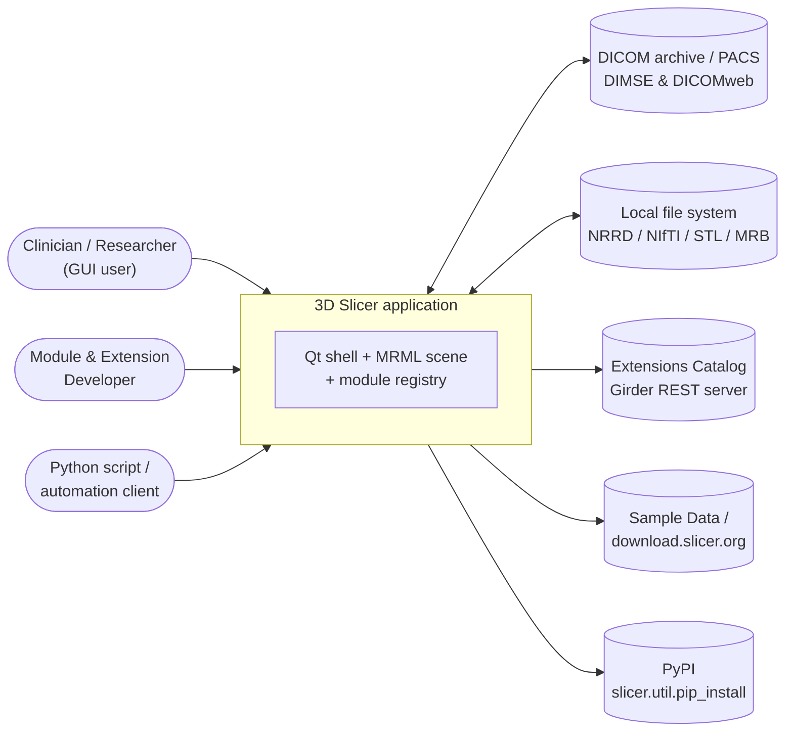

| Actor / external system | Interaction | Evidence |
|---|---|---|
| GUI user | Loads data, drives modules, saves scenes | `Base/QTApp/qSlicerMainWindow.cxx` |
| Developer | Writes CLI / Loadable / Scripted modules, packages them as extensions | `Docs/developer_guide/module_overview.md` |
| Python / HTTP client | `slicer.util.*` API in the embedded interpreter; `/slicer/...` HTTP routes | `Base/Python/slicer/util.py`, `Modules/Scripted/WebServer/WebServerLib/SlicerRequestHandler.py` |
| DICOM archive | Import/export via ctkDICOMDatabase; DICOMweb study fetch | `Modules/Scripted/DICOM/DICOM.py`, `WebServerLib/DICOMRequestHandler.py` |
| Extensions Catalog | `GET /api/v1/app/<id>/extension`, `GET /api/v1/file/<id>/download` | `Base/QTCore/qSlicerExtensionsManagerModel.cxx:2086,1603` |
| Remote data URIs | `vtkHTTPHandler` + `vtkCacheManager` fetch remote files referenced by the scene | `Libs/RemoteIO/vtkHTTPHandler.h`, `Libs/MRML/Core/vtkCacheManager.h` |

---

## 3. High-Level Structure (C4 Level 2)

The repository is organised as five concentric rings. Dependencies point **inward only**:
modules depend on Base, Base depends on Libs, Libs depend on third-party toolkits.

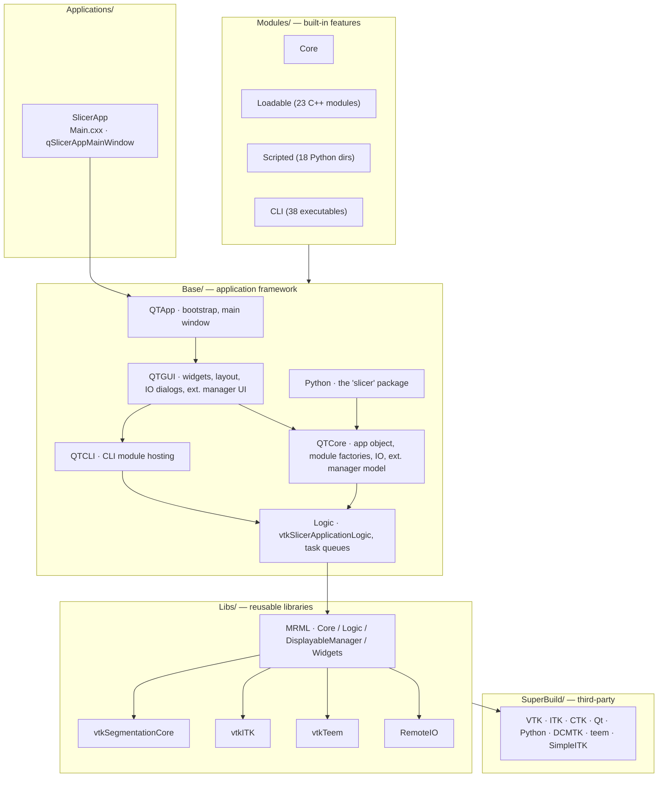

| Path | CMake target | Responsibility |
|---|---|---|
| `Libs/MRML/Core` | `MRMLCore` | Node classes + `vtkMRMLScene`; the data model (144 headers) |
| `Libs/MRML/Logic` | `MRMLLogic` | Non-GUI algorithms over the scene: `vtkMRMLApplicationLogic`, `vtkMRMLSliceLogic`, `vtkMRMLLayoutLogic`, `vtkMRMLColorLogic` |
| `Libs/MRML/DisplayableManager` | `MRMLDisplayableManager` | Scene → VTK actor bridge; 2D/3D widgets and interactor styles |
| `Libs/MRML/Widgets` | `MRMLWidgets` | Reusable Qt widgets bound to MRML (node selectors, slice widget) |
| `Libs/vtkSegmentationCore` | — | Multi-representation segmentation data + conversion rules |
| `Libs/vtkITK`, `Libs/vtkTeem` | — | ITK and Teem adapters exposed as VTK filters |
| `Libs/RemoteIO` | `RemoteIO` | `vtkHTTPHandler` — remote URI fetching |
| `Base/Logic` | `SlicerBaseLogic` | `vtkSlicerApplicationLogic` (background processing/read/write queues), `vtkSlicerModuleLogic`, `vtkSlicerCLIModuleLogic` |
| `Base/QTCore` | `qSlicerBaseQTCore` | Headless app core: `qSlicerCoreApplication`, module factory manager, `qSlicerCoreIOManager`, `qSlicerExtensionsManagerModel`, Python manager |
| `Base/QTGUI` | `qSlicerBaseQTGUI` | GUI framework: `qSlicerApplication`, `qSlicerLayoutManager`, IO dialogs, module panel/selector, extensions manager widgets |
| `Base/QTCLI` | `qSlicerBaseQTCLI` | Turns SlicerExecutionModel XML into a Qt GUI + process runner |
| `Base/QTApp` | `qSlicerBaseQTApp` | `qSlicerMainWindow`, `qSlicerApplicationHelper` (startup orchestration) |
| `Base/CLI` | `SlicerBaseCLI` | Progress-reporting helpers linked into CLI executables |
| `Base/Python/slicer` | — | `slicer.util`, `slicer.ScriptedLoadableModule`, `slicer.cli`, `parameterNodeWrapper` |
| `Modules/Core` | — | Hidden infrastructure modules (`EventBroker`) + `qSlicerCoreModuleFactory` |
| `Extensions/CMake` | — | Standalone driver that builds/tests/packages/uploads a directory of extension descriptions |
| `SuperBuild.cmake`, `SuperBuild/` | — | Builds every third-party dependency, then Slicer itself as an ExternalProject |

---

## 4. Components — inside the application framework (C4 Level 3)

### 4.1 The application object and what it owns

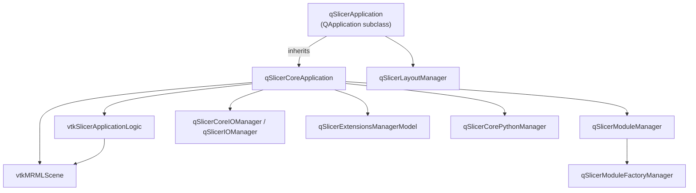

`qSlicerCoreApplication` (`Base/QTCore/qSlicerCoreApplication.h`) is the composition root.
Its `Q_INVOKABLE` accessors — `mrmlScene()`, `applicationLogic()`, `moduleManager()`,
`coreIOManager()`, `extensionsManagerModel()`, `corePythonManager()` — are what the whole
Python API is built on. `qSlicerApplication` (`Base/QTGUI`) adds the GUI-only pieces
(layout manager, IO manager with dialogs, styles).

The split is deliberate: **QTCore has no GUI**, so Slicer can run headless
(`--python-script`, `--testing`, CLI-only builds) with the same object graph.

### 4.2 The module subsystem — the heart of the plugin architecture

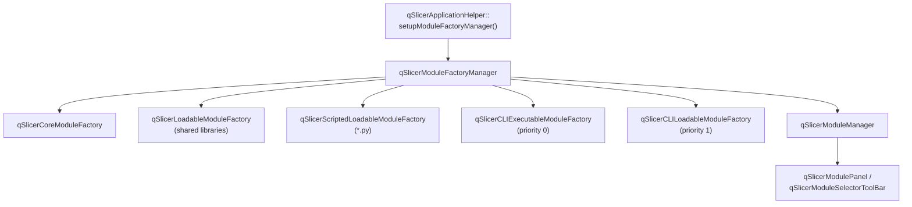

Search paths come from three sources, all funnelled into the same manager
(`Base/QTApp/qSlicerApplicationHelper.cxx:126-220`):

1. Built-in paths under `slicerHome()`: `Slicer_QTLOADABLEMODULES_LIB_DIR`,
   `Slicer_QTSCRIPTEDMODULES_LIB_DIR`, `Slicer_CLIMODULES_LIB_DIR`.
2. `Modules/AdditionalPaths` from the **revision-specific** `QSettings` — this is where
   installed extensions inject themselves.
3. `--additional-module-path(s)` command-line arguments (session-only).

Two negative lists gate loading: `Modules/IgnoreModules` (persistent, per-module checkbox in
Application Settings) and `--modules-to-ignore` (session-only).

> **Note on CLI priority.** `preferExecutableCLIs = true` is hard-coded: the *executable*
> factory is registered at priority 0 and the *loadable* (in-process shared library) factory
> at priority 1. The comment in `qSlicerApplicationHelper.cxx` gives the reasoning —
> a crashing CLI cannot take down the application, and startup time/memory stay low
> (see Slicer issue #4893).

### 4.3 Rendering — how scene state reaches the screen

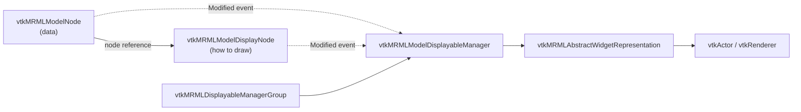

No module draws anything directly. A **displayable manager** observes the scene
(`OnMRMLSceneNodeAdded` / `OnMRMLSceneNodeRemoved` / `ProcessMRMLNodesEvents`) and
creates/destroys widget representations, which own the `vtkActor`s. Factories
(`vtkMRMLThreeDViewDisplayableManagerFactory`, `vtkMRMLSliceViewDisplayableManagerFactory`)
let any module — including one shipped in an extension — register a new manager class.

---

## 5. OOP & Class Architecture

### 5.1 The three parallel hierarchies

Slicer's object model is best read as **three parallel trees that never merge**, joined only
by the scene:

| Tree | Root | Concern | Wrapped for Python by |
|---|---|---|---|
| **Data** | `vtkMRMLNode` | *What* the data is | VTK Python wrapping |
| **Logic** | `vtkMRMLAbstractLogic` | *Algorithms* over the scene, no GUI | VTK Python wrapping |
| **Module / GUI** | `qSlicerAbstractCoreModule` | *Packaging + user interface* | PythonQt |

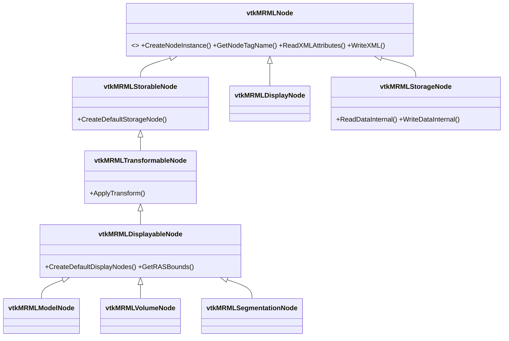

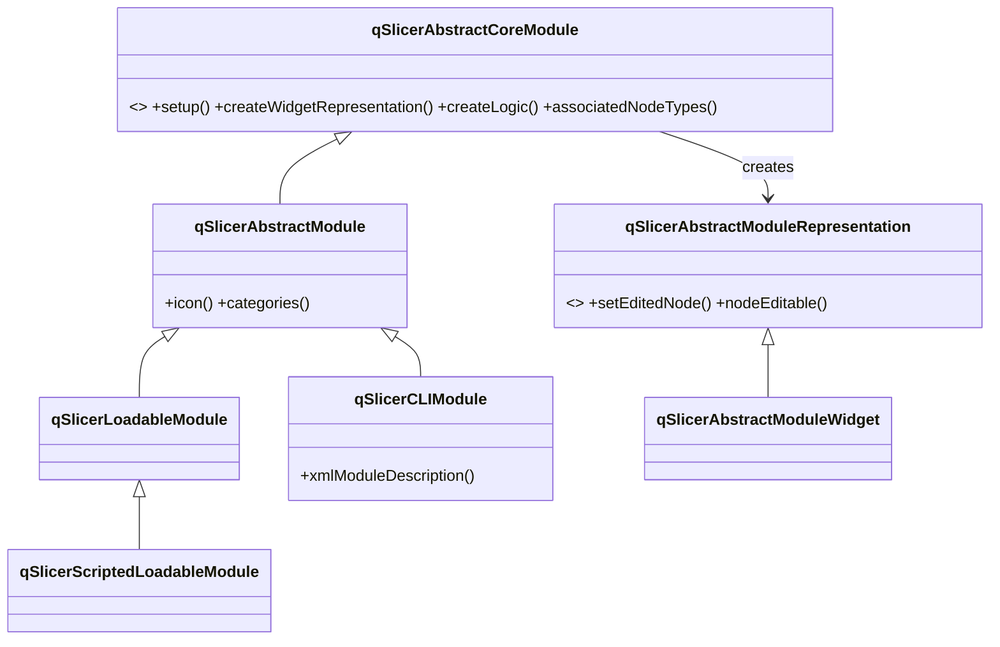

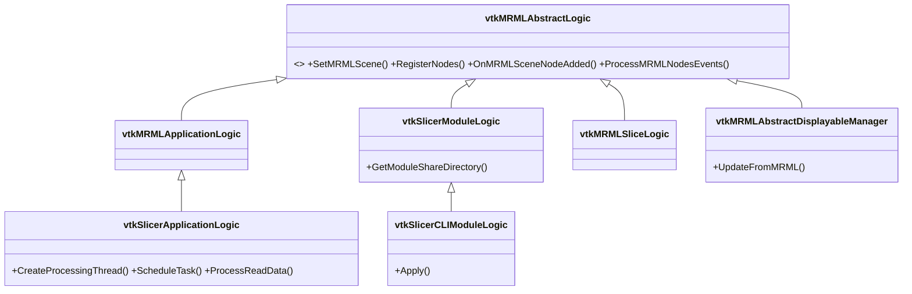

### 5.2 Patterns in use

| Pattern | Where | Why |
|---|---|---|
| **Abstract Factory + registry** | `qSlicerAbstractModuleFactoryManager` with N `qSlicerModuleFactory` implementations, each `ctkAbstractPluginFactory<qSlicerAbstractCoreModule>` | One discovery pipeline for four unrelated module technologies (C++ .so, .py, .exe, built-in) |
| **Observer / event broker** | VTK command-observer on every `vtkMRMLNode`; `vtkSetAndObserveMRMLObjectMacro`; `Modules/Core/EventBroker` | Modules stay decoupled — they observe scene state, not each other |
| **Pimpl (D-pointer)** | Every `q*` class: `qSlicerCoreApplication_p.h`, `qSlicerExtensionsServerWidget_p.h`, `Q_DECLARE_PRIVATE` | Qt convention; keeps the ABI stable so binary extensions survive patch releases |
| **VTK object factory** | `vtkMRMLNodeNewMacro`, protected constructors, `New()` | Reference-counted lifetime + automatic Python wrapping |
| **Model–View separation** | `qSlicerExtensionsManagerModel` (QTCore) vs `qSlicerExtensionsManagerWidget` (QTGUI) | Model works headless; the same logic drives GUI and script |
| **Bridge (data ↔ presentation)** | data node → display node → displayable manager → widget representation | One data set can be displayed differently per view; display state is not data state |
| **Template Method** | `vtkMRMLStorageNode::ReadData()` → protected `ReadDataInternal()`; `vtkMRMLAbstractLogic::OnMRMLScene*` hooks | Subclasses fill in one step, the framework owns the sequence |
| **Prototype / registered node types** | `vtkMRMLScene::RegisterNodeClass` via `vtkSlicerModuleLogic::RegisterNodes()`, `CreateNodeInstance()` | Scene can instantiate node classes it was never compiled against |
| **Chain of responsibility** | `qSlicerCoreIOManager` readers/writers; `qSlicerSubjectHierarchyPluginHandler` (`canOwnSubjectHierarchyItem()` returns a confidence score) | Highest-confidence handler wins at runtime |

---

## 6. Key Flows

### 6.1 Startup — from `main()` to a populated module list

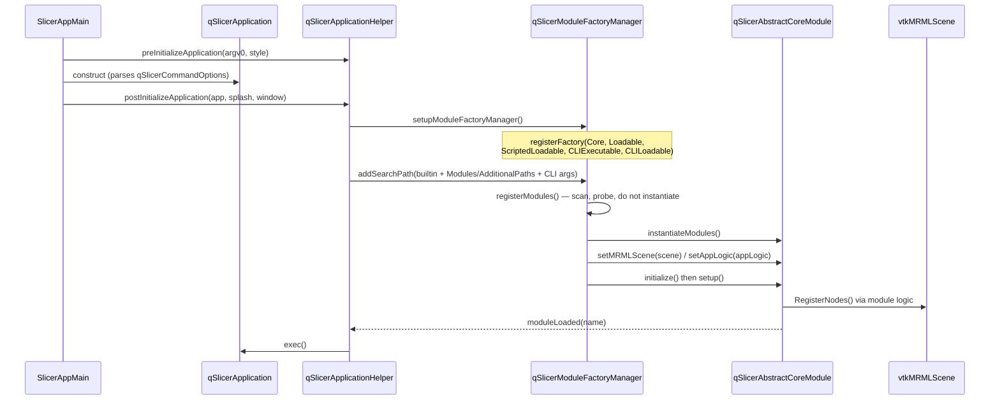

The factory pass is deliberately two-phase — *register* (cheap probe, records which file is a
module) then *instantiate* (expensive: dlopen / import / run `--xml`). This is what makes a
failed module a greyed-out row in Application Settings rather than a startup crash.

### 6.2 Running a CLI module — the process boundary

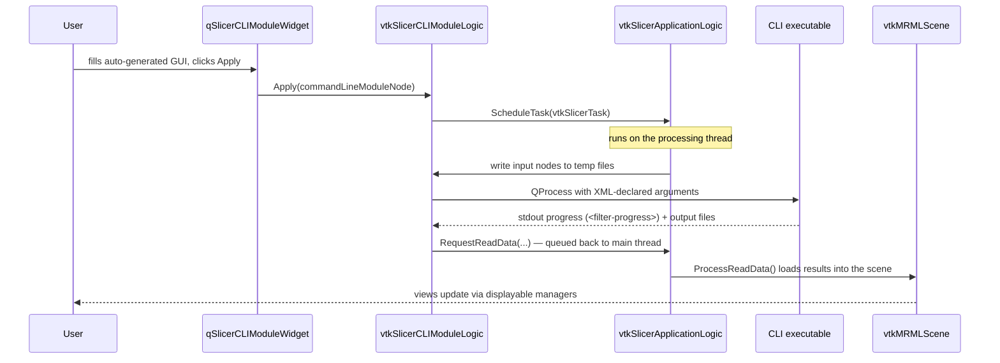

This is the clearest expression of Slicer's concurrency model: **the MRML scene is
main-thread-only**. `vtkSlicerApplicationLogic` owns a processing thread plus
`ModifiedQueue` / `ReadDataQueue` / `WriteDataQueue`, each mutex-guarded, and marshals every
scene mutation back to the main thread (`Base/Logic/vtkSlicerApplicationLogic.h:282-301`).

### 6.3 Loading a file — reader selection

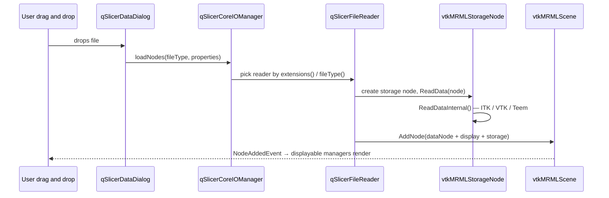

---

## 7. Extension Points

Slicer is unusually extension-dense; almost every subsystem exposes a registration hook.
Full treatment is in [Extension Mechanism](/case-studies/patterns-in-the-wild/slicer-extension-mechanism/); the inventory:

| Extension point | Registration call | Adds |
|---|---|---|
| Module | discovered by a `qSlicerModuleFactory` from a search path | A whole feature + GUI |
| MRML node type | `vtkSlicerModuleLogic::RegisterNodes()` → `vtkMRMLScene::RegisterNodeClass` | New data type in the scene, loadable from `.mrml`/`.mrb` |
| Renderer | `vtkMRMLThreeDViewDisplayableManagerFactory::RegisterDisplayableManager()` (also the slice-view factory) | New geometry in 2D/3D views |
| File reader / writer | `qSlicerCoreIOManager::registerIO()` | New file formats in Add Data / Save |
| Data-tree behaviour | `qSlicerSubjectHierarchyPluginHandler::registerPlugin()` | Icons, context menu actions, ownership rules in the Data module |
| Segment editor effect | Python effect class discovered by the Segment Editor | New segmentation tool |
| DICOM plugin | `Modules/Scripted/DICOMPlugins` — classes exposing `examineForImport` / `load` | New DICOM object support |
| View layout | XML layout registered via `vtkMRMLLayoutLogic` | New view arrangement |
| Node ↔ module association | `qSlicerAbstractCoreModule::associatedNodeTypes()` or `qSlicerCoreApplication::addModuleAssociatedNodeType()` | "Edit properties…" routing |
| Settings page | `qSlicerSettingsPanel` subclass | New Application Settings tab |
| Remote module (core-adjacent) | `Slicer_Remote_Add()` in `SuperBuild.cmake` | Module built into the app from an external repo at a pinned git hash |

---

## 8. Key Abstractions / Glossary

| Term | Definition |
|---|---|
| **MRML** | *Medical Reality Modeling Language*. The data model **and** its library (`Libs/MRML`). Pronounced "MURml". |
| **MRML scene** (`vtkMRMLScene`) | The single in-memory repository holding every node. The application has exactly one; modules share it. Serialized as `.mrml` (XML index) or `.mrb` (zip bundle). |
| **Node** (`vtkMRMLNode`) | One item in the scene: unique ID, name, key/value attributes, typed payload, references to other nodes, and VTK events. |
| **Data / Display / Storage node** | The three-way split of one dataset: *what it is*, *how to draw it*, *how to persist it*. A data node may have several display nodes (one per view style) and a storage node per format. |
| **Node reference** | Named, role-tagged link between nodes (`role` string → target node ID), the mechanism behind data→display, data→storage, and transform parenting. |
| **Logic** | A `vtkMRMLAbstractLogic` subclass: algorithms over the scene with no GUI. `vtkSlicerModuleLogic` is a module's logic; `vtkSlicerApplicationLogic` is the application-wide one. |
| **Module** | The unit of feature packaging. Four kinds: **Core** (built-in, hidden), **Loadable** (C++ shared library), **Scripted** (Python), **CLI** (XML-described executable). |
| **Displayable manager** | The observer that turns scene state into VTK actors for one view. |
| **Widget / Widget representation** | Interaction half / drawing half of an interactive object in a view (`vtkMRMLAbstractWidget`, `vtkMRMLAbstractWidgetRepresentation`). |
| **Subject hierarchy** | The scene-wide folder tree (`vtkMRMLSubjectHierarchyNode`) shown by the Data module; supersedes older per-type hierarchies. |
| **Parameter node** | A MRML node used to hold a module's settings so they are saved with the scene and undoable (`Base/Python/slicer/parameterNodeWrapper`). |
| **Extension** | A delivery package bundling one or more modules, distributed through the Extensions Catalog. |
| **SlicerExecutionModel (SEM)** | The convention by which a standalone executable describes its parameters in XML (`--xml`), from which Slicer generates a GUI. |
| **RAS / LPS** | Anatomical coordinate conventions. Slicer stores coordinates in **RAS** internally and assumes files are **LPS** unless stated otherwise. |
| **SuperBuild** | The outer CMake build that compiles all third-party dependencies then Slicer itself as an ExternalProject. |
| **Remote module** | A module living in its own git repository but compiled *into* the Slicer core at a pinned revision via `Slicer_Remote_Add()`. |

---

## 9. Open Questions & Notes

Determined from source in this repository; the following were **not** verified here:

1. **Actual runtime object graph vs. build-time structure.** This document is derived from
   source layout, class declarations, and the project's own developer guide. The application
   was not built or run in this session, so no dynamic verification (loaded module count,
   real `slicerHome()` layout) was performed.
2. **CTK internals.** `ctkAbstractPluginFactory`, `ctkDICOMDatabase`, and the CTK app
   launcher are third-party (`SuperBuild/External_CTK.cmake`) and were read only through
   their use sites in this repo.
3. **Remote modules and remote extensions.** `SuperBuild.cmake` pulls `vtkAddon`,
   `BRAINSTools`, `MultiVolumeExplorer`, `MultiVolumeImporter`, `SimpleFilters`,
   `CompareVolumes`, `LandmarkRegistration`, `SurfaceToolbox` from external repositories.
   Their internals are outside this checkout, so their architecture is not covered.
4. **Version-specific numbers.** Module counts (23 Loadable, 18 Scripted, 38 CLI) and the
   version (5.11.0, `CMakeLists.txt:94-101`) are from this checkout at commit `dfcce2e5f9`
   and will drift.
5. **Undo/redo.** `vtkMRMLScene` has an undo/redo stack, but the developer guide states it is
   disabled by default and "not tested thoroughly". Treat it as an unfinished subsystem
   rather than a load-bearing architectural feature.
