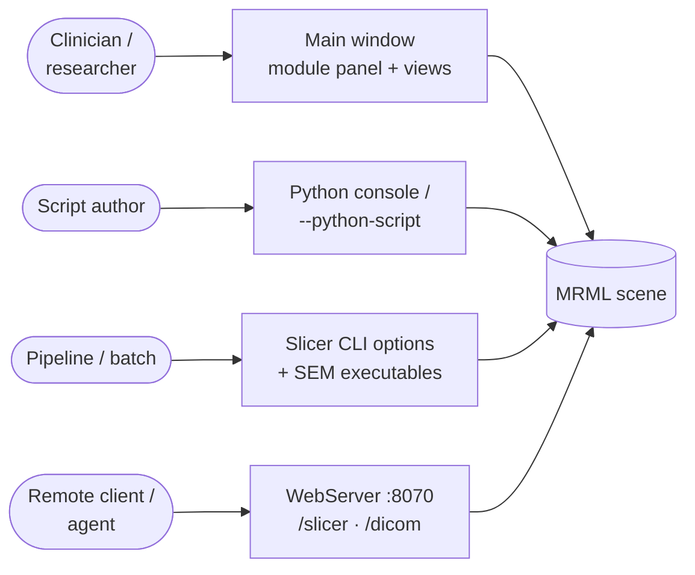
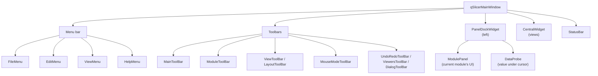
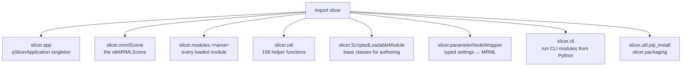
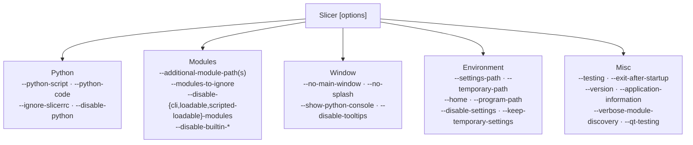
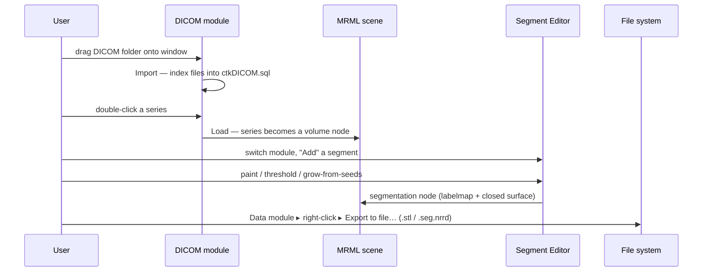
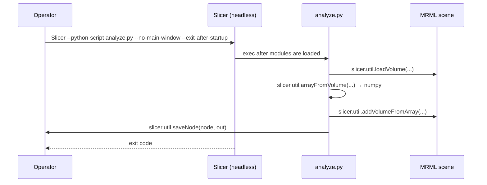
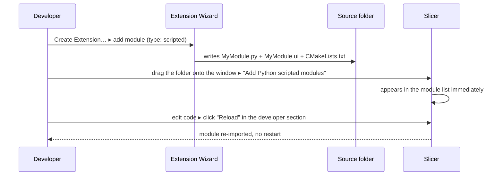
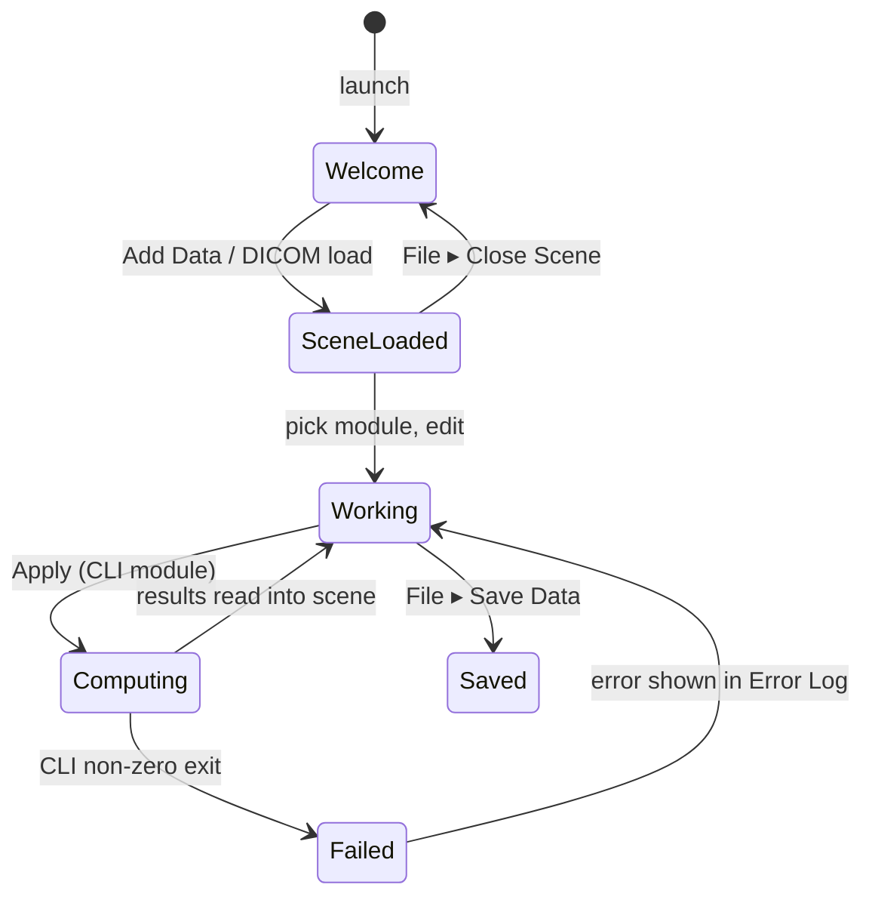

> Source: `https://github.com/slicer/slicer.git` (branch `main`, Slicer 5.11.0) · Date: 2026-09-04 · Mode: Explain · Surface: **Hybrid** (GUI app + Python library/SDK + CLI + optional Web API)
> See also: [System & OOP Architecture](/case-studies/apps/slicer_system_oop_architecture/) · [Data Architecture](/case-studies/apps/slicer_data_architecture/) · [Extension Mechanism](/case-studies/patterns-in-the-wild/slicer-extension-mechanism/)

---

## Cheat Sheet

**GUI — the five things every user does**

| Task | Where |
|---|---|
| Load a file | Drag & drop onto the window, or `File ▸ Add Data` (`FileAddDataAction`) |
| Load DICOM | `LoadDICOMAction` toolbar button → DICOM module (import, then double-click to load) |
| Switch feature | Module Selection toolbar (`ModuleToolBar`); `Ctrl+F` opens the module finder |
| Change view arrangement | Layout toolbar (`LayoutToolBar`) — Conventional, Four-Up, One-Up Red, … |
| Save everything | `File ▸ Save Data`, or the package icon for a single self-contained `.mrb` |

**Python console (`View ▸ Python Console`) — the most-used calls**

```python
slicer.mrmlScene                                   # the one data repository
slicer.app                                         # qSlicerApplication singleton
slicer.modules.volumes                             # any loaded module by lower-cased name
vol = slicer.util.loadVolume("/path/CT.nrrd")      # load a file into the scene
arr = slicer.util.arrayFromVolume(vol)             # voxels as a numpy array (zero-copy view)
node = slicer.util.getNode("CT")                   # look a node up by name or ID
slicer.util.saveNode(vol, "/tmp/out.nrrd")         # write one node
slicer.util.pip_install("SimpleITK")               # install a package into Slicer's Python
slicer.util.selectModule("SegmentEditor")          # drive the GUI
slicer.util.errorDisplay("something went wrong")   # user-visible message
```

**Application command line**

```bash
Slicer --python-script analyze.py --no-main-window --exit-after-startup   # headless batch
Slicer --python-code "print(slicer.app.revision)"                         # one-liner
Slicer --additional-module-paths /path/to/my/modules                      # try a module without installing
Slicer --testing                                                          # implies --disable-settings --ignore-slicerrc
Slicer --disable-cli-modules --no-splash                                  # faster startup while developing
```

**CLI module executable (SlicerExecutionModel)**

```bash
ThresholdScalarVolume --xml                                  # print the GUI/parameter spec
ThresholdScalarVolume --threshold 100 in.nrrd out.nrrd       # run standalone, no Slicer needed
```

---

## 1. Overview

3D Slicer's surface is a **desktop GUI whose every feature is a module**, wrapped in three
additional consumer-facing surfaces: an embedded **Python API**, an **application command
line**, and an opt-in **HTTP API**. The unifying idea a user meets in the first five minutes
is stated in the project's own words (`Docs/user_guide/user_interface.md`):

> "Slicer stores all loaded data in a data repository, called the *scene*. … Modules
> typically do not interact with each other directly: they just all operate on the data
> nodes in the scene."

Everything below follows from that: you load data into *the* scene, you pick a module to act
on it, and every surface — GUI, Python, HTTP — is a different way to reach the same scene.

### Surface classification — Hybrid

| Surface | User | Evidence |
|---|---|---|
| **GUI app** (primary) | Clinician / imaging researcher | `Base/QTApp/Resources/UI/qSlicerMainWindow.ui`; 8 toolbars, 5 menus, module panel |
| **Library / SDK** (Python) | Module & script author | `Base/Python/slicer/` — `util.py` (158 public functions), `ScriptedLoadableModule.py`, `parameterNodeWrapper/` |
| **CLI** (two distinct kinds) | Operator / batch pipeline | App options in `Base/QTCore/qSlicerCoreCommandOptions.cxx` + `Base/QTGUI/qSlicerCommandOptions.cxx`; SEM executables in `Modules/CLI/*/*.xml` |
| **Web API** (opt-in) | Remote client / automation | `Modules/Scripted/WebServer/` — default port **8070** |

### Who the user is, and how they arrive



---

## 2. Surface Map

### 2.1 GUI — main window anatomy



Verified from `Base/QTApp/Resources/UI/qSlicerMainWindow.ui`.

**Menu actions** (names are the real Qt action objects):

| Menu | Actions |
|---|---|
| **File** | `FileAddDataAction`, `LoadDICOMAction`, `FileLoadDataAction`, `FileLoadSceneAction`, `FileImportSceneAction`, `FileAddVolumeAction`, `FileAddTransformAction`, `RecentlyLoadedMenu`, `FileSaveSceneAction`, `SDBSaveToMRBAction`, `SDBSaveToDirectoryAction`, `FileCloseSceneAction`, `FileFavoriteModulesAction`, `FileExitAction` |
| **Edit** | `EditUndoAction`, `EditRedoAction`, `CutAction`/`CopyAction`/`PasteAction`, `EditRecordMacroAction`/`EditPlayMacroAction`, `EditApplicationSettingsAction` |
| **View** | `ViewExtensionsManagerAction`, `ViewCacheRemoteIOManagerAction`, `LayoutMenu` (≈20 `ViewLayout*Action` entries), `WindowToolBarsMenu`, `AppearanceMenu`, `ShowStatusBarAction`, `WindowMaximizeViewAction` |
| **Help** | `FeedbackReportUsabilityIssueAction`, `FeedbackMakeFeatureRequestAction`, documentation links |
| **Developer** (hidden unless enabled) | `DebugLoadModuleAction`, `ModuleHomeAction` |

**Module categories** — the tree a user browses in the Module Selection menu. Collected from
`categories()` in Loadable modules, `self.parent.categories` in Scripted modules, and
`<category>` in CLI XML:

```
Converters · Developer Tools (·DICOM Plugins) · Diffusion (·Utilities) · Endoscopy
Examples · Filtering (·Arithmetic ·Denoising ·Morphology) · Informatics
Legacy (·Filtering ·Segmentation) · Quantification · Registration (·Specialized)
Segmentation · Sequences · Servers · Surface Models · Testing (·Legacy ·TestCases) · Utilities
```

Categories use `.` as a nesting separator — `Filtering.Denoising` is a submenu.

**Views** available in a layout: slice views (Red / Yellow / Green and more), 3D views, plot
views, table views. The layout itself is data (`vtkMRMLLayoutNode`) described by an XML
grammar documented in `Docs/developer_guide/mrml_overview.md`, so a module can register a
new one.

### 2.2 Python API — the `slicer` package



`app`, `mrmlScene`, `modules`, `moduleNames` are set **only** inside the embedded interpreter
of the Slicer application, not in the standalone Python (`Base/Python/slicer/__init__.py`
warns about exactly this).

`slicer.util` groups into families — the naming is the API's main affordance:

| Family | Representative calls |
|---|---|
| Load | `loadVolume`, `loadSegmentation`, `loadModel`, `loadMarkups`, `loadTransform`, `loadTable`, `loadText`, `loadSequence`, `loadScene`, `loadNodeFromFile` |
| Save / export | `saveNode`, `saveScene`, `exportNode`, `openSaveDataDialog` |
| Find | `getNode`, `getNodes`, `getNodesByClass`, `getFirstNodeByName`, `getSubjectHierarchyItemChildren` |
| NumPy bridge | `arrayFromVolume`, `arrayFromModelPoints`, `arrayFromSegmentBinaryLabelmap`, `arrayFromMarkupsControlPoints`, `arrayFromTableColumn`, `updateVolumeFromArray`, `addVolumeFromArray`, `dataframeFromTable` |
| ITK bridge | `itkImageFromVolume`, `addVolumeFromITKImage`, `updateVolumeFromITKImage` |
| Drive the GUI | `selectModule`, `getModuleWidget`, `getModuleLogic`, `setSliceViewerLayers`, `mainWindow`, `findChild`, `loadUI`, `resetThreeDViews` |
| Talk to the user | `infoDisplay`, `warningDisplay`, `errorDisplay`, `confirmYesNoDisplay`, `delayDisplay`, `createProgressDialog`, `tryWithErrorDisplay` |
| Environment | `pip_install`, `pip_uninstall`, `downloadFile`, `extractArchive`, `tempDirectory`, `settingsValue`, `launchConsoleProcess` |

**Authoring contract** (`slicer.ScriptedLoadableModule`) — the four classes a Python module
author subclasses:

| Class | Role |
|---|---|
| `ScriptedLoadableModule` | Metadata: title, `categories`, contributors, help text |
| `ScriptedLoadableModuleWidget` | The GUI; `setup()`, `cleanup()`, plus a free Reload/Test developer section |
| `ScriptedLoadableModuleLogic` | Headless algorithms; `getParameterNode()`, `createParameterNode()` |
| `ScriptedLoadableModuleTest` | `unittest.TestCase` with `delayDisplay()`, `takeScreenshot()`, `runTest()` |

### 2.3 Application command line



All verified in `qSlicerCoreCommandOptions::addArguments()` and
`qSlicerCommandOptions::addArguments()`.

### 2.4 CLI module executables (SlicerExecutionModel)

A CLI module is a *standalone* program that also runs inside Slicer. Its whole surface is one
XML document it prints on `--xml`:

| XML element | Becomes |
|---|---|
| `<category>` | Position in the module tree |
| `<title>`, `<description>`, `<documentation-url>`, `<contributor>` | Module help panel |
| `<parameters><label>` | A collapsible group box in the GUI |
| `<image>`, `<float>`, `<string-enumeration>`, `<integer>`, … | One typed widget + one command-line argument |
| `<channel>input/output` | Whether Slicer writes a temp file in or reads one back out |
| `<index>` | Positional argument |
| `<flag>` / `<longflag>` | `-t` / `--threshold` |

Example, verified in `Modules/CLI/ThresholdScalarVolume/ThresholdScalarVolume.xml`.

### 2.5 Web API (opt-in, `WebServer` module)

Off by default. Enabled per-handler with checkboxes in the module panel
(`WebServer/enableSlicerHandler`, `enableExec`, `enableDICOM`, `enableStaticPages`,
`enableCORS`). Default bind `("", 8070)`.

| Route prefix | Handler | Purpose |
|---|---|---|
| `/slicer/mrml`, `/mrml/ids`, `/mrml/names`, `/mrml/properties`, `/mrml/file` | `SlicerRequestHandler` | Enumerate and fetch scene nodes |
| `/slicer/volumes`, `/slicer/volume` | " | List volumes; GET/POST voxel data as NRRD |
| `/slicer/gridTransforms`, `/slicer/gridTransform` | " | Transforms as NRRD |
| `/slicer/fiducials`, `/slicer/segmentations`, `/slicer/segmentation` | " | Markups and segmentations |
| `/slicer/slice`, `/slicer/threeD`, `/slicer/threeDGraphics`, `/slicer/screenshot`, `/slicer/timeimage` | " | Rendered PNG of a view |
| `/slicer/gui`, `/slicer/system`, `/slicer/system/version` | " | Layout control, app info |
| `/slicer/sampledata`, `/slicer/volumeSelection`, `/slicer/tracking` | " | Load sample data, pick layers, live pose input |
| `/slicer/accessDICOMwebStudy` | " | Pull a study from a DICOMweb store into the scene |
| `/slicer/exec` | " | **Arbitrary Python execution — separate opt-in checkbox** |
| `/dicom/studies`, `/dicom/…/series`, `/dicom/…/instances` | `DICOMRequestHandler` | Serve Slicer's DICOM database as **DICOMweb** (QIDO-style) |
| `/` and other paths | `StaticPagesRequestHandler` | Serve files from `Resources/docroot` |

Handlers are selected by a **confidence score**: each returns a float from
`canHandleRequest(uri)` (0.5 for a prefix match, 0.0 otherwise) and the highest wins.

---

## 3. Entry & Onboarding

### GUI first run

Slicer opens on the **Welcome** module — `Slicer_DEFAULT_HOME_MODULE` defaults to `"Welcome"`
(`CMake/SlicerApplicationOptions.cmake:87`), implemented by `Modules/Loadable/SlicerWelcome`.
The smallest real first action is drag-and-drop: dropping a `.nrrd`,
`.stl`, or a folder of DICOM files on the window opens `qSlicerDataDialog` with a reader
already guessed per file. Dropping a folder of `.py` files instead offers *"Add Python
scripted modules to the application"* — which is how a developer tries an unbuilt module
without touching settings.

### Python first call

`View ▸ Python Console` (or `--show-python-console`). Three lines are the whole hello-world:

```python
import SampleData
vol = SampleData.SampleDataLogic().downloadMRHead()
slicer.util.arrayFromVolume(vol).shape
```

For a script run outside the console, the entry is `Slicer --python-script my.py`. A personal
startup file `~/.slicerrc.py` is executed at every launch unless `--ignore-slicerrc`
(`qSlicerCoreApplication.cxx:1356`).

### Extension author first step

`Modules/Scripted/ExtensionWizard` generates a working skeleton from
`Utilities/Templates/` — no manual file copying. Templates exist for `Default` and
`SuperBuild` extensions and for `CLI`, `ScriptedCLI`, `Loadable`, `Scripted`,
`LoadableCustomMarkups`, and `ScriptedSegmentEditorEffect` modules.

### CLI module first call

A SEM executable needs nothing from Slicer:

```bash
ThresholdScalarVolume --xml          # discover the interface
ThresholdScalarVolume --help         # generated from the same XML
```

---

## 4. Key User Journeys

### 4.1 DICOM → segmentation → export (the canonical clinical path)



Two steps that surprise newcomers, both by design: DICOM is **two-phase** (import into the
database, *then* load into the scene), and *Save* (round-trippable scene) is a different verb
from *Export* (a file for another program).

### 4.2 Scripted batch — no window



`--no-main-window` still constructs the full application object and loads every module — the
scene, logics, and CLI runner are all available; only the window is absent.

### 4.3 Extending the GUI from Python (the DX journey)



The Reload/Test buttons come free from `ScriptedLoadableModuleWidget.setupDeveloperSection()`
when *Developer mode* is on in Application Settings. This edit-reload loop is the single
biggest DX affordance of the Python path over the C++ path.

---

## 5. Interaction & State

### GUI states



- **Progress**: `qSlicerCLIProgressBar` renders `<filter-progress>` markers a CLI writes on
  stdout; long CLI runs stay cancellable because they are separate processes.
- **Errors**: surface in the **Error Log** (status-bar ✕ icon) and, for scripted code, via
  `slicer.util.errorDisplay` / `tryWithErrorDisplay`.
- **Module load failures are non-fatal and visible**: Application Settings ▸ Modules
  colour-codes each module — black = loaded, grey = ignored, red = failed
  (`Docs/user_guide/settings.md`).
- **Mouse modes** are a persistent global state, not a per-view one:
  Transform / Window-Level / Place, in `MouseModeToolBar`, backed by
  `vtkMRMLInteractionNode` — so the mode is saved with the scene.
- **Undo/redo** exists in the toolbar (`UndoRedoToolBar`) but the developer guide states scene
  undo is **disabled by default** and lightly tested; treat it as unreliable.

### CLI contract

| Surface | Contract |
|---|---|
| `Slicer` app | Standard process exit code; `--exit-after-startup` returns after startup completes; `--application-information` prints a machine-readable dump |
| SEM executable | Non-zero exit on failure; progress via `<filter-progress>` on stdout; `--xml` prints the full interface spec |

### HTTP contract

Handlers return `(contentType, responseBody)`; unmatched paths fall through to the static
handler. There is **no authentication layer** — the only gate is that the server is off by
default and `/slicer/exec` needs its own second checkbox. CORS is a third opt-in
(`WebServer/enableCORS`, default `False`).

---

## 6. Information Architecture / API Ergonomics

### What is consistent

- **One noun everywhere.** *Node* is the unit in the GUI tree, in `slicer.util.getNode`, in
  `/slicer/mrml/ids`, and in the file format. A user learns it once.
- **Verb-first, type-suffixed Python naming.** `loadVolume` / `loadSegmentation` /
  `loadMarkups`; `arrayFrom<Type>` / `update<Type>FromArray`. Guessable in both directions.
- **Category dot-nesting** (`Filtering.Denoising`) is the same string in CLI XML and in
  Python `categories`, so a module's placement is written once regardless of language.
- **The same object graph in every surface.** `slicer.app.mrmlScene() == slicer.mrmlScene`;
  the HTTP handler manipulates that same scene. No surface has a private model.

### Where it is rough

- **Three module technologies, three authoring contracts.** A CLI module is XML + argv; a
  Loadable module is C++ subclassing; a Scripted module is Python subclassing. The GUI hides
  the difference from *users*, but developers must pick early and switching is a rewrite.
- **Save vs. Export vs. Save-to-MRB** are three separate actions with different persistence
  semantics — the most common point of confusion in the user guide's own FAQ material.
- **Legacy surface remains visible.** `Legacy.Filtering`, `Legacy.Segmentation` categories and
  `Annotations` / `SceneViews` modules are superseded but still shipped.
- **`slicer.util` is flat and large** — 158 top-level functions in one namespace. Discovery
  relies on prefix conventions rather than submodules.

### AX note — the surface an agent would drive

Slicer's non-GUI surfaces are unusually agent-friendly in three respects and weak in two:

*Good.* (1) The SEM `--xml` contract is genuinely self-describing — an agent can discover a
CLI module's full parameter schema, types, and defaults in one call, with no docs. (2) The
HTTP surface returns typed payloads (NRRD, PNG, JSON) at stable paths and dispatches by
confidence score, so adding a handler cannot break existing routes. (3) `slicer.util` is
token-economical: `arrayFromVolume` hands back a NumPy view rather than a serialized dump.

*Weak.* (1) There are **no stable machine-readable error codes** on the HTTP surface — errors
arrive as text in the response body, so an agent cannot branch reliably. (2) `/slicer/exec`
is all-or-nothing: an agent either gets no scripting or gets arbitrary code execution, with
no scoped middle ground. An agent-driven deployment should keep `exec` off and drive the
typed routes.

For a full evaluative audit of these surfaces, use the `ax-interface` lens rather than this
document.

---

## 7. Configuration & Customization

### Application Settings (`Edit ▸ Application Settings`)

Panels, each a `qSlicerSettings*Panel` in `Base/QTGUI/Resources/UI/`:

| Panel | Notable knobs |
|---|---|
| **General** | Startup script path (`~/.slicerrc.py`), language, confirmations |
| **Modules** | Skip-loading by module type, **Additional module paths**, per-module enable checkbox, Home module, Favorites, temporary directory, show hidden modules |
| **Appearance / Styles** | `Slicer` (follow OS) / `Light Slicer` / `Dark Slicer` |
| **Views** | Default view layout and view properties |
| **Extensions** | Enable Extensions Manager, **server URL**, **installation path** |
| **Python** | Console behaviour |
| **Cache** | Remote-IO cache size and location |
| **Developer** | Developer mode (reveals module Reload/Test), hidden modules |
| **Internationalization** | Language selection |
| **User Information** | Name/organisation stamped into created data |

### Settings storage — three tiers

| Tier | Path accessor | Scope |
|---|---|---|
| Default | `slicerDefaultSettingsFilePath` | Shipped defaults |
| User | `slicerUserSettingsFilePath` | Applies across versions |
| **Revision-specific** | `slicerRevisionUserSettingsFilePath` | Per Slicer revision — this is where installed extensions register their module paths |

The revision tier is why extensions do not leak between Slicer versions: `Modules/AdditionalPaths`,
`LibraryPaths`, `PYTHONPATH`, and `QT_PLUGIN_PATH` are all written per-revision by the
extensions manager (`qSlicerExtensionsManagerModel.cxx:679-757`).

### Customization without writing a module

| Want | Mechanism |
|---|---|
| Run code at every startup | `~/.slicerrc.py` |
| Try a module folder without installing | drag & drop `.py`, or `--additional-module-paths` |
| A custom view arrangement | Register a layout XML via `vtkMRMLLayoutLogic` (see script repository) |
| Different extensions server | Application Settings ▸ Extensions ▸ server URL |
| Extra Python packages | `slicer.util.pip_install(...)` |
| Different look | Styles panel, or a `qSlicerStyle` plugin from an extension |

---

## 8. Open Questions & Notes

1. **Not run in this session.** Every route, action name, option, and function above was read
   from source in this checkout (commit `dfcce2e5f9`). The application was not launched, so
   no runtime confirmation of behaviour, defaults, or rendering was performed.
2. **Menu inventory is structural, not final.** `qSlicerMainWindow.ui` gives the action
   objects; modules and extensions add further menu entries at runtime, so the live menu is a
   superset of §2.1.
3. **Category list is from this checkout only.** Installed extensions contribute their own
   categories, and the list will differ on any real installation.
4. **HTTP surface may drift.** `WebServer` is a scripted module marked with a `# TODO: config
   option for port`; routes are matched by string prefix rather than a declared schema, so
   there is no versioning guarantee.
5. **DICOMweb coverage not verified.** `DICOMRequestHandler` implements QIDO-style study/series/
   instance queries against `slicer.dicomDatabase`; conformance to the DICOMweb standard was
   not assessed.
6. **Localization.** Strings pass through `translate()` / `slicer.i18n.tr`, and there is an
   Internationalization settings panel, but which locales actually ship was not checked.
