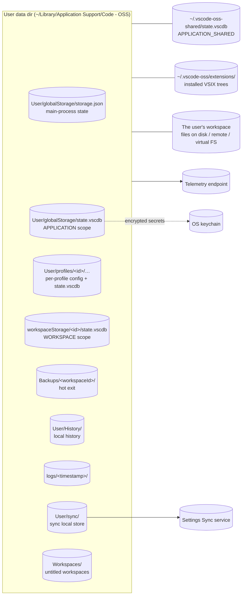
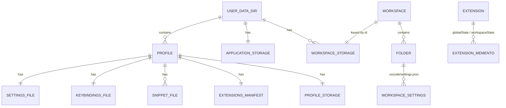
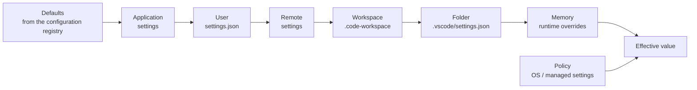
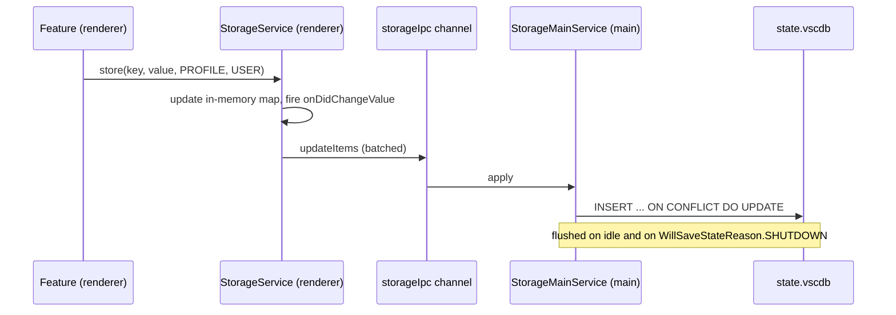
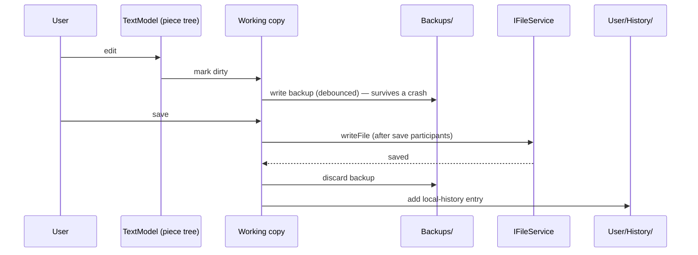
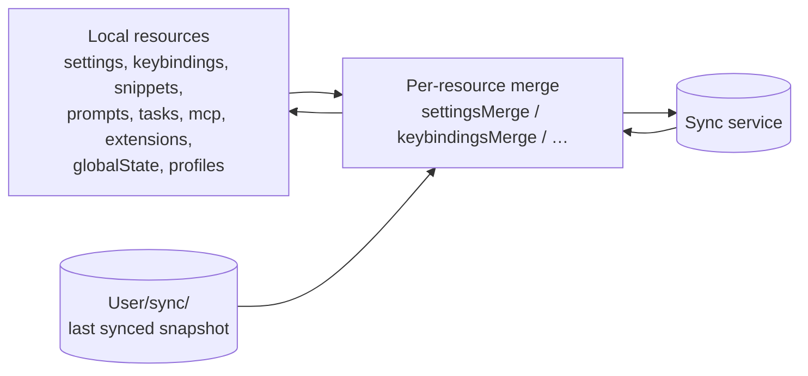
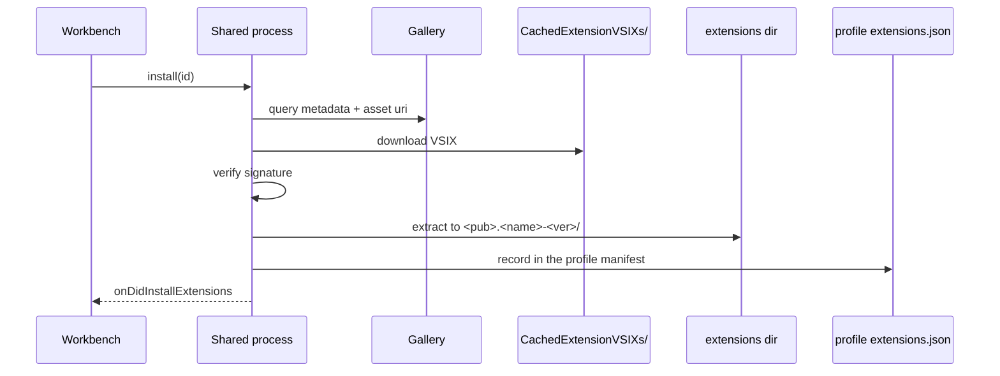

> Source: `https://github.com/microsoft/vscode.git` @ `c772f67cd2f` (v1.137.0) · Date: 2026-09-04 · Mode: Explain · Data system: **Hybrid** — embedded key–value (SQLite) + document/config store (JSON on disk) + file/blob (the user's workspace) + in-memory document model
> See also: [System & OOP Architecture](/case-studies/apps/vscode_system_oop_architecture/) · [User-Facing API & UX/DX](/case-studies/apps/vscode_ux_design/) · [Extension Mechanism](/case-studies/patterns-in-the-wild/vscode-extension-mechanism/)

---

## 1. Overview

VS Code has no database in the usual sense and no server owning its data. Its data architecture answers a different question: **how does a desktop app keep dozens of independent, hot-reloadable features' state consistent across multiple windows, multiple profiles, a remote host, and a crash — without a central schema?**

The answer is four separable classes of data, each with its own store, its own scoping rule, and its own authority:

1. **User intent** — settings, keybindings, snippets, tasks, MCP servers. Human-editable JSON files, layered and merged.
2. **UI and feature state** — which editors were open, tree expansion, dismissed banners, extension mementos. Opaque key–value in SQLite, scoped four ways.
3. **The user's actual content** — files in the workspace. VS Code is a *client*, never the system of record.
4. **Ephemeral working state** — text buffers in memory, plus crash-safety backups on disk.

**Classification evidence.** SQLite: `CREATE TABLE IF NOT EXISTS ItemTable (key TEXT UNIQUE ON CONFLICT REPLACE, value BLOB)` in `src/vs/base/parts/storage/node/storage.ts:343`. Config-as-documents: `IUserDataProfile` (`src/vs/platform/userDataProfile/common/userDataProfile.ts:188`) resolves a profile to nine concrete file URIs. File/blob: `IFileService` plus pluggable `IFileSystemProvider`s. In-memory model: the piece-tree buffer in `src/vs/editor/common/model/pieceTreeTextBuffer/`.

**Tech:** SQLite (via the node bindings behind `base/parts/storage/node/storage.ts`), JSONC files, an OS-keychain-backed encryption service for secrets, and a 1DS appender for telemetry.

---

## 2. Data Landscape

| Store | Kind | Holds | Written by | Read by |
|---|---|---|---|---|
| `User/globalStorage/storage.json` | JSON | Main-process state — window positions, recently opened, profile→workspace association | Main process (`StateService`) | Main process |
| `User/globalStorage/state.vscdb` | SQLite | `StorageScope.APPLICATION` — cross-profile, cross-window UI state; encrypted secrets | Main process (owner), renderers via IPC | All windows |
| `~/<sharedDataFolderName>/state.vscdb` | SQLite | `StorageScope.APPLICATION_SHARED` — state shared between VS Code and the Agents app | Main process | Both apps |
| `User/profiles/<id>/globalStorage/state.vscdb` | SQLite | `StorageScope.PROFILE` — per-profile state and extension `globalState` mementos | Main process | Windows on that profile |
| `workspaceStorage/<id>/state.vscdb` | SQLite | `StorageScope.WORKSPACE` — open editors, view state, extension `workspaceState` | Main process | The window for that workspace |
| `settings.json`, `keybindings.json`, `tasks.json`, `mcp.json`, `snippets/`, `prompts/`, `extensions.json` | JSONC | User intent, per profile | User, Settings UI, Sync | `ConfigurationService` and friends |
| `.vscode/*.json`, `*.code-workspace` | JSONC | Workspace/folder-scoped intent | User, committed to the repo | `WorkspaceService` |
| `<extensions dir>/<pub>.<name>-<ver>/` | Files | Installed extension trees | Shared process installer | Extension scanner |
| `Backups/<workspaceId>/` | Files | Unsaved editor content (hot exit) | `WorkingCopyBackupTracker` | Restore on launch |
| `User/History/` | Files | Local file history entries | `WorkingCopyHistoryService` | Timeline view |
| `User/sync/` | Files | Last-synced snapshots for conflict detection | `UserDataSyncLocalStoreService` | Sync merge |
| OS keychain | External | The master key for the secret store | `IEncryptionService` | Secret storage |
| The workspace itself | Files | **The user's code** | Editors, extensions, external tools | Everything |

The last row is the one to keep in mind: **VS Code is never the system of record for the user's content.** Everything else in this table is recoverable state.

---

## 3. Data Models

### 3a. Conceptual model

### 3b. Physical — the key–value store

Every `state.vscdb` is the same one-table schema:

| Table | Columns | Notes |
|---|---|---|
| `ItemTable` | `key TEXT UNIQUE ON CONFLICT REPLACE`, `value BLOB` | Whole table read into memory on open (`SELECT * FROM ItemTable`); writes batched with `INSERT … ON CONFLICT DO UPDATE … WHERE value != excluded.value` |

That `WHERE value != excluded.value` clause is a deliberate write-amplification guard — a key rewritten with an unchanged value produces no disk write.

Two orthogonal enums classify every entry (`src/vs/platform/storage/common/storage.ts:228`):

| `StorageScope` | Value | Lifetime |
|---|---|---|
| `APPLICATION_SHARED` | -2 | All workspaces, all profiles, shared with the Agents app |
| `APPLICATION` | -1 | All workspaces, all profiles |
| `PROFILE` | 0 | All workspaces of one profile |
| `WORKSPACE` | 1 | One workspace |

| `StorageTarget` | Meaning |
|---|---|
| `USER` | Roams — eligible for Settings Sync |
| `MACHINE` | Stays on this machine |

`StorageTarget` is the sync boundary expressed as data rather than as policy: the sync service simply reads `keys(scope, StorageTarget.USER)`. Two reserved keys carry bookkeeping: `__$__isNewStorageMarker` and `__$__targetStorageMarker`.

Workspace storage folders are keyed by `workspace.id` and carry a sidecar `workspace.json` (`WORKSPACE_META_NAME`) recording which folder or workspace file the opaque id belongs to — without it, `workspaceStorage/` would be unreadable by a human.

### 3c. Physical — the profile as a set of files

`toUserDataProfile()` resolves a profile to fixed names under `User/profiles/<id>/` (default profile uses `User/` directly):

| Field | File |
|---|---|
| `settingsResource` | `settings.json` |
| `keybindingsResource` | `keybindings.json` |
| `tasksResource` | `tasks.json` |
| `mcpResource` | `mcp.json` |
| `languageModelsResource` | `chatLanguageModels.json` |
| `extensionsResource` | `extensions.json` (which extensions this profile enables — *not* the extension bits) |
| `snippetsHome` | `snippets/` |
| `promptsHome` | `prompts/` |
| `globalStorageHome` | `globalStorage/` (contains `state.vscdb` and per-extension folders) |
| `cacheHome` | `<userData>/CachedProfilesData/<id>/` |

A profile can **share** any of these with the default profile via `useDefaultFlags` — that is how "this profile is just the default plus different extensions" is represented: the other fields simply point at the default profile's files. The profile list itself lives under the `userDataProfiles` key (`PROFILES_KEY`) in application state.

Extension mementos map onto this cleanly: `context.globalState` → `PROFILE`-scoped keys, `context.workspaceState` → `WORKSPACE`-scoped keys, and `context.globalStorageUri` → a real directory at `globalStorage/<extension-id-lowercased>/` for extensions that need files rather than key–value.

### 3d. In-memory — the text buffer

`TextModel` stores content as a **piece tree** (`pieceTreeBase.ts`, a red-black tree over immutable string chunks). An edit appends to a chunk buffer and rebalances the tree instead of copying the document, which is what makes editing a 100 MB file tractable. The extension host holds a `MirrorTextModel` kept in sync by deltas rather than a copy of the text.

---

## 4. Dataflow & Lineage

### 4a. Configuration composition (the most-traversed pipeline in the product)

Later layers win — except **policy, which wins over everything** (`MultiplexPolicyService` and `FilePolicyService` are wired in `src/vs/code/electron-main/main.ts`). `ConfigurationTarget` (`configuration.ts:40`) names the layers; `IConfigurationValue<T>` carries every layer's value simultaneously, which is what lets the Settings editor tell you *which* file is overriding you.

Defaults are not a file. They are assembled at runtime from the configuration registry — meaning **an extension's `contributes.configuration` becomes a real default the instant the extension is scanned**, with no restart and no merge step.

### 4b. Storage write path

The main process is the single writer per database file. Renderers hold a synchronous in-memory view and push deltas — so `storageService.get()` never awaits, and two windows on the same profile converge through the main process rather than fighting over the file.

### 4c. One traced lineage — a character typed, all the way out

Ingested (keystroke) → held (piece tree) → protected (backup) → committed (disk) → archived (local history). The local-history retention knobs are real settings: `workbench.localHistory.maxFileEntries` and `workbench.localHistory.mergeWindow`.

### 4d. Settings Sync

Nine `SyncResource` values (`userDataSync.ts:169`): `settings`, `keybindings`, `snippets`, `prompts`, `tasks`, `mcp`, `extensions`, `globalState`, `profiles`. Each has a dedicated three-way merge module comparing local, remote, and the last-synced snapshot — which is why a settings conflict shows you a real diff rather than last-write-wins. `globalState` sync is exactly the `StorageTarget.USER` subset of the key–value store.

### 4e. Extension installation

Note the split: **extension bits are global to the machine; extension enablement is per profile.** Two profiles using the same extension share one copy on disk and differ only in their `extensions.json`. `extensionsWatcher.ts` watches the directory so an out-of-band change is noticed.

---

## 5. System of Record & Ownership

| Entity | System of record | Derived / cached copies |
|---|---|---|
| User's files | **The filesystem** (local, remote, or a virtual FS provider) | `TextModel` in the renderer; `MirrorTextModel` in the extension host; backups in `Backups/` |
| Settings | The `settings.json` for each layer | In-memory `ConfigurationModel` per layer; a merged view; the remote sync copy |
| Keybindings | `keybindings.json` + the keybinding registry defaults | Resolved keybinding list in memory |
| UI / feature state | `state.vscdb` for the relevant scope | Renderer in-memory map (write-through) |
| Main-process state | `User/globalStorage/storage.json` | — |
| Installed extension bits | The extensions directory on disk | `extensionsScannerService` cache; `CachedExtensionVSIXs` for the downloaded archive |
| Extension enablement | The profile's `extensions.json` | `ExtensionDescriptionRegistry` in the renderer; a per-host subset in each extension host |
| Profile list | `userDataProfiles` key in application storage | `IUserDataProfilesService` in memory |
| Secrets | `APPLICATION` / `APPLICATION_SHARED` storage, encrypted | The OS keychain holds the key, not the values |

**Multi-source-of-truth flags** — three places where authority is genuinely split, and each is deliberate:

1. **Settings across sync.** With Settings Sync on, the remote service is a *peer* writer, not a mirror. That is why every resource needs a merge algorithm and why `User/sync/` exists — three-way merge requires a base.
2. **Configuration across local/remote windows.** `USER_LOCAL` and `USER_REMOTE` are distinct targets. In a remote window, some settings resolve locally (UI concerns) and some remotely (tooling paths). There is no single "user settings" file for such a window.
3. **Extension enablement across machines.** Extensions sync by identity, but installation is per machine and per target platform, so the profile manifest and the on-disk reality can legitimately disagree until reconciliation runs.

---

## 6. Storage & Access

- **Read pattern is load-everything-once.** `SELECT * FROM ItemTable` at open; all reads afterwards hit memory. There are no indexes because there are no queries — `ItemTable` has exactly one access path, by exact key. This is right for the size class (thousands of small entries) and would be wrong for anything larger.
- **Write pattern is batch-and-debounce**, flushed on idle and on `WillSaveStateReason.SHUTDOWN`. `IStorageService.optimize(scope)` exists to vacuum a scope.
- **Sharding is by scope, not by size.** Workspace state lives in a separate database per workspace, so deleting a project's state is `rm -rf workspaceStorage/<id>/` and cannot corrupt anything else.
- **The file layer is provider-based.** `IFileService` dispatches by URI scheme to registered `IFileSystemProvider`s. `src/vs/base/common/network.ts` enumerates the schemes: `file`, `vscode-remote`, `vscode-userdata`, `untitled`, `inmemory`, `vscode-notebook-cell`, `vscode-webview`, `extension`, `tmp`, and many more. `vscode-userdata` is the one that matters here — it is why profile config can be read identically on desktop and in a browser with no filesystem.
- **Watching is correlated.** The guidelines require `fileService.createWatcher` (a correlated watcher) over shared watchers, and recursive watching runs out of process (`watcherMain.ts`) so a pathological tree cannot stall the window.
- **Caching is explicit and disposable.** `CachedExtensionVSIXs/`, `CachedProfilesData/`, code cache, language-pack cache — each has a cleaner contributed to the shared process (`sharedProcess/contrib/codeCacheCleaner.ts`, `languagePackCachedDataCleaner.ts`, `storageDataCleaner.ts`, `logsDataCleaner.ts`). Nothing grows unbounded by design.

---

## 7. Lifecycle & Governance

**Schema evolution.** There are no migration files, because there is no schema to migrate. Compatibility is handled per-store:

- `ItemTable` is schemaless (`key`/`value` BLOB); a renamed key is handled by feature-level migration code, not by a migration runner.
- JSON config is forward-compatible by construction: unknown keys are preserved and surfaced as warnings by the schema registry rather than dropped.
- Where a real migration is needed, it is a named module: `extensionStorageMigration.ts`, `unsupportedExtensionsMigration.ts`, and the profile-location fallbacks in `extensionsProfileScannerService.ts`.

**Retention** (from the declared artifacts):

| Data | Retention |
|---|---|
| Hot-exit backups | Deleted on successful save or on clean close |
| Local history | Bounded by `workbench.localHistory.maxFileEntries`, entries merged within `workbench.localHistory.mergeWindow` |
| Logs | New timestamped folder per session; `logsDataCleaner` prunes old ones |
| Workspace storage | Orphans removed by `storageDataCleaner` |
| Caches | Cleaned by the shared-process contribs listed above |

**Classification and access control.**

- **Secrets** never sit in plaintext: `BaseSecretStorageService` encrypts through `IEncryptionService` before storing under `StorageScope.APPLICATION` / `APPLICATION_SHARED` with `StorageTarget.MACHINE` — machine-scoped, therefore never synced.
- **Telemetry** is a declared, typed surface, not ad-hoc logging. Every event carries a GDPR annotation in the source (`ClassifiedEvent`, `IGDPRProperty`, `gdprTypings.ts`), and the `owner` / `comment` / `classification` / `purpose` fields are mandatory at the type level. It respects `telemetry.telemetryLevel` and the `--disable-telemetry` flag, and `code --telemetry` prints the events being collected.
- **Workspace Trust** gates what runs against untrusted content — a data-adjacent control expressed in the UI (see the Surface doc).
- **`StorageTarget.MACHINE` is the practical "do not leave this machine" marker**, and it is the mechanism, not a convention.

---

## 8. Open Questions & External Assumptions

- **Concrete paths depend on `product.json`.** `dataFolderName` is `.vscode-oss` and `sharedDataFolderName` is `.vscode-oss-shared` in this repo; the branded product uses different names, and `VSCODE_PORTABLE` / `VSCODE_APPDATA` relocate everything. Paths in §2 are illustrative for a default macOS OSS build.
- **The Settings Sync service's own storage, retention, and encryption at rest are outside this repo.** Only the client, the resource list, and the merge algorithms are evidence here.
- **The telemetry backend** (retention, aggregation, who can query it) is likewise out of evidence. The repo proves *what is emitted and how it is classified*, not what happens next.
- **Marketplace data** — how gallery statistics, signatures, and asset URIs are produced — is a service contract; `extensionGalleryService.ts` only shows the client's query shape (`FilterType`, `Flag`, `assetUri`).
- **Actual database sizes, growth rates, and vacuum frequency** are runtime properties; `optimize(scope)` exists but the repo does not declare when it is called for each scope.
- **Encryption backend per platform.** `IEncryptionService` is an interface over an OS mechanism; which keychain/credential store is used on each platform is resolved in the Electron layer and was not traced end to end for this document.
- **The `vs/sessions/` layer introduces its own persistence** for agent sessions and automations (`src/vs/sessions/SESSIONS.md`, `AUTOMATIONS.md`). It is under active development and is not covered here.
