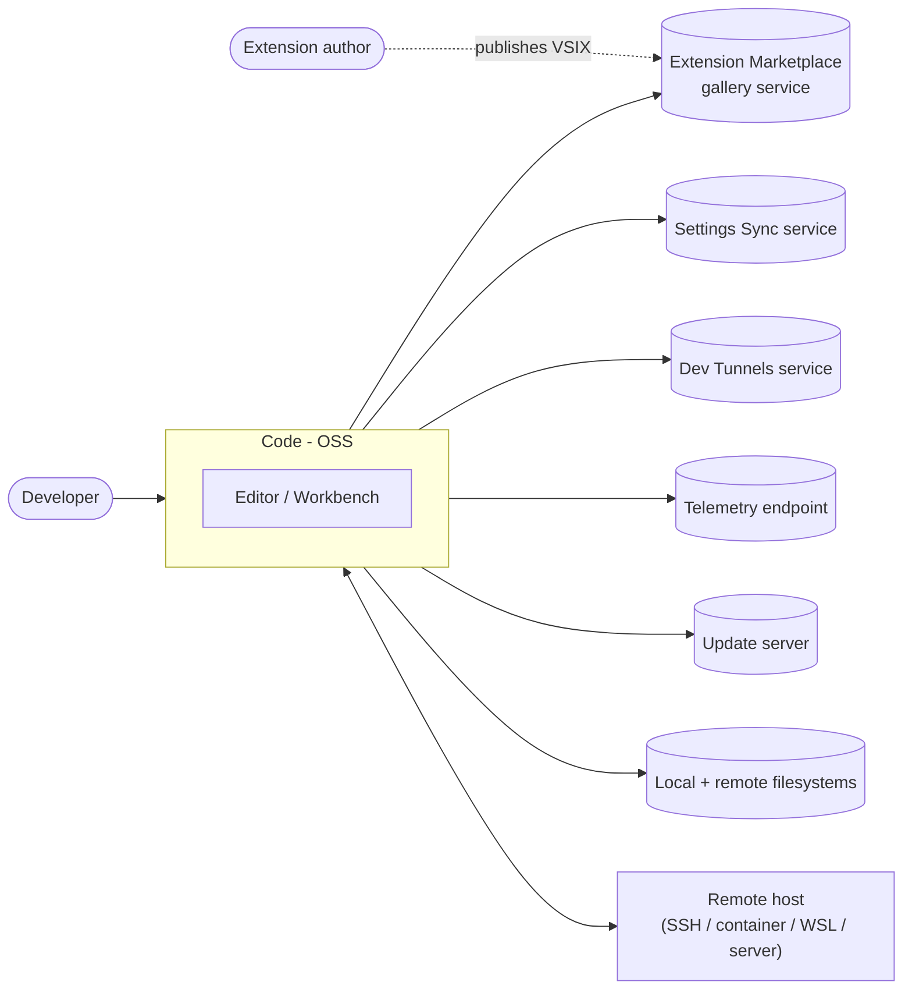
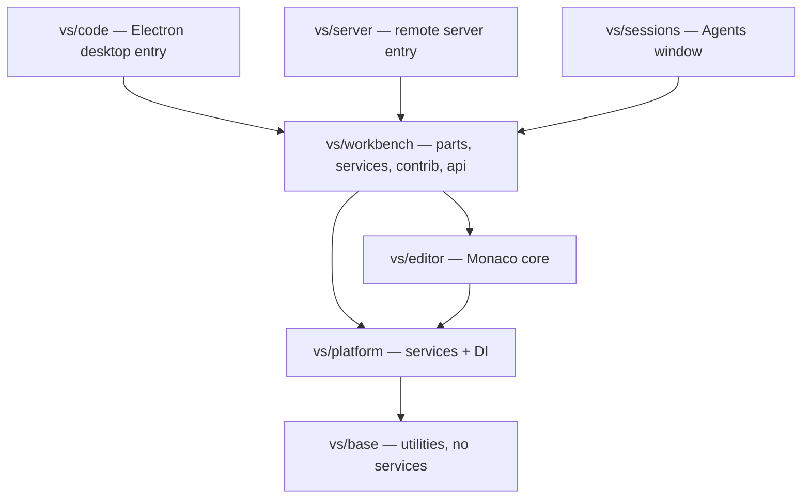
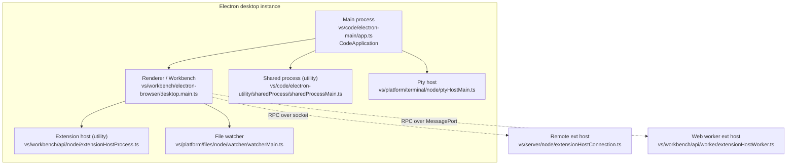
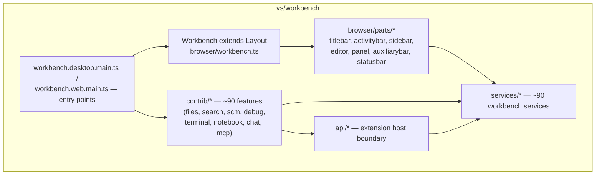
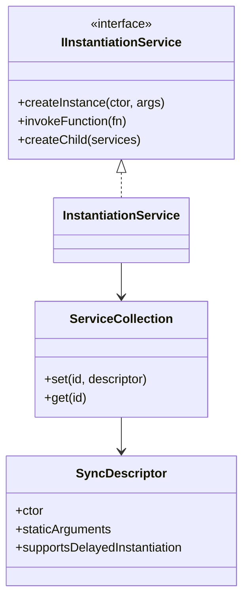
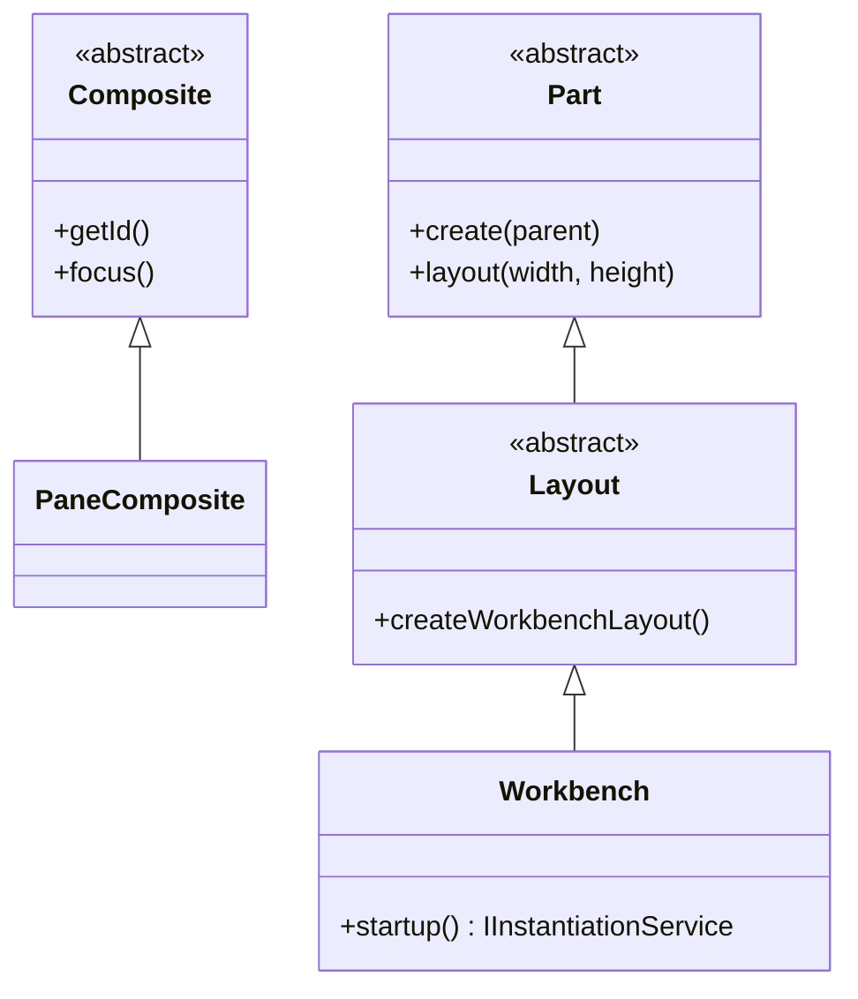
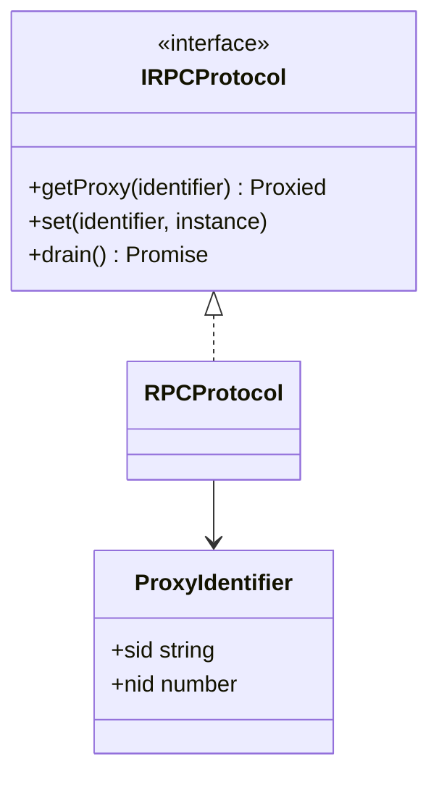
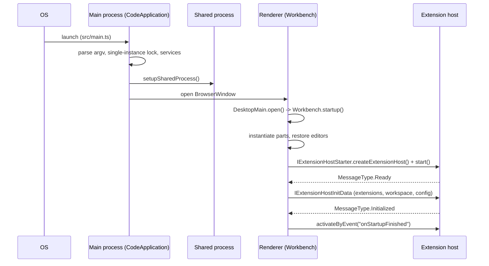
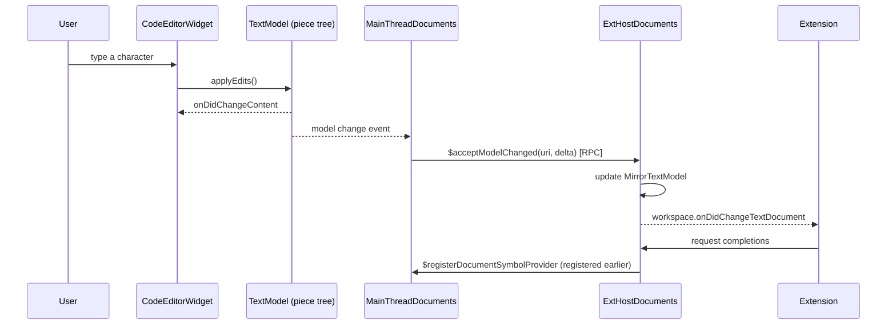

> Source: `https://github.com/microsoft/vscode.git` @ `c772f67cd2f` (v1.137.0) · Date: 2026-09-04 · Mode: Explain · Type: **Hybrid** (multi-process desktop/web application **and** a platform whose public API is `vscode.d.ts`)
> See also: [User-Facing API & UX/DX](/case-studies/apps/vscode_ux_design/) · [Data Architecture](/case-studies/apps/vscode_data_architecture/) · [Extension Mechanism](/case-studies/patterns-in-the-wild/vscode-extension-mechanism/)

---

## 1. Overview

**Code - OSS** is the open-source core of Visual Studio Code: a code editor that runs as an Electron desktop app, as a browser app (`vscode.dev`, `code serve-web`), and as a client/server pair for remote development. Its central design problem is *isolation with reach* — third-party extensions must be able to change almost everything the user sees, without being able to block the UI thread or crash the editor. Nearly every structural decision in the repo follows from that constraint.

**Type classification — Hybrid.** Evidence for *Application*: `package.json` declares `"main": "./out/main.js"`; multiple real entry points exist (`src/main.ts`, `src/cli.ts`, `src/server-main.ts`, `src/vs/code/electron-main/main.ts`). Evidence for *Library/platform*: `src/vscode-dts/vscode.d.ts` (21,238 lines, 15 namespaces) is a published, versioned API contract consumed by out-of-repo code, and 97 built-in extensions under `extensions/` consume it exactly like third-party ones do.

**Tech stack**

| Concern | Choice |
|---|---|
| Language | TypeScript (ESM — `"type": "module"`), tabs, strict conventions in `.github/copilot-instructions.md` |
| Desktop shell | Electron (main + renderer + utility processes) |
| Web | Same workbench code compiled for the browser (`workbench.web.main.ts`) |
| Standalone CLI | Rust (`cli/`, `clap` 4, `tokio`, `reqwest`) — ships as `code` for `tunnel` / `serve-web` |
| Build | `gulp` (`build/gulpfile.ts`) plus an esbuild-based fast path in `build/next/` |
| Editor core | Monaco (`src/vs/editor/`), reusable standalone |
| Persistence | SQLite (`state.vscdb`), JSON files — see the Data Architecture doc |

---

## 2. System Context — C4 Level 1

Two notes the diagram cannot carry:

- **The gallery is not configured in this repo.** `product.json` has no `extensionsGallery` key (verified: `grep -c extensionsGallery product.json` → `0`). Code - OSS ships the *client* for a marketplace; the Microsoft-branded distro supplies the endpoint. `src/vs/platform/extensionManagement/common/extensionGalleryManifest.ts` also exposes `extensions.gallery.serviceUrl` as a configuration key.
- **"Remote host" is a first-class deployment, not an add-on.** `src/vs/server/` is a peer entry point to `src/vs/code/`, and the extension host can legitimately live on the far side of it.

---

## 3. High-Level Structure — C4 Level 2

### 3a. Source layers (compile-time)

The core is a strictly ordered import stack, documented in `.github/instructions/source-code-organization.instructions.md` and enforced by the `local/code-import-patterns` ESLint rule (`npm run valid-layers-check`). Each layer may import only from layers below it.

| Path | Responsibility |
|---|---|
| `src/vs/base/` | Utilities and UI primitives with **no** service dependencies (`Disposable`, `Event`, `URI`, lists/trees, `base/parts/ipc`, `base/parts/storage`) |
| `src/vs/platform/` | Injectable services shared by every layer — `instantiation`, `configuration`, `files`, `storage`, `log`, `telemetry`, `extensionManagement`, `terminal`, `policy`, … (≈90 folders) |
| `src/vs/editor/` | Monaco: text model, tokenizer, view, language features. No `node`/`electron-*` code |
| `src/vs/workbench/` | The application shell: `browser/parts/`, `services/` (≈90), `contrib/` (≈90 features), `api/` (the extension-host boundary) |
| `src/vs/code/` | Electron main process, shared process, node CLI |
| `src/vs/server/` | Remote server: `remoteExtensionHostAgentServer.ts`, `webClientServer.ts` |
| `src/vs/sessions/` | Agents window — a newer top-level layer above `workbench`; may import `workbench`, never the reverse (`src/vs/sessions/LAYERS.md`) |
| `extensions/` | 97 built-in extensions (grammars, language features, `git`, `github`, themes, `copilot`) |
| `cli/` | Rust `code` binary — `tunnel`, `serve-web`, `ext`, `agent` |

Within every layer, folders name the **target environment**: `common` (plain JS only) → `browser` (DOM) / `node` (Node.js) → `electron-browser` (renderer) / `electron-utility` / `electron-main`. This is what makes one workbench codebase compile for desktop, web, and server.

### 3b. Runtime processes (desktop)

| Process | Started by | Owns |
|---|---|---|
| **Main** | Electron; `src/main.ts` → `vs/code/electron-main/main.ts` → `CodeApplication` | Windows, menus, lifecycle, protocol/URL handling, `state.vscdb` ownership, policy, update |
| **Renderer** | Main, one per window | `Workbench` (extends `Layout`), all UI, Monaco, the *renderer half* of the extension API |
| **Shared process** | `SharedProcess` (`app.ts:1155`, `setupSharedProcess`) as an Electron **utility process** with `entryPoint: 'vs/code/electron-utility/sharedProcess/sharedProcessMain'` | Cross-window singletons: extension install/update, settings sync, telemetry, cache cleaners (`contrib/codeCacheCleaner.ts`, `storageDataCleaner.ts`, …) |
| **Extension host** | Renderer, via `IExtensionHostStarter` (`vs/platform/extensions/common/extensionHostStarter.ts`) | Runs all extension code; never touches the DOM |
| **Pty host / file watcher** | Utility-process workers | Terminal processes; recursive filesystem watching — isolated so a hang cannot freeze the window |

Isolation is the recurring motive: everything that can block or crash independently is pushed into its own process and reached over the IPC abstractions in `src/vs/base/parts/ipc/` (`ipc.electron.ts`, `ipc.mp.ts` for `MessagePort`, `ipc.net.ts` for sockets, `ipc.cp.ts` for child processes).

---

## 4. Components — inside the Workbench

The load rule is blunt and important: **only code reachable from an entry point is bundled.** `workbench.common.main.ts` / `.desktop.main.ts` / `.web.main.ts` are lists of side-effecting imports; a feature that no entry point imports simply does not exist in that build. That is how one tree produces a desktop app, a web app, and a server client.

Three contribution rules keep `contrib/` from turning into a ball of mud (same instructions file):

1. Nothing outside `contrib/` may import into `contrib/`.
2. Each contribution has exactly one `*.contribution.ts` entry point.
3. Cross-contribution use goes through a single `common/` API file — never into another feature's internals.

---

## 5. OOP & Class Architecture

Five patterns carry most of the codebase's structure.

### 5a. Dependency injection by decorator

Services are identified by decorators built with `createDecorator<T>('name')` and injected as trailing constructor parameters; implementations register with `registerSingleton(IMyService, MyServiceImpl, InstantiationType.Delayed)`. The house rule (stated in the copilot instructions) is that dependencies **must** be declared in the constructor and must not be pulled from `IInstantiationService` later — which is what keeps the dependency graph statically readable.

### 5b. Registry + contribution

`Registry.as<T>(Extensions.X)` (`vs/platform/registry/common/platform.ts`) is the global lookup for extensible tables — configuration schema, JSON schemas, editor inputs, views, actions. Features push into these registries at import time; consumers read them without knowing who registered.

Workbench features additionally register lifecycle-phased contributions via `registerWorkbenchContribution2` with a `WorkbenchPhase` (`vs/workbench/common/contributions.ts`):

| Phase | Meaning |
|---|---|
| `BlockStartup` | Instantiated before the window is usable — use sparingly |
| `BlockRestore` | Before editors/viewlets are restored |
| `AfterRestored` | Once the UI is up |
| `Eventually` | On idle |

### 5c. Part / Composite (the UI skeleton)

`Parts` (`vs/workbench/services/layout/browser/layoutService.ts:21`) enumerates the fixed slots — `workbench.parts.titlebar`, `.banner`, `.activitybar`, `.sidebar`, `.panel`, `.auxiliarybar`, `.editor`, `.statusbar` — and `Workbench extends Layout` arranges them in a grid. Sidebar/panel/auxiliary bar hold *pane composites*, which is why the same view container can be dragged between them.

### 5d. Proxy / RPC across the process boundary

Every cross-process API pair is declared once in `vs/workbench/api/common/extHost.protocol.ts` as two interface tables — `MainContext` (renderer-side actors, 97 `mainThread*.ts` files) and `ExtHostContext` (extension-host actors, 115 `extHost*.ts` files). `RPCProtocol.getProxy()` returns a `Proxy` whose every method call is serialized to a length-prefixed binary frame (`MessageType.RequestJSONArgs`, `ReplyOKJSON`, `ReplyOKJSONWithBuffers`, …). The `Proxied<T>` mapped type forces every method to return a `Promise`, so the *type system itself* prevents anyone writing synchronous cross-process code.

### 5e. Disposable resource management

`Disposable`, `DisposableStore`, `MutableDisposable`, `DisposableMap` (`vs/base/common/lifecycle.ts`) are used everywhere; the coding guidelines require registering a disposable immediately at creation, and require methods called repeatedly to *return* an `IDisposable` rather than registering into the enclosing class. In a process that must stay alive for days with hundreds of extensions attaching listeners, this is load-bearing, not hygiene.

---

## 6. Key Flows

### 6a. Desktop startup

### 6b. One user edit reaching an extension

This is the representative end-to-end path — it crosses every boundary in the system.

The key property: the extension host holds a **mirror** of the document (`vs/editor/common/model/mirrorTextModel.ts`), synchronized by deltas. Extensions read a local copy at memory speed; they never reach across the wire to read text.

---

## 7. Extension Points

Extensibility exists at four distinct altitudes. Only the last is public.

| Altitude | Mechanism | Audience |
|---|---|---|
| Service | `registerSingleton(IFoo, FooImpl, …)` + constructor injection | Core contributors |
| Registry | `Registry.as(Extensions.X).register…` | Core contributors |
| Workbench contribution | `registerWorkbenchContribution2(id, ctor, phase)` | Core contributors |
| **Extension point** | `ExtensionsRegistry.registerExtensionPoint({ extensionPoint: 'commands', jsonSchema })` | **Extension authors** |

42 files under `src/vs/workbench/` call `ExtensionsRegistry.registerExtensionPoint`, and `src/vs/workbench/services/extensions/common/extensionPoints.json` lists 59 canonical names (`commands`, `menus`, `languages`, `grammars`, `themes`, `views`, `debuggers`, `notebooks`, `chatParticipants`, `languageModelTools`, `mcpServerDefinitionProviders`, …).

Extending Code - OSS *without* forking means one of: an extension (`package.json` `contributes` + the `vscode` API), a theme, a grammar, a debug adapter, an MCP server, or embedding the browser workbench via `vs/workbench/browser/web.api.ts`. **The full mechanism is the subject of its own document — see [Extension Mechanism](/case-studies/patterns-in-the-wild/vscode-extension-mechanism/).**

---

## 8. Key Abstractions / Glossary

| Term | Meaning |
|---|---|
| **Workbench** | The whole application shell around the editor: parts, views, services. `Workbench extends Layout`. |
| **Part** | A fixed layout slot (title bar, sidebar, editor, panel, status bar). See `Parts` enum. |
| **Composite / PaneComposite** | Swappable content hosted inside a part (a view container in the sidebar or panel). |
| **Contribution** | A feature that registers itself at import time; `contrib/*` + `registerWorkbenchContribution2`. |
| **Extension point** | A named key under `contributes` in an extension's `package.json`, plus the JSON schema and handler that consume it. |
| **Extension host** | The isolated process/worker that runs extension code. Three kinds: `LocalProcess`, `LocalWebWorker`, `Remote`. |
| **Running location** | Where a given extension was placed — `LocalProcessRunningLocation`, `LocalWebWorkerRunningLocation`, `RemoteRunningLocation`, each with an `affinity` number. |
| **Proxy identifier** | The `ProxyIdentifier<T>` naming one RPC actor; the registry of them is `MainContext` / `ExtHostContext`. |
| **Profile** | A named bundle of settings, keybindings, snippets, extensions (`IUserDataProfile`). |
| **Target environment** | The `common` / `browser` / `node` / `electron-*` folder that declares which runtime APIs a file may use. |
| **Proposed API** | Unstable API behind `enabledApiProposals`, allowed only for built-ins or under `--enable-proposed-api`. 179 `vscode.proposed.*.d.ts` files. |

---

## 9. Open Questions & Notes

Things this document deliberately does **not** claim, because the repo alone cannot settle them:

- **Distro delta.** Code - OSS ≠ Visual Studio Code. `package.json` references a `distro` commit (`e89f2ac…`) that is not in this repo. Marketplace endpoints, telemetry endpoints, branding, and some proprietary extensions are supplied there. Anything in this doc about *the shipped product's* endpoints is out of evidence.
- **Process counts at runtime.** Extension-host *affinity* (`LocalProcessRunningLocation.affinity`) allows more than one local extension-host process; how many exist for a given session depends on the `extensions.experimental.affinity` setting and runtime conditions, not on anything statically readable.
- **`vs/sessions/` maturity.** The Agents window layer is present with its own specification set (`src/vs/sessions/*.md`) and is under active change (recent commits touch Agent Host and Dev Container sessions). Its contracts are the ones most likely to have moved since this snapshot.
- **Performance characteristics** (startup budget, RPC throughput, memory ceilings) are not derivable from source structure; `src/vs/workbench/contrib/performance/` collects them at runtime.
- **The Rust CLI's exact command surface** was read from `cli/src/commands/args.rs` doc comments, not from a built binary's `--help`; flag defaults may differ once compiled with a real `product.json`.
