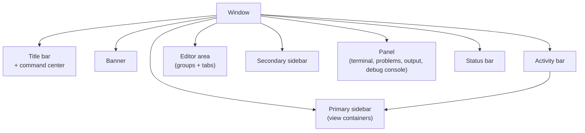
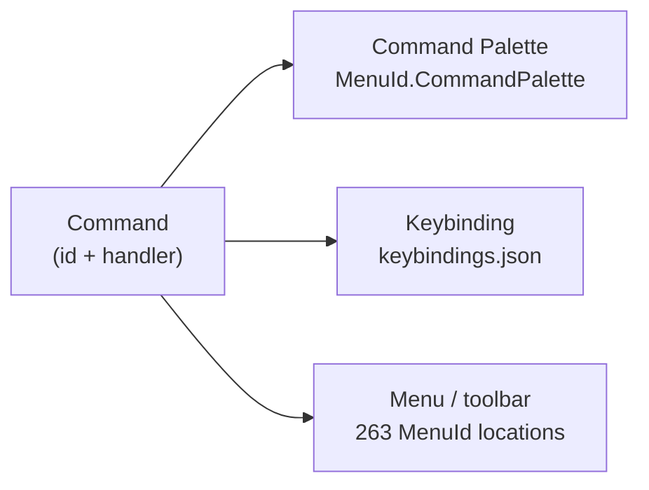
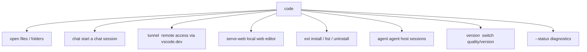
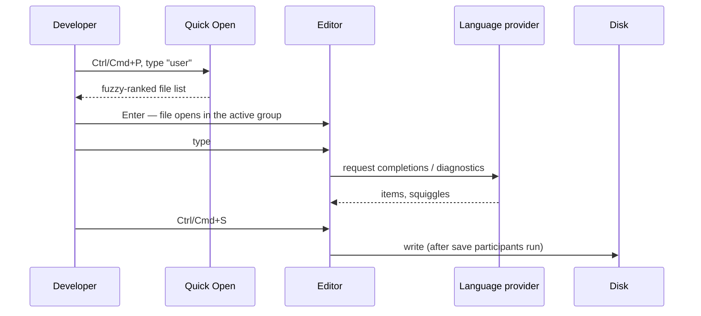
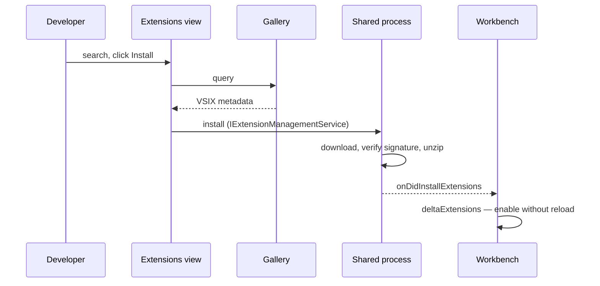
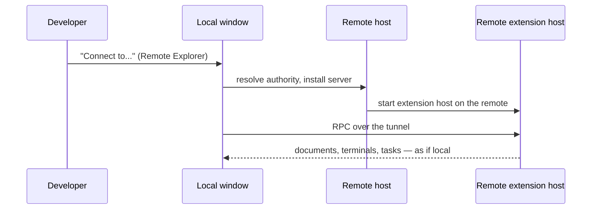
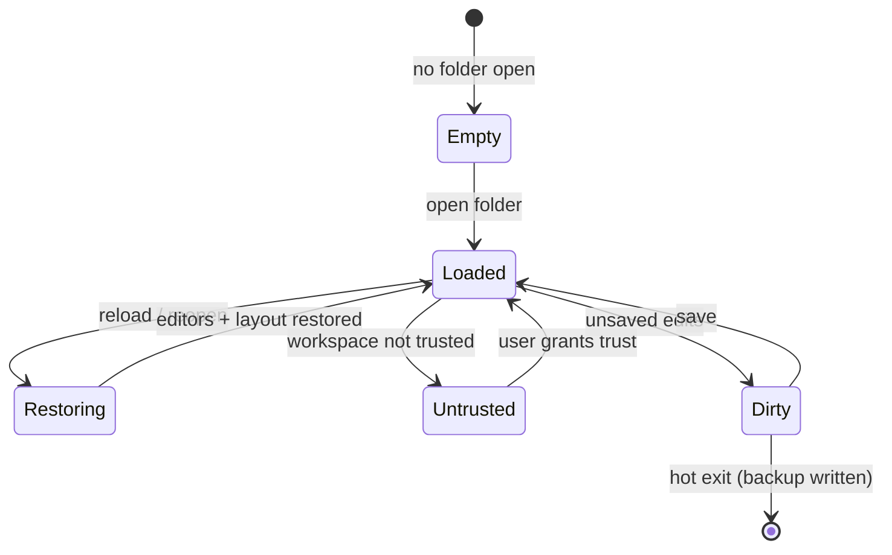

> Source: `https://github.com/microsoft/vscode.git` @ `c772f67cd2f` (v1.137.0) · Date: 2026-09-04 · Mode: Explain · Surface: **Hybrid** (GUI app + CLI + Library/SDK)
> See also: [System & OOP Architecture](/case-studies/apps/vscode_system_oop_architecture/) · [Data Architecture](/case-studies/apps/vscode_data_architecture/) · [Extension Mechanism](/case-studies/patterns-in-the-wild/vscode-extension-mechanism/)

---

## Cheat Sheet

**GUI — the five keystrokes that reach everything else**

| Do this | Press | Command id |
|---|---|---|
| Open any command | `Ctrl/Cmd+Shift+P` | `workbench.action.showCommands` |
| Open any file | `Ctrl/Cmd+P` | `workbench.action.quickOpen` |
| Jump to symbol in file | `Ctrl/Cmd+P` then `@` | — (`GotoSymbolQuickAccessProvider`) |
| Jump to symbol in workspace | `Ctrl/Cmd+P` then `#` | — (`SymbolsQuickAccessProvider`) |
| Go to line | `Ctrl/Cmd+P` then `:` | — (`GotoLineQuickAccessProvider`) |

**CLI — desktop launcher (`src/vs/platform/environment/node/argv.ts`)**

```bash
code .                                   # open a folder in the last active window
code -n path/                            # force a new window
code -r path/                            # reuse the current window
code -d fileA fileB                      # diff two files
code -g file.ts:42:8                     # open at line 42, column 8
code -w CHANGELOG.md                     # block until the file is closed (git EDITOR)
code --install-extension ms-python.python
code --list-extensions --show-versions
code --profile "Teaching" .              # open with a named profile
code --disable-extensions .              # bisect a bad extension
code --status                            # process + diagnostics dump
```

**CLI — standalone Rust binary (`cli/src/commands/args.rs`)**

```bash
code tunnel                              # expose this machine on vscode.dev
code serve-web                           # run the web editor locally
code ext install <id>                    # manage extensions headlessly
code agent                               # manage agent host sessions
```

**Extension SDK — the calls almost every extension makes (`src/vscode-dts/vscode.d.ts`)**

```ts
vscode.commands.registerCommand('ext.doThing', handler);
vscode.window.showInformationMessage('Done');
vscode.workspace.getConfiguration('myExt').get<string>('mode');
vscode.workspace.onDidChangeTextDocument(e => { /* ... */ });
vscode.languages.registerCompletionItemProvider({ language: 'ts' }, provider);
vscode.window.createStatusBarItem(vscode.StatusBarAlignment.Left);
```

---

## 1. Overview

Code - OSS presents **three surfaces to three different users**, and it is worth naming them separately because they are governed by different contracts:

| Surface | User | What "API" means | Evidence |
|---|---|---|---|
| **GUI** | A developer editing code | Screens, parts, commands, keybindings, settings | `src/vs/workbench/browser/parts/`, `Parts` enum, `MenuId` (263 registered menu locations) |
| **CLI** | An operator or script at a terminal | Flag tree, exit behavior, stdout contract | `src/vs/platform/environment/node/argv.ts` (160 options); `cli/` Rust binary with `clap` subcommands |
| **SDK** | An extension author (increasingly, an AI agent) | Exported namespaces and provider interfaces | `src/vscode-dts/vscode.d.ts` — 21,238 lines, 15 namespaces, plus 179 `vscode.proposed.*.d.ts` files |

There is a fourth, narrower surface: **embedding**. `src/vs/workbench/browser/web.factory.ts` exports `create(domElement, options: IWorkbenchConstructionOptions)` — the entry point that lets a host page (vscode.dev, a Codespace, `code serve-web`) mount the whole workbench into a `<div>`.

The GUI is the primary surface and the rest of this document weights accordingly; CLI and SDK get their own sections rather than being folded in.

---

## 2. Surface Map

### 2a. GUI — the workbench shell



Every node above is a real `Parts` member (`src/vs/workbench/services/layout/browser/layoutService.ts:21`): `workbench.parts.titlebar`, `.banner`, `.activitybar`, `.sidebar`, `.editor`, `.auxiliarybar`, `.panel`, `.statusbar`. There is no other top-level chrome — which is the whole point of the layout: **a fixed set of slots, arbitrary content inside them.**

The sidebar and panel host *view containers*, contributed by core features and by extensions. The ones that ship in `src/vs/workbench/contrib/` include Explorer (`files`), Search, Source Control (`scm`), Run and Debug (`debug`), Extensions, Testing, Chat, and Remote Explorer.

### 2b. GUI — the command surface

Everything the user can do is a **command id**, and there are exactly three ways to reach one:



| Touchpoint | What the user does with it |
|---|---|
| `Ctrl/Cmd+Shift+P` | Search all commands visible in `MenuId.CommandPalette`, by title, with the bound key shown |
| `Ctrl/Cmd+P` | Quick Open — files by default; `>` commands, `@` symbols in file, `#` workspace symbols, `:` line, `view ` views |
| Menus | 263 `MenuId` slots — `EditorContext`, `EditorTitle`, `ExplorerContext`, `GlobalActivity`, `CommandCenter`, `SCMTitle`, … |
| Settings editor | `Ctrl/Cmd+,` — a GUI over `settings.json` generated from the configuration registry |
| Keybindings editor | A GUI over `keybindings.json` |

### 2c. CLI — command tree



Two binaries answer to `code`, and knowing which one you have matters:

- **The desktop launcher** — a thin Node shim (`src/vs/code/node/cli.ts`) that parses `argv.ts` options and forwards to a running instance or `cliProcessMain.ts`. This is what handles `-n`, `-r`, `-d`, `-g`, `-w`, `--install-extension`, `--profile`, `--disable-extensions`.
- **The standalone CLI** — the Rust binary in `cli/` (`code-cli`, `default-run = "code"`), whose `clap` `Commands` enum declares `tunnel`, `ext`, `status`, `version`, `serve-web`, `command-shell`, and `agent`. This one runs without a desktop install and is what a headless server gets.

Options are grouped by a `cat` field in `argv.ts` that drives `--help` sectioning: `o` (open), `e` (extension management), `t` (troubleshooting), `m` (MCP).

### 2d. SDK — the `vscode` module

15 stable namespaces, verified in `src/vscode-dts/vscode.d.ts`:

| Namespace | The user's job with it |
|---|---|
| `commands` | Register and execute commands; the universal join between UI and code |
| `window` | Editors, terminals, status bar, notifications, webviews, tree views, quick pick |
| `workspace` | Folders, documents, file system, configuration, file watching |
| `languages` | Register completion/hover/definition/diagnostic providers |
| `env` | Clipboard, `openExternal`, app name, UI kind, telemetry consent |
| `extensions` | Look up other extensions, use their exported API |
| `tasks` | Contribute and run tasks |
| `debug` | Debug sessions, adapter factories, breakpoints |
| `scm` | Source control providers, resource groups, quick diff |
| `notebooks` | Notebook serializers, kernels, renderers |
| `tests` | Test controllers, run profiles, coverage |
| `authentication` | Session-based auth providers (`getSession`) |
| `l10n` | Runtime localization of extension strings |
| `chat` | Chat participants and requests |
| `lm` | Language models and language-model tools |

`chat` and `lm` are the newest and reflect where the product is going; the fact that they sit as peers to `languages` and `debug` is itself a design statement.

---

## 3. Entry & Onboarding

**GUI first run.** The workbench opens with no folder and shows the Welcome page (`contrib/welcomeGettingStarted/`), plus walkthroughs contributed via the `walkthroughs` extension point. `contrib/welcomeViews/` supplies the "you have no folder open" empty states inside view containers — the `viewsWelcome` extension point lets extensions put their own call-to-action there.

**CLI first run.** `code --help` prints the categorized option list built from `argv.ts`. The smallest useful invocation is `code .`.

**Extension author's hello world.** The shortest complete extension is a `package.json` with a `contributes.commands` entry and a `main` file:

```jsonc
// package.json
{
  "engines": { "vscode": "^1.105.0" },
  "main": "./out/extension.js",
  "contributes": {
    "commands": [{ "command": "hello.world", "title": "Hello World" }]
  }
}
```

```ts
// extension.ts
import * as vscode from 'vscode';
export function activate(context: vscode.ExtensionContext) {
  context.subscriptions.push(
    vscode.commands.registerCommand('hello.world', () =>
      vscode.window.showInformationMessage('Hello'))
  );
}
```

No `activationEvents` entry is needed: contributing a command *implies* `onCommand:hello.world` (see `ImplicitActivationEvents`, covered in the Extension Mechanism doc). The `engines.vscode` field is not optional — it is the compatibility gate, and its schema description in `extensionsRegistry.ts` explicitly forbids `*`.

**Embedding host.** `create(domElement, options)` from `web.factory.ts`, with an `IWorkbenchConstructionOptions` carrying at minimum a `workspaceProvider` and optionally a `remoteAuthority`.

---

## 4. Key User Journeys

### 4a. Editing a file (the journey the product is named for)



The visible contract at the last step is worth naming: **save is not just a write.** `storedFileWorkingCopySaveParticipant.ts` lets formatters, code actions, and organize-imports run first, which is why "format on save" feels like part of saving rather than a separate command.

### 4b. Installing an extension



The user-visible promise is "no restart needed", and it is real: `AbstractExtensionService._deltaExtensions` adds the extension to the live registry and pushes it into the running extension host. A reload prompt appears only when the delta cannot be applied (for example, the extension was previously activated and is now being downgraded).

### 4c. Going remote



The UX claim here is that the window stays local while the *workspace* moves. What actually moved is the extension host and the file system provider; the editor, keybindings, and UI extensions stayed on your machine. That split is the `ExtensionKind` `ui` vs `workspace` declaration, and it is why some extensions must be installed "in the remote" and others must not.

---

## 5. Interaction & State

### 5a. GUI states



Three of these deserve calling out because they are unusual for an editor:

- **Untrusted** — Workspace Trust (`vscode-workspace-trust` scheme, `WorkspaceTrustRequestOptions` in the API) gates task execution, debug, and extensions in folders you have not vouched for. It is a security boundary presented as a UI state.
- **Hot exit** — closing with unsaved work is not an error. `WorkingCopyBackupTracker` writes backups under `<userData>/Backups/` and restores them on next launch.
- **Restoring** — layout, open editors, and view state come back because they were persisted per workspace; see the Data Architecture doc.

Errors reach the user through the notification part (`browser/parts/notifications/`), the Problems panel (markers), the Output channels, and inline editor decorations — in roughly that order of intrusiveness.

### 5b. CLI contract

`code --status` prints diagnostics to stdout. `code -w` blocks until the opened file is closed — this is the contract git relies on when `code -w` is your `EDITOR`. `--list-extensions` prints one id per line, `--show-versions` appends `@version`, making both trivially pipeable. The Rust CLI's `tunnel` and `serve-web` are long-running foreground processes.

Exit codes are not centrally enumerated in a single table in this repo; the extension-host process has its own `ExtensionHostExitCode` enum (`extensionHostProtocol.ts:107`), but that is internal, not a CLI contract.

### 5c. SDK contract

The API's error model is plain: providers return `undefined`/`null` to mean "I have nothing", throw to mean "I failed", and accept a `CancellationToken` almost everywhere. Async is pervasive — `Thenable<T>` is the return type of choice, and `Proxied<T>` on the internal RPC side makes it structurally impossible for an API call to be synchronous across the process boundary.

---

## 6. Information Architecture & API Ergonomics

**Naming is a namespace, consistently.** Commands read `workbench.action.<verb><Noun>` for core (`workbench.action.showCommands`, `workbench.action.quickOpen`) and `<extensionId>.<command>` for extensions. Settings read `<feature>.<setting>` (`editor.fontSize`, `workbench.colorTheme`, `files.autoSave`). Menu locations are PascalCase `MenuId`s. Extension points are lowercase plural nouns (`commands`, `menus`, `views`, `debuggers`). The predictability is the feature: once you know one, you can guess the next.

**The contribution/API split is the single most important ergonomic decision.** Static things — commands' titles, menu placements, language associations, themes, views — are declared in `package.json` and read *without running the extension*. Behavior lives in code and runs only when needed. From the user's point of view this is why the palette is fully populated on a cold start: the titles came from manifests, not from executing 60 extensions.

**AX note — the surface as an agent sees it.** All three surfaces are unusually agent-legible, and increasingly so by design:

- The **CLI** is self-describing (`--help` generated from `argv.ts` with per-option `description` strings), token-economical (`--list-extensions` is one id per line), and scriptable without a TTY.
- The **SDK** ships as a `.d.ts` with full doc comments — a complete machine-readable spec, no scraping required.
- The product now treats agents as a *first-class user of itself*: `code chat --mode agent`, `code --add-mcp '{"name":...}'` for registering Model Context Protocol servers, the `lm` and `chat` API namespaces, `languageModelTools` and `mcpServerDefinitionProviders` extension points, and a whole `vs/sessions/` layer for agent sessions.

The gap for an agent driver is the GUI: there is no documented headless command-execution entry point in this repo other than the automation driver used for smoke tests (`src/vs/workbench/services/driver/`), which is test infrastructure and not a supported surface.

---

## 7. Configuration & Customization

Configuration is layered, and the layers are visible to the user (the Settings editor shows which one won). `ConfigurationTarget` (`src/vs/platform/configuration/common/configuration.ts:40`) enumerates them:

```
DEFAULT  <  APPLICATION  <  USER (USER_LOCAL / USER_REMOTE)  <  WORKSPACE  <  WORKSPACE_FOLDER  <  MEMORY
                                                                                   (and POLICY overrides all)
```

| What the user tunes | Where | Notes |
|---|---|---|
| Settings | `settings.json` per profile; `.vscode/settings.json` per folder | JSON with comments; schema from the configuration registry, so `contributes.configuration` shows up with descriptions and validation |
| Keybindings | `keybindings.json` | `when` clauses over context keys |
| Snippets | `snippets/` in the profile; `contributes.snippets` from extensions | |
| Tasks / launch | `.vscode/tasks.json`, `.vscode/launch.json` | Extended by `taskDefinitions` / `debuggers` extension points |
| Themes & icons | `workbench.colorTheme`, `workbench.iconTheme` | Backed by the `themes` / `iconThemes` / `productIconThemes` extension points |
| Profiles | Named bundles of all of the above (`IUserDataProfile`) | `code --profile "Name" .`; per-workspace association |
| Settings Sync | `userDataSync` | Syncs settings, keybindings, snippets, tasks, extensions, UI state, MCP, prompts |
| MCP servers | `mcp.json` per profile; `code --add-mcp '<json>'` | |
| Policy | OS policy (Windows registry / macOS profile) or a managed settings file | Wins over every user layer — `MultiplexPolicyService` in `electron-main/main.ts` |

For extension-level customization, `contributes.configuration` registers into the same registry the core uses, so a third-party setting is indistinguishable from a built-in one in the Settings UI. That symmetry is deliberate and is the reason the settings editor needs no special-casing for extensions.

---

## 8. Open Questions & Notes

- **Keychords quoted here are the source defaults**, read from `quickAccessActions.ts` and `commandsQuickAccess.ts`. Platform-specific overrides exist in the same files (Firefox is excluded from `Ctrl+Shift+P`, for instance), and the shipped product may differ where the distro overrides defaults.
- **The Marketplace UX described in §4b assumes a configured gallery.** Code - OSS has none (`product.json` has no `extensionsGallery`); in a bare OSS build the Extensions view can still install from VSIX but has nothing to search.
- **Exit codes** for the CLI are not centrally documented in the repo; a caller wanting to branch on failure should test empirically rather than trust an inferred table.
- **`vs/sessions/` (the Agents window) is a live surface under active development** with its own specification set. Its layout, sidebar, and provider contracts are documented in `src/vs/sessions/LAYOUT.md` and siblings, and are the parts of this document most likely to be stale first.
- **The Settings editor's search and rendering behavior** (`contrib/preferences/`) is substantial UX in its own right that this document treats only as "a GUI over `settings.json`".
- **Accessibility** is a real surface here (`contrib/accessibility/`, `accessibilitySignals/`, an `accessibility.instructions.md` guideline file) that deserves its own pass; this document does not attempt one.
