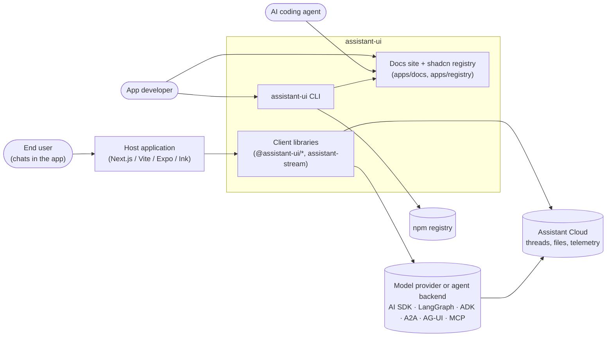
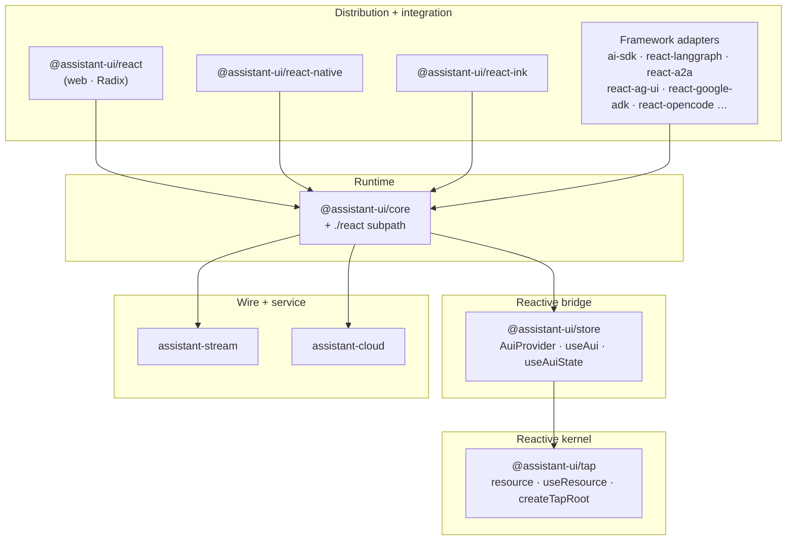
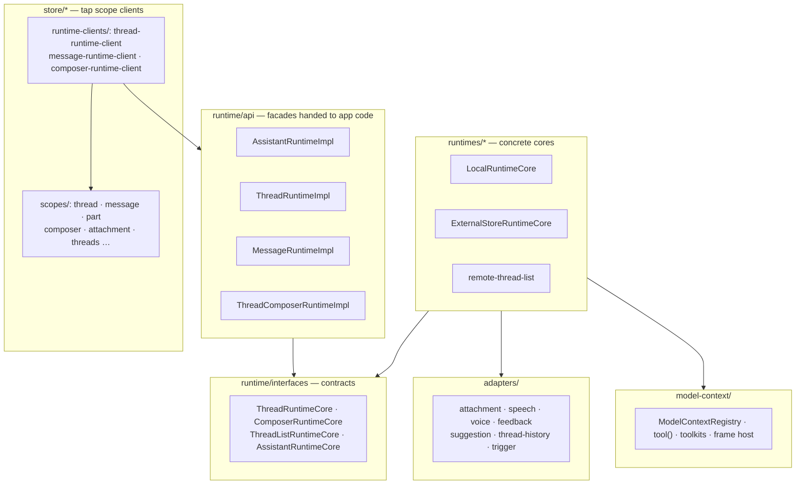
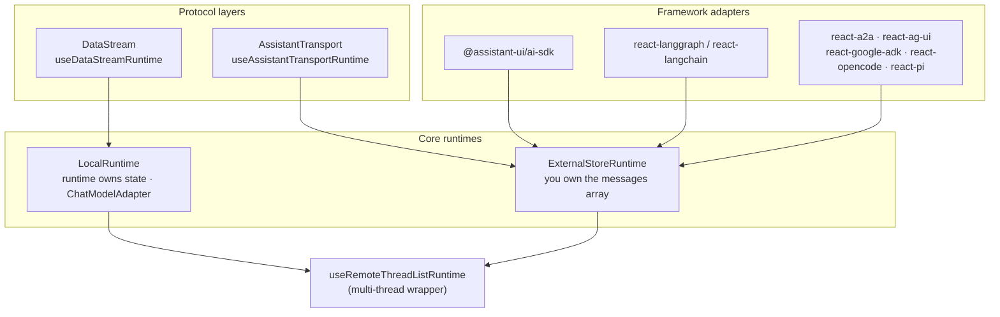
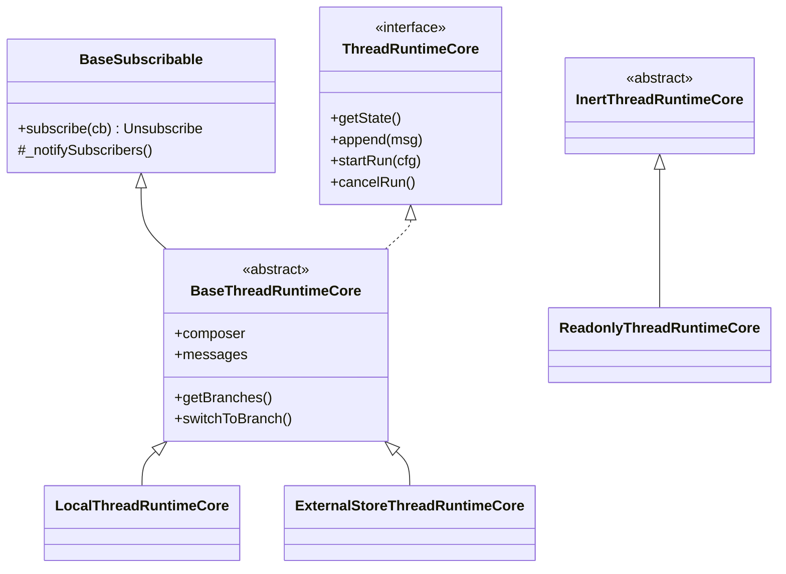
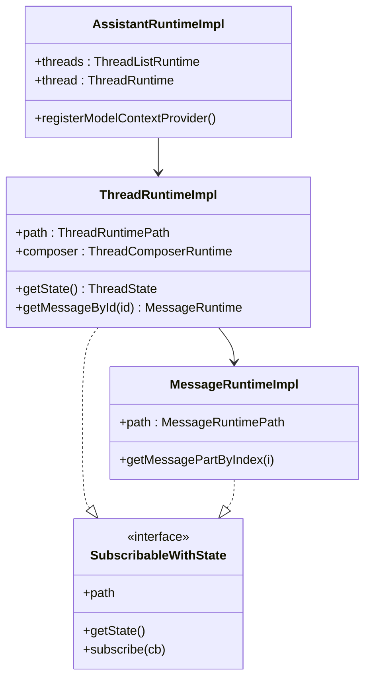
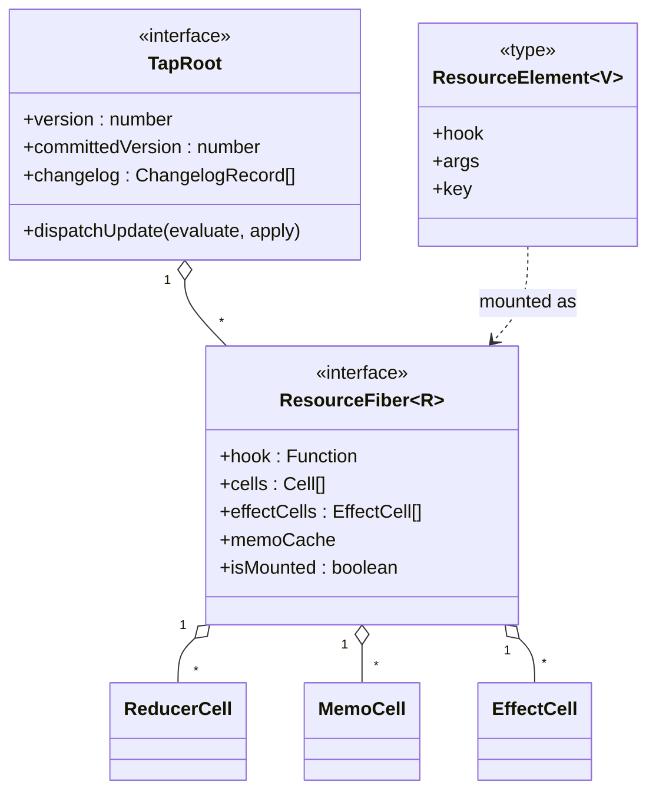
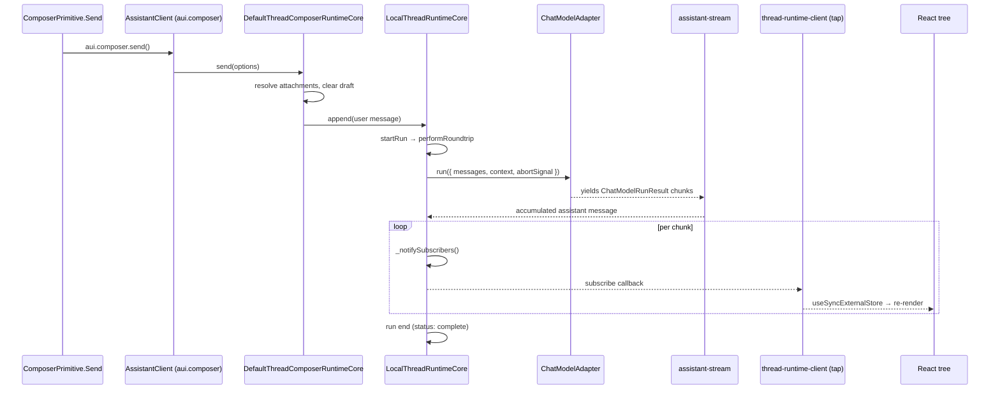
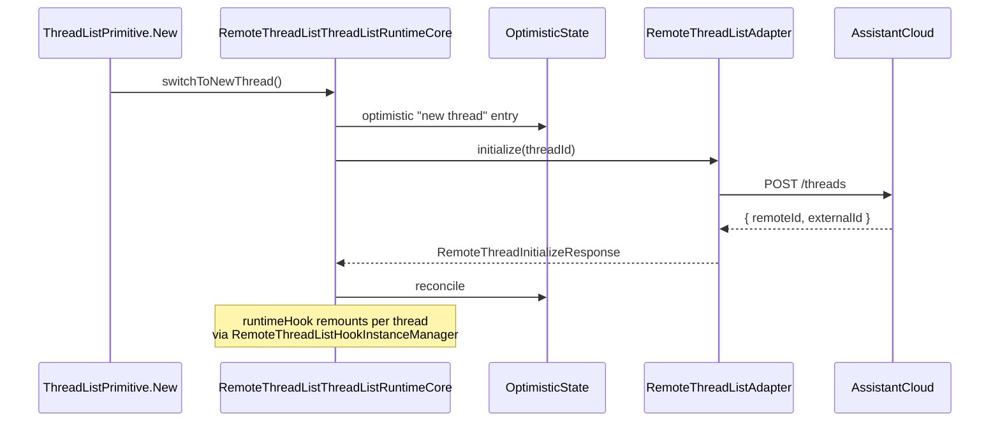

> Source: `https://github.com/assistant-ui/assistant-ui` (branch `main`, HEAD `b6857afc6`) · Date: 2026-08-29 · Mode: **Explain** · Type: **Hybrid** (library-first monorepo + runnable apps/CLI)
> See also: [User-Facing API & UX/DX](/case-studies/libraries/assistant_ui_ux_design/)

---

## 1. Overview

**assistant-ui** is an open-source TypeScript library for building production-grade AI chat
experiences. It is not a chat component — it is a *headless runtime* plus a set of composable
UI primitives. The library owns the hard parts of an assistant UI (streaming, message
branching, edit/regenerate, tool calls, attachments, thread lists, persistence) and leaves
rendering entirely to the application. A single conversation model is projected onto three
platforms (web DOM, React Native, terminal/Ink) and connected to a dozen different backends
through interchangeable adapters.

The central design bet is visible in the package graph: **conversation state is modelled as
React hooks running *outside* React** (`@assistant-ui/tap`), so the same runtime logic can be
driven by React, React Native, Ink, or no renderer at all.

### Type classification — Hybrid

| Evidence | Points to |
|---|---|
| 48 workspace packages in `packages/`, 44 published to npm with `exports` maps, `types`-first, `sideEffects: false` | **Library** |
| `packages/cli/bin/assistant-ui.js` (`bin: { "assistant-ui": … }`), `packages/create-assistant-ui` (`bin`), `packages/mcp-docs-server` (`bin: assistant-ui-mcp`) | **Application** (CLI) |
| `apps/docs` (Next.js site, `next build`), `apps/registry` (builds & hosts `r.assistant-ui.com` JSON), `apps/social-media` | **Application** (web) |
| `python/` — `assistant-stream` on PyPI, `assistant-transport-backend`, `assistant-ui-sync-server-api` | **Library** (second language) |

Both halves are first-class, so the doc keeps System Context, Containers, Components, OOP and
Flows at full weight.

### Tech stack

- **Language:** TypeScript (`@tsconfig/strictest` via `@assistant-ui/x-buildutils/ts/base.json`),
  ESM-only, `type: module`. Python for the server-side streaming counterpart.
- **Runtime peers:** React `^18 || ^19`; `react-native`, `ink >= 6` for the other distributions.
- **Monorepo:** pnpm 12 workspaces (`pnpm-workspace.yaml`) + Turborepo (`turbo.json`), Changesets
  for versioning, Node `>= 24`.
- **Build:** one shared compiler, `aui-build` (`packages/x-buildutils/bin/aui-build.js`), invoked
  as `"build": "aui-build"` from every publishable package. No per-package tsup/unbuild/swc.
- **Quality:** `oxlint` + `oxfmt` (`.oxlintrc.json`, `.oxfmtrc.json`), `vitest` colocated tests,
  a generated `api-surface/` tree (79k lines of `.d.ts` snapshots) guarding the append-only
  public API.
- **Notable deps:** `radix-ui` / `@base-ui/react` (UI kit only), `zod`, `nanoid`,
  `assistant-stream` (own), `assistant-cloud` (own).

---

## 2. System Context (C4 Level 1)



**Reading the edges.** The library never talks to a model provider directly by itself — it talks
to whatever the developer wired in (`ChatModelAdapter`, an AI SDK transport, a LangGraph client).
Assistant Cloud is optional and orthogonal: it stores threads/messages/files and receives run
telemetry, and can be attached to any runtime via a `cloud` option. The docs site doubles as a
machine surface (MCP endpoint at `apps/docs/app/api/mcp`, `llms.txt`/`llms.mdx` routes,
`.well-known/agent-skills`), which is why the AI coding agent is drawn as a first-class actor.

---

## 3. High-Level Structure (C4 Level 2)

The packages form a strict downward-only dependency stack. Nothing below imports from above.



### Path inventory

| Path | Responsibility |
|---|---|
| `packages/tap` | React's hook engine, reimplemented headless. `resource()` turns a `use…` function into a mountable unit; `createTapRoot` / `useTapRoot` host a tree of them with no React renderer. |
| `packages/store` | Binds tap to React. Defines the **client/scope** model (`ScopeRegistry`, `AssistantClient`), `AuiProvider`, `useAui`, `useAuiState`, `useAuiEvent`, `Derived`. |
| `packages/core` | Framework-agnostic chat runtime: message/thread/composer model, runtime cores, adapters, model context, tools. `./react` subpath holds the React-coupled runtime hooks and providers; `./store` exposes the tap scope clients. |
| `packages/react` | Web distribution. Re-exports `core` (+`./react`) and adds the DOM primitives (`ThreadPrimitive`, `ComposerPrimitive`, …) built on `radix-ui`. |
| `packages/react-native`, `packages/react-ink` | The other two distributions; same core, platform-specific primitives. |
| `packages/react-*`, `packages/ai-sdk`, `packages/eve` | One package per provider/protocol; each maps an upstream SDK onto a core runtime. |
| `packages/assistant-stream` | The wire layer: typed chunk stream, encoders/decoders (`DataStream`, `AssistantTransport`, `PlainText`, `UIMessageStream`), server-side tool execution, resumable streams. No React, no DOM. |
| `packages/cloud` (`assistant-cloud`) | Typed HTTP client for the hosted service: threads, messages, projects, runs, files, auth. |
| `packages/ui` *(private)* | The canonical shadcn-style component kit copied into user projects through the registry. |
| `packages/cli` (`assistant-ui`) | Scaffolding, component installation, codemods, MCP wiring, diagnostics. |
| `packages/next`, `vite`, `metro`, `x-generative-compiler` | Bundler plugins implementing the `"use generative"` directive (splits a colocated tool into server-only `execute` + client-only `render`). |
| `packages/x-buildutils` | `aui-build` CLI + shared tsconfig fragments. The single build path for all packages. |
| `apps/docs`, `apps/registry` | Next.js docs/marketing site; registry builder that emits `r.assistant-ui.com` JSON. |
| `api-surface/` | Generated `.d.ts` snapshot of every published entry point; CI diffs it to enforce the append-only rule. |
| `python/` | `assistant-stream` for Python backends, the assistant-transport reference backends, sync-server API client. |

### Two generations, one barrel

An in-progress migration replaces the class-based runtime with the tap-native one:

- `packages/react/src/legacy-runtime/` — the older `*RuntimeCore` implementations.
- `packages/core/src/react/` + `packages/core/src/store/` — the tap-only architecture.

`AGENTS.md` records the rule that governs it: the `@assistant-ui/react` barrel re-exports both
and the public surface is **append-only**. `@assistant-ui/react-ai-sdk` is already a one-line
shim (`export * from "@assistant-ui/ai-sdk"`), which is what a completed migration leg looks like.

---

## 4. Components (C4 Level 3)

### 4.1 Inside `@assistant-ui/core`



**The four rings, outside in.** `adapters/` are the pluggable capabilities a runtime may own.
`runtimes/*` are the concrete state machines. `runtime/api` wraps a core in an immutable,
path-addressed facade (`ThreadRuntimeImpl`, `MessageRuntimeImpl`, …) that app code and the
legacy API consume. `store/` re-projects the same runtime as **tap clients**, which is what the
modern `useAui` / `useAuiState` surface reads.

### 4.2 The runtime layer cake

This is the load-bearing structural idea, and the repo documents it itself in
`apps/docs/content/docs/runtimes/concepts/architecture.mdx`. Every integration bottoms out in
one of two core runtimes.



Verified against the code, not just the docs: `packages/react-data-stream/src/useDataStreamRuntime.ts`
calls `useLocalRuntime`; `packages/ai-sdk/src/runtime/useAISDKRuntime.ts` and
`packages/react-langgraph/src/useLangGraphRuntime.ts` call `useExternalStoreRuntime`; both entry
hooks then wrap in `useRemoteThreadListRuntime`.

`LocalRuntime` itself is defined recursively in terms of the thread-list wrapper —
`useLocalRuntime` returns `useRemoteThreadListRuntime({ runtimeHook: useLocalThreadRuntime, … })`
— so "one thread" is just a thread list of size one.

---

## 5. OOP & Class Architecture

### 5.1 Runtime cores — template method over a subscribable base



The same shape repeats for composers (`BaseComposerRuntimeCore` →
`DefaultThreadComposerRuntimeCore`, `DefaultEditComposerRuntimeCore`) and for the assistant root
(`BaseAssistantRuntimeCore` → `LocalRuntimeCore`, `ExternalStoreRuntimeCore`). All live in
`packages/core/src/runtime/base/` and `packages/core/src/runtimes/`.

### 5.2 Facade + binding: how a core becomes an API object



Each `*RuntimeImpl` is a thin, *re-creatable* facade over a `SubscribableWithState` binding plus
a `path` (`ThreadRuntimePath`, `MessageRuntimePath`, … in `runtime/api/paths.ts`). The binding
machinery in `packages/core/src/subscribable/subscribable.ts` supplies the memoisation strategies:
`ShallowMemoizeSubject`, `LazyMemoizeSubject`, `NestedSubscriptionSubject`,
`EventSubscriptionSubject`. This is why a runtime object can be handed out freely — it carries no
state, only a route to it.

### 5.3 The tap kernel — React's fiber model, extracted

`@assistant-ui/tap` is where the architecture earns its unusual shape. It re-implements React's
hook dispatcher over its own fiber and cell types (`packages/tap/src/core/types.ts`):



`resource(useFoo)` produces a `Resource<V>` — call it and you get a `ResourceElement`, a
description, not an instance. `useResource(element)` mounts it inside another resource;
`useTapRoot` / `createTapRoot` mount a root from React or from plain JS. `packages/tap/src/react-hooks/`
supplies `useState`, `useMemo`, `useEffect`, `useReducer`, `useSyncExternalStore`, `useMemoCache`
against these cells — so a resource body *is* ordinary hook code, and oxlint's
`react/exhaustive-deps` and `react/rules-of-hooks` lint it (which is why `AGENTS.md` requires
`use`-prefixed extraction and named function expressions).

### 5.4 The client/scope model

`@assistant-ui/store` layers a typed, extensible namespace over tap. A **scope** is a named client
schema — state, methods, optional meta and events — registered by module augmentation:

```ts
// packages/core/src/store/scope-registration.ts
declare module "@assistant-ui/store" {
  interface ScopeRegistry {
    threads: ThreadsClientSchema;
    thread: ThreadClientSchema;
    message: MessageClientSchema;
    part: PartClientSchema;
    composer: ComposerClientSchema;
    attachment: AttachmentClientSchema;
    modelContext: ModelContextClientSchema;
    suggestions: SuggestionsClientSchema;
    // …12 in total
  }
}
```

`AssistantClient` is then a generated object with one accessor per registered scope, so
`aui.thread.append(…)` and `useAuiState((s) => s.thread.isRunning)` are fully typed without the
core knowing what a downstream package added. Nesting is by `AuiProvider` + `AuiConfig`:
a child provider `extends` the parent client and overrides scopes, usually with `Derived`
(`{ source: "thread", query: { index }, get: (aui) => aui.thread.message({ index }) }`).
`useAuiState` reads through a proxy over `useSyncExternalStore` and refuses to return the whole
state object — a deliberate constraint that forces selector granularity.

### 5.5 Patterns in use

| Pattern | Where | Why |
|---|---|---|
| **Adapter** | `ChatModelAdapter`, `ExternalStoreAdapter`, `AttachmentAdapter`, `RemoteThreadListAdapter`, `ThreadHistoryAdapter` | One runtime, many backends; each adapter is the seam a user implements. |
| **Template method** | `BaseThreadRuntimeCore`, `BaseComposerRuntimeCore` | Branching, editing and attachment plumbing written once; subclasses supply the backend-specific steps. |
| **Facade + path binding** | `runtime/api/*Impl` over `runtime/interfaces/*Core` | Stable, cheap, re-creatable handles over mutable cores. |
| **Observer** | `BaseSubscribable`, `NotificationManager`, `useSubscribable` → `useSyncExternalStore` | The one bridge between mutable runtime state and React rendering. |
| **Composite / scoped registry** | `ScopeRegistry`, `AuiConfig`, `Derived`, `attachTransformScopes` | A tree of clients that mirrors the UI tree; providers narrow scope by index. |
| **Registry** | `ModelContextRegistry`, `Tools`, `DataRenderers`, `defineToolkit`, `defineMcpToolkit` | Tools and renderers register themselves from anywhere in the tree and merge (`mergeModelContexts`). |
| **Strategy** | `ShallowMemoizeSubject` vs `LazyMemoizeSubject`; `joinStrategy` in external-store conversion | Per-call-site memoisation and merge policy. |
| **Optimistic state / command queue** | `OptimisticState`, `runtime/queue/message-queue.ts`, `assistant-transport/commandQueue.ts` | UI stays responsive while remote thread ops and commands are in flight. |
| **Codec** | `assistant-stream` `DataStreamEncoder/Decoder`, `AssistantTransportEncoder/Decoder`, `UIMessageStreamDecoder` | One chunk model, several wire formats. |

**Explicit anti-patterns.** `AGENTS.md` bans four things new adapters keep reaching for: a bespoke
`*ThreadRuntimeCore` state holder, a `notifyUpdate` + version-counter re-render hack,
`Object.create` method grafting, and monkeypatching caller objects. `createRuntimeExtras`
(`packages/core/src/react/runtimes/createRuntimeExtras.ts`) is the sanctioned way to expose
adapter-specific state instead.

---

## 6. Key Flows

### 6.1 User sends a message (LocalRuntime path)



**What each hop owns.** `useComposerSend` (`core/src/react/primitive-hooks/`) does nothing but call
`aui.composer.send()`. `BaseComposerRuntimeCore.send()` resolves pending attachments through the
`AttachmentAdapter`, clears the draft optimistically, then appends. `LocalThreadRuntimeCore`
owns the run lifecycle — `startRun` → `performRoundtrip` → `adapters.chatModel.run(...)`, looping
while `should-continue` says a tool result needs another roundtrip and `maxSteps` allows it.
Streaming updates land as `_notifySubscribers()` calls; `useSubscribable` turns those into
`useSyncExternalStore` snapshots; `useAuiState` selectors decide which components actually re-render.

The `ExternalStoreRuntime` path differs only in the middle: the runtime calls the app's `onNew`
/ `onEdit` / `onReload` callbacks and re-derives its message list from the array the app hands
back (`external-message-converter.ts`, `thread-message-converter.ts`).

### 6.2 Multi-thread + persistence



`useRemoteThreadListRuntime` is what makes every runtime multi-threaded: it manages one instance
of the caller's `runtimeHook` per thread, keeps optimistic list state, and delegates create /
rename / archive / delete to a `RemoteThreadListAdapter` — `InMemoryThreadListAdapter`,
`LocalStorageThreadListAdapter`, or the cloud adapter built by `createCloudThreadListAdapter`.
Message persistence is separate again (`AssistantCloudThreadHistoryAdapter`,
`CloudMessagePersistence`, `FormattedCloudPersistence`), keyed by a format string such as
`"ai-sdk/v6"` that names the *stored shape*, not the npm major — `AGENTS.md` forbids renaming it
in a version bump.

---

## 7. Extension Points

Ordered by how deep you have to go.

1. **Compose different UI** — the primitives (`ThreadPrimitive.*`, `MessagePrimitive.*`,
   `ComposerPrimitive.*`, 90+ components) are unstyled and `asChild`/`render`-friendly. Nothing
   about the runtime changes.
2. **Register tools and renderers** — `tool()`, `makeAssistantTool`, `makeAssistantToolUI`,
   `defineToolkit`, `defineMcpToolkit`, `hitl`/`humanTool` for approvals,
   `useAssistantInstructions`. They merge into the `ModelContext` through
   `ModelContextRegistry` from anywhere in the tree.
3. **Fill adapter slots** — `AttachmentAdapter`, `SpeechSynthesisAdapter`, `DictationAdapter`,
   `RealtimeVoiceAdapter`, `FeedbackAdapter`, `SuggestionAdapter`, `ThreadHistoryAdapter`,
   `Unstable_TriggerAdapter`. Same contract on every runtime.
4. **Own the messages** — `useExternalStoreRuntime` with an `ExternalStoreAdapter`
   (`onNew`, `onEdit`, `onReload`, `setMessages`, `convertMessage`). Capabilities light up based
   on which callbacks exist.
5. **Own the model call** — `useLocalRuntime(chatModelAdapter)` with a single
   `run(options): Promise<ChatModelRunResult> | AsyncGenerator<…>`.
6. **Own the wire** — implement the DataStream or AssistantTransport protocol on the backend
   (`createAssistantStreamResponse` in `assistant-stream`, or the Python `assistant_stream`
   package) and use the matching protocol runtime.
7. **Own the thread list** — implement `RemoteThreadListAdapter` against your own database.
8. **Add a scope** — module-augment `ScopeRegistry` and supply the client resource through
   `AuiConfig`. This is how an adapter package adds first-class typed state
   (`createRuntimeExtras` for the read side).
9. **Write a new adapter package** — `AGENTS.md` prescribes the file layout:
   `use<Name>Runtime.ts` (orchestration only), `<name>Extras.ts`, `hooks.ts`, a pure
   `convertMessages.ts`, `types.ts`, plus `<Name>ThreadController.ts` + a pure reducer when the
   adapter owns thread state, and a `./server` or `./node` subpath when the protocol owns the wire.
   `@assistant-ui/react-langchain` is the named reference implementation.
10. **Build-time** — the `"use generative"` directive via `@assistant-ui/next`, `/vite`, `/metro`
    (all delegating to `x-generative-compiler`) colocates a tool's schema, server-only `execute`
    and client-only `render` in one file and splits them at bundle time.

---

## 8. Key Abstractions / Glossary

| Term | Meaning |
|---|---|
| **Resource** (`tap`) | A `use…` function wrapped by `resource()`. Calling it yields a `ResourceElement` (a description); `useResource` mounts it. React hooks work inside, without React. |
| **TapRoot / ResourceFiber** | tap's re-implementation of React's root and fiber; cells are `ReducerCell`, `MemoCell`, `EffectCell`. |
| **Client / Scope** | A named, typed slice of assistant state registered in `ScopeRegistry` (`thread`, `message`, `composer`, `part`, `attachment`, `threads`, `threadListItem`, `modelContext`, `suggestions`, `suggestion`, `chainOfThought`, `queueItem`). |
| **`AssistantClient` / `aui`** | The object returned by `useAui()` — one accessor per scope, plus `subscribe` and `on`. |
| **`AuiConfig` / `AuiProvider`** | The declaration of which scope resources a subtree gets, and the provider that mounts them (extending or isolating from the parent). |
| **`Derived`** | A scope entry computed from a parent scope plus a query (`{ source, query, get }`) — how `MessageByIndexProvider` narrows `thread` to one `message`. |
| **Runtime core** | The mutable state machine (`ThreadRuntimeCore`, `ComposerRuntimeCore`, `ThreadListRuntimeCore`, `AssistantRuntimeCore`). |
| **Runtime (API)** | The immutable facade over a core (`ThreadRuntime`, `MessageRuntime`, …) addressed by a `path`. |
| **`ChatModelAdapter`** | The LocalRuntime seam: `run(options)` returning a result or an async generator of partial results. |
| **`ExternalStoreAdapter`** | The ExternalStoreRuntime seam: your messages plus `onNew`/`onEdit`/`onReload`/`setMessages`. |
| **Message part** | The atom of message content: `text`, `reasoning`, `source`, `image`, `file`, `data`, `tool-call`, `generative-ui`, `audio` (unstable). |
| **Model context** | The merged tools + instructions + config assembled from every registered provider and handed to the backend. |
| **DataStream / AssistantTransport** | The two wire protocols. DataStream streams *messages* (on LocalRuntime); AssistantTransport streams *agent state* snapshots and accepts commands (on ExternalStoreRuntime). |
| **Assistant Cloud** | The optional hosted service: threads, messages, files, projects, runs/telemetry, auth. |
| **Element** (`packages/ui`) | A copy-in shadcn-style component. Sparse-grid naming: bare file = props-only, `.aui.tsx` = runtime-bound, `.aui.radix.tsx` = Radix variant of that binding. |

---

## 9. Open Questions & Notes

Grounded uncertainties — things the repo does not settle, or that a reader should verify before
relying on them.

1. **Migration end-state is not dated.** `packages/react/src/legacy-runtime/` and the tap-native
   `core/src/react` + `core/src/store` coexist, and the barrel re-exports both. Nothing in the
   repo states which release removes the legacy tree, or whether it ever will given the
   append-only rule. `@assistant-ui/react-ai-sdk` collapsing to a re-export shim suggests the
   pattern, not a schedule.
2. **Assistant Cloud is a black box here.** Only the client (`packages/cloud`) is in this repo.
   The service's storage model, tenancy, retention and auth backend are outside the evidence;
   `AssistantCloudAuthStrategy` and the `AssistantCloudAuthTokens` tests are the only surface hints.
3. **Two "ai-sdk" packages, one live.** `@assistant-ui/ai-sdk` (0.0.3) is the implementation;
   `@assistant-ui/react-ai-sdk` (1.4.8) is `export * from "@assistant-ui/ai-sdk"`. The version
   numbers invert the intuition, and nothing in-repo explains the deprecation timeline.
4. **`packages/svelte` and `packages/vue` are private, version `0.0.0`, and largely unpopulated.**
   Whether they are planned distributions or spikes is not stated. (Community `tap-vue` and
   `jotai-tap` projects are linked from the tap README, so the tap kernel is clearly meant to
   generalise.)
5. **`packages/eve` and `apps/social-media`** carry no README explaining their role in the product;
   `eve` is described only as "Eve runtime adapter" and appears as a CLI template.
6. **Not traced in this pass:** the `assistant-transport` command/replay machinery
   (`commandQueue.ts`, `replayBoundaryStream.ts`, `runManager.ts`), the interactables subsystem
   (both the deprecated and `unstable_` generations), `safe-content-frame`'s sandboxing model, and
   `react-o11y`. Each is architecturally significant enough to deserve its own read; the claims
   above deliberately stop at their boundaries.
7. **The Python side was inventoried, not traced.** `python/assistant-stream` mirrors the TS
   chunk model (`serialization/data_stream.py`, `assistant_transport.py`, `resumable/`), but I did
   not verify wire-format parity between the two implementations. The cross-package contract tests
   `AGENTS.md` mentions are the place to check that claim.
