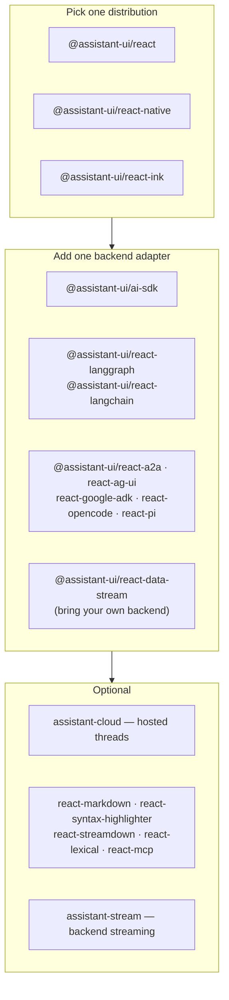
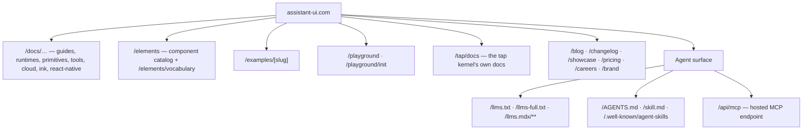
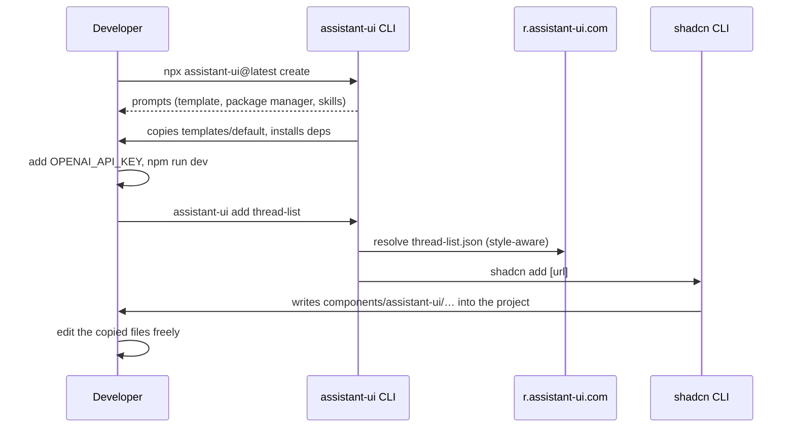
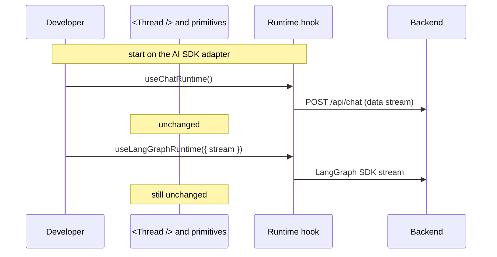
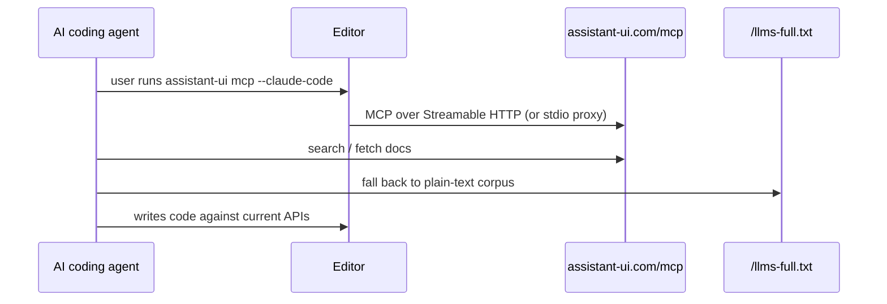
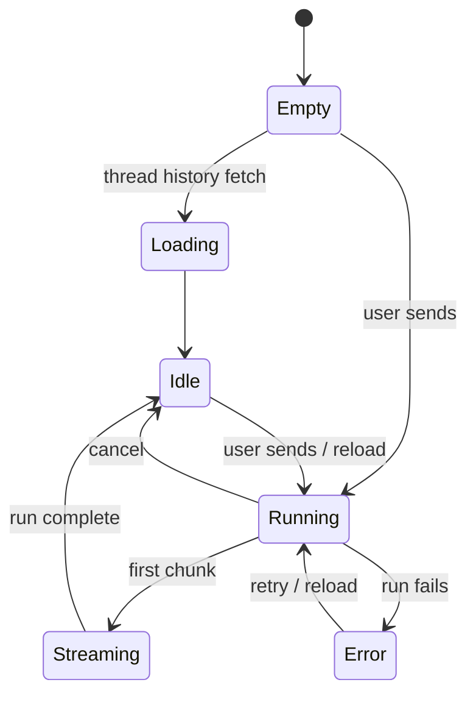

> Source: `https://github.com/assistant-ui/assistant-ui` (branch `main`, HEAD `b6857afc6`) · Date: 2026-08-29 · Mode: **Explain** · Surface: **Hybrid** (Library/SDK · CLI · GUI · Web API)
> See also: [System & OOP Architecture](/case-studies/libraries/assistant_ui_system_oop_architecture/)

---

## Cheat Sheet

**Get an app running (CLI).**

```bash
npx assistant-ui@latest create              # new Next.js project, default template
npx assistant-ui@latest create -t cloud     # …with Assistant Cloud persistence
npx assistant-ui@latest init                # add to an existing project
npx assistant-ui@latest add thread-list     # copy a component in via shadcn
npx assistant-ui@latest doctor              # diagnose version mismatches
npx assistant-ui@latest mcp --claude-code   # point an AI IDE at the docs MCP server
```

**Wire a chat (library).**

```tsx
"use client";
import { AssistantRuntimeProvider } from "@assistant-ui/react";
import { useChatRuntime } from "@assistant-ui/ai-sdk";
import { Thread } from "@/components/assistant-ui/elements/thread.aui";

export function Chat() {
  const runtime = useChatRuntime();                 // swap for useLangGraphRuntime, useDataStreamRuntime, …
  return (
    <AssistantRuntimeProvider runtime={runtime}>
      <Thread />
    </AssistantRuntimeProvider>
  );
}
```

**The ten calls you will actually reach for.**

| Call | Package | What it does |
|---|---|---|
| `AssistantRuntimeProvider` | `@assistant-ui/react` | Mounts a runtime; everything below can read it. |
| `useChatRuntime()` | `@assistant-ui/ai-sdk` | Vercel AI SDK runtime, threads included. |
| `useLocalRuntime(adapter)` | `@assistant-ui/react` | Runtime owns state; you implement `run()`. |
| `useExternalStoreRuntime(store)` | `@assistant-ui/react` | You own the messages array. |
| `useAuiState(s => s.thread.isRunning)` | `@assistant-ui/react` | Subscribe to one slice of assistant state. |
| `useAui()` | `@assistant-ui/react` | Imperative handle: `aui.composer.send()`, `aui.thread.append(…)`. |
| `ThreadPrimitive.*`, `ComposerPrimitive.*`, `MessagePrimitive.*` | `@assistant-ui/react` | Unstyled building blocks. |
| `tool({ … })` / `makeAssistantToolUI({ … })` | `@assistant-ui/react` | Declare a frontend tool and render its calls. |
| `createAssistantStreamResponse(cb)` | `assistant-stream` | Backend route that streams message parts. |
| `new AssistantCloud({ … })` | `assistant-cloud` | Hosted threads, files, telemetry. |

Every entry above is verified in §2.

---

## 1. Overview

assistant-ui gives a developer the *UX of ChatGPT* as composable parts: a headless runtime that
owns conversation state, unstyled primitives that render it, and a copy-in component kit that
makes it look finished on day one. The developer keeps their backend, their design system, and
their message state if they want it.

### Surface type — Hybrid, with four distinct audiences

| Surface | User | Evidence |
|---|---|---|
| **Library / SDK** *(primary)* | React developer | 44 published packages; `@assistant-ui/react` alone exports ≈380 named symbols from `packages/react/src/index.ts`; `api-surface/` holds a generated `.d.ts` snapshot per entry point. |
| **CLI** | Developer at a terminal | `packages/cli` → `bin: { "assistant-ui": "./bin/assistant-ui.js" }`; 10 commands registered in `src/program.ts`. |
| **GUI** | End user of the built app · developer browsing docs | `packages/ui/src/components/react/assistant-ui/elements/` (142 non-test files) is the shipped chat UI; `apps/docs` is the Next.js site at assistant-ui.com. |
| **Web API** | Client tooling, AI agents | `r.assistant-ui.com` registry JSON (`apps/registry`), the docs MCP endpoint (`apps/docs/app/api/mcp`), `llms.txt` / `llms.mdx` / `.well-known/agent-skills` routes, and Assistant Cloud reached through the `assistant-cloud` client. |

The sections below weight **Library/SDK** and **CLI** heaviest, since that is where the design
decisions live; the GUI is covered as the component catalog a developer chooses from rather than
as a screen-by-screen app (the actual screens belong to the developer's product), and the Web API
is covered at the contract level.

---

## 2. Surface Map

### 2.1 CLI command tree

```mermaid
flowchart TD
    root["assistant-ui"]
    root --> create["create [dir] — scaffold a new project"]
    root --> init["init [dir] — add to an existing project"]
    root --> add["add [components] — install registry components"]
    root --> update["update — bump assistant-ui packages"]
    root --> upgrade["upgrade — bump ai deps + run codemods"]
    root --> codemod["codemod [name] [source] — one migration transform"]
    root --> mcp["mcp — wire an IDE to the docs MCP server"]
    root --> agent["agent [prompt] — launch Claude Code with aui skills"]
    root --> info["info — environment report for bug reports"]
    root --> doctor["doctor — diagnose version mismatches"]
```



| Command | Key flags | What the user does with it |
|---|---|---|
| `create [project-directory]` | `-t/--template`, `-e/--example`, `-p/--preset`, `--native`, `--ink`, `--use-npm\|pnpm\|yarn\|bun`, `--skip-install`, `--skills` / `--no-skills` | Scaffolds a project from `templates/` (default, cloud, cloud-clerk, langchain, mcp, eve, minimal), from any directory in `examples/`, or from a playground preset URL. |
| `init [project-directory]` | `-y/--yes`, `-o/--overwrite`, `-c/--cwd`, package-manager flags, `--skip-install` | Runs `shadcn init` then adds the quick-start registry item. Falls back to `create` when there is no `package.json`; refuses non-interactive shells without `--yes`. |
| `add <components...>` | `-y/--yes` (default true), `-o/--overwrite`, `-c/--cwd`, `-p/--path` | Resolves each name to a `r.assistant-ui.com` URL and shells out to `shadcn@latest add`. |
| `update` | `--dry` | Updates the assistant-ui packages in the project. |
| `upgrade` | `-d/--dry`, `-p/--print`, `--verbose` | Bumps `ai` deps and applies the matching codemods. |
| `codemod <codemod> <source>` | same as upgrade | Runs one transform, e.g. `v0-15/aui-accessor-calls-to-properties`. |
| `mcp` | `--cursor`, `--windsurf`, `--vscode`, `--zed`, `--claude-code`, `--claude-desktop` | Writes the MCP server config for that editor. |
| `agent <prompt...>` | `--dry` | Launches Claude Code with the assistant-ui skill plugin. |
| `info` | `-c/--cwd` | Prints an environment + package report to paste into an issue. |
| `doctor` | `-c/--cwd`, `--no-network` | Flags mismatched/outdated assistant-ui packages, including transitive ones. |

`create-assistant-ui` is a separate bin that simply delegates to the same CLI, so
`npm create assistant-ui` works too.

### 2.2 Library surface — the package you install



| Symbol group | Package | Examples |
|---|---|---|
| **Provider & state** | `@assistant-ui/react` | `AssistantRuntimeProvider`, `AuiProvider`, `AuiConfig`, `useAui`, `useAuiState`, `useAuiEvent`, `AuiIf` |
| **Runtime hooks** | `@assistant-ui/react`, adapters | `useLocalRuntime`, `useExternalStoreRuntime`, `useRemoteThreadListRuntime`, `useCloudThreadListRuntime`, `useAssistantTransportRuntime`, `useDataStreamRuntime`, `useChatRuntime`, `useLangGraphRuntime` |
| **Primitives** (90+ components, 17 namespaces) | `@assistant-ui/react` | `ThreadPrimitive`, `MessagePrimitive`, `MessagePartPrimitive`, `ComposerPrimitive`, `ActionBarPrimitive`, `ActionBarMorePrimitive`, `BranchPickerPrimitive`, `AttachmentPrimitive`, `ThreadListPrimitive`, `ThreadListItemPrimitive`, `ThreadListItemMorePrimitive`, `SuggestionPrimitive`, `AssistantModalPrimitive`, `ChainOfThoughtPrimitive`, `SelectionToolbarPrimitive`, `ErrorPrimitive`, `QueueItemPrimitive` |
| **Tools & model context** | `@assistant-ui/react` | `tool`, `makeAssistantTool`, `makeAssistantToolUI`, `makeAssistantDataUI`, `defineToolkit`, `defineMcpToolkit`, `hitl` / `humanTool`, `useAssistantInstructions`, `ModelContextRegistry`, `mergeModelContexts` |
| **Adapters (capability slots)** | `@assistant-ui/react` | `AttachmentAdapter`, `SimpleImageAttachmentAdapter`, `CompositeAttachmentAdapter`, `WebSpeechSynthesisAdapter`, `WebSpeechDictationAdapter`, `FeedbackAdapter`, `SuggestionAdapter`, `ThreadHistoryAdapter`, `RealtimeVoiceAdapter` |
| **Backend streaming** | `assistant-stream` | `createAssistantStreamResponse`, `createAssistantStream`, `DataStreamEncoder/Decoder`, `AssistantTransportEncoder/Decoder`, `ToolExecutionStream`, `ToolResponse`, `AssistantMessageAccumulator` |
| **Hosted service client** | `assistant-cloud` | `AssistantCloud` (`.threads`, `.projects`, `.auth`, `.runs`, `.files`, `.telemetry`), `CloudAPIError`, `generateThreadTitle` |
| **Headless kernel** (12 exports) | `@assistant-ui/tap` | `resource`, `withKey`, `useResource`, `useResources`, `useTapRoot`, `useTapHost`, `createTapRoot`, `flushTapSync`, `useContextProvider` |

Primitive namespaces follow one rule: `Root` is the container, verbs are actions
(`Send`, `Cancel`, `Copy`, `Reload`, `Archive`), plurals iterate (`Messages`, `Attachments`,
`Parts`, `Items`), `…ByIndex` is the single-item form, and `If` is the conditional.

### 2.3 Component catalog — what `add` can install

`apps/registry/src/registry.ts` defines 55 registry items served from `r.assistant-ui.com`.

| Group | Items |
|---|---|
| Chat shells | `thread`, `thread-list`, `threadlist-sidebar`, `assistant-modal`, `assistant-sidebar` |
| Message content | `markdown-text`, `syntax-highlighter`, `shiki-highlighter`, `mermaid-diagram`, `reasoning`, `sources`, `quote`, `image`, `file`, `diff-viewer`, `directive-text` |
| Tool & generative UI | `tool-fallback`, `tool-group`, `generative-ui`, `generative-ui-style`, `mcp-config` |
| Chrome & affordances | `attachment`, `follow-up-suggestions`, `model-selector`, `message-timing`, `context-display`, `voice`, `tooltip-icon-button`, `logos` |
| Base UI variants | `elements-*` twins (`elements-reasoning`, `elements-voice`, `elements-model-selector`, `elements-shiki-highlighter`, `elements-mermaid-diagram`, `elements-directive-text`, `elements-context-display`, `elements-surfaces`, `elements-range`) |
| Hooks & primitives | `use-copy-to-clipboard`, `use-attachment-src`, `select`, `badge`, `tabs`, `accordion`, `direction`, `dot-matrix`, `number-roll`, `heat-graph`, `shimmer-style` |
| Backends | `ai-sdk-backend`, `ai-sdk-backend-resumable`, `eve-chat`, `chat/b/ai-sdk-quick-start/json` |

The canonical source is `packages/ui/src/components/react/assistant-ui/elements/` — 142 non-test
files, including many surfaces not yet in the registry (`agent-plan`, `todo-list`, `trace-waterfall`,
`terminal-block`, `computer-use`, `research-report`, `cost-meter`, …).

### 2.4 Documentation site (GUI + agent surface)



### 2.5 Web API contracts

| Endpoint / contract | Consumer | Shape |
|---|---|---|
| `https://r.assistant-ui.com/{item}.json`, `…/base/{item}.json`, `…/styles/{style}/{item}.json` | `shadcn` CLI | shadcn registry-item JSON (`$schema: ui.shadcn.com/schema/registry-item.json`), files inlined, `registryDependencies` enumerated. |
| `https://www.assistant-ui.com/mcp` | AI IDEs | Streamable HTTP MCP. `@assistant-ui/mcp-docs-server` is a stdio proxy for clients that need one; `ASSISTANT_UI_MCP_URL` overrides the target. |
| `/llms.txt`, `/llms-full.txt`, `/llms.mdx/**`, `/sitemap.md` | LLMs / agents | Plain-text and MDX mirrors of the docs. |
| `AssistantCloud` client | App backend & frontend | Typed resource clients: `threads`, `projects`, `auth`, `runs`, `files`, `telemetry`. Errors surface as `CloudAPIError` / `CloudResponseError`. |
| DataStream wire format | Your backend → the browser | `createAssistantStreamResponse` returns a Web `Response` and sets `x-vercel-ai-data-stream: v1`; `useDataStreamRuntime({ api })` auto-detects that marker. |

---

## 3. Entry & Onboarding

**The 5-minute path** (from `apps/docs/content/docs/(getting-started)/installation.mdx`):

```bash
npx assistant-ui@latest create      # or: create -t cloud
echo 'OPENAI_API_KEY="sk-…"' > .env
npm run dev
```

**The existing-project path.** `assistant-ui init` runs `shadcn init`, then adds the quick-start
registry item resolved against the project's `components.json` style — `base-*` styles get the
Base UI flavour, everything else gets Radix. If there is no `package.json` it transparently
re-dispatches to `create`. If the shell is non-interactive it stops and tells you to pass `--yes`,
naming the exact command:

```
Detected a non-interactive shell, but 'assistant-ui init' needs interactive prompts by default.
To run this in CI/agent mode, re-run with '--yes' so shadcn initialization and component install run non-interactively.
Example: assistant-ui init --yes
```

**The manual path.** Add the style-aware registry URL to `components.json` and use `shadcn add`
directly — no assistant-ui CLI required.

**The smallest "hello world"** is the README snippet: `AssistantRuntimeProvider` + a runtime hook
+ `<Thread />`. Three lines of wiring; the rest is the component the CLI copied into
`components/assistant-ui/`.

**Backend hello world** (`assistant-stream` README):

```ts
import { createAssistantStreamResponse } from "assistant-stream";

export async function POST(request: Request) {
  return createAssistantStreamResponse(async (controller) => {
    controller.appendText("Hello, ");
    controller.appendText("world!");
  });
}
```

---

## 4. Key User Journeys

### 4.1 Scaffold → run → customise



The pivot of the whole DX: components are **copied, not depended on**. After `add`, the files are
the developer's — `@assistant-ui/ui` is private and never installed.

### 4.2 Swap the backend without touching the UI



Adapters plug into the same `AssistantRuntimeProvider`, and capability slots (attachments,
speech, feedback, suggestions, history) carry the same contract on every runtime —
`AGENTS.md` calls this **cross-runtime parity** and treats a gap as a breaking expectation.

### 4.3 Read and drive state from a custom component

```tsx
import { useAui, useAuiState, AuiIf } from "@assistant-ui/react";

function SendBar() {
  const aui = useAui();
  const text = useAuiState((s) => s.composer.text);      // one slice
  const canSend = useAuiState((s) => s.composer.canSend);
  return (
    <>
      <AuiIf thread={{ running: true }}>Generating…</AuiIf>
      <button disabled={!canSend} onClick={() => aui.composer.send()}>
        Send {text.length}
      </button>
    </>
  );
}
```

Reading is `useAuiState(selector)`; acting is `aui.<scope>.<method>()`; branching in JSX is
`<AuiIf>`. `useAuiState` deliberately **throws** if the selector returns the whole state object,
pushing you toward per-field selectors.

### 4.4 An AI agent works on an assistant-ui codebase



---

## 5. Interaction & State

### 5.1 What the end user sees in a thread



The states are readable and renderable, not implicit: `thread.isEmpty`, `thread.isLoading`,
`thread.isRunning`, `thread.isDisabled`, `thread.capabilities`, plus
`ThreadPrimitive.Empty`, `ThreadPrimitive.If`, `MessagePrimitive.If`, `ComposerPrimitive.If`,
`MessagePartPrimitive.InProgress`, and `ErrorPrimitive.Root` / `ErrorPrimitive.Message`.

**Capability gating.** `RuntimeCapabilities` tells the UI what this runtime supports (edit,
reload, branch switching, cancel, attachments, feedback, speech, …). Components hide affordances
the backend cannot honour rather than failing at click time — with `ExternalStoreRuntime` the
capability set is derived from which callbacks you supplied.

**Errors.** `toAssistantError` / `isAssistantError` normalise anything thrown into an
`AssistantError` carrying an `AssistantErrorCode`, `ErrorSeverity`, and an `ErrorDisplay`
hint; `MessageNotSentError` is the specific "your message never left the composer" case.

### 5.2 CLI output contract

| Situation | Behaviour |
|---|---|
| Success | Human-readable status through `lib/utils/logger` (`info`, `warn`, `success`, `break`), colourised with `chalk`, interactive prompts via `@clack/prompts`. |
| Generic failure | `console.error(error)` and `process.exitCode = 1` (`lib/handle-cli-error.ts`). |
| Child process exits non-zero | The child's code is propagated (`SpawnExitError` → `process.exit(error.code)`). |
| Child killed by a signal | `process.exitCode = 128 + signal`, and the signal is re-raised on self when it was forwarded. |
| `doctor` finds problems | Prints findings and sets exit code 1, ending with the exact remedy: `npx assistant-ui update`. |
| Non-interactive shell where prompts are required | Refuses, explains why, and prints the `--yes` invocation. |

### 5.3 Library return/error contract

Runtime hooks return an `AssistantRuntime` synchronously — there is no async setup step and no
loading state to thread through. Streaming surfaces as state transitions on the runtime, not as
promises the caller awaits. `unstable_` is a load-bearing prefix: it marks APIs that may change
in any release, and `@deprecated` JSDoc carries an explicit sunset date and migration link
(e.g. the interactables API, "Since 2026-06-14 … Scheduled for removal on/after 2026-09-14").

---

## 6. Information Architecture / API Ergonomics

**Package naming is a routing table.** `@assistant-ui/react*` = a distribution or an integration;
bare-name packages (`assistant-stream`, `assistant-cloud`, `assistant-ui`) are the ones a
non-React consumer may need; `x-` prefixed packages are internal tooling. The three distributions
(`react`, `react-native`, `react-ink`) are drop-in siblings over the same core, which is why
"pick one distribution + one adapter" is a complete mental model.

**File-suffix grid in the component kit** (`AGENTS.md`, verified against
`packages/ui/src/components/react/`):

| Suffix | Meaning |
|---|---|
| `foo.tsx` | props-only component (no runtime coupling) |
| `foo.aui.tsx` | the same component bound to the assistant runtime |
| `foo.aui.radix.tsx` | Radix variant of that binding |
| `ui/base/foo.tsx` vs `ui/radix/foo.tsx` | parallel primitive flavours; in `ui/radix/` the unmarked file is the Base UI source and `foo.radix.tsx` is the Radix sibling |

**Naming consistency across the API.** Scope accessors read like sentences
(`aui.thread.append`, `aui.composer.send`, `aui.threadListItem.archive`). Primitives are
`Namespace.Role`. Adapters are `<Capability>Adapter`. Hooks are `use<Thing>` and runtime entry
points are `use<Provider>Runtime`. Deviating from an established repo pattern needs a written
reason — `AGENTS.md` makes that an explicit review rule.

**Two front doors, deliberately.** The declarative one is `useAuiState` + `<AuiIf>` +
primitives; the imperative one is `useAui()` returning method objects. They address the same
state, and the codemod history (`v0-12/assistant-api-to-aui`,
`v0-15/aui-accessor-calls-to-properties`) shows the team migrating the whole ecosystem when the
shape changes rather than accreting aliases.

### AX note — the agent as a first-class user

The repo treats AI coding agents as a named audience, and the surface reflects it:

- **Self-documenting spec:** `/llms.txt`, `/llms-full.txt`, `/llms.mdx/**`, `/sitemap.md`,
  `/AGENTS.md`, `/skill.md`, `/.well-known/agent-skills`, plus a live MCP endpoint that
  `assistant-ui mcp` wires into six editors in one command.
- **Errors that teach the next move:** the non-interactive-shell message names the flag and shows
  the command; `doctor` ends with the exact remedy line.
- **Stable codes to branch on:** exit 1 for failure, child exit codes propagated, `128 + signal`
  for signals.
- **Agent-native commands:** `assistant-ui agent <prompt>` launches Claude Code with the
  assistant-ui skill plugin; `create --skills` drops agent skills into a new project;
  `info` produces a paste-ready environment report.
- **Machine-checkable API contract:** the generated `api-surface/` tree plus the
  "API Reference Drift" CI job mean an agent can diff the public surface instead of guessing.

The one place the surface is genuinely heavy for a context-limited reader is the barrel:
≈380 exports from a single `@assistant-ui/react` entry, with `unstable_` and `@deprecated`
symbols interleaved. A full evaluative pass belongs to a dedicated AX audit.

---

## 7. Configuration & Customization

| Layer | Knob | Where |
|---|---|---|
| **Scaffold** | template (`default`, `cloud`, `cloud-clerk`, `langchain`, `mcp`, `eve`, `minimal`), any `examples/*` directory, playground preset URL, `--native` / `--ink`, package manager, `--skills` | `assistant-ui create` |
| **Component flavour** | `components.json` `style` — `base-*` ⇒ Base UI components, anything else ⇒ Radix; `--path` to relocate, `--overwrite` to replace | `components.json`, `assistant-ui add` |
| **Runtime choice** | `useChatRuntime` · `useLangGraphRuntime` · `useDataStreamRuntime` · `useAssistantTransportRuntime` · `useLocalRuntime` · `useExternalStoreRuntime` | one hook swap |
| **Runtime options** | `maxSteps`, `initialMessages`, `cloud`, `adapters: { attachments, speech, feedback, suggestion, history }`, `unstable_enableMessageQueue`, `joinStrategy`, `onResume` | runtime hook options |
| **Scopes** | `AuiConfig({ … })` + `<AuiProvider extends={aui} config={…}>`; `Derived` for index-narrowed scopes; module-augment `ScopeRegistry` to add your own | `@assistant-ui/store` |
| **Model context** | `useAssistantInstructions`, `tool()`, `makeAssistantTool`, `makeAssistantToolUI`, `defineToolkit`, `defineMcpToolkit`, `hitl` approvals | anywhere in the tree |
| **Rendering** | `components` prop on `ThreadPrimitive.Messages` / `MessagePrimitive.Parts`; `makeAssistantDataUI`; `useInlineRender` | primitives |
| **Persistence** | `cloud: new AssistantCloud({…})`, `LocalStorageThreadListAdapter`, `InMemoryThreadListAdapter`, or your own `RemoteThreadListAdapter` + `ThreadHistoryAdapter` | runtime options |
| **Build-time** | `withAui()` (`@assistant-ui/next`), the Vite and Metro plugins, and the `"use generative"` directive that splits a tool's server `execute` from its client `render` | bundler config |
| **Styling** | Tailwind v4 plugins `tw-shimmer` and `tw-glass`; every copied component is editable source | project |
| **Env** | `OPENAI_API_KEY` (templates), `ASSISTANT_UI_MCP_URL` (MCP proxy override) | `.env` |

---

## 8. Open Questions & Notes

1. **Two AI SDK packages.** `@assistant-ui/react-ai-sdk` (1.4.8) is now `export * from "@assistant-ui/ai-sdk"` (0.0.3). The docs still show both names in places; which one a new project should import — and when the old name stops being published — is not stated in-repo.
2. **Registry vs. kit drift.** `packages/ui/.../elements/` holds 142 non-test files; the registry exposes 55 items. Whether the ~85 uncovered surfaces (`agent-plan`, `todo-list`, `trace-waterfall`, `computer-use`, …) are unreleased, docs-only, or intentionally private is not documented.
3. **Assistant Cloud's own surface is out of scope here.** Pricing, quotas, auth-provider setup and the REST contract live on the hosted service; only the typed client is in this repo.
4. **Exit codes are conventional, not specified.** `handle-cli-error.ts` gives 1 / child-code / `128+signal`, but no command documents a per-failure code, so a script cannot branch on *why* something failed — only that it did.
5. **Export count is a floor.** ≈380 named exports for `@assistant-ui/react` counts the explicit `export {…}` blocks in `src/index.ts`; `export * from "./context"` adds more. Treat it as a magnitude, not a number.
6. **Not exercised in this pass:** the `/playground` and `/playground/init` preset flow, the React Native and Ink surfaces beyond their package manifests, `@assistant-ui/react-devtools`, and the `assistant-ui agent` skill-launcher path. Each was inventoried from manifests and route names rather than run, so the claims above stop at what the files assert.
