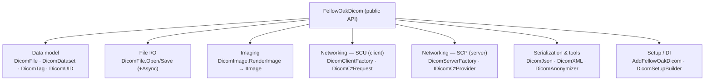
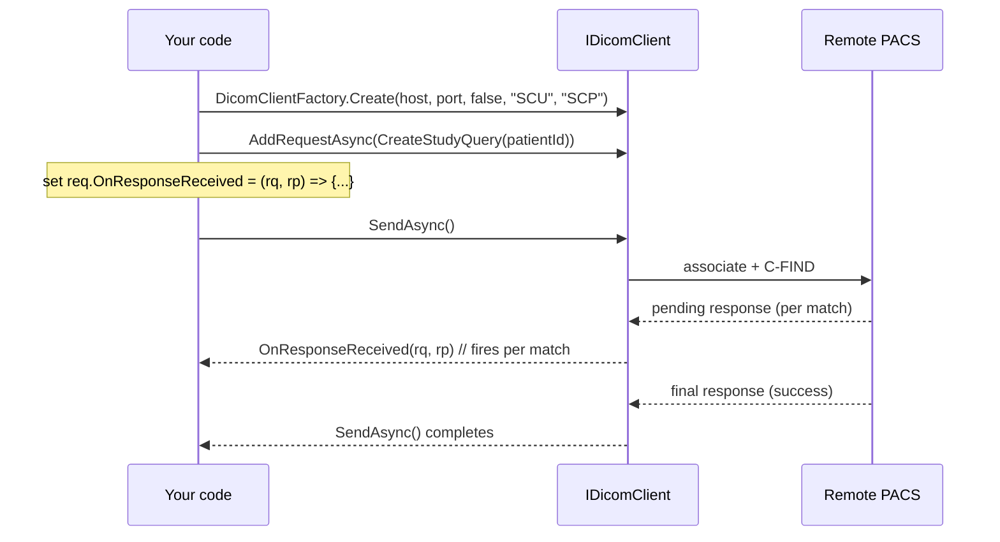
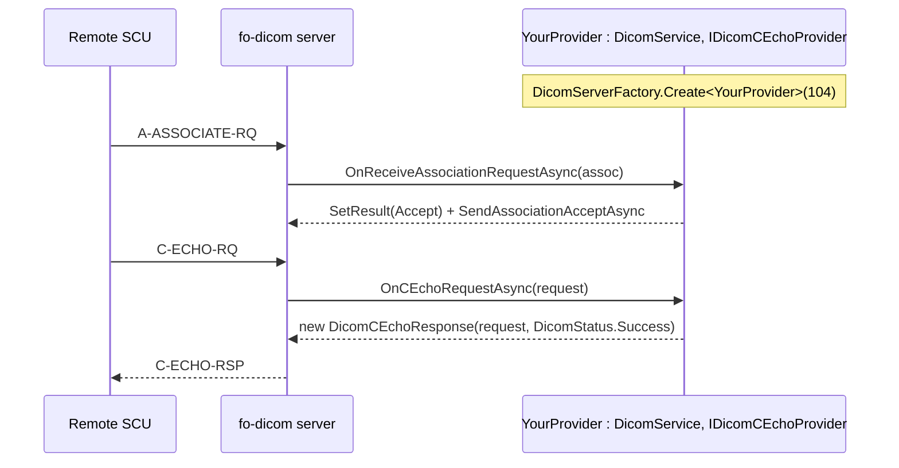

> Source: github.com/fo-dicom/fo-dicom (branch `development`) · Analyzed: 2026-06-12 · Surface: **Library / SDK** (developer-facing, with a server *framework* aspect)
> See also: [System & OOP Architecture](./fodicom-architecture.md)

---

## Cheat Sheet

The ten calls that cover most day-to-day work. All assume `using FellowOakDicom;` (add `FellowOakDicom.Network`, `FellowOakDicom.Network.Client`, `FellowOakDicom.Imaging`, `FellowOakDicom.Serialization` as needed). No setup is required for the static APIs — the library self-initializes on first use.

```csharp
// 1. Open a file (sync or async)
var file = DicomFile.Open("test.dcm");
var file2 = await DicomFile.OpenAsync("test.dcm");

// 2. Read values — typed. GetString/GetSingleValue<T> throw if missing.
string patientId   = file.Dataset.GetString(DicomTag.PatientID);
DateTime studyDate = file.Dataset.GetSingleValue<DateTime>(DicomTag.StudyDate);

// 3. Read safely — no exception when the tag is absent
var name = file.Dataset.GetSingleValueOrDefault(DicomTag.PatientName, "UNKNOWN");
if (file.Dataset.TryGetValues<double>(DicomTag.PixelSpacing, out var spacing)) { /* ... */ }

// 4. Edit (fluent, chainable) and save
file.Dataset
    .AddOrUpdate(DicomTag.PatientName, "DOE^JOHN")
    .AddOrUpdate(DicomTag.PatientID, "12345");
await file.SaveAsync("output.dcm");

// 5. Transcode / compress to another transfer syntax
var compressed = file.Clone(DicomTransferSyntax.JPEGProcess14SV1);

// 6. Render an image (needs a rendering back-end package)
new DicomImage("test.dcm").RenderImage().AsBitmap().Save("test.jpg");

// 7. C-ECHO / C-STORE SCU — create client, queue request(s), send
var client = DicomClientFactory.Create("127.0.0.1", 104, false, "SCU", "ANY-SCP");
await client.AddRequestAsync(new DicomCStoreRequest("test.dcm"));
await client.SendAsync();

// 8. C-FIND SCU — responses arrive on a callback, not a return value
var query = DicomCFindRequest.CreateStudyQuery(patientId: "12345");
query.OnResponseReceived = (rq, rp) =>
    Console.WriteLine(rp.Dataset?.GetString(DicomTag.StudyInstanceUID));
await client.AddRequestAsync(query);
await client.SendAsync();

// 9. Host a server (SCP) on a port, served by a provider type
using var server = DicomServerFactory.Create<DicomCEchoProvider>(104);

// 10. Convert & de-identify
string json    = DicomJson.ConvertDicomToJson(file.Dataset, writeTagsAsKeywords: true);
DicomFile clean = new DicomAnonymizer().Anonymize(file);
```

**Setup (apps/services):** `services.AddFellowOakDicom();` then `DicomSetupBuilder.UseServiceProvider(provider);` — prefer injecting `IDicomClientFactory` / `IDicomServerFactory` over the static `*.Create` calls.

| I want to… | Call |
|---|---|
| Load / save a file | `DicomFile.Open(path)` · `file.Save(path)` (+`*Async`) |
| Read a value | `ds.GetString(tag)` · `ds.GetSingleValue<T>(tag)` · `ds.GetValues<T>(tag)` |
| Read without throwing | `ds.GetSingleValueOrDefault<T>(tag, d)` · `ds.TryGetSingleValue<T>(tag, out v)` |
| Add / edit a value | `ds.Add(tag, vals)` · `ds.AddOrUpdate(tag, vals)` |
| Read a nested sequence | `ds.GetSequence(tag)` |
| Render pixels | `new DicomImage(src).RenderImage(frame).As<T>()` |
| Be a client (SCU) | `DicomClientFactory.Create(...)` → `AddRequestAsync(req)` → `SendAsync()` |
| Be a server (SCP) | `DicomServerFactory.Create<TProvider>(port)` |
| JSON / XML | `DicomJson.ConvertDicomToJson(ds)` · `DicomXML.ConvertDicomToXML(ds)` |
| De-identify | `new DicomAnonymizer().Anonymize(file)` |

---

## 1. Overview

For the consumer, **fo-dicom** is a .NET NuGet library you `using FellowOakDicom;` and then call. Its "UX" is **developer experience (DX)**: the public types you construct, the methods you call, the fluent patterns you compose, and the contract for what comes back (return values, exceptions, async tasks). There is no GUI, no CLI, and no wire endpoint that *fo-dicom itself* exposes — the DICOM network protocol is something you *drive* through the library, not an API surface of the repo.

### Surface type & evidence

- **Library / SDK (primary).** Distributed as NuGet packages; the README's "Examples" section is entirely `csharp` snippets that import `FellowOakDicom.*` and call static/instance methods (`DicomFile.Open`, `new DicomImage(...).RenderImage()`, `client.SendAsync()`). The public surface is exported types, not screens or routes.
- **Framework aspect (secondary).** To build a DICOM **server (SCP)** you don't call an API so much as *implement* one: you subclass `DicomService` and implement provider interfaces (`IDicomCEchoProvider`, `IDicomCStoreProvider`, …). This is inversion of control — the library calls *your* code. That makes the server side feel like a framework, and it's documented as a distinct journey below.

### Who the user is

A **.NET developer** building medical-imaging software — PACS connectivity, modality integration, viewers, anonymization pipelines, AI preprocessing. They reach the library two ways, and the README is explicit that **DI is preferred over the static façade when available**:

| Style | How you get objects | Example |
|---|---|---|
| **Static façade** (quick start, scripts) | Global service provider, auto-initialized on first use | `DicomFile.Open(path)`, `DicomServerFactory.Create<T>(port)` |
| **Dependency injection** (apps, services) | `services.AddFellowOakDicom()` + inject factories | `IDicomClientFactory`, `IDicomServerFactory` |

---

## 2. Surface Map

The public API clusters into six consumer-facing areas. Everything flows around the `DicomDataset` / `DicomFile` data objects.



### Public API surface (the symbols a consumer actually touches)

| Touchpoint | What the developer does with it |
|---|---|
| `DicomFile.Open(path)` / `OpenAsync(path)` | Load a Part-10 `.dcm` file (or `Stream`). Returns a `DicomFile`. |
| `file.Dataset` | The loaded `DicomDataset` — the central object you read/edit. |
| `file.Save(path)` / `SaveAsync(path)` | Write back to disk. |
| `file.Clone(transferSyntax)` | Produce a new file in another transfer syntax (transcode/compress). |
| `ds.GetString(tag)` / `GetSingleValue<T>(tag)` / `GetValues<T>(tag)` | Read element values, typed. `Try*` variants for null-safe reads. |
| `ds.Add(tag, values)` / `AddOrUpdate(tag, values)` | Build / mutate a dataset (fluent, chainable). |
| `ds.GetSequence(tag)` | Read a nested `DicomSequence`. |
| `new DicomImage(path or dataset)` → `.RenderImage(frame)` | Render pixel data → `IImage`; cast with `.As<T>()` / `.AsBitmap()` / `.AsSharpImage()`. |
| `DicomClientFactory.Create(host, port, useTls, callingAE, calledAE)` | Create an SCU. Then `AddRequestAsync(req)` + `SendAsync()`. |
| `DicomCEchoRequest` / `DicomCStoreRequest` / `DicomCFindRequest.CreateStudyQuery(...)` / `DicomCMoveRequest` / `DicomN*Request` | The DIMSE requests you queue onto a client. |
| `DicomServerFactory.Create<TProvider>(port)` | Start an SCP listening on a port, served by your provider type. |
| `AdvancedDicomClientConnectionFactory.OpenConnectionAsync(...)` | Low-level, manual connection/association control. |
| `DicomJson.ConvertDicomToJson(ds)` / `ConvertJsonToDicom(json)` | DICOM ↔ JSON. |
| `DicomXML.ConvertDicomToXML(ds)` / `ds.WriteToXml()` | DICOM → XML. |
| `new DicomAnonymizer().Anonymize(ds)` / `AnonymizeInPlace(file)` | De-identify a dataset or file. |
| `services.AddFellowOakDicom()` / `new DicomSetupBuilder()` | Register and configure the library. |

`DicomTag.*` (e.g. `DicomTag.PatientID`), `DicomUID.*`, and `DicomTransferSyntax.*` are the static "constants" vocabulary the developer references everywhere.

---

## 3. Entry & Onboarding

### Install

```
dotnet add package fo-dicom
```
Add a rendering back-end only if you need images: `fo-dicom.Imaging.Desktop`, `fo-dicom.Imaging.ImageSharp`, or `fo-dicom.Imaging.SkiaSharp`.

### Initialization — three documented paths

The library needs a service provider. The README gives a path for each host style:

```csharp
// Modern .NET (WebApplication / Host builder)
builder.Services.AddFellowOakDicom();
// ... after Build():
DicomSetupBuilder.UseServiceProvider(app.Services);

// .NET Framework / standalone — no host
new DicomSetupBuilder()
    .RegisterServices(s => s.AddFellowOakDicom())
    .Build();
```

A friendly DX detail: if you call a static API (`DicomFile.Open`) **without** initializing anything, the library lazily bootstraps a default provider (`Setup.ServiceProvider` self-initializes via `new DicomSetupBuilder().Build()`). So "hello world" works with zero setup:

### Smallest "hello world"

```csharp
using FellowOakDicom;

var file = DicomFile.Open("test.dcm");
var name = file.Dataset.GetString(DicomTag.PatientName);
```

---

## 4. Key User Journeys

### 4.1 Read → edit → save a file

```csharp
var file = await DicomFile.OpenAsync("test.dcm");
var patientId = file.Dataset.GetString(DicomTag.PatientID);
file.Dataset.AddOrUpdate(DicomTag.PatientName, "DOE^JOHN");
var compressed = file.Clone(DicomTransferSyntax.JPEGProcess14SV1);
await file.SaveAsync("output.dcm");
```

### 4.2 Render an image

```csharp
var image = new DicomImage("test.dcm");
image.RenderImage().AsBitmap().Save("test.jpg");   // WinForms back-end
```

### 4.3 Query a PACS (C-FIND SCU) — the request/response/callback pattern

The networking UX is **queue-then-send**: you create a client, queue one or more requests (each carrying an `OnResponseReceived` callback), and `SendAsync()`. Responses arrive on the callbacks, not as a return value.



```csharp
var cfind = DicomCFindRequest.CreateStudyQuery(patientId: "12345");
cfind.OnResponseReceived = (rq, rp) =>
    Console.WriteLine("Study UID: {0}", rp.Dataset?.GetString(DicomTag.StudyInstanceUID));

var client = DicomClientFactory.Create("127.0.0.1", 11112, false, "SCU-AE", "SCP-AE");
await client.AddRequestAsync(cfind);
await client.SendAsync();
```

The same shape covers **C-ECHO** (`new DicomCEchoRequest()`), **C-STORE** (`new DicomCStoreRequest("test.dcm")`), and **C-MOVE** (`new DicomCMoveRequest("DEST-AE", studyUid)`).

### 4.4 Host a server (SCP) — the *framework* journey

Here you implement, the library calls you. Subclass `DicomService`, implement `IDicomServiceProvider` (association handling) + one or more `IDicomC*Provider`, then register the type with the factory.



```csharp
var server = DicomServerFactory.Create<DicomCEchoProvider>(12345);   // built-in echo provider
// or a custom service type implementing the provider interfaces (see README EchoService example)
```

### 4.5 Anonymize / convert

```csharp
var clean = new DicomAnonymizer().Anonymize(file);        // returns a new DicomFile
var json  = DicomJson.ConvertDicomToJson(file.Dataset, writeTagsAsKeywords: true);
var back  = DicomJson.ConvertJsonToDicom(json);
```

---

## 5. Interaction & State

Because this is a library, "state the user sees" = **return values, exceptions, async lifecycle, and DIMSE statuses**.

### Read-API contract — three explicit failure styles

fo-dicom deliberately offers a triad so callers choose how missing data is handled:

```mermaid
stateDiagram-v2
    [*] --> Reading
    Reading --> Value: tag present
    Reading --> Throws: GetSingleValue<T> / GetValues<T> — DicomDataException
    Reading --> Default: GetSingleValueOrDefault<T>(tag, fallback)
    Reading --> FalseOut: TryGetValue<T>(tag, i, out v) → false
```

| Method family | When tag missing |
|---|---|
| `GetString`, `GetSingleValue<T>`, `GetValues<T>`, `GetSequence` | **throws** `DicomDataException` |
| `GetSingleValueOrDefault<T>(tag, default)`, `GetValueOrDefault<T>(...)` | returns your fallback |
| `TryGetSingleValue<T>(...)`, `TryGetValues<T>(...)`, `TryGetSequence(...)` | returns `false`, no throw |

### Exception vocabulary

Errors are typed and rooted in `DicomException`: `DicomDataException` (bad/missing data), `DicomValidationException` (VR/VM rule violations on add — toggle via `ds.ValidateItems`/`AutoValidate`), `DicomFileException` (malformed file), `DicomCodecException` (no/failed codec), and network ones like `DicomAssociationRejectedException`, `DicomAssociationAbortedException`, `DicomRequestTimedOutException`.

### Async lifecycle

Every blocking operation has an `*Async` twin: `OpenAsync`/`SaveAsync`, `AddRequestAsync`/`SendAsync`. `SendAsync` accepts a `CancellationToken` and a `DicomClientCancellationMode`. Network responses are surfaced through **callbacks** (`OnResponseReceived`, `OnTimeout`) rather than return values — a key thing to internalize.

### DIMSE status

Server providers return a `DicomResponse` carrying a `DicomStatus` (`DicomStatus.Success`, `Pending`, `QueryRetrieveOutOfResources`, …) — that status *is* the protocol-level result the remote peer sees.

---

## 6. Information Architecture / API Ergonomics

The surface is highly consistent, which is its main DX strength:

- **`Dicom*` prefix everywhere.** Every public type is `DicomFile`, `DicomDataset`, `DicomTag`, `DicomCStoreRequest`, `DicomServerFactory`. The namespace + prefix makes discovery via IntelliSense predictable.
- **Request/Response symmetry.** For each DIMSE service there is a matching pair: `DicomCStoreRequest`/`DicomCStoreResponse`, `DicomNCreateRequest`/`DicomNCreateResponse`. Once you learn one, you know them all.
- **Factory + interface duality.** Every creatable network object has a static factory (`DicomClientFactory.Create`) *and* an injectable interface (`IDicomClientFactory`) — the README tabulates exactly which static APIs have DI equivalents.
- **Fluent builders.** `DicomDataset.Add/AddOrUpdate` return `this`; `DicomSetupBuilder.RegisterServices(...).Build()` chains.
- **Generic typed accessors.** `GetSingleValue<T>`, `GetValues<T>`, `Add<T>` let one method serve every VR; the type parameter is the value type you want, not a DICOM concept.
- **Named query constructors.** `DicomCFindRequest.CreateStudyQuery` / `CreatePatientQuery` / `CreateSeriesQuery` / `CreateImageQuery` / `CreateWorklistQuery` encode the Q/R information model so you don't hand-build the query dataset.
- **Static vocabulary objects.** `DicomTag.PatientName`, `DicomUID.*`, `DicomTransferSyntax.JPEGProcess14SV1`, `DicomStatus.Success` give you autocomplete over the entire standard.

One ergonomic wrinkle (documented honestly): custom DICOM services **must** declare a constructor with exactly `(INetworkStream stream, Encoding fallbackEncoding, ILogger logger, …)` — a positional/typed contract the compiler can't enforce, so it's a known footgun the README calls out in bold.

---

## 7. Configuration & Customization

Configuration is option-objects + DI registration, surfaced at three levels (per `Documentation/v5/usage/configuration.md`):

| Level | Mechanism | Example |
|---|---|---|
| **Per instance** | mutate `Options` before sending/listening | `client.ClientOptions.MaximumNumberOfRequestsPerAssociation = 1;` `server.Options.UseRemoteAEForLogName = true;` |
| **At registration** | `configure*` delegates on factory / `AddFellowOakDicom` | `serverFactory.Create<…>(port, configure: o => o.MaxClientsAllowed = 1)` |
| **From config files** | bind an `IConfiguration` section | `services.AddFellowOakDicom(Configuration.GetSection("FellowOakDicom"))` + `appsettings.json` |

Swappable back-ends (the big customization axis), all via the setup builder:

```csharp
new DicomSetupBuilder()
    .RegisterServices(s => s.AddFellowOakDicom()
        .AddImageManager<ImageSharpImageManager>()   // rendering back-end
        .AddTranscoderManager<MyTranscoderManager>() // codecs
        .AddNetworkManager<MyNetworkManager>())      // transport / TLS
    .Build();
```

Option objects exposed to the user: `DicomServiceOptions` (e.g. `MaxPDULength`, `LogDataPDUs`, `LogDimseDatasets`), `DicomClientOptions` (e.g. `AssociationRequestTimeoutInMs`), `DicomServerOptions` (e.g. `MaxClientsAllowed`). Logging is zero-config if you already use `Microsoft.Extensions.Logging` — fo-dicom's logs appear automatically.

---

## 8. Open Questions & Notes

- **Sample apps live elsewhere.** The richest end-to-end examples (full SCU/SCP apps) are in the separate `fo-dicom/fo-dicom-samples` repo, not this one. This doc is grounded in the README examples and `Documentation/v5/usage/*.md`, which were verified against real signatures in `FO-DICOM.Core`.
- **`As<T>()` casting targets depend on the referenced back-end.** `.AsBitmap()` requires `fo-dicom.Imaging.Desktop`; `.AsSharpImage()` requires the ImageSharp package. Calling the wrong one for your registered `IImageManager` fails at runtime, not compile time — the exact exception type was not traced.
- **Surface breadth is sampled, not exhaustive.** The DIMSE request/response pairs, the full `DicomTag`/`DicomUID` vocabulary, Structured Report (`StructuredReport/`), DICOMDIR (`DicomDirectory`), and Printing APIs are real but only the most-used touchpoints are catalogued here; consult IntelliSense / the DocFX site for the complete list.
- **Advanced client API depth.** The `AdvancedDicomClientConnectionFactory` manual-control path is shown at journey level only; its full method/option surface (connection options, per-association lifecycle) warrants its own deep dive if that's the path you take.
- **Version note.** Examples come from the v5 documentation set shipped in the repo; the assembly is versioned 6.0.0. The public API shapes shown were re-verified against current `FO-DICOM.Core` source, but minor signature drift between the v5 docs and the 6.0 code is possible.
