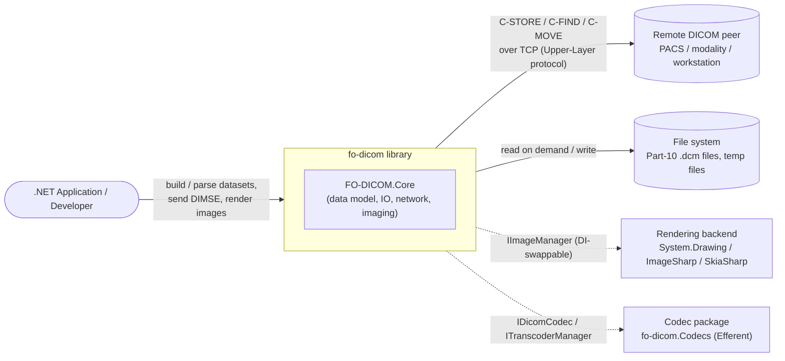
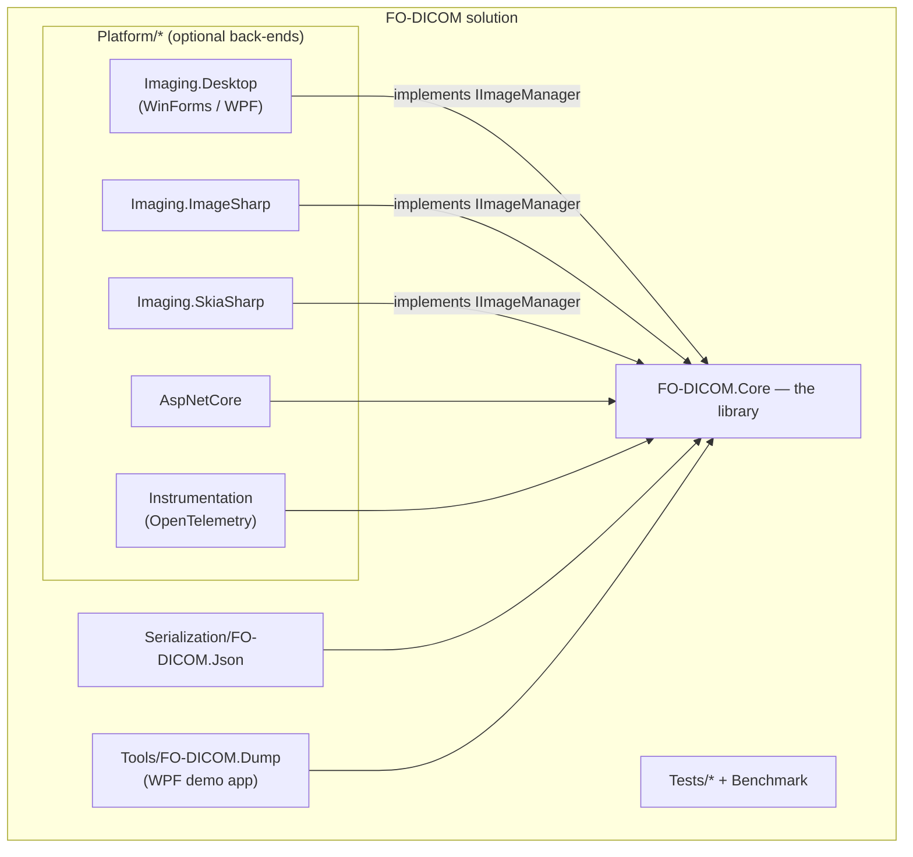
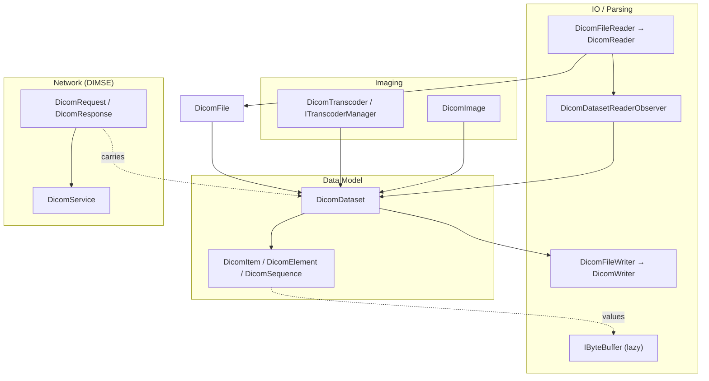
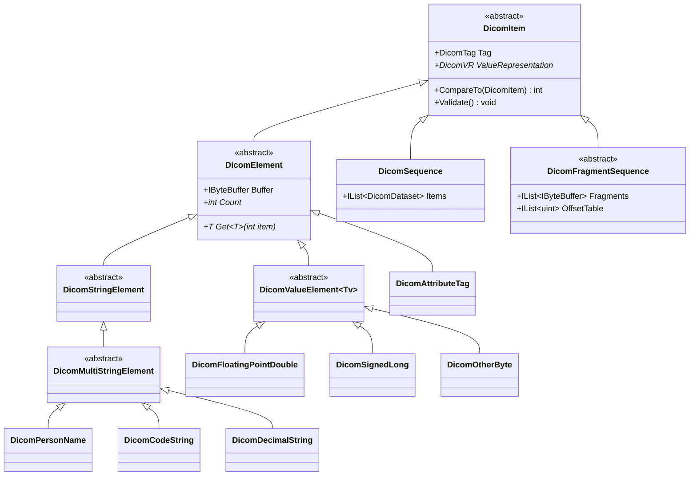
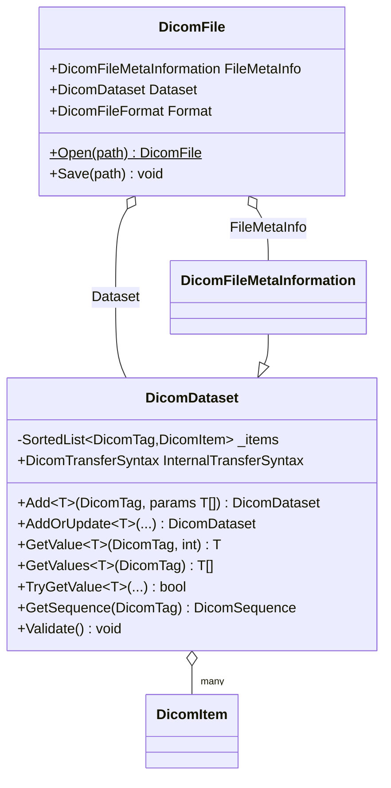
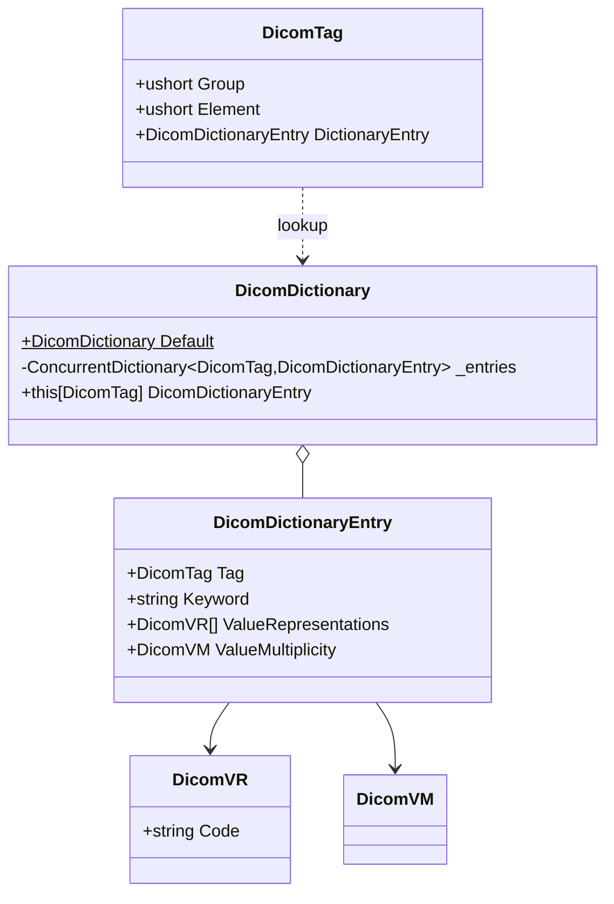
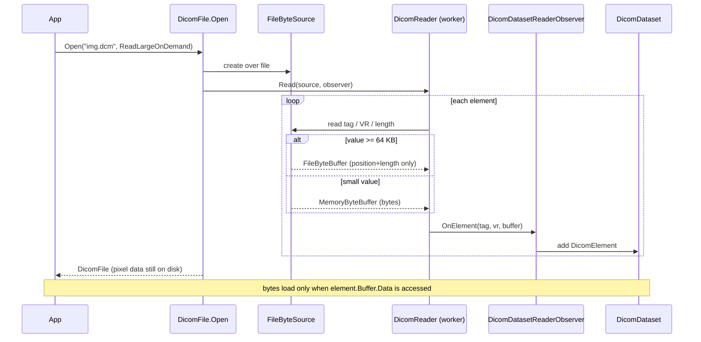
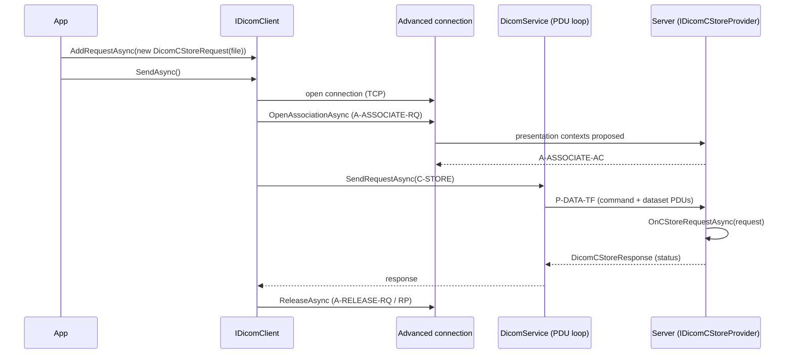
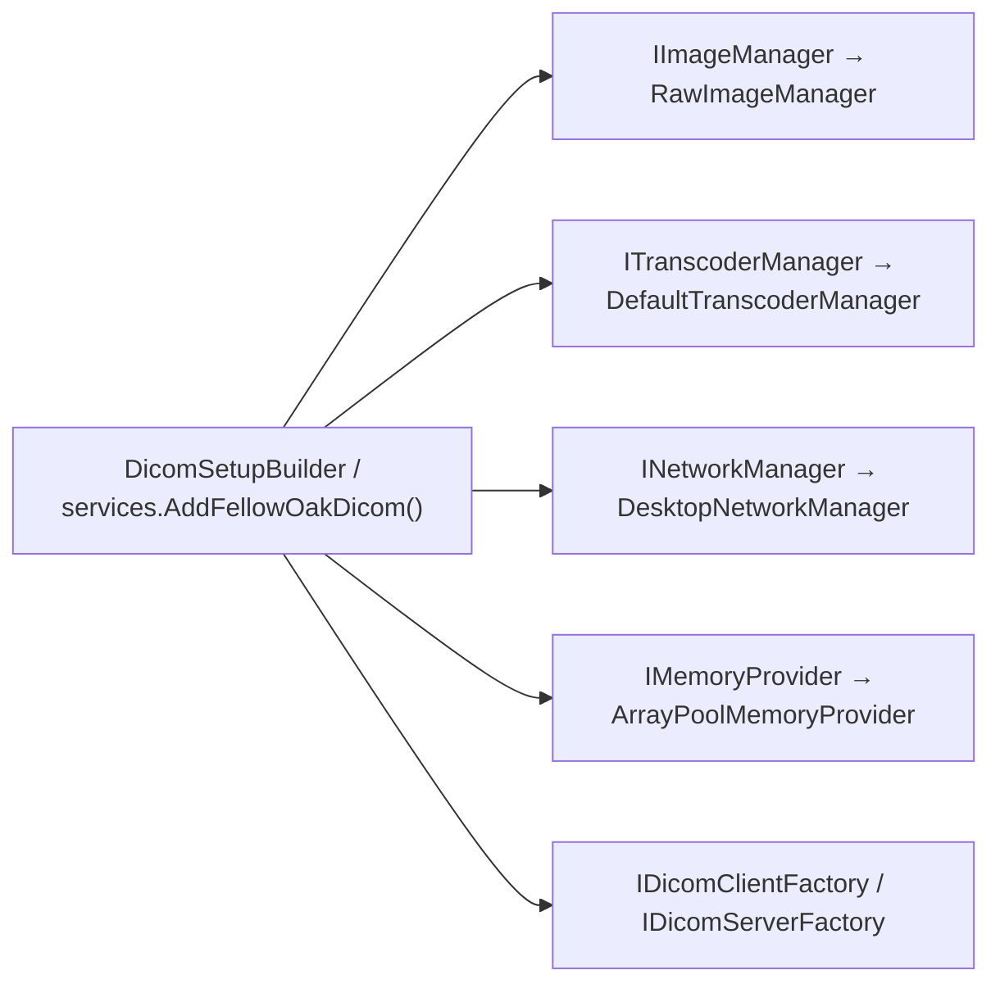

> Source: github.com/fo-dicom/fo-dicom (branch `development`) · Analyzed: 2026-06-12 · Type: **Library** (with a hybrid demo app + platform packages)
> Assembly version 6.0.0 · DICOM dictionary 2026b · Targets `net8.0; net9.0; net10.0`

---

## 1. Overview

**fo-dicom** is a comprehensive, high-performance .NET library for working with the **DICOM** (Digital Imaging and Communications in Medicine) standard. It is the de-facto open-source DICOM toolkit for the .NET ecosystem. It covers the full breadth of the standard:

- **Data model** — parse, build, edit, and validate DICOM datasets and Part-10 files.
- **Networking (DIMSE)** — DICOM service classes (C-ECHO, C-STORE, C-FIND, C-MOVE, C-GET, and the N-* normalized services) as both **SCU** (client) and **SCP** (server).
- **Imaging** — render pixel data to images, transcode between transfer syntaxes (JPEG/JPEG-LS/JPEG2000/RLE compression), apply windowing/LUT pipelines.
- **Serialization** — import/export to JSON and XML.
- **Tooling** — anonymization, structured reports, DICOMDIR media, printing.

### Repo type & evidence

This is primarily a **library**: it is distributed as a family of NuGet packages (`fo-dicom`, `fo-dicom.Imaging.Desktop`, `fo-dicom.Imaging.ImageSharp`, `fo-dicom.Imaging.SkiaSharp`, `fo-dicom.Instrumentation`), defines abstractions for callers to consume and extend (`IImageManager`, `IDicomCodec`, `INetworkManager`, service-provider interfaces), and exposes a public API surface meant to be *imported*. There is no application bootstrap/entry point in the core.

The **hybrid** aspects are secondary:
- `Tools/FO-DICOM.Dump/` — a small **WPF demo application** (`App.xaml`, `MainWindow.xaml`) that runs and exercises the library.
- `Platform/FO-DICOM.AspNetCore/` — ASP.NET Core integration.
- `Platform/*` — platform-specific rendering back-end packages.

### Tech stack

| Concern | Choice |
|---|---|
| Language / runtime | C# (LangVersion 14.0), .NET 8/9/10, `Nullable enable`, AOT-compatible |
| Dependency injection | `Microsoft.Extensions.DependencyInjection` + `Options` + `Logging` |
| High-performance memory | `CommunityToolkit.HighPerformance` (`MemoryOwner<byte>`, array pooling) |
| Async model | Fully `async`/`await`; `IAsyncEnumerable<T>` for streaming query results |
| Code generation | T4 templates generate the DICOM dictionary, tags, UIDs (`*Generated.cs`) |

---

## 2. System Context (C4 Level 1)

Who uses the library and what it talks to.

The library is **back-end agnostic**: imaging back-ends and compression codecs are pluggable through DI-registered abstractions, so the core has no hard dependency on `System.Drawing` or any native codec.

---

## 3. High-Level Structure (C4 Level 2)

The solution is organized into the core assembly plus satellite packages.

### Inside `FO-DICOM.Core`

| Path | Responsibility |
|---|---|
| `FO-DICOM.Core/*.cs` (root) | The DICOM **data model**: `DicomDataset`, `DicomItem`/`DicomElement`, `DicomTag`, `DicomVR`, `DicomUID`, `DicomFile`, `DicomDictionary`, `DicomAnonymizer`. |
| `IO/`, `IO/Buffer/`, `IO/Reader/`, `IO/Writer/` | Byte sources/targets, lazy byte buffers, the binary parser (Observer-based) and writer (Walker-based). |
| `Memory/` | `IMemoryProvider` / `ArrayPoolMemoryProvider` — pooled buffer allocation. |
| `Network/`, `Network/Client/`, `Network/Client/Advanced/`, `Network/Client/States/` | DIMSE messages, association/PDU layer, `DicomService`, server, client (regular + advanced). |
| `Imaging/`, `Imaging/Codec/`, `Imaging/Render/`, `Imaging/LUT/` | `DicomImage`, pixel-data model, rendering pipelines, LUT chains, transcoder/codec abstraction. |
| `Serialization/` | `DicomJson`, `DicomXML`, `JsonDicomConverter`. |
| `Dictionaries/`, `T4/` | DICOM dictionary data + T4 templates that generate `DicomTagGenerated.cs`, `DicomUIDGenerated.cs`. |
| `StructuredReport/`, `Media/`, `Printing/`, `Log/` | SR documents, DICOMDIR, print management, logging adapters. |

---

## 4. Components (C4 Level 3)

The four pillars and how they connect. `DicomDataset` is the shared currency that flows between all of them.

---

## 5. OOP & Class Architecture

This is the heart of the library and where the most instructive OOP lives.

### 5.1 The data-model hierarchy

Everything in a dataset is a `DicomItem` (abstract). The two big branches are **elements** (leaf values, strongly typed by Value Representation) and **sequences** (nested datasets / fragments).

- `DicomItem` (`DicomItem.cs`) is abstract; its `ValueRepresentation` is an abstract property each concrete type fixes (e.g. `DicomSequence.ValueRepresentation => DicomVR.SQ`).
- `DicomElement` (`DicomElement.cs`) is the abstract base for all leaf values; it holds an `IByteBuffer Buffer` and exposes the generic accessor `T Get<T>(int item)`. There is one concrete subclass **per VR** (e.g. `DicomPersonName` = PN, `DicomCodeString` = CS, `DicomOtherByte` = OB). Numeric VRs share the generic base `DicomValueElement<Tv> where Tv : struct`.
- This one-class-per-VR design means the *type system mirrors the DICOM standard* — VR rules (length limits, string vs. binary, multiplicity) live on the type.

### 5.2 The aggregate and the file

- `DicomDataset` (`DicomDataset.cs`) is the **central aggregate**, backed by a `SortedList<DicomTag, DicomItem>` (items stay tag-ordered as the standard requires). Its API is **fluent** — `Add`/`AddOrUpdate` return `this` — and **generic** — `Add<T>(tag, values)` infers the right `DicomElement` subclass from the dictionary VR. Reads come in three flavors: throwing (`GetValue<T>`), bulk (`GetValues<T>`), and safe (`TryGetValue<T>`).
- `DicomFile` = `FileMetaInfo` (group 0002) + `Dataset`. Notably `DicomFileMetaInformation` **inherits** `DicomDataset` — the file header is itself a dataset.

### 5.3 Metadata as immutable flyweights

`DicomTag`, `DicomVR`, `DicomVM`, `DicomUID`, and `DicomTransferSyntax` are immutable, shared singletons backed by a registry, so the same metadata object is reused across the entire object graph.

### 5.4 Visitor over the dataset

`IDicomDatasetWalker` / `DicomDatasetWalker` (`DicomDatasetWalker.cs`) is a classic **Visitor**: the walker traverses the tree (elements, sequences, fragments) and emits callbacks (`OnElement`, `OnBeginSequence`, …). The same traversal powers many algorithms — notably `DicomWriter` (serialization) **is** an `IDicomDatasetWalker`, and anonymization/validation reuse the pattern.

### Design patterns in the data model

| Pattern | Where | Why |
|---|---|---|
| **Template Method** | `DicomItem` / `DicomElement` abstract members (`ValueRepresentation`, `Get<T>`) | Fix the skeleton; each VR fills in specifics. |
| **Flyweight + Registry** | `DicomDictionary.Default`, static `DicomVR`/`DicomTag`/`DicomUID` instances | Reuse immutable metadata; O(1) lookup. |
| **Visitor** | `IDicomDatasetWalker` + `DicomDatasetWalker` | Decouple traversal from operation (write, anonymize, validate). |
| **Factory Method** | `DicomDataset.Add<T>` → concrete element by VR | Caller supplies values; library picks the type. |

---

## 6. Key Flows

### 6.1 Reading a Part-10 file (lazy / load-on-demand)

The signature feature "supports very large datasets with content loading on demand" lives in the IO layer: large element values (≥ `LargeObjectSize`, default 64 KB) are *not* materialized during parsing — the element keeps a `FileByteBuffer` that reads the byte range from disk only when `.Data` is first touched.

The parser is an **Observer**: `DicomReader` knows only the binary grammar and emits events to an `IDicomReaderObserver`. `DicomDatasetReaderObserver` builds a `DicomDataset`; `DicomReaderCallbackObserver` instead fires per-tag callbacks — two behaviors over one parse.

### 6.2 Sending a C-STORE (SCU → SCP)

---

## 7. Extension Points

fo-dicom is built to be customized through its DI container. `AddFellowOakDicom()` (`Setup.cs`) registers defaults using `TryAdd*`, so any service you register first wins.

| Extension point | Interface | How you extend |
|---|---|---|
| **Rendering back-end** | `IImageManager` / `IImage` | Reference a `Platform/*` package or implement your own; register via `AddImageManager<T>()`. Built-ins: `RawImageManager` (default, in Core), `WinFormsImageManager`/`WPFImageManager` (Desktop), `ImageSharpImageManager`, `SkiaSharpImageManager`. |
| **Compression codecs** | `IDicomCodec`, `ITranscoderManager` | Register a transcoder manager via `AddTranscoderManager<T>()`; codecs are keyed by `DicomTransferSyntax`. |
| **Network transport** | `INetworkManager`, `INetworkListener`, `INetworkStream` | Swap TCP/TLS implementation via `AddNetworkManager<T>()`. |
| **DICOM server (SCP)** | `IDicomServiceProvider` + `IDicomC*Provider` / `IDicomNServiceProvider` | Subclass `DicomService`, implement the provider interfaces for the services you support, create with `DicomServerFactory.Create<T>()`. |
| **Memory strategy** | `IMemoryProvider` | Replace pooling behavior. |
| **Custom elements / dictionary** | `DicomDictionary`, `DicomPrivateCreator` | Register private tags and UIDs at runtime. |

The networking server uses a **Factory** (`IDicomServerFactory`) plus a **Registry** (`IDicomServerRegistry`) that tracks running servers by `(ip, port)` to prevent conflicts and hands back a disposable `DicomServerRegistration`. The base `DicomService` is a **Template Method** engine (PDU read → DIMSE parse → dispatch) with provider-supplied **Strategy** handlers. The imaging LUT pipeline composes `ILUT` stages through a **Composite** (`CompositeLUT`: Modality → VOI → Output → Invert), selected per photometric interpretation by a **Strategy** (`GenericGrayscalePipeline` / `RgbColorPipeline` / `PaletteColorPipeline`).

---

## 8. Key Abstractions / Glossary

| Term | Meaning in this codebase |
|---|---|
| **DICOM** | The medical imaging standard for file format + network protocol. |
| **Dataset** (`DicomDataset`) | An ordered collection of data elements — the core in-memory object. |
| **Element / Item** (`DicomElement`/`DicomItem`) | A single attribute (tag + VR + value). `DicomItem` is the abstract base. |
| **Tag** (`DicomTag`) | The (group, element) identifier of an attribute, e.g. `(0010,0010)` PatientName. |
| **VR** (`DicomVR`) | Value Representation — the data type of an element (PN, DA, US, OB, SQ, …). |
| **VM** (`DicomVM`) | Value Multiplicity — how many values an element may hold. |
| **UID** (`DicomUID`) | Globally unique identifier (SOP classes, transfer syntaxes, instances). |
| **Transfer Syntax** (`DicomTransferSyntax`) | Encoding rules: explicit/implicit VR, endianness, compression. |
| **Sequence (SQ)** (`DicomSequence`) | An element whose value is a list of nested datasets. |
| **DIMSE** | DICOM Message Service Element — the request/response messages (`DicomRequest`/`DicomResponse`) for C-* and N-* services. |
| **Association** (`DicomAssociation`) | A negotiated network session between two DICOM nodes (presentation contexts, AE titles). |
| **PDU** (`PDU.cs`) | Protocol Data Unit — the wire framing of the DICOM Upper-Layer protocol. |
| **SCU / SCP** | Service Class User (client) / Provider (server). |
| **Pixel Data** (`DicomPixelData` / `IPixelData`) | The image bytes; `PixelDataFactory` builds the right typed view from the dataset. |
| **LUT** (`ILUT`) | Lookup Table applied during rendering (modality rescale, VOI window, output color map). |
| **IByteBuffer** | Abstraction over an element's raw bytes; concrete types enable in-memory vs. lazy on-disk storage. |

---

## 9. Open Questions & Notes

- **Subclass enumeration is partial.** The full set of per-VR `DicomElement` subclasses and `IPixelData`/`IByteBuffer` implementations was sampled, not exhaustively listed; the diagrams show representative members. Verify against the source before relying on a specific subclass name.
- **Line numbers are approximate.** References were gathered from interface-level reads; exact line numbers may drift between versions. Treat file paths as authoritative and line numbers as hints.
- **Legacy client state machine.** `Network/Client/States/` contains a `DicomClientState` hierarchy (Idle → Connect → RequestAssociation → SendingRequests → Linger/Release/Abort) that the exploration found marked `[Obsolete]`. The modern client wraps the **Advanced** API (`IAdvancedDicomClientConnection` / `IAdvancedDicomClientAssociation`) instead. The State pattern is therefore historical, not the active design — confirm before documenting it as current.
- **Codec packaging.** The actual compression codecs (JPEG/JPEG2000/RLE) ship in the external `fo-dicom.Codecs` package (Efferent Health); Core only defines the `IDicomCodec`/`ITranscoderManager` abstraction and a `DefaultTranscoderManager`. The native codec internals were not examined.
- **Generated code.** `DicomTagGenerated.cs`, `DicomUIDGenerated.cs`, and `DicomAnonymizerGenerated.cs` are produced from the `Dictionaries/` + `T4/` templates and were treated as data, not hand-written architecture.
- **Serialization & SR depth.** JSON/XML (`Serialization/`) and Structured Report (`StructuredReport/`) were identified but not deeply traced; they consume the same `DicomDataset` model.
