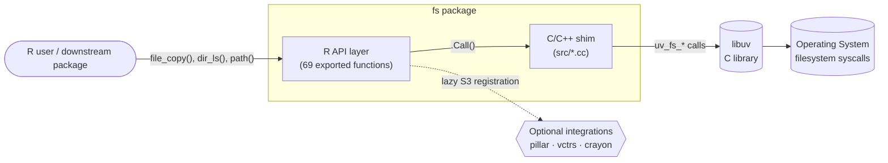
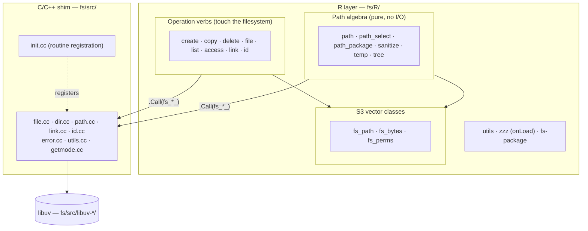
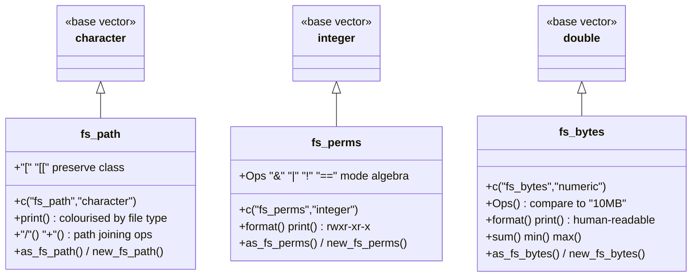
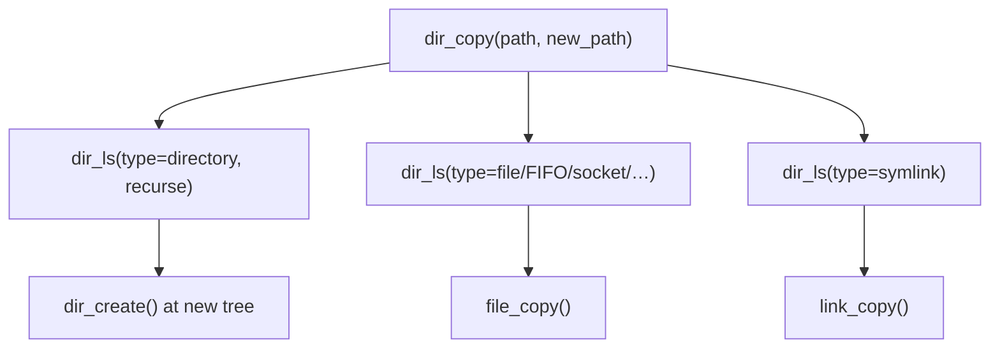

> Source: <https://github.com/r-lib/fs> (cloned into `fs/`) · Analyzed: 2026-06-11 · Type: **Library / R Package**
> Version analyzed: `2.1.0` (per `fs/DESCRIPTION`)

---

## 1. Overview

**fs** is an R package providing a *cross-platform, uniform interface to file
system operations*. Instead of R's inconsistent base functions (`file.copy`,
`dir.create`, `list.files`, …), it exposes a tidy, vectorized, predictable API
where every function returns a path-carrying value or throws on failure.

The defining architectural choice: file system work is **not** done in R. It is
delegated to **[libuv](https://docs.libuv.org/en/v1.x/fs.html)** — the same C
library that powers Node.js — through a thin C/C++ shim. R provides the
ergonomic surface; libuv provides the battle-tested, cross-platform engine.

**Repo type — Library, with strong evidence:**

| Signal | Evidence |
|--------|----------|
| Public API meant to be imported | `NAMESPACE` exports **69** functions; no `main`/CLI/server bootstrap |
| Distribution metadata | `DESCRIPTION` (`Package: fs`, `Version: 2.1.0`, CRAN-style), `License: MIT` |
| No deployment config | No `Dockerfile`/compose/k8s; build is the standard R `R CMD INSTALL` flow |
| Vendored dependency | `tools/libuv-v1.52.0.tar.gz` + `src/Makevars.vendor` bundle libuv |

**Tech stack**

- **R** (≥ 4.1) — public API, S3 classes, argument validation, orchestration.
- **C / C++** — `src/*.cc` shim translating R `SEXP` ⇆ libuv calls.
- **libuv** (C) — the cross-platform file-system back end (vendored or system).
- Runtime deps: only `methods`. Soft integrations (registered lazily): `pillar`,
  `vctrs`, `crayon`, `testthat`.

---

## 2. System Context

Who calls fs, and what fs depends on.



- **Inbound:** any R session or package calls fs's exported functions.
- **Core dependency:** libuv does the real work; fs links it via `.Call`.
- **Optional:** `pillar`/`vctrs`/`crayon` are *Suggests* — fs degrades
  gracefully when they are absent (see §7).

---

## 3. High-Level Structure

fs is organized as two cooperating layers plus a vendored engine. The R layer
splits cleanly into **operation verbs** (act on the filesystem) and **path
algebra** (pure string manipulation, no I/O).



### R source map (`fs/R/`)

| Path | Responsibility |
|------|----------------|
| `path.R` | Path algebra: `path()`, `path_abs/real/norm/rel`, `path_split/join`, `path_ext*`, `path_file/dir`, `path_expand`, `path_home` |
| `create.R` `copy.R` `delete.R` | The `file_* / dir_* / link_*` verb trios for create / copy / delete |
| `file.R` | File metadata & attributes: `file_info`, `file_size`, `file_chmod`, `file_chown`, `file_move`, `file_touch`, `file_show` |
| `list.R` | Directory listing/iteration: `dir_ls`, `dir_map`, `dir_walk`, `dir_info` |
| `access.R` `is.R` | Predicates: `file_exists`, `dir_exists`, `link_exists`, `file_access`; `is_file/is_dir/is_link/is_*_empty` |
| `link.R` | `link_path()` (other link verbs live in create/copy/delete) |
| `id.R` | User/group lookup: `user_ids()`, `group_ids()` |
| `temp.R` | Temp paths + a temp-file stack: `file_temp`, `file_temp_push/pop`, `path_temp` |
| `tree.R` | `dir_tree()` pretty printer |
| `path_select.R` `path_package.R` `sanitize.R` | `path_select_components()`, `path_package()`, `path_sanitize()` |
| `fs_path.R` `fs_bytes.R` `fs_perms.R` | The three S3 vector classes (§5) |
| `utils.R` | Shared helpers: `assert()`, `assert_no_missing()`, recycling, coercion |
| `zzz.R` | `.onLoad` — lazy S3 method registration for optional packages |
| `fs-package.R` `package.R` | Package docs and `.Call` symbol aliases |

### C/C++ source map (`fs/src/`)

| Path | Responsibility |
|------|----------------|
| `file.cc` | Bulk of the verbs: `fs_move_`, `fs_create_`, `fs_copyfile_`, `fs_stat_`, `fs_chmod_`, `fs_chown_`, `fs_touch_`, `fs_unlink_`, `fs_access_`, `fs_exists_` |
| `dir.cc` | `fs_dir_map_` — directory traversal (recursion lives here) |
| `path.cc` | `fs_path_`, `fs_realize_`, `fs_tidy_`, `fs_expand_` path resolution |
| `link.cc` | `fs_link_create_hard_`, `fs_link_create_symbolic_`, `fs_readlink_` |
| `id.cc` | `fs_getpwnam_`, `fs_getgrnam_`, `fs_users_`, `fs_groups_` |
| `getmode.cc` (+ `unix/` `windows/`) | Parse symbolic permission modes per-platform |
| `error.cc` / `error.h` | Translate libuv error codes into R conditions |
| `utils.cc` / `utils.h` | `path_tidy_`, dirent-type helpers, `BEGIN_CPP/END_CPP` exception guards |
| `init.cc` | Registers all 29 `.Call` routines with R's dynamic loader |
| `libuv-*/` `bsd/` | Vendored libuv + BSD `setmode`/`strmode` fallbacks |

---

## 4. Components — inside the R↔C boundary

The most architecturally significant region is the **bridge** between R and
libuv. Three pieces make it work: a registration table, a calling convention,
and an error-translation layer.

```mermaid
flowchart TD
    rfun["R verb e.g. file_copy()"]
    validate["utils.R: assert_no_missing(),<br/>path_expand(), recycle lengths"]
    call[".Call(fs_copyfile_, old, new, overwrite)"]
    alias["package.R / NAMESPACE useDynLib(.registration=TRUE)<br/>resolves fs_copyfile_ symbol"]
    ccfun["file.cc: fs_copyfile_(SEXP, SEXP, SEXP)"]
    uv["libuv: uv_fs_copyfile()"]
    errcheck["error.cc: stop_for_error()<br/>libuv code -> R condition"]

    rfun --> validate --> call --> alias --> ccfun --> uv
    uv -->|"req.result < 0"| errcheck
    errcheck -.->|"signals R error"| rfun
```

**Calling convention.** Every C entry point is named `fs_<verb>_` and is plain
`extern "C" SEXP`-returning. They are **not** generated by Rcpp/cpp11; the
`// [[export]]` comments are a project marker, and the canonical registration is
hand-maintained in `src/init.cc` via `R_registerRoutines` +
`R_useDynamicSymbols(dll, FALSE)`. R reaches them with
`useDynLib(fs, .registration = TRUE)` (`NAMESPACE:111`).

**Error translation.** C code never returns error codes to R. After each libuv
request, `stop_for_error(req, ...)` (macro in `error.h`) calls
`signal_condition()` in `error.cc`, which converts a negative `uv_fs_t.result`
into a classed R error — realizing the README's "explicit failure" promise.

**Vectorization.** R functions accept vectors; the C functions loop with
`for (R_xlen_t i = 0; i < Rf_xlength(...); ++i)` internally (see `fs_move_`,
`fs_create_` in `file.cc`). Vectorization is therefore a *contract of the C
layer*, not emulated in R.

---

## 5. OOP & Class Architecture

fs has no class hierarchy in the OO-inheritance sense. Its "objects" are **three
S3 vector classes** that subclass base atomic vectors — a lightweight,
idiomatic-R form of the *decorator / typed-value* pattern. Each wraps a base
vector and overrides printing, subsetting, arithmetic, and coercion so the value
*remembers it is a path / size / permission*.



**Patterns in use**

- **Constructor / coercer split** (consistent across all three): a low-level
  `new_fs_*()` sets the class on a validated vector; a public `as_fs_*()` S3
  generic coerces from many input types (`character`, `numeric`, `integer`,
  `octmode`, `NULL`). Example: `new_fs_path()` vs `as_fs_path.*` in `fs_path.R`.
- **S3 operator overloading.** `fs_path` overloads `/` and `+` for path joining;
  `fs_perms` overloads `&  |  !  ==` for permission-set algebra; `fs_bytes`
  overloads `Ops` so `fs_bytes("1KB") < "1MB"` works.
- **`setOldClass()` registration** (`fs_path.R`) registers the S3 class with S4
  so fs values can sit in S4 slots / method dispatch.
- **Class-preserving subsetting.** `[` and `[[` re-wrap with `new_fs_*()` via
  `NextMethod()`, so slicing a path vector yields a path vector — not a bare
  character.

These classes are *return-value types*: nearly every verb funnels its result
through `path_tidy()`/`new_fs_path()` so callers get a coloured, typed path back.

---

## 6. Key Flows

### 6.1 Runtime flow — `file_copy("foo", "bar")`

A representative verb showing validation → bridge → libuv → typed result.

```mermaid
sequenceDiagram
    participant U as R caller
    participant R as file_copy() (copy.R)
    participant V as utils.R asserts
    participant C as fs_copyfile_ (file.cc)
    participant L as libuv
    participant E as error.cc

    U->>R: file_copy("foo","bar")
    R->>V: assert_no_missing(path/new_path)
    R->>R: path_expand(); resolve dir targets; recycle lengths
    R->>C: .Call(fs_copyfile_, old, new, overwrite)
    loop each path i
        C->>L: uv_fs_copyfile(loop,&req,p,n,flags,NULL)
        L-->>C: req.result
        alt result < 0
            C->>E: stop_for_error2(req,"Failed to copy '%s' to '%s'")
            E-->>U: throw classed R error
        end
    end
    C-->>R: R_NilValue
    R-->>U: invisible(path_tidy(new))  // fs_path vector
```

### 6.2 Orchestration flow — `dir_copy()` reuses primitives

Higher-level verbs are composed *in R* from primitive verbs, not from new C
code. `dir_copy()` (`copy.R`) walks the tree with `dir_ls()` and dispatches to
`dir_create()`, `file_copy()`, and `link_copy()` by entry type:



This "compose in R, delegate primitives to C" split keeps the C surface small
(29 routines) while the R API stays rich (69 functions).

---

## 7. Extension Points

fs is a leaf utility library, not a framework — extension is mostly about
*integration* rather than subclassing.

- **Optional package integration via `.onLoad`.** `zzz.R` registers S3 methods
  for `pillar` (tibble column formatting), `vctrs` (`vec_ptype2`/`vec_cast`
  coercion rules), and `testthat` (`compare`) **only if/when those packages
  load**, using `register_s3_method()` + `setHook(packageEvent(...))`. fs has no
  hard dependency on them; the classes still work standalone.
- **Coercion extensibility.** Because `as_fs_path`/`as_fs_bytes`/`as_fs_perms`
  are S3 generics, a downstream package can add a method for its own type
  (e.g. `as_fs_bytes.myclass`).
- **Display customization via environment.** Path colouring reads `LS_COLORS`
  (GNU dircolors format); setting it to `""` disables colour (`fs_path.R`,
  `colourise_fs_path()`). `getOption("fs.fs_path.shorten")` tunes tibble display.
- **Swappable back end at build time.** `Makevars.in` / `Makevars.vendor`
  let the package link a **system libuv** or build the **vendored** copy
  (`tools/libuv-v1.52.0.tar.gz`), controlled by `configure`.

---

## 8. Key Abstractions / Glossary

| Term | Meaning in fs |
|------|---------------|
| **Verb** | An exported function that *acts* on the filesystem, named `noun_action` — `file_copy`, `dir_create`, `link_delete`. The `file_/dir_/link_` trios are the core idiom. |
| **Path algebra** | Pure functions in `path.R` that manipulate path strings without I/O (`path_join`, `path_ext_set`, `path_rel`). |
| **`fs_path`** | A `character` subclass; a tidied, UTF-8, colour-aware path. The default return type of most verbs. |
| **`fs_bytes`** | A numeric subclass for human-readable sizes; comparable to strings like `"10MB"`. |
| **`fs_perms`** | An integer subclass for Unix permission bits; supports `rwxr-xr-x` display and bitwise mode algebra. |
| **`.Call` routine** | A C function `fs_<verb>_` registered in `init.cc`, the only way R crosses into libuv. |
| **libuv** | The vendored C library (`src/libuv-*/`) performing the actual cross-platform syscalls. |
| **`stop_for_error`** | Macro (`error.h`) that converts a failed libuv request into an R error — the mechanism behind "explicit failure". |
| **Tidy path** | A canonicalized path string (single `/`, no trailing slash, `~` preserved) produced by `path_tidy()` / `path_tidy_` (C). |

---

## 9. Open Questions & Notes

- **`// [[export]]` markers.** These comments sit above each C entry point but
  the build does **not** appear to run cpp11/Rcpp codegen — registration is the
  hand-written table in `src/init.cc`. The markers look like a legacy/custom
  generator convention or documentation aid. *Assumption: registration is
  manual; the markers are not load-bearing.* Worth confirming against the
  package's historical build tooling if precision matters.
- **libuv vendoring vs. system lib.** `DESCRIPTION` `SystemRequirements` and the
  multiple `Makevars*` variants imply the engine can be either system-provided
  or built from the vendored tarball; the exact `configure`-time decision logic
  was not traced line-by-line.
- **Windows code paths.** Per-platform code exists (`src/windows/getmode.cc`,
  `src/unix/getmode.cc`, `Makevars.win`/`.ucrt`/`.mingw`). This analysis was
  performed on macOS/Unix mental-model; Windows-specific link/permission
  behavior was not exercised.
- **`fs_bytes`/`fs_perms` full operator sets** were sampled (constructor,
  `Ops`, `format`, subsetting) rather than read exhaustively; the class diagram
  lists representative — not complete — methods.
- The C layer is intentionally thin; nearly all "interesting" orchestration
  (recursion fan-out, type filtering, temp-file stack) lives in R. A reader
  wanting to understand *behavior* should start in `R/`, not `src/`.
