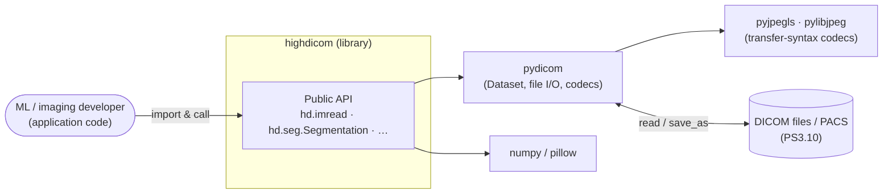
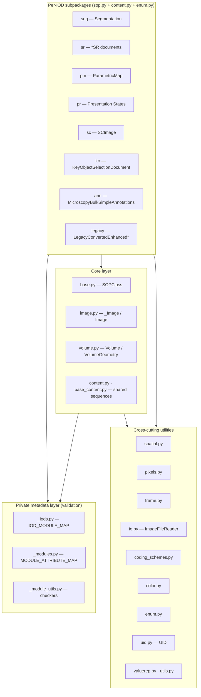
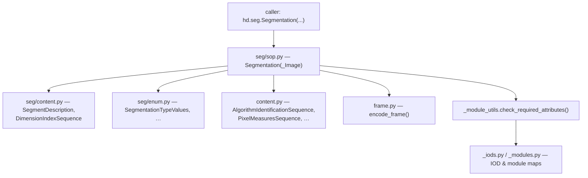
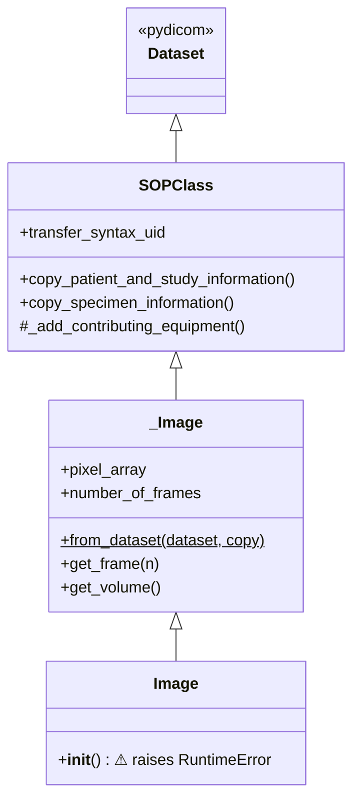
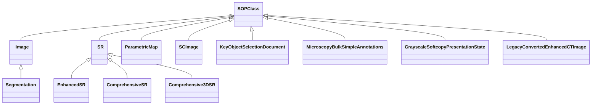
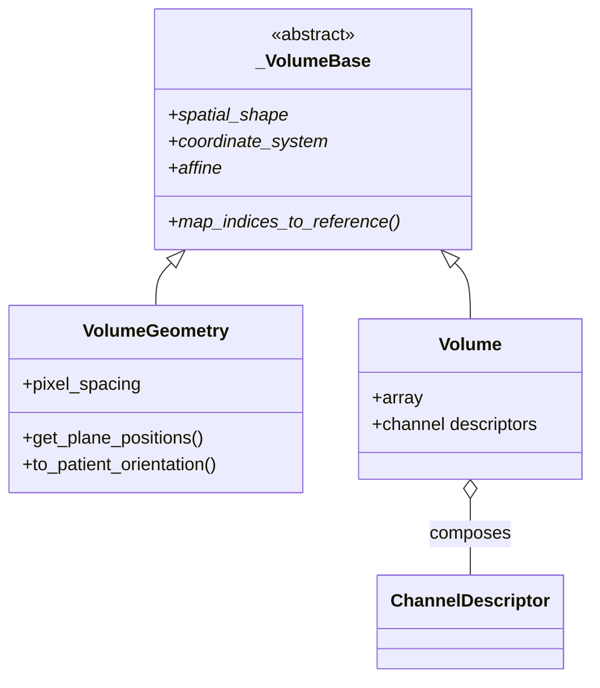
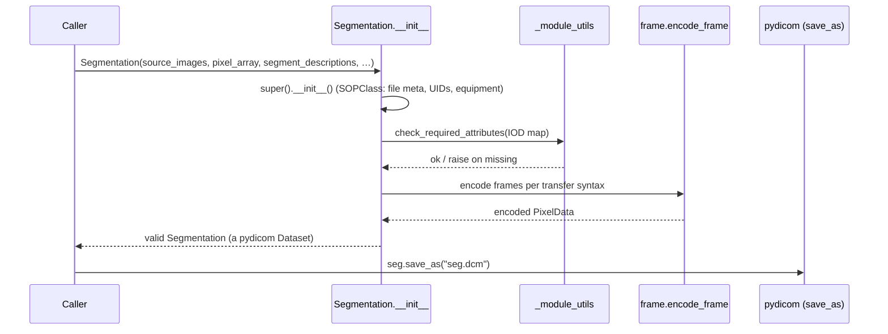
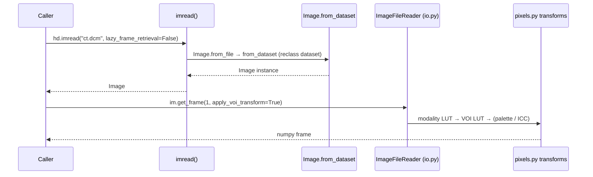

> Source: https://github.com/ImagingDataCommons/highdicom (v0.27.0) · Analyzed: 2026-06-14 · Type: **Library / Package**
> See also: [User-Facing API & UX](./highdicom-ux.md)

## 1. Overview

`highdicom` is a pure-Python library that provides a **high-level, object-oriented API on
top of [`pydicom`](https://github.com/pydicom/pydicom)** for working with DICOM medical
imaging files. Its focus is the operations needed for machine learning, computer vision,
and computational image analysis: reading image frames (with the spatial arrangement and
pixel transforms `pydicom` does not handle), and **creating standards-compliant derived
DICOM objects** — segmentations, structured reports, parametric maps, presentation states,
annotations, key-object-selection documents, and secondary captures.

**Repo type — Library (evidence):**
- `pyproject.toml`: `name = "highdicom"`, `[tool.setuptools.packages.find] where = ["src"]`,
  versioned for PyPI; **no** `[project.scripts]` / console entry points.
- The surface is meant to be *imported* (`import highdicom as hd`), not *run*.
- `src/highdicom/py.typed` ships type information for downstream consumers.

**Design philosophy** (from `docs/development.rst`, `docs/overview.rst`):
| Principle | Consequence in the code |
|-----------|-------------------------|
| Interoperate with pydicom | Every SOP class subclasses `pydicom.dataset.Dataset` — no wrapper overhead. |
| Use standard DICOM terminology | Classes/attrs mirror DICOM IOD names even when not intuitive. |
| Strict encoding validation | Objects are *valid on construction*; no invalid intermediate state. |
| Tolerant decoding | Readers accept minor real-world deviations; validate assumptions rather than work around them. |
| Eager type conversion | `from_dataset()` reclasses pydicom datasets (and nested items) into highdicom types. |

**Tech stack:** Python 3.10–3.14; depends on `pydicom>=3.0.1`, `numpy>=1.19`,
`pillow>=8.3`, `pyjpegls`, `typing-extensions`; optional `pylibjpeg*` codecs.

## 2. System Context

Who/what uses the library and what it depends on.

highdicom sits **above** pydicom: pydicom owns low-level parsing, encoding, and pixel
codecs; highdicom adds IOD-specific construction, validation, frame arrangement, and pixel
transforms.

## 3. High-Level Structure

The package is organized into a **core layer**, a set of **per-IOD subpackages** that all
follow the same internal shape, **cross-cutting utilities**, and a **private metadata
layer** that drives validation.

| Path | Responsibility |
|------|----------------|
| `src/highdicom/base.py` | `SOPClass` — root of every SOP instance; file meta + patient/study/series/equipment attrs. |
| `src/highdicom/image.py` | `_Image`/`Image` — frame access, pixel decoding, volume extraction. |
| `src/highdicom/volume.py` | `Volume`, `VolumeGeometry`, `ChannelDescriptor` — 3D array + affine geometry. |
| `src/highdicom/content.py`, `base_content.py` | Reusable sequence/item classes (LUTs, pixel measures, plane position/orientation, specimen, equipment). |
| `src/highdicom/{seg,sr,pm,pr,sc,ko,ann,legacy}/` | One DICOM IOD family each: `sop.py` (SOP class), `content.py` (helpers), `enum.py`. |
| `src/highdicom/{spatial,pixels,frame,io,color,coding_schemes,enum,uid,valuerep,utils}.py` | Cross-cutting concerns. |
| `src/highdicom/_iods.py`, `_modules.py`, `_module_utils.py` | Declarative DICOM module/IOD definitions + validators (private). |

## 4. Components — inside the per-IOD pattern

Every derived-object subpackage repeats the **same three-part shape**, so learning one
(e.g. `seg/`) transfers to all the others. The SOP class composes content helpers and
delegates rule-checking to the private metadata layer.

The **data-driven validation** is the architecturally distinctive choice: DICOM module and
IOD rules live as nested dictionaries (`MODULE_ATTRIBUTE_MAP` in `_modules.py`,
`IOD_MODULE_MAP` + `SOP_CLASS_UID_IOD_KEY_MAP` in `_iods.py`). Generic functions in
`_module_utils.py` (`check_required_attributes`, `construct_module_tree`,
`get_module_usage`, `is_attribute_in_iod`) walk that metadata. New IODs are added as data,
not as bespoke validation code.

## 5. OOP & Class Architecture

### 5.1 The SOP inheritance spine

`SOPClass` (`base.py:27`) is the root. `_Image` (`image.py:1119`) adds image behavior and
the `from_dataset` factory; the public `Image` (`image.py:6386`) deliberately **forbids
direct construction** (`__init__` raises `RuntimeError`) — you obtain one via `imread()` /
`from_dataset()` so the type is always backed by a real dataset.

### 5.2 The derived-object SOP classes

`Segmentation` (`seg/sop.py:160`) extends `_Image` (it *is* an image). The SR documents
share an abstract-ish `_SR` base (`sr/sop.py`). The remaining derived objects extend
`SOPClass` directly. (`pr/sop.py` also defines `PseudoColor…`, `Color…`, and
`AdvancedBlendingPresentationState`; `legacy/sop.py` adds MR and PET variants.)

### 5.3 The geometry hierarchy (ABC)

`_VolumeBase` (`volume.py:236`) is a true `ABC` with `@abstractmethod` geometry contract.
`VolumeGeometry` carries spatial metadata only; `Volume` adds the numpy array plus
non-spatial `ChannelDescriptor`s — note `Volume` is **not** a DICOM SOP class (it does not
inherit `Dataset`); it is a pure in-memory geometric abstraction.

### 5.4 Patterns in use

| Pattern | Where | Why |
|---------|-------|-----|
| Inheritance from `pydicom.Dataset` | all SOP & many content classes | seamless pydicom interop, zero wrapping. |
| **Factory classmethod** (`from_dataset`, `from_file`) | `_Image` and all SOP classes | eager conversion of existing datasets; defined on the base so subclasses inherit it (`Self` return). |
| **Construction-forbidding base** | `Image.__init__` raises | guarantees the public `Image` is always backed by a dataset. |
| **Data-driven validation** | `_iods`/`_modules`/`_module_utils` | one declarative source of truth for many IODs; no per-class validation code. |
| Abstract base class | `_VolumeBase(ABC)` | enforce geometry interface across `Volume`/`VolumeGeometry`. |
| Composition | `Volume` ↔ `ChannelDescriptor`; SOP classes ↔ content helpers | keep constructors lean, model DICOM sequences as objects. |
| Enum-based type safety | `enum.py` + per-module `enum.py` | accept enum *or* string; normalize to canonical DICOM values. |

## 6. Key Flows

### 6.1 Create & encode a derived object (Segmentation)

### 6.2 Read & decode an image

## 7. Extension Points

- **Subclass `SOPClass`** (or `_Image`) to add a new derived object — follow the
  `sop.py` + `content.py` + `enum.py` triad of an existing subpackage as the template.
- **Register a new IOD** by adding entries to `MODULE_ATTRIBUTE_MAP` / `IOD_MODULE_MAP` /
  `SOP_CLASS_UID_IOD_KEY_MAP`; the generic checkers then validate it for free.
- **Pixel & frame customization** through `pixels.py` (modality/VOI/palette/ICC transforms)
  and `frame.py` (`encode_frame`/`decode_frame`) — codec support flows from pydicom's
  optional `pylibjpeg*`/`pyjpegls` plugins.
- **Coding schemes / terminology** via `coding_schemes.py` and pydicom's `codes` dictionary
  (SNOMED-CT, DCM, UCUM) — passed as `CodedConcept`s into content objects.
- **Lazy I/O** via `io.ImageFileReader` and the `lazy_frame_retrieval=True` flag for large
  multi-frame objects.

## 8. Key Abstractions / Glossary

| Term | Meaning here |
|------|--------------|
| **SOP / SOP Instance** | Service-Object Pair — one DICOM object instance; modeled by `SOPClass`. |
| **SOP Class UID** | Identifies the *kind* of object; maps to an IOD via `SOP_CLASS_UID_IOD_KEY_MAP`. |
| **IOD** | Information Object Definition — the set of modules that compose a SOP class. |
| **Module / Attribute Type** | Group of attributes; type 1/1C/2/2C/3 = required→optional (`AttributeTypeValues`). |
| **Frame of Reference / coordinate system** | `CoordinateSystemNames` (PATIENT vs SLIDE) governing spatial layout. |
| **Coded concept** | A standardized (scheme, code, meaning) triple; `CodedConcept`/pydicom `Code`. |
| **Modality / VOI LUT** | Pixel transforms (rescale, then window/level) applied on read (`pixels.py`). |
| **Volume** | In-memory 3D array + affine geometry; not a DICOM object. |

## 9. Open Questions & Notes

- The exact ordering and optionality of the read-time pixel-transform pipeline (modality →
  VOI → presentation → palette → ICC) is described from `docs/pixel_transforms.rst` and the
  `get_frame`/`get_volume` parameter defaults; the precise interaction of all flags was not
  traced line-by-line in `image.py`'s `_CombinedPixelTransform`.
- `image.py` is very large (~7k lines); this doc covers its public boundary and the
  `_Image`/`Image` split, not every private helper (`_SQLTableDefinition`,
  `_build_luts`, etc.).
- The SR content-tree/template system (`sr/value_types.py`, `sr/templates.py`, TID 1500) is
  rich and only summarized here; the architecture doc treats it as one component — see the
  UX doc and `docs/sr.rst`/`docs/tid1500.rst` for the content-item taxonomy.
- Some `_SR` base is treated as "abstract-ish": it is the shared parent of the three SR SOP
  classes; whether it is a formal `ABC` was not confirmed at the class-declaration level.
