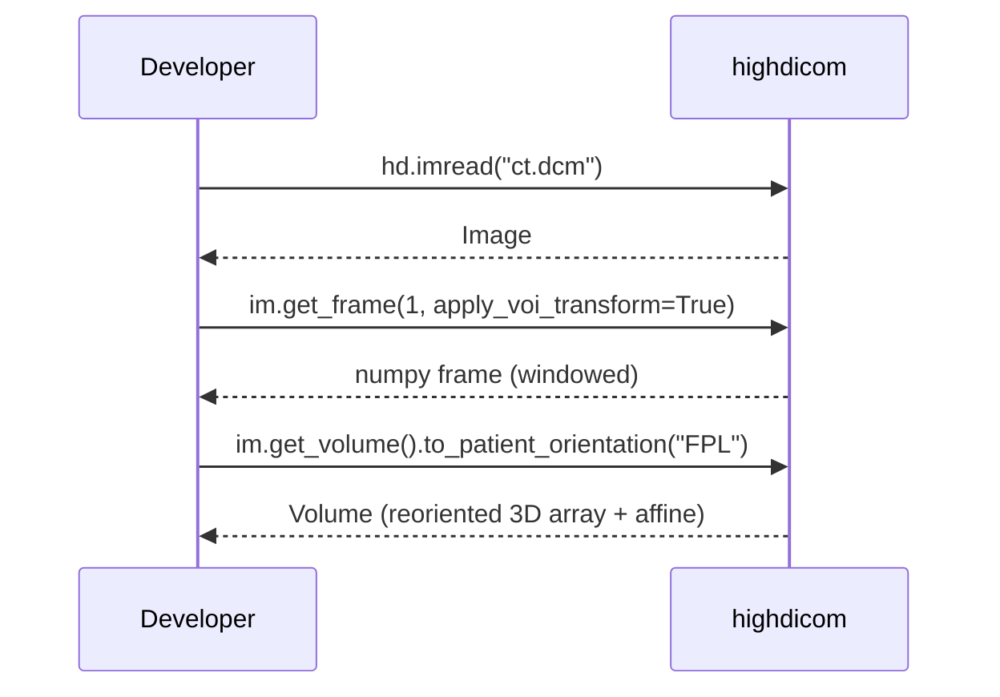
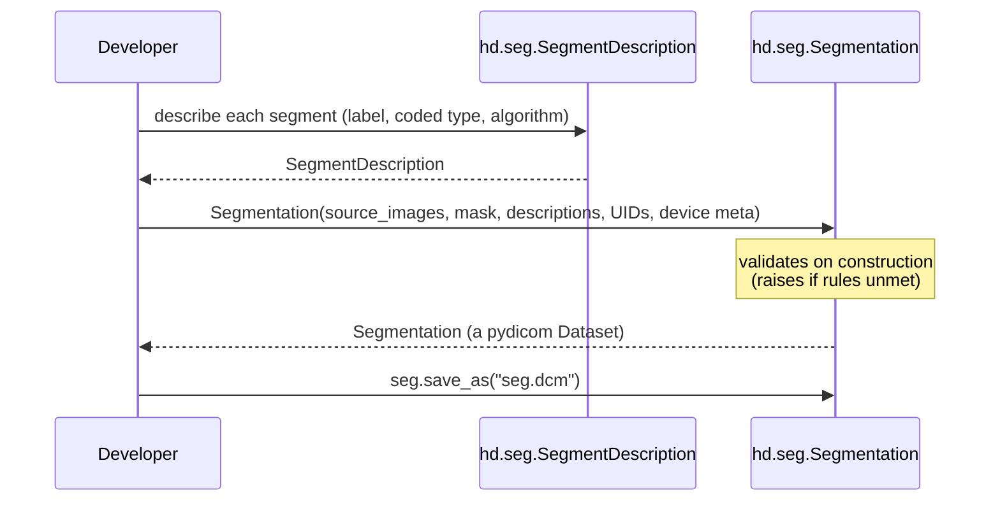
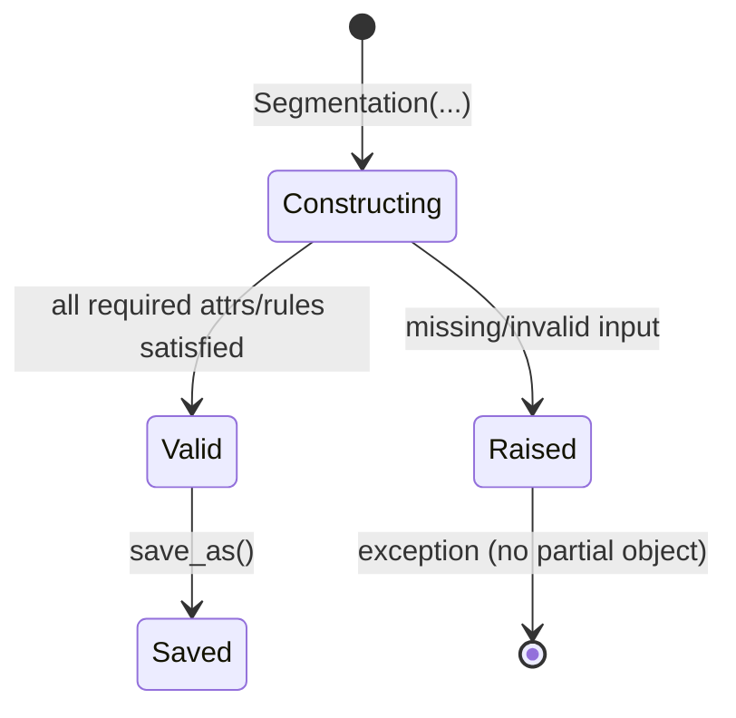

> Source: https://github.com/ImagingDataCommons/highdicom (v0.27.0) · Analyzed: 2026-06-14 · Surface: **Library / SDK**
> See also: [System & OOP Architecture](./highdicom-architecture.md)

## Cheat Sheet

The "user" here is a **developer who imports the library**. Idiomatic usage is
`import highdicom as hd`. The ~9 most-used touchpoints (all verified in `src/highdicom/`):

```python
import highdicom as hd
import numpy as np
from pydicom.sr.codedict import codes

# ── READ ────────────────────────────────────────────────
im   = hd.imread("ct.dcm")              # → hd.Image
frame = im.get_frame(1)                  # 1-based; rescale applied by default
frame = im.get_frame(1, apply_voi_transform=True)
vol  = im.get_volume()                   # → hd.Volume (3D + affine)

seg  = hd.seg.segread("seg.dcm")         # → Segmentation
sr   = hd.sr.srread("sr.dcm")            # → *SR document
ann  = hd.ann.annread("ann.dcm")         # → MicroscopyBulkSimpleAnnotations

# ── CREATE (then .save_as) ─────────────────────────────
seg = hd.seg.Segmentation(
    source_images=[im],
    pixel_array=mask,                    # numpy bool/int/float, or hd.Volume
    segmentation_type=hd.seg.SegmentationTypeValues.BINARY,
    segment_descriptions=[desc],
    series_instance_uid=hd.UID(),        # hd.UID() mints a fresh UID
    series_number=2, sop_instance_uid=hd.UID(), instance_number=1,
    manufacturer="Acme", manufacturer_model_name="Model",
    software_versions="v1", device_serial_number="XYZ",
)
seg.save_as("seg.dcm")                    # save_as comes from pydicom
```

| I want to… | Call |
|------------|------|
| Read any DICOM image | `hd.imread(path)` → `hd.Image` |
| Get one frame (with transforms) | `im.get_frame(n, apply_voi_transform=…)` |
| Build a 3D volume | `im.get_volume()` or `hd.get_volume_from_series([...])` |
| Read a derived object | `hd.seg.segread` · `hd.sr.srread` · `hd.ann.annread` |
| Wrap an existing pydicom dataset | `hd.Image.from_dataset(ds)` (every SOP class has it) |
| Mint a DICOM UID | `hd.UID()` |
| Create a segmentation | `hd.seg.Segmentation(...)` |
| Create a structured report | `hd.sr.EnhancedSR(...)` / `ComprehensiveSR` / `Comprehensive3DSR` |
| Create a parametric map | `hd.pm.ParametricMap(...)` |
| Create a presentation state | `hd.pr.GrayscaleSoftcopyPresentationState(...)` |

## 1. Overview

`highdicom` is imported, not run — there is no CLI. A developer uses it to **read** DICOM
images for analysis and to **encode results back** into standards-compliant DICOM derived
objects. The user persona is an ML / imaging researcher or engineer who knows numpy but
wants to avoid hand-assembling DICOM datasets.

**Surface type — Library/SDK (evidence):** public symbols are re-exported from
`src/highdicom/__init__.py` (`__all__`, 70+ names) and per-subpackage `__init__.py`; the
package ships `py.typed`; `pyproject.toml` declares no console scripts. "API" therefore
means **exported symbols and their call signatures (DX)**, not screens or endpoints.

The contact point is `import highdicom as hd` (the idiom used throughout the docs), then
either a top-level function (`hd.imread`), a submodule constructor (`hd.seg.Segmentation`),
or a submodule reader (`hd.seg.segread`).

## 2. Surface Map

The public surface is the top-level namespace plus eight IOD subpackages, each exposing a
**constructor class + a reader function + enums + content helpers**.

```mermaid
flowchart TD
    root["import highdicom as hd"]
    root --> top["Top level"]
    root --> subs["IOD subpackages"]

    top --> t1["imread() → Image"]
    top --> t2["get_volume_from_series() → Volume"]
    top --> t3["Image · Volume · VolumeGeometry · UID"]
    top --> t4["content: AlgorithmIdentificationSequence,<br/>PixelMeasuresSequence, *LUT*, Specimen*"]
    top --> t5["enums: CoordinateSystemNames,<br/>VOILUTFunctionValues, PatientSexValues, …"]

    subs --> seg["hd.seg → Segmentation · segread"]
    subs --> sr["hd.sr → EnhancedSR/ComprehensiveSR/3DSR · srread"]
    subs --> pm["hd.pm → ParametricMap"]
    subs --> pr["hd.pr → *SoftcopyPresentationState"]
    subs --> sc["hd.sc → SCImage"]
    subs --> ko["hd.ko → KeyObjectSelectionDocument"]
    subs --> ann["hd.ann → MicroscopyBulkSimpleAnnotations · annread"]
    subs --> legacy["hd.legacy → LegacyConvertedEnhanced{CT,MR,PET}Image"]
```



| Subpackage | Primary constructor class | Reader | DICOM object produced |
|-----------|---------------------------|--------|-----------------------|
| `hd` (top) | `Image` *(read-only, via factory)* | `imread` | any DICOM image |
| `hd.seg` | `Segmentation` | `segread` | Segmentation image |
| `hd.sr` | `EnhancedSR`, `ComprehensiveSR`, `Comprehensive3DSR` | `srread` | Structured Report |
| `hd.pm` | `ParametricMap` | — | Parametric Map |
| `hd.pr` | `GrayscaleSoftcopy…` / `Color…` / `PseudoColor…` / `AdvancedBlending…PresentationState` | — | Presentation State |
| `hd.sc` | `SCImage` | — | Secondary Capture |
| `hd.ko` | `KeyObjectSelectionDocument` | — | Key Object Selection |
| `hd.ann` | `MicroscopyBulkSimpleAnnotations` | `annread` | Microscopy annotations |
| `hd.legacy` | `LegacyConvertedEnhanced{CT,MR,PET}Image` | — | legacy→enhanced conversion |

Supporting top-level exports (from `__init__.py` `__all__`): `Volume`, `VolumeGeometry`,
`VolumeToVolumeTransformer`, `ChannelDescriptor`, `UID`, the `content.py` sequence classes
(`AlgorithmIdentificationSequence`, `PixelMeasuresSequence`, `PlaneOrientationSequence`,
`PlanePositionSequence`, `ModalityLUT*`, `VOILUT*`, `PaletteColorLUT*`, `Specimen*`,
`ReferencedImageSequence`, …), and a large family of enums (`CoordinateSystemNames`,
`VOILUTFunctionValues`, `RescaleTypeValues`, `PhotometricInterpretationValues`,
`PatientSexValues`, `AxisHandedness`, `PadModes`, …).

## 3. Entry & Onboarding

**Install:** `pip install highdicom` (add codecs with `pip install highdicom[libjpeg]`).

**Smallest read** (from `docs/quickstart.rst`):

```python
import highdicom as hd
im = hd.imread("data/test_files/dx_image.dcm")
first_frame = im.get_frame(1)                 # numpy array, rescale applied
```

**Smallest create** — derive and save a binary segmentation:

```python
import highdicom as hd
import numpy as np
from pydicom.sr.codedict import codes

im = hd.imread("ct.dcm")
mask = np.zeros((1, im.Rows, im.Columns), dtype=bool)
mask[0, 10:-10, 10:-10] = True

desc = hd.seg.SegmentDescription(
    segment_number=1,
    segment_label="first segment",
    segmented_property_category=codes.cid7150.Tissue,
    segmented_property_type=codes.cid7166.ConnectiveTissue,
    algorithm_type=hd.seg.SegmentAlgorithmTypeValues.AUTOMATIC,
    algorithm_identification=hd.AlgorithmIdentificationSequence(
        name="test", version="v1.0", family=codes.cid7162.ArtificialIntelligence
    ),
)
seg = hd.seg.Segmentation(
    source_images=[im], pixel_array=mask,
    segmentation_type=hd.seg.SegmentationTypeValues.BINARY,
    segment_descriptions=[desc],
    series_instance_uid=hd.UID(), series_number=2,
    sop_instance_uid=hd.UID(), instance_number=1,
    manufacturer="Manufacturer", manufacturer_model_name="Model",
    software_versions="v1", device_serial_number="Device XYZ",
)
seg.save_as("seg.dcm")
```

A new user typically follows `docs/quickstart.rst` → `docs/image.rst` (reading) → the
IOD-specific guide (`docs/seg.rst`, `docs/sr.rst`, …) for creating.

## 4. Key User Journeys

### 4.1 Read → analyze



### 4.2 Create → encode → save



## 5. Interaction & State

Because highdicom returns `pydicom.Dataset` subclasses, results behave like datasets and
support `.save_as(...)`. The interaction contract:



- **Valid on construction.** Required parameters and DICOM rules are enforced in the
  constructor; an invalid call raises (e.g. `TypeError`/`ValueError`/`RuntimeError`) rather
  than producing a half-built object.
- **Tolerant decoding.** Readers (`imread`/`segread`/…) accept minor real-world deviations;
  they validate assumptions rather than silently working around non-compliant files.
- **Direct `Image()` is blocked.** `hd.Image(...)` raises `RuntimeError` — use `imread()` or
  `Image.from_dataset()`. This makes the failure mode explicit and immediate.
- **Lazy retrieval.** `imread(path, lazy_frame_retrieval=True)` defers frame loading for
  large multi-frame objects; frames are fetched on access.
- **Return types are concrete.** `imread → Image`, `segread → Segmentation`,
  `get_volume → Volume`, `get_frame → numpy.ndarray`.

## 6. Information Architecture / API Ergonomics

The surface is deliberately **uniform across IODs**, which is its main DX strength:

- **Common metadata block.** Every derived constructor takes the same identity block:
  `series_instance_uid`, `series_number`, `sop_instance_uid`, `instance_number`, plus device
  provenance `manufacturer` / `manufacturer_model_name` / `software_versions` /
  `device_serial_number`. Learn it once, reuse everywhere.
- **`*read` / `from_dataset` symmetry.** Each readable family offers a top-level function
  (`segread`, `srread`, `annread`, `imread`) *and* a `from_dataset(ds, copy=True)`
  classmethod inherited from the base — pick file-based or dataset-based entry.
- **Enum-or-string flexibility.** Parameters typed as enums (e.g.
  `SegmentationTypeValues.BINARY`) also accept the equivalent string, lowering friction.
- **Naming conventions.** Constructor classes are PascalCase DICOM names
  (`GrayscaleSoftcopyPresentationState`); readers are lowercase `{prefix}read`; enums end in
  `Values`; sequence helpers end in `Sequence`. Submodule names are the DICOM abbreviations
  (`seg`, `sr`, `pm`, `pr`, `sc`, `ko`, `ann`).
- **Coded concepts.** Clinical terms are passed as coded concepts sourced from pydicom's
  `codes` dictionary (`codes.cid7150.Tissue`, …), keeping the surface standards-anchored.

## 7. Configuration & Customization

| What you can tune | How |
|-------------------|-----|
| Pixel transforms on read | `get_frame`/`get_volume` flags: `apply_voi_transform`, `apply_modality_transform`, `apply_real_world_transform`, `apply_presentation_lut`, `apply_palette_color_lut`, `apply_icc_profile`, `voi_output_range`, `dtype`. |
| Output VOI range / dtype | `voi_output_range=(0.0, 1.0)`, `dtype=np.float64`. |
| Volume orientation / shape | `Volume.to_patient_orientation("FPL")`, `crop_to_spatial_shape((2,224,224))`. |
| Memory vs speed | `imread(..., lazy_frame_retrieval=True)`. |
| Transfer syntax (encoding) | `transfer_syntax_uid=...` on derived-object constructors. |
| Segmentation encoding | `segmentation_type` (BINARY/FRACTIONAL), `fractional_type`, `max_fractional_value`. |
| Terminology | coded concepts via pydicom `codes` (SNOMED-CT, DCM, UCUM). |
| Optional codecs | install extra `highdicom[libjpeg]` for `pylibjpeg*`. |

## 8. Open Questions & Notes

- Exact constructor parameter lists vary per IOD and are large; this doc lists the **common
  block** plus the most-used domain parameters rather than every keyword — see
  `docs/seg.rst`, `docs/sr.rst`, etc., and the docstrings for the full set.
- The precise exception *type* raised on invalid construction differs by check (validators
  raise `ValueError`/`TypeError`; `Image()` raises `RuntimeError`); §5 generalizes this as
  "raises on invalid input."
- The SR content-tree builders (`MeasurementReport`, `Measurement`, `ObserverContext`,
  content-item classes in `hd.sr`) form a substantial sub-API; here they appear only via the
  `EnhancedSR(...)` entry point — the full template/content-item catalog is its own topic
  (`docs/sr.rst`, `docs/tid1500.rst`).
- The transform flags in §7 are read from the `get_volume`/`get_frame` signatures in
  `image.py`; their interaction order is documented in `docs/pixel_transforms.rst` and not
  re-derived here.
