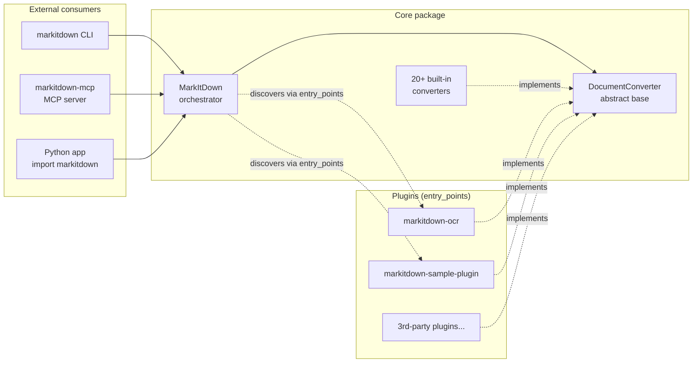
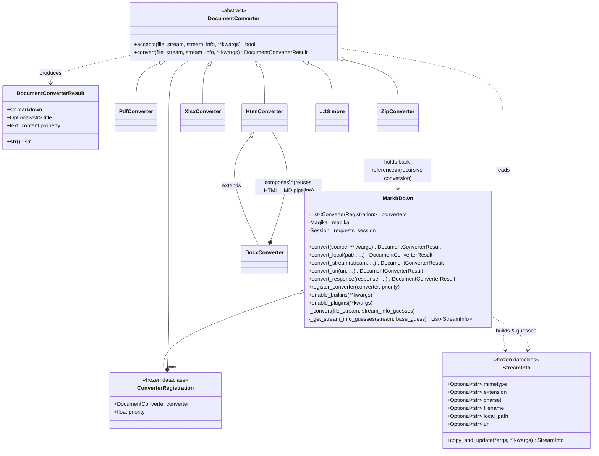
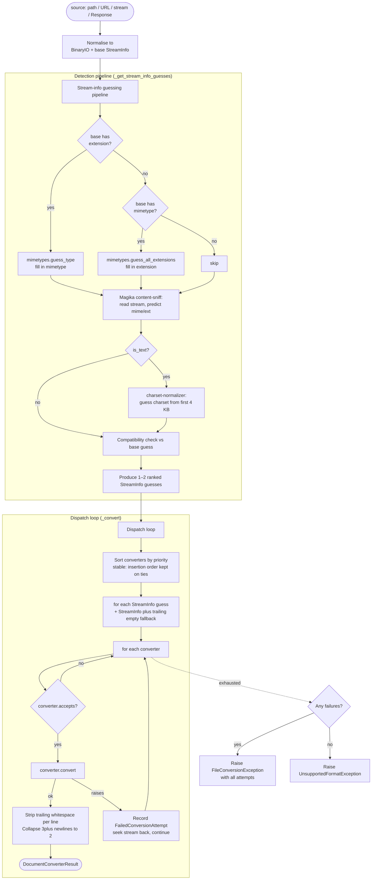
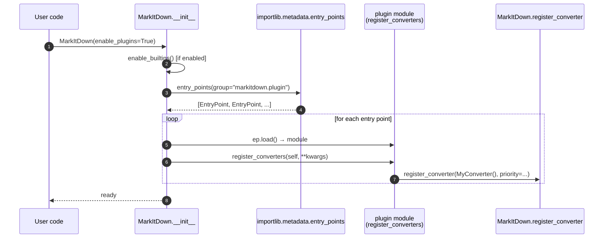
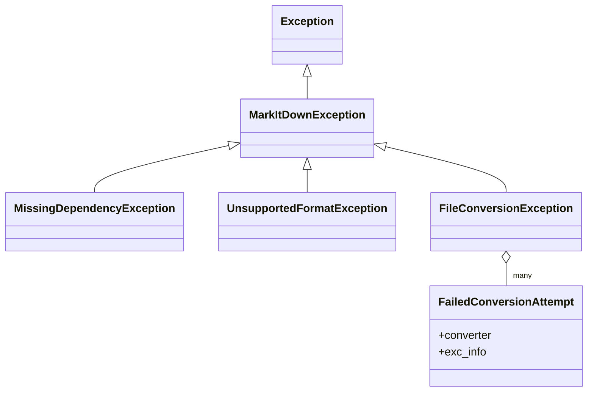

> A reading guide to the codebase: what lives where, why it's structured that
> way, and which OOP patterns hold it together.
>
> Repository: `microsoft/markitdown` (Python 3.10+, MIT)

---

## 1. Bird's-eye view

MarkItDown is a small utility whose job is one sentence:

> **"Take some input (path, URL, stream, HTTP response) and return Markdown."**

The interesting part is *how* it stays small while supporting ~20 file formats,
external services (Azure Document Intelligence, LLM vision), nested archives,
and third-party plugins. The answer is a deliberately tiny core (one abstract
class, one orchestrator, one value object) with **everything else plugged in
as a Strategy**.

### 1.1 The repo is a monorepo of four packages

```
packages/
├── markitdown/                 # The library + CLI (the "core")
├── markitdown-mcp/             # MCP server wrapper (exposes core as MCP tool)
├── markitdown-ocr/             # Optional plugin: LLM-vision OCR
└── markitdown-sample-plugin/   # Reference plugin: how to write your own
```

Each package has its own `pyproject.toml` and is independently
installable. The three satellites all depend on `markitdown` and demonstrate
three distinct *integration shapes*:

| Package | Integration shape | Purpose |
|---|---|---|
| `markitdown-mcp` | **Service wrapper** — wraps `MarkItDown()` in an MCP/FastMCP server | Exposes `convert_to_markdown(uri)` over STDIO / HTTP / SSE |
| `markitdown-ocr` | **Plugin** (via entry points) — registers OCR-enhanced converters at priority `-1.0` | Adds LLM-vision OCR for PDF/DOCX/PPTX/XLSX |
| `markitdown-sample-plugin` | **Plugin** (RTF support) | Canonical "how to write a plugin" example |



---

## 2. The core package — file & module map

```
packages/markitdown/src/markitdown/
├── __init__.py                 # Public API surface
├── __main__.py                 # CLI entry point  (markitdown <file>)
├── __about__.py                # __version__
│
├── _markitdown.py              # MarkItDown class — orchestrator + registry
├── _base_converter.py          # DocumentConverter ABC + DocumentConverterResult
├── _stream_info.py             # StreamInfo — immutable value object (frozen dataclass)
├── _exceptions.py              # Exception hierarchy
├── _uri_utils.py               # file:/data: URI parsing helpers
│
├── converters/                 # One file per format → one class per converter
│   ├── __init__.py             # Re-exports every converter
│   ├── _plain_text_converter.py
│   ├── _html_converter.py
│   ├── _markdownify.py         # _CustomMarkdownify — HTML→MD helper
│   ├── _pdf_converter.py
│   ├── _docx_converter.py
│   ├── _xlsx_converter.py
│   ├── _pptx_converter.py
│   ├── _image_converter.py
│   ├── _audio_converter.py
│   ├── _zip_converter.py
│   ├── _epub_converter.py
│   ├── _csv_converter.py
│   ├── _ipynb_converter.py
│   ├── _outlook_msg_converter.py
│   ├── _rss_converter.py
│   ├── _wikipedia_converter.py
│   ├── _youtube_converter.py
│   ├── _bing_serp_converter.py
│   ├── _doc_intel_converter.py     # Azure Document Intelligence
│   ├── _llm_caption.py             # Helper: LLM image captioning
│   ├── _transcribe_audio.py        # Helper: speech-to-text
│   └── _exiftool.py                # Helper: shell out to exiftool
│
└── converter_utils/            # Shared helpers used by multiple converters
    └── docx/
        ├── pre_process.py      # Pre-clean DOCX zip before mammoth converts it
        └── math/               # OMML (Office math) → LaTeX converter
            ├── omml.py
            └── latex_dict.py
```

### Naming conventions worth noting

- **Leading underscore in module names** (`_markitdown.py`, `_base_converter.py`)
  → "this module is an implementation detail; import from the package, not the
  module." The public surface is `markitdown.__init__` re-exports only.
- **One converter per file** in `converters/`, each exporting one class.
- **`converter_utils/`** is the place for cross-converter helpers that don't
  themselves implement `DocumentConverter` (e.g., the OMML→LaTeX math
  translator used by `DocxConverter`).

---

## 3. The OOP design — three classes do most of the work

The whole architecture orbits around just three types:

| Class | Role | Location |
|---|---|---|
| `DocumentConverter` | **Strategy** (abstract) — defines `accepts()` + `convert()` | `_base_converter.py` |
| `DocumentConverterResult` | **Value object** — `markdown` + optional `title` | `_base_converter.py` |
| `StreamInfo` | **Value object** (frozen dataclass) — mime/extension/charset/url/etc. | `_stream_info.py` |
| `MarkItDown` | **Orchestrator** — registry + dispatch + I/O adaptation | `_markitdown.py` |



### 3.1 `DocumentConverter` — Strategy + Template Method

The base class is intentionally tiny — about 40 lines of real code. Two
methods, both abstract in practice:

```python
class DocumentConverter:
    def accepts(self, file_stream, stream_info, **kwargs) -> bool: ...
    def convert(self, file_stream, stream_info, **kwargs) -> DocumentConverterResult: ...
```

A few subtleties baked into the contract (`_base_converter.py:42-105`):

1. **`accepts()` is a cheap classifier**, `convert()` does the real work. They
   take the **same signature** on purpose: if `accepts()` returns `True`, the
   orchestrator hands the exact same args straight to `convert()`.
2. **Stream-position invariant.** `accepts()` *must* leave `file_stream` at
   the position it found it. If a converter peeks ahead (e.g.,
   `OutlookMsgConverter` reads OLE headers to decide), it must `tell()` /
   `seek()` back. The orchestrator asserts this with `assert cur_pos == file_stream.tell()`.
3. **Dependencies are optional.** Each converter does a top-level `try: import
   ...` and stashes the exception in `_dependency_exc_info`. If the dep is
   missing, `convert()` raises `MissingDependencyException`, which the
   orchestrator treats as a non-fatal "skip and try the next converter."

### 3.2 `StreamInfo` — immutable, append-only metadata

```python
@dataclass(kw_only=True, frozen=True)
class StreamInfo:
    mimetype: Optional[str] = None
    extension: Optional[str] = None
    charset: Optional[str] = None
    filename: Optional[str] = None
    local_path: Optional[str] = None
    url: Optional[str] = None

    def copy_and_update(self, *args, **kwargs) -> "StreamInfo": ...
```

This is a classic **immutable value object**. Notable choices:

- `frozen=True` — once built, it can't be mutated; every refinement returns a
  new instance via `copy_and_update`. Safe to share across threads and to use
  as a dict key if you ever needed to.
- `kw_only=True` — all fields are optional; keyword args prevent accidental
  positional misuse.
- The `copy_and_update` method merges other `StreamInfo` instances **and** raw
  kwargs in one call, ignoring `None` values from sources — making it easy to
  layer guesses (HTTP headers + extension + magika sniff) without overwriting
  good data with `None`.

### 3.3 `MarkItDown` — orchestrator, registry, and I/O adapter

`MarkItDown` plays three roles, which is worth noticing because separating
them could be a future refactor:

| Role | Methods | What it does |
|---|---|---|
| **Registry** | `register_converter`, `enable_builtins`, `enable_plugins` | Builds an ordered list of `ConverterRegistration(converter, priority)` |
| **I/O adapter** | `convert`, `convert_local`, `convert_stream`, `convert_uri`, `convert_response` | Normalises every input shape (str path, `Path`, URL, data URI, file URI, `requests.Response`, `BinaryIO`) into a `(BinaryIO, [StreamInfo])` pair |
| **Dispatcher** | `_convert`, `_get_stream_info_guesses` | Sniffs the stream, ranks converters by priority, walks the chain, normalises whitespace, raises the right exception |

The `convert()` method (`_markitdown.py:252-300`) is a textbook
**type-dispatch facade**:

```python
def convert(self, source, *, stream_info=None, **kwargs):
    if isinstance(source, str):
        if source.startswith(("http:", "https:", "file:", "data:")):
            return self.convert_uri(source, ...)
        return self.convert_local(source, ...)
    elif isinstance(source, Path):
        return self.convert_local(source, ...)
    elif isinstance(source, requests.Response):
        return self.convert_response(source, ...)
    elif hasattr(source, "read") and not isinstance(source, io.TextIOBase):
        return self.convert_stream(source, ...)
    else:
        raise TypeError(...)
```

Each public `convert_*` method's job is to **build the best `StreamInfo`
seed** for that input shape (e.g., `convert_response` mines the
`Content-Type`, `Content-Disposition`, and URL path) and then delegate to the
private `_convert(file_stream, stream_info_guesses)`.

---

## 4. The conversion pipeline (the big picture)

Two pipelines run back-to-back inside `_convert`:



A few design points hide in this diagram:

- **Two nested loops, *guess-major*.** The outer loop iterates over candidate
  `StreamInfo`s; the inner loop iterates over converters. So a more-likely
  guess gets every converter a chance to accept it before falling back to the
  next guess. The final iteration uses an empty `StreamInfo()` as a
  last-resort fallback.
- **Stable sort by priority** (`_markitdown.py:549`). Sort is per-call, so
  registrations are mutable across `convert()` calls without re-sorting global
  state. Tie-breaking preserves insertion order — important because
  `register_converter` *prepends* to the list, meaning later registrations win
  at the same priority. Plugins can therefore "shadow" built-ins simply by
  registering after them.
- **Stream rewind on every attempt.** Both `accepts()` and `convert()` are
  guarded with `file_stream.seek(cur_pos)` in `finally:` blocks. Converters
  can read freely without coordinating with each other.
- **Post-processing is centralised** — every successful result has line-
  trailing whitespace stripped and runs of `\n` collapsed to at most two.

---

## 5. Priority and the registration model

```python
PRIORITY_SPECIFIC_FILE_FORMAT = 0.0   # default — try first
PRIORITY_GENERIC_FILE_FORMAT  = 10.0  # PlainText, HTML, Zip — try last
```

Lower priority numbers run first. The registration order in `enable_builtins()`
(`_markitdown.py:181-204`) is carefully arranged:


This gives three useful "slots":

| Priority | Use |
|---|---|
| `< 0.0` | "Shadow" / replace built-ins (e.g. `markitdown-ocr` uses `-1.0`) |
| `0.0` (default) | Specific formats — PDF, DOCX, XLSX, RSS, etc. |
| `10.0` | Generic catch-alls — anything text, anything HTML, anything zip |

---

## 6. The plugin system

Plugins are discovered via Python's standard
`importlib.metadata.entry_points(group="markitdown.plugin")`. No custom
registry, no config file — just declare an entry point in your plugin's
`pyproject.toml`:

```toml
# packages/markitdown-sample-plugin/pyproject.toml
[project.entry-points."markitdown.plugin"]
sample_plugin = "markitdown_sample_plugin"
```

Then expose `register_converters(markitdown, **kwargs)` at the module's top
level. That's the entire plugin interface:



`_load_plugins()` is **lazy and idempotent** (module-level
`_plugins: Union[None, List[Any]] = None`) and **fault-tolerant** — a plugin
that fails to load is logged via `warnings.warn` and skipped, so a broken
third-party package never crashes the host application
(`_markitdown.py:65-82`, `232-250`).

### How the OCR plugin "replaces" built-ins

Look at `packages/markitdown-ocr/src/markitdown_ocr/_plugin.py:52-67`:

```python
PRIORITY_OCR_ENHANCED = -1.0   # before built-ins at 0.0

markitdown.register_converter(
    PdfConverterWithOCR(ocr_service=ocr_service),
    priority=PRIORITY_OCR_ENHANCED,
)
# ... same for Docx, Pptx, Xlsx
```

No need to *unregister* anything. The built-in `PdfConverter` is still there,
but `PdfConverterWithOCR` runs first; if it accepts the file (it always does,
for `.pdf`), the built-in is never consulted. If it raises (e.g., missing
deps), the dispatcher falls through to the built-in.

This is a clean way to do **override-by-priority** without ever touching the
base library's registration list — a property of the Chain-of-Responsibility
pattern that the codebase leans on intentionally.

---

## 7. Patterns used (and where to find them)

| Pattern | Where | Why it's used |
|---|---|---|
| **Strategy** | `DocumentConverter` + 20+ subclasses | Each format is interchangeable behind a uniform interface |
| **Chain of Responsibility** | `MarkItDown._convert` loop over priority-sorted converters | First converter that `accepts()` handles the input |
| **Template Method (light)** | `accepts()`/`convert()` pair on `DocumentConverter` | Forces a uniform two-phase protocol on subclasses |
| **Registry** | `MarkItDown._converters: List[ConverterRegistration]` | Decouples *what can convert* from *who calls it* |
| **Facade** | `MarkItDown.convert(source, ...)` | Single entry point hides four input shapes and a multi-stage pipeline |
| **Adapter** | `convert_local`, `convert_stream`, `convert_uri`, `convert_response` | Normalises heterogeneous inputs to a single internal call shape |
| **Value Object** | `StreamInfo` (frozen), `DocumentConverterResult` | Immutable, passed by value, no identity semantics |
| **Builder-ish** | `StreamInfo.copy_and_update(*args, **kwargs)` | Layer multiple guess sources without mutating |
| **Composition over inheritance** | `DocxConverter` *has-a* `HtmlConverter`; `ZipConverter` *has-a* back-reference to `MarkItDown` | Reuse without coupling class hierarchies |
| **Plugin / Open–Closed** | `entry_points("markitdown.plugin")` | New formats added without modifying core |
| **Lazy initialisation** | `_load_plugins()` module-level cache; per-converter `_dependency_exc_info` | Don't pay for optional deps until needed |
| **Null Object–ish fallback** | Trailing empty `StreamInfo()` in the guess list | Guarantees the loop tries at least once with no constraints |

### 7.1 Two illustrative compositions

**`DocxConverter` extends `HtmlConverter`** (`converters/_docx_converter.py:31`)
*and* holds a fresh `HtmlConverter` instance:

```python
class DocxConverter(HtmlConverter):
    def __init__(self):
        super().__init__()
        self._html_converter = HtmlConverter()

    def convert(self, file_stream, stream_info, **kwargs):
        pre_process_stream = pre_process_docx(file_stream)
        return self._html_converter.convert_string(
            mammoth.convert_to_html(pre_process_stream, ...).value,
            **kwargs,
        )
```

It inherits to get `accepts()` shape and result type, but **composes** to do
the work. The pre-processing pipeline:

```
DOCX (zip) ─► pre_process_docx ─► OMML math → LaTeX ─► mammoth ─► HTML
                                                                    │
                                                                    ▼
                                              HtmlConverter.convert_string
                                                                    │
                                                                    ▼
                                                                Markdown
```

**`ZipConverter` holds a back-reference to its owning `MarkItDown`**
(`converters/_zip_converter.py:61-67`):

```python
class ZipConverter(DocumentConverter):
    def __init__(self, *, markitdown: "MarkItDown"):
        super().__init__()
        self._markitdown = markitdown

    def convert(self, file_stream, stream_info, **kwargs):
        # For each entry in the zip, recurse through the same registry
        result = self._markitdown.convert_stream(z_file_stream, stream_info=...)
```

Compare with how it's wired in `_markitdown.py:184-186`:

```python
self.register_converter(
    ZipConverter(markitdown=self), priority=PRIORITY_GENERIC_FILE_FORMAT
)
```

This is intentional **recursion through the registry**: zip entries are
converted via the *same* dispatcher, so nested zips, plugin converters, OCR
shadowing, etc. all "just work" inside an archive. The `TYPE_CHECKING` import
breaks the circular type dependency for static analysis.

---

## 8. Exception hierarchy



Semantics (`_exceptions.py`):

- **`MissingDependencyException`** — converter recognised the file but its
  optional dep is missing. Treated by the dispatcher as a *skip* signal, not a
  fatal error.
- **`UnsupportedFormatException`** — *no* converter even attempted the
  conversion. Means MarkItDown genuinely can't help.
- **`FileConversionException`** — one or more converters accepted but all
  failed. Carries a list of `FailedConversionAttempt(converter, exc_info)` so
  the caller (or the CLI) can build a multi-cause error message.

This three-way split is what lets the dispatcher silently fall through layers
(missing deps, accept-but-fail) without losing diagnostic information when
*everything* fails.

---

## 9. Built-in converter catalog (cheat sheet)

| Converter | Extensions | Underlying lib(s) |
|---|---|---|
| `PlainTextConverter` | `.txt`, anything `text/*` | stdlib |
| `HtmlConverter` | `.html`, `.htm` | `beautifulsoup4` + `markdownify` (via `_CustomMarkdownify`) |
| `RssConverter` | `.rss`, `.xml` | feed-aware HTML parse |
| `WikipediaConverter` | `*.wikipedia.org/...` URLs | URL-pattern-aware |
| `YouTubeConverter` | YouTube URLs | `youtube-transcript-api` |
| `BingSerpConverter` | Bing SERP URLs | URL-pattern-aware |
| `IpynbConverter` | `.ipynb` | stdlib JSON |
| `PdfConverter` | `.pdf` | `pdfplumber` (forms/tables) + `pdfminer.six` (prose fallback) |
| `DocxConverter` | `.docx` | `mammoth` → HTML → `HtmlConverter`; OMML→LaTeX |
| `XlsxConverter` / `XlsConverter` | `.xlsx`, `.xls` | `openpyxl`/`xlrd` + `pandas` |
| `PptxConverter` | `.pptx` | `python-pptx` |
| `ImageConverter` | image/* | `exiftool` (metadata) + optional LLM caption |
| `AudioConverter` | audio/* | `pydub` + `SpeechRecognition` |
| `OutlookMsgConverter` | `.msg` | `olefile` (peeks stream to detect) |
| `ZipConverter` | `.zip` | recurses into `MarkItDown` |
| `EpubConverter` | `.epub` | zip + HTML |
| `CsvConverter` | `.csv` | stdlib `csv` |
| `DocumentIntelligenceConverter` | many (opt-in) | Azure AI Document Intelligence |

The `_llm_caption.py`, `_transcribe_audio.py`, `_exiftool.py`, `_markdownify.py`
files are **helpers** consumed by converters above; they don't subclass
`DocumentConverter`.

---

## 10. Public API surface

From `markitdown/__init__.py` — this is everything the library promises:

```python
from markitdown import (
    MarkItDown,                       # the orchestrator
    DocumentConverter,                # base class for plugins
    DocumentConverterResult,          # what convert() returns
    StreamInfo,                       # metadata value object
    PRIORITY_SPECIFIC_FILE_FORMAT,    # 0.0
    PRIORITY_GENERIC_FILE_FORMAT,     # 10.0
    # exceptions
    MarkItDownException,
    MissingDependencyException,
    FailedConversionAttempt,
    FileConversionException,
    UnsupportedFormatException,
)
```

Notice how **small** this surface is. The dozens of converter classes live in
`markitdown.converters.*` but are not re-exported at the top level — they're
*implementation details* that the orchestrator wires up. A plugin author only
ever needs the symbols above.

---

## 11. Design takeaways

A few principles you can lift from this codebase:

1. **Keep the abstract base small.** `DocumentConverter` is two methods.
   Anything more would force every plugin to think about features it doesn't
   care about. Cross-cutting concerns (normalisation, sniffing, retry) live in
   the orchestrator, not the strategy.
2. **Make detection a separate concern.** `StreamInfo` + the magika sniffing
   pipeline mean converters don't each re-implement "is this really a PDF?".
   The orchestrator hands them a vetted guess, and they decide via
   `accepts()`.
3. **Priorities + stable sort give you free extensibility.** Plugins shadow
   built-ins simply by registering at a lower number. No mutation, no
   "uninstall converter" API needed.
4. **Treat optional dependencies as soft failures.** Per-converter
   `_dependency_exc_info` plus `MissingDependencyException` means a `pip
   install markitdown` (without extras) is still useful, and adding `[pdf]`
   "lights up" the PDF converter with zero core changes.
5. **Recurse through your own registry.** `ZipConverter` holding a reference
   to `MarkItDown` is the secret to handling arbitrarily nested formats — and
   to making plugins/OCR "just work" inside archives.
6. **Immutability for metadata, mutability where it earns its keep.**
   `StreamInfo` is frozen; the converter registry is a plain list. Each choice
   is appropriate to how the data is used.

---

## Appendix — Where to start reading

If you want to understand the codebase top-down, this is the order I'd read:

1. `markitdown/__init__.py` — what's public
2. `_base_converter.py` — the contract every converter satisfies
3. `_stream_info.py` — the metadata vocabulary
4. `_markitdown.py` — the orchestrator (start at `convert()`, follow into
   `_convert()` and `_get_stream_info_guesses()`)
5. `converters/_html_converter.py` — the simplest non-trivial converter
6. `converters/_zip_converter.py` — the recursive case
7. `converters/_pdf_converter.py` — the most complex converter
8. `markitdown-sample-plugin/src/markitdown_sample_plugin/_plugin.py` — the
   plugin contract by example
9. `markitdown-ocr/src/markitdown_ocr/_plugin.py` — how plugins shadow
   built-ins
