> Source: https://github.com/Project-MONAI/MONAI (local clone, branch `dev`) · Analyzed: 2026-05-23 · Type: **Library (Python framework)** with a small embedded CLI

## 1. Overview

**MONAI** (Medical Open Network for AI) is a PyTorch-based, open-source framework for deep learning in healthcare imaging. It provides domain-specific building blocks — image I/O, transforms, datasets, networks, losses, metrics, inferers, training/evaluation loops, and bundle-based reproducible workflows — that researchers and engineers compose into medical imaging AI pipelines (e.g. 3D CT/MRI segmentation, registration, classification, generative imaging, pathology, detection, federated learning).

**Repo classification — Library:**
- `setup.py` + `pyproject.toml` define a distributable package (`monai`, published on PyPI / conda-forge).
- The package has a clean public surface re-exported through `monai/__init__.py` (`apps`, `bundle`, `data`, `engines`, `handlers`, `inferers`, `losses`, `metrics`, `networks`, `transforms`, ...).
- No app entry point (`main`, server bootstrap, etc.); the only runnable module is `monai/bundle/__main__.py`, a small `fire`-based CLI that exposes bundle utilities (`download`, `run`, `ckpt_export`, `verify_metadata`, ...). This makes the repo a **hybrid** in the strict sense, but the bundle CLI is auxiliary — MONAI is consumed primarily as a Python library.
- Distributes optional native code: `monai/csrc/` (C++/CUDA extensions, gated by `BUILD_MONAI=1` in `setup.py`).

**Tech stack:**
- **Language:** Python (≥ 3.9; `target-version = "py310"` in `pyproject.toml`).
- **Core runtime deps** (`requirements.txt`): `torch >= 2.8.0`, `numpy >= 1.24, < 3.0`.
- **Heavy optional deps** (resolved via `monai.utils.module.optional_import`): `pytorch-ignite` (training loop infra), `nibabel`, `pydicom`, `itk`, `scikit-image`, `pandas`, `tqdm`, `mlflow`, `clearml`, `tensorboard`, `cupy`, `lmdb`, `tritonclient`, `onnx`, `transformers`, ...
- **Native extensions:** C++/CUDA in `monai/csrc/` (filtering, resampling, GMM, LLTM) compiled via `torch.utils.cpp_extension`.
- **Tooling:** `ruff`, `black`, `pytype`/`mypy`, `pre-commit`, `versioneer`.

## 2. System Context

MONAI sits between PyTorch and a user's medical-imaging AI workflow. It is imported by user code, model bundles, or downstream tools (MONAI Label, MONAI Deploy, MONAI Model Zoo).

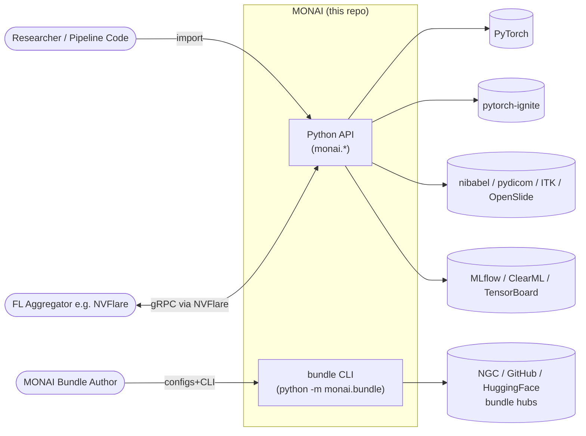

## 3. High-Level Structure

Top-level subpackages inside `monai/` and what each owns. Read this table together with the diagram below.

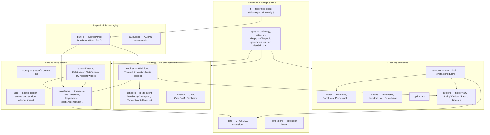

| Path | Responsibility |
|------|----------------|
| `monai/__init__.py` | Auto-loads submodules via `utils.module.load_submodules` and exposes the public namespace. |
| `monai/config/` | Type definitions (`NdarrayOrTensor`, `PathLike`, `KeysCollection`), device/feature probing (`deviceconfig.py`). |
| `monai/utils/` | Cross-cutting infra: `module.py` (`optional_import`, `load_submodules`), `enums.py`, `deprecate_utils.py`, `component_store.py`, `misc.py`, `type_conversion.py`. |
| `monai/data/` | `Dataset` family, `DataLoader`, `MetaTensor`/`MetaObj`, image/wsi readers & writers, samplers, decollate, synthetic data. |
| `monai/transforms/` | All preprocessing/augmentation. Array form (`array.py`), dict form (`dictionary.py`), plus `functional.py` in subpackages. Grouped by concern: `spatial/`, `intensity/`, `croppad/`, `io/`, `post/`, `lazy/`, `meta_utility/`, `signal/`, `smooth_field/`, `regularization/`, `utility/`. |
| `monai/networks/` | `nets/` (UNet, DynUNet, SegResNet, SwinUNETR, DiffusionModelUNet, ControlNet, ...), `blocks/`, `layers/` (including `factories.py`), `schedulers/`, `trt_compiler.py`. |
| `monai/losses/` | `DiceLoss`, `DiceCELoss`, `FocalLoss`, `PerceptualLoss`, `SSIMLoss`, `HausdorffDTLoss`, registration/box losses, etc. |
| `monai/metrics/` | `Metric` ABC + `IterationMetric`/`Cumulative*`, `DiceMetric`, `HausdorffDistanceMetric`, `MeanIoU`, `FIDMetric`, `PanopticQualityMetric`. |
| `monai/inferers/` | `Inferer` ABC plus `SimpleInferer`, `SlidingWindowInferer`, `PatchInferer` (with `Splitter` + `Merger`), `DiffusionInferer`. |
| `monai/engines/` | `Workflow` (subclasses Ignite `Engine`), `Trainer`/`SupervisedTrainer`/`GanTrainer`/`AdversarialTrainer`, `Evaluator`/`SupervisedEvaluator`/`EnsembleEvaluator`. |
| `monai/handlers/` | Ignite event-handler implementations (checkpoint, TB/MLflow/ClearML, LR schedule, early-stop, metric loggers, postprocessing, NVTX, TRT). |
| `monai/visualize/` | Saliency tooling: `CAM`, `GradCAM`, `GradCAMpp`, `OcclusionSensitivity`, `img2tensorboard`. |
| `monai/optimizers/` | Custom optimizer/LR-finder utilities. |
| `monai/bundle/` | "Bundle" = config-driven reproducible workflow. `config_parser.py`, `config_item.py`, `reference_resolver.py`, `workflows.py`, `properties.py`, `scripts.py`, `__main__.py` (fire CLI). |
| `monai/auto3dseg/` | AutoML for 3D segmentation: data analyzers, algorithm generators. |
| `monai/apps/` | Domain verticals: `pathology/`, `detection/`, `deepgrow/`, `deepedit/`, `nuclick/`, `generation/`, `reconstruction/`, `nnunet/`, `vista3d/`, `auto3dseg/`, `tcia/`, `mmars/`. Each layers on top of core primitives. |
| `monai/fl/` | Federated learning: `client/client_algo.py` (`BaseClient`, `ClientAlgo`, `ClientAlgoStats` abstract), `client/monai_algo.py` (`MonaiAlgo`). |
| `monai/csrc/` | C++/CUDA extensions: `filtering/`, `resample/`, `lltm/`, `utils/`, `ext.cpp`. |
| `monai/_extensions/` | Python-side loader for `csrc` (`loader.py`) and the GMM extension. |

## 4. Components — inside `monai.transforms` and `monai.engines`

These two subpackages carry the bulk of MONAI's architectural intent. The rest of the package follows similar patterns.

### 4.1 `monai.transforms` — composable, invertible, optionally-lazy ops

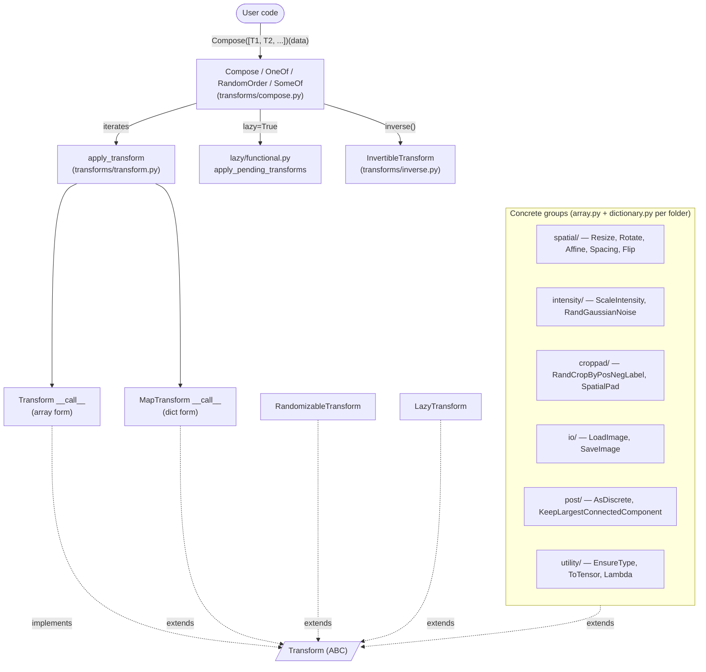

Key contract (`monai/transforms/transform.py`):

- `Transform(ABC)` — single `__call__(data)`; declares a `backend: list[TransformBackends]` class attribute so callers know whether the op runs on `torch`, `numpy`, or both.
- `Randomizable` — mixin holding `self.R: np.random.RandomState`; subclasses must implement `randomize()`.
- `RandomizableTransform(Randomizable, Transform)` — adds the probabilistic gate `_do_transform = R.rand() < prob`.
- `LazyTransform(Transform, LazyTrait)` — defers spatial ops so `Compose` can fuse adjacent affine/resampling ops into one resample.
- `MapTransform(Transform)` — dict-key-aware variant; the `*d` (dictionary) twin of every array transform inherits from this.

Composition (`monai/transforms/compose.py`):

- `Compose` chains transforms and provides `inverse()` (test-time augmentation, post-processing), lazy-execution scheduling, multi-item mapping, deterministic re-seeding, and error-stat tracking.
- `OneOf`, `RandomOrder`, `SomeOf` are policy variants of `Compose`.

### 4.2 `monai.engines` + `monai.handlers` — Ignite-based training loop

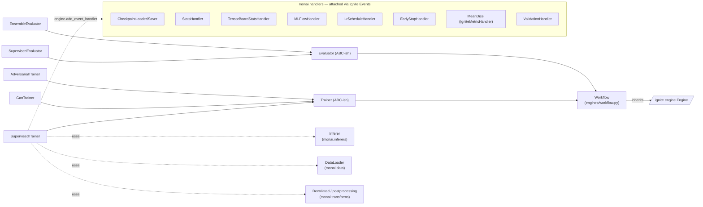

- `Workflow` *is* an Ignite `Engine`, so the entire engine model — `engine.state`, event lifecycle (`STARTED`, `EPOCH_STARTED`, `ITERATION_COMPLETED`, …) — applies. MONAI extends this with `IterationEvents` (`FORWARD_COMPLETED`, `LOSS_COMPLETED`, `BACKWARD_COMPLETED`, `MODEL_COMPLETED`) for finer-grained event-handler attachment.
- Handlers in `monai.handlers` follow the Ignite pattern of an object with an `.attach(engine)` method that registers callbacks for events. They are not subclassed by the user; the user composes them in a `handlers=[...]` list.
- `SupervisedTrainer.__init__` wires a `network`, `optimizer`, `loss_function`, optional `inferer` (defaults to `SimpleInferer`), `postprocessing` transforms, `key_metric`, and an `amp` (autocast/`GradScaler`) flag.

## 5. OOP & Class Architecture

The framework is held together by a small number of abstract base classes; the rest of the code is concrete implementations that plug into these contracts. The pattern is consistent across `transforms`, `inferers`, `metrics`, `engines`, `losses`, `fl`, and `bundle`.

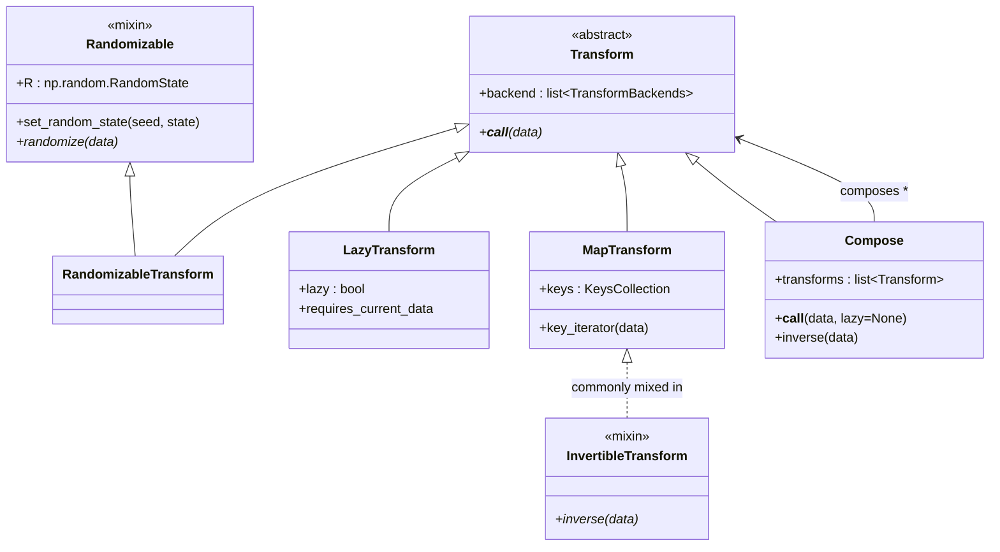

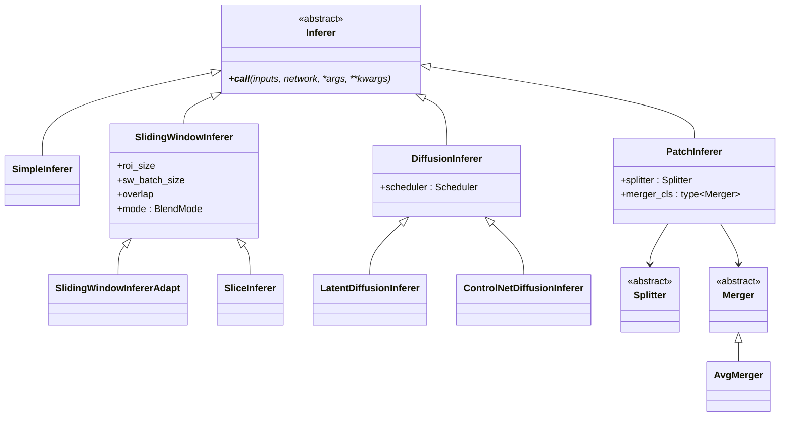

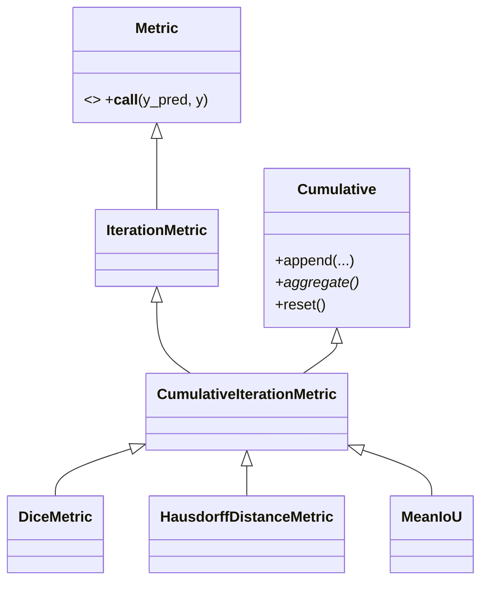

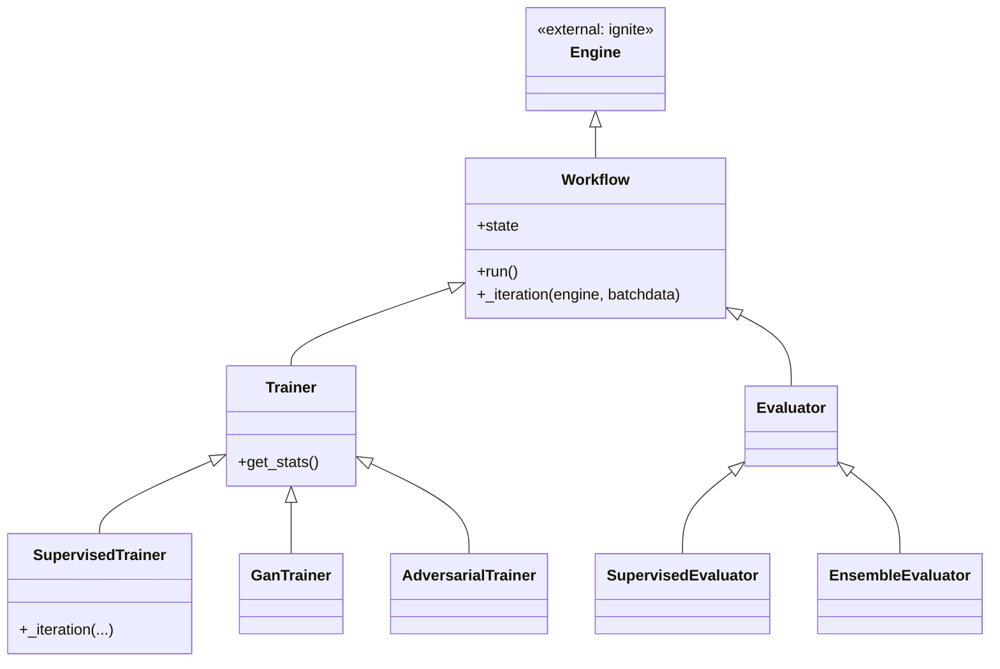

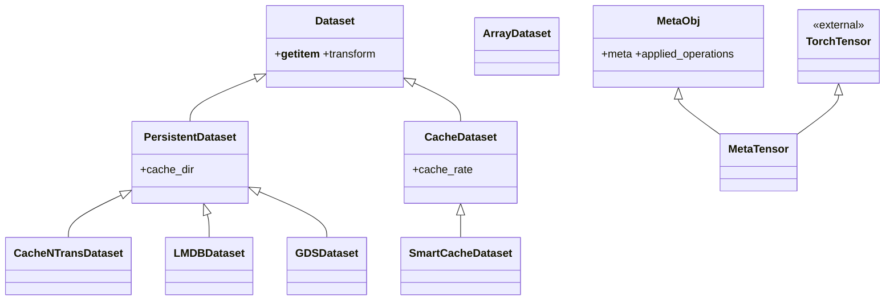

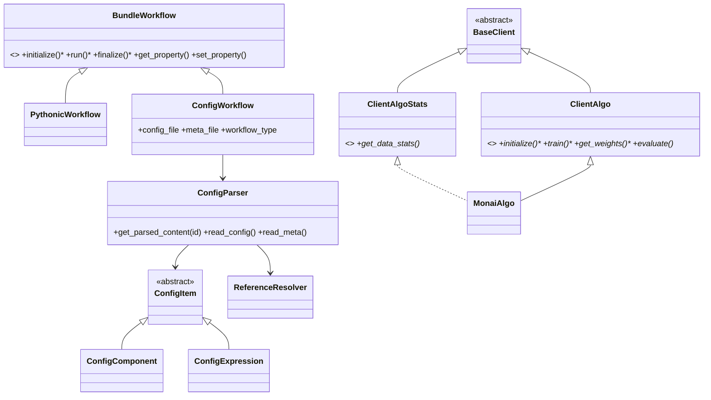

**Design patterns in use (named, with locations):**

- **Template Method** — `Workflow._iteration` is overridden by `SupervisedTrainer._iteration`, `GanTrainer._iteration`, etc.; the outer `run()` loop (inherited from Ignite `Engine`) is the template (`monai/engines/workflow.py`, `engines/trainer.py`, `engines/evaluator.py`).
- **Composite** — `Compose` holds a list of `Transform`s and is itself a `Transform`; recursive `Compose` of `Compose` is explicitly supported (`monai/transforms/compose.py`).
- **Strategy** — `Inferer` and its subclasses (`SimpleInferer`, `SlidingWindowInferer`, `PatchInferer`, `DiffusionInferer`) are interchangeable strategies plugged into `SupervisedTrainer` / `SupervisedEvaluator` (`monai/inferers/inferer.py`).
- **Decorator / Mixin** — `Randomizable`, `LazyTransform`, `InvertibleTransform`, `ThreadUnsafe` (in `transforms/traits.py`) are mixed in to add orthogonal behaviour without deep hierarchy.
- **Observer / Event-Bus** — Ignite event/handler model. MONAI adds `IterationEvents` and a population of `*Handler` classes in `monai/handlers/` that attach via `handler.attach(engine)` (`engines/utils.py`, `handlers/__init__.py`).
- **Factory** — `monai.networks.layers.factories.Conv`, `Norm`, `Act`, `Pool`, ... return the right layer constructor for `("conv", 3)` / `"instance"` / etc., so generic networks like `UNet` are dim-agnostic.
- **Registry** — `monai.utils.component_store.ComponentStore` underpins runtime lookup of registered components used by Auto3DSeg and bundles.
- **Builder / DSL** — `monai.bundle.ConfigParser` interprets JSON/YAML dicts where `_target_` keys describe Python objects to construct and `@id` references wire them together; `ReferenceResolver` resolves the DAG (`monai/bundle/config_parser.py`, `reference_resolver.py`).
- **Adapter** — `MetaTensor` adapts `torch.Tensor` to carry medical-imaging metadata (`affine`, spatial info, applied transforms) without breaking PyTorch ops (`monai/data/meta_tensor.py`).
- **Decorator function** — `monai.utils.optional_import` / `deprecated*` decorators provide soft dependencies and API lifecycle management (`monai/utils/module.py`, `deprecate_utils.py`).

## 6. Key Flows

### 6.1 Library usage flow — a typical supervised training step

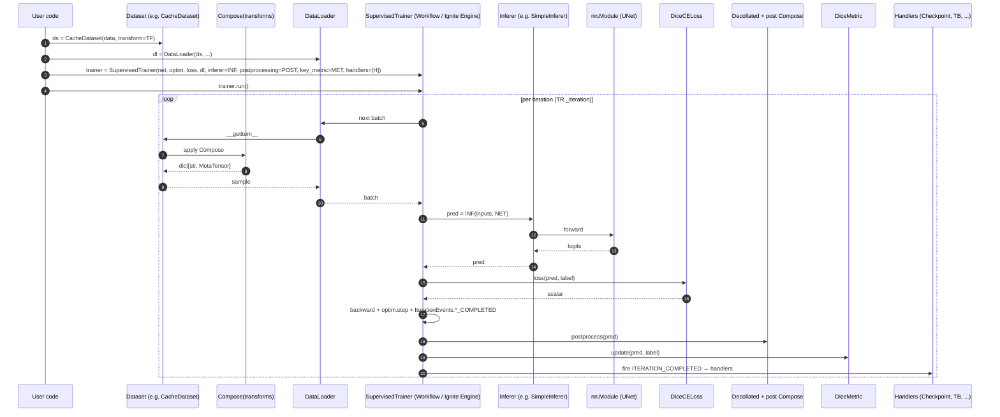

### 6.2 Bundle CLI flow — `python -m monai.bundle run --config_file ...`

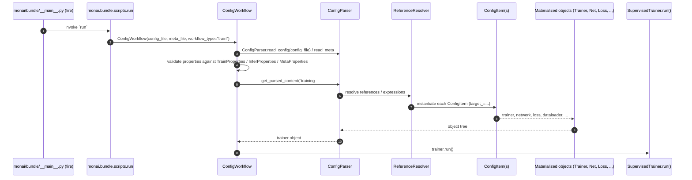

## 7. Extension Points

Where users plug in their own code:

1. **New transform** — subclass `Transform` (array) or `MapTransform` (dict). Add `Randomizable` or `LazyTransform` mixins as needed. Set `backend`. Follow the array/dictionary twin convention in `monai/transforms/*/`.
2. **New network** — drop an `nn.Module` into `monai/networks/nets/` and re-export in `nets/__init__.py`. The training loop is network-agnostic.
3. **New inference strategy** — subclass `Inferer` (`monai/inferers/inferer.py`); supply to any `SupervisedTrainer` / `SupervisedEvaluator` via `inferer=...`.
4. **New loss / metric** — subclass `nn.Module` for losses; subclass `CumulativeIterationMetric` for metrics (`monai/metrics/metric.py`).
5. **New handler** — implement an object exposing `attach(engine)` that registers callbacks against Ignite/`IterationEvents`. Pass via `handlers=[...]`.
6. **New trainer / evaluator** — subclass `Workflow` (or `Trainer` / `Evaluator`) and override `_iteration(engine, batchdata)`.
7. **New bundle workflow** — subclass `BundleWorkflow` (`PythonicWorkflow` for pure-Python authoring, `ConfigWorkflow` for config-driven). Declare required properties in `monai/bundle/properties.py`-style mappings.
8. **New federated learning algorithm** — subclass `ClientAlgo` / `ClientAlgoStats` (`monai/fl/client/client_algo.py`); the canonical implementation is `MonaiAlgo`.
9. **New C++/CUDA op** — add sources under `monai/csrc/`, register in `monai/csrc/ext.cpp`, expose via `monai/_extensions/loader.py`. Build is gated by `BUILD_MONAI=1` in `setup.py`.
10. **Domain vertical** — add a new package under `monai/apps/<area>/` following the existing pathology/detection/generation layout (transforms + networks + utils + optional engines).

## 8. Key Abstractions / Glossary

- **`MetaTensor`** — a `torch.Tensor` subclass that carries an `affine` matrix, channel/spatial metadata, and a stack of `applied_operations`. It is the dominant in-memory representation of an image in MONAI ≥ 0.9; enables transform inversion and lazy resampling.
- **Array vs. Dictionary transform** — every preprocessing op has two flavours: array form (operates on a tensor) and dict form / *MapTransform* (operates on `data[key]` in a dict). The dict twin is named with a `d` suffix or `Dict` suffix (e.g. `Spacing` → `Spacingd`).
- **Lazy execution** — when `lazy=True`, spatial transforms accumulate their affine/resample parameters as "pending operations" on the `MetaTensor` and are fused into a single resample by `apply_pending_transforms`. Lives in `monai/transforms/lazy/`.
- **Inverse transform** — for transforms mixing in `InvertibleTransform`, `Compose.inverse(data)` reverses applied operations. Used in test-time augmentation and post-processing.
- **Inferer** — encapsulates the inference strategy (whole-image, sliding-window, patch, diffusion sampling) so the same engine works for any of them.
- **Workflow / Engine** — a runnable training/eval loop built on `ignite.engine.Engine`. State (`engine.state`) is the shared blackboard; handlers observe events.
- **Handler** — a side-effect plugin attached to a `Workflow`/`Engine` via `attach(engine)`; observes Ignite events (checkpointing, logging, metrics, LR schedule, validation, ...).
- **Bundle** — a self-describing, config-driven model package (network + transforms + workflow config + metadata). The `monai.bundle` module is the format definition + parser + CLI.
- **`ConfigParser`** — interprets a dict/JSON/YAML graph where `_target_` keys name Python classes/functions, `@id` keys are references, and `$` prefixes are Python expressions; resolves them through `ReferenceResolver`.
- **Auto3DSeg** — AutoML pipeline that analyses a dataset (`monai/auto3dseg/analyzer.py`), then generates and trains candidate algorithms (`algo_gen.py`).
- **`ClientAlgo`** — the federated-learning client contract a server (e.g. NVFlare) drives: `initialize`, `train`, `get_weights`, `evaluate`, `abort`, `finalize`. `MonaiAlgo` is the bundle-aware default implementation.
- **`optional_import`** — `monai/utils/module.py` helper used everywhere; returns `(module, has_module: bool)`. Lets MONAI declare large optional dep surfaces (ignite, nibabel, itk, ...) without forcing installs.

## 9. Open Questions & Notes

The following were not exhaustively traced and are flagged for follow-up rather than inferred:

- **`monai.apps` internals** — each vertical (`pathology`, `detection`, `deepedit`, `generation`, `vista3d`, `nnunet`, `reconstruction`, …) is sizeable on its own. They were treated as cohesive subsystems that consume the core APIs above; their internal class hierarchies (e.g. detection heads, deepgrow interaction loop, generation diffusion pipelines, nnUNet adapter) are not enumerated here. A per-app doc would be appropriate if one of these is the area of focus.
- **`monai.csrc`** — only the surface (folders + the fact `setup.py` gates the build with `BUILD_MONAI=1`) was inspected. Per-extension ops (CRF, GMM, bilateral filtering, resampling kernels) and their Python wrappers were not listed.
- **`monai.auto3dseg`** is partially documented (analyzer + algo_gen named) but the full AutoML state machine (data analysis → algo template fill-in → hyperparameter scheduling → ensembling) was not traced end-to-end.
- **Ignite dependency** — `pytorch-ignite` is imported via `optional_import`. This means `monai.engines` and most `monai.handlers` are effectively optional features that no-op or error if Ignite is missing; the rest of MONAI (transforms, datasets, networks, losses, metrics, inferers, bundle) is usable without it.
- **TRT / ONNX paths** — `networks/trt_compiler.py`, `handlers/trt_handler.py`, `bundle.scripts.trt_export` / `onnx_export` exist but were not exercised in this read-through.
- **Class diagrams above** intentionally elide many concrete classes — every `*Loss` subclass, every dataset variant, every transform pair — in favour of the contracts they implement. The class hierarchies named are real (confirmed by reading the corresponding source files); the omissions are deliberate to keep diagrams readable.
