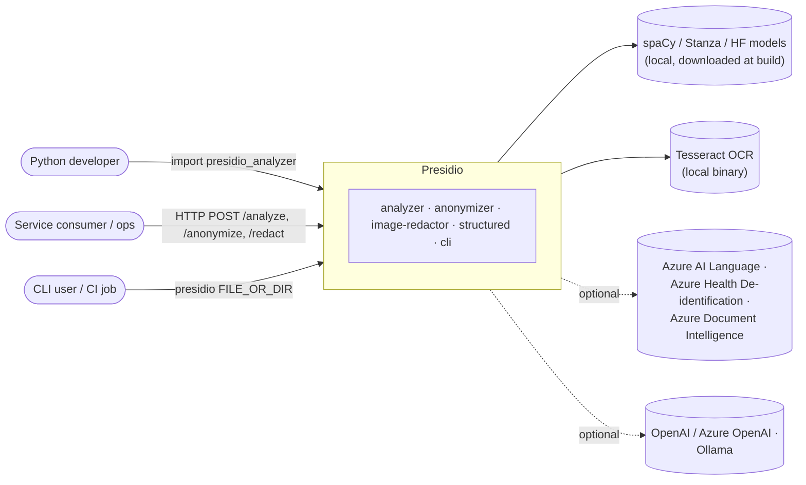
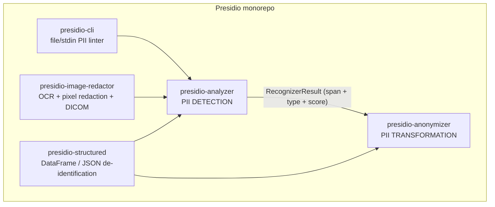
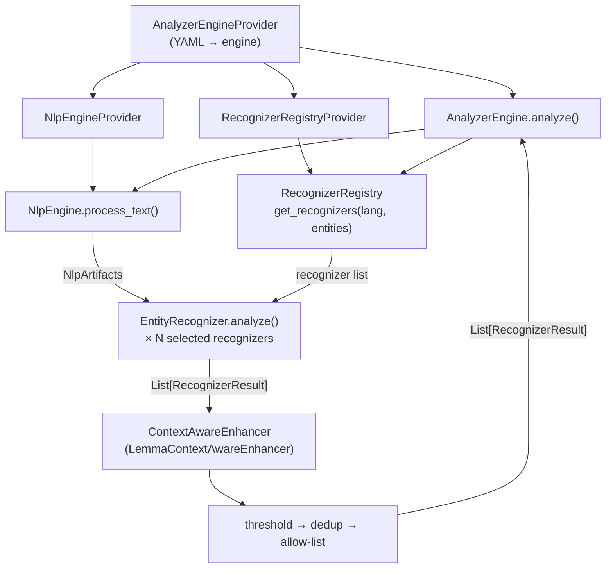
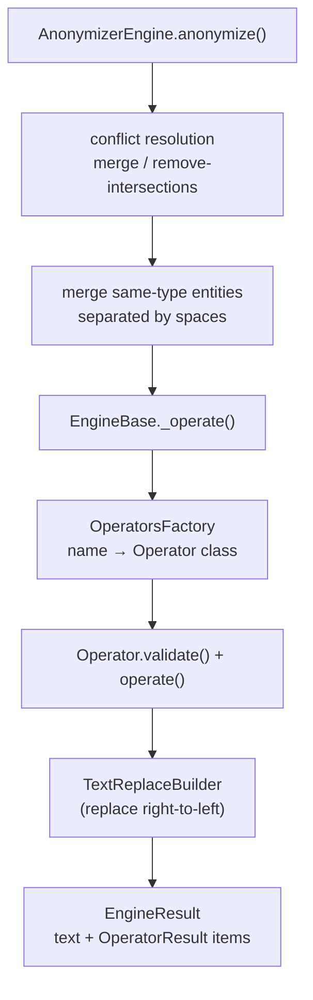
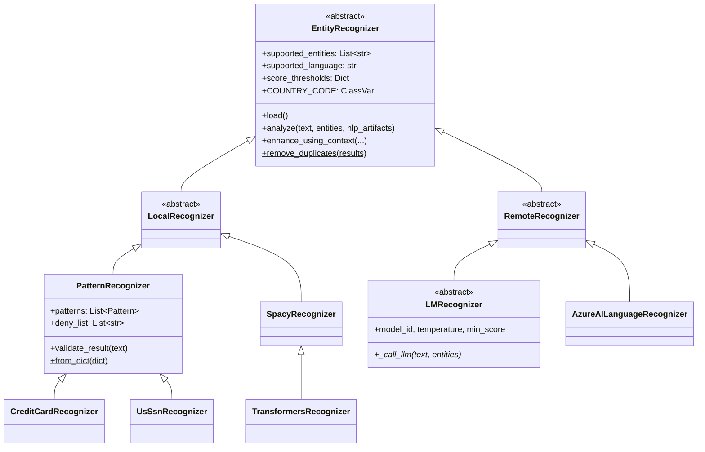
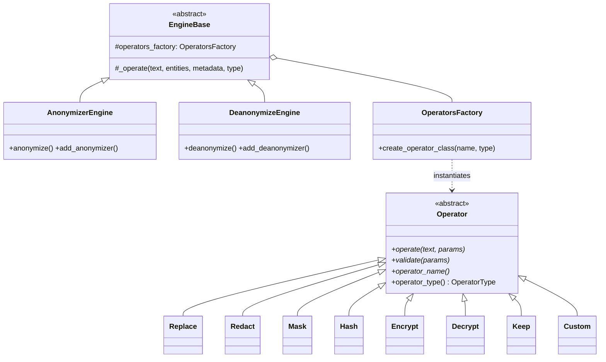
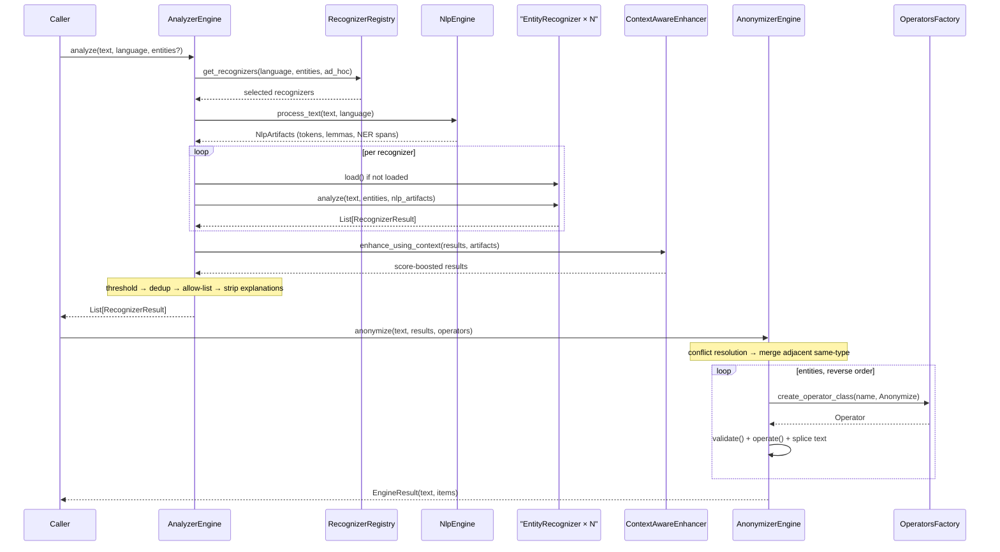
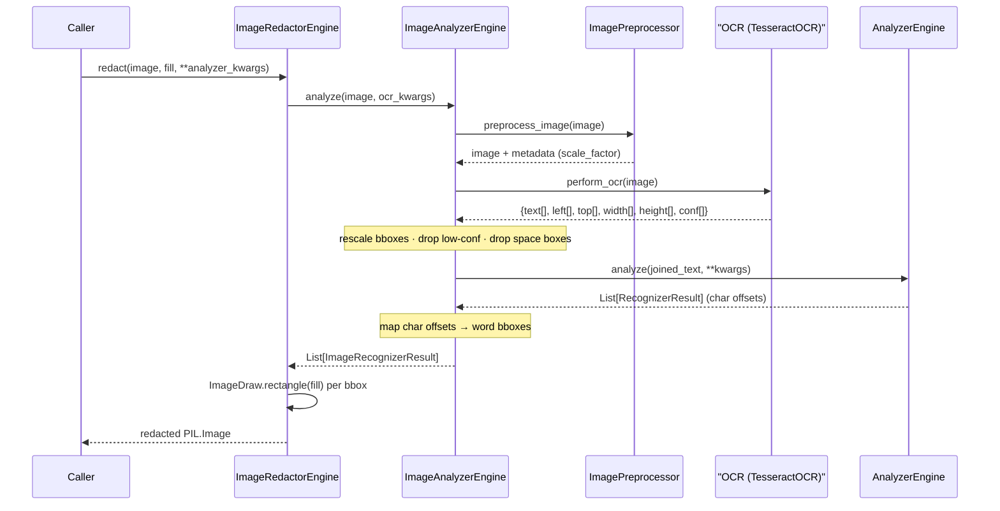
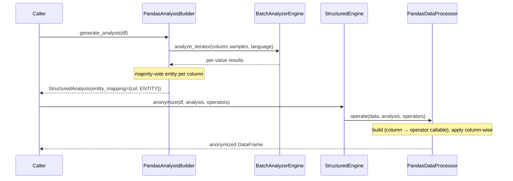

> Source: `https://github.com/data-privacy-stack/presidio` (local clone, branch `main`, `eb93051b`) · Date: 2026-08-28 · Mode: **Explain** · Type: **Hybrid** (library/SDK + services + CLI)
> See also: [User-Facing API & UX/DX](/case-studies/libraries/presidio_ux_design/)

---

## 1. Overview

Presidio is a **PII de-identification SDK**: it finds sensitive entities (names, credit
cards, national IDs, medical identifiers…) in text, images, and tabular/JSON data, then
replaces, masks, hashes, or encrypts them. The name is Latin *praesidium*, "garrison".

The repo is a **monorepo of five independently versioned Python distributions** plus one
meta-package, each with its own `pyproject.toml`, `uv.lock`, tests, and (for three of
them) a Dockerfile and Flask server:

| Distribution | Version | Role |
|---|---|---|
| `presidio-analyzer` | 2.2.364 | Detection engine — the heart of the system |
| `presidio-anonymizer` | 2.2.364 | De-identification / re-identification of detected spans |
| `presidio-image-redactor` | 0.0.60 | OCR → analyzer → pixel redaction (incl. DICOM) |
| `presidio-structured` | 0.0.8 | Column/key-level de-identification of DataFrames & JSON |
| `presidio-cli` | 0.0.9 | Lint-style PII scanner for files and stdin |
| `presidio` | 2.2.364 | Meta-package: `analyzer + anonymizer` |

**Type classification: Hybrid.** Evidence for *library*: every package ships
`py.typed`, a curated `__all__` in `__init__.py` (`presidio-analyzer/presidio_analyzer/__init__.py`),
and is published to PyPI. Evidence for *application*: `presidio-analyzer/app.py`,
`presidio-anonymizer/app.py`, and `presidio-image-redactor/app.py` each define a Flask
`Server` class with `create_app()`; `entrypoint.sh` runs them under gunicorn; a
`docker-compose.yml` wires three services plus Ollama; `presidio-cli` declares a console
script `presidio = presidio_cli.cli:run`.

**Tech stack.** Python 3.10–3.14. spaCy (default NLP), optional Stanza / HuggingFace
Transformers / GLiNER / LangExtract-over-OpenAI / Azure AI Language / Azure Health Data
Services. `regex` (not `re`) for timeout-capable matching, `pydantic` v2 for config
validation, `phonenumbers`, `tldextract`, `cryptography` (AES for the encrypt operator),
Flask + gunicorn/waitress for the HTTP surface, `pytesseract`/OpenCV/`pydicom` for images,
`pandas` for structured data. Build backend is `poetry-core`; dependency resolution and
CI installs use `uv`.

---

## 2. System Context

Three entry surfaces (SDK, REST, CLI) over one detection core. Everything except the
optional third-party recognizers runs **fully local** — the default install has no network
dependency at inference time, which is the property that makes Presidio usable on
regulated data.

---

## 3. High-Level Structure

The dependency graph is a **DAG with the analyzer at the root and no back-edge**: the
anonymizer depends on *nothing* from Presidio (only `cryptography`), and the analyzer
never imports the anonymizer. The two are joined only by a data contract — a list of
`(entity_type, start, end, score)` — which is why the anonymizer can be used against any
detector, and why the two services deploy independently.

| Path | Responsibility |
|---|---|
| `presidio-analyzer/presidio_analyzer/analyzer_engine.py` | Orchestrates detection: recognizer selection, NLP pass, context boost, thresholding, dedup, allow-list |
| `presidio-analyzer/presidio_analyzer/recognizer_registry/` | Holds and filters recognizers by language / entity / country |
| `presidio-analyzer/presidio_analyzer/nlp_engine/` | Pluggable NLP backends producing `NlpArtifacts` |
| `presidio-analyzer/presidio_analyzer/predefined_recognizers/` | ~105 recognizer classes: `generic/`, `country_specific/` (18 countries), `ner/`, `nlp_engine_recognizers/`, `third_party/` |
| `presidio-analyzer/presidio_analyzer/conf/` | YAML no-code configuration (NLP, analyzer, registry) |
| `presidio-anonymizer/presidio_anonymizer/operators/` | The transformation verbs: replace, redact, mask, hash, encrypt, keep, custom, AHDS-surrogate |
| `presidio-anonymizer/presidio_anonymizer/core/engine_base.py` | Right-to-left span replacement machinery shared by anonymize and deanonymize |
| `presidio-image-redactor/presidio_image_redactor/` | `OCR` → `ImageAnalyzerEngine` → `ImageRedactorEngine`; DICOM variants |
| `presidio-structured/presidio_structured/` | Column-level analysis (`AnalysisBuilder`) + per-column operator application (`StructuredEngine`) |
| `presidio-cli/presidio_cli/` | argparse CLI, `.presidiocli` config, line/column problem reporting |
| `e2e-tests/` | Black-box tests against the running Docker services |

---

## 4. Components — inside `presidio-analyzer`

Three things are worth naming explicitly:

**The `NlpArtifacts` seam.** `NlpEngine.process_text()` returns one `NlpArtifacts` object
(tokens, lemmas, entities, scores, keywords) that is computed **once per text** and passed
to every recognizer. This is what keeps a 100-recognizer run to a single spaCy parse, and
it is why `BatchAnalyzerEngine` can hoist `process_batch()` out and feed precomputed
artifacts back in via `analyze(nlp_artifacts=...)`.

**Two-stage context enhancement.** `AnalyzerEngine._enhance_using_context()` first gives
each recognizer a chance to boost its own results (`recognizer.enhance_using_context`,
with visibility into *other* recognizers' results — used for related-entity logic), then
applies the engine-wide `LemmaContextAwareEnhancer`, which matches recognizer-declared
context words against the lemmatized surrounding text.

**Ordering of the post-processing pipeline is load-bearing.** Low-score filtering runs
*before* deduplication (comment at `analyzer_engine.py:255`): collapsing duplicate spans
first would lose the recognizer-specific threshold attached to the losing result.
Thresholds resolve in a documented cascade — explicit call argument → per-entity
recognizer threshold → recognizer default → engine `default_score_threshold`
(`__get_result_score_threshold`).

### Inside `presidio-anonymizer`

`EngineBase._operate()` sorts entities in reverse and rewrites the string from the end
backwards, so earlier offsets stay valid while later ones are being replaced; indices in
the result are normalized left-to-right afterwards. `DeanonymizeEngine` reuses the exact
same `_operate()` with `OperatorType.Deanonymize` — decryption is just anonymization run
with a different operator table.

---

## 5. OOP & Class Architecture

### 5.1 The recognizer hierarchy (analyzer)

`EntityRecognizer` is the system's single most important abstraction — a **deep interface
with one method that matters** (`analyze`), behind which sit a regex, a 400 M-parameter
transformer, or a remote LLM call, indistinguishably from the engine's point of view.

`LocalRecognizer` vs `RemoteRecognizer` is a *deployment* split, not a capability one:
remote recognizers run out-of-process (Azure, LLM), local ones run in-process.

Two class-level details carry real design intent:

- **`COUNTRY_CODE` as a class var with constructor reconciliation.**
  `EntityRecognizer._resolve_country_code()` allows a country tag either on the class
  (canonical for the ~60 predefined country recognizers) or per-instance (for YAML-defined
  custom ones), and raises `ValueError` when the two disagree — the docstring's own
  example is refusing to let a Polish tax-ID recognizer be re-tagged as British. This
  powers `load_predefined_recognizers(countries=[...])`.
- **`score_thresholds` as a validated property** with a defensive-copy getter
  (`score_thresholds.setter` → `normalize_score_thresholds`), so per-recognizer thresholds
  can be declared in YAML without the engine trusting raw dict input.

### 5.2 The operator hierarchy (anonymizer)

Note the asymmetry that makes this work: `Operator` has **four** abstract methods, but
`operator_type()` is what lets a single factory hold two disjoint namespaces
(`ANONYMIZERS` / `DEANONYMIZERS`) — `Encrypt` and `Decrypt` are the same conceptual
operation registered on opposite sides.

### 5.3 Patterns in use

| Pattern | Where | Why |
|---|---|---|
| **Strategy** | `EntityRecognizer`, `Operator`, `NlpEngine`, `OCR`, `BaseTextChunker`, `DataProcessorBase`, `ReaderBase` | The whole system's extensibility model: one interface, many swappable implementations |
| **Registry** | `RecognizerRegistry` | Holds recognizers; queries them by language/entity/country; the engine never enumerates classes itself |
| **Abstract Factory / Provider** | `AnalyzerEngineProvider`, `NlpEngineProvider`, `RecognizerRegistryProvider`, `TextChunkerProvider`, `OperatorsFactory` | Builds an object graph from YAML/dict — this is the "no-code" story |
| **Template Method** | `EngineBase._operate()` | Fixes the replace-right-to-left algorithm; subclasses only vary the operator table |
| **Builder** | `TextReplaceBuilder`, `AnalysisBuilder` | Incremental construction of output text / of a column→entity mapping |
| **Decorator (data)** | `ImageRecognizerResult extends RecognizerResult` | Adds `left/top/width/height` to a text span without a parallel type |
| **Adapter** | `AppEntitiesConvertor`, `AnalyzerRequest`, `api_request_convertor` | JSON ↔ domain object translation, kept out of the engines |
| **Null Object** | `NoOpNlpEngine` | Lets regex-only deployments skip loading spaCy entirely |
| **Lazy loading** | `AnalyzerEngine.analyze()` calls `recognizer.load()` on first use | Heavy models (transformers, GLiNER) cost nothing until selected |

---

## 6. Key Flows

### 6.1 Text: detect → de-identify (the canonical path)

### 6.2 Image / DICOM redaction

The pivot of this flow is `map_analyzer_results_to_bounding_boxes` — the analyzer works in
character offsets over the OCR-joined string, and this method translates them back to
pixel rectangles. `DicomImageRedactorEngine` wraps the same pipeline with pixel-array
extraction, metadata-derived deny-lists (patient name → augmented word list via
`augment_word`), and DICOM re-serialization.

### 6.3 Structured data

This is a genuinely different shape from the text flow: detection happens **once per
column** (sampled), producing a schema-level `entity_mapping`, and the operator is then
applied to every cell without re-running detection. That is what makes it viable on
millions of rows.

---

## 7. Extension Points

Presidio's extensibility is unusually broad; these are the seams a user is expected to
reach for, ordered roughly by how often they're used.

1. **Custom recognizer via subclass** — inherit `PatternRecognizer` (regex/deny-list,
   optionally overriding `validate_result` for a checksum), `LocalRecognizer`, or
   `RemoteRecognizer`; register with `registry.add_recognizer(...)`.
2. **Ad-hoc recognizer per request** — `analyze(ad_hoc_recognizers=[...])`, also exposed
   over REST as the `ad_hoc_recognizers` JSON field (parsed by
   `PatternRecognizer.from_dict`). Scoped to one call, never registered.
3. **No-code YAML** — `default_recognizers.yaml` accepts `type: predefined` (name +
   per-language context + optional `score_thresholds`) and `type: custom` (inline
   patterns). `RecognizerRegistryProvider` / `AnalyzerEngineProvider` build the whole
   engine from a file; the Docker images bake this in via `ANALYZER_CONF_FILE`,
   `RECOGNIZER_REGISTRY_CONF_FILE`, `NLP_CONF_FILE` build args.
4. **Swap the NLP engine** — implement `NlpEngine`, or select `spacy` / `stanza` /
   `transformers` / `slim` / `no_op` in `conf/default.yaml`; `NerModelConfiguration`
   maps model labels to Presidio entities and sets per-label score multipliers and
   ignore-lists without touching code.
5. **Custom anonymization operator** — implement `Operator`, then
   `engine.add_anonymizer(MyOperator)`. Also `OperatorConfig("custom", {"lambda": fn})`
   for a one-off function (deliberately rejected over REST — see `app.py`'s
   `check_custom_operator`).
6. **Custom OCR** — implement `OCR.perform_ocr`; `DocumentIntelligenceOCR` is the
   in-tree example of a cloud alternative to `TesseractOCR`.
7. **Image preprocessing** — subclass `ImagePreprocessor`; four implementations ship
   (`BilateralFilter`, `SegmentedAdaptiveThreshold`, `ImageRescaling`,
   `ContrastSegmentedImageEnhancer`).
8. **Context enhancement** — implement `ContextAwareEnhancer`, or override
   `enhance_using_context` on a single recognizer.
9. **Chunking** — implement `BaseTextChunker` (`character` and `tokenizer` ship) for
   recognizers whose model has a context-length limit.
10. **Structured data backends** — implement `DataProcessorBase` (pandas and JSON ship)
    or `ReaderBase`.
11. **Filtering by country** — `load_predefined_recognizers(countries=["us","uk"])` or
    `supported_countries:` in YAML; locale-agnostic recognizers always load.

---

## 8. Key Abstractions / Glossary

| Term | Meaning |
|---|---|
| **Entity** | A PII type, e.g. `PERSON`, `CREDIT_CARD`, `US_SSN`. ~140 documented in `docs/supported_entities.md` |
| **Recognizer** | An object that finds one or more entity types in text. ~105 predefined classes |
| **`RecognizerResult`** | The core contract: `entity_type, start, end, score` + optional `analysis_explanation` and `recognition_metadata` |
| **`Pattern`** | Named regex + confidence score (0–1), validated at construction |
| **`NlpArtifacts`** | One text's NLP output — tokens, lemmas, NER spans, scores, keywords — computed once, shared by all recognizers |
| **Context words** | Words that, when found near a match, boost its score (e.g. "card" near a number) |
| **`AnalysisExplanation`** | The decision trace: which pattern matched, original vs. final score, why it changed. Returned only when `return_decision_process=True` |
| **Operator** | An anonymization verb: `replace`, `redact`, `mask`, `hash`, `encrypt`, `keep`, `custom`, `surrogate` (AHDS) |
| **`OperatorConfig`** | `(operator_name, params)` — how to transform one entity type |
| **`EngineResult`** | Anonymizer output: the new text plus `OperatorResult` items with post-transformation offsets |
| **Deanonymize** | Reversing a reversible operator (`decrypt`) using the stored `OperatorResult` offsets |
| **Allow-list** | Terms never reported as PII; matched `exact` or `regex` |
| **Deny-list** | Terms always reported, compiled into a regex by `PatternRecognizer` |
| **Ad-hoc recognizer** | A recognizer supplied for one `analyze()` call only |
| **`StructuredAnalysis`** | `{column_or_json_key: ENTITY_TYPE}` — a schema-level detection result |

---

## 9. Open Questions & Notes

Things I could not settle from the code alone, and judgment calls worth flagging:

- **The repo is mid-transition.** `docs/project_transition.md` and the README banner say
  Presidio moved from Microsoft to `data-privacy-stack`. Package versions, image
  registries (`ghcr.io/data-privacy-stack`), and the support email all reflect the new
  home, but historical docs and the `deploytoazure.json` templates still carry Azure
  assumptions. Treat Azure-specific paths as legacy-leaning unless verified.
- **`OperatorsFactory.__load_predefined_deanonymizers()` appears dead** — it duplicates
  what `__load_predefined(OperatorType.Deanonymize)` already does and has no caller in the
  package. Not a defect, but don't take it as the live path.
- **`AnonymizerEngine._remove_conflicts_and_get_text_manipulation_data` mutates its
  inputs' neighbours** while iterating a copied list. It works, and `_copy_recognizer_results`
  defends the caller's objects, but the merge logic is the least obviously-correct code in
  the anonymizer and is where I'd look first for span bugs.
- **`show_problems()` in `presidio_cli/cli.py` always returns `0`** (`max_level` is
  initialized and never reassigned), so the CLI's exit code is effectively always 0 even
  when PII is found. I did not run it to confirm; if the intent is CI gating, this is
  worth verifying before relying on the exit code.
- **`docker-compose.yml` includes an Ollama service** and the analyzer gets
  `OLLAMA_HOST`, but no in-tree recognizer reads that variable directly — it is consumed
  through the LangExtract/OpenAI-compatible path and exercised by
  `e2e-tests/resources/ollama_test_config.yaml`. The local-LLM story looks recent and
  test-driven rather than fully documented.
- **Threading / concurrency model is unstated.** Engines are constructed once per gunicorn
  worker (`create_app()`), recognizers lazily mutate `is_loaded`, and `Pattern` caches
  `compiled_regex`. Under `WORKERS>1` each process gets its own copy, so this is safe as
  deployed — but I found no explicit statement that `AnalyzerEngine` is thread-safe, and
  would not assume it is.
- I read public interfaces and traced one representative flow per package rather than
  every recognizer body; the ~105 predefined recognizers are treated as instances of the
  `PatternRecognizer`/`LocalRecognizer` shapes, not individually verified.
