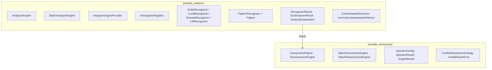
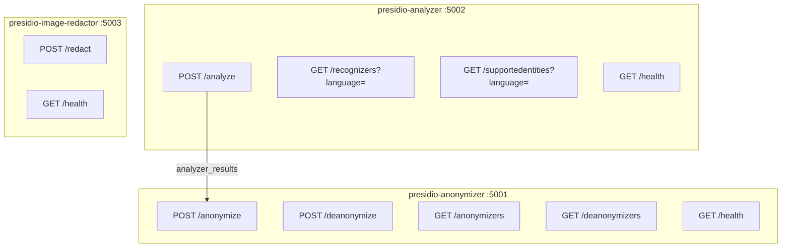
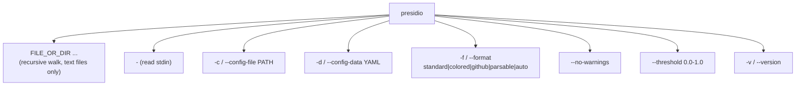
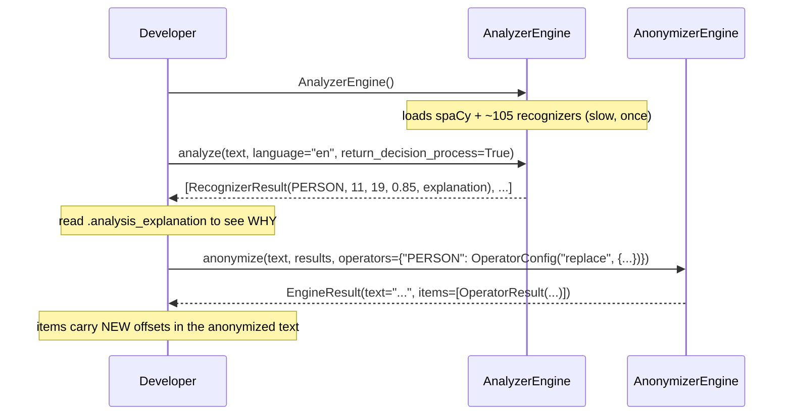
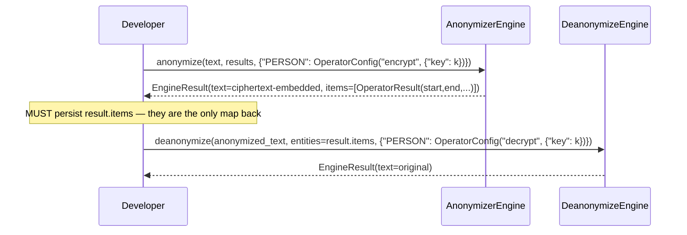
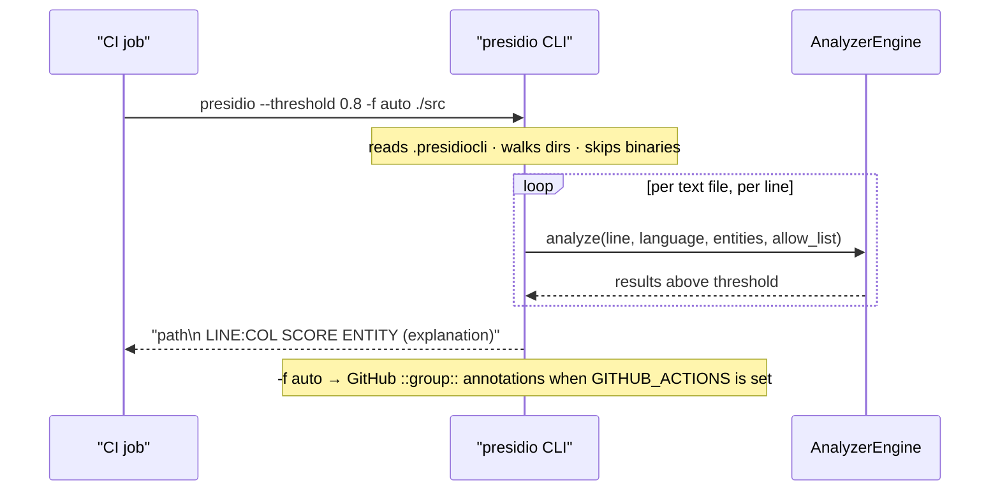
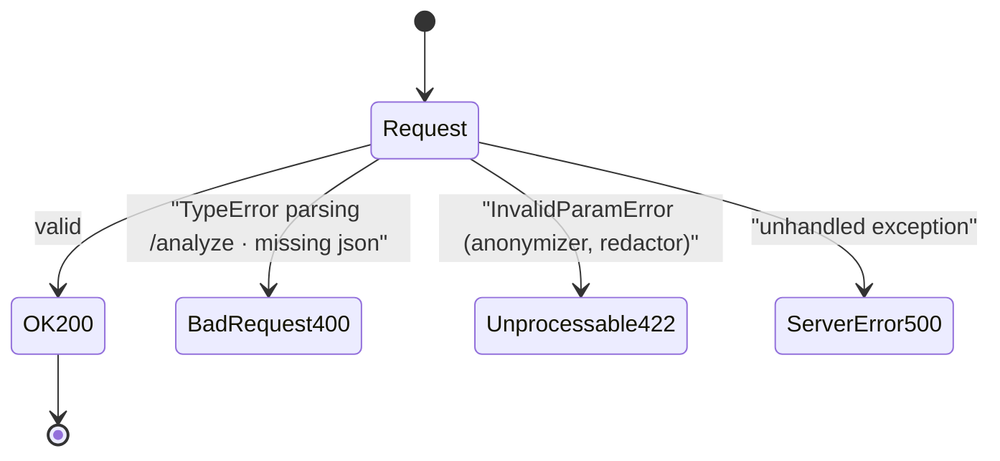
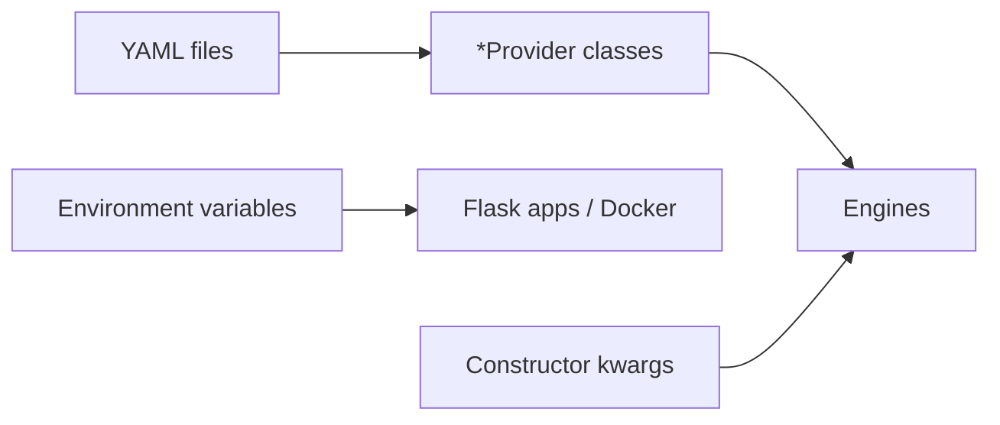

> Source: `https://github.com/data-privacy-stack/presidio` (local clone, branch `main`, `eb93051b`) · Date: 2026-08-28 · Mode: **Explain** · Surface: **Hybrid** (Library/SDK + Web API + CLI)
> See also: [System & OOP Architecture](/case-studies/libraries/presidio_system_oop_architecture/)

---

## Cheat Sheet

**Python SDK — the 90% path**

```python
from presidio_analyzer import AnalyzerEngine
from presidio_anonymizer import AnonymizerEngine
from presidio_anonymizer.entities import OperatorConfig

analyzer = AnalyzerEngine()                                     # loads spaCy en_core_web_lg
results  = analyzer.analyze(text="My name is Jane, call 212-555-5555", language="en")

anonymizer = AnonymizerEngine()
out = anonymizer.anonymize(
    text="My name is Jane, call 212-555-5555",
    analyzer_results=results,
    operators={"PHONE_NUMBER": OperatorConfig("mask",
                                              {"masking_char": "*", "chars_to_mask": 8, "from_end": True})},
)
print(out.text)   # → "My name is <PERSON>, call 212-****-****"
```

| Call | Use it for |
|---|---|
| `AnalyzerEngine().analyze(text, language, entities=…)` | Detect PII in one string |
| `AnonymizerEngine().anonymize(text, analyzer_results, operators=…)` | Replace/mask/hash/encrypt detected spans |
| `OperatorConfig(name, params)` | Pick the transformation per entity type |
| `BatchAnalyzerEngine().analyze_iterator(texts, language)` | Many strings, one NLP batch |
| `BatchAnalyzerEngine().analyze_dict(input_dict, language)` | Nested dicts / JSON |
| `DeanonymizeEngine().deanonymize(text, entities, operators)` | Reverse `encrypt` with `decrypt` |
| `AnalyzerEngineProvider(analyzer_engine_conf_file=…).create_engine()` | Build the whole engine from YAML |
| `PatternRecognizer(supported_entity=…, patterns=[Pattern(...)])` | Add your own detector |
| `ImageRedactorEngine().redact(pil_image, fill=(0,0,0))` | Black-box PII in an image |
| `StructuredEngine().anonymize(df, analysis, operators)` | De-identify a DataFrame column-wise |

**REST** (services on `:5001` in-container; `5002`/`5001`/`5003` on the host via compose)

```bash
curl -X POST http://localhost:5002/analyze -H 'Content-Type: application/json' \
  -d '{"text":"My name is Jane Doe","language":"en"}'

curl -X POST http://localhost:5001/anonymize -H 'Content-Type: application/json' \
  -d '{"text":"My name is Jane Doe",
       "analyzer_results":[{"entity_type":"PERSON","start":11,"end":19,"score":0.85}],
       "anonymizers":{"DEFAULT":{"type":"replace","new_value":"<REDACTED>"}}}'

curl http://localhost:5002/supportedentities?language=en
```

**CLI**

```bash
pip install presidio-cli && python -m spacy download en_core_web_lg
presidio ./src                 # scan a directory
presidio - < notes.txt         # scan stdin
presidio --threshold 0.8 -f parsable ./src
```

---

## 1. Overview

Presidio removes personal data from text, images, and tables. Its user-facing promise is
narrow and legible: **give it a string, get back a list of `(entity_type, start, end,
score)`; give it those spans plus a transformation table, get back de-identified text.**
Everything else — 105 recognizers, six NLP backends, DICOM handling — hangs off those two
verbs.

**Surface type: Hybrid.** Three distinct consumer-facing surfaces, each with its own
evidence:

| Surface | User | Evidence |
|---|---|---|
| **Library / SDK** (primary) | Python developer importing it | Curated `__all__` in all five `__init__.py`; `py.typed` markers; five PyPI distributions; `docs/api/*_python.md`; a 14-part tutorial in `mkdocs.yml` |
| **Web API** | Client developer over HTTP | `presidio-analyzer/app.py`, `presidio-anonymizer/app.py`, `presidio-image-redactor/app.py`; `docs/api-docs/api-docs.yml` (OpenAPI 3, `version: "2.0"`); `docker-compose.yml` |
| **CLI** | Operator / CI job | `presidio = presidio_cli.cli:run` console script; argparse tree in `presidio_cli/cli.py`; `.presidiocli` config |

The SDK is clearly the centre of gravity — the REST services are thin Flask wrappers that
construct the same engines at boot and forward JSON. Nothing exists in the API that is not
first available in Python; the reverse is emphatically not true.

There is **no GUI in this repo.** The hosted demo (`huggingface.co/spaces/presidio/presidio_demo`)
lives elsewhere; the only HTML here is the MkDocs site and a ReDoc page for the OpenAPI
spec.

---

## 2. Surface Map

### 2.1 Python SDK — exported symbols



| Package | Exported surface (`__all__`) |
|---|---|
| `presidio_analyzer` | `AnalyzerEngine`, `BatchAnalyzerEngine`, `AnalyzerEngineProvider`, `AnalyzerRequest`, `RecognizerRegistry`, `EntityRecognizer`, `LocalRecognizer`, `RemoteRecognizer`, `LMRecognizer`, `PatternRecognizer`, `Pattern`, `RecognizerResult`, `DictAnalyzerResult`, `AnalysisExplanation`, `ContextAwareEnhancer`, `LemmaContextAwareEnhancer` |
| `presidio_analyzer.predefined_recognizers` | 113 recognizer classes, e.g. `CreditCardRecognizer`, `UsSsnRecognizer`, `EmailRecognizer`, `SpacyRecognizer`, `TransformersRecognizer`, `GLiNERRecognizer`, `AzureAILanguageRecognizer` |
| `presidio_analyzer.nlp_engine` | `NlpEngine`, `NlpEngineProvider`, `NlpArtifacts`, `SpacyNlpEngine`, `StanzaNlpEngine`, `TransformersNlpEngine`, `SlimSpacyNlpEngine`, `NoOpNlpEngine`, `NerModelConfiguration` |
| `presidio_anonymizer` | `AnonymizerEngine`, `DeanonymizeEngine`, `BatchAnonymizerEngine`, `BatchDeanonymizeEngine`, `OperatorConfig`, `OperatorResult`, `EngineResult`, `RecognizerResult`, `DictRecognizerResult`, `PIIEntity`, `ConflictResolutionStrategy`, `InvalidParamError` |
| `presidio_anonymizer.operators` | `Operator`, `OperatorType`, `OperatorsFactory`, `Replace`, `Redact`, `Mask`, `Hash`, `Encrypt`, `Decrypt`, `Keep`, `DeanonymizeKeep`, `Custom`, `AESCipher`, (`AHDSSurrogate` if extra installed) |
| `presidio_image_redactor` | `ImageRedactorEngine`, `ImageAnalyzerEngine`, `ImagePiiVerifyEngine`, `DicomImageRedactorEngine`, `DicomImagePiiVerifyEngine`, `OCR`, `TesseractOCR`, `DocumentIntelligenceOCR`, `BboxProcessor`, `ImagePreprocessor`, `BilateralFilter`, `SegmentedAdaptiveThreshold`, `ImageRescaling`, `ContrastSegmentedImageEnhancer` |
| `presidio_structured` | `StructuredEngine`, `StructuredAnalysis`, `JsonAnalysisBuilder`, `PandasAnalysisBuilder`, `CsvReader`, `JsonReader`, `PandasDataProcessor`, `JsonDataProcessor` |

**Operator catalogue** — the vocabulary a user actually shops from:

| `OperatorConfig` name | Params | Effect |
|---|---|---|
| `replace` | `new_value` (default `<ENTITY_TYPE>`) | Substitute a literal |
| `redact` | — | Delete the span |
| `mask` | `masking_char`, `chars_to_mask` (int), `from_end` (bool) | Partially obscure |
| `hash` | `hash_type` (`sha256`\|`sha512`), `salt` (≥16 bytes, else random per entity) | One-way pseudonymize |
| `encrypt` | `key` (128/192/256-bit) | Reversible, AES |
| `decrypt` | `key` | Deanonymize-side inverse of `encrypt` |
| `keep` | — | Leave the span untouched |
| `custom` | `lambda` (callable returning `str`) | Arbitrary transform — **SDK only** |
| `surrogate` | `endpoint`, `entities`, `input_locale`, `surrogate_locale` | Azure Health De-identification realistic replacement (`ahds` extra) |

### 2.2 Web API — endpoint catalogue



| Endpoint | Body / params | Returns |
|---|---|---|
| `POST /analyze` | `text` (string **or array** → batch mode), `language`, `entities[]`, `score_threshold`, `return_decision_process`, `ad_hoc_recognizers[]`, `context[]`, `correlation_id`, `allow_list[]`, `allow_list_match`, `regex_flags` | Array of `{entity_type, start, end, score, analysis_explanation?}` — or array-of-arrays when `text` was an array |
| `GET /recognizers` | `?language=` | Array of recognizer **names** |
| `GET /supportedentities` | `?language=` | Array of entity type strings |
| `POST /anonymize` | `text`, `analyzer_results[]`, `anonymizers{}` keyed by entity type or `DEFAULT` | `{text, items[{start,end,entity_type,text,operator}]}` |
| `POST /deanonymize` | `text`, `anonymizer_results[]`, `deanonymizers{}` | Same `EngineResult` shape |
| `GET /anonymizers` / `GET /deanonymizers` | — | Array of operator names |
| `POST /redact` | JSON `{image: <base64>, analyzer_entities[]}` **or** multipart `image` file; `data` form field carries `color_fill` | base64 or raw image bytes (`application/octet-stream`) |
| `GET /health` | — | Plain-text liveness string |

### 2.3 CLI — command tree



`FILE_OR_DIR` and `-` are mutually exclusive (one is required); `-c` and `-d` are mutually
exclusive. Config resolution order: `--config-data` → `--config-file` → `./.presidiocli`
→ built-in `default`.

---

## 3. Entry & Onboarding

### SDK

```bash
pip install presidio-analyzer presidio-anonymizer
python -m spacy download en_core_web_lg     # required, and easy to forget
```

The smallest real program is the Cheat Sheet's five lines. The onboarding cost is
concentrated in one place: **`AnalyzerEngine()` with no arguments loads a ~600 MB spaCy
model and instantiates every predefined recognizer.** First construction is slow; the
constructor is where a newcomer's "is it hanging?" moment happens. Two documented escape
hatches exist — `en_core_web_sm` via `NlpEngineProvider`, or `NoOpNlpEngine` for
regex-only work — but neither is the default, and the default carries no progress
indication.

### REST

```bash
docker compose up -d                    # analyzer :5002, anonymizer :5001, redactor :5003
curl http://localhost:5002/health       # → "Presidio Analyzer service is up"
```

**No authentication of any kind.** No API key, no token, no TLS. The services bind
`0.0.0.0` and every endpoint is open. That is a deliberate posture — Presidio is designed
to sit inside your trust boundary, behind your own gateway — but it is unstated in the
service code and easy to get wrong. The first call is the first `curl`; there is no
handshake.

### CLI

```bash
pip install presidio-cli
python -m spacy download en_core_web_lg
presidio .
```

---

## 4. Key User Journeys

### 4.1 Detect → inspect → de-identify (SDK)



The step worth calling out is `return_decision_process=True`. It populates
`AnalysisExplanation` — which pattern fired, the original score, the score after context
boosting, and a textual reason. This is Presidio's answer to "why did you flag that?", and
it's the feature that makes the tool auditable rather than a black box. It is off by
default because the explanation objects are heavy.

### 4.2 Encrypt then recover (round trip)



The contract here is sharp and under-advertised: **`EngineResult.items` is the
re-identification key material alongside the AES key.** Lose the items and the ciphertext
spans cannot be located. Nothing in the API signals that this object must be persisted.

### 4.3 CLI scan in CI



Nice touch: `-f auto` detects `GITHUB_ACTIONS`+`GITHUB_WORKFLOW` and emits workflow
annotations, falls back to ANSI colour on a TTY, and to plain text when piped. That is
the format-negotiation behaviour a CI-facing tool should have. (See §8 for a caveat about
its exit code.)

---

## 5. Interaction & State

### SDK return contract

`analyze()` returns `List[RecognizerResult]` — **an empty list is the normal "nothing
found" result, never `None`, never an exception.** Failure modes surface as exceptions
during *construction*, not analysis: `ValueError` for a language/registry mismatch, for
an unavailable NLP engine name, for `allow_list_match` outside `{"exact","regex"}`, for
a country-code conflict. The anonymizer raises `InvalidParamError` for bad operator params
(missing `new_value`, wrong AES key length, salt under 16 bytes, a `custom` lambda that
doesn't return `str`).

One resilience behaviour worth knowing: regex matching is bounded by
`REGEX_TIMEOUT_SECONDS` (env var, default 60), and on timeout in the allow-list path
Presidio **keeps the result and logs a warning** — it fails toward flagging PII rather
than toward leaking it. Good default.

### HTTP status contract



| Code | Body | Raised by |
|---|---|---|
| 200 | Result JSON | all |
| 400 | `{"error": "..."}` | `/analyze` on unparseable request; `BadRequest` on empty JSON |
| 422 | `{"error": "<validation message>"}` | `InvalidParamError` — anonymizer and image redactor only |
| 500 | `{"error": e.args[0]}` (analyzer) / `{"error": "Internal server error"}` (anonymizer, redactor) | unhandled |

The 500 bodies are **inconsistent across services**: the analyzer leaks the raw exception
message to the client, while the anonymizer and redactor return a fixed generic string.
For a tool whose whole job is not leaking sensitive strings, the analyzer's behaviour is
the odd one out — `e.args[0]` on a text-processing failure can plausibly contain input
fragments.

Also note `/analyze` strips `recognition_metadata` from every result before serializing
(`_exclude_attributes_from_dto`), so the REST response is a strict subset of the SDK's —
recognizer name and identifier are not on the wire.

### CLI output & exit codes

```
path/to/file.py
  12:23       0.85                 PERSON  (Detected by Spacy)
```

`-f parsable` emits one JSON object per finding (the `RecognizerResult.to_dict()` shape) —
that is the machine-readable mode. `--no-warnings` filters to `error` level only. Exit
code is intended to be 1-on-findings / 0-on-clean; see §8.

---

## 6. Information Architecture / API Ergonomics

**What's consistent, and good:**

- **Engine + Provider pairing.** Every configurable subsystem has the same two-object
  shape: `XEngine` for code-first construction, `XEngineProvider` for YAML-first
  (`AnalyzerEngineProvider`, `NlpEngineProvider`, `RecognizerRegistryProvider`,
  `TextChunkerProvider`). Once you learn it for one, you know it for all.
- **`Batch*` prefix means "same verb, collections."** `BatchAnalyzerEngine`,
  `BatchAnonymizerEngine`, `BatchDeanonymizeEngine` each wrap their singular counterpart
  and take it as an optional constructor arg — so a tuned engine flows into batch mode
  without reconfiguration.
- **One offset convention throughout.** `(start, end)` half-open character offsets, from
  `RecognizerResult` in the analyzer, through the anonymizer, into `ImageRecognizerResult`
  (which merely *adds* `left/top/width/height`). Never a mix of offsets and substrings.
- **Escalating extension ladder.** `deny_list` → `patterns` → subclass `PatternRecognizer`
  → subclass `EntityRecognizer` → YAML `type: custom`. A user can stop at the rung that
  matches their need, which is the mark of a well-graded API.

**Where it's rough:**

- **`to_dict()` vs `to_json()` are not uniform.** `RecognizerResult` and `Pattern` offer
  `to_dict()`; `EngineResult` and `NlpArtifacts` offer `to_json()`. A round-tripping user
  has to check per type.
- **Operator naming is JSON-vs-Python split.** In Python you write
  `OperatorConfig("mask", {...})`; over HTTP you write `{"type": "mask", ...}` — the
  operator name moves into a `type` key, flattened with its params. `OperatorConfig.from_json`
  bridges it, but it is two dialects for one concept.
- **`analyze()` has 12 keyword parameters.** Discoverable via docstring, but there is no
  options object; `allow_list` + `allow_list_match` + `regex_flags` in particular are three
  coupled arguments where one small config object would read better.

### AX note — Presidio as an agent-driven surface

Presidio is a plausible tool for an autonomous agent to drive (scrub text before sending
it to a model; redact a document on request). Assessed descriptively against the
agent-facing criteria:

- **Self-documenting: strong for REST, weak for CLI.** `GET /supportedentities`,
  `GET /recognizers`, `GET /anonymizers`, `GET /deanonymizers` are *runtime introspection
  endpoints* — an agent can discover the full vocabulary before acting, without reading
  docs. That is genuinely well-suited to a forgetful consumer. The CLI, by contrast, has
  no `--list-entities`; the same information is reachable only by importing Python.
- **Token-economical: strong.** Findings are flat JSON with four scalar fields. No raw
  model dumps. `return_decision_process` is opt-in, so the verbose path costs nothing
  unless requested.
- **Errors that teach: mixed.** `InvalidParamError` messages are specific and actionable
  ("Invalid input, masking_char must be a character"). The analyzer's 500 handler is not —
  it returns whatever `e.args[0]` holds, which may be a bare stack-adjacent string with no
  next move.
- **Stable status codes: yes for HTTP** (200/400/422/500 are consistent per service);
  **unreliable for the CLI** — see §8. An agent branching on the CLI's exit code would
  branch wrongly.
- **One structural asymmetry:** the SDK deliberately withholds `custom` (arbitrary lambda)
  from the HTTP surface — `app.py` rejects it with `check_custom_operator`. Correct
  security call, and worth an agent knowing up front: the wire API is strictly less
  expressive than the library.

---

## 7. Configuration & Customization

### Three configuration planes



**1. YAML (the no-code plane).** Three files, each independently overridable, and each
also inlinable as a section of the analyzer conf (inline wins over a separate file — a
deliberate rule so a single `ANALYZER_CONF_FILE` is self-contained and can't be silently
overridden by a Dockerfile-baked default):

| File | Env var | Controls |
|---|---|---|
| `conf/default.yaml` | `NLP_CONF_FILE` | `nlp_engine_name`, models per language, `ner_model_configuration` (label→entity mapping, `labels_to_ignore`, `low_confidence_score_multiplier`) |
| `conf/default_analyzer.yaml` | `ANALYZER_CONF_FILE` | `supported_languages`, `default_score_threshold` |
| `conf/default_recognizers.yaml` | `RECOGNIZER_REGISTRY_CONF_FILE` | Which recognizers load, per-language context words, per-recognizer `score_thresholds`, `supported_countries` filter, and inline `type: custom` pattern recognizers |

Shipped presets: `spacy.yaml`, `stanza.yaml`, `transformers.yaml`, `slim.yaml`,
`no_op.yaml`, `spacy_multilingual.yaml`, `stanza_multilingual.yaml`,
`default_analyzer_full.yaml`, `example_recognizers.yaml`, plus two LangExtract configs.

**2. Environment variables.** `PORT` (3000 default), `WORKERS` (gunicorn), `LOG_LEVEL`,
`BATCH_SIZE` (500), `N_PROCESS` (1), `REGEX_TIMEOUT_SECONDS` (60), the three `*_CONF_FILE`
paths. The Dockerfiles expose the conf paths as build args too, so a custom image can bake
in a different recognizer set without changing code.

**3. Install-time extras.** The optional-dependency names are themselves a configuration
surface: `presidio-analyzer[server]`, `[transformers]`, `[stanza]`, `[gliner]`,
`[azure-ai-language]`, `[ahds]`, `[langextract]`. Alternative Dockerfiles
(`Dockerfile.transformers`, `Dockerfile.stanza`, `Dockerfile.windows`) prebuild these.

### CLI configuration — `.presidiocli`

```yaml
language: en
entities:              # omit → all supported entities
  - PERSON
  - CREDIT_CARD
  - EMAIL_ADDRESS
threshold: 0.8
allow:                 # tokens never reported
  - example@test.com
ignore: |              # gitwildmatch patterns
  .git
  *.cfg
locale: en_US.UTF-8
extends: limited       # a shipped preset, or a path
```

`--threshold` on the command line overrides the file. Entity names are validated against
the live analyzer at load time, so a typo fails fast with
`invalid config: no such entity <X>` rather than silently detecting nothing.

---

## 8. Open Questions & Notes

- **The CLI's exit code appears to be always 0.** In `presidio_cli/cli.py`,
  `show_problems()` initializes `max_level = 0` (line 125) and returns it (line 161)
  without ever reassigning it; `run()` then sets `return_code = 1` only `if prob_num > 0`.
  I verified the variable is never written between those lines but did not execute the CLI
  to confirm the observable behaviour. If you intend to gate CI on this, test it first.
- **The OpenAPI spec has drifted from the code.** `docs/api-docs/api-docs.yml` documents
  eight paths and omits `POST /redact` entirely (the image redactor is undocumented in the
  spec), and its `AnalyzeRequest` schema lacks `allow_list`, `allow_list_match`, and
  `regex_flags` — all three of which `AnalyzerRequest` parses and `app.py` forwards. The
  spec also still declares `version: "2.0"` while the packages are at 2.2.364. Treat the
  code as authoritative.
- **Batch mode over `/analyze` is undocumented in the spec's description text** even
  though the schema allows an array `text`. The response shape changes accordingly
  (array-of-arrays) — a client that hardcodes the singular shape will break on an array
  input.
- **No auth story anywhere.** No middleware, no key check, no TLS config in any `app.py`,
  Dockerfile, or compose file. I read this as intentional (deploy behind your own
  gateway), but I found no document in the repo that states the assumption, so a user
  could reasonably expose these ports directly.
- **Port numbering is inconsistent between defaults.** `DEFAULT_PORT = "3000"` in every
  `app.py`, `ENV PORT=3000` in the Dockerfile, but `docker-compose.yml` sets `PORT=5001`
  and maps analyzer→5002, anonymizer→5001, redactor→5003. The Cheat Sheet uses the compose
  numbers; a bare `python app.py` will be on 3000.
- **Where the image redactor's REST surface ends is unclear.** Only `/redact` is exposed;
  the DICOM engines (`DicomImageRedactorEngine.redact_from_file`, `redact_from_directory`)
  and both `*PiiVerifyEngine` classes are SDK-only. Whether that is a deliberate scoping
  decision or simply unbuilt, I can't tell from the code.
- **`docker-compose.yml` ships an Ollama service** and passes `OLLAMA_HOST` to the
  analyzer, but no user-facing documentation in this repo explains how to reach it — the
  only evidence of intended usage is `e2e-tests/resources/ollama_test_config.yaml`. The
  local-LLM recognizer path looks newer than its docs.
- I enumerated the surface from `__all__` exports, the argparse tree, and the Flask route
  decorators, and traced one representative journey per surface. Individual recognizer
  constructor signatures (105 classes) were not enumerated.
