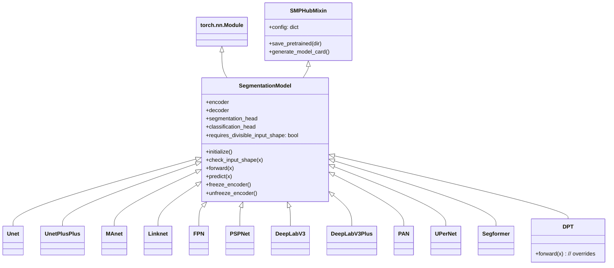
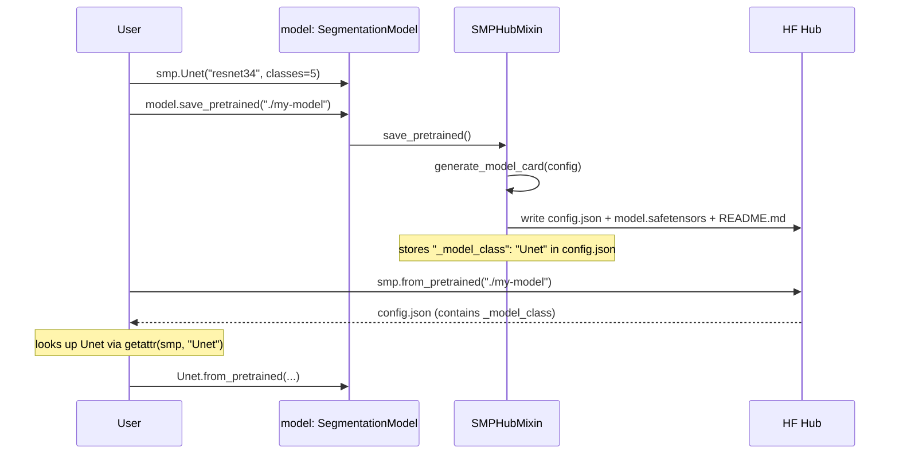
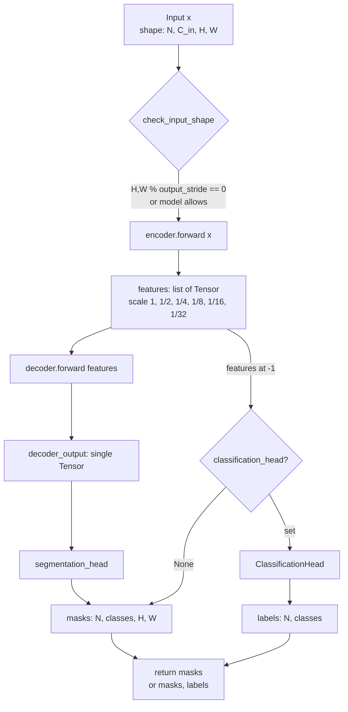

> A reading map of the `segmentation_models_pytorch` codebase: how its packages
> are layered, what each class is responsible for, and which OOP patterns hold
> the whole thing together.
>
> Source explored: `segmentation_models_pytorch/` (commit on `main`, May 2026).

---

## 1. Bird's-eye view

SMP is, at its core, a **library for assembling semantic segmentation models
from three swappable parts**:

```
  Input image
       │
       ▼
   ┌────────────┐      ┌────────────┐      ┌──────────────────┐
   │  ENCODER   │ ───▶ │  DECODER   │ ───▶ │ SEGMENTATION HEAD│ ──▶ mask
   │ (backbone) │      │            │      └──────────────────┘
   └──────┬─────┘      └────────────┘
          │
          │   (optional, from deepest feature)
          ▼
   ┌──────────────────────┐
   │ CLASSIFICATION HEAD  │ ──▶ labels (aux output)
   └──────────────────────┘
```

Every user-facing model (`Unet`, `FPN`, `DeepLabV3+`, `Segformer`, `DPT`, …)
inherits from a single base class — `SegmentationModel` — and merely chooses
*which* encoder, decoder, and head to plug into this pipeline.

This single design decision drives almost every other shape in the codebase.

---

## 2. Top-level package layout

```
segmentation_models_pytorch/
├── __init__.py          ← public API + create_model() factory
├── __version__.py
├── base/                ← abstract model, head, modules, HF-Hub mixin
│   ├── model.py            (SegmentationModel)
│   ├── heads.py            (SegmentationHead, ClassificationHead)
│   ├── modules.py          (Conv2dReLU, Activation, Attention, SCSE…)
│   ├── initialization.py
│   ├── hub_mixin.py        (SMPHubMixin)
│   └── utils.py
├── encoders/            ← backbones + EncoderMixin contract + factory
│   ├── _base.py            (EncoderMixin)
│   ├── _utils.py           (patch_first_conv, dilation helpers)
│   ├── resnet.py / vgg.py / densenet.py / efficientnet.py / …
│   ├── mix_transformer.py / mobileone.py / senet.py / …
│   ├── timm_universal.py   (TimmUniversalEncoder)
│   ├── timm_vit.py         (TimmViTEncoder)
│   └── __init__.py         (registry + get_encoder())
├── decoders/            ← one sub-package per architecture (12 of them)
│   ├── unet/  unetplusplus/  manet/  linknet/
│   ├── fpn/   pspnet/  deeplabv3/   pan/
│   ├── upernet/  segformer/  dpt/
│   └── (each has decoder.py + model.py)
├── losses/              ← Dice, Jaccard, Focal, Tversky, Lovasz, BCE, CE, MCC
├── metrics/             ← pure functional metrics (iou, f1, precision, …)
├── datasets/            ← OxfordPetDataset (example/demo only)
└── utils/               ← DEPRECATED legacy trainer (warns on import)
```

The `base`, `encoders`, `decoders` triad is the *core*.
`losses`, `metrics`, `datasets` are *peripheral* — used during training but
not coupled to the model classes.

---

## 3. Package responsibilities (Hybrid-Clean view)

If we squint at SMP through the lens of layered architecture, it looks like
this. (SMP is a *library*, not an application — there is no use-case or
infrastructure layer in the strict DDD sense, but the dependency direction is
still clean.)

```
                ┌────────────────────────────────────────────┐
   public API → │  segmentation_models_pytorch/__init__.py   │
                │  • create_model()                           │
                │  • from_pretrained()                        │
                │  • Unet, FPN, DPT, Segformer, …             │
                └─────────────────────┬──────────────────────┘
                                      │ depends on
                                      ▼
                ┌────────────────────────────────────────────┐
   composition→│  decoders/<arch>/model.py                   │
                │  • Architecture-specific model classes     │
                │  • Wire encoder + decoder + heads          │
                └──────┬──────────────┬──────────────┬───────┘
                       │              │              │
                       ▼              ▼              ▼
            ┌────────────────┐ ┌─────────────┐ ┌──────────────┐
   abstract │ base/          │ │ encoders/   │ │ decoders/    │
   layer    │ • Segmentation │ │ • Encoder   │ │ • <arch>/    │
            │   Model        │ │   Mixin     │ │   decoder.py │
            │ • Heads        │ │ • get_encoder│ │              │
            │ • Modules      │ │ • Timm…     │ │              │
            │ • HubMixin     │ │   Encoder   │ │              │
            └────────────────┘ └─────────────┘ └──────────────┘

   peripheral (no inward arrows): losses/, metrics/, datasets/, utils/
```

**Dependency rule**: arrows always point inward, toward the `base/` package.
Decoders depend on `base`; `base` knows nothing about any specific decoder.
This is what makes adding a new architecture (e.g. DPT, added recently) a
purely additive change.

---

## 4. The OOP backbone: `SegmentationModel`

`base/model.py` defines the abstract base that every architecture extends.

```python
class SegmentationModel(torch.nn.Module, SMPHubMixin):
    _is_torch_scriptable  = True
    _is_torch_exportable  = True
    _is_torch_compilable  = True
    requires_divisible_input_shape = True

    def initialize(self):                      # weight init for decoder+heads
    def check_input_shape(self, x):            # H,W divisible by output_stride
    def forward(self, x):                      # encoder → decoder → head(s)
    def predict(self, x):                      # eval-mode inference
    def load_state_dict(self, ...):            # backward-compat key renaming
    def train(self, mode=True):                # respect frozen-encoder flag
    def freeze_encoder(self) / unfreeze_encoder(self)
```

Concrete model subclasses (e.g. `Unet`, `Segformer`) do **not** override
`forward()` in most cases — they just populate three attributes during
`__init__`:

| Attribute              | Required | Source                                  |
|------------------------|----------|-----------------------------------------|
| `self.encoder`         | yes      | `get_encoder(name, ...)`                |
| `self.decoder`         | yes      | architecture-specific `<Arch>Decoder`   |
| `self.segmentation_head` | yes    | `SegmentationHead(...)` (or custom)     |
| `self.classification_head` | no   | `ClassificationHead(...)` or `None`     |

`SegmentationModel.forward()` then does the rest:

```python
def forward(self, x):
    if not (jit.is_scripting() or jit.is_tracing() or is_torch_compiling()):
        self.check_input_shape(x)

    features        = self.encoder(x)            # List[Tensor] @ multi-scale
    decoder_output  = self.decoder(features)
    masks           = self.segmentation_head(decoder_output)

    if self.classification_head is not None:
        labels = self.classification_head(features[-1])
        return masks, labels
    return masks
```

This is the **Template Method** pattern in its purest form: the algorithm is
fixed in the base class; subclasses provide the components.

> Exception: `DPT` overrides `forward()` because its ViT encoder returns
> `(features, prefix_tokens)` — a different output shape — and the decoder
> needs both. The template bends, but doesn't break.

### Multiple inheritance: `SegmentationModel(nn.Module, SMPHubMixin)`

`SMPHubMixin` (in `base/hub_mixin.py`) extends Hugging Face's
`PyTorchModelHubMixin` and adds:

- `save_pretrained(...)` — also writes a model card
- `from_pretrained(...)` — the module-level helper resolves the right class
  via `_model_class` stored in `config.json`
- `generate_model_card(...)` — produces the Jinja-templated README
- `config` property — returns `self._hub_mixin_config`

Mixing this into every model makes **every SMP model Hub-publishable for free**
— no per-model code is needed to support `push_to_hub` / `from_pretrained`.

---

## 5. Class diagram — model side



Each leaf class is small (~150–200 lines including a long docstring). Its only
real job is to construct three sub-modules with the right channel counts.

---

## 6. The decoder package — one sub-package per architecture

```
decoders/
├── unet/
│   ├── decoder.py    ← UnetDecoder, UnetDecoderBlock, UnetCenterBlock (nn.Module)
│   └── model.py      ← class Unet(SegmentationModel)
├── fpn/        … FPNDecoder       + class FPN
├── pspnet/     … PSPDecoder       + class PSPNet
├── deeplabv3/  … two decoders     + DeepLabV3, DeepLabV3Plus
├── pan/        … PANDecoder       + class PAN
├── linknet/    … LinknetDecoder   + class Linknet
├── manet/      … MAnetDecoder     + class MAnet
├── unetplusplus/  …                + class UnetPlusPlus
├── upernet/    … UPerNetDecoder   + class UPerNet
├── segformer/  … SegformerDecoder + class Segformer
└── dpt/        … DPTDecoder, DPTSegmentationHead + class DPT
```

The **per-architecture pattern** is uniform:

- `decoder.py` defines plain `torch.nn.Module` blocks. They consume a list of
  multi-scale feature tensors from any compatible encoder and emit a single
  feature map ready for the segmentation head.
- `model.py` defines the user-facing class. It always:
  1. Calls `super().__init__()` (the `SegmentationModel` constructor).
  2. Builds `self.encoder` via `get_encoder(...)`.
  3. Builds `self.decoder` from the local `decoder.py`.
  4. Builds `self.segmentation_head` (often the shared `SegmentationHead`).
  5. Optionally builds `self.classification_head` from `aux_params`.
  6. Calls `self.initialize()` to apply Kaiming/Xavier init.

> Each `model.py` is decorated with `@supports_config_loading` on `__init__`,
> which strips underscored kwargs so that configs round-tripped through HF
> Hub (which add `_model_class`) deserialize cleanly.

### Example: Unet's `__init__` (abridged)

```python
class Unet(SegmentationModel):
    requires_divisible_input_shape = False     # override from base

    @supports_config_loading
    def __init__(self, encoder_name="resnet34", encoder_depth=5, …,
                 aux_params=None, **kwargs):
        super().__init__()

        self.encoder = get_encoder(encoder_name, in_channels=in_channels,
                                   depth=encoder_depth, weights=encoder_weights,
                                   **kwargs)

        self.decoder = UnetDecoder(
            encoder_channels=self.encoder.out_channels,
            decoder_channels=decoder_channels,
            n_blocks=encoder_depth,
            use_norm=decoder_use_norm,
            add_center_block=encoder_name.startswith("vgg"),
            attention_type=decoder_attention_type,
            interpolation_mode=decoder_interpolation,
        )

        self.segmentation_head = SegmentationHead(
            in_channels=decoder_channels[-1],
            out_channels=classes,
            activation=activation, kernel_size=3,
        )

        self.classification_head = (
            ClassificationHead(in_channels=self.encoder.out_channels[-1],
                               **aux_params)
            if aux_params is not None else None
        )

        self.name = f"u-{encoder_name}"
        self.initialize()
```

All 12 architectures follow this shape — only the decoder type and a few
constructor flags differ.

---

## 7. The encoder package — two ecosystems behind one factory

This is the most architecturally interesting part of SMP.

### 7.1 The `EncoderMixin` contract

```python
class EncoderMixin:
    _is_torch_scriptable = _is_torch_exportable = _is_torch_compilable = True

    @property
    def out_channels(self):  return self._out_channels[: self._depth + 1]
    @property
    def output_stride(self): return min(self._output_stride, 2 ** self._depth)

    def set_in_channels(self, in_channels, pretrained=True):  # patch first conv
    def get_stages(self) -> Dict[int, Sequence[nn.Module]]:   # NotImplemented
    def make_dilated(self, output_stride):                    # 8 or 16
```

Any class that mixes this in must:
- Set `self._out_channels`, `self._depth`, `self._in_channels`, `self._output_stride`.
- Implement `get_stages()` so `make_dilated()` knows which `layer3`/`layer4`
  to convert when DeepLab needs `output_stride=8/16`.
- Implement `forward(x) -> list[Tensor]` returning features at scales
  `[1, 1/2, 1/4, 1/8, 1/16, 1/32]` (in descending resolution order).

### 7.2 Native encoders — multiple inheritance over torchvision

Native backbones inherit from both an existing model class **and** `EncoderMixin`:

```python
class ResNetEncoder(ResNet, EncoderMixin):       # ResNet from torchvision
    def __init__(self, out_channels, depth=5, output_stride=32, **kwargs):
        super().__init__(**kwargs)               # build the torchvision model
        self._depth = depth
        self._out_channels = out_channels
        self._output_stride = output_stride
        del self.fc; del self.avgpool             # we don't need the classifier

    def get_stages(self):
        return {16: [self.layer3], 32: [self.layer4]}

    def forward(self, x) -> list[torch.Tensor]:
        features = [x]
        x = self.conv1(x); x = self.bn1(x); x = self.relu(x); features.append(x)
        x = self.maxpool(x); x = self.layer1(x);              features.append(x)
        x = self.layer2(x);                                    features.append(x)
        x = self.layer3(x);                                    features.append(x)
        x = self.layer4(x);                                    features.append(x)
        return features
```

This is a textbook **Mixin** — `EncoderMixin` adds behavior orthogonal to what
`ResNet` already provides (feature pyramid bookkeeping vs. classification),
without forcing `ResNet` to know about segmentation.

### 7.3 Per-module registry dicts

Each native encoder file exports a small dict, e.g. `resnet_encoders`:

```python
resnet_encoders = {
    "resnet18": {
        "encoder": ResNetEncoder,
        "pretrained_settings": {
            "imagenet": {"repo_id": "smp-hub/resnet18.imagenet", "revision": "…"},
            "ssl":      {"repo_id": "smp-hub/resnet18.ssl",      "revision": "…"},
            …
        },
        "params": {
            "out_channels": [3, 64, 64, 128, 256, 512],
            "block":  BasicBlock,
            "layers": [2, 2, 2, 2],
        },
    },
    "resnet34": { … },
    …
}
```

`encoders/__init__.py` then **flattens these dicts into one global registry**:

```python
encoders = {}
encoders.update(resnet_encoders)
encoders.update(dpn_encoders)
encoders.update(vgg_encoders)
encoders.update(senet_encoders)
encoders.update(densenet_encoders)
encoders.update(inceptionresnetv2_encoders)
encoders.update(inceptionv4_encoders)
encoders.update(efficient_net_encoders)
encoders.update(mobilenet_encoders)
encoders.update(xception_encoders)
encoders.update(timm_efficientnet_encoders)
encoders.update(timm_sknet_encoders)
encoders.update(mix_transformer_encoders)
encoders.update(mobileone_encoders)
```

Adding a new native backbone = create a new file that exports a dict, then
append one `update` line. No central if/else to edit.

### 7.4 `TimmUniversalEncoder` — the Adapter

For the much larger universe of `timm` models, SMP uses an **Adapter** rather
than mixins. `TimmUniversalEncoder` wraps `timm.create_model(features_only=True)`
and normalizes its output to satisfy the encoder contract:

- Detects whether the underlying timm model is **transformer-style** (scales
  4, 8, 16, 32), **traditional-style** (2, 4, 8, 16, 32), or **VGG-style**
  (1, 2, 4, 8, 16, 32) by inspecting `feature_info.reduction()`.
- Inserts a dummy zero-channel scale-1/2 feature for transformer-style models
  so all encoders look the same to the decoders.
- Handles `NHWC` (channels-last) timm models by permuting back to `NCHW`.

`TimmViTEncoder` is a separate, ViT-specialized adapter used by `DPT`, since
ViT features need additional context (prefix tokens, varying patch sizes).

### 7.5 `get_encoder()` — the dispatching factory

```python
def get_encoder(name, in_channels=3, depth=5, weights=None,
                output_stride=32, **kwargs):
    if name.startswith("timm-"):      # legacy alias → convert to tu-
    if name.startswith("tu-"):        # universal timm path
        return TimmUniversalEncoder(name[3:], …)
    if name not in encoders: raise KeyError(...)

    EncoderClass = encoders[name]["encoder"]
    encoder = EncoderClass(**encoders[name]["params"], depth=depth,
                           output_stride=output_stride)
    if weights is not None:
        # download via HF Hub, fall back to original url
        encoder.load_state_dict(state_dict)

    encoder.set_in_channels(in_channels, pretrained=weights is not None)
    if output_stride != 32:
        encoder.make_dilated(output_stride)
    return encoder
```

The factory hides three different code paths (native, deprecated `timm-`, and
modern `tu-`) behind a single string-name API. Decoders never know which path
their encoder came from — they only see `encoder.out_channels`, `output_stride`,
and a `forward(x) -> list[Tensor]`.

---

## 8. Building blocks (`base/modules.py`, `base/heads.py`)

Reusable pieces used across decoders:

| Class              | Kind        | Purpose                                       |
|--------------------|-------------|-----------------------------------------------|
| `Conv2dReLU`       | `nn.Sequential` | Conv → norm → ReLU; norm chosen by `get_norm_layer` (`batchnorm` / `layernorm` / `instancenorm` / `identity` / `inplace`). |
| `SCSEModule`       | `nn.Module` | Spatial + channel squeeze-and-excitation block. |
| `Attention`        | `nn.Module` | Dispatcher: `None`/`"scse"` → identity / SCSE. |
| `Activation`       | `nn.Module` | String → activation class (sigmoid, softmax2d, tanh, argmax, clamp, custom callable). |
| `SegmentationHead` | `nn.Sequential` | Conv2d → optional bilinear upsample → activation. |
| `ClassificationHead` | `nn.Sequential` | Pool → Flatten → Dropout → Linear → activation. |

`Activation` and `Attention` are tiny **Strategy** classes — they dispatch by
name at construction time so user-facing kwargs can stay strings.

---

## 9. Losses (`losses/`)

```
losses/
├── constants.py          BINARY_MODE / MULTICLASS_MODE / MULTILABEL_MODE
├── _functional.py        soft_dice_score, soft_tversky_score, focal_loss_with_logits, …
├── dice.py               DiceLoss(_Loss)
├── jaccard.py            JaccardLoss(_Loss)
├── focal.py              FocalLoss(_Loss)
├── lovasz.py             LovaszLoss(_Loss)
├── tversky.py            TverskyLoss(_Loss)
├── mcc.py                MCCLoss(_Loss)
├── soft_bce.py           SoftBCEWithLogitsLoss(_Loss)
└── soft_ce.py            SoftCrossEntropyLoss(_Loss)
```

All losses derive from `torch.nn.modules.loss._Loss` and share a common
constructor surface:

- `mode`: one of the three constants — selects how labels are interpreted.
- `from_logits=True`: convention is to take raw logits, apply sigmoid/softmax
  inside the loss.
- `classes`, `ignore_index`, `smooth`, `eps`, `class_weights`: standard knobs.

Losses are **completely decoupled from the model classes** — they are just
PyTorch `_Loss` modules and can be used with any segmentation pipeline.

---

## 10. Metrics (`metrics/`)

Unlike losses, metrics are **purely functional** — no classes, no state:

```python
from segmentation_models_pytorch import metrics as M
tp, fp, fn, tn = M.get_stats(pred, target, mode="multilabel", threshold=0.5)
iou  = M.iou_score(tp, fp, fn, tn, reduction="micro")
f1   = M.f1_score(tp, fp, fn, tn, reduction="macro")
```

Everything is built on top of the four confusion-matrix tensors. This split
("compute stats once, derive many metrics") avoids recomputing the heavy
per-image confusion matrix when you need multiple metrics.

---

## 11. Persistence: Hugging Face Hub integration



`smp.from_pretrained` (a module-level function, not a method) is the entry
point: it reads `config.json`, extracts `_model_class`, and dispatches to the
correct concrete class. This is what lets a single URL resolve to *any* of
the 12 architectures without the user knowing which one.

---

## 12. The forward-pass flow, end-to-end



> `check_input_shape` is skipped during `torch.jit.trace`, `torch.jit.script`,
> and `torch.compile` so the dynamic-shape check doesn't break graph capture.

---

## 13. OOP patterns at a glance

| Pattern              | Where it appears                                      | Why                                                                 |
|----------------------|-------------------------------------------------------|---------------------------------------------------------------------|
| **Template Method**  | `SegmentationModel.forward()`                         | Fixed pipeline; subclasses fill in slots.                           |
| **Factory**          | `create_model()`, `get_encoder()`, `from_pretrained()`| Build complex objects from simple string names.                     |
| **Registry**         | `encoders` dict, `MODEL_ARCHITECTURES_MAPPING`        | Open/closed: add a backbone or arch without editing dispatch code.  |
| **Mixin**            | `EncoderMixin`, `SMPHubMixin`                         | Orthogonal capabilities grafted onto existing classes.              |
| **Adapter**          | `TimmUniversalEncoder`, `TimmViTEncoder`              | Conform `timm` models to SMP's encoder contract.                    |
| **Strategy**         | `Activation`, `Attention`, `get_norm_layer`           | Pick implementation by name string.                                 |
| **Composite**        | `SumOfLosses`, `MultipliedLoss` (legacy `utils/`)     | Build complex losses by `+` / `*` operators.                        |

---

## 14. Adding new things — extension points

The codebase makes three additions trivial; the rest are harder.

**Easy — add a new encoder (native):**
1. Create `encoders/my_backbone.py` exporting:
   - `class MyEncoder(SomeBackbone, EncoderMixin): …`
   - `my_encoder_dict = {"my_backbone_v1": {"encoder": MyEncoder, "pretrained_settings": {...}, "params": {...}}}`
2. Add `from .my_backbone import my_encoder_dict` and `encoders.update(my_encoder_dict)` to `encoders/__init__.py`.

**Easy — use any timm backbone:** just pass `encoder_name="tu-<timm_model_name>"`. No code change.

**Medium — add a new architecture:**
1. Create `decoders/myarch/decoder.py` with `nn.Module`-based decoder blocks.
2. Create `decoders/myarch/model.py` with `class MyArch(SegmentationModel)` that wires encoder + decoder + heads.
3. Register it in the top-level `__init__.py` (`from .decoders.myarch import MyArch` and add to `_MODEL_ARCHITECTURES`).

**Medium — add a loss/metric:** drop a file in `losses/` (inherits `_Loss`)
or `metrics/functional.py` (pure function on `tp/fp/fn/tn`). Re-export it.

**Hard — change the universal forward signature:** because every decoder
assumes `encoder(x) -> list[Tensor]` and `decoder(features) -> Tensor`,
anything that breaks this contract (like `DPT`) must override `forward()` and
take care not to break torchscript/torchcompile flags.

---

## 15. Public API surface (what `import segmentation_models_pytorch as smp` exposes)

```python
# Sub-packages
smp.encoders, smp.decoders, smp.losses, smp.metrics, smp.datasets

# Model classes (all subclass SegmentationModel)
smp.Unet, smp.UnetPlusPlus, smp.MAnet, smp.Linknet, smp.FPN, smp.PSPNet,
smp.DeepLabV3, smp.DeepLabV3Plus, smp.PAN, smp.UPerNet, smp.Segformer, smp.DPT

# Factory + Hub helpers
smp.create_model(arch="unet", encoder_name="resnet34", ...)
smp.from_pretrained("smp-hub/some-checkpoint")

# Misc
smp.__version__
```

`smp.utils` is still importable but emits a `DeprecationWarning` on import —
it is the *old* trainer (Epoch, Metric, Loss with operator overloading) kept
only for backward compatibility.

---

## 16. Reading order for a newcomer

If you want to read SMP top-down once and have it stick, this order works well:

1. `segmentation_models_pytorch/__init__.py` — see what's exported and how.
2. `base/model.py` — understand the universal `forward()`.
3. `base/heads.py`, `base/modules.py` — small reusable pieces.
4. `encoders/_base.py` + `encoders/resnet.py` — the encoder contract and a
   canonical implementation.
5. `encoders/__init__.py` + `encoders/timm_universal.py` — the factory and
   the timm adapter.
6. `decoders/unet/{decoder,model}.py` — the simplest end-to-end arch.
7. `decoders/dpt/model.py` — the one case where `forward()` is overridden,
   to see where the template intentionally bends.
8. `losses/dice.py` and `metrics/functional.py` — to see the
   *unrelated-to-models* peripheral packages.

---

## 17. Summary

SMP gets its expressive power from a single architectural choice:
**every model is a fixed 3-stage pipeline, and every backbone obeys a small
explicit contract**. From that, the rest follows naturally —

- `SegmentationModel` owns the pipeline (Template Method).
- `EncoderMixin` + `TimmUniversalEncoder` give backbones a uniform interface
  (Mixin + Adapter).
- Registry dicts + factory functions turn string names into objects without
  central dispatch code.
- Losses and metrics stay decoupled because they touch only tensors, not
  models.

The code is small in surface area for what it offers: 12 segmentation
architectures × ~800 encoder variants, all behind two function calls
(`smp.create_model` and `smp.from_pretrained`).
