> Source: <https://github.com/TorchIO-project/torchio> · Analyzed: 2026-06-11 · Version: 1.2.1 · Type: Library / Package (with a thin CLI surface → mild Hybrid)

---

## 1. Overview

**TorchIO** is a Python library for **efficient loading, preprocessing, augmentation, and patch-based sampling of 3D (and 2D/4D) medical images** for deep learning with PyTorch. It targets the realities of medical imaging — large volumetric files, physical-space (affine) geometry, multi-modal subjects, and segmentation labels — that generic vision augmentation tools handle poorly.

The mental model is small and composable:

```
Image  ──compose──▶  Subject  ──wrap──▶  SubjectsDataset  ──sample──▶  Queue/Loader  ──▶  PyTorch model
  ▲                                                    │
  └──────────────── Transform pipeline ────────────────┘  (preprocessing + augmentation)
```

### Repo classification — **Library / Package** (mild Hybrid)

| Signal | Evidence |
|--------|----------|
| Public API meant to be **imported** | `src/torchio/__init__.py` curates the `tio.*` surface (`ScalarImage`, `Subject`, transforms, samplers, …) |
| Distribution metadata | `pyproject.toml`: `name = "torchio"`, `src/`-layout package, `py.typed` marker, semver `1.2.1` |
| Defines abstractions for callers | `Transform(ABC)`, `Image`, `PatchSampler` base classes |
| Thin **runnable** surface → Hybrid | three console scripts in `pyproject.toml`: `tiohd`, `tiotr`, `torchio-transform` |

It is therefore documented primarily as a **library** (public API, class design, usage flows), with a short note on the CLI.

### Tech stack

| Concern | Dependency |
|---------|-----------|
| Tensors, `Dataset`/`DataLoader` | `torch` (≥1.9) |
| Medical image I/O | `SimpleITK` (DICOM, resampling, interpolation) + `nibabel` (NIfTI) |
| Numerics | `numpy`, `scipy`, `einops` |
| Typing | `jaxtyping` (shaped tensor hints), `py.typed` |
| CLI / display | `typer`, `rich`, `tqdm`, `humanize` |
| Citation / deprecation | `duecredit` (via `external/`), `deprecated` |
| Optional extras | `pandas` (csv), `matplotlib`+`colorcet` (plot), `ffmpeg-python` (video), `scikit-learn` (PCA), `monai` (adapter) |

---

## 2. System Context (C4 Level 1)

Who calls TorchIO, and what it depends on.

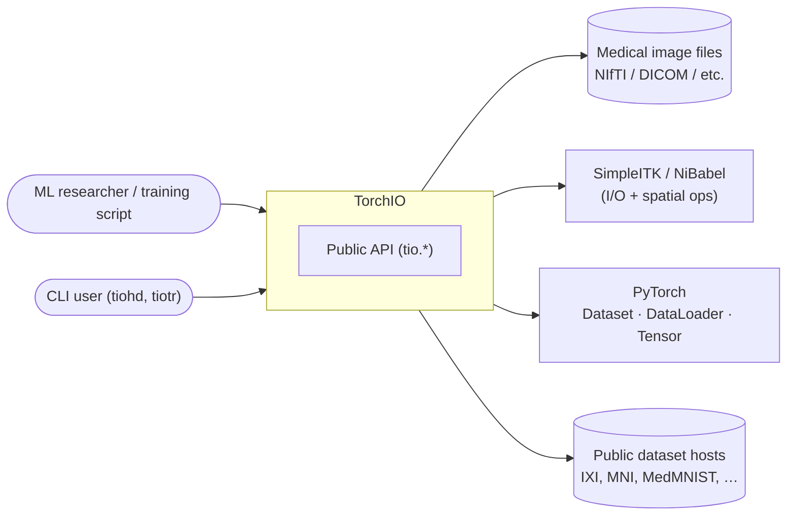

- **Inbound:** a training script imports `torchio as tio`; or a user runs the CLI to inspect/transform a file.
- **Outbound:** TorchIO reads/writes images through SimpleITK/NiBabel, hands batches to PyTorch's `DataLoader`, and can auto-download built-in datasets.

---

## 3. High-Level Structure (C4 Level 2)

Top-level packages inside `src/torchio/` and the **direction of dependencies** (arrow = "depends on / imports").

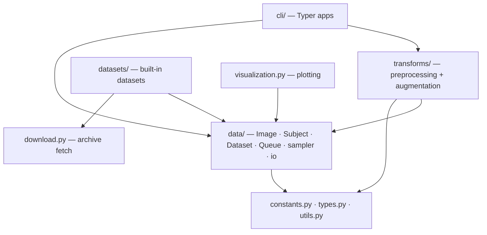

| Path | Responsibility |
|------|----------------|
| `src/torchio/data/` | Core domain: `Image`/`ScalarImage`/`LabelMap`, `Subject`, `SubjectsDataset`, `Queue`, `SubjectsLoader`, samplers, `GridAggregator`, I/O (`io.py`) |
| `src/torchio/transforms/` | The transform engine: `Transform` base + preprocessing & augmentation transforms, `Compose`/`OneOf` |
| `src/torchio/datasets/` | Ready-made `SubjectsDataset` subclasses (IXI, MNI templates, MedMNIST3D, RSNA, …) |
| `src/torchio/cli/` | `apply_transform.py` (→ `tiotr`/`torchio-transform`), `print_info.py` (→ `tiohd`) |
| `src/torchio/visualization.py` | Matplotlib-based slicing, GIF/video export |
| `src/torchio/download.py` | Torchvision-style download + MD5 integrity + extract |
| `src/torchio/constants.py` | Magic strings/keys: `INTENSITY`, `LABEL`, `DATA`, `AFFINE`, `TYPE`, `PATH`, `STEM`, `LOCATION` |
| `src/torchio/types.py` | `jaxtyping`-based aliases (`TypeData`, `TypeAffineMatrix`, spacing/tuple types) |
| `src/torchio/utils.py` | Helpers (`to_tuple`, `get_stem`, collation, conversions) |
| `src/torchio/reference.py`, `external/` | Citation metadata (`duecredit`), lazy optional imports |

**Layering rule of thumb:** everything flows *down* to `data/`, which flows *down* to the foundation modules. `data/` never imports `transforms/` (except for type-only references), keeping the core decoupled from the augmentation engine.

---

## 4. Components (C4 Level 3)

### 4a. Data layer

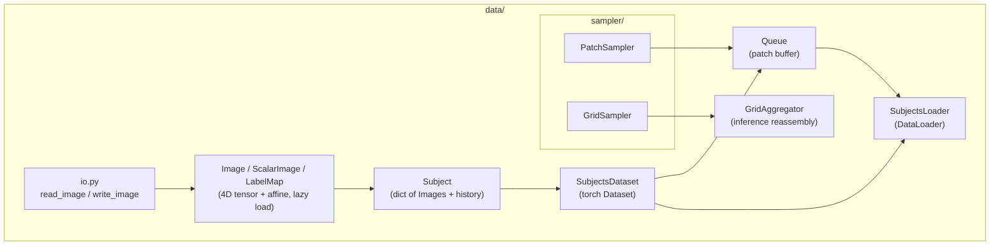

- `io.py` chooses a backend (SimpleITK first, NiBabel fallback) to materialize an `Image`'s tensor + affine.
- `Queue` composes a `SubjectsDataset` **and** a `PatchSampler` to stream patches; `SubjectsLoader` is the `DataLoader` that batches `Subject`s with TorchIO-aware collation.
- For sliding-window inference, `GridSampler` enumerates patch locations and `GridAggregator` stitches predictions back into a full volume.

### 4b. Transforms layer

```mermaid
flowchart TD
    call["transform(input)"]
    parser["DataParser<br/>normalize input → Subject"]
    base["Transform.__call__<br/>(probability · copy · include/exclude)"]
    apply["apply_transform(subject)<br/>(subclass-specific)"]
    history["record in Subject history"]

    call --> parser --> base --> apply --> history --> parser
```

A transform accepts a `Subject`, `Image`, `torch.Tensor`, `np.ndarray`, `SimpleITK.Image`, `nibabel` image, or `dict`. `DataParser` normalizes it to a `Subject`, the base orchestrates the call, the subclass does the work in `apply_transform`, the result is recorded for reproducibility, then converted back to the caller's original type.

---

## 5. OOP & Class Architecture

### 5.1 Domain primitives — `Image` and `Subject`

Both extend `dict` so metadata is just key/value data, while protected keys (`DATA`, `AFFINE`, `TYPE`, …) carry the structured payload. Data is **lazy-loaded** on first access.

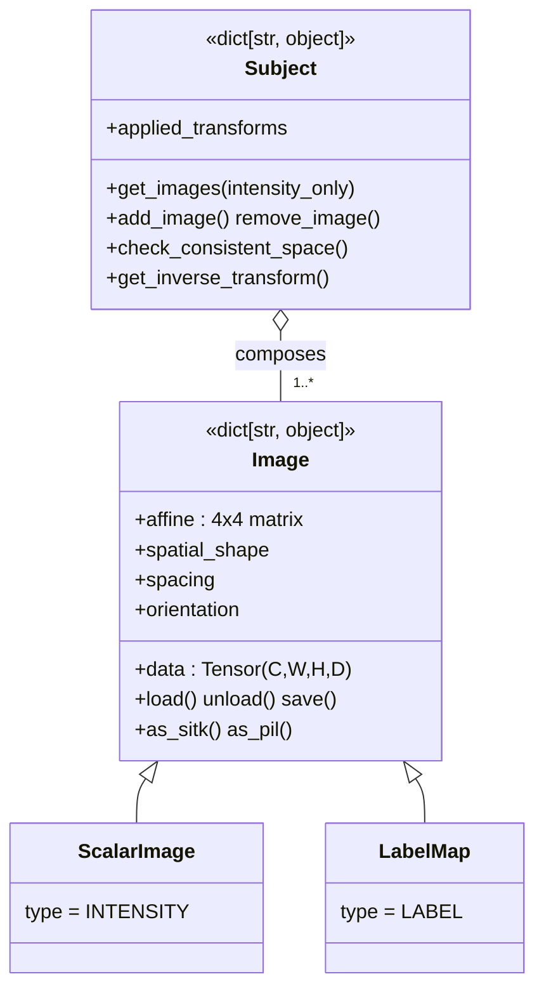

- **Pattern — lazy-loading via dict:** memory is only spent when `.data` is touched, so a `SubjectsDataset` of thousands of volumes stays cheap until `__getitem__`.
- **Pattern — Composition:** a `Subject` *has* many `Image`s (e.g. `t1`, `t2`, `label`) and enforces they share physical space.

### 5.2 The transform hierarchy — base, mixins, and the random/deterministic pair

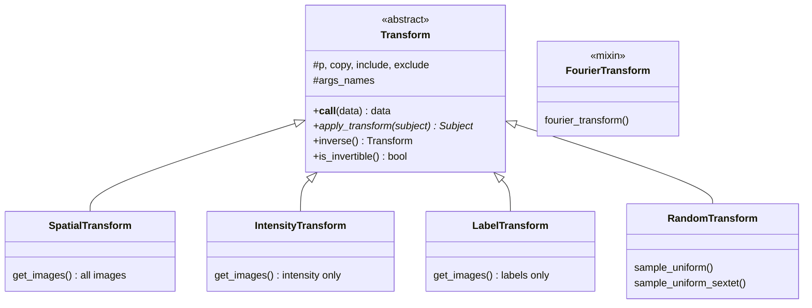

`Transform` is an `ABC` (`transforms/transform.py:56`). `__call__` is **overloaded** (one signature per accepted input type) and acts as a Template Method: it parses input, applies the probability gate `p`, optionally deep-copies, calls the abstract `apply_transform` (`:254`), and records history. Subclasses only implement `apply_transform`.

**The signature pattern — `RandomX` delegates to deterministic `X`:**

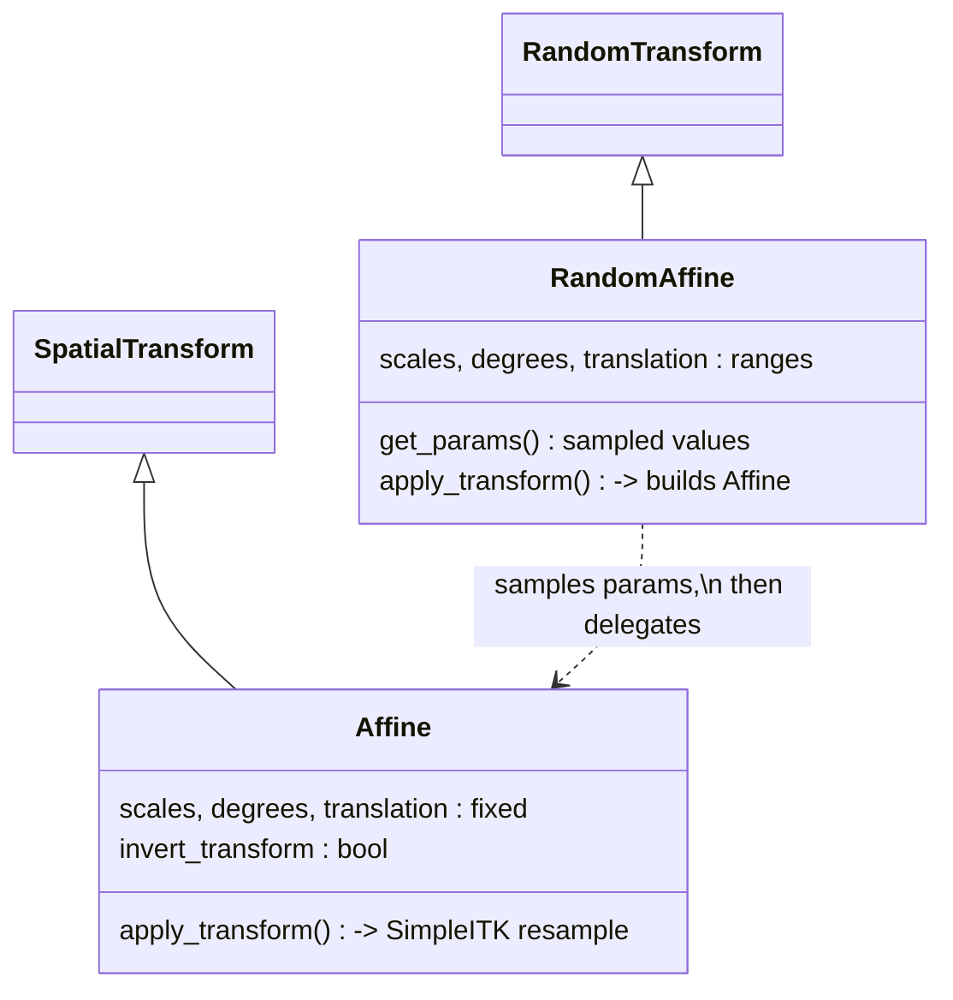

A random transform (e.g. `RandomAffine`, `RandomGamma`, `RandomNoise`) **samples** its parameters, then constructs and calls the matching deterministic transform (`Affine`, `Gamma`, `Noise`) with those concrete values. Benefits: the actual math lives in one place, deterministic transforms are usable standalone, and the sampled parameters are recorded in the subject's history for exact reproducibility.

**Composites:**

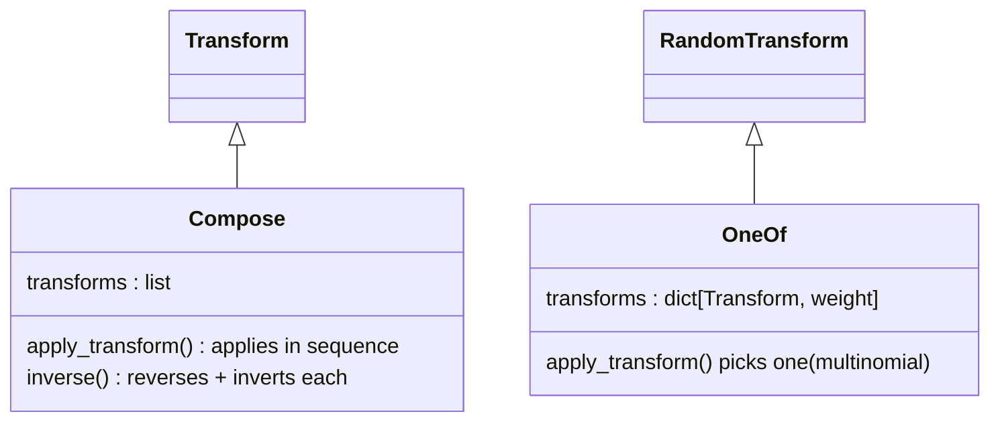

`Compose` and `OneOf` are themselves `Transform`s holding other transforms — a **Composite pattern** that lets a whole pipeline be passed wherever a single transform is expected.

### 5.3 Sampler hierarchy

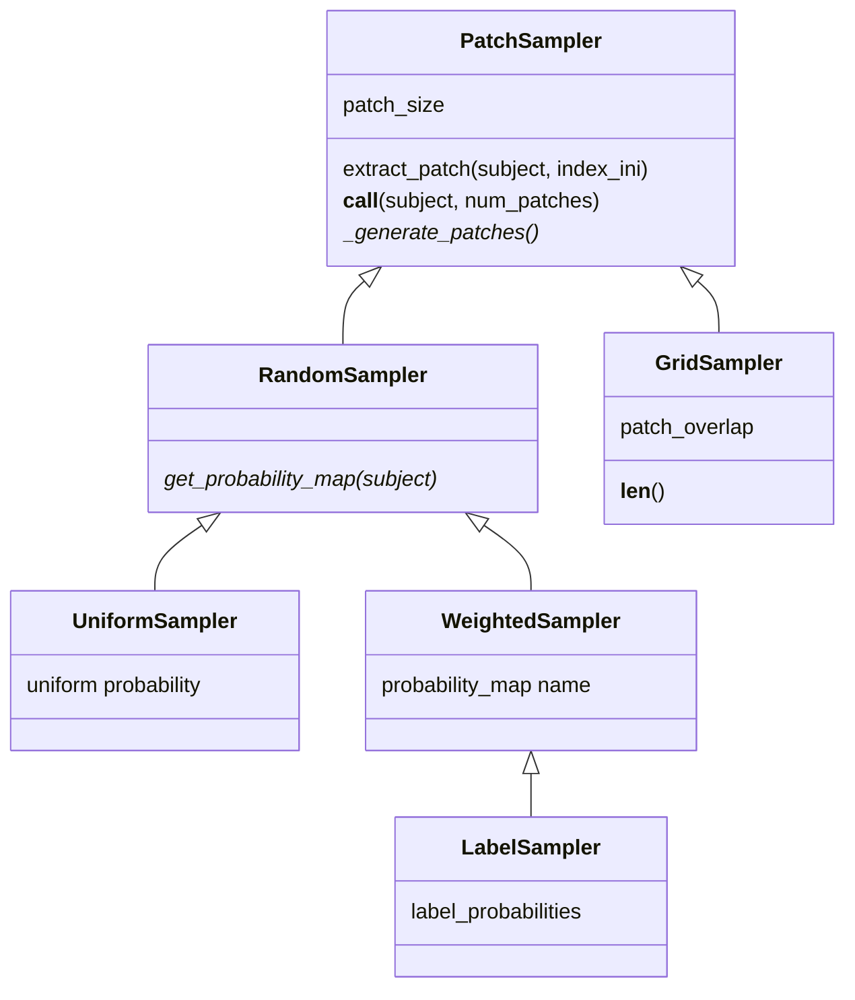

- **Template Method again:** `PatchSampler.__call__` drives patch generation; subclasses fill in `_generate_patches` / `get_probability_map`.
- `GridSampler` is **deterministic** (regular grid → used for inference with `GridAggregator`); the `RandomSampler` branch is **stochastic** (training).
- `LabelSampler` specializes `WeightedSampler` to build class-balanced probability maps from a label image.

### 5.4 Dataset, Queue, Loader

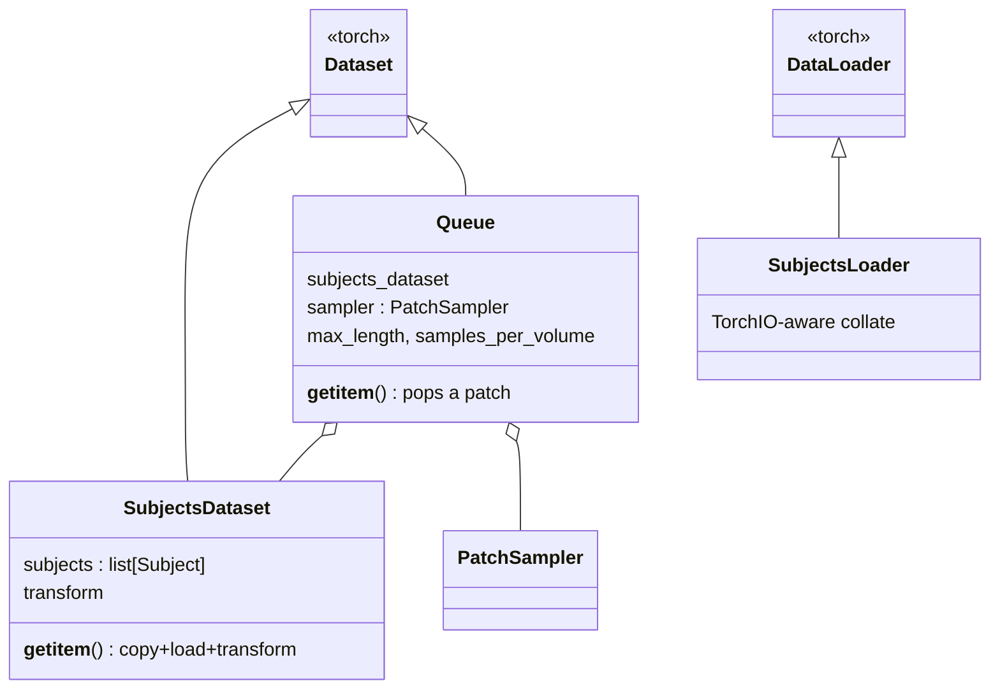

`Queue` *is* a `Dataset` that *composes* a `SubjectsDataset` + a `PatchSampler` — inheritance for the PyTorch contract, composition for the behavior.

### Design patterns in use — summary

| Pattern | Where | Why |
|---------|-------|-----|
| **Template Method** | `Transform.__call__` → `apply_transform`; `PatchSampler.__call__` → `_generate_patches` | Fix the algorithm skeleton; let subclasses fill the variable step |
| **Random → Deterministic delegation** | `RandomAffine`→`Affine`, `RandomGamma`→`Gamma`, … | Single implementation, standalone reuse, reproducible sampling |
| **Mixin / intermediate base** | `SpatialTransform`, `IntensityTransform`, `LabelTransform`, `FourierTransform` | Share image-selection / FFT behavior across many transforms |
| **Composite** | `Compose`, `OneOf` | A pipeline is itself a `Transform` |
| **Lazy loading via dict** | `Image`, `Subject` | Defer expensive volume reads until accessed |
| **Composition over inheritance** | `Subject`↔`Image`, `Queue`↔(`SubjectsDataset`,`PatchSampler`), `GridAggregator`↔`GridSampler` | Flexible, heterogeneous wiring |

---

## 6. Key Flows

### 6.1 Applying an augmentation

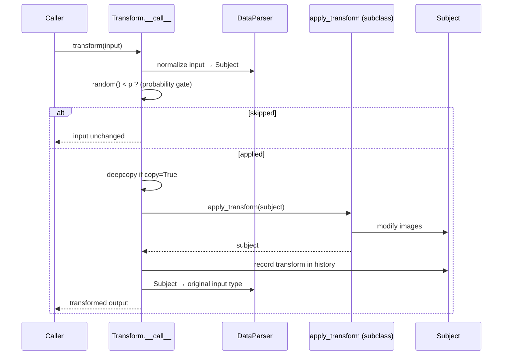

For a `RandomAffine`, the `apply_transform` step additionally samples parameters and delegates to a concrete `Affine` (§5.2) before returning.

### 6.2 Patch-based training

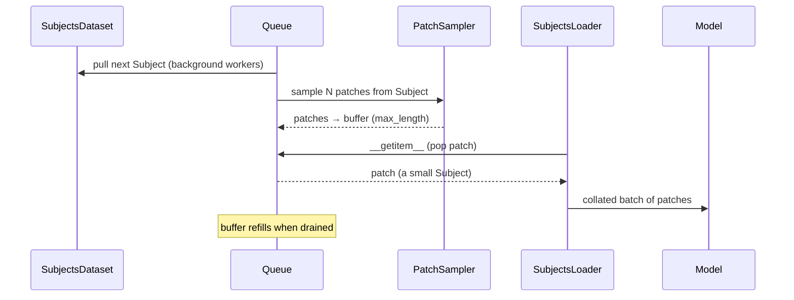

For inference the dual flow applies: `GridSampler` enumerates fixed locations → model predicts each patch → `GridAggregator.add_batch(...)` → `get_output_tensor()` reconstructs the full volume (with `crop` / `average` / `hann` overlap handling).

---

## 7. Extension Points

| To customize… | Do this |
|----------------|---------|
| A new transform | Subclass `Transform` (or a mixin like `IntensityTransform`/`SpatialTransform`) and implement `apply_transform(subject)`; list configurable attrs in `args_names` for reproducibility |
| A reproducible random transform | Subclass `RandomTransform`, sample params, delegate to a deterministic counterpart |
| An invertible transform | Set `invert_transform`, branch on it inside `apply_transform`; `inverse()` toggles the flag |
| An inline/one-off transform | Use `Lambda` (`transforms/lambda_transform.py`) to wrap a callable |
| Reuse MONAI transforms | `transforms/monai_adapter.py` bridges MONAI into the TorchIO pipeline |
| A new patch-sampling strategy | Subclass `PatchSampler` (deterministic) or `RandomSampler` and implement `get_probability_map` / `_generate_patches` |
| A new built-in dataset | Subclass `SubjectsDataset`, build the `Subject` list (optionally via `download.py`) |
| Selective application | Use the built-in `include` / `exclude` / `p` args on any transform — no subclassing needed |

---

## 8. Key Abstractions / Glossary

| Term | Meaning |
|------|---------|
| **Image** | 4D tensor `(channels, W, H, D)` + a 4×4 **affine** mapping voxel indices → physical (world) coordinates |
| **ScalarImage** vs **LabelMap** | Intensity data (interpolated continuously) vs discrete segmentation labels (nearest-neighbor) |
| **Subject** | One scanned subject = a dict of co-registered `Image`s sharing physical space, plus transform history |
| **affine / physical space** | The geometry that lets spatial transforms (resample, affine, flip) act in millimeters, not just voxels |
| **Transform** | A `Subject → Subject` operation; preprocessing (deterministic) or augmentation (often random) |
| **Invertibility** | Some transforms can be reversed (`inverse()`), e.g. for test-time augmentation or undoing preprocessing |
| **Patch** | A small sub-volume cropped from a `Subject` for memory-bounded training |
| **Queue** | A background buffer of patches that decouples CPU loading/sampling from GPU training |
| **GridSampler / GridAggregator** | Deterministic sliding-window splitting (sampler) and reassembly of predictions (aggregator) for inference |

---

## 9. Open Questions & Notes

- **Confidence:** Every class, base class, file path, and inheritance edge above was verified directly against the source (`rg` on `src/torchio/`). The package-layout `__init__.py` import wiring and the random→deterministic pairing were confirmed for representative cases (`RandomAffine`/`Affine`, `RandomGamma`/`Gamma`).
- **Not deeply traced** (treated as black boxes here): the exact numerical algorithms inside `GridAggregator` overlap modes (`crop`/`average`/`hann`), the Fourier-artifact math in `Motion`/`Ghosting`/`Spike`, and the depth of the MONAI adapter's two-way mapping. These are implementation detail rather than architecture.
- **CLI** is intentionally covered lightly (it is a thin Typer wrapper that resolves a transform by name and applies it); the library API is the architecturally significant surface.
- **`args_names` / history**: reproducibility hinges on each transform faithfully listing its parameters in `args_names`; a custom transform that omits this will still run but won't be perfectly reproducible from history.
