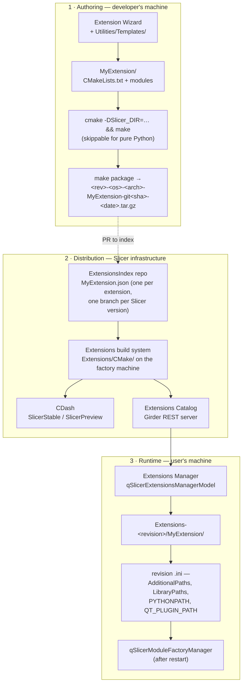
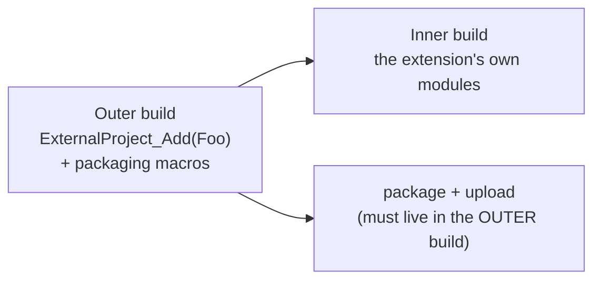
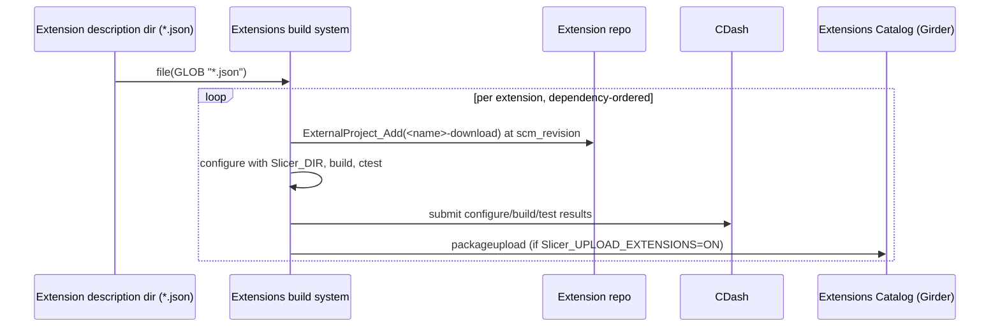
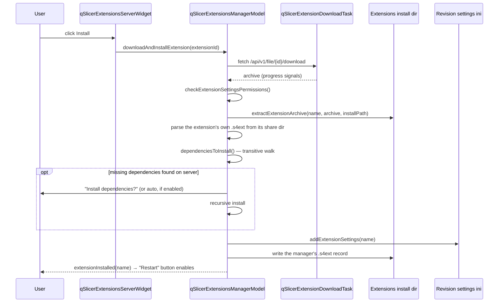
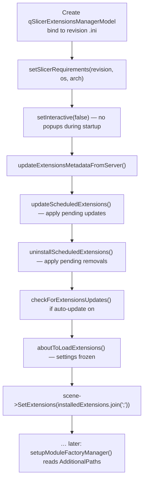
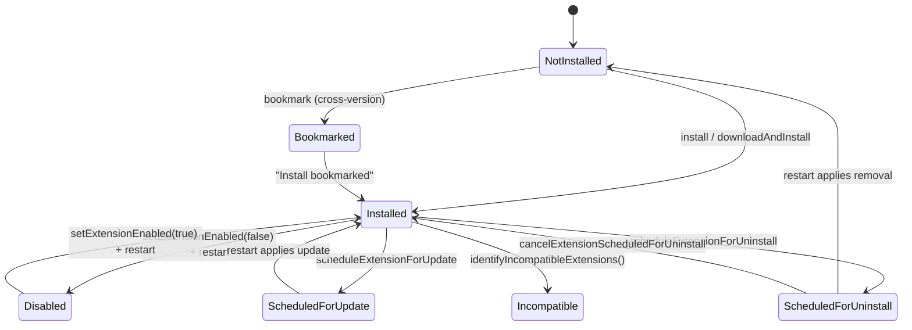
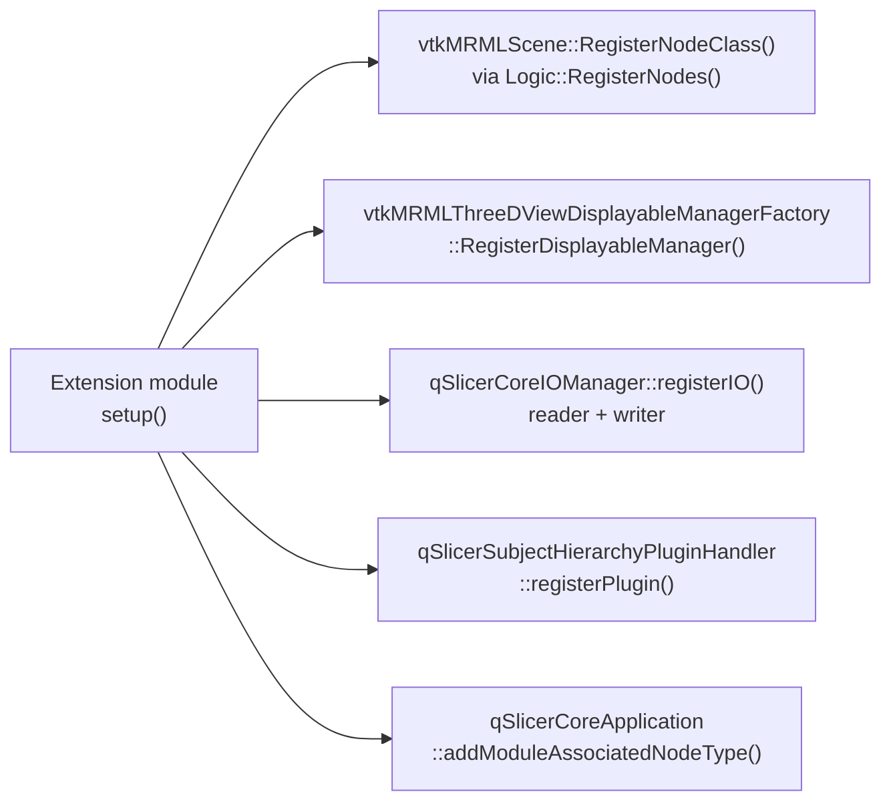

> Source: `https://github.com/slicer/slicer.git` (branch `main`, Slicer 5.11.0, commit `dfcce2e5f9`) · Date: 2026-09-04 · Mode: Explain
> See also: [System & OOP Architecture](/case-studies/apps/slicer_system_oop_architecture/) · [Surface Architecture (UX/DX)](/case-studies/apps/slicer_ux_design/) · [Data Architecture](/case-studies/apps/slicer_data_architecture/)

---

## 1. What an extension actually is

The project's own one-line definition (`Docs/user_guide/extensions.md`):

> "An extension is a delivery package that bundles one or more Slicer modules. Once
> installed, the associated modules appear in 3D Slicer just like built-in ones."

Two words carry the whole design.

**"Delivery package."** An extension is *not* a runtime concept. Slicer has no plugin API, no
`Extension` base class, no lifecycle callbacks. Grep the codebase for a class representing an
installed extension and you find `qSlicerExtensionsManagerModel` — a **package manager**, not
a plugin host. Once an extension is unpacked and its paths are registered, the extension
ceases to exist as far as the running application is concerned.

**"Just like built-in ones."** There is exactly one loading path. `qSlicerModuleFactoryManager`
scans directories and instantiates whatever modules it finds — it cannot tell a core module
from an extension module, and no code asks. An extension is therefore not *hosted*; it is
**merged**.

```
                  ┌──────────────────────────────────────────────┐
   Extension  =   │  a ZIP/TGZ of module binaries and scripts    │
                  │  + one .s4ext metadata file                  │
                  └──────────────────────────────────────────────┘
                                     │
                       unpack + register 4 search paths
                                     ▼
                  ┌──────────────────────────────────────────────┐
   Runtime    =   │  the ordinary module factory manager, with   │
                  │  a longer list of directories to scan        │
                  └──────────────────────────────────────────────┘
```

Everything else in this document is machinery around that one idea.

---

## 2. The three layers



The separation is strict and worth naming, because it explains most of the friction users
report: **the layer that builds an extension and the layer that installs it never talk
directly.** A developer pushes a *pointer* (a JSON file naming a git URL + revision) into the
index; a nightly farm turns that pointer into per-platform packages; only then can a user
install one.

---

## 3. Layer 1 — Authoring

### 3.1 The scaffold

`Modules/Scripted/ExtensionWizard` generates a working extension from
`Utilities/Templates/`. Available templates in this checkout:

| Kind | Template | Produces |
|---|---|---|
| Extension | `Extensions/Default` | Plain extension, `find_package(Slicer)` + `add_subdirectory` per module |
| Extension | `Extensions/SuperBuild` | Extension that builds its own third-party dependencies first |
| Module | `Modules/CLI` | C++ SlicerExecutionModel executable + XML |
| Module | `Modules/ScriptedCLI` | Python SEM executable |
| Module | `Modules/Loadable` | C++ Qt module (`qSlicer<Name>Module` + Logic + Widgets) |
| Module | `Modules/Scripted` | Python `ScriptedLoadableModule` |
| Module | `Modules/LoadableCustomMarkups` | Full custom MRML type: `MRML/`, `VTKWidgets/`, `Logic/`, `Widgets/` |
| Module | `Modules/ScriptedSegmentEditorEffect` | A Segment Editor effect |

The `LoadableCustomMarkups` template is the interesting one: it is the scaffold for the
**ten-file pattern** the developer guide describes for introducing a genuinely new data type
(data node, display node, widget, widget representation, displayable manager, storage node,
reader, writer, subject-hierarchy plugin, module).

### 3.2 The extension's `CMakeLists.txt` — metadata as build variables

The entire extension identity lives in CMake variables, verified against
`Utilities/Templates/Extensions/Default/CMakeLists.txt`:

```cmake
cmake_minimum_required(VERSION 3.20.6...3.22.6 FATAL_ERROR)

project(TemplateKey)                         # required since Slicer r22038

set(EXTENSION_HOMEPAGE      "https://…")
set(EXTENSION_CONTRIBUTORS  "John Doe (AnyWare Corp.)")
set(EXTENSION_DESCRIPTION   "This is an example of a simple extension")
set(EXTENSION_ICONURL       "https://…/TemplateKey.png")
set(EXTENSION_SCREENSHOTURLS "https://…/1.png")
set(EXTENSION_DEPENDS       "NA")            # or a list of extension names

find_package(Slicer REQUIRED)
include(${Slicer_USE_FILE})

## NEXT_MODULE                               # wizard's insertion marker

include(${Slicer_EXTENSION_GENERATE_CONFIG}) # lets other extensions link against this one
include(${Slicer_EXTENSION_CPACK})           # packaging + .s4ext generation
```

`find_package(Slicer)` is the SDK boundary: it brings in `Slicer_USE_FILE`, every
`SlicerMacroBuild*` macro, the install-directory variables, and the CPack rules. This is why
a C++ extension **must** be compiled against a Slicer *build tree*, not a downloaded binary
(`Docs/developer_guide/extensions.md`).

### 3.3 SuperBuild extensions

When an extension has third-party dependencies Slicer does not ship, it uses the same
two-phase pattern as Slicer itself:



Set `EXTENSION_BUILD_SUBDIRECTORY inner-build` and `SUPERBUILD_TOPLEVEL_PROJECT inner`. The
non-obvious rule, stated in the developer FAQ: **instantiate the packaging macros only in the
outer build** — packaging reconfigures the project, and a reconfigure of the inner build loses
the variables the outer build passed in.

### 3.4 Extension-to-extension dependencies

Two independent mechanisms with the same name, which is a real source of confusion:

| Level | Declared as | Effect |
|---|---|---|
| **Build** | `set(EXTENSION_DEPENDS ExtensionA)` + `build_dependencies` in the catalog entry | The build farm orders configuration correctly and passes `ExtensionA_DIR` |
| **Install** | the `depends` field of the installed `.s4ext` | The Extensions Manager offers/performs recursive install of missing dependencies |

`include(${Slicer_EXTENSION_GENERATE_CONFIG})` is what makes the build side work: it emits
`<Extension>Config.cmake` exporting the extension's module targets, so a dependent extension
can `find_package(Sequences REQUIRED)` and link `vtkSlicerSequencesModuleMRML`
(`CMake/SlicerExtensionGenerateConfig.cmake`, lines 1-30 document exactly this).

---

## 4. Layer 1½ — Build, package, and the `.s4ext` file

### 4.1 Packaging

`include(${Slicer_EXTENSION_CPACK})` (`CMake/SlicerExtensionCPack.cmake`) does three things:

1. **Extracts repository info** — `SlicerMacroExtractRepositoryInfo` reads the git remote
   named `origin` (a missing `origin` is a documented failure) and the working-copy revision.
2. **Generates `<Extension>.s4ext`** in the build tree from the `EXTENSION_*` variables plus
   the repo info, unless `Slicer_CPACK_SKIP_GENERATE_EXTENSION_DESCRIPTION`.
3. **Configures CPack**: generator `TGZ` (`ZIP` on Windows), monolithic install, and a package
   filename that is the entire compatibility contract:

```
${Slicer_REVISION}-${Slicer_OS}-${Slicer_ARCHITECTURE}-${EXTENSION_NAME}-git${WC_REVISION}-${BUILDDATE}
```

Read that filename as a statement: *this binary is valid for exactly one Slicer revision on
exactly one platform.* It is why extensions must be rebuilt for every Slicer preview release,
and why the Extensions Manager filters the catalog by `slicerRevision`/`slicerOs`/`slicerArch`.

### 4.2 The two metadata formats

| | `.s4ext` (description file) | `<Name>.json` (catalog entry) |
|---|---|---|
| Status | **Legacy internally, still live** — the developer guide marks it "superseded", yet it is what ships *inside* the package and what the runtime manager parses | Current format for the index |
| Written by | The extension build (`SlicerFunctionGenerateExtensionDescription.cmake`) and by `qSlicerExtensionsManagerModel::writeExtensionDescriptionFile` at install | By hand / by the wizard, PR'd to `Slicer/ExtensionsIndex` |
| Syntax | One `key value` per line, `#` comments, no multi-line values | JSON with a published schema |
| Fields | `scm`, `scmurl`, `scmrevision`, `depends`, `build_subdirectory`, `homepage`, `contributors`, `category`, `iconurl`, `description`, `screenshoturls`, `enabled`, `status` | see below |

The **catalog entry schema is versioned in this repository** — `Schemas/slicer-extension-catalog-entry-schema-v1.0.{0,1,2}.json`:

| Field | Required | Meaning |
|---|---|---|
| `$schema` | ✅ | Which schema version this entry follows |
| `category` | ✅ | Where it appears in the catalog |
| `scm_url` | ✅ | Read-only checkout URL |
| `scm_revision` | | Pinned revision |
| `scm_type` | | Default `git` |
| `build_dependencies` | | Extensions needed to *build* this one |
| `build_subdirectory` | | Inner build dir for SuperBuild extensions |
| `enabled` | | Enabled on install (default `true`) |
| `tier` | | **Maturity, 1-5**: 1 = experimental, 3 = community-supported, 5 = supported by Slicer core developers |
| `dicom_support_rule` | (v1.0.2) | A [rule-engine](https://pypi.org/project/rule-engine/) expression over DICOM attributes — e.g. `"Modality == 'SEG'"` — used to *suggest* the extension when the user opens matching DICOM data |

`dicom_support_rule` is the newest addition (it is the only difference between v1.0.1 and
v1.0.2) and is architecturally notable: it lets the catalog say *"this data needs that
extension"* without either side knowing about the other.

---

## 5. Layer 2 — Distribution

### 5.1 The index

`https://github.com/Slicer/ExtensionsIndex` holds one `<Name>.json` per extension. **Branch =
Slicer version**: `main` feeds Slicer preview releases, `4.10`/`5.x` branches feed the
corresponding stable releases. Submitting an extension is a pull request adding one JSON file
to the right branch.

### 5.2 The build system

`Extensions/CMake/` is a *standalone CMake project* that turns a directory of catalog entries
into packages. Its loop (`SlicerBlockBuildPackageAndUploadExtensions.cmake`):



Key CMake inputs: `Slicer_DIR`, `Slicer_EXTENSION_DESCRIPTION_DIR`, `CMAKE_BUILD_TYPE`,
`CTEST_MODEL`, `Slicer_UPLOAD_EXTENSIONS`, `SLICER_PACKAGE_MANAGER_URL`,
`SLICER_PACKAGE_MANAGER_API_KEY`.

Per-extension convenience targets: `RUN_TESTS`, `PACKAGE`, `packageupload`, `Experimental`,
`Continuous`, `Nightly`.

**Policy consequence worth flagging:** the developer FAQ states that *"independently of the
extension test results, if the extension could be successfully packaged, it will be
uploaded."* Test failures are visible on CDash but do **not** gate distribution. The `tier`
field, not the test suite, is what conveys reliability to users.

### 5.3 The server

The Extensions Catalog (`https://extensions.slicer.org`) is a web front end over a
**Girder** server with the Slicer Package Manager plugin. The application talks to it through
`qRestAPI` against a small REST surface (`Base/QTCore/qSlicerExtensionsManagerModel.cxx`):

| Call | Endpoint |
|---|---|
| List extensions for this app/revision/os/arch | `GET {serverUrl}/api/v1/app/{appID}/extension` (line 2086) |
| Resolve an item's files | `GET {serverUrl}/api/v1/item/{item_id}/files` (line 1573) |
| Download a package | `GET {serverUrl}/api/v1/file/{file_id}/download` (line 1603) |

The server API is an enum with exactly one live member (`Girder_v1`), overridable by the
`SLICER_EXTENSIONS_MANAGER_SERVER_API` environment variable — an explicit seam for the
documented use case of **organizations running their own catalog** (Application Settings ▸
Extensions ▸ server URL).

---

## 6. Layer 3 — Runtime install

### 6.1 The install pipeline



Verified against `qSlicerExtensionsManagerModel.cxx:1875-2030` and `476-516`.

### 6.2 What "registering" an extension actually means

`addExtensionSettings()` (line 814) writes four path lists into the **revision-specific**
settings file. This is the entire integration mechanism — there is nothing else:

| Settings key | Paths added under `<installPath>/<Name>/` | Purpose |
|---|---|---|
| `Modules/AdditionalPaths` | `Slicer_CLIMODULES_SUBDIR`, `Slicer_CLIMODULES_LIB_DIR`, `Slicer_QTLOADABLEMODULES_LIB_DIR`, `Slicer_QTSCRIPTEDMODULES_LIB_DIR` | Where the module factories will look |
| `LibraryPaths` | `Slicer_BIN_DIR`, `Slicer_LIB_DIR`, `Slicer_CLIMODULES_LIB_DIR`, `Slicer_QTLOADABLEMODULES_LIB_DIR`, `Slicer_THIRDPARTY_LIB_DIR` | So shared libraries resolve |
| `PYTHONPATH` | `Slicer_QTSCRIPTEDMODULES_LIB_DIR`, `Slicer_QTLOADABLEMODULES_LIB_DIR`, `Slicer_QTLOADABLEMODULES_PYTHON_LIB_DIR`, `PYTHON_SITE_PACKAGES_SUBDIR` | Python modules and `.pyd` cross-extension imports |
| `QT_PLUGIN_PATH` | `Slicer_QtPlugins_DIR` | Qt designer/style plugins |

Two details that matter:

- **`Slicer_VERSION` is substituted, not hard-coded.** Every path is built with
  `QString(Slicer_QTLOADABLEMODULES_LIB_DIR).replace(Slicer_VERSION, this->SlicerVersion)`
  — the manager can therefore reason about an extension built for a different Slicer version.
- **Paths are stored relative to `slicerHome` where possible** via
  `toSlicerHomeRelativePaths()`, so a relocated installation still resolves.

### 6.3 Install location

```
defaultExtensionsInstallPath()
  = <dir of the revision settings .ini>/Extensions-<Slicer_REVISION>
```

(`qSlicerCoreApplication.cxx:1713-1717`; `Slicer_EXTENSIONS_DIRBASENAME = "Extensions"`,
`CMakeLists.txt:584`.) macOS installed builds override this to
`<Slicer.app>/Contents/Extensions-<revision>` (line 846-853) — which is why the user guide
says the Extensions Manager needs the *application to be installed* on macOS.

Overridable via `Extensions/InstallPath` in the revision settings.

The revision suffix is the isolation mechanism: **two Slicer versions on one machine share no
extensions and cannot corrupt each other's registration.**

### 6.4 Why a restart is required

Registration only edits an INI file. The module factory manager reads that file **once**, at
startup, before any module is instantiated. Nothing re-scans. Hence the "Restart" button.

The restart-time sequence is precise and worth reading in full
(`qSlicerCoreApplication.cxx:497-575`), because it happens *during application construction*,
before `setupModuleFactoryManager()` ever runs:



Two design choices stand out:

- **Update and uninstall are deferred, not immediate.** `scheduleExtensionForUpdate()` /
  `scheduleExtensionForUninstall()` only record intent (updates stage their archive under
  `<installPath>/.updates/`); the mutation happens at the next startup, when no module has yet
  loaded a file from that directory. This is how a file-locked, in-use extension can be
  replaced safely.
- **The scene records which extensions were present.** `scene->SetExtensions(...)` stamps the
  installed list into the MRML scene so that reopening a scene later can warn when an
  extension that produced its data is missing.

### 6.5 The five states an installed extension can be in



- **Disabled** keeps the files but removes the settings entries — a cheap re-enable with no
  download.
- **Bookmarked** is stored in the *cross-version* `QSettings` (`Extensions/Bookmarked`), not
  the revision file (`qSlicerExtensionsManagerModel.cxx:2024-2026`). Deliberate: bookmarks are
  a user's personal shortlist and are meant to survive upgrading Slicer, which installations
  cannot.
- **Incompatible** is computed from `isExtensionCompatible(name, revision, os, arch)` — the
  same triple encoded in the package filename.

### 6.6 Dependency resolution at install time

`dependenciesToInstall()` (line 476) is a breadth-first walk over the `depends` field, pushing
each dependency's own `depends` onto the queue, skipping `"NA"` and already-queued names, and
splitting the result into *installable* (present in the server metadata) and *unresolved*.
Unresolved dependencies produce a warning dialog listing them — the install still proceeds,
with "The extension may not function properly."

Note the ordering constraint this creates: installing an extension **requires server metadata
for all extensions** (comment at line 1627), which is why an offline install from file cannot
resolve dependencies.

---

## 7. What extensions can actually change inside the application

Once loaded, an extension's modules use the same registration hooks as core modules. This is
the real answer to "what can an extension do?" — and the answer is *almost anything*, because
core modules use nothing else.



| Hook | Adds | Verified at |
|---|---|---|
| `RegisterNodeClass` | A new MRML node type — persists in `.mrml`/`.mrb`, appears in node selectors | `Libs/MRML/Core/vtkMRMLScene.h:151` |
| `RegisterDisplayableManager` | New geometry rendered in 2D/3D views | `Libs/MRML/DisplayableManager/vtkMRMLDisplayableManagerFactory.h:61` |
| `registerIO` | New file formats in Add Data / Save / drag-and-drop | `Base/QTCore/qSlicerCoreIOManager.h:227` |
| `registerPlugin` | Icons, context-menu actions, ownership rules in the Data module tree | `…/qSlicerSubjectHierarchyPluginHandler.h:142` |
| `associatedNodeTypes()` / `addModuleAssociatedNodeType()` | "Edit properties…" routing for a node type; confidence-scored via `nodeEditable()` | `Docs/developer_guide/module_overview.md` |
| Segment Editor effect | A new segmentation tool (Python class, discovered by the effect loader) | `Utilities/Templates/Modules/ScriptedSegmentEditorEffect` |
| DICOM plugin | New DICOM object support via `examineForImport` / `load` | `Modules/Scripted/DICOMPlugins` |
| Layout XML | A new view arrangement | `vtkMRMLLayoutLogic::AddDefaultLayouts` pattern |
| Settings panel | A new Application Settings tab | `qSlicerSettingsPanel` subclasses in `Base/QTGUI` |

**Extensions can also add third-party Python packages**, installed to
`PYTHON_SITE_PACKAGES_SUBDIR` inside the extension tree and picked up through the registered
`PYTHONPATH`.

---

## 8. The escape hatches — three ways to skip the machinery

The full pipeline (build → index PR → nightly farm → catalog → install) has a latency of a
day at best. Three documented shortcuts exist, and knowing them is most of practical Slicer
development:

| Shortcut | How | When |
|---|---|---|
| **Drag & drop Python modules** | Drop `.py` files or their folder onto the window → *"Add Python scripted modules to the application"* → optionally persist to `Modules/AdditionalPaths` | Fastest possible loop for scripted modules; no build, no restart |
| **`--additional-module-paths`** | `Slicer --additional-module-paths /path/to/lib/Slicer-X.Y/qt-scripted-modules` | Session-only; ideal for CI and for testing a built extension |
| **`SlicerWithMyExtension`** | An executable generated in the extension's build tree that launches Slicer with the right paths pre-set | Built C++ extensions during development |

For **pure-Python extensions no build is required at all** — the developer guide states this
explicitly. A build is still *recommended* because it exercises packaging early, but the
module itself runs from source.

Two more override knobs, both used for testing:

- `Slicer_REVISION` environment variable at configure time forces the revision an extension
  claims to target.
- At runtime, `slicer.app.extensionsManagerModel().slicerRevision = "25742"` makes the
  Extensions Manager show packages built for another revision.

---

## 9. Remote modules — the other extension mechanism

There is a *second*, older mechanism that is easy to confuse with extensions and is
architecturally opposite. A **remote module** lives in its own git repository but is compiled
**into the Slicer core**, not packaged separately (`Docs/developer_guide/module_overview.md`):

```cmake
Slicer_Remote_Add(Foo
  GIT_REPOSITORY ${git_protocol}://github.com/awesome/foo
  GIT_TAG abcdef                       # MUST be a specific hash
  OPTION_NAME Slicer_BUILD_Foo
  LABELS REMOTE_MODULE
  )
```

| | Extension | Remote module |
|---|---|---|
| Lives in | User's `Extensions-<rev>/` | The Slicer **build** tree — `Modules/Remote/` is created by `Slicer_Remote_Add`, it is not in the source checkout |
| Installed by | Extensions Manager | Nobody — it ships with the application |
| Versioning | Rebuilt per Slicer revision | **Pinned git hash** in `SuperBuild.cmake` |
| Gate to add one | PR to ExtensionsIndex | Discussion with core developers; must build on all three platforms, be tested and documented |
| Stated purpose | Let anyone extend Slicer | *"Keep the Slicer core lean"* while still shipping selected functionality |

Remote modules in this checkout: `vtkAddon`, `BRAINSTools`, `MultiVolumeExplorer`,
`MultiVolumeImporter`, `SimpleFilters`, `CompareVolumes`, `LandmarkRegistration`,
`SurfaceToolbox`. The pinned-hash rule is justified in the docs on **scientific
reproducibility** grounds: a Slicer revision must correspond to exactly one set of source.

---

## 10. Failure-mode map

Because the mechanism is a chain of loosely coupled layers, most user-visible problems are
"the chain broke at layer N". Mapping them is the fastest way to reason about a report:

| Symptom | Layer | Cause |
|---|---|---|
| "Not found for this version of the application" | 2 | No package for this `revision-os-arch` triple — farm hasn't built it yet, or the build failed (check CDash) |
| Extensions Manager lists nothing | 2/3 | Catalog server overloaded, no network, or (preview releases) packages not yet uploaded for today's build |
| Extension installs but the module never appears | 3 | Module load failed — Application Settings ▸ Modules shows it **red**; or its name collides with an existing module |
| Module appears but crashes on use | 1 | ABI mismatch: C++ module built against a different Slicer build |
| `packageupload` fails; "No remote origin set" | 1 | Packaging requires a remote literally named `origin` |
| Wizard: "script does not set EXTENSION_HOMEPAGE" | 1 | Non-standard layout — metadata not in the top-level `CMakeLists.txt` |
| Extension works in dev, breaks when packaged (SuperBuild) | 1 | Packaging macros instantiated in the inner build, losing outer-build variables |
| Dependency silently missing | 3 | Offline install from file cannot resolve dependencies (needs server metadata) |
| Extensions Manager missing from the menu | 3 | Disabled in Application Settings ▸ Extensions; needs restart |

---

## 11. Reading the design

Three judgments this mechanism embodies, worth naming because they are the load-bearing ones:

1. **No plugin API is the plugin API.** By refusing to define an extension-specific runtime
   contract and instead reusing the module factory, Slicer guarantees extensions are exactly
   as capable as core modules. The cost is that there is no sandbox, no versioned plugin
   interface, and no way to unload — hence the restart-driven lifecycle.

2. **Binary compatibility is handled by rebuilding, not by an ABI contract.** Rather than
   freezing a C++ interface, Slicer rebuilds the entire extension universe nightly against
   each revision. That is why the package filename encodes revision+os+arch, why the install
   directory is revision-suffixed, and why the developer guide discourages C++17/20 features
   in extensions — the constraint is the *build farm's* toolchains, not the language.

3. **Distribution is a pointer, not an artifact.** The index stores git URLs and revisions,
   not binaries. Extension authors keep full ownership of their code and history; Slicer owns
   only the build and the catalog. This is what makes third-party catalogs (custom
   applications, hospital-internal distributions) a configuration change rather than a fork.

---

## 12. Open Questions & Notes

1. **Nothing was built or run.** Every claim is read from source at commit `dfcce2e5f9`. The
   Extensions Manager was not exercised against a live catalog server.
2. **Server side is out of scope.** The Girder instance, the `slicer_package_manager` plugin,
   and the `slicer-extensions-webapp` front end are separate repositories; only the client's
   view of the REST API (three endpoints, §5.3) is evidenced here.
3. **`.s4ext` vs. catalog-entry status is genuinely ambiguous in the source.** The developer
   guide marks `.s4ext` "superseded", yet `qSlicerExtensionsManagerModel` reads and writes it
   at install time and the build system still generates it. Treat `.s4ext` as the *runtime*
   format and the JSON entry as the *index* format; whether a full migration is planned was
   not determined.
4. **Auto-update behaviour not traced end to end.** `autoUpdateCheck` / `autoUpdateInstall` /
   `autoInstallDependencies` exist as properties with startup wiring, but the full update
   application path through `.updates/` staging was read only at the call-site level.
5. **Extension-contributed Python package conflicts.** Two extensions can install different
   versions of the same PyPI package into their own site-packages, both on `PYTHONPATH`. No
   conflict-resolution mechanism was found in this repository.
6. **No signing or integrity verification observed.** Packages are downloaded over HTTPS and
   extracted; no signature check, checksum verification, or provenance attestation appears in
   `qSlicerExtensionsManagerModel::installExtension()`. Trust rests on the catalog server and
   the transport. Worth confirming against current practice before deploying Slicer with a
   third-party catalog in a regulated environment.
7. **Uninstall completeness.** `uninstallScheduledExtensions()` removes the install directory
   and the settings entries; whether files an extension wrote *outside* its own tree (settings
   keys, cached data, installed Python packages) are cleaned up was not verified.
