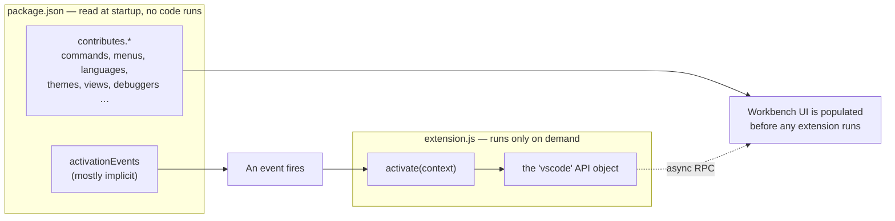
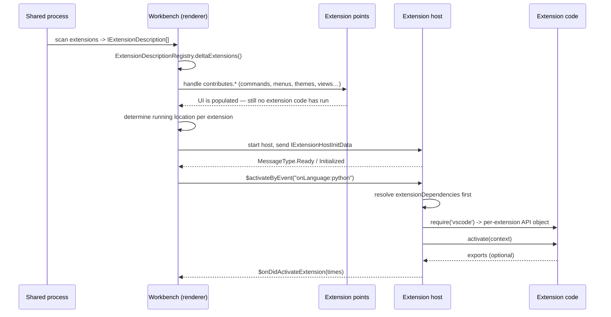
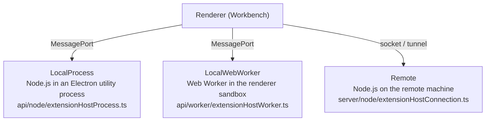
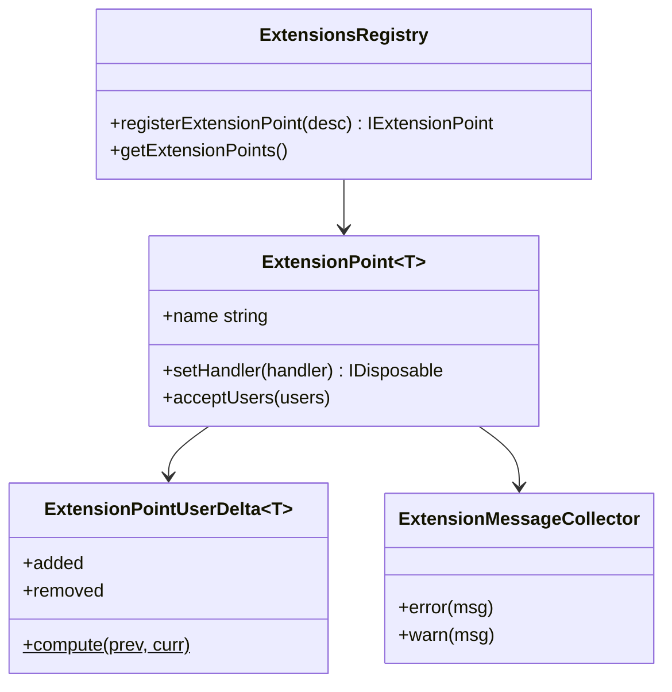
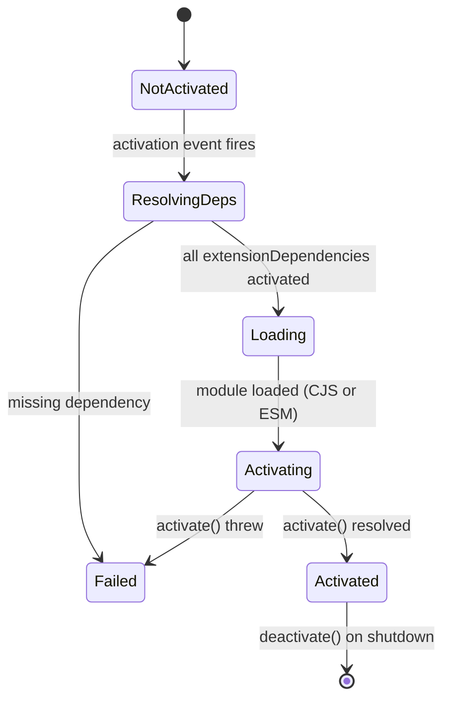
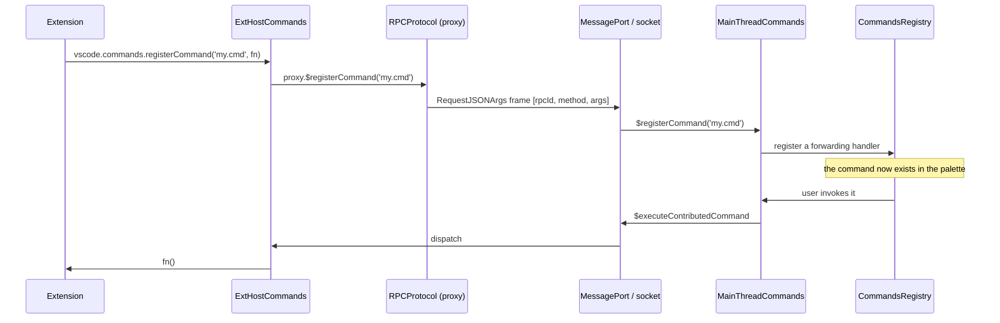
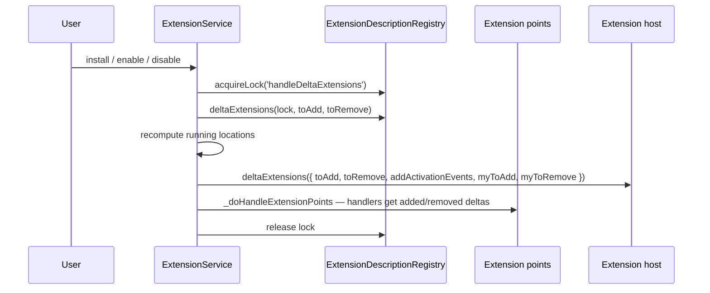

> Source: `https://github.com/microsoft/vscode.git` @ `c772f67cd2f` (v1.137.0) · Date: 2026-09-04 · Mode: Explain
> See also: [System & OOP Architecture](/case-studies/apps/vscode_system_oop_architecture/) · [User-Facing API & UX/DX](/case-studies/apps/vscode_ux_design/) · [Data Architecture](/case-studies/apps/vscode_data_architecture/)

---

## 1. The central idea

VS Code's extension model solves a problem that killed a generation of extensible editors: **let third parties change everything, while guaranteeing they cannot make the editor slow, unstable, or unresponsive.**

Two decisions do almost all the work.

**Decision 1 — Split every extension in half.** Everything *static* about an extension (its commands' titles, its menu placements, its language associations, its themes, its views, its settings) is declared as JSON in `package.json` and read **without executing a single line of the extension's code**. Everything *dynamic* lives in code that runs only when it is actually needed.

**Decision 2 — Run the dynamic half somewhere it cannot hurt anyone.** Extension code never runs on the UI thread. It runs in a separate process (or Web Worker, or on a remote machine) and reaches the editor only through an asynchronous, typed RPC channel. An extension has no DOM, no window handle, and no synchronous path into the renderer.

Everything that follows is machinery in service of those two decisions.



The palette being fully populated on a cold start, with zero extensions activated, is not an optimization. It is the architecture.

---

## 2. Anatomy of an extension

```jsonc
{
  "name": "my-ext",
  "publisher": "acme",                    // identity is publisher.name
  "engines": { "vscode": "^1.105.0" },    // the compatibility gate; "*" is rejected
  "main": "./out/extension.js",           // Node entry point
  "browser": "./out/extension.web.js",    // Web Worker entry point (optional)
  "extensionKind": ["workspace"],         // where it is allowed to run
  "extensionDependencies": ["vscode.git"],
  "enabledApiProposals": ["chatProvider"],// unstable API opt-in
  "activationEvents": ["onLanguage:python"],
  "contributes": {
    "commands": [{ "command": "my.cmd", "title": "Do The Thing" }],
    "configuration": { "properties": { "myExt.mode": { "type": "string" } } },
    "menus": { "editor/context": [{ "command": "my.cmd", "when": "editorLangId == python" }] }
  }
}
```

```ts
import * as vscode from 'vscode';

export function activate(context: vscode.ExtensionContext) {
  context.subscriptions.push(
    vscode.commands.registerCommand('my.cmd', () => { /* ... */ })
  );
  return { publicApi: () => 42 };   // optional: other extensions can consume this
}

export function deactivate() { /* optional cleanup */ }
```

Three fields carry more weight than they look:

- **`engines.vscode`** is validated by `extensionValidator.ts` and is what allows the API to evolve. Its own schema text in `extensionsRegistry.ts` forbids `*`.
- **`extensionKind`** (`'ui' | 'workspace' | 'web'`) is a *placement declaration*, not a capability. It decides which extension host the extension lands in — see §5.
- **`activate` may return a value.** That return is the extension's public API, retrievable by others via `vscode.extensions.getExtension(id).exports`. This is how `vscode.git` exposes a Git API to other extensions.

---

## 3. The whole lifecycle, once



Six phases. The rest of this document takes them one at a time.

---

## 4. Phase 1 — Discovery: manifests become descriptions

`IExtensionsScannerService` (`src/vs/platform/extensionManagement/common/extensionsScannerService.ts`) scans three populations:

| Population | Location | Method |
|---|---|---|
| **System / built-in** | `<appRoot>/extensions/` (97 of them in this repo) | `scanSystemExtensions()` |
| **User** | the extensions dir (`--extensions-dir`, `$VSCODE_EXTENSIONS`, or `~/.vscode-oss/extensions`) | `scanUserExtensions()` |
| **Development** | `--extensionDevelopmentPath` | dev-host path |

Each `package.json` is parsed, localized via `extensionNls.ts` (`%key%` → `package.nls.json`), validated, and becomes an **`IExtensionDescription`** — the in-memory currency of the whole mechanism. Scanning is cached (`cachedExtensionScanner.ts` on desktop) because it is on the startup critical path.

Which extensions are *enabled* is a separate question, answered per profile by the profile's `extensions.json` plus `extensionEnablementService.ts`. Bits on disk are global; enablement is per profile.

The renderer holds the authoritative view in an `ExtensionDescriptionRegistry` (`extensionDescriptionRegistry.ts`), wrapped in a `LockableExtensionDescriptionRegistry` so that the set cannot mutate mid-operation.

---

## 5. Phase 2 — Placement: which host runs this extension?

This is the least-known and most consequential part of the mechanism. A local desktop window can be running **three different kinds of extension host at once**:



`ExtensionHostKind` (`extensionHostKind.ts:10`) enumerates them. Placement is decided by `NativeExtensionHostKindPicker.pickExtensionHostKind` (`nativeExtensionService.ts:706`), reading the extension's declared `extensionKind` array in order:

| Declared kind | Condition | Lands in |
|---|---|---|
| `ui` | installed locally | `LocalProcess` |
| `workspace` | installed remotely | `Remote` |
| `workspace` | no remote host exists | `LocalProcess` |
| `web` | installed locally **and** a web-worker host exists | `LocalWebWorker` |

The array is a *preference list*: the first satisfiable entry wins, and if none is strictly satisfiable the first candidate collected is used. `ExtensionRunningPreference` (`Local` / `Remote` / `None`) biases the choice when an extension is under development on one side.

The result is an `ExtensionRunningLocation` — `LocalProcessRunningLocation`, `LocalWebWorkerRunningLocation`, or `RemoteRunningLocation` — each carrying an **`affinity`** number. Affinity is why `LocalProcess1` can exist alongside `LocalProcess`: a heavy or crash-prone extension can be isolated into its own process without changing anything else.

**This is why "install this extension in the remote" is a real prompt.** It is not a UI quirk; `extensionKind` genuinely determines which machine's process the code enters, and a `workspace`-kind extension installed only locally has nowhere to run when you are connected to a remote.

---

## 6. Phase 3 — Contribution points: the declarative half

An **extension point** is a named key under `contributes`, plus a JSON schema, plus a handler in the workbench. It is created with:

```ts
ExtensionsRegistry.registerExtensionPoint<T>({
    extensionPoint: 'commands',
    jsonSchema: schema.commandsContribution
});
```

42 files under `src/vs/workbench/` do this, and `extensionPoints.json` lists the 59 canonical names — `commands`, `menus`, `submenus`, `languages`, `grammars`, `themes`, `iconThemes`, `snippets`, `views`, `viewsContainers`, `viewsWelcome`, `debuggers`, `notebooks`, `notebookRenderer`, `taskDefinitions`, `problemMatchers`, `configuration`, `jsonValidation`, `keybindings`, `authentication`, `walkthroughs`, and the newer `chatParticipants`, `languageModelTools`, `mcpServerDefinitionProviders`, `chatSkills`.



Three properties are worth naming:

1. **It is delta-based.** `ExtensionPointUserDelta.compute(previous, current)` gives handlers `added` and `removed` sets, not a full list. That is what makes installing or disabling an extension a live operation rather than a restart.
2. **Errors are attributed.** `ExtensionMessageCollector` tags every schema complaint with the extension id and the extension point id, so a malformed manifest names its author in the Extensions view instead of producing an anonymous parse error.
3. **The JSON schema is published.** Every extension point registers into the JSON contribution registry, which is why authoring `package.json` in VS Code gives completion and validation for `contributes` — the editor is validating manifests against the same schema the runtime uses.

### The bridge back to code: implicit activation events

`contributes.commands` declares a command's title, but the handler lives in code that has not run. The bridge is `ImplicitActivationEvents` (`src/vs/platform/extensionManagement/common/implicitActivationEvents.ts`):

```ts
// menusExtensionPoint.ts:911 — the real shape
export const commandsExtensionPoint = ExtensionsRegistry.registerExtensionPoint({
    extensionPoint: 'commands',
    jsonSchema: schema.commandsContribution,
    activationEventsGenerator: function* (contribs) {
        for (const contrib of contribs) {
            if (contrib.command) {
                yield `onCommand:${contrib.command}`;
            }
        }
    }
});
```

An extension point may declare an `activationEventsGenerator`, which `registerExtensionPoint` forwards to `ImplicitActivationEvents.register(desc.extensionPoint, desc.activationEventsGenerator)` (`extensionsRegistry.ts:681`). The generator derives activation events from that point's contributions. So contributing a command implies `onCommand:my.cmd`; contributing a language implies `onLanguage:python`; contributing a debugger implies `onDebugResolve:node`. This is why modern extensions have an empty `activationEvents` array and still activate at exactly the right moment. The source comment is explicit that this can only be computed in the renderer, "because that is the only place where all extension points and all implicit activation events generators are known."

---

## 7. Phase 4 — Activation: the lazy half

Activation events are strings. Some canonical ones:

| Event | Fires when |
|---|---|
| `onCommand:<id>` | The command is invoked (implicit from `contributes.commands`) |
| `onLanguage:<id>` | A document of that language opens |
| `workspaceContains:<glob>` | The workspace matches the glob (`workspaceContains.ts`) |
| `onFileSystem:<scheme>` | That URI scheme is accessed |
| `onDebugResolve:<type>`, `onView:<id>`, `onUri` | The corresponding feature is used |
| `onStartupFinished` | After startup — the polite "eager" option |
| `*` | Startup. Reviewers push back on this for good reason |

Note `onUri` gets rewritten to `onUri:<extensionId>` during derivation — a small detail that shows activation events are a namespaced key space, not free text.

### The activation state machine



`ExtensionsActivator` (`extHostExtensionActivator.ts:166`) owns this. Two details make it robust:

- **Dependencies activate first, transitively.** `ActivationOperation` holds a `_deps` list and waits on it (`await Promise.race(this._deps.map(dep => dep.wait()))`). A missing dependency produces a typed `MissingExtensionDependency` rather than a stack trace, so the UI can say *which* extension is missing.
- **Events are idempotent.** `_alreadyActivatedEvents` means firing `onLanguage:python` for the hundredth Python file costs a map lookup.

### Loading and calling `activate`

`AbstractExtHostExtensionService._doActivateExtension` (`extHostExtensionService.ts:491`) does, in order:

1. Telemetry `activatePlugin`, then resolve the entry point (`main` for Node hosts, `browser` for the worker host). **No entry point is not an error** — it returns an `EmptyExtension`, which is exactly the case for a pure theme or grammar extension.
2. Load the module — `_loadESMModule` or `_loadCommonJSModule` depending on the manifest — *in parallel with* building the `ExtensionContext`.
3. Call `activate(context)` through `_callActivateOptional`, timing each stage with `ExtensionActivationTimesBuilder`.
4. Report `codeLoadingTime`, `activateCallTime`, `activateResolvedTime` back to the renderer via `$onDidActivateExtension`.

That timing is not incidental: it is what powers the "Extension Host Profile" and the startup-performance table that lets a user see which extension is costing them 400 ms. **Slow activation is measured and attributed by design.**

The `ExtensionContext` handed to `activate` is frozen (`Object.freeze`) and carries `globalState` / `workspaceState` mementos, `secrets`, `subscriptions`, `extensionUri`, `extensionMode` (`Production` / `Development` / `Test`), `storagePath`, and `languageModelAccessInformation`.

---

## 8. Phase 5 — The API object: what `require('vscode')` actually returns

There is no `vscode` module on disk. The extension host installs a **module interceptor** (`extHostRequireInterceptor.ts`), and `VSCodeNodeModuleFactory` (line 148) answers `require('vscode')`:

```ts
public load(_request: string, parent: URI): any {
    const ext = this._extensionPaths.findSubstr(parent);   // who is asking?
    if (ext) {
        let apiImpl = this._extApiImpl.get(ext.identifier);
        if (!apiImpl) {
            apiImpl = this._apiFactory(ext, this._extensionRegistry, this._configProvider);
            this._extApiImpl.set(ext.identifier, apiImpl);
        }
        return apiImpl;
    }
    // ... fall back to a default impl, with a warning
}
```

**Every extension gets its own `vscode` object**, built by `createApiFactoryAndRegisterActors` (`extHost.api.impl.ts:150`), keyed by the calling file's path. That per-extension identity is what makes the following possible without the extension passing its id anywhere:

- Telemetry, logging, and errors are attributed to the right publisher.
- `enabledApiProposals` gating can differ per extension — the same `vscode.chat` property can exist for one extension and not for another.
- Deprecation warnings name the offender (`extHostApiDeprecationService.ts`).
- Configuration and workspace views can be scoped.

The same interceptor also aliases some Node modules and wraps `open`/`opn` so an extension calling it goes through the app's opener rather than shelling out.

---

## 9. The RPC boundary in detail

Every capability the API exposes is one half of a declared pair in `src/vs/workbench/api/common/extHost.protocol.ts`:

```ts
export interface MainThreadCommandsShape extends IDisposable {
    $registerCommand(id: string): void;
    $executeCommand<T>(id: string, args: any[], retry: boolean): Promise<T | undefined>;
}
export interface ExtHostCommandsShape {
    $executeContributedCommand(id: string, ...args: any[]): Promise<unknown>;
}
```

Two registries of `ProxyIdentifier`s — `MainContext` (97 `mainThread*.ts` implementations in the renderer) and `ExtHostContext` (115 `extHost*.ts` implementations in the host).



Mechanics that matter:

| Mechanism | Where | What it buys |
|---|---|---|
| `getProxy(identifier)` returns a JS `Proxy` | `rpcProtocol.ts:249` | Every method call is transparently a message send; no generated stubs |
| `Proxied<T>` mapped type | `proxyIdentifier.ts` | Rewrites every method to return `Promise` — **synchronous cross-process calls are a type error** |
| `Dto<T>` mapped type | `proxyIdentifier.ts` | Drops functions, applies `toJSON`, recurses — the compiler enforces serializability |
| Binary frames | `MessageIO`, `MessageType` | `RequestJSONArgs`, `RequestJSONArgsWithCancellation`, `ReplyOKJSON`, `ReplyOKJSONWithBuffers` |
| `SerializableObjectWithBuffers` | `proxyIdentifier.ts` | `VSBuffer`s ride alongside the JSON instead of being base64'd into it |
| `CancellationToken` as a first-class arg | protocol-wide | A cancel is its own message type, not a flag checked later |
| `@extHostNamedCustomer(MainContext.MainThreadX)` | `extHostCustomers.ts` | Renderer-side actors self-register; adding a capability touches one file |
| `drain()` | `IRPCProtocol` | Lets shutdown wait for the write buffer instead of dropping messages |

The API surface an extension sees is therefore **generated from a contract, not hand-marshalled** — and the contract is checked by `tsc`.

### Documents: the exception that proves the rule

Reading a document does *not* cross the wire. The extension host keeps a `MirrorTextModel` synchronized by deltas (`$acceptModelChanged`), so `document.getText()` is a local memory read. Only *mutations* are sent back, as `ISingleEditOperation`s. Without this, every completion provider would be a round trip per keystroke.

---

## 10. Live changes: install, enable, disable — no restart

`AbstractExtensionService._deltaExtensions` (`abstractExtensionService.ts:271`) is the operation behind "no reload required":



Note `myToAdd` / `myToRemove` alongside `toAdd` / `toRemove`: **each extension host receives only the extensions it is responsible for**, while every host learns the full set so cross-host `extensions.getExtension()` lookups still work. A registry lock guards the whole operation so no activation can observe a half-applied delta.

The reload prompt appears only when this cannot be done safely — most commonly when removing an extension that has already been activated, since JavaScript cannot truly unload a module.

---

## 11. Proposed API: how unstable surface is gated

179 files named `vscode.proposed.*.d.ts` sit beside `vscode.d.ts`. Every one is an API in development, and access is enforced at three levels (`extensionsProposedApi.ts`):

1. **Declaration.** The extension lists `enabledApiProposals: ["chatProvider"]` in its manifest.
2. **Filtering.** Names that no longer exist in `allApiProposals` are stripped; built-ins and `product.json`-listed extensions get an allowlist.
3. **Hard denial.** For a non-builtin outside development mode, `enabledApiProposals` is emptied and an error is logged: *"Extension CANNOT USE these API proposals … You MUST start in extension development mode or use the `--enable-proposed-api` command line flag."*

Because the API object is per-extension (§8), the gate is enforced at the object level: the proposed property simply is not there for an extension that has not been granted it.

This is the mechanism that lets VS Code ship a monthly stable API while iterating on a dozen unstable ones in public — and it is why marketplace-published extensions cannot use proposed API.

---

## 12. Isolation and trust boundaries

| Boundary | Enforced by | Consequence |
|---|---|---|
| **No UI thread access** | Separate process / worker; async-only RPC | An extension in an infinite loop cannot freeze the window |
| **No DOM** | The extension host has no `document` | UI must go through contributed widgets or a webview |
| **Webviews are sandboxed** | `<iframe>` on the `vscode-webview:` scheme, served from `webviewContentExternalBaseUrlTemplate` on a distinct origin | Extension-authored HTML cannot reach into workbench DOM; it talks via `postMessage` |
| **Workspace Trust** | `WorkspaceTrustRequestOptions`, trust state in the workbench | Extensions can be restricted in untrusted folders |
| **Signature verification** | `extensionSignatureVerificationService.ts` in the shared process | Installs are verified before extraction |
| **Allowed-extensions policy** | `allowedExtensionsService.ts`, policy-controlled gallery auth provider | Enterprises can constrain what installs at all |
| **Proposed API** | §11 | Unstable surface cannot leak into the marketplace |
| **Placement** | `extensionKind` + running location | A `workspace` extension physically cannot run on the user's local machine in a remote session |

The honest limit: **inside its host, an extension is not sandboxed.** A Node-kind extension has full filesystem and network access with the user's privileges. The boundary protects the *editor's* stability and the *UI's* integrity, not the user's machine from a malicious extension. Trust, signing, and policy are the controls for that, and they are administrative rather than technical.

---

## 13. Why this design holds up

| Constraint | Mechanism | Cost paid |
|---|---|---|
| Startup must not scale with extension count | Declarative manifests + implicit activation events | Contributions must be expressible as JSON |
| One bad extension must not freeze the editor | Out-of-process host, async-only API | No synchronous API, ever |
| The API must evolve without breaking the ecosystem | `engines.vscode` + proposed-API gating + additive `.d.ts` | An enormous back-compat surface, permanently |
| The same extension should work locally, remotely, and in a browser | Three host kinds + `extensionKind` placement | Authors must think about *where* their code runs |
| Install/enable without restart | Delta-based registry and extension points | Every handler must be written delta-aware |
| Extensions must be able to build UI | Webviews, tree views, custom editors, notebook renderers | Webview content is sandboxed and awkward |
| The editor must stay debuggable | Per-extension API objects, activation timing, host profiler | Extra bookkeeping on every API access |

The recurring trade is the same one each time: **give up synchrony and direct access; buy back isolation, laziness, and attributability.**

---

## 14. File index

The mechanism, by the file you would read next.

| Concern | File |
|---|---|
| Extension point registry, manifest JSON schema | `src/vs/workbench/services/extensions/common/extensionsRegistry.ts` |
| Canonical extension-point names | `src/vs/workbench/services/extensions/common/extensionPoints.json` |
| Implicit activation events | `src/vs/platform/extensionManagement/common/implicitActivationEvents.ts` |
| Live registry + delta handling | `src/vs/workbench/services/extensions/common/abstractExtensionService.ts`, `extensionDescriptionRegistry.ts` |
| Host kinds and placement | `extensionHostKind.ts`, `extensionRunningLocation.ts`, `electron-browser/nativeExtensionService.ts` |
| Host process management | `electron-browser/localProcessExtensionHost.ts`, `browser/webWorkerExtensionHost.ts`, `common/remoteExtensionHost.ts` |
| Host handshake and init payload | `common/extensionHostProtocol.ts` |
| RPC engine | `common/rpcProtocol.ts`, `common/proxyIdentifier.ts` |
| The API contract (both halves) | `src/vs/workbench/api/common/extHost.protocol.ts` |
| Renderer-side actor registration | `common/extHostCustomers.ts` |
| API object construction | `src/vs/workbench/api/common/extHost.api.impl.ts` |
| `require('vscode')` interception | `src/vs/workbench/api/common/extHostRequireInterceptor.ts` |
| Activation orchestration | `src/vs/workbench/api/common/extHostExtensionActivator.ts`, `extHostExtensionService.ts` |
| Node / Worker host entry points | `api/node/extensionHostProcess.ts`, `api/worker/extensionHostWorker.ts` |
| Proposed API gating | `common/extensionsProposedApi.ts`, `src/vscode-dts/vscode.proposed.*.d.ts` |
| Scanning, install, enablement | `src/vs/platform/extensionManagement/**` |
| Public API surface | `src/vscode-dts/vscode.d.ts` |

---

## 15. Open questions

- **Web extension host reach.** The `LocalWebWorker` host runs `web`-kind extensions with no Node APIs; exactly which parts of the API degrade there is spread across per-feature `common`/`worker` splits rather than stated in one place.
- **Affinity in practice.** `LocalProcessRunningLocation.affinity` supports multiple local hosts, driven by an `extensions.experimental.affinity` setting. How many hosts a real session runs is a runtime property, not a static one.
- **`deactivate()` guarantees.** The repo calls it on shutdown, but how much time an extension is given before the host is killed is a timing/lifecycle detail not traced here.
- **Marketplace contracts** (query API version, signature format, statistics) are a service contract; `extensionGalleryService.ts` shows the client's `FilterType` / `Flag` / `assetUri` shape only. Code - OSS ships no gallery endpoint at all.
- **The newest extension points** — `chatParticipants`, `languageModelTools`, `chatSkills`, `mcpServerDefinitionProviders`, `agentPlugins` — follow the same machinery but are moving fast; treat their specific schemas as the least stable claims in this document.
