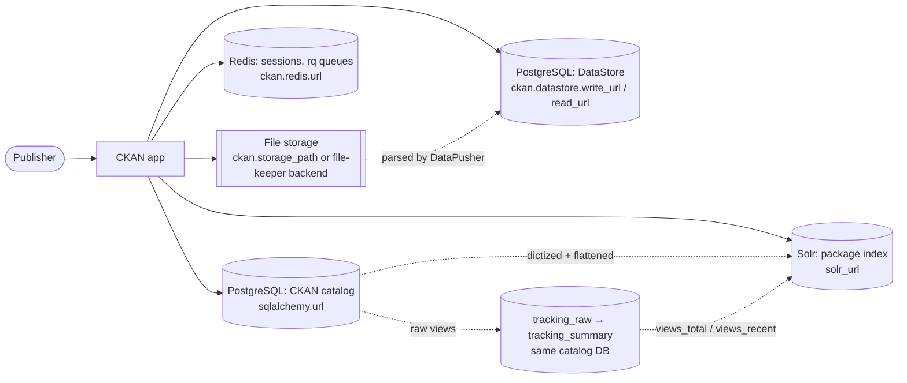
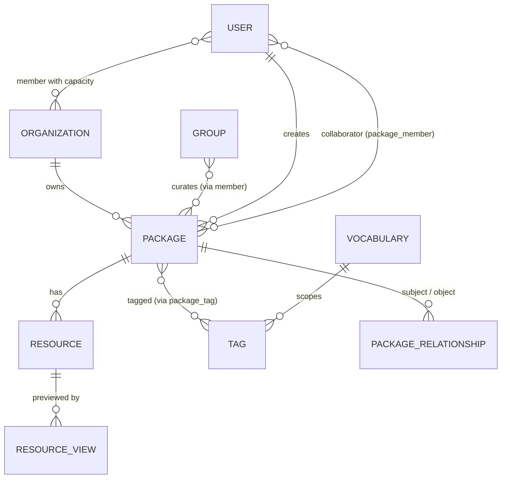
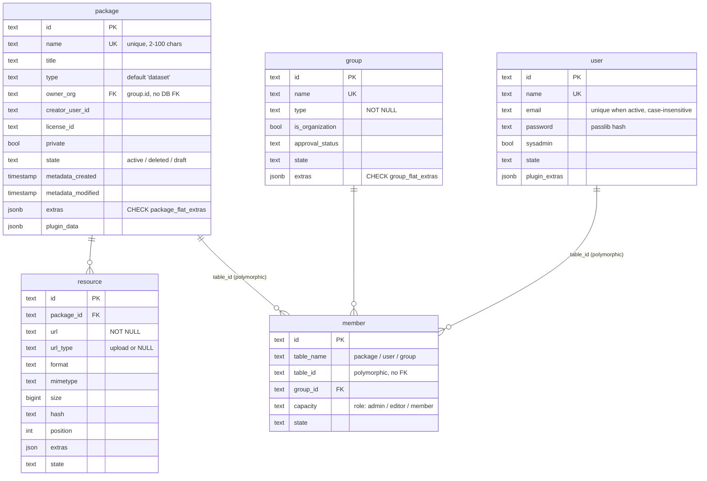
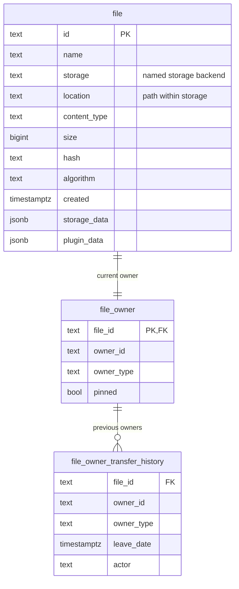
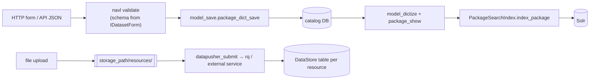
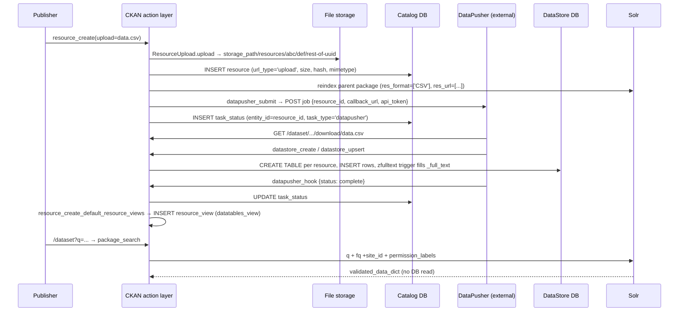
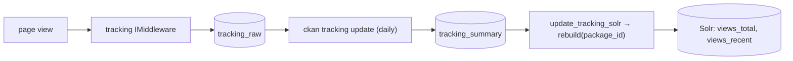

> Source: `https://github.com/ckan/ckan.git` @ `57d84e78b4` (master, 2026-08-27), `ckan.__version__ = "2.13.0a0"` · Date: 2026-08-28 · Mode: Explain · Data system: **Hybrid** (OLTP catalog + derived search index + per-resource SQL store + blob store + rollup)
> See also: [System & OOP Architecture](./ckan_system_oop_architecture.md)

---

## 1. Overview

CKAN manages two fundamentally different kinds of data, and almost every design decision in
the codebase follows from keeping them apart:

1. **Metadata** — the catalogue: datasets, their resources, the organizations that own them,
   tags, users, memberships. Modest volume, highly relational, strongly validated. This is
   the OLTP core in PostgreSQL.
2. **Data** — the actual bytes a publisher uploads or links to. Arbitrary size and format.
   CKAN stores these opaquely (filesystem/object store), and *optionally* parses tabular ones
   into the **DataStore**, a second PostgreSQL database with **one dynamically created table
   per resource**.

Around that core sit four derived/auxiliary stores: a Solr index (the search read model), an
append-only activity log, page-view counters, and Redis for sessions and job queues.

**Classification — Hybrid.** Evidence for each constituent:

| Sub-system | Type | Evidence |
|---|---|---|
| Catalog | OLTP app DB | `ckan/model/*.py` — 22 table definitions (19 imperative `Table(...)` + 3 declarative `__tablename__`); Alembic history at `ckan/migration/versions/` (109 revisions) |
| Search index | Document store (derived) | `ckan/config/solr/schema.xml` (`schema name="ckan-2.12"`), `ckan/lib/search/index.py` |
| DataStore | Schema-on-write, dynamic DDL | `ckanext/datastore/backend/postgres.py::create_table` issues `CREATE TABLE "<resource_id>" (...)` at runtime |
| Uploads | Blob / file store | `ckan/lib/uploader.py`, `ckan/lib/files/` (`file-keeper`), tables `file` / `file_owner` |
| Activity | Append-only event log | `ckanext/activity/model/activity.py` — `activity`, `activity_detail` |
| Tracking | Rollup / mini-warehouse | `ckanext/tracking/model.py` — `tracking_raw` → `tracking_summary` |
| Sessions & queues | Ephemeral KV | `ckan/lib/redis.py`, `ckan/lib/jobs.py` (`rq`) |

**Tech:** PostgreSQL (≥ the version `jsonb_path_exists` requires — PG 12+, implied by
migration `106_12d64978ab44_faster_extras`), SQLAlchemy 2.0 + `psycopg2`, Alembic 1.18,
Apache Solr via `pysolr`, Redis + `rq`, `file-keeper` 0.2.6, `pglast` 8.4 for SQL parsing.

---

## 2. Data Landscape



| Store | Engine / kind | Holds | Written by | Read by |
|---|---|---|---|---|
| **Catalog DB** (`sqlalchemy.url`) | PostgreSQL | Datasets, resources, orgs/groups, users, tags, memberships, tokens, activity, tracking | `ckan/logic/action/{create,update,delete,patch}.py` via `ckan/lib/dictization/model_save.py` | `model_dictize.py`, all `*_show` / `*_list` actions |
| **DataStore DB** (`ckan.datastore.write_url`, `ckan.datastore.read_url`) | PostgreSQL, separate DB + separate roles | One table per resource id holding that resource's rows | `datastore_create` / `datastore_upsert` (write role) | `datastore_search`, `datastore_search_sql` (read-only role) |
| **Solr index** (`solr_url`) | Lucene document index | One doc per package: flattened metadata + the whole `validated_data_dict` as a stored string | `PackageSearchIndex.index_package` | `package_search`, all faceted browse pages |
| **Redis** (`ckan.redis.url`) | KV | Server-side sessions (when enabled), `rq` job queues + results | `CKANRedisSessionInterface`, `ckan/lib/jobs.py` | same |
| **File storage** (`ckan.storage_path`, or a `file-keeper` storage) | Filesystem / object store | Uploaded resource bytes, group & site images, user avatars | `ResourceUpload.upload` / `Upload.upload`, `FKResourceUpload` | `resource.download` view; Flask static mount |
| **Upstream/external** | HTTP | Link-only resources (`resource.url` with `url_type` unset) | — | Fetched by DataPusher / xloader, never stored by CKAN itself |

Note the deliberate **two-database, two-role split** for the DataStore
(`ckanext/datastore/set_permissions.sql`): the read role has `CONNECT` revoked on the main
catalog DB and only `SELECT` in the DataStore's `public` schema. That is what makes
`datastore_search_sql` — arbitrary user SQL — tolerable.

---

## 3. Data Models / Schema

### 3.1 Conceptual — the catalogue



`ORGANIZATION` and `GROUP` are the *same physical table* (`group`), distinguished by
`is_organization`. That is the single most surprising fact about this schema.

### 3.2 Physical — core tables



| Table | Key columns | Notes |
|---|---|---|
| `package` | PK `id` (uuid text); UK `name` | 8 indexes incl. functional `lower(name)` / `upper(name)` and `(name, state)` composites — name lookups are a hot path. `extras` and `plugin_data` are JSONB. |
| `resource` | PK `id`; FK `package_id → package.id` (NOT NULL) | `url_type = 'upload'` marks CKAN-hosted bytes; otherwise `url` is external. Indexed on `id`, `package_id`, `url`. |
| `group` | PK `id`; UK `name` | Holds both groups and organizations. `type` selects the `IGroupForm` plugin. |
| `member` | PK `id`; FK `group_id`; `table_id` **not** a FK | Deliberately polymorphic: one table for dataset↔group, user↔org role, and group nesting. The cost is no referential integrity on `table_id`. |
| `package_member` | PK `(package_id, user_id)` | Per-dataset **collaborators** — orthogonal to org membership. |
| `package_tag` | PK `id`; FKs `package_id`, `tag_id` | Soft-deleted (`state`), so untagging leaves a row. |
| `tag` | PK `id`; UK `(name, vocabulary_id)` | `vocabulary_id` NULL = free tag; non-NULL = controlled vocabulary term. |
| `vocabulary` | PK `id`; UK `name` | Controlled tag namespaces; surfaced in Solr as `vocab_<name>` dynamic fields. |
| `package_relationship` | PK `id`; FKs to `package.id` ×2 | Typed dataset↔dataset edges (`depends_on`, `derives_from`, `child_of`, …). |
| `resource_view` | PK `id`; FK `resource_id` `ON DELETE CASCADE` | Preview configuration; `view_type` names an `IResourceView` plugin, `config` is JSON. |
| `user` | PK `id`; UK `name`; conditional unique index on `lower(email)` where `state='active'` | Password is a `passlib` hash. `apikey` column survives as legacy; current auth is `api_token`. |
| `api_token` | PK `id`; FK `user_id` | Bearer tokens with `last_access`; `plugin_extras` JSONB lets `expire_api_token` add TTL. |
| `user_following_{user,dataset,group}` | PK `(follower_id, object_id)`, both FK `ON DELETE CASCADE` | Three near-identical tables from one generic base class. |
| `dashboard` | PK `user_id` | Per-user cursor: `activity_stream_last_viewed`, `email_last_sent`. |
| `task_status` | PK `id`; UK `(entity_id, task_type, key)` | Generic async-job status — how DataPusher reports back. |
| `system_info` | PK `id`; UK `key` | Runtime-editable config (the `/ckan-admin` config form) — **overlays the INI file**. |
| `term_translation` | index `(term, lang_code)`, no PK | Free-form translation store used by `ckanext/multilingual`. |
| `alembic_version` | — | Migration bookkeeping (per branch: core + each extension). |

**Extras are JSONB now.** Migration `106_12d64978ab44_faster_extras` folded the old
`package_extra` / `group_extra` side tables into a single JSONB column on each parent, with a
`CHECK` constraint (`package_flat_extras` / `group_flat_extras`) enforcing a **flat
object of string values**. The action layer still presents them as the legacy
`[{key, value}, …]` list (`model_dictize.py:213-215`) — the wire format outlived the storage
format.

### 3.3 File tables (2.13-era)



Added by migration `109_9445ce34fc23_initialize_file_tables`. Unique index
`idx_file_location_in_storage (storage, location)`. Ownership is polymorphic
(`owner_type` + `owner_id`, no FK) and **historised** — transfers append to
`file_owner_transfer_history` rather than overwriting.

### 3.4 The Solr document

One document per package. Not a mirror of the table — a **denormalised, flattened read
model** built by `PackageSearchIndex.index_package` (`ckan/lib/search/index.py:107`):

| Solr field(s) | Derived from |
|---|---|
| `id`, `name`, `title`, `notes`, `state`, `metadata_created/modified` | `package` columns |
| `name_ngram`, `title_ngram`, `title_string` | copyFields for autocomplete and sorting |
| `organization` | `owner_org` → the org's **name** (not id) |
| `groups` (multi) | group names via `member` |
| `tags` (multi) | free tags only; vocabulary tags become `vocab_<vocabulary>` dynamic fields |
| `res_name`, `res_format`, `res_url`, `res_type`, `res_description` (multi) | resources **flattened into parallel arrays** — index position, not nesting |
| `extras_*`, `res_extras_*` | dynamic fields from the extras JSONB |
| `capacity` | literal `"private"` / `"public"` derived from `package.private` |
| `permission_labels` (multi, `stored=false`) | `IPermissionLabels` — the row-level ACL |
| `views_total`, `views_recent`, `resources_accessed_*` | `tracking_summary` |
| `data_dict`, `validated_data_dict` | the **entire** package dict, JSON-serialised, `indexed=false stored=true` |
| `site_id` | multi-tenant discriminator; every query filters `+site_id:{ckan_site_id}` |

The last row is the load-bearing one: search results are rehydrated from
`validated_data_dict` with **no database round trip** (`get.py:1506`). Solr is not a pointer
index here — it is a full read model.

### 3.5 DataStore physical layout

There is no static schema. `create_table` (`postgres.py:966`) emits DDL per resource:

```sql
CREATE TABLE "<resource_id>" (
    "_id"        serial primary key,
    "_full_text" tsvector,
    "<user field>" <type>,   -- declared, or guessed from record[0]
    ...
);
COMMENT ON COLUMN "<resource_id>"."<field>" IS '{"_info": {...}}';  -- field metadata
```

Design consequences worth stating plainly:

- **The table name *is* the resource UUID.** Joins to the catalog are by convention, across
  two databases, with no FK.
- **Column comments carry the data dictionary** — labels, notes, `type_override` live in
  PostgreSQL `COMMENT ON COLUMN` as JSON, not in a metadata table.
- `_full_text` is maintained by a `zfulltext` `BEFORE INSERT OR UPDATE` trigger
  (`_create_fulltext_trigger`, `postgres.py:1811`); user-defined triggers are named `t000`…`t999`.
- **Aliases are SQL views** (`CREATE VIEW "<alias>" AS SELECT * FROM "<resource_id>"`,
  `postgres.py:671`), giving human-readable names.
- `_table_metadata` is a view over `pg_class`/`pg_depend` listing valid table and alias names
  — the catalogue of the DataStore, readable by the read-only role.
- Field-name limit is Postgres's own 63 characters, validated up front.

### 3.6 Event and rollup tables

| Table | Shape | Character |
|---|---|---|
| `activity` | `id`, `timestamp`, `user_id`, `object_id`, `activity_type`, `data` (JSON), `permission_labels` (text) | Append-only event log. `data` snapshots the affected object, so the activity stream can render historical diffs (`ckanext/activity/changes.py`) without temporal tables. `permission_labels` denormalises visibility onto the event. |
| `activity_detail` | keyed to activity | Legacy detail rows. |
| `tracking_raw` | PK `(user_key, url)`, `tracking_type`, `access_timestamp` | Raw hits, written by `ckanext/tracking` middleware. `user_key` is a hashed identifier, not a user id. |
| `tracking_summary` | PK `url`, `package_id`, `tracking_type`, `count`, `running_total`, `recent_views`, `tracking_date` | Daily rollup, rebuilt per-day by `update_tracking` (`ckanext/tracking/cli/tracking.py:144`). |

---

## 4. Dataflow & Lineage

### 4.1 Write-path data flow



The one structural rule: **PostgreSQL is written first and committed, then Solr is updated.**
`logic.index_insert_package_dicts` runs after `session.commit()` in `package_create`
(`ckan/logic/action/create.py:180`). There is no distributed transaction — a Solr failure
after a successful commit leaves the index stale, which is why
`ckan search-index rebuild [--only-missing]` exists as a first-class operation.

### 4.2 Traced lineage — a CSV from upload to search hit



**Storage layout for uploads** (`ResourceUpload.get_path`, `ckan/lib/uploader.py:349`):
`<storage_path>/resources/<id[0:3]>/<id[3:6]>/<id[6:]>` — a two-level fan-out on the resource
UUID to keep directory sizes bounded. There is no extension on disk; `mimetype` and the
original `name` live in the DB. The `file-keeper` path (`FKResourceUpload`, `uploader.py:566`)
reproduces the same 3/3/rest layout as a *logical* location inside a named storage, so the
scheme survives a move to object storage.

### 4.3 Tracking rollup



`update_tracking` deletes and rebuilds the rows for one `tracking_date`, then
`update_tracking_summary_with_package_id` resolves `/dataset/<name>` URLs back to package ids
(marking unresolvable ones `~~not~found~~`), then `update_tracking_solr` reindexes only the
affected packages. It is a small, honest batch pipeline: idempotent per day, no streaming.

---

## 5. System of Record & Ownership

| Entity | System of record | Derived / cached copies | Reconciliation |
|---|---|---|---|
| Dataset metadata | `package` (+ `resource`, `package_tag`, `member`) | Solr doc (`data_dict`, `validated_data_dict`); `activity.data` snapshots | `ckan search-index rebuild`; activity is history, never reconciled |
| Resource **bytes** | File storage (or the external URL — then CKAN owns nothing) | DataStore table (parsed copy of tabular content); `resource.hash`/`size` | `ckan datastore` CLI; DataPusher re-run |
| Resource **rows** (tabular) | DataStore table `"<resource_id>"` | — | Rebuilt by re-running DataPusher/xloader |
| Organizations & groups | `group` + `member` | Solr `organization`, `groups` fields | reindex |
| Users & auth | `user`, `api_token` | Flask-Login session (Redis/cookie) | session expiry |
| Effective configuration | **Split** — INI file *and* `system_info` table | `config` object in memory | `system_info` overlays INI at `update_config()` |
| Page-view counts | `tracking_raw` | `tracking_summary`, Solr `views_*` | daily `ckan tracking update` |
| Job status | `task_status` | rq job in Redis | `datapusher_hook` writes the final state |

**Multi-source-of-truth flags — two, both intentional but both worth knowing:**

1. **Configuration** genuinely has two writers: the INI file and the `system_info` table
   (edited through `/ckan-admin/config`). Anyone debugging "my INI setting has no effect"
   should look at `system_info` first.
2. **Dataset metadata is served from Solr, not Postgres**, on every list/search page. Postgres
   is the system of record; Solr is authoritative *in practice* for what users see. A stale or
   partially rebuilt index is a correctness bug that produces no error anywhere.

A softer case: `resource.size` / `hash` / `mimetype` describe bytes that live elsewhere, and
for external URLs (`url_type` NULL) CKAN never verifies them — those columns are publisher
claims, not measurements.

---

## 6. Storage & Access

**Catalog DB.** Indexing is name-lookup-shaped, which mirrors CKAN's URL design
(`/dataset/<name>`, not `/dataset/<uuid>`): `package` carries `idx_pkg_sname`,
`idx_pkg_slname` / `idx_pkg_uname` (functional `lower()` / `upper()`), `idx_pkg_stitle`, and
`idx_package_creator_user_id`. `member` indexes `table_id` and `(group_id, table_id)` — the
two directions of the polymorphic join. `user` uses a **partial unique index** on
`lower(email) WHERE state = 'active'`, which is how "email unique among live users, reusable
after deletion" is expressed without application logic.

**Query volume deliberately does not hit Postgres.** Faceted browse, search, and most listings
are Solr queries. `package_show` for a single dataset does hit the DB and issues several
follow-up `SELECT`s (resources, tags, groups, relationships) in `package_dictize` — an
N-queries-per-dataset shape that is fine for one record and would be poor for a list, which is
exactly why lists come from the index.

**Solr.** Filters applied on every query: `+site_id:{ckan_site_id}` (multi-tenancy) and the
`permission_labels` filter (row-level read ACL). Both are pushed into the query rather than
applied afterwards, so paging and facet counts stay correct for the requesting user.
`data_dict` / `validated_data_dict` are `indexed=false stored=true` — pure payload, and the
main reason index size tracks metadata size rather than field count.

**DataStore.** Per-resource `_id serial primary key`; an index on `_full_text` whose method
(GIN/GiST) comes from `ckan.datastore.default_fts_index_method`; optional per-field indexes named by
`sha1(resource_id + field)` to stay inside Postgres's 63-char identifier limit. Full-text
search uses `to_tsquery` against `_full_text`; language comes from `_fts_lang`. Read traffic
uses `read_url` (a distinct role and connection pool from `write_url`), and
`datastore_search_sql` runs user SQL guarded by three layers: single-statement enforcement
(`is_single_statement`), a `pglast` AST walk against an allowlist
(`postgres_ast_allowlist.py`, `allowed_functions.txt`), and the read-only role's own grants.
`DatastorePlugin.before_fork` disposes engines so uWSGI workers don't share connections.

**Redis.** Sessions (when `CKANRedisSessionInterface` is active) and `rq` queues, namespaced by
a queue-name prefix so several CKAN sites can share one Redis. Nothing durable lives here.

**File storage.** Two-level hex fan-out (§4.2); no content-addressing — the path is the
resource id, so replacing a file's bytes keeps the path and the URL.

---

## 7. Lifecycle & Governance

**Schema evolution.** Alembic, with **one migration branch per package**: core at
`ckan/migration/versions/` (109 revisions, current head `109_9445ce34fc23_initialize_file_tables`),
plus independent trees at `ckanext/activity/migration/` and `ckanext/tracking/migration/`.
`Repository` (`ckan/model/__init__.py:185`) wraps it: `init_db`, `upgrade_db`, `downgrade_db`,
`current_version`, `stamp_alembic_head`, driven by `ckan db upgrade`. Extensions therefore
version their own tables without touching core's history — the reason `alembic_version` is
per-branch.

**Soft delete is the default.** Most entities carry `state` via `StatefulObjectMixin`;
`package_delete`, `group_delete`, `resource_delete` set `state='deleted'` and the row stays.
Two knobs interact with this:

- `ckan.search.remove_deleted_packages` decides whether a deleted package is dropped from Solr
  or merely marked (`index.py:128`). If it is only marked, deleted datasets remain in the
  index and are excluded by query filters — a difference that matters for anyone auditing
  "is it really gone".
- **Hard delete is a separate, explicit action:** `dataset_purge`, `group_purge`,
  `organization_purge` (`ckan/logic/action/delete.py:115,532,551`) remove the rows. Nothing
  purges automatically.

**Retention that actually exists in code:** `ckan clean activities`
(`ckanext/activity/cli.py`) deletes activity rows by `--start-date/--end-date` or
`--offset-days`, with `--keep N` to retain the most recent N per object. `ckan clean users`
removes users with invalid images. `expire_api_token` expires tokens via `plugin_extras`.
That is the complete inventory — there is **no** built-in retention for `tracking_raw`,
uploaded files, or DataStore tables.

**Classification / PII.** The evidence contains personal data — `user.email`, `user.password`
(passlib hash), `user.about`, `package.author_email` / `maintainer_email`, `tracking_raw.user_key`
— but the repo declares **no** classification scheme, encryption-at-rest requirement, or
anonymisation step. `tracking_raw.user_key` is a supplied key rather than a user id, which
limits (but does not eliminate) linkability. Access control is enforced at the action layer
(`check_access`), at query time (`permission_labels`), and at the DB-role level for the
DataStore — not by column-level policy.

**Backup / DR:** nothing in the repo. See §8.

---

## 8. Open Questions & External Assumptions

Boundaries of the evidence — things a deployment must answer that the source tree cannot:

- **Backup, restore, and DR.** No backup tooling, dump schedule, or PITR configuration exists
  in the repo. Note that a full restore needs *three* coordinated artifacts (catalog DB,
  DataStore DB, file storage) plus a Solr rebuild; the ordering and consistency guarantees are
  a deployment concern nobody in-tree owns.
- **Retention for `tracking_raw`, uploaded files, and orphaned DataStore tables.** No job
  trims any of them. `tracking_raw` grows per page view indefinitely, and purging a dataset
  does not obviously reclaim its DataStore table or uploaded bytes — I did not trace whether
  `dataset_purge` cascades to storage, and that is worth verifying before relying on it.
- **PostgreSQL minimum version.** Inferred as 12+ from `jsonb_path_exists` in the
  `package_flat_extras` CHECK constraint, not stated in `setup.cfg` or `requirements.in`.
  Confirm against the official install docs before committing.
- **`ckan/lib/uploader.py` vs `ckan/lib/files/` (file-keeper).** Two generations of file
  handling coexist on this branch, with `FKUpload` / `FKResourceUpload` bridging. Which is
  canonical in 2.13, and whether existing `storage_path` trees are migrated into `file` /
  `file_owner` rows, is a migration-in-progress question — check `CHANGELOG.rst` and the
  `changes/` towncrier fragments.
- **DataPusher vs xloader.** Only `ckanext/datapusher` is in-tree; `ckanext-xloader` is the
  commonly deployed alternative and would change the §4.2 lineage (it loads directly rather
  than via a separate HTTP service). Which one a given site runs is a config fact.
- **Solr version and schema management.** `schema.xml` says `name="ckan-2.12"` while the
  package is `2.13.0a0`; `check_solr_schema_version` (`ckan/lib/search/__init__.py:258`)
  enforces compatibility at runtime. Whether the schema is expected to be copied manually or
  managed by an operator tool is not determined here.
- **Multi-site sharing.** `site_id` in Solr and the Redis queue prefix both suggest shared
  infrastructure across CKAN instances is supported. I did not verify whether the catalog or
  DataStore DBs can likewise be shared (they appear not to be).
- **Column-comment data dictionary durability.** DataStore field metadata lives in Postgres
  `COMMENT ON COLUMN`. Whether standard `pg_dump` workflows and the site's backup tooling
  preserve comments is an operational assumption, not something the code can guarantee.
