> Source: `https://github.com/ckan/ckan.git` @ `57d84e78b4` (master, 2026-08-27), `ckan.__version__ = "2.13.0a0"` · Date: 2026-08-28 · Mode: Explain · Type: **Hybrid** (application + extension framework)
> See also: [Data Architecture](./ckan_data_architecture.md)

---

## 1. Overview

CKAN is an open-source **data portal / data management system (DMS)**: it catalogues *datasets*
(metadata records) that own *resources* (files or links to data), organises them under
*organizations* and *groups*, exposes them through a faceted search UI and a complete JSON
"action" API, and optionally ingests tabular resources into a queryable SQL store.

**Type classification — Hybrid.** Evidence for both halves:

- **Application:** a WSGI entry point (`wsgi.py` → `ckan.config.middleware.make_app`) and a
  console script `ckan = ckan.cli.cli:ckan` (`setup.cfg:45`). It boots, serves HTTP, and
  runs background workers.
- **Library / framework:** `ckanext` is declared a `namespace_packages` entry
  (`setup.cfg:30`) so third parties ship `ckanext.*` distributions; `ckan/plugins/interfaces.py`
  publishes 32 stable `Interface` classes, and `ckan.plugins.toolkit` is the documented,
  import-stable façade extensions are told to use. Plugins are discovered through the
  `ckan.plugins` entry-point group (`setup.cfg:55`).

The distinction matters architecturally: nearly every core subsystem is written as *the default
implementation of an extension point*, not as a fixed component.

**Tech stack** (from `requirements.in`, `setup.cfg`, `package.json`):

| Layer | Technology |
|---|---|
| Language | Python ≥ 3.10 (`setup.cfg:26`), strict-ish Pyright config in `pyproject.toml` |
| Web framework | Flask 3.1, Flask-Login, Flask-Babel, Flask-WTF (CSRF), Flask-Session |
| ORM / DB | SQLAlchemy 2.0 + `psycopg2` → PostgreSQL; Alembic 1.18 for migrations |
| Search | Apache Solr via `pysolr` (`ckan/config/solr/schema.xml`, `schema name="ckan-2.12"`) |
| Cache / queue / session | Redis (`ckan/lib/redis.py`) + `rq` 2.10 (`ckan/lib/jobs.py`) |
| Templating / assets | Jinja2, `webassets`, Sass (gulp), vendored JS in `ckan/public/base` |
| Plugin machinery | `zope.interface`-free custom system in `ckan/plugins/base.py`; `blinker` signals |
| File storage | `file-keeper` 0.2.6 (`ckan/lib/files/`), plus legacy `ckan/lib/uploader.py` |
| SQL safety | `pglast` (PostgreSQL parser) for DataStore `datastore_search_sql` validation |

---

## 2. System Context

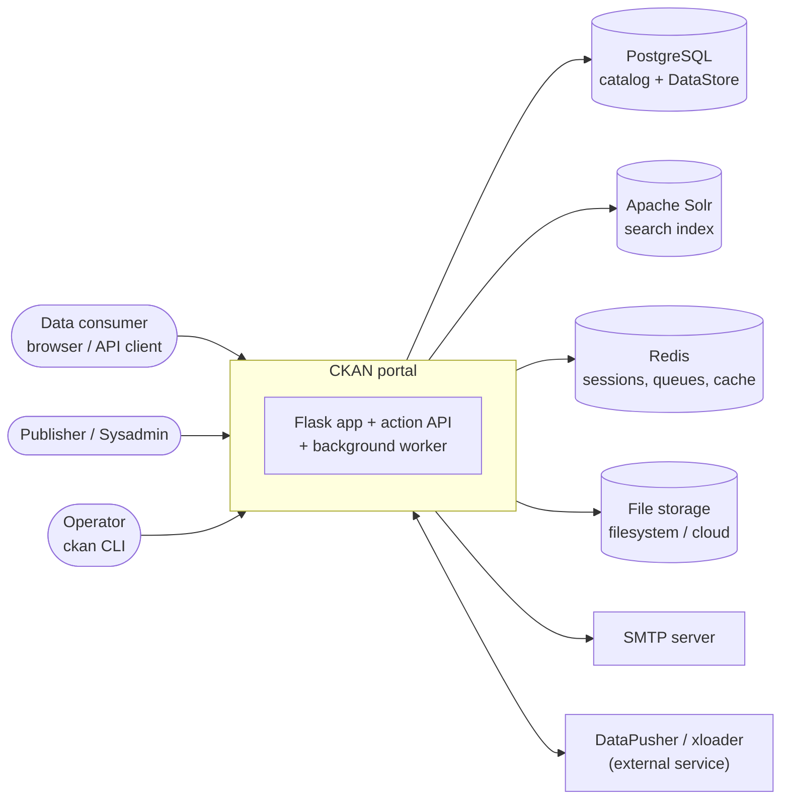

`ckanext/datapusher` is the interesting arrow: CKAN *calls out* to a separate DataPusher
service (`datapusher_submit`) which then *calls back* into CKAN's API
(`datapusher_hook`, `ckanext/datapusher/logic/action.py:200`) — a webhook round trip, not an
in-process job.

---

## 3. High-Level Structure

CKAN is a layered monolith. The rule that shapes everything: **HTTP never touches the model
directly.** Views and the API both funnel through `logic.get_action(name)(context, data_dict)`.

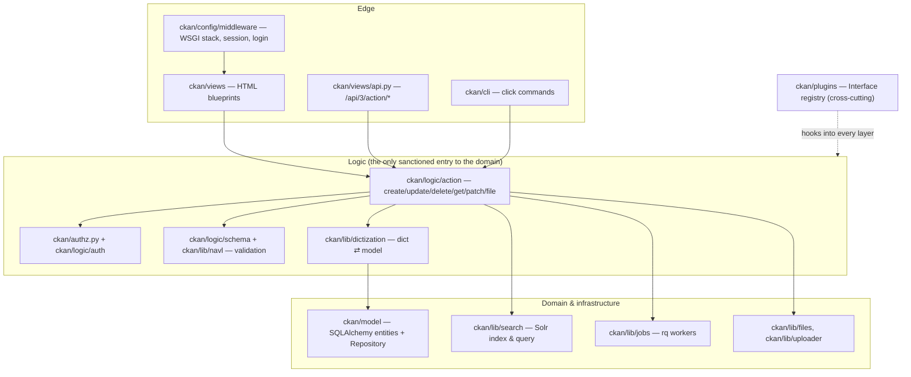

| Path | Responsibility |
|---|---|
| `wsgi.py`, `ckan/config/middleware/` | Build the WSGI app: `make_app` → `load_environment` + `make_flask_stack` |
| `ckan/config/environment.py` | `load_environment` / `update_config` — re-runs whenever the active plugin set changes |
| `ckan/config/declaration/`, `config_declaration.yaml` | Typed, self-documenting config schema (`Flag.flask` marks keys copied into `app.config`) |
| `ckan/views/` | HTML blueprints: `dataset`, `resource`, `group`, `user`, `home`, `admin`, `dashboard`, `feed`, `file`, `api` |
| `ckan/logic/` | The action layer — the system's real public API |
| `ckan/authz.py`, `ckan/logic/auth/` | One auth function per action; `check_access` is the single gate |
| `ckan/lib/navl/`, `ckan/logic/schema/`, `ckan/logic/validators.py` | Declarative dict validation ("navl") |
| `ckan/lib/dictization/` | `model_dictize.py` (model → dict), `model_save.py` (dict → model) |
| `ckan/model/` | SQLAlchemy tables + mapped classes + `Repository` (migrations, init/clean/rebuild) |
| `ckan/lib/search/` | `PackageSearchIndex` / `PackageSearchQuery` over Solr |
| `ckan/plugins/` | `Interface`, `Plugin`, `SingletonPlugin`, `PluginImplementations`, `toolkit` |
| `ckan/cli/` | `click` command groups, extendable by `IClick` plugins |
| `ckan/templates/`, `ckan/public/` | Jinja2 templates + static assets (with a `-midnight-blue` theme variant) |
| `ckanext/` | First-party extensions shipped in-tree (see §7) |

### 3.1 The WSGI stack

Built top-down in `make_flask_stack` (`ckan/config/middleware/flask_app.py:240`). Order is
load-bearing — read it as an onion, outermost last:

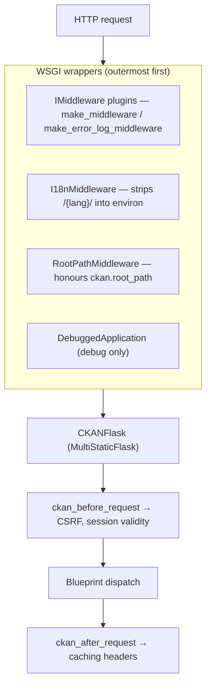

Notable choices, all in `flask_app.py`:

- `CKANFlask` extends `MultiStaticFlask` (`ckan/lib/flask_multistatic.py`) so `static_folder`
  is a **list** — core public dir, extension public dirs, and the upload storage dir all
  serve from one URL space (`flask_app.py:264-269`).
- Sessions are pluggable at the interface level: `CKANSession` picks
  `CKANSecureCookieSessionInterface` or `CKANRedisSessionInterface`
  (`common_middleware.py:31,56`).
- **Plugin blueprints are registered before core blueprints** (`flask_app.py:359-361`) —
  first-registered wins, so an extension can shadow any core route.
- Authentication is Flask-Login with two loaders: `load_user` (session) and
  `load_user_from_request` (`flask_app.py:440`), the latter resolving API tokens via
  `_get_user_for_apitoken`.

---

## 4. Components — inside the Logic layer

This is the container worth zooming into: everything else is an adapter around it.

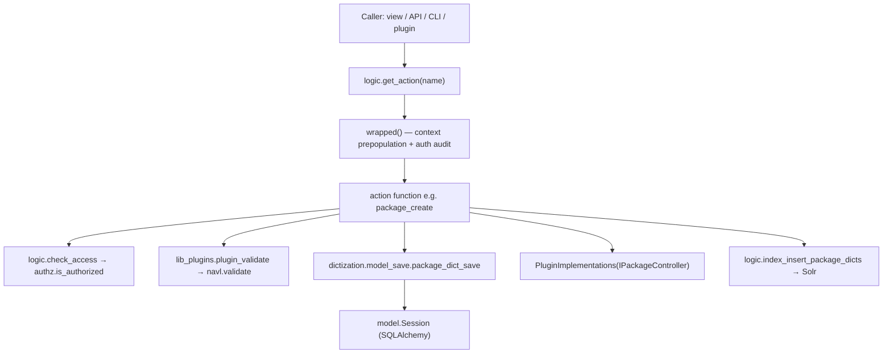

**`get_action` (`ckan/logic/__init__.py:448`) is the system's dispatch table**, and it is where
the plugin model bites hardest. On first call it:

1. Imports `ckan.logic.action.{get,create,update,delete,patch,file}` and harvests every public
   function (`authz.get_local_functions`). Everything in `get.py` is marked
   `side_effect_free = True` unless it says otherwise.
2. Walks `PluginImplementations(IActions)`. A plain plugin action **replaces** the core one
   (and a second plugin claiming the same name raises `NameConflict`); a `@chained_action`
   instead **wraps** the previous implementation via `functools.partial(func, prev_func)`,
   forming a decorator chain over core.
3. Wraps every resulting callable so the caller gets automatic context prepopulation
   (`model`, `session`, `user`) and an **auth audit**: the action name is pushed on
   `context['__auth_audit']` and `check_access` pops it — an action that never called
   `check_access` and isn't `auth_audit_exempt` is caught.

The same override-or-chain pattern repeats for auth functions (`AuthFunctions` in
`ckan/authz.py:37`, `chained_auth_function`), validators (`IValidators`), and template helpers
(`ITemplateHelpers`). Learn it once, it explains most of the codebase.

### 4.1 Validation ("navl")

`ckan/lib/navl/dictization_functions.py` implements a small declarative engine: a schema is a
dict mapping field names to *lists of validator callables*. `flatten_dict` turns nested
data into tuple keys (`('resources', 0, 'url')`), validators run in order, `Invalid` collects
an error and `StopOnError` halts that field's chain, then `unflatten` rebuilds the structure.
Result: `(data, errors)` — never exceptions for ordinary user error.

Which schema is used is itself a plugin decision: `lib_plugins.lookup_package_plugin(type)`
returns an `IDatasetForm` implementation (default `DefaultDatasetForm`,
`ckan/lib/plugins.py:344`) and `plugin_validate` calls *its* `create_package_schema()`.

---

## 5. OOP & Class Architecture

Three object families carry the design. CKAN is not a "services and DTOs" codebase — its
domain objects are SQLAlchemy-mapped Active Records with behaviour mixins, and its
polymorphism lives in the plugin registry rather than in deep inheritance trees.

### 5.1 The plugin system

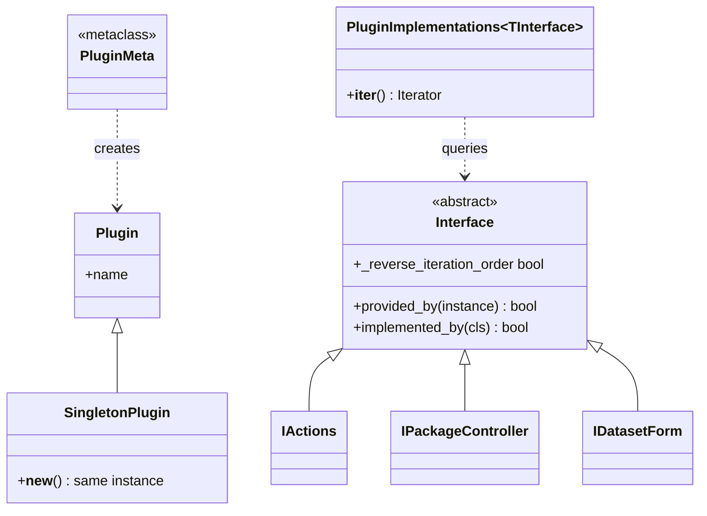

`ckan/plugins/base.py` deliberately avoids a heavyweight component framework: `Interface`
registers subclasses in `__init_subclass__`, `implements()` records the declared interfaces on
the class, and `PluginImplementations(SomeInterface)` iterates the *loaded, ordered* plugins
that declare it. `SingletonPlugin.__new__` guarantees one instance per class. Plugin loading
(`ckan/plugins/core.py:146`) reads the `ckan.plugins` entry-point group, notifies
`IPluginObserver`, connects `ISignal` mappings, and calls
`ckan.config.environment.update_config()` so config/templates/helpers re-derive.

**Design pattern census:**

| Pattern | Where | Why |
|---|---|---|
| Registry + service locator | `get_action`, `AuthFunctions`, `get_validator`, `h.helper_functions` | Late binding so plugins can override without import surgery |
| Decorator (runtime) | `@chained_action`, `@chained_auth_function` | Extensions wrap core behaviour instead of replacing it |
| Observer | `IDomainObjectModification` via `DomainObjectModificationExtension`; `blinker` signals in `ckan/lib/signals.py` + `ISignal` | Decouple "package changed" from "reindex", "write activity" |
| Strategy | `DatastoreBackend` subclasses; `SearchIndex` / `SearchQuery` subclasses; `IUploader` | Swap the storage/search implementation per deployment |
| Template Method | `DefaultDatasetForm`, `DefaultGroupForm`, `DefaultTranslation`, `DefaultPermissionLabels` (`ckan/lib/plugins.py`) | Extensions subclass and override only what differs |
| Data Mapper + dictization | `ckan/lib/dictization` | The wire format is a plain dict, never an ORM object |
| Facade | `ckan.plugins.toolkit`, `ckan/lib/helpers.py` | One import-stable surface for 113 `@core_helper` functions plus toolkit exports |
| Mixin composition | `ckan/model/base.py`, `ckan/model/core.py` | Behaviour without a deep class hierarchy |

### 5.2 Domain model objects

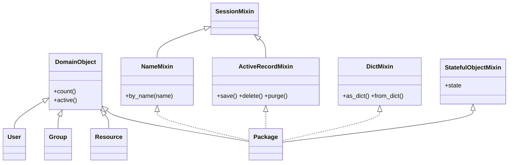

Class-level notes grounded in `ckan/model/`:

- `DomainObject` (`domain_object.py:38`) is the common base; concrete entities layer in
  mixins from `base.py` (`SessionMixin`, `NameMixin`, `TextSearchMixin`, `ActiveRecordMixin`,
  `DictMixin`, `DebugMixin`) and `core.StatefulObjectMixin` for the `state` lifecycle
  (`active` / `deleted` — CKAN soft-deletes almost everything).
- `Repository` (`ckan/model/__init__.py:185`) is the schema-lifecycle object, not a
  per-entity repository: `init_db`, `clean_db`, `rebuild_db`, `upgrade_db`, `downgrade_db`,
  `current_version` — it wraps Alembic and is what `ckan db` CLI commands drive.
- `Member` (`group.py:63`) is a deliberately generic association row (`table_name`,
  `table_id`, `group_id`, `capacity`) — one table expresses dataset↔group, user↔organization
  role, and group↔group nesting.
- `ModelFollowingModel` (`follower.py:25`) is a small generic base specialised into
  `UserFollowingUser`, `UserFollowingDataset`, `UserFollowingGroup`.

### 5.3 Search and DataStore strategies

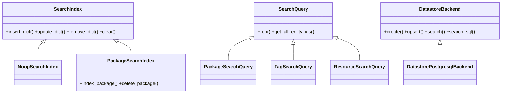

`index_for()` / `query_for()` (`ckan/lib/search/__init__.py:85,111`) are the factories;
`DatastoreBackend.set_active_backend(config)` (`ckanext/datastore/backend/__init__.py:81`)
selects the backend registered by `IDatastoreBackend` plugins.

---

## 6. Key Flows

### 6.1 Write path — `POST /api/3/action/package_create`

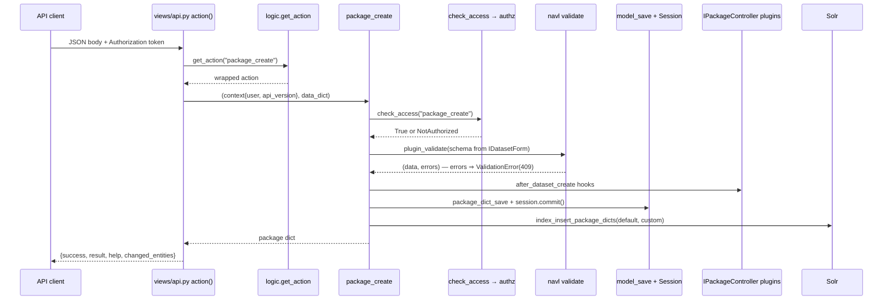

`views/api.py:279-345` is where domain exceptions become HTTP: `NotAuthorized`→403,
`NotFound`→404, `ValidationError`→409, `SearchQueryError`→400, `SolrConnectionError`→500.
The action layer itself never knows about HTTP.

### 6.2 Read path — dataset search

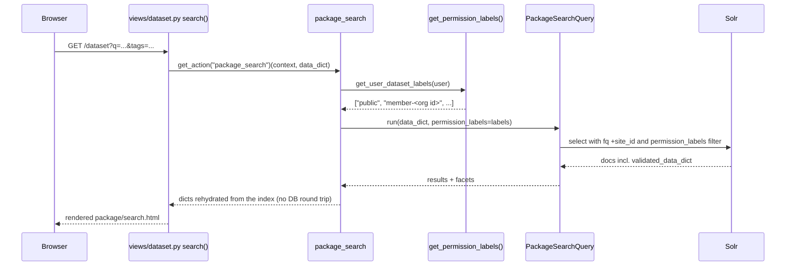

The load-bearing detail: **search results are served from Solr's stored
`validated_data_dict`, not from PostgreSQL**, and authorisation is pushed *into the query* as
a `permission_labels` filter (`ckan/logic/action/get.py:1490,1506`) rather than applied as a
post-filter. Fast, but it means a stale index is a correctness bug, not just a freshness one —
see `ckan search-index rebuild` (`ckan/cli/search_index.py`).

### 6.3 Model-change notification

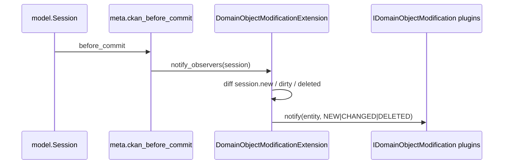

`ckan/model/meta.py` registers `ckan_before_flush`, `ckan_before_commit`, `ckan_after_commit`
and `ckan_after_rollback` on the SQLAlchemy session; `DomainObjectModificationExtension`
(`ckan/model/modification.py:14`) is itself a `SingletonPlugin` that fans out to
`IDomainObjectModification` implementations. This is how the activity stream and
`IResourceUrlChange` consumers hear about writes without the action layer calling them.

---

## 7. Extension Points

CKAN's extension surface is unusually wide — this is the framework half of the hybrid.

**Registration.** A distribution declares `ckan.plugins` entry points; a site lists the names
in `ckan.plugins = ...` in its INI; `ckan.plugins.core.load_all()` instantiates them in
listed order and calls `update_config()`.

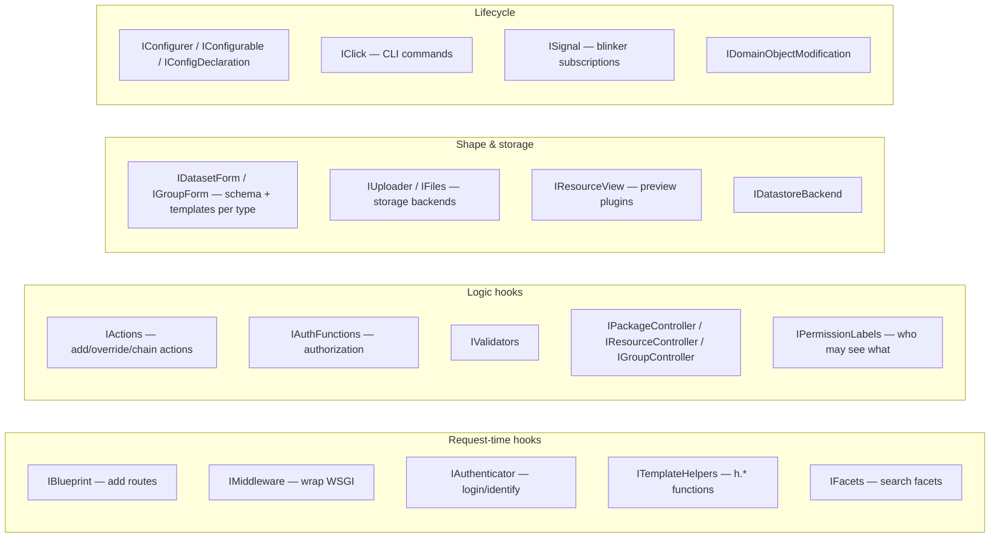

Three mechanisms worth naming, because they behave differently:

1. **Override** — `IActions`, `IAuthFunctions`, `ITemplateHelpers`, `IValidators`: last word
   wins, conflicts between two plugins raise.
2. **Chain** — `@chained_action` / `@chained_auth_function`: each plugin receives the previous
   implementation as its first argument and decides whether to call it.
3. **Observe** — `IPackageController.after_dataset_update`, `IDomainObjectModification`,
   `ISignal`: notification only, no return contract.

`ckan/plugins/blanket.py` supplies decorators (`@blanket.actions`, `@blanket.helpers`, …) that
auto-wire a plugin's module-level functions to the matching interface, removing the
boilerplate `get_actions()` dict.

**Type-driven customisation.** `IDatasetForm.package_types()` / `IGroupForm.group_types()`
let a plugin claim a `package.type` value; `lib_plugins.register_package_blueprints`
(`ckan/lib/plugins.py:127`) then mints URL rules for that type. This is how "a portal with
datasets *and* geospatial layers *and* showcases" is built without forking.

**In-tree extensions as reference implementations** (`ckanext/`): `datastore` (SQL store +
`IDatastoreBackend`), `datapusher` (external ingestion service), `activity` (activity streams,
its own model + migrations), `tracking` (page-view counters via `IMiddleware`), `stats`,
`multilingual`, `resourceproxy`, the view plugins (`textview`, `imageview`, `audioview`,
`videoview`, `webpageview`, `datatablesview`), `tabledesigner`, `expire_api_token`. Everything
prefixed `example_*` exists purely as documentation-grade demonstrations of one interface each.

---

## 8. Key Abstractions / Glossary

| Term | Meaning in CKAN |
|---|---|
| **Package / Dataset** | The catalogue record. `package` is the DB/code name, "dataset" the UI name. Has a `type` (default `dataset`) that selects its `IDatasetForm`. |
| **Resource** | A file or URL belonging to a package (`resource` table, FK `package_id`). |
| **Group** vs **Organization** | Same `group` table; `is_organization` distinguishes them. Organizations own datasets (`package.owner_org`) and grant roles; groups are curatorial collections. |
| **Member** | Generic membership row linking a `group` to any object by `(table_name, table_id)` with a `capacity` (role). |
| **Action function** | `f(context, data_dict) -> result` in `ckan/logic/action/*`. The unit of API surface, authorisation, and plugin override. |
| **Context** | Per-call dict carrying `model`, `session`, `user`, `auth_user_obj`, optional `schema`, plus internal audit keys. Explicitly *not* reusable across calls. |
| **data_dict** | Plain JSON-able input; **`dictize`** = model → dict, **`save`** = dict → model. |
| **navl** | The declarative validation engine in `ckan/lib/navl` (schema = dict of field → validator list). |
| **Auth function** | `f(context, data_dict) -> {'success': bool, 'msg': str}` in `ckan/logic/auth/*`, reached only via `check_access`. |
| **Permission label** | String tag (e.g. `public`, `member-<org-id>`) written into the Solr document and into the user's query filter, implementing row-level read authorisation in search (`IPermissionLabels`). |
| **State** | Soft-delete lifecycle (`active` / `deleted`) on most entities via `StatefulObjectMixin`. |
| **Plugin / Extension** | A `SingletonPlugin` subclass declaring `Interface`s, discovered through the `ckan.plugins` entry point. |
| **Toolkit** | `ckan.plugins.toolkit` — the import-stable façade extensions are supposed to use instead of reaching into `ckan.*` internals. |
| **DataStore** | Per-resource PostgreSQL tables holding the *contents* of tabular resources, queryable via `datastore_search` / `datastore_search_sql`. |

---

## 9. Open Questions & Notes

Explicit boundaries of this document — things I did not verify from the repo:

- **Deployment topology is out of scope of the source tree.** `ckan-uwsgi.ini`,
  `ckan/config/supervisor-ckan-worker.conf` and `contrib/` show the *intended* shape
  (uWSGI app processes + a supervisor-managed `ckan jobs worker`), but replica counts,
  reverse-proxy layout, and Solr/Postgres HA are deployment decisions not encoded here.
- **`IForkObserver` / `before_fork`** exists (implemented by `DatastorePlugin`) to reset
  engine pools across uWSGI forks. I read the interface, not the full fork lifecycle.
- **Two theme trees** (`templates/` + `templates-midnight-blue/`, `public/base` +
  `public-midnight-blue/base`) coexist on this branch. I did not determine which is the
  default in 2.13 or whether the older tree is scheduled for removal — check
  `ckan.base_public_folder` / `ckan.base_templates_folder` in the config declaration for the
  live answer on a given site.
- **`ckan/lib/files/` (file-keeper) vs `ckan/lib/uploader.py`** are two generations of file
  handling living side by side (`FKUpload` / `FKResourceUpload` bridge them). Which is
  canonical for 2.13 is a migration-in-progress question I could not settle from code alone;
  `CHANGELOG.rst` and the `changes/` towncrier fragments are the place to look.
- **Interface ordering.** `Interface._reverse_iteration_order` (`ckan/plugins/base.py:60`,
  honoured in `ckan/plugins/core.py:109`) flips iteration direction. Exactly five interfaces
  set it: `IConfigDeclaration`, `IConfigurer`, `IValidators`, `ITemplateHelpers`,
  `ITranslation` — i.e. the "last plugin listed wins" registries. I did not trace the
  rationale for each one individually.
