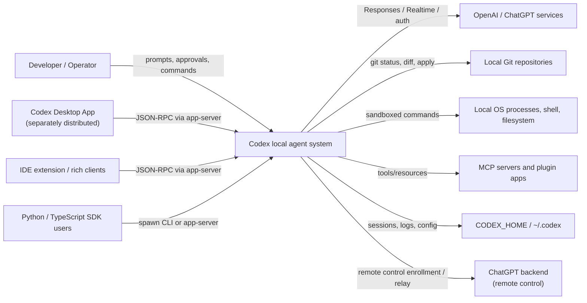
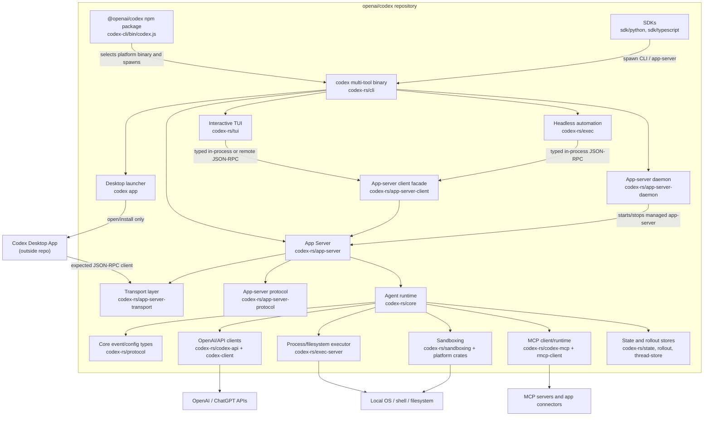
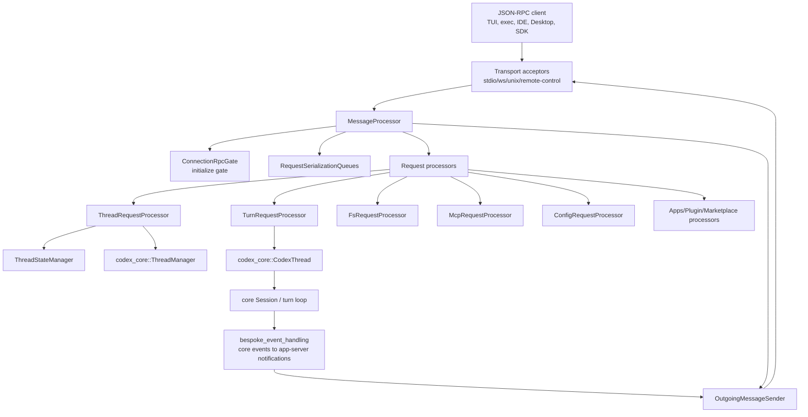
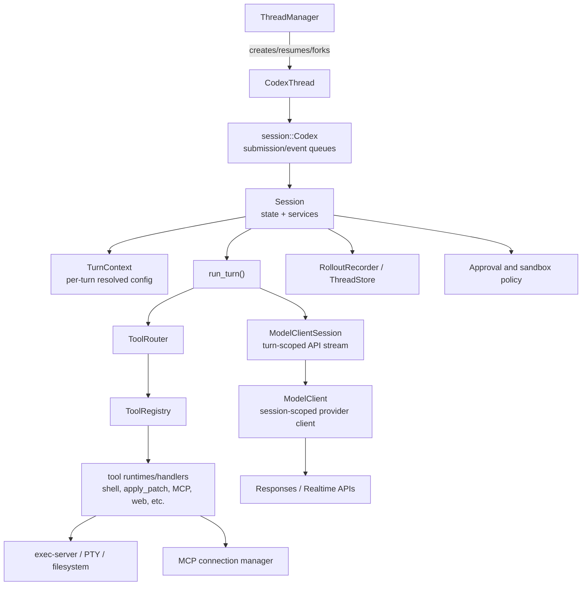
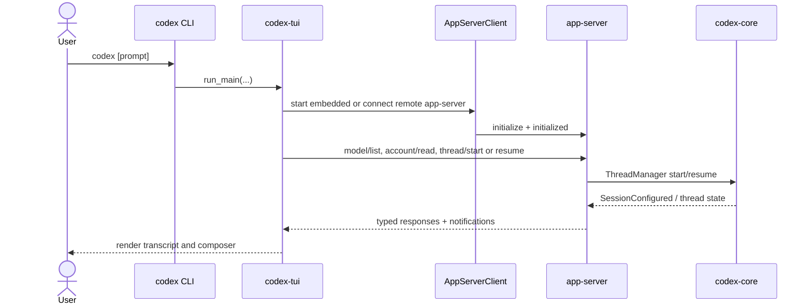
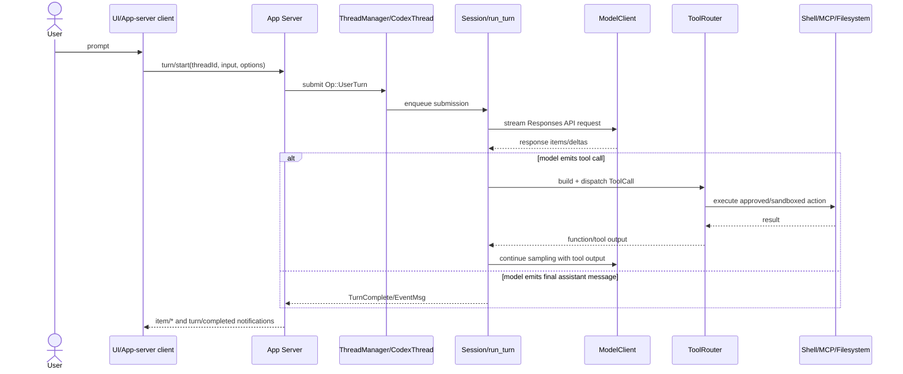
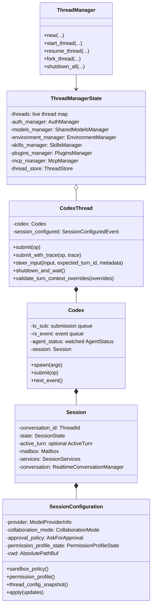
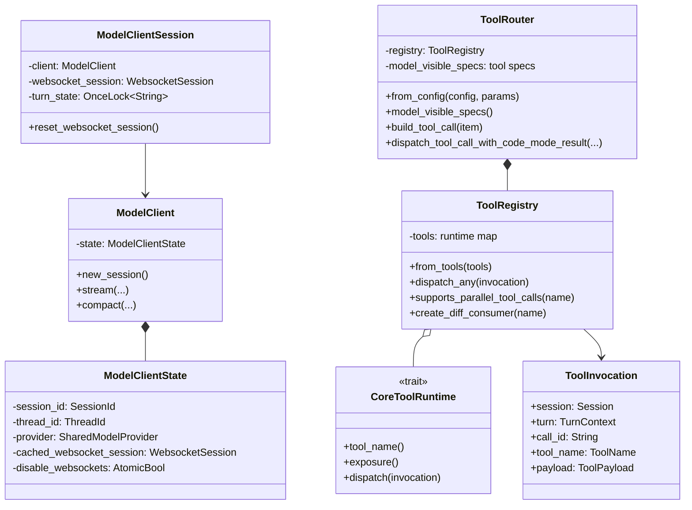
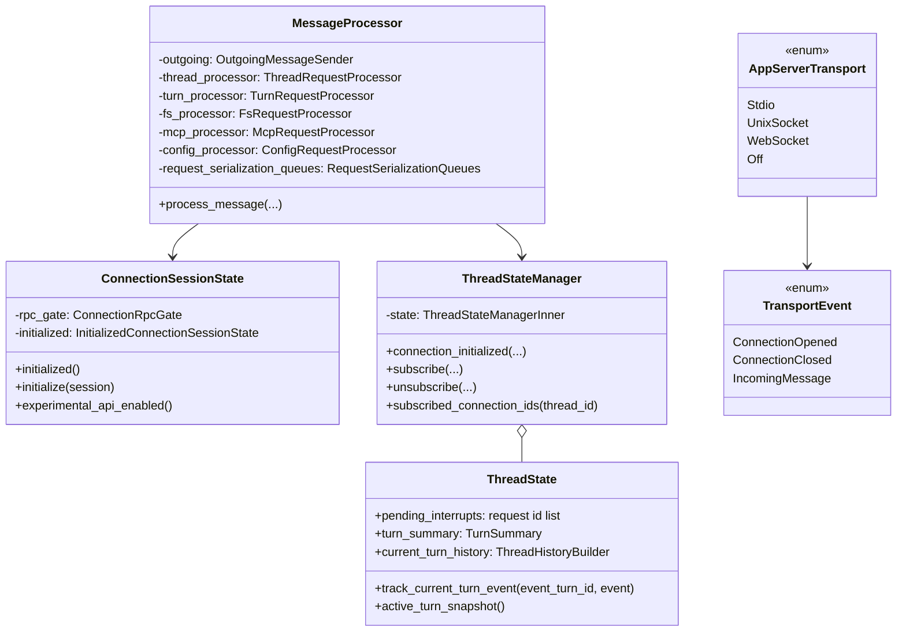
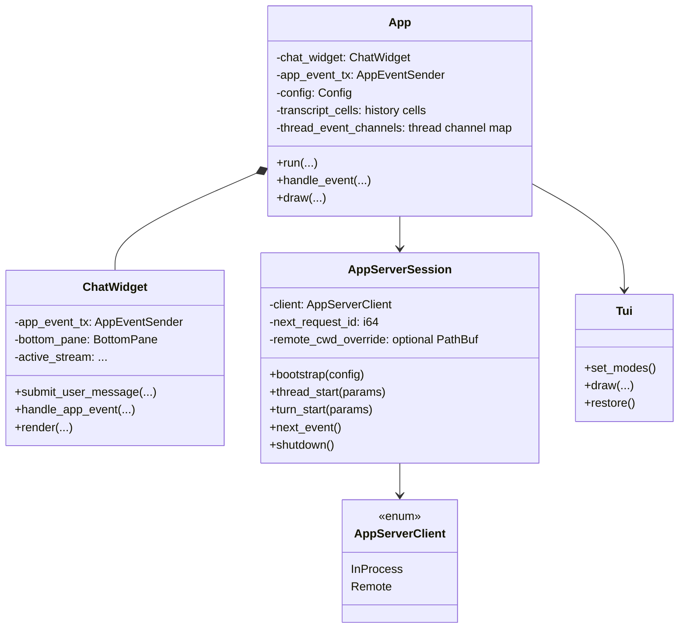

This report documents the architecture visible in this cloned repository. It focuses on the maintained Rust implementation under `codex-rs/`, the repo packaging and SDK layers around it, and the local app-server surface used by richer clients such as IDEs and the separately distributed Codex Desktop App.

## Executive Summary

Codex is primarily a local Rust agent runtime wrapped by several user interfaces:

- `codex` is the multi-tool binary in `codex-rs/cli`.
- The default interactive terminal UI is `codex-rs/tui`.
- The non-interactive automation mode is `codex-rs/exec`.
- Rich UI clients talk to `codex app-server`, a JSON-RPC app-server implemented in `codex-rs/app-server`.
- Agent behavior lives mainly in `codex-rs/core`, which coordinates model calls, tools, approvals, sandboxed execution, MCP integration, rollout persistence, and thread/turn state.

The Codex Desktop App UI source is not present in this repo. The repo contains a launcher/installer command, `codex app`, that opens an installed `Codex.app` on macOS or the installed Windows app, and downloads/opens the installer when missing. The source visible here strongly suggests the desktop app consumes the local/remote app-server protocol rather than embedding the terminal UI.

## Main Mental Model

The most useful mental model is:

```text
User interface
  -> app-server protocol facade
    -> thread manager
      -> core session / turn loop
        -> model provider + tool router
          -> shell, filesystem, MCP, apps, patches, web, memories, etc.
```

For the terminal UI and `codex exec`, the app-server can run in-process, so there may be no OS process boundary between UI and agent runtime. For desktop, IDE, SDK, or remote clients, the app-server boundary is explicit JSON-RPC over stdio, WebSocket, Unix socket, or remote-control WebSocket.

## C1 - System Context



### External Actors And Systems

| Name | Type | Interaction |
| --- | --- | --- |
| Developer / operator | Person | Starts threads, submits prompts, reviews approvals, applies patches, uses CLI/TUI/Desktop/SDKs. |
| Codex Desktop App | External UI app | Opened by `codex app`; expected to communicate through app-server/remote-control surfaces. Source is not in this repo. |
| IDE / rich clients | External UI clients | Use `codex app-server` JSON-RPC to manage threads, turns, filesystem, approvals, models, plugins, and tools. |
| OpenAI / ChatGPT services | External services | Model inference, auth, ChatGPT-specific APIs, remote-control backend. |
| MCP servers / apps / plugins | External or local tool providers | Provide tool calls, resources, templates, app connectors, and plugin-provided capabilities. |
| Local OS and shell | Platform | Executes commands, PTYs, sandbox policies, filesystem reads/writes, notifications, clipboard, keychain. |
| Local repository | Workspace | Codex reads, edits, diffs, searches, and runs tests in the user's project. |
| CODEX_HOME | Local state | Config, sessions/rollouts, SQLite state, logs, daemon state, plugin/skill state. |

## C2 - Containers



### Container Responsibilities

| Container | Path | Responsibility |
| --- | --- | --- |
| npm package wrapper | `codex-cli/` | Lightweight Node package that selects the correct platform-native `codex` binary and spawns it. |
| CLI multi-tool | `codex-rs/cli/` | Clap-based command dispatcher for TUI, exec, login, MCP, app-server, desktop launcher, sandbox, cloud tasks, and utilities. |
| TUI | `codex-rs/tui/` | Ratatui/Crossterm terminal application. It is now an app-server client and usually starts an embedded in-process app-server. |
| Exec | `codex-rs/exec/` | Non-interactive mode for scripts/CI. It starts app-server in-process and formats event streams as human output or JSONL. |
| App Server | `codex-rs/app-server/` | JSON-RPC server for rich clients. Owns request processors, thread subscriptions, approval requests, filesystem/search APIs, config APIs, plugins/apps APIs, and event mapping. |
| App-server protocol | `codex-rs/app-server-protocol/` | Typed request/response/notification schema. Exports TypeScript and JSON Schema using `ts-rs` and `schemars`. v2 is the active API surface. |
| App-server transport | `codex-rs/app-server-transport/` | Stdio, WebSocket, Unix socket, and remote-control transport plumbing. |
| App-server client | `codex-rs/app-server-client/` | Shared facade for in-process and remote app-server clients. Used by TUI and exec. |
| App-server daemon | `codex-rs/app-server-daemon/` | Unix-only lifecycle manager for remote-control app-server processes launched from managed installs. |
| Core runtime | `codex-rs/core/` | Business logic: threads, sessions, turn loop, tools, approvals, sandbox decisions, MCP, skills/plugins, model calls, rollout recording. |
| Core protocol | `codex-rs/protocol/` | Low-dependency core internal event/config/model types shared between core, TUI, exec, and app-server mapping. |
| API/client layers | `codex-rs/codex-api/`, `codex-rs/codex-client/`, `codex-rs/model-provider*` | Model/provider abstractions, HTTP/SSE/WebSocket clients, retries, provider catalogs, auth headers. |
| Execution server | `codex-rs/exec-server/` | JSON-RPC process/filesystem server for local and remote execution environments. |
| Sandbox crates | `codex-rs/sandboxing/`, `linux-sandbox/`, `windows-sandbox-rs/`, `bwrap/` | Platform sandbox policy implementation and helpers. |
| MCP / plugins / skills | `codex-rs/codex-mcp/`, `core-plugins/`, `plugin/`, `skills/`, `core-skills/` | MCP connections, bundled/remote plugin capabilities, skill discovery and injection. |
| State/persistence | `codex-rs/state/`, `rollout/`, `thread-store/` | SQLite state, logs, JSONL rollout/session history, thread store abstractions. |
| SDKs | `sdk/python/`, `sdk/typescript/` | Developer-facing SDKs. Python targets app-server JSON-RPC v2 over stdio; TypeScript wraps the CLI. |

## C3 - App-server Components

`codex app-server` is the boundary that makes Codex usable by non-terminal clients.



Important app-server concepts:

- `MessageProcessor` owns one processor object per API area, for example account, apps, catalog, command execution, config, environment, filesystem, git, initialize, marketplace, MCP, plugin, search, thread, turn, and Windows sandbox.
- `ConnectionSessionState` enforces the initialize/initialized handshake before normal requests.
- `ThreadStateManager` tracks subscribed connections, per-thread listener state, active-turn summaries, pending interrupts, and ordered thread listener commands.
- `OutgoingMessageSender` and the transport outbound loop decouple app-server processing from slow client writes.
- Request serialization scopes keep thread and process operations ordered when needed without serializing every request globally.

## C3 - Core Runtime Components

The core runtime is where the agent actually works.



Important core concepts:

- `ThreadManager` keeps live threads in memory and abstracts local/in-memory thread stores.
- `CodexThread` is the public-ish thread conduit. It wraps a lower-level `session::Codex` and exposes operations such as `submit`, `submit_with_trace`, `steer_input`, shutdown, rollout flushing, goal mutation, and turn-context validation.
- `session::Codex` is a queue pair: callers send `Submission`/`Op` values and receive `Event` values.
- `Session` holds the mutable session state, active turn, mailbox, goal runtime, services, and resolved session configuration.
- `run_turn()` is the main sampling loop. It builds context, injects skills/plugins/apps, calls the model, dispatches tool calls, records events, and stops when a final assistant message or terminal condition is reached.
- `ModelClient` is session-scoped. `ModelClientSession` is turn-scoped so sticky routing and WebSocket reuse do not leak between turns.
- `ToolRouter` converts model `ResponseItem` values into `ToolCall`s and dispatches through `ToolRegistry`.

## Runtime Flow

### Starting A TUI Session



### Running A Turn



## File And Folder Structure

Top-level layout:

```text
.
├── codex-rs/                 Rust workspace: CLI, TUI, app-server, core, protocol, tools
├── codex-cli/                npm wrapper package for native Codex binaries
├── sdk/
│   ├── python/               Python SDK for app-server v2
│   ├── python-runtime/       Python wheel template carrying platform CLI binary
│   └── typescript/           TypeScript SDK wrapping the CLI
├── docs/                     User-facing OSS documentation
├── scripts/                  Repo/release/helper scripts
├── tools/                    Repo-local tools, e.g. argument-comment-lint
├── third_party/              Vendored third-party source trees
├── patches/                  Bazel/rules/V8/platform patches
├── BUILD.bazel, MODULE.bazel Bazel build graph and external dependencies
├── package.json              Root pnpm workspace and formatting scripts
├── pnpm-workspace.yaml       npm package workspace definition
└── justfile                  Developer commands; defaults to codex-rs as cwd
```

Key `codex-rs/` structure:

```text
codex-rs/
├── cli/                      `codex` multi-tool binary
├── tui/                      interactive terminal UI
├── exec/                     headless `codex exec`
├── core/                     main agent runtime and session logic
├── protocol/                 core protocol/event/config types
├── app-server*/              rich-client JSON-RPC server, protocol, transport, client, daemon
├── codex-api/, codex-client/ model/API transport abstractions
├── model-provider*/          model provider and catalog information
├── exec-server/              process/filesystem execution service
├── sandboxing/               platform sandbox policy implementation
├── codex-mcp/, rmcp-client/  MCP client integration
├── plugin/, core-plugins/    plugin model and plugin manager
├── skills/, core-skills/     skill loading and instruction injection
├── state/, rollout/          SQLite state/logging and JSONL rollout persistence
├── thread-store/             thread persistence abstraction
├── login/, keyring-store/    auth and credential storage
├── config/                   config.toml types/loading/merge/validation
├── cloud-*/, chatgpt/        ChatGPT/Codex Cloud and cloud-task helpers
└── utils/*                   small utility crates
```

The Rust workspace is intentionally split into many crates. This repo currently has over 100 `Cargo.toml` files under `codex-rs`, including test-support and utility crates. That split keeps the core usable by several surfaces without forcing everything into `codex-core`.

## OOP / UML View

Rust is not inheritance-oriented, so the "OOP structure" is mostly:

- structs own state and expose methods,
- enums model closed state machines/protocol variants,
- traits define substitutable behavior,
- `Arc`, channels, `Mutex`/`RwLock`, `watch`, and `broadcast` wire long-lived services together.

### Core Thread And Session UML



### Model And Tool UML



### App-server UML



### TUI UML



## Important Protocol Boundaries

| Boundary | Types / crates | Notes |
| --- | --- | --- |
| UI to app-server | `codex-app-server-protocol`, `codex-app-server-client`, `codex-app-server-transport` | JSON-RPC-style requests, responses, notifications, and server requests. In-process clients preserve app-server semantics but avoid serialization on the hot path where possible. |
| App-server to core | `codex-core::ThreadManager`, `CodexThread`, `codex-protocol` | App-server processors validate/marshal API payloads into core operations and map core events back to app-server items/notifications. |
| Core to model provider | `ModelClient`, `codex-api`, `codex-client`, `model-provider*` | Handles auth/provider selection, HTTP/SSE/WebSocket Responses API calls, compaction, realtime, and fallback behavior. |
| Core to tools | `ToolRouter`, `ToolRegistry`, `CoreToolRuntime`, MCP managers | Model output items become typed tool calls; handlers produce tool outputs fed back to the model. |
| Core to OS execution | `exec-server`, `utils/pty`, `sandboxing`, `shell-command` | Commands may use PTYs, sandbox policies, approval flows, and platform-specific sandbox helpers. |
| Persistence | `rollout`, `thread-store`, `state`, `config` | JSONL sessions/rollouts, SQLite state/logs, config layering, thread metadata. |

## Codex Desktop App Ingredients Visible In This Repo

The native Desktop App source is not present here. Evidence:

- `codex app` only launches or installs an external app bundle/store app.
- macOS launcher checks `/Applications/Codex.app` and `$HOME/Applications/Codex.app`, otherwise downloads a DMG from `persistent.oaistatic.com`.
- Windows launcher looks for a Start menu app named `Codex`, otherwise opens a Microsoft Store installer URL.
- No Swift, Xcode, Electron, Tauri, React/Vite app, Flutter, or webview app source tree appears in the repo.

The repo-side ingredients that support desktop-style clients are:

| Ingredient | Path | Frameworks / libraries |
| --- | --- | --- |
| Launcher / installer | `codex-rs/cli/src/app_cmd.rs`, `desktop_app/` | Rust, `tokio::process`, macOS `open`, `curl`, `hdiutil`, Windows PowerShell/Explorer. |
| App-server protocol | `codex-rs/app-server-protocol/` | `serde`, `serde_json`, `ts-rs`, `schemars`, experimental API macros. |
| App-server runtime | `codex-rs/app-server/` | Rust 2024, `tokio`, `axum`, bounded channels, `tracing`, `serde`, app-server processors. |
| Transports | `codex-rs/app-server-transport/` | stdio JSONL, WebSocket via `axum`/`tokio-tungstenite`, Unix socket, remote-control WebSocket. |
| Daemon/control plane | `codex-rs/app-server-daemon/` | Unix pidfile daemonization, file locking, managed install/update loop, JSON stdout control commands. |
| Client facade | `codex-rs/app-server-client/` | Typed in-process channels and remote WebSocket/Unix socket client, shared by TUI/exec. |
| Remote control | `codex-rs/app-server-transport/src/transport/remote_control/` | ChatGPT backend enrollment endpoints, WebSocket relay, segmentation/ack handling, persisted enrollment in SQLite state. |
| Local agent backend | `codex-rs/core/` | Model client, tools, session loop, sandboxing, MCP, skills/plugins, rollouts. |
| App/SDK protocol consumers | `codex-rs/tui/`, `codex-rs/exec/`, `sdk/python/`, `sdk/typescript/` | TUI and exec use the app-server client; Python SDK targets app-server v2; TypeScript SDK wraps CLI. |

So if you are trying to understand "what the desktop app talks to", study `app-server`, `app-server-protocol`, `app-server-transport`, and `app-server-daemon`. If you are trying to understand "how the native desktop UI is built", this repo does not contain enough source to answer that.

## Major Libraries And Frameworks

| Area | Libraries / tools |
| --- | --- |
| Rust runtime | Rust 2024 workspace, `tokio`, `futures`, `async-channel`, `tokio-util`. |
| CLI | `clap`, `clap_complete`, `owo-colors`, `supports-color`. |
| TUI | `ratatui`, `crossterm`, `ratatui-macros`, `pulldown-cmark`, `syntect`, `two-face`, `unicode-width`, `arboard`, `cpal` on non-Linux for audio. |
| HTTP/model APIs | `reqwest`, `eventsource-stream`, `tokio-tungstenite`, `tungstenite`, `http`, `url`. |
| App-server | `axum`, WebSocket support, JSON-RPC message types, `serde`, `serde_json`, bounded `tokio::mpsc` queues. |
| Schema generation | `ts-rs`, `schemars`, generated TypeScript under `app-server-protocol/schema/typescript/v2`. |
| Persistence/config | `sqlx`, `toml`, `toml_edit`, `serde`, `chrono`, `time`, `uuid`. |
| MCP | `rmcp`, `codex-mcp`, `rmcp-client`. |
| Execution/sandbox | `portable-pty`, `codex-utils-pty`, macOS Seatbelt profiles, Linux bubblewrap/Landlock, Windows sandbox crate. |
| Search/render helpers | `ignore`, `walkdir`, `regex-lite`, `bm25`, `image`. |
| Observability/testing | `tracing`, `tracing-subscriber`, `opentelemetry`, `insta`, `wiremock`, `pretty_assertions`. |
| JS packaging | `pnpm`, root `package.json`, `codex-cli` package, platform-native optional packages. |
| Python SDK | `pydantic`, `hatchling`, `uv`, generated app-server models. |
| TypeScript SDK | `typescript`, `tsup`, `jest`, `zod`, `zod-to-json-schema`. |
| Build/release | Cargo, `just`, Bazel (`MODULE.bazel`, `rules_rs`), npm staging scripts. |

Notable patches: the workspace patches `crossterm`, `ratatui`, `tokio-tungstenite`, and `tungstenite` to specific Git revisions under `[patch.crates-io]`.

## High-value Reading Order

For learning the codebase without drowning:

1. Start at `README.md` and `codex-rs/README.md` for product and workspace orientation.
2. Read `codex-rs/cli/src/main.rs` to see command boundaries.
3. Read `codex-rs/app-server/README.md` for the rich-client API model: Thread -> Turn -> Item.
4. Read `codex-rs/app-server-protocol/src/protocol/v2/` to understand the external API shape.
5. Read `codex-rs/app-server/src/message_processor.rs` and `request_processors/turn_processor.rs` for API dispatch.
6. Read `codex-rs/core/src/thread_manager.rs`, `codex_thread.rs`, and `session/mod.rs` for thread/session lifecycle.
7. Read `codex-rs/core/src/session/turn.rs` for the main model/tool loop.
8. Read `codex-rs/core/src/tools/router.rs` and `tools/registry.rs` for tool-call dispatch.
9. Read `codex-rs/tui/src/app_server_session.rs` and `tui/src/lib.rs` to see how a UI consumes app-server.
10. Read `codex-rs/app-server-transport/src/transport/` and `app-server-daemon/README.md` for desktop/remote-control flows.

## Design Observations

- The architecture is converging on app-server as the stable UI/backend boundary. Even the TUI and exec now use an app-server client facade.
- `codex-core` remains the largest and most central crate. The repo guidance explicitly discourages adding more concepts there unless they truly belong in the agent runtime.
- The project is not MVC or classic layered OOP. It is closer to ports-and-adapters with event-driven async actors: protocol crates define boundaries, app-server maps external requests, core owns domain behavior, and adapters handle models, tools, OS execution, sandboxing, and persistence.
- Enums are used heavily for protocol states and event variants. Traits are used for replaceable behavior such as stores, transports, tool runtimes, auth providers, and extension points.
- The same logical operations often have three representations: core protocol, app-server v2 protocol, and UI rendering state. Much of the app-server code is disciplined mapping between these representations.
- Approvals and sandboxing are first-class architectural concerns, not UI afterthoughts. They appear in config, protocol, core turn execution, app-server server requests, and UI overlays.

## Glossary

| Term | Meaning in this repo |
| --- | --- |
| Thread | A persisted conversation between user and Codex. Formerly "conversation" in some legacy names. |
| Turn | One user/agent interaction within a thread. A turn can stream many items. |
| Item | A unit inside a turn: user message, assistant text, reasoning, command execution, file change, MCP call, plan update, etc. |
| Rollout | JSONL session/thread recording used for persistence, resume, audit, and reconstruction. |
| App-server | Local JSON-RPC server/facade for rich clients. |
| In-process app-server | App-server runtime embedded in a Rust UI process with typed channels instead of an external process boundary. |
| Remote app-server | App-server reached over WebSocket or Unix socket, often daemon-managed. |
| Remote control | App-server connection mode that enrolls with ChatGPT backend and relays client streams over WebSocket. |
| MCP | Model Context Protocol; Codex can be an MCP client and also expose an MCP server. |
| Skill | Markdown/instruction bundle loaded and injected into model context when relevant. |
| Plugin | Bundle of skills, hooks, apps, and MCP server definitions. |
| Permission profile | Modern permission/sandbox shape that supersedes some legacy sandbox-mode-only paths. |
