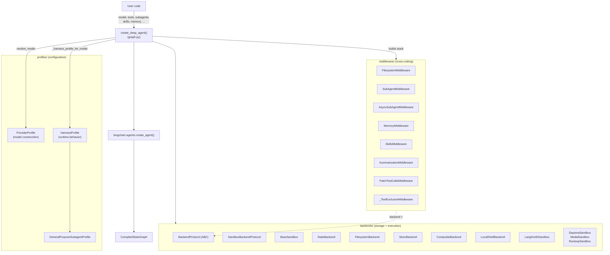
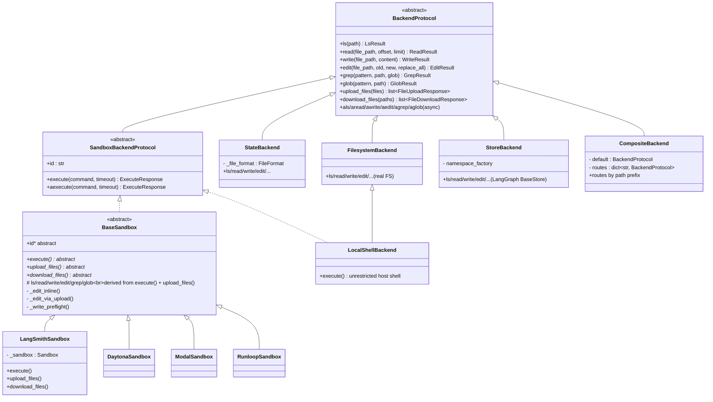
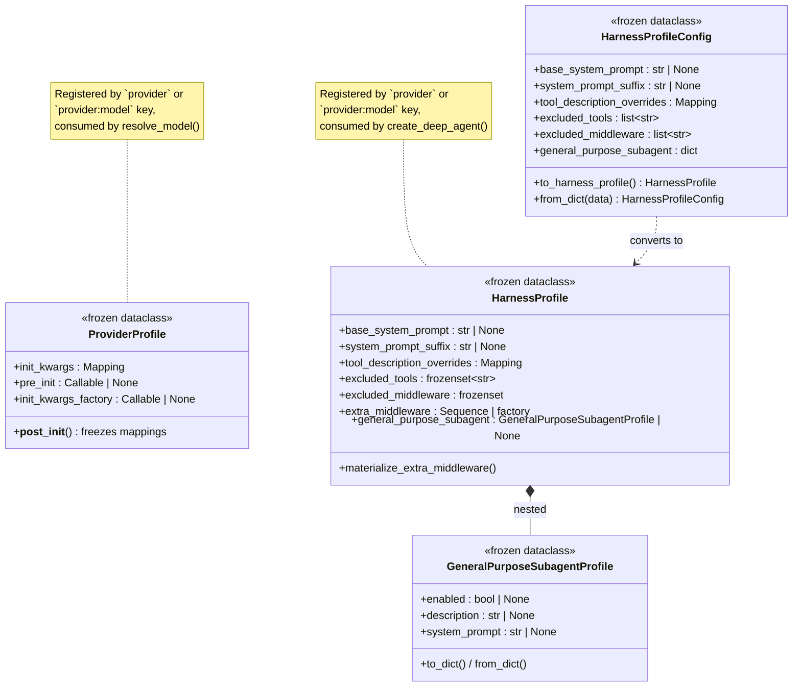
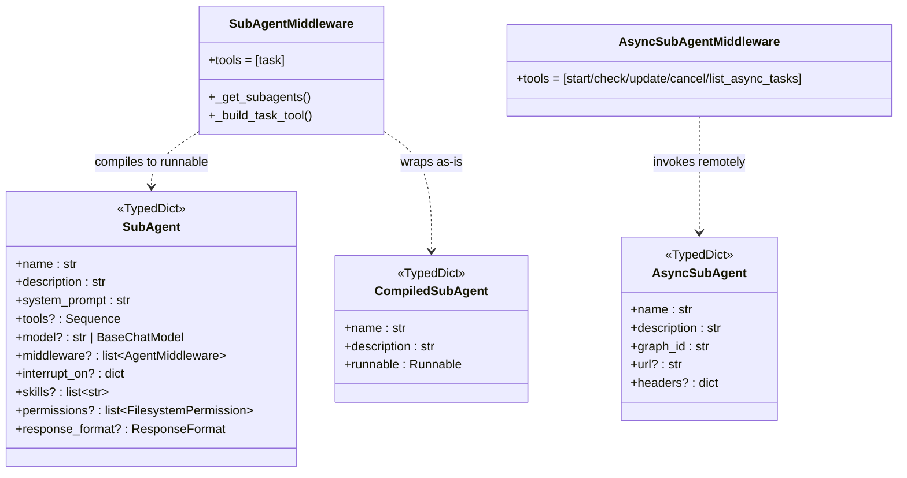
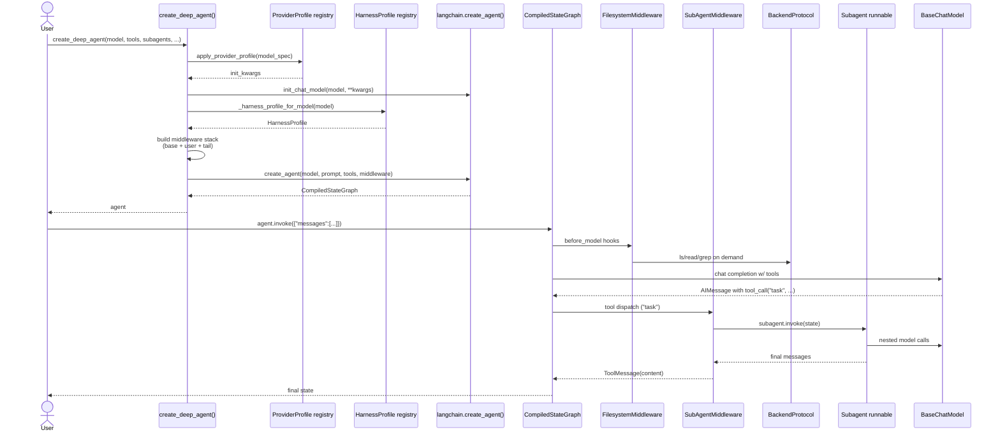

> Source studied: `libs/deepagents/deepagents/**` (the SDK core), with cross-references to sibling packages under `libs/{cli,acp,code,repl,evals,partners/*}`.
> Library version: see `libs/deepagents/deepagents/_version.py`.

This report explains how the **DeepAgents Python SDK** is organized, the OOP idioms it uses, and the role of each layer. It is written for a reader who already understands LangChain / LangGraph at a high level, and wants a *map* of the codebase before diving in.

---

## 1. Repository topology (monorepo)

DeepAgents is a Python **monorepo** of independently versioned packages:

```text
deepagents/                 (repo root)
├── libs/
│   ├── deepagents/         ← SDK core  (focus of this report)
│   ├── cli/                ← interactive CLI on top of the SDK
│   ├── acp/                ← Agent Context Protocol server
│   ├── code/               ← placeholder for future "code" capabilities
│   ├── repl/               ← language-agnostic REPL middleware (langchain_repl)
│   ├── evals/              ← eval suite + Harbor integration
│   └── partners/
│       ├── daytona/        ← DaytonaSandbox    (BaseSandbox subclass)
│       ├── modal/          ← ModalSandbox      (BaseSandbox subclass)
│       ├── runloop/        ← RunloopSandbox    (BaseSandbox subclass)
│       └── quickjs/        ← QuickJS REPL middleware
└── examples/               ← reference agents (research, content writer, etc.)
```

The dependency direction is **inward**:

```text
partners/*        cli/        acp/        evals/        examples/
       \           |           |            |              /
        \          v           v            v             /
         +─────────────►   libs/deepagents   ◄───────────+
                                  │
                           langchain · langgraph · langchain_anthropic
```

Everything outside `libs/deepagents/` *depends on* the SDK; the SDK depends only on LangChain / LangGraph and a small number of provider integrations.

---

## 2. The SDK package layout

```text
libs/deepagents/deepagents/
├── __init__.py                ← public surface
├── graph.py                   ← create_deep_agent (factory function)
├── _models.py                 ← resolve_model() helper
├── _tools.py                  ← tool description rewriting
├── _excluded_middleware.py    ← profile-driven middleware filtering
├── _api/deprecation.py        ← @deprecated decorator
├── backends/                  ← pluggable storage / execution
│   ├── protocol.py            ← BackendProtocol, SandboxBackendProtocol
│   ├── sandbox.py             ← BaseSandbox (template-method ABC)
│   ├── state.py               ← StateBackend
│   ├── filesystem.py          ← FilesystemBackend
│   ├── store.py               ← StoreBackend
│   ├── composite.py           ← CompositeBackend (route by prefix)
│   ├── local_shell.py         ← LocalShellBackend
│   └── langsmith.py           ← LangSmithSandbox
├── middleware/                ← cross-cutting AgentMiddleware classes
│   ├── filesystem.py          ← FilesystemMiddleware
│   ├── subagents.py           ← SubAgentMiddleware (+ task tool)
│   ├── async_subagents.py     ← AsyncSubAgentMiddleware
│   ├── memory.py              ← MemoryMiddleware
│   ├── skills.py              ← SkillsMiddleware
│   ├── summarization.py       ← _DeepAgentsSummarizationMiddleware
│   ├── permissions.py         ← FilesystemPermission helpers
│   ├── patch_tool_calls.py    ← PatchToolCallsMiddleware
│   └── _tool_exclusion.py     ← _ToolExclusionMiddleware
└── profiles/                  ← config / registry of provider+harness profiles
    ├── provider/              ← ProviderProfile (model-construction concerns)
    └── harness/               ← HarnessProfile (runtime behavior)
        └── harness/_*.py      ← built-ins for Anthropic, OpenAI Codex, …
```

The four salient concerns the SDK separates are:

| Concern                       | Lives in        | OOP shape                                         |
| ----------------------------- | --------------- | ------------------------------------------------- |
| Build a chat model            | `_models.py`    | function + `ProviderProfile` registry             |
| Where files / shell live      | `backends/`     | ABC hierarchy (Strategy + Template Method)        |
| What the agent loop *does*    | `middleware/`   | `AgentMiddleware` subclasses (Decorator/Pipeline) |
| Per-model tweaks of the above | `profiles/`     | Frozen dataclass value objects + registry         |
| Stitching it all together     | `graph.py`      | factory function (composition root)               |

---

## 3. The composition root: `create_deep_agent`

`create_deep_agent(...)` (`graph.py:203`) is **the only public constructor**. It is *not* a class; it is a factory that:

1. Resolves `model` → `BaseChatModel` via `resolve_model` (consults `ProviderProfile` registry).
2. Looks up the matching `HarnessProfile` (per-model configuration overlay).
3. Validates and processes `subagents` (each becomes a sub-graph, optionally with its own middleware stack).
4. Builds the **main agent's middleware stack** in a deterministic order.
5. Filters out any `excluded_middleware` from the harness profile.
6. Assembles the final system prompt (user → BASE/CUSTOM → SUFFIX).
7. Delegates to `langchain.agents.create_agent(...)` to compile a `CompiledStateGraph`.

The middleware stack assembled looks like this:

```text
┌── Base stack (always in this order) ──────────────────────────────┐
│ TodoListMiddleware                                                │
│ SkillsMiddleware?            (if `skills=` provided)              │
│ FilesystemMiddleware         (REQUIRED — cannot be excluded)      │
│ SubAgentMiddleware?          (if any sync subagents) (REQUIRED)   │
│ SummarizationMiddleware                                           │
│ PatchToolCallsMiddleware                                          │
│ AsyncSubAgentMiddleware?     (if async subagents)                 │
├── User middleware (caller-supplied) ──────────────────────────────┤
│ <user middleware...>                                              │
├── Tail stack ─────────────────────────────────────────────────────┤
│ HarnessProfile.extra_middleware                                   │
│ _ToolExclusionMiddleware?    (if profile lists excluded_tools)    │
│ AnthropicPromptCachingMiddleware  (no-op for non-Anthropic)       │
│ MemoryMiddleware?            (if `memory=` provided)              │
│ HumanInTheLoopMiddleware?    (if `interrupt_on=` provided)        │
└───────────────────────────────────────────────────────────────────┘
```

Two classes — `FilesystemMiddleware` and `SubAgentMiddleware` — are **protected scaffolding** (`_REQUIRED_MIDDLEWARE` in `graph.py:173`). Any attempt to remove them via `HarnessProfile.excluded_middleware` raises `ValueError`. This is the SDK's structural integrity guarantee.

---

## 4. OOP architecture overview

The SDK uses **three small class hierarchies** that all hang off LangChain base types:

1. **Backends** (storage / shell execution) — rooted at `BackendProtocol` (an ABC).
2. **Middleware** (cross-cutting concerns) — all subclass `langchain.agents.middleware.types.AgentMiddleware`.
3. **Profiles** (per-model configuration) — frozen `@dataclass` value objects living in registries.

Subagents (`SubAgent`, `CompiledSubAgent`, `AsyncSubAgent`) are intentionally **`TypedDict`s**, not classes — they are *data specs* that the middleware turns into runnables.

### 4.1 High-level component diagram



### 4.2 Backend hierarchy (Strategy + Template Method)



**Patterns at work**

- **Strategy pattern.** `BackendProtocol` defines a family of interchangeable file-storage strategies; middleware (`FilesystemMiddleware`) holds a reference to one and is agnostic of which strategy is in use.
- **Template Method.** `BaseSandbox` (`backends/sandbox.py`) implements `ls/read/write/edit/grep/glob` by *delegating to the abstract primitives* `execute()`, `upload_files()`, and `download_files()`. Concrete sandboxes (LangSmith, Daytona, Modal, Runloop) only implement those three plus an `id` property — everything else is inherited.
- **Composite pattern.** `CompositeBackend` routes operations to different child backends by path prefix (e.g. `/memories/` → `StoreBackend`, default → `StateBackend`).
- **Result objects (Outcome / Either).** Operations return dataclasses (`ReadResult`, `WriteResult`, `EditResult`, `LsResult`, `GrepResult`, `GlobResult`) with optional `error: str | None`. This avoids exceptions across the LLM/tool boundary, which is critical because tool failures must be returned as text to the model.
- **Backwards-compatibility deprecations.** `BackendProtocol.ls`, `glob`, `grep` keep the old `ls_info`, `glob_info`, `grep_raw` methods as `@deprecated` shims; the protocol uses runtime introspection (`type(self).ls_info is not BackendProtocol.ls_info`) to detect subclasses still on the legacy API.

### 4.3 Middleware hierarchy (Decorator / Pipeline)

```mermaid
classDiagram
    class AgentMiddleware~StateT, ContextT, ResponseT~ {
        <<abstract, from langchain>>
        +tools : list~BaseTool~
        +system_prompt : str | None
        +modify_model_request()
        +before_model() / after_model()
        +modify_tool_call_request()
    }

    class FilesystemMiddleware {
        +backend : BackendProtocol
        +tools = [ls, read_file, write_file,<br/>edit_file, glob, grep, execute?]
        - _permissions : list~FilesystemPermission~
        - tool_token_limit_before_evict : int
    }

    class SubAgentMiddleware {
        - _backend : BackendProtocol
        - _subagents : list~SubAgent | CompiledSubAgent~
        +tools = [task]
    }

    class AsyncSubAgentMiddleware {
        - _async_subagents : list~AsyncSubAgent~
        - _client_cache : _ClientCache
        +tools = [start/check/update/cancel/list async tasks]
    }

    class MemoryMiddleware {
        - _sources : list~str~
        - _backend : BackendProtocol
        - _add_cache_control : bool
    }

    class SkillsMiddleware {
        - _sources : list~str~
        - _backend : BackendProtocol
    }

    class _DeepAgentsSummarizationMiddleware
    class SummarizationToolMiddleware
    class PatchToolCallsMiddleware
    class _ToolExclusionMiddleware
    class HumanInTheLoopMiddleware {
        <<from langchain>>
    }
    class AnthropicPromptCachingMiddleware {
        <<from langchain_anthropic>>
    }

    AgentMiddleware <|-- FilesystemMiddleware
    AgentMiddleware <|-- SubAgentMiddleware
    AgentMiddleware <|-- AsyncSubAgentMiddleware
    AgentMiddleware <|-- MemoryMiddleware
    AgentMiddleware <|-- SkillsMiddleware
    AgentMiddleware <|-- _DeepAgentsSummarizationMiddleware
    AgentMiddleware <|-- SummarizationToolMiddleware
    AgentMiddleware <|-- PatchToolCallsMiddleware
    AgentMiddleware <|-- _ToolExclusionMiddleware
    FilesystemMiddleware --> BackendProtocol : holds
    SubAgentMiddleware --> BackendProtocol : holds
    MemoryMiddleware --> BackendProtocol : holds
    SkillsMiddleware --> BackendProtocol : holds
```



`AgentMiddleware` is generic in three type parameters (`StateT`, `ContextT`, `ResponseT`), so each middleware can extend the agent's state schema (e.g. `FilesystemState`, `MemoryState`, `SkillsState`, `AsyncSubAgentState`). At graph compile time, LangChain merges these schemas into the agent's effective `AgentState`. This is structural, *additive* state composition — middleware never overwrite each other's keys.

**Patterns at work**

- **Decorator / Pipeline.** Each middleware wraps the agent loop with hooks (`before_model`, `after_model`, `modify_tool_call_request`). Order matters and is fixed by `create_deep_agent`. `AgentMiddleware` plays the role of a uniform decorator interface.
- **Tool injection.** Middleware contributes tools by populating `self.tools = [...]` in `__init__`. The `task` tool, for example, is *manufactured by* `SubAgentMiddleware._build_task_tool` from the registered subagent specs.
- **State extension via mixin-like generics.** Each middleware that needs new state fields declares a `state_schema = MyState` (a TypedDict subclass of `AgentState`).

### 4.4 Profile hierarchy (frozen dataclass value objects)



**Patterns at work**

- **Value Object.** All profile classes are `@dataclass(frozen=True)` with `MappingProxyType` defenses on mutable fields. Equality, hashing, and "registry as a dict of profiles" all just work.
- **Registry pattern.** `register_provider_profile()` and `register_harness_profile()` keep two module-level registries keyed by `provider:model`. Built-ins are registered lazily on first access (Anthropic Sonnet 4.6, Opus 4.7, Haiku 4.5, OpenAI Codex, OpenAI Responses API defaults, OpenRouter app-attribution headers).
- **Profile merging.** Provider profile lookup walks `provider:model` first, then falls back to `provider`; both layers can register, and the more specific layer **merges on top** rather than replacing. The merge function preserves additive semantics for `init_kwargs_factory` (both factories run, override wins on conflict) and for `excluded_*` (set union).
- **Two-format serialization.** `HarnessProfile` is the runtime form; `HarnessProfileConfig` is the YAML/JSON-friendly subset (no class references, no callables). `register_harness_profile` accepts either and converts.

### 4.5 Subagents — three flavors of `TypedDict`



`SubAgentMiddleware._get_subagents()` (`middleware/subagents.py:550`) is the **adapter step** that turns each `SubAgent` dict into a compiled LangChain agent (via `create_agent`) and each `CompiledSubAgent` into a passthrough runnable. The synthesized `task` tool dispatches by name to the correct runnable using a `dict[str, Runnable]` lookup. Async subagents follow the same pattern but invoke a *remote* LangSmith deployment instead of an in-process runnable.

---

## 5. Sequence: a single agent step

This is what happens when the user calls `create_deep_agent(...)` then `agent.invoke({"messages": [...]})`.



Key observations:

- The main agent and its subagents share the **same `BackendProtocol` instance** (passed through `SubAgentMiddleware._backend`), so files written by a subagent are visible to the parent.
- `FilesystemMiddleware._permissions` is enforced **at the tool layer**, not the backend layer (see `graph.py:391` docstring). This is documented as a current implementation detail that may move into the backend.
- The `task` tool returns a `Command` object, which LangGraph interprets as both a state update *and* a `ToolMessage` for the parent's transcript.

---

## 6. Sibling packages and how they extend the core

The SDK is intentionally extension-friendly. Sibling packages reuse the public OOP surface:

| Package                   | Extends                               | What it adds                                        |
| ------------------------- | ------------------------------------- | --------------------------------------------------- |
| `libs/cli`                | `AgentMiddleware`                     | `AskUserMiddleware`, `ConfigurableModelMiddleware`  |
| `libs/repl/langchain_repl`| `AgentMiddleware`                     | `ReplMiddleware` + a stack-based `Interpreter` VM   |
| `libs/acp/deepagents_acp` | `acp.ACPAgent`                        | `AgentServerACP` — Agent Context Protocol server    |
| `libs/partners/daytona`   | `BaseSandbox`                         | `DaytonaSandbox` — Daytona-backed sandbox           |
| `libs/partners/modal`     | `BaseSandbox`                         | `ModalSandbox` — Modal-backed sandbox               |
| `libs/partners/runloop`   | `BaseSandbox`                         | `RunloopSandbox` — Runloop-backed sandbox           |
| `libs/partners/quickjs`   | `AgentMiddleware`                     | `REPLMiddleware` — sandboxed JS evaluation          |

The takeaway: the SDK is "open for extension" along *exactly two* axes — new backends (subclass `BaseSandbox` or `BackendProtocol`) and new middleware (subclass `AgentMiddleware`). Almost every advanced feature in the wider repo is one of those two.

---

## 7. Cross-cutting OOP idioms (summary)

```text
┌─────────────────────────────────────────────────────────────────────────┐
│ Idiom                       │ Where                                     │
├─────────────────────────────┼───────────────────────────────────────────┤
│ Strategy                    │ BackendProtocol vs. concrete backends     │
│ Template Method             │ BaseSandbox.{ls,read,...} via execute()   │
│ Composite                   │ CompositeBackend (route by prefix)        │
│ Decorator / Pipeline        │ AgentMiddleware stack in create_deep_agent│
│ Adapter                     │ SubAgentMiddleware._get_subagents          │
│ Registry                    │ profiles/_keys.py + register_*_profile()  │
│ Value Object (frozen DC)    │ HarnessProfile, ProviderProfile, ...      │
│ Result/Outcome              │ ReadResult, WriteResult, EditResult, ...  │
│ TypedDict as DTO            │ SubAgent, CompiledSubAgent, AsyncSubAgent │
│ Factory function            │ create_deep_agent (composition root)      │
│ Lazy registry init          │ Built-in profiles loaded on first access  │
│ Deprecation shim            │ _api/deprecation.py + protocol fallbacks  │
└─────────────────────────────────────────────────────────────────────────┘
```

Two design choices stand out as deliberate and worth highlighting:

1. **The "agent" is not a class.** It is an immutable `CompiledStateGraph` produced by a factory. Behaviors are composed by *stacking* `AgentMiddleware` instances, not by subclassing an `Agent` superclass. This avoids the diamond-inheritance / "god class" trap and matches LangGraph's own data-oriented model.
2. **Configuration is data, code is structure.** The `profiles/` package treats per-model differences (Anthropic vs OpenAI Responses vs OpenRouter vs Codex) as *frozen dataclass values* that get merged and passed in. This keeps the OOP graph small and avoids one-class-per-model proliferation.

---

## 8. Where to read next (suggested order)

1. **`libs/deepagents/deepagents/graph.py`** — start here; the docstring on `create_deep_agent` is the canonical assembly description.
2. **`backends/protocol.py`** then **`backends/sandbox.py`** — understand the Strategy + Template Method core.
3. **`middleware/filesystem.py`** then **`middleware/subagents.py`** — the two protected-scaffolding middlewares; everything else follows the same pattern.
4. **`profiles/harness/harness_profiles.py`** — read `HarnessProfile`, `HarnessProfileConfig`, and `_harness_profile_for_model`. The merge logic is the model that other "registry of frozen value objects" code follows.
5. **`libs/partners/modal/langchain_modal/sandbox.py`** — a 100-line concrete `BaseSandbox` is the cleanest worked example of the extension model.

---

*Diagrams above are written in Mermaid. Render with any Mermaid-aware viewer (GitHub, VS Code "Markdown Preview Mermaid Support", `mermaid-cli`, etc.).*
