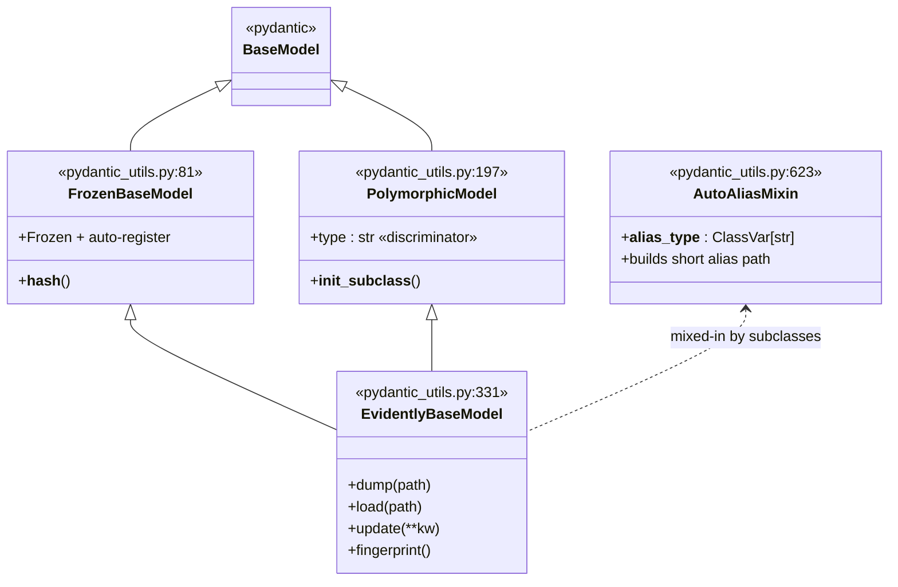
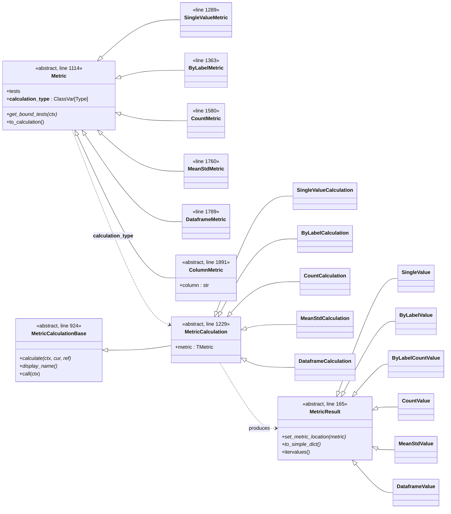
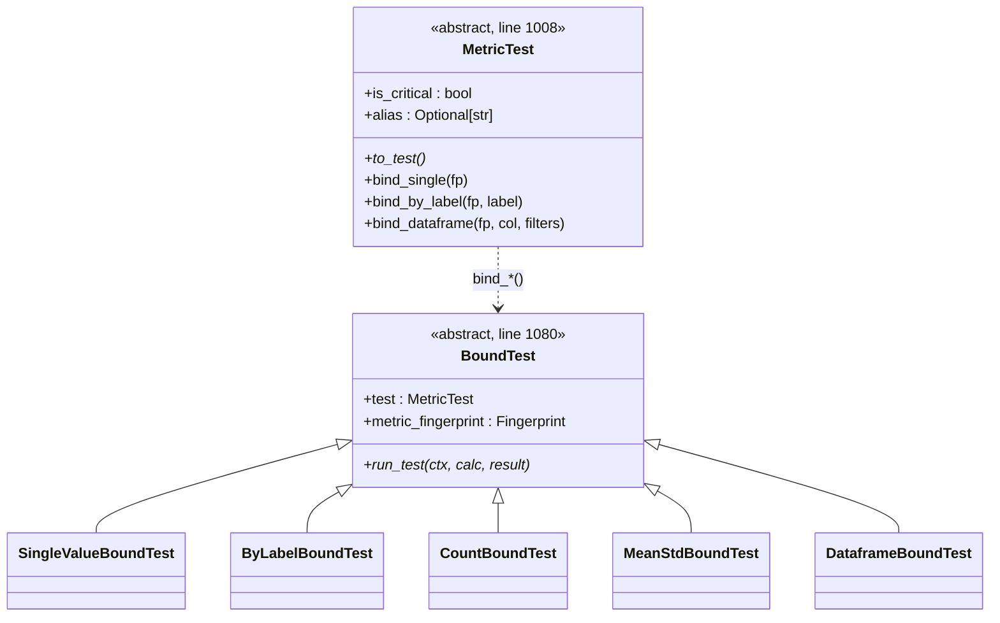
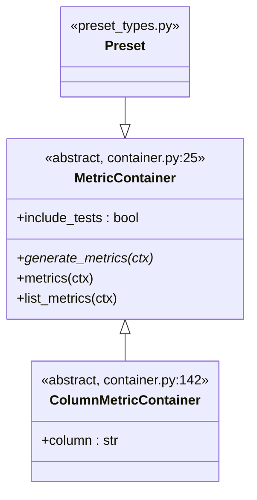
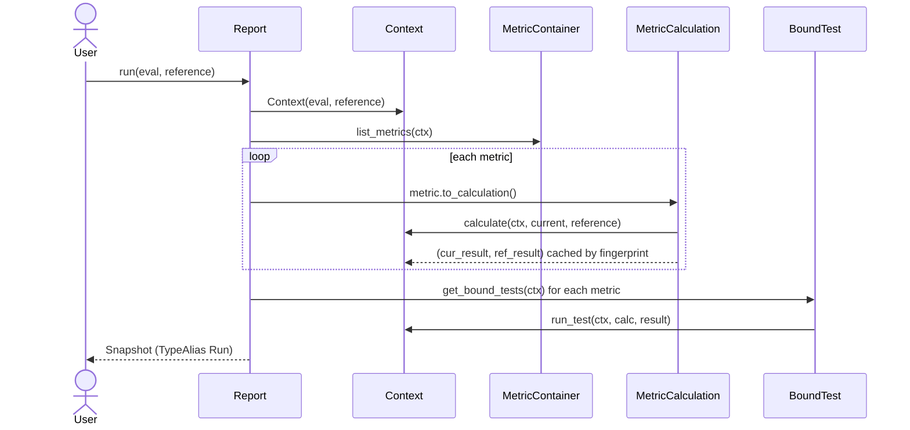
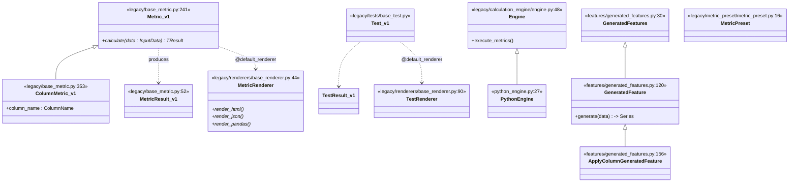

**Repo:** `evidently` (open-source ML/LLM evaluation & monitoring framework)
**Scope of this report:** Python package under `src/evidently/`. The React frontend (`/ui/`) is mentioned only where it interfaces with the Python service.
**Method:** Static reading of source. All citations use `path:line` against the working tree at HEAD = `a4aa4c2b`.

---

## 1. High-Level Project Layout

```
src/evidently/
├── __init__.py              # Public API: Report, Run, Dataset, DataDefinition, ...
├── _registry.py             # Imports all sub-registries (plugin discovery)
├── _pydantic_compat.py      # Pydantic v1/v2 shim (uses pydantic.v1 if v2 installed)
├── pydantic_utils.py        # Foundation: PolymorphicModel, FrozenBaseModel, EvidentlyBaseModel
│
├── core/                    # NEW v2 API — what `from evidently import Report` exposes
│   ├── datasets.py          # Dataset, DataDefinition, classification/regression task descriptors
│   ├── report.py            # Report, Snapshot (aliased as Run), Context
│   ├── metric_types.py      # Metric / MetricCalculation / MetricResult / MetricTest hierarchies
│   ├── tests.py             # Test framework on top of metric_types
│   ├── container.py         # MetricContainer (lazy metric generators)
│   ├── preset_types.py      # Preset abstract class
│   ├── serialization.py     # JSON / YAML round-trip helpers
│   ├── compare.py           # `compare(report_a, report_b)`
│   └── registries/          # Type-alias tables for polymorphic Pydantic deserialization
│
├── metrics/                 # v2 metric implementations (column_statistics, classification, ...)
├── tests/                   # v2 test builders (eq, gt, lt, between, ...)
├── presets/                 # v2 preset bundles (DataDriftPreset, TextEvals, ...)
├── descriptors/             # v2 row-wise feature generators (Sentiment, TextLength, LLM judges)
├── generators/              # v2 column generators (parameterised metric expansion)
│
├── future/                  # Stable re-export alias for `core/` — same API, different import path
│
├── llm/                     # LLM provider abstraction (litellm-first), prompts, RAG, optimisation
├── guardrails/              # Decorator-based input/output validators (Negativity, PII, Toxicity, ...)
│
├── ui/                      # Litestar monitoring service + storage abstractions + Workspace
├── sdk/                     # Artifacts/Prompts/Configs/Datasets managers (local + remote-friendly)
│
├── cli/                     # Typer CLI: `evidently ui|report|demo_project|migrate|legacy_ui`
│
└── legacy/                  # v1 API kept alive for back-compat (strangler-fig migration)
    ├── core.py              # ColumnType, BaseResult
    ├── base_metric.py       # v1 Metric / MetricResult / ColumnMetric
    ├── metrics/             # v1 metrics (still backing many UI snapshots)
    ├── tests/, test_suite/, test_preset/
    ├── report/, suite/
    ├── renderers/           # Compute/presentation split (Strategy)
    ├── calculation_engine/  # Engine/PythonEngine (Strategy for compute backend)
    ├── features/            # GeneratedFeature — derived columns (≠ Metric)
    ├── calculations/        # Stat tests, drift, data-quality maths
    ├── options/             # Cascading Options pattern
    └── ui/                  # v1 monitoring UI (legacy_ui CLI command)
```

The two coexisting namespaces — `evidently/core/` (new) and `evidently/legacy/` (old) — are the most important fact about this repository. The new API is a thin, more ergonomic layer; the old one still owns most of the mathematical heavy lifting.

---

## 2. The Pydantic Polymorphism Foundation

Every serialisable type in Evidently — Metric, MetricResult, Test, Preset, MetricContainer, Feature, GuardrailBase — descends from a small foundation defined in `src/evidently/pydantic_utils.py`.

### 2.1 Class chain



### 2.2 What each piece does

- **`FrozenBaseModel`** (`pydantic_utils.py:81`) — immutable, hashable, supports auto-registration of subclasses via `__init_subclass__`. Hashability matters because metric *fingerprints* (MD5 of class-path + field values) are used as identity keys in the `Context` cache.
- **`PolymorphicModel`** (`pydantic_utils.py:197`) — adds a `type` discriminator field. Two module-level dicts (`pydantic_utils.py:132–133`):
  ```python
  TYPE_ALIASES:        Dict[(BaseClass, alias_str), classpath]
  LOADED_TYPE_ALIASES: Dict[(BaseClass, alias_str), Type]
  ```
  These map short aliases (e.g. `evidently:metric_v2:Accuracy`) to fully-qualified Python classpaths. On load, `PolymorphicModel.validate()` reads `type`, looks up the right subclass, and deserialises into it. This is the standard *registered subclass* trick to round-trip Pydantic unions through JSON / YAML.
- **`AutoAliasMixin`** (`pydantic_utils.py:623`) — gives each Evidently subsystem its own short prefix (`metric_v2`, `metric_container`, `descriptor`, `test`, …) so aliases are stable and human-readable.
- **`EvidentlyBaseModel`** (`pydantic_utils.py:331`) — top of the inheritance chain for "real" domain types. Adds:
  - `dump()` / `load()` for YAML/JSON,
  - `update(**fields)` for safe field replacement on a frozen model,
  - `fingerprint()` — deterministic MD5 hash used as the metric identity in the `Context` registry.
- **`_pydantic_compat.py`** detects whether installed Pydantic is v1 or v2 and selects either the native module or `pydantic.v1`. All Evidently base types still target Pydantic v1 semantics (`BaseModel.Config`, `validator`), which keeps the codebase working on both.

### 2.3 Why this matters

This single pattern — *frozen, hashable, polymorphic, fingerprintable Pydantic models* — is the reason Evidently can:
1. Send a `Report` over JSON (UI ↔ service ↔ storage).
2. Compare two snapshots structurally (`core/compare.py`).
3. Cache metric results by identity in `Context`.
4. Allow user-defined custom metrics to round-trip through the registry without service code changes.

---

## 3. The Two Co-Existing APIs

### 3.1 v2 (core/) — Config / Calculation split

The new API splits each metric into **two cooperating classes**:

| Concern | Type | What it carries |
|---|---|---|
| *What to compute* | `Metric` subclass | column name, thresholds, tests, output shape — pure config |
| *How to compute it* | `MetricCalculation` subclass | the actual `calculate(context, current, reference)` body |

A class-level binding wires the two together via `__init_subclass__`, set on `MetricCalculation` at `core/metric_types.py:1229`. So you write:

```python
class MinValue(StatisticsMetric): ...                            # config
class MinValueCalculation(StatisticsCalculation[MinValue]):       # calculation
    def calculate_value(column): return column.data.min()
```

…and Evidently auto-records `MinValue.__calculation_type__ = MinValueCalculation`. `Metric.to_calculation()` later instantiates the calculation class with the metric instance attached.

**Why this split?** It cleanly separates the *serialisable description* of a metric from its *executable behaviour*. A `Report` can be saved, sent over the wire, or stored in the UI as a tree of `Metric` configs; the corresponding `MetricCalculation` is only resolved at run time. This is the same pattern Spark uses for logical vs. physical plans.

### 3.2 v1 (legacy/) — single-class Metric

The legacy API keeps both concerns in one class: `Metric[TResult]` (`legacy/base_metric.py:241`) directly defines `calculate(data: InputData) -> TResult`. There is no separate calculation object; subclasses are concrete implementations.

### 3.3 Where each is used

| API | Public entry points | Used by |
|---|---|---|
| v2 (`core/`) | `from evidently import Report, Run, Dataset` | New code, examples, presets |
| v1 (`legacy/`) | `from evidently.legacy.report import Report` | Legacy reports, the legacy UI service, snapshots already on disk |
| Bridge | `ui/backport.py` | Converts v1 results to v2 shapes for unified rendering |

---

## 4. v2 Metric Class Hierarchy (`core/metric_types.py`)

### 4.1 Three parallel hierarchies



The shape of a metric's *output* (single number, dict-by-label, mean/std pair, full DataFrame, …) determines which `*Metric` and `*Result` subclasses it inherits — the result type is the central design dimension, not the algorithm.

### 4.2 A concrete example (column statistics)

`src/evidently/metrics/column_statistics.py` is the canonical pattern:

```python
class StatisticsMetric(ColumnMetric, SingleValueMetric):           # dual-inherits
    def _default_tests_with_reference(ctx): ...

class StatisticsCalculation(SingleValueCalculation[TStatisticsMetric]):
    @abstractmethod
    def calculate_value(self, column: DatasetColumn) -> float: ...
    def calculate(self, context, current, reference):
        cur = self.result(self.calculate_value(current.column(self.column)))
        ref = self.result(self.calculate_value(reference.column(self.column))) if reference else None
        return cur, ref

class MinValue(StatisticsMetric): ...
class MinValueCalculation(StatisticsCalculation[MinValue]):
    def calculate_value(self, column): return column.data.min()
```

Adding a new column statistic = subclass `StatisticsMetric` + subclass `StatisticsCalculation` and override `calculate_value`. Everything else (test binding, fingerprint, registry, rendering) is inherited.

### 4.3 Test binding (`MetricTest` → `BoundTest`)

Tests in v2 are not run inline. They are **bound late** to results:



The user writes `eq(0.0)` or `gt(0.95)` against a metric; under the hood `Metric.get_bound_tests(context)` produces `BoundTest` objects pinned to the metric's fingerprint. After the metric calculates, `BoundTest.run_test(...)` extracts the relevant value (a scalar, a label-keyed dict entry, a dataframe cell) and runs the comparison.

The user-friendly builders live in `src/evidently/tests/numerical_tests.py` and `categorical_tests.py` (e.g. `eq`, `gt`, `lt`, `between`, `gte`, `lte`).

### 4.4 Containers and Presets (lazy metric generation)



A `MetricContainer` returns a *sequence* of metrics, evaluated against a `Context` so it can adapt to the actual columns/labels in the dataset. Presets (`DataDriftPreset`, `TextEvals`, `ClassificationPreset`, …) are containers: "generate the right metrics for this dataset". Containers nest — `list_metrics()` walks the tree and yields leaf `Metric`s, which keeps user-facing API tiny while supporting arbitrary expansion.

### 4.5 Execution: `Report.run` → `Snapshot` (alias `Run`)



Notes:
- `Context` lives at `core/report.py:123` and owns `_metrics`, `_reference_metrics`, `_input_data`, plus per-column caches.
- `Snapshot` is at `core/report.py:487`; **`Run` is a type alias** for it (`core/report.py:818`: `Run: TypeAlias = Snapshot`). `from evidently import Run` therefore returns the `Snapshot` class.
- The `Report` class is at `core/report.py:821`.

---

## 5. v1 (Legacy) Hierarchy

The legacy API is still load-bearing — most stat tests, drift methods, and renderers live here.



### 5.1 Three legacy patterns worth naming

1. **Renderer pattern (Strategy on output format).** `MetricRenderer[TMetric]` and `TestRenderer[TTest]` separate computation from presentation. Concrete metrics register a renderer via the `@default_renderer` decorator. The same metric renders to HTML widgets, JSON, or pandas depending on which renderer method the caller invokes.

2. **Engine pattern (Strategy on compute backend).** `Engine[TMetricImplementation, TInputData, TEngineDataType]` (`engine.py:48`) is generic over three type parameters — the engine-specific metric implementation, the input data type, and the in-engine data type. Only `PythonEngine` (pandas) ships in OSS, but the seam is built so a Spark engine can plug in alongside; see also `tests/spark/`. This is exactly where you would extend Evidently to support a different compute substrate.

3. **Feature ≠ Metric.** `GeneratedFeature` (`features/generated_features.py:120`) and its row-wise variant `ApplyColumnGeneratedFeature` (line 156) produce *new columns*, not metrics. Sentiment, OOV-words, text length, semantic similarity are all features: they consume a column, emit a column. Metrics then operate on those columns. This separation lets you cache, rerun, and compose features independently of metrics.

### 5.2 Options pattern

`Options` (`legacy/options/base.py`) is a composable, hierarchical config object: `color`, `render`, plus a typed `custom: Dict[Type[Option], Option]` bag, with `.override(other)` returning a merged copy. Options cascade from global → display → metric-level without subclasses needing to know what they are.

---

## 6. Algorithm Implementation Strategy — From-Scratch vs. Library

This is the question that most informs how to *trust* and *contribute to* Evidently.

**Bottom line:** Evidently is overwhelmingly an **orchestration layer over scipy / scikit-learn / nltk / sentence-transformers / litellm**, with hand-rolled implementations only where (a) the test isn't in scipy, (b) a custom permutation/bootstrap is needed, or (c) the maths is easier than depending on another package.

### 6.1 Statistical drift tests (`legacy/calculations/stattests/`)

**Library-backed (thin scipy wrappers):**

| Test | File | Backend |
|---|---|---|
| Kolmogorov–Smirnov | `ks_stattest.py:29` | `scipy.stats.ks_2samp` |
| Chi-square | `chisquare_stattest.py:29` | `scipy.stats.chisquare` |
| Mann–Whitney U | `mann_whitney_urank_stattest.py` | `scipy.stats.mannwhitneyu` |
| Fisher's exact | `fisher_exact_stattest.py` | `scipy.stats.fisher_exact` |
| Anderson–Darling k-sample | `anderson_darling_stattest.py` | `scipy.stats.anderson_ksamp` |
| Energy distance | `energy_distance.py` | `scipy.stats.energy_distance` |
| Welch's *t* | `t_test.py` | `scipy.stats.ttest_ind` |
| Jensen–Shannon | `jensenshannon.py:30` | `scipy.spatial.distance.jensenshannon` |
| Wasserstein | `wasserstein_distance_norm.py` | `scipy.stats.wasserstein_distance` |
| Epps–Singleton | `epps_singleton_stattest.py` | `scipy.stats.epps_singleton_2samp` |
| Cramér–von Mises (asymptotic) | `cramer_von_mises_stattest.py` | uses `scipy.special.kv` |

**Hand-rolled (numpy/pandas only — no scipy import):**

| Test | File | Why hand-rolled |
|---|---|---|
| Population Stability Index (PSI) | `psi.py` | Standard formula, no scipy equivalent |
| Hellinger distance | `hellinger_distance.py:39` | Simple binned-histogram form |
| Maximum Mean Discrepancy (MMD) | `mmd_stattest.py:12` | Custom RBF kernel + permutation p-value (100 shuffles) |
| Cramér–von Mises (exact) | `cramer_von_mises_stattest.py` | Recurrence-relation algorithm from the paper |
| Z-test on proportions | `z_stattest.py` | Wraps `scipy.stats.norm.cdf` but computes the *z* statistic by hand |
| Total Variation Distance | `tvd_stattest.py` | One-line numpy formula |
| KL divergence | `kl_div.py` | One-line numpy formula |
| G-test | `g_stattest.py` | Custom log-likelihood ratio |

You can verify the divide quickly: hand-rolled tests import only `numpy`, `pandas`, and the stat-test registry — **no `scipy` imports at all** (e.g. `psi.py:26-33`, `mmd_stattest.py:1-9`, `hellinger_distance.py:26-36`).

### 6.2 Drift orchestration

`legacy/calculations/data_drift.py` is pure routing: it picks a stat test by column type and signature, calls it, and packages the result. No maths of its own. Selecting which test runs by default (chi-square for categorical, K-S for numerical, …) lives here, not in the tests.

### 6.3 Data-quality calculations

`legacy/calculations/data_quality.py` is mostly pandas: `value_counts`, `nunique`, `quantile`, plus a single `scipy.stats.chi2_contingency` call for cross-feature association.

### 6.4 ML metrics

`legacy/metrics/classification_performance/*` and `regression_performance/*` are sklearn wrappers. Examples:
- `roc_auc_score`, `log_loss`, `precision_recall_curve`, `confusion_matrix` — all `from sklearn import metrics`.
- `legacy/metrics/regression_performance/*` use `sklearn.metrics.mean_squared_error`, `mean_absolute_percentage_error`, etc.

### 6.5 Embedding-drift methods

`legacy/metrics/data_drift/embedding_drift_methods/` (called from `EmbeddingsDriftMetric`) is a hybrid:
- **Library:** `sklearn.decomposition.PCA`, `sklearn.linear_model.SGDClassifier`, `sklearn.metrics.roc_auc_score`, `sklearn.metrics.pairwise_distances`, `pairwise_kernels`.
- **Custom:** the bootstrap loops and the "ratio" / "model" detection pipelines that combine these primitives.

### 6.6 Text descriptors

| Descriptor | Backend |
|---|---|
| Sentiment | `nltk.sentiment.vader.SentimentIntensityAnalyzer` |
| OOV words, words match | `nltk.corpus.words`, `WordNetLemmatizer` |
| Text length, word count, char count | hand-rolled (`.apply(len)`, regex) |
| Semantic similarity | `sentence_transformers.SentenceTransformer("all-MiniLM-L6-v2")` + custom normalised cosine |
| Regex / contains / starts-with | hand-rolled |
| LLM judges | `evidently.llm.utils.wrapper.LLMWrapper` — see below |

### 6.7 LLM integration (`llm/utils/wrapper.py`)

The LLM layer is the most architecturally interesting piece outside `core/`:

```python
# llm/utils/wrapper.py:438
if find_spec("litellm") is not None:
    litellm_wrapper = get_litellm_wrapper(provider, model, options)
    if litellm_wrapper is not None:
        return litellm_wrapper
raise ValueError(f"... Try installing litellm")
```

- **litellm-first.** Any provider supported by litellm is routed through `litellm.acompletion` (`wrapper.py:595`).
- **OpenAI direct fallback.** A non-litellm path (`wrapper.py:518–541`) imports the `openai` SDK directly for environments that don't want litellm.
- **Provider registry.** `litellm_providers` (line 712) and `@llm_provider("litellm", None)` (line 574) expand into per-provider wrappers automatically.
- **No direct vendor SDK lock-in elsewhere.** Descriptors-as-LLM-judges (`descriptors/llm_judges.py`) and prompt optimisation (`llm/optimization/`) all go through `LLMWrapper.run_batch_sync`, never a vendor SDK directly.

So Evidently's LLM strategy is: **use litellm as a unified abstraction; treat any vendor SDK as a private detail of a wrapper.**

---

## 7. Surrounding Layers

### 7.1 Layered service view

```
┌──────────────────────────────────────────────────────────────┐
│  CLI  (typer)                                                │
│  evidently ui | report | demo_project | migrate | legacy_ui  │
└──────────────────────┬───────────────────────────────────────┘
                       │
┌──────────────────────▼───────────────────────────────────────┐
│  Workspace  (ui/workspace.py)                                │
│   exposes: artifacts / prompts / configs / datasets          │
└──────────────────────┬───────────────────────────────────────┘
                       │
┌──────────────────────▼───────────────────────────────────────┐
│  SDK managers  (sdk/local.py, sdk/adapters.py)               │
│   LocalArtifactAPI / LocalPromptAPI / LocalConfigAPI         │
│   + adapters that bridge interfaces                          │
└──────────────────────┬───────────────────────────────────────┘
                       │
┌──────────────────────▼───────────────────────────────────────┐
│  UI service  (litestar app, ui/service/)                     │
│   ComponentContext + AppBuilder DI                           │
│   Storage abstractions: DataStorage / BlobStorage /          │
│                         ProjectMetadataStorage               │
│   LocalStorage backed by JSON files via FSLocation           │
│   Static React assets served from ui/service/assets/         │
└──────────────────────┬───────────────────────────────────────┘
                       │
┌──────────────────────▼───────────────────────────────────────┐
│  Compute layer                                               │
│   evidently.core.*       (v2 metrics/tests/presets)          │
│   evidently.legacy.*     (v1 metrics/tests, stat tests,      │
│                            features, renderers, engines)     │
│   evidently.llm.*        (litellm wrapper, prompts, RAG)     │
│   evidently.guardrails.* (decorator-based validators)        │
│   ui/backport.py         (v1 → v2 result adapters)           │
└──────────────────────────────────────────────────────────────┘
```

### 7.2 UI service (`ui/service/`)

- Built on **Litestar** (`ui/service/app.py:13–23`), API mounted under `/api`.
- **Component-based DI**: `AppBuilder` + `ComponentContext` (`ui/service/components/base.py`). Components declare `get_dependencies()` and `get_route_handlers()`; the AppBuilder composes them.
- **Security**: `TokenSecurityComponent` (bearer token from `EVIDENTLY_SECRET_ENV`).
- **Storage abstractions**: `DataStorage`, `BlobStorage`, `ProjectMetadataStorage` (in `ui/service/base.py`). Only the local filesystem implementation ships in OSS (`ui/storage/local/`); cloud backends live in the closed Evidently Cloud product. The static React frontend is built with pnpm under the top-level `/ui/` and served from `ui/service/assets/`.

### 7.3 SDK (`sdk/`)

A small, programmatic façade for managing artifacts (saved reports), prompts, configs, datasets, and panels — independent of whether storage is local or remote. `sdk/adapters.py` uses bridge-style adapters so a `Workspace` user always sees the same API regardless of backend.

### 7.4 LLM (`llm/`)

| Submodule | Purpose |
|---|---|
| `llm/utils/wrapper.py` | Provider abstraction (litellm, OpenAI direct) |
| `llm/prompts/` | Prompt templates, few-shot examples, RAG hooks |
| `llm/templates.py` | Jinja-style variable substitution |
| `llm/datagen/` | Synthetic dataset generation via LLM |
| `llm/optimization/` | Prompt optimisation loops |
| `llm/rag/` | Document splitting, embeddings, vector index helpers |
| `llm/models.py` | Vendor-neutral `LLMMessage` / `LLMResponse` types |
| `llm/options.py` | Temperature, max-tokens, retry config |

### 7.5 Guardrails (`guardrails/`)

A small decorator framework: `@guard(...)` (`guardrails/decorators.py`) wraps a function, validates arguments through one or more `GuardrailBase` subclasses, and raises `GuardException` on failure. Concrete guards in `guardrails/guards/` include `Negativity`, `Toxicity`, `PII`, `WordPresence`, `PythonFunction`. Optional integration with `tracely` for tracing. Operates on string inputs/outputs; orthogonal to metrics and storage.

### 7.6 `future/` — alias, not experiment

Despite the name, `future/` is a **stable re-export of `core/`**, e.g. `future/report.py:1` is literally:
```python
from evidently.core.report import *  # noqa: F403
```
Subdirectories `future/metrics/`, `future/presets/`, etc. are empty `__init__.py` stubs. The clear intent is to give users an import path that won't break if `core/` is internally reorganised.

### 7.7 CLI (`cli/`, typer)

| Command | Entry | Purpose |
|---|---|---|
| `evidently ui` | `cli/ui.py` | Start Litestar UI service (optionally seed demo data) |
| `evidently report` | `cli/report.py` | Render a report from YAML config |
| `evidently demo_project` | `cli/demo_project.py` | Generate demo workspace |
| `evidently migrate` | `cli/migrate.py` | Run alembic migrations (SQL backend) |
| `evidently legacy_ui` | `cli/legacy_ui.py` | Start the v1 monitoring UI |

---

## 8. Summary of OOP Patterns Used

| Pattern | Where it shows up | Notes |
|---|---|---|
| **Polymorphic discriminator (registry-backed)** | `pydantic_utils.PolymorphicModel`, `core/registries/`, `_registry.py` | Round-tripping Pydantic unions through JSON/YAML |
| **Frozen value object + fingerprint** | `FrozenBaseModel`, `EvidentlyBaseModel.fingerprint()` | MD5(classpath + fields) is the metric identity |
| **Config / Calculation split** | v2 `Metric` ↔ `MetricCalculation` | Serialisable description vs. executable behaviour |
| **Generic base + `__init_subclass__` wiring** | `MetricCalculation[TResult, TMetric]` | Auto-binds calculation class to its metric class |
| **Strategy (output format)** | v1 `MetricRenderer` / `TestRenderer` + `@default_renderer` | HTML / JSON / pandas |
| **Strategy (compute backend)** | v1 `Engine` / `PythonEngine` (Spark seam) | Engine generic over `(impl, input, engine_data)` |
| **Composite / Lazy generators** | `MetricContainer`, `Preset` | `list_metrics()` flattens nested containers |
| **Bind / late binding** | `MetricTest.bind_*()` → `BoundTest.run_test()` | Tests pinned to fingerprints, evaluated post-result |
| **Bridge / Adapter** | `sdk/adapters.py`, `ui/backport.py` | Same SDK API across backends; v1 → v2 result conversion |
| **Decorator** | `@guard(...)`, `@default_renderer`, `@llm_provider` | Zero-boilerplate registration / interception |
| **Pluggable provider via feature-flag import** | `llm/utils/wrapper.py:438` (`find_spec("litellm")`) | Soft dependency on litellm with an OpenAI-direct fallback |
| **Strangler fig (legacy/ vs core/)** | top-level package layout | New API written alongside the old, not on top of it |

---

## 9. Quick Map — "If I want to add X, where does it go?"

| Goal | Files to touch |
|---|---|
| New column statistic (single number) | `metrics/column_statistics.py` — subclass `StatisticsMetric` + `StatisticsCalculation` |
| New classification metric | `metrics/classification.py` |
| New stat test | `legacy/calculations/stattests/<name>.py` + register in `registry.py` |
| New text descriptor | `descriptors/<name>.py` (or `legacy/features/<name>_feature.py` for column-generating ones) |
| New LLM judge | `descriptors/llm_judges.py` + a prompt in `llm/prompts/` |
| New preset | `presets/<area>.py` — subclass `Preset` (a `MetricContainer`) |
| New guard | `guardrails/guards/<name>.py` — subclass `GuardrailBase` |
| New compute backend | `legacy/calculation_engine/<engine>_engine.py` — subclass `Engine` |
| New storage backend | `ui/service/components/storage.py` + `ui/storage/<backend>/` |

---

## 10. Key Citations Index

| Concept | File:line |
|---|---|
| `FrozenBaseModel` | `src/evidently/pydantic_utils.py:81` |
| `PolymorphicModel` | `src/evidently/pydantic_utils.py:197` |
| `EvidentlyBaseModel` | `src/evidently/pydantic_utils.py:331` |
| `AutoAliasMixin` | `src/evidently/pydantic_utils.py:623` |
| `TYPE_ALIASES` registry | `src/evidently/pydantic_utils.py:132` |
| v2 `Metric` | `src/evidently/core/metric_types.py:1114` |
| v2 `MetricCalculationBase` | `src/evidently/core/metric_types.py:924` |
| v2 `MetricCalculation` | `src/evidently/core/metric_types.py:1229` |
| v2 `MetricResult` | `src/evidently/core/metric_types.py:165` |
| v2 `ColumnMetric` | `src/evidently/core/metric_types.py:1891` |
| v2 `MetricTest` | `src/evidently/core/metric_types.py:1008` |
| v2 `BoundTest` | `src/evidently/core/metric_types.py:1080` |
| v2 `MetricContainer` | `src/evidently/core/container.py:25` |
| v2 `Context` | `src/evidently/core/report.py:123` |
| v2 `Snapshot` | `src/evidently/core/report.py:487` |
| `Run = Snapshot` (TypeAlias) | `src/evidently/core/report.py:818` |
| v2 `Report` | `src/evidently/core/report.py:821` |
| v1 `Metric` | `src/evidently/legacy/base_metric.py:241` |
| v1 `MetricResult` | `src/evidently/legacy/base_metric.py:52` |
| v1 `ColumnMetric` | `src/evidently/legacy/base_metric.py:353` |
| v1 `MetricRenderer` | `src/evidently/legacy/renderers/base_renderer.py:44` |
| v1 `TestRenderer` | `src/evidently/legacy/renderers/base_renderer.py:90` |
| v1 `Engine` | `src/evidently/legacy/calculation_engine/engine.py:48` |
| v1 `PythonEngine` | `src/evidently/legacy/calculation_engine/python_engine.py:27` |
| v1 `GeneratedFeature` | `src/evidently/legacy/features/generated_features.py:120` |
| v1 `MetricPreset` | `src/evidently/legacy/metric_preset/metric_preset.py:16` |
| KS test (scipy) | `src/evidently/legacy/calculations/stattests/ks_stattest.py:29` |
| Chi-square test (scipy) | `src/evidently/legacy/calculations/stattests/chisquare_stattest.py:29` |
| Jensen–Shannon (scipy) | `src/evidently/legacy/calculations/stattests/jensenshannon.py:30` |
| PSI (from-scratch) | `src/evidently/legacy/calculations/stattests/psi.py` |
| MMD (from-scratch) | `src/evidently/legacy/calculations/stattests/mmd_stattest.py:12` |
| Hellinger (from-scratch) | `src/evidently/legacy/calculations/stattests/hellinger_distance.py:39` |
| litellm provider switch | `src/evidently/llm/utils/wrapper.py:438` |
