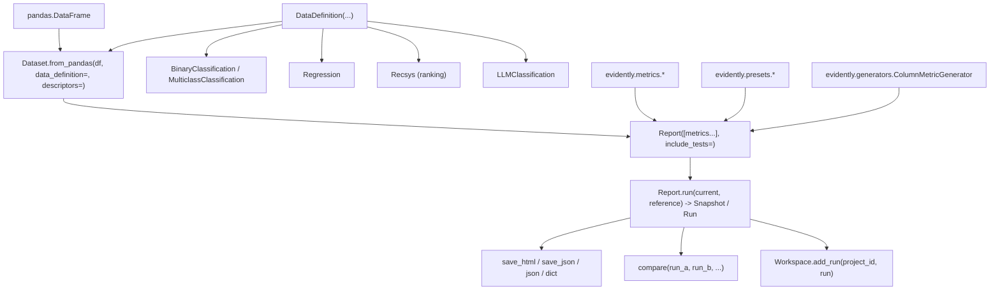
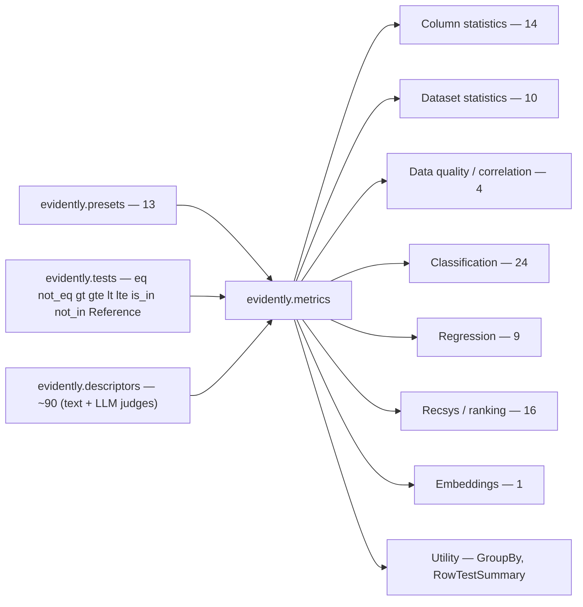
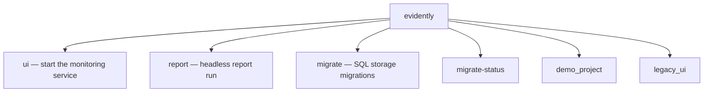
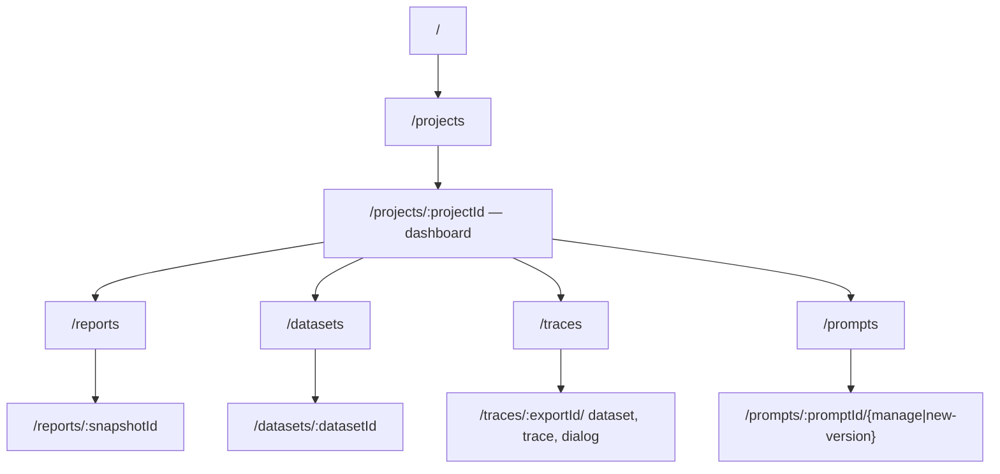
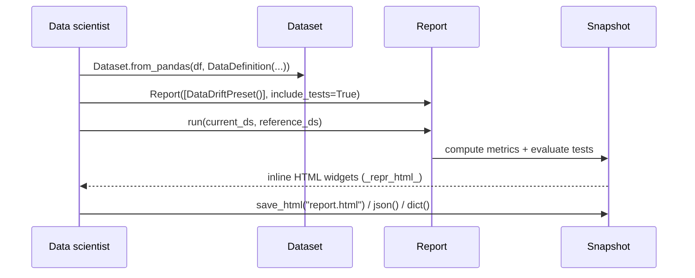
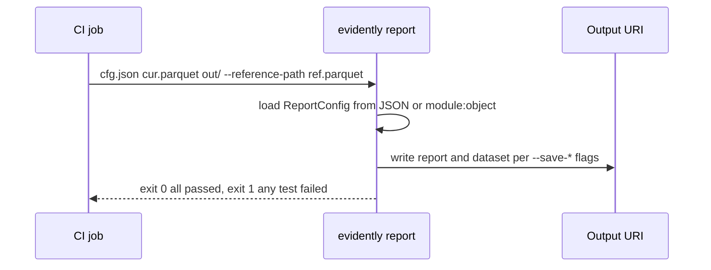
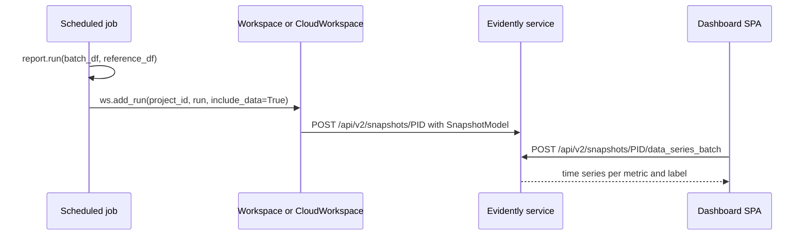
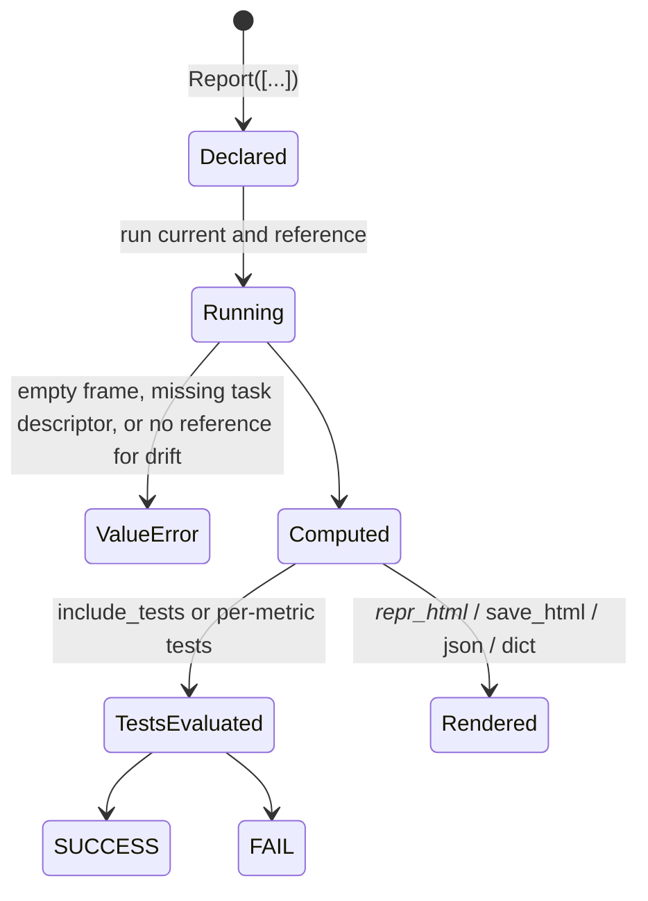
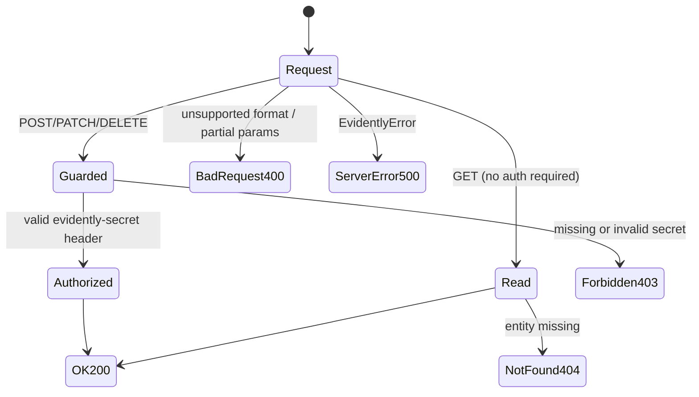

> Source: `https://github.com/evidentlyai/evidently` @ `a4aa4c2b` · Date: 2026-07-21 · Mode: **Explain** · Surface: **Hybrid** (Library/SDK + CLI + Web API + GUI)
> See also: [System & OOP Architecture](./evidently.md)

---

## Cheat Sheet

```python
# ── 1. Install ─────────────────────────────────────────────────────────────
# pip install evidently

# ── 2. The 5-line hello world ──────────────────────────────────────────────
from evidently import Report, Dataset, DataDefinition
from evidently.presets import DataSummaryPreset

ds     = Dataset.from_pandas(df, data_definition=DataDefinition())
report = Report([DataSummaryPreset()])
run    = report.run(ds, None)          # -> Snapshot (aliased `Run`)
run                                    # auto-renders in Jupyter

# ── 3. Export ──────────────────────────────────────────────────────────────
run.save_html("report.html");  run.json();  run.dict();  run.save_json("r.json")

# ── 4. Drift needs a reference dataset ─────────────────────────────────────
from evidently.presets import DataDriftPreset
Report([DataDriftPreset()]).run(current_ds, reference_ds)

# ── 5. Individual metrics + pass/fail tests ────────────────────────────────
from evidently.metrics import MeanValue, RowCount, MissingValueCount
from evidently.tests   import gt, lte, eq, Reference
Report([
    RowCount(tests=[gt(1000)]),
    MeanValue(column="price", tests=[eq(Reference(relative=0.1))]),
    MissingValueCount(column="price", share_tests=[lte(0.05)]),
]).run(cur, ref)

# ── 6. Column mapping for ML tasks ─────────────────────────────────────────
from evidently import DataDefinition, BinaryClassification, Regression, Recsys
DataDefinition(classification=[BinaryClassification(target="y", prediction_probas="p")])
DataDefinition(regression=[Regression(target="y", prediction="yhat")])

# ── 7. Compare several runs in one dataframe ───────────────────────────────
from evidently import compare
compare(run_a, run_b, index="metadata.model_version")

# ── 8. Persist to a workspace and view in the UI ───────────────────────────
from evidently.ui.workspace import Workspace
ws = Workspace.create("workspace")
p  = ws.create_project("My project")
ws.add_run(p.id, run, include_data=True)
```

```bash
evidently ui --host 127.0.0.1 --port 8000 --workspace workspace   # launch dashboard
evidently ui --demo-projects bikes                                # with demo data
evidently report config.json data.parquet out/ --reference-path ref.parquet   # headless run (exit 1 on test failure)
```

---

## 1. Overview

**Evidently** is an open-source framework to evaluate, test and monitor ML and LLM-powered
systems. A user computes *metrics* over one or two tabular datasets, optionally attaches
*tests* (pass/fail conditions) to them, and either reads the result inline (Jupyter HTML),
exports it (JSON/HTML/dict), or ships it to a monitoring service that tracks the same
metrics over time.

**Surface classification: Hybrid.** Four distinct consumer surfaces exist, with clear
evidence for each:

| Surface | Who the user is | Evidence |
|---|---|---|
| **Library / SDK** (primary) | Data scientist / ML engineer importing `evidently` | `src/evidently/__init__.py` `__all__` — `Report`, `Run`, `Dataset`, `DataDefinition`, `compare`, plus `metrics`/`presets`/`tests`/`descriptors`/`generators`/`guardrails` sub-packages |
| **CLI** | Operator / CI job | `pyproject.toml:112` → `evidently = "evidently.cli:app"`; Typer app at `src/evidently/cli/main.py:5` |
| **Web API** | Client dev / a running agent shipping snapshots | Litestar routers under `src/evidently/ui/service/api/`, mounted at `/api` (`components/base.py:42`) |
| **GUI app** | Analyst browsing dashboards | React 18 + Vite SPA in `/ui/service`, router at `ui/service/src/routes/router.tsx:9`; served by the Python service (`api/static.py:14`) |

The **library is the centre of gravity** — the CLI, the service and the SPA all exist to
schedule, store and visualise what the library computes. This document weights sections
accordingly, and covers the non-LLM metric input requirements in depth (§9).

A second, **legacy v1 API** lives under `evidently.legacy` (`ColumnMapping`,
`MetricPreset`, `TestSuite`). It is still importable and still powers many v2 metrics
internally, but it is not the surface a new user is directed to. It is noted where it
leaks through, and otherwise out of scope.

---

## 2. Surface Map

### 2.1 Library — the object model a user touches



| Touchpoint | Signature (as the user writes it) | Purpose |
|---|---|---|
| `Dataset.from_pandas` | `(data, data_definition=None, descriptors=None, options=None, metadata=None, tags=None) -> Dataset` | Wrap a DataFrame with column semantics (`core/datasets.py:1242`) |
| `Dataset.add_descriptors` | `(descriptors: List[Descriptor], options=None)` | Compute row-level scores after construction |
| `Dataset.save` / `Dataset.as_dataframe` | `(uri)` / `() -> DataFrame` | Persist / read back including descriptor columns |
| `DataDefinition` | see §7.1 — 18 keyword params | Map column types, roles and ML tasks (`core/datasets.py:367`) |
| `Report` | `(metrics, metadata=None, tags=None, model_id=None, reference_id=None, batch_size=None, dataset_id=None, include_tests=False)` | Declare *what* to compute (`core/report.py:874`) |
| `Report.run` | `(current_data, reference_data=None, additional_data=None, timestamp=None, metadata=None, tags=None, name=None) -> Snapshot` | Execute (`core/report.py:904`) |
| `Snapshot` / `Run` | `.save_html(f)`, `.save_json(f)`, `.json()`, `.dict()`, `.dumps()`, `.dump_dict()`, `Snapshot.load(path)`, `.tests_results`, `._repr_html_()` | Consume results (`core/report.py:487`) |
| `compare` | `(*runs, index="timestamp", all_metrics=False, use_tests=False) -> pd.DataFrame` | Side-by-side across runs (`core/compare.py:28`) |
| `ColumnMetricGenerator` | `(metric_type, columns=None, column_types="all", metric_kwargs=None)` | Fan one metric across many columns (`generators/column.py:27`) |
| `guard` | `@guard(guard=PIICheck(), input_arg="input")` | Decorator-based runtime validation (`guardrails/decorators.py:17`) |

`Run` is a straight alias of `Snapshot` (`core/__init__` re-export in `evidently/__init__.py`).

### 2.2 Metric & preset catalogue (headline counts)



Full per-metric signatures and **input requirements** are in **§9** — that is the
substantive reference section of this document.

| Family | Module | Exported names |
|---|---|---|
| Column statistics | `metrics/column_statistics.py` | `MinValue MaxValue MeanValue MedianValue StdValue SumValue QuantileValue CategoryCount InRangeValueCount OutRangeValueCount InListValueCount OutListValueCount MissingValueCount UniqueValueCount ValueDrift DriftedColumnsCount` |
| Dataset statistics | `metrics/dataset_statistics.py` | `RowCount ColumnCount DuplicatedRowCount DuplicatedColumnsCount AlmostDuplicatedColumnsCount AlmostConstantColumnsCount ConstantColumnsCount EmptyRowsCount EmptyColumnsCount DatasetMissingValueCount` |
| Correlations | `metrics/data_quality.py` | `ColumnCorrelations ColumnCorrelationMatrix DatasetCorrelations CorrelationMatrix` |
| Classification | `metrics/classification.py` | `Accuracy Precision Recall F1Score TPR TNR FPR FNR RocAuc LogLoss` · `F1ByLabel PrecisionByLabel RecallByLabel RocAucByLabel` · `Dummy{Accuracy,Precision,Recall,F1Score,TPR,TNR,FPR,FNR,RocAuc,LogLoss}` |
| Regression | `metrics/regression.py` | `MeanError MAE MAPE RMSE R2Score AbsMaxError DummyMAE DummyMAPE DummyRMSE` |
| Recsys | `metrics/recsys.py` | `NDCG MRR MAP HitRate PrecisionTopK RecallTopK FBetaTopK ScoreDistribution PopularityBiasMetric Personalization Diversity Serendipity Novelty ItemBias UserBias RecCasesTable` |
| Embeddings | `metrics/embeddings.py` | `EmbeddingsDrift` |
| Utility | `metrics/group_by.py`, `metrics/row_test_summary.py` | `GroupBy RowTestSummary` |
| Presets | `presets/` | `DataSummaryPreset DatasetStats ValueStats TextEvals DataDriftPreset ClassificationPreset ClassificationQuality ClassificationQualityByLabel ClassificationDummyQuality RegressionPreset RegressionQuality RegressionDummyQuality RecsysPreset` |

### 2.3 CLI command tree



| Command | Key options |
|---|---|
| `evidently ui` | `--host 127.0.0.1` · `--port 8000` · `--workspace workspace` · `--demo-projects ""` (`all｜bikes｜reviews`) · `--secret` · `--litestar-request-max-body-size` · `--conf-path` (`cli/ui.py:88`) |
| `evidently report CONFIG INPUT OUTPUT` | `--reference-path` · `--dataset-name "CLI run"` · `--test-summary/--no-test-summary` · `--save-dataset/--no-save-dataset` · `--save-report/--no-save-report` (`cli/report.py:38`) |
| `evidently migrate DATABASE_URL` | `--revision head` · `-d/--downgrade` · `-a/--autogenerate` · `-m/--message` (`cli/migrate.py:45`) |
| `evidently migrate-status DATABASE_URL` | — (`cli/migrate.py:75`) |
| `evidently demo_project` | `--project all` · `--path workspace` · `--secret` (`cli/demo_project.py:17`) |
| `evidently legacy_ui` | `--host --port --workspace --demo-projects --secret` (`cli/legacy_ui.py:31`) |

Help flags are `-h/--help`; bare `evidently` prints help (`no_args_is_help=True`,
`cli/main.py:5`). A second, unwired Typer app exists at `evidently.legacy.cli` (`ui`,
`collector`) reachable only as a Python call.

### 2.4 Web API endpoint catalogue

All routers mount under `/api`. Only the projects module is versioned (`/api/projects` v1,
`/api/v2/{projects,snapshots,dashboards}`).

| Method | Path | Purpose | Auth |
|---|---|---|---|
| GET | `/api/version` | Health / version probe | open |
| GET | `/api/projects/` · `/search/{name}` · `/{id}/info` | List / search / describe projects | open |
| GET | `/api/projects/{pid}/reports` · `/snapshots` | List reports / snapshots | open |
| GET | `/api/projects/{pid}/{sid}/data` · `/metadata` · `/download?report_format=html\|json` · `/graphs_data/{gid}` | Read one snapshot | open |
| POST/DELETE | `/api/projects/` · `/{pid}/info` · `/{pid}` · `/{pid}/{sid}` · `/{pid}/reload` | Mutate projects & snapshots | **write guard** |
| GET | `/api/v2/snapshots/{pid}/metrics` · `/labels` · `/label_values` | Discover what is plottable | open |
| POST | `/api/v2/snapshots/{pid}/data_series_batch` | Time-series for dashboard panels | open |
| **POST** | **`/api/v2/snapshots/{pid}`** | **Upload a snapshot** — the main ingest path | **write guard** |
| GET/POST | `/api/v2/dashboards/{pid}` | Read / save dashboard layout | open / write |
| PATCH/DELETE | `/api/v2/projects/{pid}` | Update / delete project | write |
| GET | `/api/datasets/` · `/{id}` (paginated rows) · `/metadata` · `/data_definition` · `/download?format=parquet+sdk` | Browse datasets | open |
| POST/PATCH/DELETE | `/api/datasets/upload` · `/{id}` · `/materialize` · `/tracing` | Manage datasets | write |
| GET/POST/PUT/DELETE | `/api/artifacts…` and `/api/prompts…` | Versioned artifact & prompt registries (identical shapes) | read open / write guarded |
| GET/POST | `/api/llm_judges/templates` · `/prompt_template` | Built-in judge templates | **unguarded** |
| POST | `/api/v1/traces/` | **OTLP trace ingest** (protobuf); needs resource attr `evidently.export_id` | write |
| GET/POST/DELETE | `/api/v1/traces/list` · `/metadata` · `/human_feedback` · `/{export_id}/{trace_id}` | Trace browsing & feedback | mixed |

### 2.5 GUI route map



React 18 + TypeScript + Vite 7 + react-router-dom, built into
`src/evidently/ui/service/assets` and served by the Python service; only `/` and
`/projects/*` fall through to `index.html`.

---

## 3. Entry & Onboarding

**Install.** `pip install evidently` (or `conda install -c conda-forge evidently`).
Python ≥ 3.10. Extras: `evidently[sql]` for Postgres/SQLite-backed service storage;
`tracely` (a separate package) for tracing instrumentation.

**Smallest real thing — three objects.** The onboarding contract is: *wrap the data,
declare the report, run it.*

```python
from evidently import Report, Dataset, DataDefinition
from evidently.presets import DataSummaryPreset

ds  = Dataset.from_pandas(df, data_definition=DataDefinition())   # empty = auto-infer types
run = Report([DataSummaryPreset()]).run(ds, None)
run                                                               # renders inline in Jupyter
```

Two deliberate on-ramps lower the first-step cost:

- `DataDefinition()` with **no arguments auto-infers** column types, so nothing must be
  mapped to get a first result.
- `Report.run()` accepts a raw `pandas.DataFrame` directly (`Dataset.from_any`,
  `core/datasets.py:1275`) — the `Dataset` wrapper is optional until descriptors are needed.

**First run of the service.** `evidently ui` starts the dashboard at
`http://127.0.0.1:8000` against a `./workspace` directory. `evidently ui --demo-projects bikes`
seeds a working project so the UI is not empty on first visit — a background thread polls
`GET /api/version` up to 30× at 0.5 s before creating it (`cli/ui.py:40-85`).

**First remote call.** Cloud users authenticate with an `sk_…` token:

```python
from evidently.ui.workspace import CloudWorkspace
ws = CloudWorkspace(token="sk_...", url="https://app.evidently.cloud")   # or env EVIDENTLY_API_KEY
```

Self-hosted write auth is a shared secret in the **`evidently-secret`** header, enabled by
`evidently ui --secret …` or env `EVIDENTLY_SECRET`.

---

## 4. Key User Journeys

### 4.1 Offline evaluation in a notebook (the dominant path)



### 4.2 CI regression gate



The output URI is polymorphic: a local path, `http(s)://…/<project_id>` →
`RemoteWorkspace`, or `cloud://…/<project_id>` → `CloudWorkspace` (`cli/utils.py:41-51`).
So the same command either writes a file or pushes to a monitoring service.

### 4.3 Continuous monitoring



Panels are declared in Python and pushed to the dashboard:

```python
from evidently.sdk.panels import line_plot_panel, counter_panel
project.dashboard.add_panel(line_plot_panel(title="Drift", values=[...]), tab="Data")
```

---

## 5. Interaction & State

### 5.1 Library — what the user sees as conditions vary



Test statuses come from `TestStatus` (`SUCCESS` / `FAIL`, plus legacy states) and surface
both as coloured widgets and as `run.tests_results`.

**The error contract is exceptions, and it is mostly `ValueError`.** Representative
messages a user will actually hit:

| Condition | Message | Where |
|---|---|---|
| Empty input | `current_data must contain at least one column; received an empty DataFrame.` | `core/report.py` in `run()` |
| Drift without reference | `Reference data is required for Value Drift` | `metrics/column_statistics.py:568` |
| `Reference(...)` threshold without a reference dataset | `No Reference dataset provided, but tests contains Reference thresholds` | `tests/numerical_tests.py:53` |
| Regression metrics without the task descriptor | `No regression '<name>' in data definition` | `metrics/regression.py:52` |
| Classification preset without the task descriptor | `Classification with name '<name>' not found` | `presets/classification.py:124` |
| `tests=` on a mean/std metric | `Did you mean 'mean_tests=' or 'std_tests='?` | `metrics/regression.py:146` |
| Bad `BinaryClassification` config | `target and one of (labels or probas) should be set` | `core/datasets.py:144` |
| `CategoryCount` with no categories | `Please provide at least one category` | `metrics/column_statistics.py:286` |

There is **no typed exception hierarchy for user input** on the v2 metric surface —
`ValueError` carries the whole burden. (`evidently/errors.py` exists but serves the
service and legacy layers.)

### 5.2 CLI

| Exit code | Meaning |
|---|---|
| `0` | Report ran; all tests passed |
| `1` | A test failed (`cli/report.py:70,97`), or an unknown demo project / missing extra |
| Typer default | Bad flag → usage error |

`--demo-projects` validates against `{bikes, reviews, all}` and raises `BadParameter`
otherwise. `evidently migrate-status` on a build without `evidently[sql]` fails with an
install hint (`cli/migrate.py:84`).

### 5.3 Web API



| Status | Body | Trigger |
|---|---|---|
| 200 | typed model JSON | success |
| 400 | `{"detail": …}` | `report_format` not `html`/`json`; partial snapshot-link params on dataset upload |
| 403 | `{"detail": "Not enough permissions"}` | write guard rejects — note **403, not 401**, even when unauthenticated |
| 404 | `{"detail": "<Entity> not found"}` | Project / Snapshot / Dataset / Artifact / Prompt / Org / Team / User / Role |
| 500 | `{"detail": "<message>"}` | any `EvidentlyError` |
| 501 | — | trace human-feedback on a non-SQLite storage backend |

**All read endpoints are unauthenticated** in the OSS service, and `user_id` is a constant
`ZERO_UUID` — there is no per-user identity. The default `NoSecurityService` authenticates
everyone as a dummy user; `TokenSecurity` (via `--secret`) is opt-in and only gates writes.

---

## 6. Information Architecture / API Ergonomics

**Naming is consistent and predictable, and that is the surface's main strength.**

- **Metrics are nouns naming the number they produce** — `MeanValue`, `RowCount`,
  `MissingValueCount`, `DriftedColumnsCount`. A user can guess a metric name and usually
  be right. Counting metrics uniformly end in `Count` and uniformly return count *and*
  share.
- **Two-level composition.** `Preset` → `Metric` is the only layer a user must understand.
  Presets are `MetricContainer`s that expand to metric lists at run time based on the data
  definition, so `DataSummaryPreset()` adapts to whatever columns exist rather than failing.
- **Tests are lower-case function aliases** (`eq gt gte lt lte not_eq is_in not_in`) that
  read like conditions: `RowCount(tests=[gt(1000)])`. They are overloaded to produce
  *either* a metric-level test or a row-level descriptor condition depending on call site
  (`tests/aliases.py`) — one vocabulary, two scopes.
- **`Reference(relative=…, absolute=…)`** is a first-class threshold value, so
  "within 10 % of the reference dataset" is expressible without computing anything by hand.

**Rough edges worth knowing.**

- Metrics are Pydantic models, so **all metric constructors are keyword-only** except the
  few with a hand-written `__init__` (`CategoryCount`, `GroupBy`, `ValueStats`,
  `RegressionQuality`, `MeanError`/`MAE`/`MAPE`). `MeanValue("price")` fails;
  `MeanValue(column="price")` works. This inconsistency is the single most likely first
  stumble.
- `MeanStd` metrics reject `tests=` and demand `mean_tests=`/`std_tests=` — caught with a
  helpful message, but still a surprise.
- `ValueDrift` accepts a `tests=` field it cannot honour: its bound-test classes
  `raise NotImplementedError`, and drift pass/fail is injected as a synthetic test result
  instead (`column_statistics.py:550-624`).
- **Column-type requirements are undocumented in the type system.** There is no
  `required_columns` declaration and no `ColumnType` validation inside metrics; passing a
  categorical column to `MeanValue` surfaces as a pandas error, not an Evidently one. §9
  reconstructs those requirements by reading the implementations.
- `GET /api/projects/{pid}/reload` mutates behind a GET; `DELETE` vs `POST` conventions are
  otherwise clean. Versioning is partial — only projects/snapshots/dashboards have a `/v2`.

**AX note — the agent as consumer.** Three of the four surfaces are plausibly agent-driven,
and the current state is mixed:

- *CLI:* good branching material — a stable binary exit contract (`0` pass / `1` any test
  failed) means an agent can gate on a run without parsing output. `--help` is
  Typer-generated and self-documenting. Weakness: `evidently report` output goes to a URI,
  not stdout, so an agent must read a file back to learn *which* test failed.
- *Library:* `run.dict()` / `run.json()` give a stable machine-readable contract
  (`{"metrics": [...], "tests": [...]}`) that is far more token-economical than the HTML —
  the right thing for an agent to consume. `run.tests_results` is the direct list.
- *Web API:* fully typed Litestar handlers export an OpenAPI schema (the frontend generates
  its TS types from it), so an agent can discover the surface. Against that: the
  405-ish/403-instead-of-401 status choice is misleading for an agent branching on auth
  failure, and read endpoints being unauthenticated means an agent cannot use auth success
  as a reachability signal.
- *Errors:* the messages above mostly *teach the next move* ("Did you mean 'mean_tests='?",
  "Reference data is required for Value Drift") — good AX. The gap is the untyped
  column-type failures, which surface as pandas tracebacks with no Evidently context.

---

## 7. Configuration & Customization

### 7.1 `DataDefinition` — the main configuration object

```python
DataDefinition(
    id_column=None, timestamp=None,
    numerical_columns=None, categorical_columns=None, text_columns=None,
    datetime_columns=None, unknown_columns=None, list_columns=None,
    classification=None,      # List[BinaryClassification | MulticlassClassification]
    regression=None,          # List[Regression]
    ranking=None,             # List[Recsys]
    llm=None,                 # LLMClassification
    embeddings=None,          # Dict[str, List[str]]
    numerical_descriptors=None, categorical_descriptors=None, test_descriptors=None,
    service_columns=None, special_columns=None,
)
```

Task descriptors (all keyword-only dataclasses, `core/datasets.py:85-268`):

| Descriptor | Fields (defaults) |
|---|---|
| `BinaryClassification` | `name="default"`, `target`, `prediction_labels`, `prediction_probas`, `pos_label=1`, `labels`. Zero-arg → `target="target"`, `prediction_probas="prediction"`. Otherwise `target` **plus** at least one of labels/probas is required |
| `MulticlassClassification` | same shape; `prediction_probas: List[str]`. Zero-arg → `target="target"`, `prediction_labels="prediction"` |
| `Regression` | `name="default"`, `target="target"`, `prediction="prediction"` |
| `Recsys` | `name="default"`, `user_id="user_id"`, `item_id="item_id"`, `target="target"`, `prediction="prediction"`, `recommendations_type="score"｜"rank"` |
| `LLMClassification` | `input`, `target`, `predictions`, `reasoning` |

Multiple named tasks can coexist; every metric carries a matching
`classification_name` / `regression_name` / `ranking_name` (default `"default"`).

### 7.2 Report-level knobs

`include_tests=True` turns on each metric's **default tests**, which differ depending on
whether a reference dataset was supplied (`_default_tests` vs `_default_tests_with_reference`).
`metadata` / `tags` / `name` / `timestamp` on `Report` and `run()` control how snapshots are
grouped and indexed in the UI and in `compare(..., index="metadata.<key>")`.

### 7.3 Service configuration

| Channel | Examples |
|---|---|
| CLI flags | `--host --port --workspace --secret --conf-path --litestar-request-max-body-size` |
| Env vars | `EVIDENTLY_SECRET`, `EVIDENTLY_API_KEY`, `EXPERIMENTAL_DETERMINISTIC_UUID`, `PRETTY_EXCEPTIONS_DISABLED` |
| Config file | `--conf-path` → dynaconf-backed component config (storage backend, tracing storage, security) |
| Storage backends | local filesystem workspace; SQL (`evidently[sql]`, migrated with `evidently migrate`); tracing storage `file｜sql｜noop` |

### 7.4 Extension points

| Want to… | Use |
|---|---|
| Same metric across many columns | `ColumnMetricGenerator(MeanValue, column_types="numerical")` |
| Metric per segment | `GroupBy(metric, column_name)` |
| Custom row-level score | `CustomDescriptor` / `CustomColumnDescriptor` (`descriptors/_custom_descriptors.py`) |
| Runtime input/output validation | `@guard(PIICheck())`, `IncludesWords`, `WordsPresence`, `PythonFunction(fn)` → raises `GuardException` |
| Custom dashboard panels | `sdk.panels.{text,counter,line_plot,bar_plot,pie_plot}_panel` |
| Prompt / config registries | `ws.prompts`, `ws.configs`, `ws.artifacts` (CRUD + versioning, `get_version(id, "latest")`) |

---

## 8. Open Questions & Notes

- **Column-type requirements in §9 are reconstructed, not declared.** The repo has no
  `required_columns` or `ColumnType` validation on metrics. The "type needed" column was
  inferred from the pandas operation each metric performs and from how presets branch on
  `context.column(col).column_type`. It is accurate as behaviour, but it is *not* a
  contract the library enforces or promises.
- **v1 vs v2 boundary.** Many v2 metrics delegate to `evidently.legacy` implementations.
  Users can still import legacy `ColumnMapping`/`TestSuite`. This document treats v2 as the
  surface; whether v1 is formally deprecated is not stated in the code.
- **Cloud endpoints are not in this repo.** `CloudWorkspace` calls
  `GET /api/users/login` and `/api/v2/datasets`, which the OSS service does not implement —
  the cloud API's full surface cannot be documented from this evidence.
- Observed inconsistencies, reported as found rather than smoothed over:
  `evidently demo_project` defaults to `--project all`, which is not a key in
  `DEMO_PROJECTS` and exits 1; `GroupBy(include_tests=…)` is accepted but ignored;
  `DatasetStats(dataset_missing_value_share_tests=…)` is accepted but never assigned;
  `DataDriftPreset(embeddings=…)` is stored but never emits an `EmbeddingsDrift` metric;
  `DatasetMissingValueCount`'s docstring describes a `columns` argument that does not exist.
- The **descriptor / LLM-judge surface (~90 names)** is inventoried by name only here, per
  the request to focus on non-LLM observability. `LLMEval`, `LLMJudge` and the
  `*LLMEval` family additionally require a configured provider/model and network access.
- Not audited: the SPA's in-page UX (component library, empty/loading states) beyond the
  route inventory, and the `llm/` optimisation & RAG sub-packages.

---

## 9. Appendix — Metric Input Requirements (non-LLM)

The reference table this document exists for. Read the columns as:

- **Column** — does the metric take a `column=` argument?
- **Type needed** — what the column must actually be for the computation to succeed
  (reconstructed; see §8).
- **Ref** — is a reference dataset required, optional-but-used, or unused?
- **Task descriptor** — what must be configured in `DataDefinition`.
- **Returns** — the result shape, which determines what `tests=` can bind to.

Common Pydantic-derived constructor fields: `tests=` (single-value),
`share_tests=` (count metrics), `mean_tests=`/`std_tests=` (mean-std metrics),
`replace_nan=` (by-label counts).

### 9.1 Column statistics — descriptive

`from evidently.metrics import MinValue, MeanValue, ...`

| Metric | Signature | Column | Type needed | Ref | Returns |
|---|---|---|---|---|---|
| `MinValue` | `(*, column, tests=None)` | ✔ | numerical (also datetime) | optional | `SingleValue` |
| `MaxValue` | `(*, column, tests=None)` | ✔ | numerical (also datetime) | optional | `SingleValue` |
| `MeanValue` | `(*, column, tests=None)` | ✔ | **numerical** | optional | `SingleValue` |
| `MedianValue` | `(*, column, tests=None)` | ✔ | **numerical** | optional | `SingleValue` |
| `StdValue` | `(*, column, tests=None)` | ✔ | **numerical** | optional | `SingleValue` |
| `SumValue` | `(*, column, tests=None)` | ✔ | **numerical** | optional | `SingleValue` |
| `QuantileValue` | `(*, column, quantile=0.5, tests=None)` | ✔ | **numerical** | optional | `SingleValue` |

With a reference dataset these gain a default test `eq(Reference(relative=0.1))`; without
one they have no default test. All render a current-vs-reference distribution plot.

### 9.2 Column statistics — counts

| Metric | Signature | Column | Type needed | Ref | Returns |
|---|---|---|---|---|---|
| `MissingValueCount` | `(*, column, tests=None, share_tests=None)` | ✔ | **any** | optional | `CountValue` |
| `CategoryCount` | `(column, categories=None, category=None, tests=None, share_tests=None)` — positional-friendly; raises if neither `categories` nor `category` given, and on duplicates | ✔ | **categorical** | optional | `CountValue` |
| `InListValueCount` | `(*, column, values: List[Label], tests=None, share_tests=None)` | ✔ | **categorical** | optional | `CountValue` |
| `OutListValueCount` | `(*, column, values: List[Label], tests=None, share_tests=None)` | ✔ | **categorical** | optional | `CountValue` |
| `InRangeValueCount` | `(*, column, left, right, tests=None, share_tests=None)` — `left`/`right` required | ✔ | **numerical** | optional | `CountValue` |
| `OutRangeValueCount` | `(*, column, left, right, tests=None, share_tests=None)` | ✔ | **numerical** | optional | `CountValue` |
| `UniqueValueCount` | `(*, column, replace_nan=None, tests: Dict[Label,...]=None, share_tests=None)` | ✔ | **categorical** | optional (label set = current ∪ reference) | `ByLabelCountValue` |

`MissingValueCount` defaults to `eq(0)` on the count without a reference, and
`eq(Reference(relative=0.1))` on count *and* share with one.

### 9.3 Drift

| Metric | Signature | Column | Type needed | Ref | Returns |
|---|---|---|---|---|---|
| `ValueDrift` | `(*, column, method=None, threshold=None, nbinsx=None, tests=None)` | ✔ | **numerical / categorical / datetime / text** — stat test auto-dispatched from the column's declared type | **REQUIRED** — raises `ValueError` | `SingleValue` (drift score) |
| `DriftedColumnsCount` | `(*, columns=None, embeddings=None, embeddings_drift_method=None, drift_share=0.5, method=None, cat_method=None, num_method=None, text_method=None, per_column_method=None, threshold=None, cat_threshold=None, num_threshold=None, text_threshold=None, per_column_threshold=None, tests=None, share_tests=None)` | ✘ dataset-level | n/a | **REQUIRED** | `CountValue` |
| `EmbeddingsDrift` | `(*, embeddings_name: str, drift_method=None, tests=None)` | ✘ | requires `DataDefinition(embeddings={"name": [cols…]})` | **REQUIRED** | `SingleValue` |

`ValueDrift`'s pass/fail is a synthetic test result (`id="drift"`, FAIL when drift is
detected); user-supplied `tests=` cannot bind to it. `DriftedColumnsCount` defaults to
`lt(drift_share)` on the share. `EmbeddingsDrift` accepts `ModelDriftMethod`,
`DistanceDriftMethod`, `RatioDriftMethod`, `MMDDriftMethod`.

### 9.4 Dataset statistics — all dataset-level, no `column`, reference optional

| Metric | Signature | Returns | Default test (no ref → with ref) |
|---|---|---|---|
| `RowCount` | `(*, tests=None)` | `SingleValue` | `gt(0)` → `eq(Reference(relative=0.1))` |
| `ColumnCount` | `(*, column_type: Optional[ColumnType]=None, tests=None)` — `Numerical｜Categorical｜Text｜Datetime`, else `ValueError` | `SingleValue` | `gt(0)` → `eq(Reference())` |
| `DuplicatedRowCount` | `(*, tests=None)` | `SingleValue` | `eq(0)` → `eq(Reference(relative=0.1))` |
| `DuplicatedColumnsCount` | `(*, tests=None)` | `SingleValue` | `eq(0)` → `lte(Reference())` |
| `AlmostDuplicatedColumnsCount` | `(*, tests=None)` | `SingleValue` | none |
| `AlmostConstantColumnsCount` | `(*, tests=None)` | `SingleValue` | `eq(0)` → `lte(Reference())` |
| `ConstantColumnsCount` | `(*, tests=None)` | `SingleValue` | `eq(0)` → `lte(Reference())` |
| `EmptyRowsCount` | `(*, tests=None)` | `SingleValue` | `eq(0)` → `eq(Reference(relative=0.1))` |
| `EmptyColumnsCount` | `(*, tests=None)` | `SingleValue` | `eq(0)` → `lte(Reference())` |
| `DatasetMissingValueCount` | `(*, tests=None, share_tests=None)` | `CountValue` | `eq(0)` on count → `eq(Reference(relative=0.1))` |

### 9.5 Correlations

| Name | Kind | Signature | Column | Type needed | Ref |
|---|---|---|---|---|---|
| `ColumnCorrelations` | container | `(*, column_name, include_tests=True)` | ✔ | numerical → pearson/spearman/kendall; categorical → cramer_v; **other types emit no metrics at all** | optional |
| `ColumnCorrelationMatrix` | metric | `(*, column_name, kind="auto"｜"pearson"｜"spearman"｜"kendall"｜"cramer_v", tests: Dict[str,...]=None)` | ✔ | as above | optional |
| `DatasetCorrelations` | container | `(*, include_tests=True)` → 4 `CorrelationMatrix` | ✘ | n/a | optional |
| `CorrelationMatrix` | metric | `(*, kind="auto"…, tests=None)` | ✘ | n/a | optional |

Returns `DataframeValue`; tests bind per-column.

### 9.6 Classification

**Prerequisite for every metric below:**
`DataDefinition(classification=[BinaryClassification(...)])` or `[MulticlassClassification(...)]`,
whose `name` matches the metric's `classification_name` (default `"default"`).

Shared signature: `(*, classification_name="default", probas_threshold=None, k=None, tests=None)`
plus the visual flags listed.

| Metric | Extra ctor fields | Needs `prediction_probas`? | Binary only? | Returns | Default test (no ref) |
|---|---|---|---|---|---|
| `Accuracy` | — | no | no | `SingleValue` | `gt(DummyAccuracy)` |
| `Precision` | `conf_matrix=True, pr_curve=False, pr_table=False` | no | no | `SingleValue` | `gt(DummyPrecision)` |
| `Recall` | `conf_matrix=True, pr_curve=False, pr_table=False` | no | no | `SingleValue` | `gt(DummyRecall)` |
| `F1Score` | `conf_matrix=True` | no | no | `SingleValue` | `gt(DummyF1Score)` |
| `TPR` | `pr_table=False` | **yes in practice** — raises if unavailable | ✔ | `SingleValue` | `gt(DummyTPR)` |
| `TNR` | `pr_table=False` | **yes** | ✔ | `SingleValue` | `gt(DummyTNR)` |
| `FPR` | `pr_table=False` | **yes** | ✔ | `SingleValue` | `lt(DummyFPR)` |
| `FNR` | `pr_table=False` | **yes** | ✔ | `SingleValue` | `lt(DummyFNR)` |
| `RocAuc` | `roc_curve=True, pr_table=False` | **yes — required** | no | `SingleValue` | `gt(DummyRocAuc)` |
| `LogLoss` | `pr_table=False` | **yes — required** | no | `SingleValue` | `lt(DummyLogLoss)` |

With a reference dataset all ten default to `eq(Reference(relative=0.2))`.

**By-label** — `(*, classification_name="default", probas_threshold=None, k=None, tests: Dict[Label, List[MetricTest]]=None)`,
returns `ByLabelValue`, no default tests: `F1ByLabel`, `PrecisionByLabel`, `RecallByLabel`,
`RocAucByLabel` (needs probas; falls back to `0.0` when unavailable).

**Dummy baselines** — same signature, `SingleValue`, default tests explicitly disabled:
`DummyAccuracy`, `DummyPrecision`, `DummyRecall`, `DummyF1Score`, `DummyTPR`, `DummyTNR`,
`DummyFPR`, `DummyFNR`, `DummyRocAuc`, `DummyLogLoss`. These exist so the real metrics can
default to "better than a dummy classifier".

### 9.7 Regression

**Prerequisite:** `DataDefinition(regression=[Regression(target=…, prediction=…)])`, both
columns numerical. A missing descriptor raises `No regression '<name>' in data definition`.

| Metric | Signature | Ref | Returns | Default test (no ref → with ref) |
|---|---|---|---|---|
| `MeanError` | `(*, regression_name="default", error_plot=True, error_distr=False, error_normality=False, mean_tests=None, std_tests=None)` — `tests=` raises | optional | `MeanStdValue` | none → `eq(Reference(relative=0.1))` |
| `MAE` | `(*, regression_name, error_plot=False, error_distr=True, error_normality=False, mean_tests=None, std_tests=None)` — `tests=` raises | optional | `MeanStdValue` | `lt(DummyMAE)` → `eq(Reference(relative=0.1))` on mean |
| `MAPE` | `(*, regression_name, perc_error_plot=True, error_distr=False, zero_handling="none"｜"drop"｜"replace", replace_value=None, epsilon=None, mean_tests=None, std_tests=None)` | optional | `MeanStdValue` | `lt(DummyMAPE)` → `eq(Reference(relative=0.1))` |
| `RMSE` | `(*, regression_name, error_plot=False, error_distr=True, error_normality=False, tests=None)` | optional | `SingleValue` | `lt(DummyRMSE)` → `eq(Reference(relative=0.1))` |
| `R2Score` | `(*, regression_name, error_distr=False, error_normality=False, tests=None)` | optional | `SingleValue` | `gt(0)` → `eq(Reference(relative=0.1))` |
| `AbsMaxError` | `(*, regression_name, error_distr=False, error_normality=False, tests=None)` | optional | `SingleValue` | none → `eq(Reference(relative=0.1))` |
| `DummyMAE` / `DummyMAPE` / `DummyRMSE` | `(*, regression_name="default", tests=None)` | optional | `SingleValue` | none |

### 9.8 Recsys / ranking

**Prerequisite:** `DataDefinition(ranking=[Recsys(user_id=…, item_id=…, target=…, prediction=…, recommendations_type="score"｜"rank")])`.
Note the descriptor is looked up leniently — a missing `ranking` config **silently
produces no input data** rather than raising, unlike regression.

**Top-K family** — `(*, k: int, min_rel_score=None, no_feedback_users=False, ranking_name="default", tests=None)`,
`k` **required**, returns `DataframeValue` (`rank`, `value`), no default tests:
`NDCG`, `MRR`, `HitRate`, `MAP`, `RecallTopK`, `PrecisionTopK`, and `FBetaTopK` (adds `beta=1.0`).

| Metric | Signature | Extra data needed | Returns |
|---|---|---|---|
| `ScoreDistribution` | `(*, k, ranking_name, tests=None)` | — | `SingleValue` (entropy) |
| `Personalization` | `(*, k, ranking_name, tests=None)` | — | `SingleValue` |
| `PopularityBiasMetric` | `(*, k, normalize_arp=False, ranking_name, metric="arp"｜"coverage"｜"gini", tests=None)` | **training data** | `SingleValue` |
| `Novelty` | `(*, k, ranking_name, tests=None)` | **training data** | `SingleValue` |
| `Diversity` | `(*, k, item_features: List[str], ranking_name, tests=None)` | **item feature columns** | `SingleValue` |
| `Serendipity` | `(*, k, item_features: List[str], ranking_name, tests=None)` | **item features + training data** | `SingleValue` |
| `ItemBias` | `(*, k, column_name, distribution="default"｜"train", ranking_name)` — no `tests` field | optional train data | `DataframeValue` |
| `UserBias` | `(*, column_name, distribution="default"｜"train", ranking_name)` — no `k`, no `tests` | optional train data | `DataframeValue` |
| `RecCasesTable` | `(*, user_ids=None, display_features=None, ranking_name, tests=None)` | — | `DataframeValue` |

Training data is supplied as a third dataset:

```python
report.run(current, reference, additional_data={"current_train_data": train_ds})
```

### 9.9 Utility metrics

| Metric | Signature | Requirement |
|---|---|---|
| `GroupBy` | `(metric: Metric, column_name: str, include_tests=True)` — positional | `column_name` must be low-cardinality categorical; expands to one metric per label, slicing both current and reference. `include_tests` is accepted but **ignored** |
| `RowTestSummary` | `(*, columns: List[str]=[], min_success_rate=1, include_tests=True)` | Defaults to `DataDefinition(test_descriptors=[…])`; emits `MeanValue` per test column plus `RowCount`, each with `gte(min_success_rate)` |

### 9.10 Presets — expansion rules and requirements

| Preset | Signature (abridged) | Requires | Expands to |
|---|---|---|---|
| `ValueStats` | `(column, …per-stat tests…, include_tests=True, replace_nan=None)` | a column | `RowCount` + `MissingValueCount`, then **by type**: numerical → min/max/mean/std/q25/q50/q75; categorical → `UniqueValueCount`; datetime → min/max (no tests); text → nothing extra |
| `DatasetStats` | `(…count tests…, include_tests=True)` | nothing | 14 dataset-level metrics (row/column counts by type, duplicates, empties, constants, missing values) |
| `TextEvals` | `(columns=None, row_count_tests=None, column_tests=None, include_tests=True)` | descriptor columns | `RowTestSummary` + `RowCount` + per-descriptor `ValueStats` |
| `DataSummaryPreset` | `(columns=None, …, column_tests=None, include_tests=True)` | nothing | `DatasetStats` + `TextEvals` over categorical + numerical columns |
| `DataDriftPreset` | `(columns=None, embeddings=None, drift_share=0.5, method/cat_method/num_method/text_method, per_column_method, threshold/cat_/num_/text_/per_column_threshold, include_tests=True)` | **reference dataset** | `DriftedColumnsCount` + one `ValueDrift` per numerical/categorical/text column. `embeddings=` is stored but unused |
| `ClassificationQuality` | `(classification_name="default", probas_threshold=None, conf_matrix=False, pr_curve=False, pr_table=False, …per-metric tests…)` | classification descriptor — **raises if absent** | Accuracy, Precision, Recall, F1Score; `+ RocAuc, LogLoss` if probas; `+ TPR, TNR, FPR, FNR` if binary |
| `ClassificationQualityByLabel` | `(probas_threshold=None, k=None, …tests…, classification_name="default")` | classification descriptor | F1/Precision/Recall by label; `+ RocAucByLabel` if probas |
| `ClassificationDummyQuality` | `(probas_threshold=None, k=None, classification_name="default")` | classification descriptor | `DummyPrecision, DummyRecall, DummyF1Score` — args are **not forwarded** to children |
| `ClassificationPreset` | union of the two quality presets' params | classification descriptor | `ClassificationQuality(conf_matrix=True, pr_curve=True, pr_table=True)` + `ClassificationQualityByLabel` |
| `RegressionQuality` | `(pred_actual_plot=False, error_plot=False, error_distr=False, …tests…, regression_name="default")` | regression descriptor | MeanError, MAPE, RMSE, MAE, R2Score, AbsMaxError |
| `RegressionDummyQuality` | `(mae_tests=None, mape_tests=None, rmse_tests=None, regression_name="default")` | regression descriptor | DummyMAE, DummyMAPE, DummyRMSE |
| `RegressionPreset` | `(…six test params…, regression_name="default")` | regression descriptor | `RegressionQuality` with all three plots on |
| `RecsysPreset` | `(k, min_rel_score=None, no_feedback_users=False, ranking_name="default", beta=1.0, normalize_arp=False, user_ids=None, display_features=None, item_features=None, user_bias_columns=None, item_bias_columns=None)` | ranking descriptor; `k` required | always: PrecisionTopK, RecallTopK, FBetaTopK, MAP, NDCG, MRR, HitRate, ScoreDistribution, RecCasesTable, Personalization. `+ PopularityBiasMetric, Novelty` with train data; `+ Diversity` with `item_features`; `+ Serendipity` with both; `+ ItemBias/UserBias` per bias column with train data |

### 9.11 Test builders

`from evidently.tests import eq, not_eq, gt, gte, lt, lte, is_in, not_in, Reference`

| Builder | Signature |
|---|---|
| `eq` / `not_eq` | `(expected, *, is_critical=True, column=None, alias=None, label_filters=None)` |
| `gt` / `gte` / `lt` / `lte` | `(threshold, *, is_critical=True, column=None, alias=None, label_filters=None)` |
| `is_in` / `not_in` | `(values: List[InValueType], *, is_critical=True, column=None, alias=None, label_filters=None)` |
| `Reference` | `(relative: Optional[float]=None, absolute: Optional[float]=None)` |

`ThresholdType = Union[float, int, ApproxValue, Reference]`. **There is no `between(...)`** —
use `gte(lo)` + `lte(hi)`, or the `InRangeValueCount(left=, right=)` metric. Each builder
returns a `GenericTest` carrying both a metric-level test and a row-level descriptor
condition; the call site decides which applies. Result-shape binding is automatic —
`bind_single`, `bind_by_label`, `bind_count(is_count=)`, `bind_mean_std(is_mean=)`,
`bind_dataframe(column=)`.

### 9.12 Quick decision table — "what do I need to supply?"

| If you want… | You must supply |
|---|---|
| Descriptive stats, dataset stats, missing/duplicate counts | one dataset; nothing in `DataDefinition` |
| Any drift metric or preset | **two datasets** (`run(current, reference)`) |
| Any `Reference(...)` threshold in a test | **two datasets** |
| Classification metrics | `classification=[BinaryClassification｜MulticlassClassification]` |
| `RocAuc`, `LogLoss`, `RocAucByLabel` | classification **with `prediction_probas`** |
| `TPR`, `TNR`, `FPR`, `FNR` | **binary** classification with probabilities |
| Regression metrics | `regression=[Regression(target=, prediction=)]` |
| Ranking / recsys metrics | `ranking=[Recsys(...)]` and a `k` |
| `Novelty`, `Serendipity`, `PopularityBiasMetric`, `*Bias(distribution="train")` | `additional_data={"current_train_data": …}` |
| `Diversity`, `Serendipity` | `item_features=[...]` |
| `EmbeddingsDrift` | `embeddings={"name": [cols…]}` **and** two datasets |
| `RowTestSummary` | `test_descriptors=[...]` (or explicit `columns=`) |
