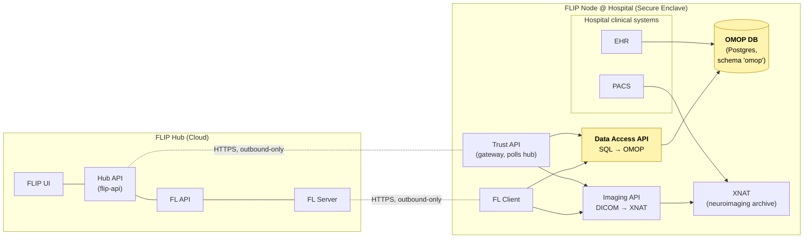
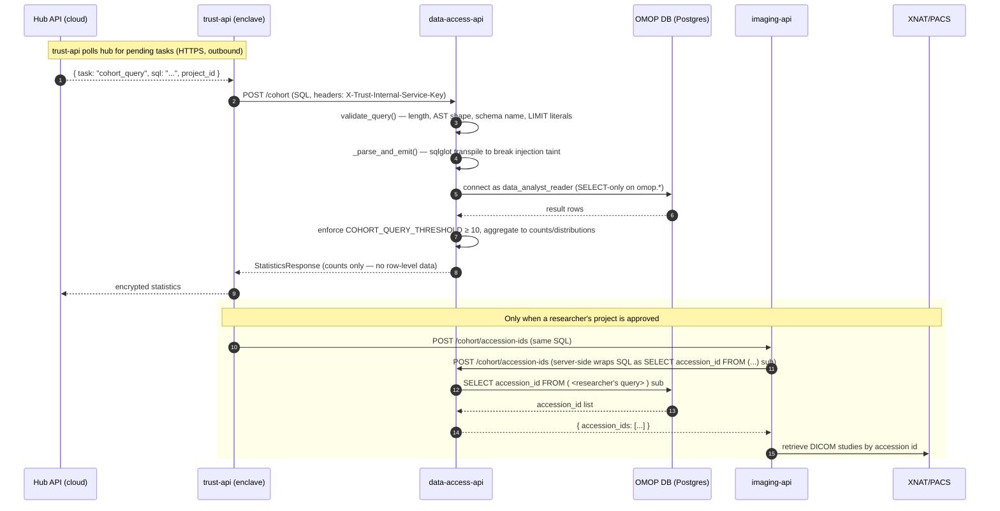
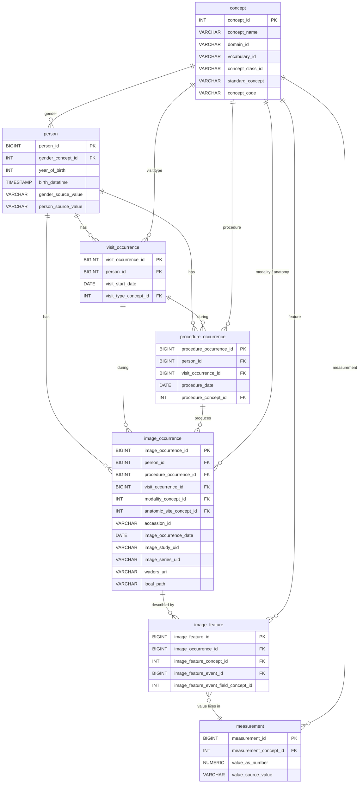
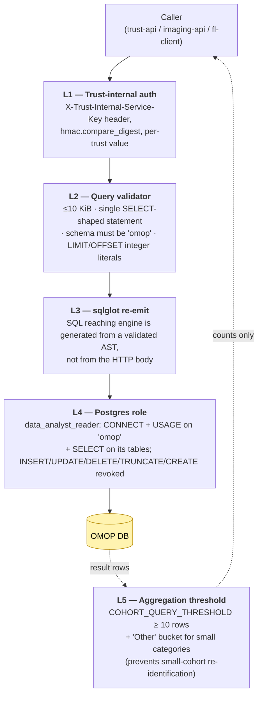

<!--
    Copyright (c) 2026 Guy's and St Thomas' NHS Foundation Trust & King's College London
    Licensed under the Apache License, Version 2.0 (the "License");
    you may not use this file except in compliance with the License.
    You may obtain a copy of the License at
        http://www.apache.org/licenses/LICENSE-2.0
-->


This is an onboarding map for hospitals (Trusts) that want to connect to the **client side** of FLIP.
It explains the structure of the local Postgres database each Trust must run, how the rest of the
FLIP stack talks to it, and what an integrating hospital needs to produce in order to participate
in federated cohort queries and federated learning runs.

> **TL;DR for an integrating hospital.** You host a PostgreSQL database whose schema matches the
> *OHDSI MI-CDM* (OMOP CDM + Medical Imaging extension) tables described in [§4](#4-table-by-table-reference).
> You ETL your EHR + PACS metadata into that schema. The FLIP `data-access-api` container running
> alongside it connects as a read-only role and answers federated SQL cohort queries against the
> `omop` schema. **No row-level data ever leaves your network** — only aggregated counts /
> distributions, or DICOM accession numbers that route DICOM images out via XNAT.

---

## 1. Where the OMOP DB fits in FLIP

The FLIP architecture splits into a cloud-hosted **Central Hub** (FLIP UI, Hub API, FL Server) and
one **FLIP Node** per Trust (the secure enclave). The OMOP database lives entirely inside the
Trust's secure enclave alongside XNAT (DICOM imaging) and the three trust-internal APIs:



**Direction of traffic.** Every cross-boundary connection is initiated *from* the Trust *to* the
Hub (polling). The Hub never opens an inbound connection to a hospital. No port on the hospital
firewall needs to be opened.

**What the OMOP DB does, in one line.** It answers the question *"which patients/studies at this
hospital match a researcher's cohort query?"* without ever shipping raw rows back to the Hub.

---

## 2. Service & container shape

The database itself is a stock PostgreSQL container with a pre-populated data volume.

```yaml
# trust/compose_trust.development.yml (excerpt)
omop-db:
  image: ghcr.io/londonaicentre/omop-db:latest   # built from flip-omop-db repo
  ports:
    - "${OMOP_DB_PORT}:5432"
  environment:
    POSTGRES_USER: ${OMOP_POSTGRES_USER}
    POSTGRES_PASSWORD: ${OMOP_POSTGRES_PASSWORD}
    POSTGRES_DB: ${OMOP_POSTGRES_DB}
  volumes:
    - ./omop-db/volumes/${TRUST_NAME}/db_data:/var/lib/postgresql/data
```

| Property | Value |
|----------|-------|
| Engine | PostgreSQL |
| Image repo | [`londonaicentre/flip-omop-db`](https://github.com/londonaicentre/flip-omop-db) (built into `ghcr.io/londonaicentre/omop-db`) |
| Schema name | `omop` |
| Container service name | `omop-db` (resolves on the per-trust Docker network) |
| Port inside the trust network | `5432` |
| Host port (dev) | `${OMOP_DB_PORT}` (different per trust to avoid collisions) |
| Data volume | `./omop-db/volumes/${TRUST_NAME}/db_data` |
| Dev seed data location | `s3://<aicentre-bucket>/omop/trust{N}_pgdata_<version>.tar.gz` — version pinned in `trust/omop-db/.data_version` |
| Inbound network exposure | **None outside the trust Docker network** — neither imaging-api nor data-access-api is exposed on the host firewall |

The compose file deliberately bind-mounts a pre-built data volume rather than running migrations:
the container assumes the database is already populated. **You don't run `CREATE TABLE` against
the production OMOP DB** — you build (or are shipped) the data volume out of band, with an ETL
pipeline that lives outside this repo.

---

## 3. Read path — how a cohort query reaches the OMOP DB

This is the runtime behaviour your hospital will see when a researcher on the Hub side issues a
federated cohort query. The same flow runs for cohort statistics, accession-id lookups for DICOM
retrieval, and full-dataframe pulls by FL clients.



Where the boundaries are in the code:

| Layer | File | What it does |
|-------|------|--------------|
| Router | `trust/data-access-api/data_access_api/routers/cohort.py` | Three endpoints: `/cohort` (stats), `/cohort/dataframe` (FL clients), `/cohort/accession-ids` (imaging). All gated by `authenticate_internal_service`. |
| Validator | `data_access_api/services/cohort.py::validate_query` | Length cap (10 KiB), `sqlglot.parse`, single-statement, top-level SELECT/UNION/INTERSECT/EXCEPT, schema must be `omop`, `LIMIT`/`OFFSET` must be integer literals. |
| Sanitiser | `data_access_api/routers/cohort.py::_parse_and_emit` | Parses SQL with `sqlglot` and re-emits it before sending to the DB — string reaching the engine is generated from a validated AST, not directly from the HTTP body. |
| DB engine | `data_access_api/db/database.py` | `sqlalchemy.create_engine(postgresql://data_analyst_reader@omop-db:5432/...)` — a single shared engine, no per-request session. |
| Aggregator | `services/cohort.py::get_statistics` | Wraps results in counts + null-counts + sex distribution + age distribution; small categories collapsed into `"Other"`; raises `400` if the cohort has fewer than `COHORT_QUERY_THRESHOLD = 10` rows. |
| Auth | `data_access_api/utils/internal_auth.py` | Constant-time compare (`hmac.compare_digest`) of the per-trust `TRUST_INTERNAL_SERVICE_KEY` header. |

**Where the rows stop.** Researcher-facing endpoints (`/cohort`) never return row-level data —
only aggregated counts. Only `/cohort/accession-ids` and `/cohort/dataframe` are row-shaped, and
they only fire after Hub-side approval; the wrapper `SELECT accession_id FROM (...) sub` for
imaging means no other columns can cross the boundary even by mistake.

---

## 4. Table-by-table reference

FLIP uses **OMOP CDM with the OHDSI Medical Imaging extension (MI-CDM)**. Only the tables below
are required for FLIP cohort queries — full OMOP has dozens more (`condition_occurrence`,
`drug_exposure`, etc.) and an integrating hospital can populate them too, but only the ones below
are exercised by FLIP itself.



### 4.1 `omop.person` — patient demographics

The anchor of the schema. One row per patient.

| Column | Type | Meaning |
|--------|------|---------|
| `person_id` | `BIGINT` PK | Stable internal patient identifier (re-pseudonymised; not the hospital MRN). |
| `gender_concept_id` | FK → `concept.concept_id` | OMOP-standard gender (`8507` = MALE, `8532` = FEMALE). |
| `year_of_birth` | `INT` | Required by OMOP. |
| `birth_datetime` | `TIMESTAMP` | Used by `get_age_distribution` to compute decade buckets. |
| `gender_source_value` | `VARCHAR` | Hospital's raw value (`'M'` / `'F'`). Used by `get_sex_distribution`. |
| `person_source_value` | `VARCHAR` | Hospital's local patient identifier (e.g. pseudonymised MRN). |

### 4.2 `omop.visit_occurrence` — clinical encounters

| Column | Type | Meaning |
|--------|------|---------|
| `visit_occurrence_id` | `BIGINT` PK | Encounter id. |
| `person_id` | FK → `person` | Who was seen. |
| `visit_start_date` | `DATE` | When. |
| `visit_type_concept_id` | FK → `concept` | OMOP "Visit" domain — e.g. `9201001` Hospital inpatient encounter. |

### 4.3 `omop.procedure_occurrence` — procedures performed

| Column | Type | Meaning |
|--------|------|---------|
| `procedure_occurrence_id` | `BIGINT` PK | Procedure id. |
| `person_id` | FK → `person` | Who. |
| `visit_occurrence_id` | FK → `visit_occurrence` | During which encounter. |
| `procedure_date` | `DATE` | When. |
| `procedure_concept_id` | FK → `concept` | The procedure itself, in OMOP "Procedure" domain (e.g. SNOMED codes; in the test fixture, `4002001` = "CT Spleen"). |

### 4.4 `omop.image_occurrence` *(MI-CDM)* — study-level imaging events

This is the central table for FLIP — every imaging study a researcher might want to pull from PACS
has exactly one row here.

| Column | Type | Meaning |
|--------|------|---------|
| `image_occurrence_id` | `BIGINT` PK | Study id (local to OMOP). |
| `person_id` | FK → `person` | Imaged patient. |
| `procedure_occurrence_id` | FK → `procedure_occurrence` | The clinical procedure that ordered the study (nullable — not every image is tied to a procedure row). |
| `visit_occurrence_id` | FK → `visit_occurrence` | Encounter context. |
| `modality_concept_id` | FK → `concept` | DICOM modality concept — e.g. `4013636` CT, `4013634` MR, `4013632` XR. |
| `anatomic_site_concept_id` | FK → `concept` | Body region imaged. |
| `accession_id` | `VARCHAR(50)` | **The DICOM accession number** — primary key used by `imaging-api` to retrieve studies from XNAT / Orthanc / PACS. |
| `image_occurrence_date` | `DATE` | Study date. |
| `image_study_uid` | `VARCHAR(100)` | DICOM Study Instance UID. |
| `image_series_uid` | `VARCHAR(100)` | DICOM Series Instance UID (for series-level rows). |
| `wadors_uri` | `VARCHAR(255)` | Optional WADO-RS URI for direct REST retrieval. |
| `local_path` | `VARCHAR(255)` | Optional on-disk path (filesystem-backed PACS). |

Two columns are load-bearing for the FLIP imaging path:

- **`accession_id`** is what `imaging-api` will ask XNAT for. If your ETL doesn't populate this
  column, FL clients cannot retrieve DICOM images and federated training cannot run.
- **`modality_concept_id` + `anatomic_site_concept_id`** are what most cohort queries filter on
  (e.g. *"all CT scans of the spleen at this trust"*).

### 4.5 `omop.image_feature` + `omop.measurement` *(MI-CDM)* — DICOM scalar attributes

DICOM tags that are scalar values (slice thickness, manufacturer, kVp, ...) ride into OMOP via the
indirection `image_feature → measurement`:

- `image_feature` is a junction row that says *"image X has feature Y, whose value is stored in
  measurement-row M"*.
- The field discriminator is `image_feature_event_field_concept_id = 1147330` (meaning *"the event
  is a measurement row"*).
- `measurement.value_as_number` holds numeric DICOM tags, `measurement.value_source_value` holds
  string ones.

This is exactly the chain `flip-api/tests/example_query.sql` uses to expose **Slice Thickness**
and **Manufacturer** as flat columns:

```sql
SELECT
  MAX(CASE WHEN ifm.image_feature_concept_name = 'Slice Thickness'
           THEN ifm.value_as_number END) AS slice_thickness_mm,
  MAX(CASE WHEN ifm.image_feature_concept_name = 'Manufacturer'
           THEN ifm.value_source_value END) AS manufacturer
FROM image_feature_measurement ifm
GROUP BY ifm.image_occurrence_id
```

If your hospital's PACS export includes DICOM scalar metadata, this is where it lands. If it
doesn't, leave the `image_feature` / `measurement` tables empty — the basic `image_occurrence`-only
queries still work.

### 4.6 `omop.concept` — the OHDSI vocabulary dictionary

All `*_concept_id` columns above are foreign keys into this table.

| Column | Type | Meaning |
|--------|------|---------|
| `concept_id` | `INTEGER` PK | OHDSI numeric concept id. |
| `concept_name` | `VARCHAR(255)` | Human-readable name (`'Computed Tomography'`). |
| `domain_id` | `VARCHAR(20)` | High-level bucket (`'Gender'`, `'Procedure'`, `'Image Type'`, `'Measurement'`, ...). |
| `vocabulary_id` | `VARCHAR(20)` | Source vocabulary (`'SNOMED'`, `'DICOM'`, `'Gender'`, ...). |
| `concept_class_id` | `VARCHAR(20)` | Finer-grained class (`'Modality'`, `'Procedure'`, `'Body Structure'`, ...). |
| `standard_concept` | `VARCHAR(1)` | `'S'` for standard concepts (the only ones FLIP filters on). |
| `concept_code` | `VARCHAR(50)` | The source-system code (e.g. `'CT'`, `'M'`). |

In practice you do **not** invent concept ids — you load the OHDSI Athena vocabulary export
(`CONCEPT.csv`) into this table once during onboarding, and reference its ids from everywhere
else. The MI-CDM modality ids (`4013632`–`4013636`) come from that distribution.

---

## 5. Where the schema is exercised in the repo

These are the canonical reference points if you want to see the schema "in motion":

| Purpose | Path |
|---------|------|
| Integration-test fixture (compact, comment-rich, the easiest read) | `trust/trust-api/tests/integration/fixtures/omop_seed.sql` |
| Realistic researcher query (CTEs over concepts + joins all four imaging-bearing tables) | `flip-api/tests/example_query.sql` |
| Service code that talks to OMOP | `trust/data-access-api/data_access_api/services/cohort.py` |
| Query validator (sqlglot AST checks) | `validate_query()` in the same file |
| Connection / engine | `trust/data-access-api/data_access_api/db/database.py` |
| Container definition | `trust/compose_trust.development.yml` (`omop-db` service) |
| Mock-data sync (dev only) | `trust/omop-db/update_omop_data.sh` |
| Sphinx component doc | `docs/source/components/component-omop-database.rst` |

---

## 6. The security boundary — defence in depth

For an integrating hospital this is the part the IG / InfoSec team will want to see. Five layers
gate every query reaching the OMOP DB:



- **L1** stops anyone else on the trust Docker network — or anyone with an SSM port-forward — from
  posting to `/cohort` directly.
- **L2** stops query-stacking (`SELECT 1; DROP TABLE …`), cross-schema reconnaissance
  (`information_schema`, `pg_catalog`), and the LIMIT-CASE-WHEN blind extraction technique.
- **L3** ensures the string actually executed is whatever `sqlglot` *emits*, so weird encodings or
  comment tricks in the request body don't survive.
- **L4** is the load-bearing one — even if every API check failed, the Postgres role
  `data_analyst_reader` physically cannot write or read outside the `omop` schema.
- **L5** is privacy, not security — even an authorised query is rejected if the cohort is small
  enough that returning counts would risk re-identification.

The two cross-cutting properties:
- **No row-level data on the `/cohort` path.** That endpoint only returns counts, sex/age
  distributions, and column-presence stats.
- **Row-level paths run only after approval and only for the narrow purpose they advertise.**
  `/cohort/accession-ids` is wrapped server-side as `SELECT accession_id FROM (<query>) sub` so it
  *cannot* leak any other column; `/cohort/dataframe` is reachable only by FL-client containers
  using a fresh per-trust key.

---

## 7. What an integrating hospital actually has to deliver

Concretely, to join the FLIP federation on the client side, your team needs:

1. **A populated `omop` schema** matching [§4](#4-table-by-table-reference) — minimally:
   `concept`, `person`, `visit_occurrence`, `procedure_occurrence`, `image_occurrence`. Add
   `image_feature` + `measurement` if you want DICOM scalar attributes (slice thickness,
   manufacturer, etc.) to be queryable.
2. **An ETL pipeline from EHR + PACS into that schema.** This is out of scope for the FLIP repo —
   each hospital builds its own (or uses OHDSI tooling like Usagi / Achilles). Two things must be
   non-negotiable in your ETL:
   - **`person.person_source_value` must be a stable pseudonym**, not the raw MRN.
   - **`image_occurrence.accession_id` must equal the DICOM accession number** that your XNAT /
     PACS instance can resolve. Without that, the imaging path is broken.
3. **A populated DICOM archive (XNAT, Orthanc, or compatible)** indexed by the same
   `accession_id`. `imaging-api` will ask it for studies one accession at a time.
4. **The trust-side Docker stack** — `omop-db`, `data-access-api`, `imaging-api`, `trust-api`,
   `fl-client`, `xnat` — deployed via the trust compose files. Use:
   ```bash
   make up-local-trust        # for an on-prem deployment
   # or, in dev:
   make up-trust-1            # bundled example trust
   ```
5. **A per-trust API key issued by the Central Hub** for trust-api → hub authentication, and a
   per-trust **trust-internal service key** for the trust-internal API mesh (see
   `make generate-trust-internal-service-keys`). The hub never sees the second one.
6. **Network hygiene.** No inbound ports open on the host firewall — trust-api polls the hub
   outbound only. The OMOP DB is reachable only on the trust Docker network.

### What the hospital does **not** have to deliver

- A copy of the OHDSI vocabulary larger than the concepts you actually use — load only the
  concepts your `*_concept_id` columns reference (gender, modality, anatomy, procedures).
- The full OMOP CDM. FLIP only exercises the subset listed in [§4](#4-table-by-table-reference).
  Tables like `condition_occurrence`, `drug_exposure`, `observation_period`, `death`,
  `provider`, `care_site`, `location`, `cdm_source` may be populated if you want — but FLIP's
  cohort queries will not reference them out of the box.
- Schema migrations. You ship the DB as a populated data volume; the FLIP services don't run
  `CREATE TABLE` against your production OMOP.

---

## 8. Worked example — what one researcher query looks like end-to-end

Using the fixture data from `omop_seed.sql` (16 patients, 12 CT studies, 8 MR, 4 XR):

```sql
WITH gender_concept AS (
    SELECT concept_id, concept_name FROM omop.concept
    WHERE concept_name IN ('Male', 'Female')
),
procedure_concept AS (
    SELECT concept_id, concept_name FROM omop.concept
    WHERE domain_id = 'Procedure'
      AND concept_class_id IN ('Procedure', 'Clinical Observation')
      AND standard_concept = 'S'
)
SELECT
    p.person_id,
    p.person_source_value          AS "Patient ID",
    gender_concept.concept_name    AS "Gender",
    io.accession_id,
    io.image_occurrence_date       AS "Image date"
FROM omop.person p
LEFT JOIN omop.visit_occurrence       v  ON v.person_id  = p.person_id
LEFT JOIN omop.procedure_occurrence   pr ON pr.visit_occurrence_id = v.visit_occurrence_id
LEFT JOIN omop.image_occurrence       io ON io.procedure_occurrence_id = pr.procedure_occurrence_id
LEFT JOIN gender_concept ON p.gender_concept_id = gender_concept.concept_id
LEFT JOIN procedure_concept ON pr.procedure_concept_id = procedure_concept.concept_id
WHERE procedure_concept.concept_name = 'CT Spleen';
```

What happens to that query at the Trust:

1. The researcher submits it via FLIP UI → Hub → `trust-api` polls the task.
2. `trust-api` POSTs it to `data-access-api /cohort` with the trust-internal service key.
3. `validate_query` parses it with `sqlglot`, accepts the SELECT, confirms every qualified table
   reference targets `omop`, and confirms there are no non-literal LIMITs.
4. `_parse_and_emit` re-serialises the AST.
5. The re-emitted SQL is executed against Postgres as `data_analyst_reader`.
6. The 6-row result (6 CT Spleen patients in the fixture) is **above** the threshold of 10? — no,
   it's *below* in this toy fixture, so the API would actually 400 with *"Query returned
   insufficient results"*. In a real hospital with thousands of CT Spleen studies, the threshold
   is cleared trivially.
7. The pipeline emits counts + null counts + sex distribution + age distribution back to the Hub,
   encrypted with `AES_KEY_BASE64`.
8. If and only if the project is approved, `imaging-api` issues the same query wrapped as
   `SELECT accession_id FROM (...) sub`, gets the accession list, and pulls DICOMs from XNAT for
   FL training.

---

## 9. Further reading inside this repo

- `docs/source/components/architecture-overview.rst` — FLIP architecture, plain English.
- `docs/source/components/component-omop-database.rst` — the official OMOP page.
- `trust/data-access-api/README.md` — the API that sits in front of the OMOP DB.
- `trust/omop-db/README.md` — operational notes on the mock-data dev workflow.
- `trust/CLAUDE.md` — list of trust-internal services and ports.
- `CLAUDE.md` (root) — the "Trust-internal Service Authentication" section for the threat model.

And outside the repo:

- [OHDSI OMOP CDM v5.4](https://ohdsi.github.io/CommonDataModel/cdm54.html) — the canonical schema reference.
- [OHDSI MI-CDM (Medical Imaging extension)](https://ohdsi.github.io/MedicalImagingCDM/) — `image_occurrence`, `image_feature`.
- [`londonaicentre/flip-omop-db`](https://github.com/londonaicentre/flip-omop-db) — the image build that ships the schema + read-only roles.
