<!--
    Copyright (c) 2026 Guy's and St Thomas' NHS Foundation Trust & King's College London
    Licensed under the Apache License, Version 2.0 (the "License");
    you may not use this file except in compliance with the License.
    You may obtain a copy of the License at
        http://www.apache.org/licenses/LICENSE-2.0
    Unless required by applicable law or agreed to in writing, software
    distributed under the License is distributed on an "AS IS" BASIS,
    WITHOUT WARRANTIES OR CONDITIONS OF ANY KIND, either express or implied.
    See the License for the specific language governing permissions and
    limitations under the License.
-->

# FLIP Architecture and OOP Guide

This guide explains the FLIP monorepo from the top down. It is intentionally written as an onboarding map: start with
the C4-style architecture diagrams, then use the folder map and OOP notes to decide where to read code next.

The current implementation is service-oriented rather than domain-object-heavy. Most "OOP" in the Python services is
made of SQLModel/SQLAlchemy entities, Pydantic request/response schemas, settings objects, and a few external gateway
classes. Business behavior mostly lives in FastAPI router functions and service functions.

## C4 Level 1: System Context

FLIP lets researchers and administrators coordinate federated learning projects across healthcare Trusts without
moving patient-level data out of the local Trust environment.

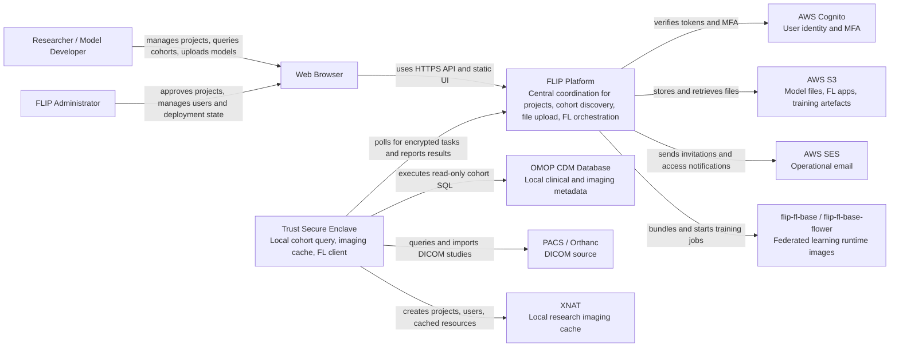

## C4 Level 2: Containers

A bounded context is a part of the system where terms have one agreed meaning. In this repo the strongest context
seams are Project/Cohort, Imaging/XNAT, Federated Training, Identity/Access, and Trust Task Orchestration. These seams
mostly map to deployable services.

```mermaid
flowchart TB
    subgraph Users["Users"]
        browser["Browser"]
    end

    subgraph CentralHub["Central Hub"]
        ui["flip-ui\nVue 3, TypeScript, Pinia"]
        api["flip-api\nFastAPI central API"]
        hubdb["flip-db / RDS PostgreSQL\nHub state"]
        flapi["fl-api-net-N\nFL admin API"]
        flserver["fl-server-net-N\nFL aggregation server"]
        scheduler["APScheduler\nHub background jobs"]
    end

    subgraph AWS["AWS Managed Services"]
        cognito["Cognito"]
        s3["S3 buckets"]
        ses["SES"]
        cloudfront["CloudFront + WAF\nProduction UI and /api routing"]
        alb["ALB\n/api/* to flip-api"]
        nlb["NLB\nFL server TCP"]
    end

    subgraph TrustSite["Each Trust"]
        trustapi["trust-api\nOutbound poller and task dispatcher"]
        dataapi["data-access-api\nOMOP query API"]
        imagingapi["imaging-api\nXNAT/PACS gateway"]
        omop["omop-db\nPostgreSQL OMOP CDM"]
        orthanc["Orthanc\nMock PACS"]
        xnat["XNAT\nImaging cache"]
        flclient["fl-client-net-N\nTrust FL worker"]
        logs["Loki / Alloy / Grafana\nTrust observability"]
    end

    browser -->|"loads static assets"| ui
    browser -->|"calls /api with Cognito access token"| api
    cloudfront -->|"serves UI from S3"| ui
    cloudfront -->|"forwards /api/*"| alb
    alb -->|"targets port 8000"| api

    api -->|"reads and writes hub state"| hubdb
    api -->|"validates access tokens and MFA"| cognito
    api -->|"creates pre-signed URLs, bundles apps, reads results"| s3
    api -->|"sends email notifications"| ses
    api -->|"schedules jobs and recovery loops"| scheduler
    scheduler -->|"runs queued FL jobs and task recovery"| api

    api -->|"starts and monitors training through HTTP"| flapi
    flapi -->|"submits jobs to"| flserver
    flclient -->|"connects during training"| flserver
    nlb -->|"public TCP entrypoint for FL clients"| flserver

    trustapi -->|"polls pending TrustTask records"| api
    trustapi -->|"runs cohort tasks"| dataapi
    trustapi -->|"runs imaging tasks"| imagingapi
    dataapi -->|"read-only SQL"| omop
    imagingapi -->|"queries accession ids when importing"| dataapi
    imagingapi -->|"creates projects, users, imports studies, downloads resources"| xnat
    xnat -->|"DICOM query/retrieve"| orthanc
    flclient -->|"requests dataframes"| dataapi
    flclient -->|"downloads/uploads imaging resources"| imagingapi
    trustapi -->|"emits structured logs"| logs
    dataapi -->|"emits structured logs"| logs
    imagingapi -->|"emits structured logs"| logs
```

Production AWS deployment changes the hosting substrate but not the service responsibilities: `flip-ui` is static S3
content behind CloudFront, `flip-api` and FL services run as ECS Fargate tasks in private subnets, and Trust services run
on a Trust EC2 host or an on-premises host with outbound-only communication.

## C4 Level 3: Main Components

### `flip-api` Central Hub

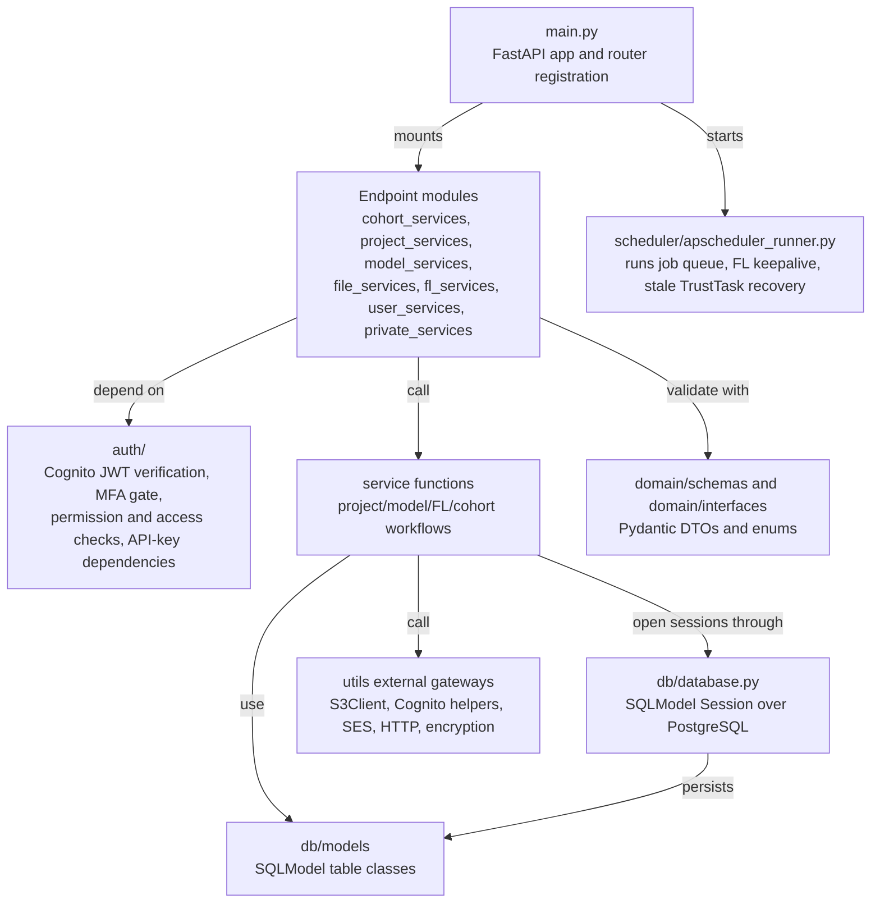

Key code paths:

| Area | Entry points | Main service code | Main data classes |
| --- | --- | --- | --- |
| Projects | `project_services/*.py`, `step_functions_services/approve_project_step_function.py` | `project_services/services/project_services.py`, `project_services/services/image_service.py` | `Projects`, `ProjectTrustIntersect`, `ProjectUserAccess`, `XNATProjectStatus` |
| Cohort queries | `cohort_services/save_cohort_query.py`, `cohort_services/submit_cohort_query.py` | Trust task queue in `submit_cohort_query.py`; aggregation in `private_services/receive_cohort_results.py` | `Queries`, `QueryResult`, `QueryStats`, `TrustTask` |
| Models and files | `model_services/*.py`, `file_services/*.py` | `model_services/services/model_service.py`, `utils/s3_client.py` | `Model`, `UploadedFiles`, `ModelTrustIntersect`, `ModelsAudit` |
| FL jobs | `fl_services/*.py` | `fl_services/services/fl_scheduler_service.py`, `fl_services/services/fl_service.py` | `FLNets`, `FLScheduler`, `FLJob`, `FLMetrics`, `FLLogs` |
| Users and access | `user_services/*.py`, `role_services/get_roles.py` | `auth/access_manager.py`, `auth/auth_utils.py`, `utils/cognito_helpers.py` | `Role`, `Permission`, `UserRole`, `RolePermission`, Cognito user schemas |
| Trust tasks | `private_services/trust_tasks.py`, `trusts_services/start_project_imaging_creation.py` | `private_services/stale_task_recovery.py`, task producer code in service modules | `Trust`, `TrustTask` |

### `trust-api`

`trust-api` is deliberately small. Its public surface is mostly `/health`; its real job is a background polling loop.

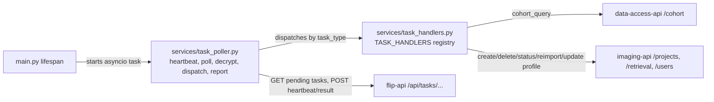

This polling model is central to the security architecture: the hub does not make inbound calls to Trust networks.
Trusts initiate outbound HTTPS/API calls and authenticate to the hub with per-trust API keys.

### `data-access-api`

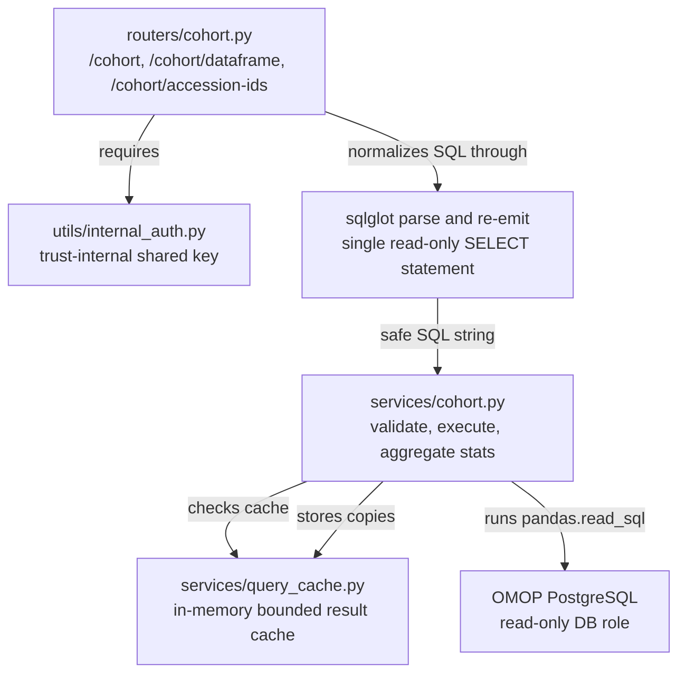

Important guardrails are split across layers: API-level query validation, SQL AST normalization with `sqlglot`, an
OMOP-only schema rule, literal-only `LIMIT`/`OFFSET`, a cohort-size threshold, and the database read-only role.

### `imaging-api`

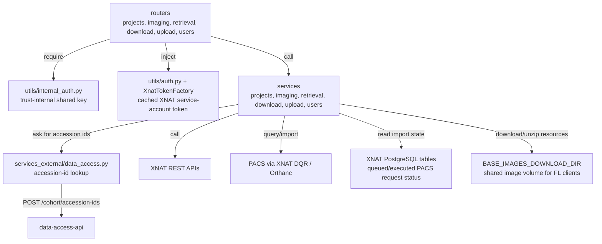

### `flip-ui`

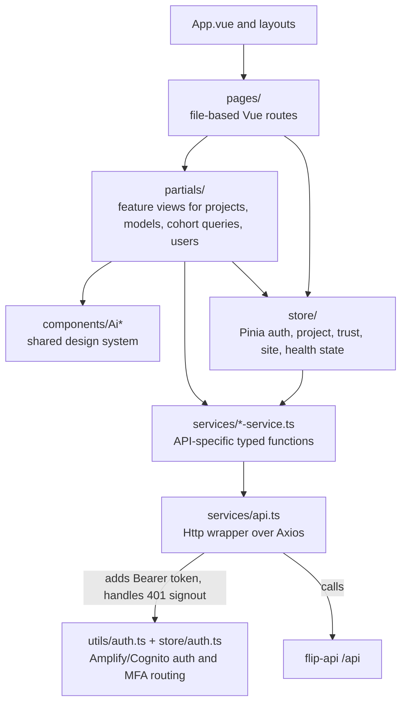

## Repository Structure

| Path | Responsibility |
| --- | --- |
| `flip-api/` | Central Hub API. Contains FastAPI app, hub domain schemas, SQLModel tables, project/cohort/model/file/FL/user service modules, scheduler, and AWS/S3/Cognito helpers. |
| `flip-ui/` | Vue 3 frontend. Pages and layouts are route-oriented; reusable UI lives in `src/components`; feature widgets live in `src/partials`; typed API clients live in `src/services`; Pinia state lives in `src/store`. |
| `trust/trust-api/` | Trust-side outbound polling service. It fetches encrypted tasks from the hub, dispatches to local Trust services, and reports results back. |
| `trust/data-access-api/` | Trust-side OMOP query API. It validates SQL, executes read-only queries, returns cohort statistics/dataframes/accession IDs, and enforces trust-internal authentication. |
| `trust/imaging-api/` | Trust-side imaging gateway. It creates XNAT projects/users, queries PACS through XNAT DQR, tracks imports, downloads resources for FL clients, and uploads derived resources. |
| `trust/omop-db/` | Mock OMOP PostgreSQL service and update scripts used for local/dev Trust environments. |
| `trust/orthanc/` | Mock PACS service for DICOM storage/retrieval. |
| `trust/xnat/` | XNAT stack, nginx/postgres support, and anonymization-related tests. |
| `trust/observability/` | Shared logging middleware plus Loki, Alloy, and Grafana config for Trust services. |
| `deploy/` | Docker Compose entrypoints and FL backend overlays. `compose.development.yml` defines hub services; `compose.*.flower.yml` and `compose.*.nvflare.yml` add FL services. |
| `deploy/providers/AWS/` | Terraform/OpenTofu and Ansible for production/staging AWS: CloudFront, WAF, ALB, NLB, ECS, EFS, RDS, Cognito, SES, S3, VPC endpoints, Trust EC2. |
| `deploy/providers/local/` | Ansible path for on-prem Trust deployment. |
| `docs/` | Sphinx user/admin/deployment documentation. |
| `_docs/` | Agent-oriented architecture and codebase guides. This file lives here. |
| `scripts/` | Root utility scripts for env validation and secret scanning. |

## Dynamic View: Cohort Query

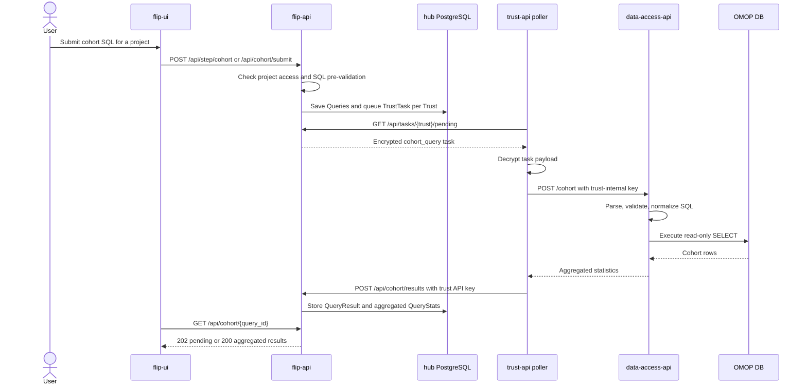

## Dynamic View: Project Approval and Image Import

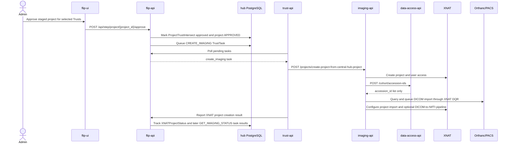

## Dynamic View: Training Start

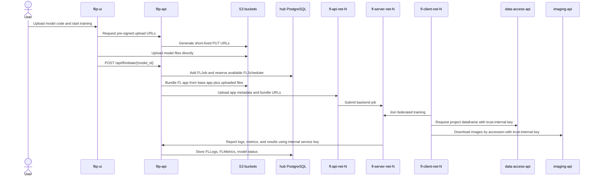

## OOP Architecture

### High-level style

FLIP's backend style is closer to "transaction script plus data classes" than classic rich-domain OOP.

| Layer | Style in this repo | Examples |
| --- | --- | --- |
| API boundary | FastAPI router modules with dependency injection | `flip-api/src/flip_api/project_services/create_project.py`, `trust/data-access-api/data_access_api/routers/cohort.py` |
| Application behavior | Module-level service functions; explicit `Session` parameters; commits/rollbacks inside functions | `project_services/services/project_services.py`, `fl_services/services/fl_scheduler_service.py`, `data_access_api/services/cohort.py` |
| Domain data | SQLModel/SQLAlchemy ORM classes and Pydantic DTOs; little behavior on entities | `db/models/main_models.py`, `domain/schemas/*.py`, `domain/interfaces/*.py` |
| External gateways | Small wrapper classes/functions around SDKs and HTTP clients | `S3Client`, `XnatTokenFactory`, frontend `Http` |
| Configuration | Pydantic `BaseSettings` classes per service | `flip_api.config.Settings`, `trust_api.config.Settings`, `imaging_api.config.Settings`, `data_access_api.config.Settings` |
| Frontend | Composition API plus Pinia stores and typed service functions; one Axios wrapper class | `src/store/auth.ts`, `src/services/api.ts`, `src/services/*-service.ts` |

The practical result: when looking for "where behavior lives", search functions first, not methods. When looking for
"what the system knows", inspect the SQLModel and Pydantic classes.

### Central Hub domain model

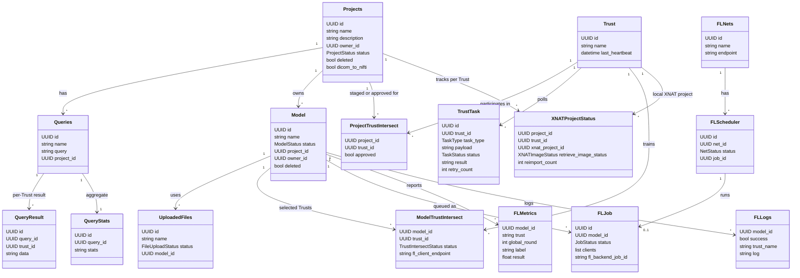

### Identity and authorization model

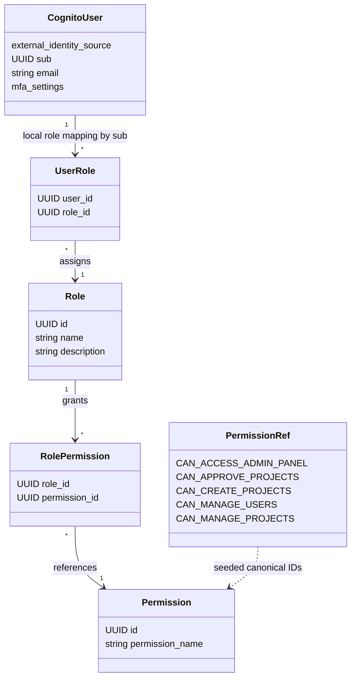

`CognitoUser` is not a local table. The local hub database stores role and permission mappings keyed by the Cognito
`sub` UUID. Request authentication is split into two parts:

- `auth/dependencies.py` verifies Cognito JWTs and enforces the application-layer MFA gate.
- `auth/access_manager.py` and `auth/auth_utils.py` check project/model/query ownership, membership, and role-derived
  permissions.
- `auth/access_manager.py` also contains API-key dependencies for Trust-to-hub and FL-server-to-hub service calls.

### Data transfer objects and entity classes

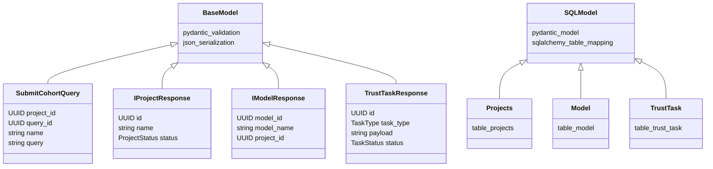

The `domain/interfaces/` naming looks TypeScript-inspired: most classes are Pydantic DTOs used as typed request or
response shapes, not abstract interfaces in the Java/C# sense. `domain/schemas/` contains similar DTOs plus status
enums used across routes and services.

### Gateway and utility classes

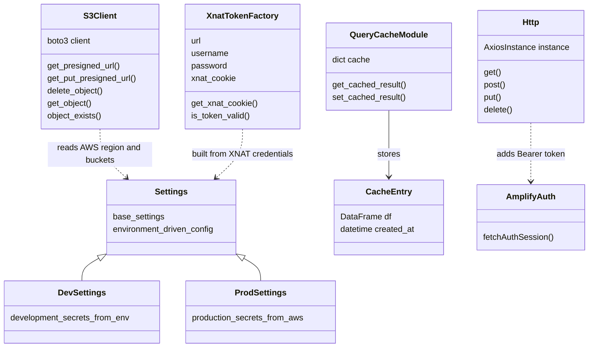

These are the few places where objects wrap behavior:

- `flip-api/src/flip_api/utils/s3_client.py` centralizes S3 SDK calls and avoids logging sensitive pre-signed URLs.
- `trust/imaging-api/imaging_api/utils/xnat_token.py` caches and refreshes the XNAT service-account token.
- `flip-ui/src/services/api.ts` wraps Axios, injects Cognito access tokens, and handles global 401 sign-out behavior.
- `trust/data-access-api/data_access_api/services/query_cache.py` uses a small dataclass for cached DataFrame entries.

## Cross-Service Security Boundaries

| Boundary | Mechanism | Code |
| --- | --- | --- |
| Browser to hub | Cognito access token, verified by JWKS; app-layer TOTP MFA gate | `flip-api/src/flip_api/auth/dependencies.py`, `flip-ui/src/store/auth.ts`, `flip-ui/src/utils/auth.ts` |
| Trust to hub | Per-trust API key header; hub stores SHA-256 hashes and compares in constant time | `flip-api/src/flip_api/auth/access_manager.py`, `trust/trust-api/trust_api/services/task_poller.py` |
| FL server to hub | Internal service key header; used for logs, metrics, status, results | `flip-api/src/flip_api/auth/access_manager.py`, FL server images from sibling repos |
| Trust internal calls | Per-trust shared secret header for trust-api, imaging-api, data-access-api, fl-client | `trust/*/utils/internal_auth.py`, `trust/trust-api/trust_api/services/task_handlers.py` |
| Hub task payloads | AES-encrypted payloads for TrustTask polling | `flip-api/src/flip_api/utils/encryption.py`, `trust/trust-api/trust_api/utils/encryption.py` |
| OMOP query execution | API validation plus read-only DB user and cohort-size threshold | `trust/data-access-api/data_access_api/routers/cohort.py`, `trust/data-access-api/data_access_api/services/cohort.py` |
| File uploads | Short-lived S3 pre-signed URLs; direct browser-to-S3 upload | `flip-api/src/flip_api/file_services/presigned_url_for_upload.py`, `flip-api/src/flip_api/utils/s3_client.py` |

## How to Read the Codebase

1. Start with the runtime boundary.
   - `README.md`
   - `deploy/compose.development.yml`
   - `trust/compose_trust.development.yml`
   - `deploy/compose.development.flower.yml` or `deploy/compose.development.nvflare.yml`

2. Read the Central Hub boot path.
   - `flip-api/src/flip_api/main.py`
   - `flip-api/src/flip_api/config.py`
   - `flip-api/src/flip_api/db/models/main_models.py`
   - `flip-api/src/flip_api/db/models/user_models.py`

3. Follow one workflow end to end.
   - Cohort query: `flip-ui/src/services/cohort-query-service.ts` -> `flip-api/src/flip_api/cohort_services/` ->
     `trust/trust-api/trust_api/services/task_handlers.py` ->
     `trust/data-access-api/data_access_api/routers/cohort.py`
   - Project approval and imaging: `flip-api/src/flip_api/step_functions_services/approve_project_step_function.py` ->
     `flip-api/src/flip_api/trusts_services/start_project_imaging_creation.py` ->
     `trust/imaging-api/imaging_api/routers/projects.py`
   - Training: `flip-api/src/flip_api/fl_services/initiate_training.py` ->
     `flip-api/src/flip_api/fl_services/services/fl_scheduler_service.py` ->
     `flip-api/src/flip_api/fl_services/services/fl_service.py`

4. Read the frontend by feature.
   - API clients: `flip-ui/src/services/`
   - Feature views: `flip-ui/src/partials/`
   - Pages/routes: `flip-ui/src/pages/`
   - Auth state: `flip-ui/src/store/auth.ts`, `flip-ui/src/utils/auth.ts`, `flip-ui/src/services/api.ts`

5. Read tests where behavior is unclear.
   - `flip-api/tests/unit/` and `flip-api/tests/integration/`
   - `trust/*/tests/`
   - `flip-ui/src/**/__tests__/` and `flip-ui/test/cypress/`

## Design Notes and Trade-offs

- The Trust side uses polling instead of inbound hub-to-Trust calls. This is the most important deployment and security
  decision in the current architecture.
- The hub database is the coordination ledger: projects, models, files, FL jobs, Trust heartbeat state, and pending Trust
  tasks all live there.
- Imaging data stays local to each Trust. The hub tracks XNAT project IDs and import state, but image retrieval happens
  inside the Trust through `imaging-api`.
- FL clients do not receive Central Hub credentials. They access local `data-access-api` and `imaging-api` with the
  trust-internal key, and the FL server reports back to the hub with the hub internal service key.
- SQLModel entities are mostly anemic. If future work needs richer domain behavior, introduce it carefully around a
  workflow boundary, not by spreading methods across every table class.
- The service layer currently mixes orchestration, persistence, and external calls in module functions. That keeps the
  code easy to follow for narrow workflows, but large workflows can become harder to test unless dependencies are passed
  in or wrapped behind small gateways.

## Vocabulary

| Term | Meaning in this repo |
| --- | --- |
| Central Hub | Cloud-side coordination plane: UI, `flip-api`, hub DB, S3 artefacts, FL server/admin services. |
| Trust | A participating healthcare institution or local secure environment. In code this is also a `Trust` table row. |
| Secure Enclave | Trust-side runtime boundary containing Trust APIs, OMOP, XNAT, PACS/Orthanc, and FL clients. |
| TrustTask | Hub-side queued command that a Trust polls, decrypts, executes locally, and reports back. |
| FL net | One federated learning network made of central FL API/server plus one client per Trust. |
| XNAT project | Trust-side research imaging cache/project created from an approved hub project. |
| OMOP | Standardized local clinical/imaging metadata database used for cohort discovery. |
| PACS / Orthanc | Clinical imaging source. Orthanc is the local/mock PACS implementation used by the dev stack. |
