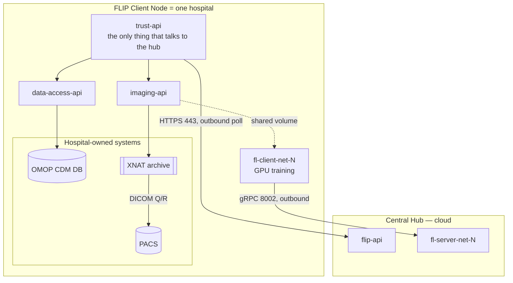
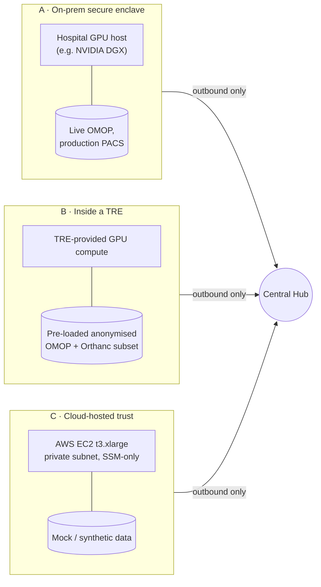
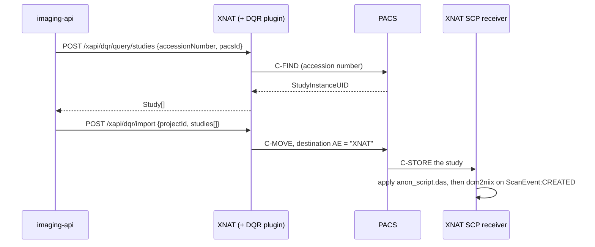
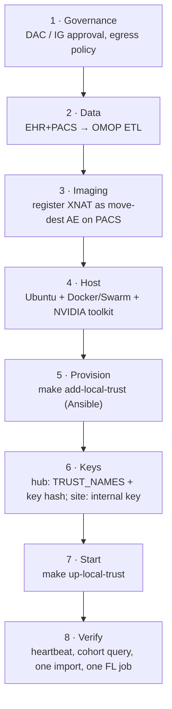

> Source: `github.com/londonaicentre/FLIP` (branch `develop`, commit `b8d91808`) · Date: 2026-09-10 · Mode: Explain · Upstream: Apache-2.0 (Guy's and St Thomas' NHS Foundation Trust & King's College London)
> See also: [System & OOP Architecture](/case-studies/systems/flip/) · [Data Architecture](/case-studies/systems/flip_data_architecture/) · [OMOP Database Deep-Dive](/case-studies/systems/flip-omop-db/)

This document answers one question: **what does a hospital actually have to plug in, and in
what shapes, to run the client side of FLIP?**

---

## 1. Vocabulary — what "Client Node" means here

The codebase and the docs use four names for overlapping things. Getting these straight
first saves a lot of confusion:

| Term used in the repo | What it actually is |
| --- | --- |
| **Trust** | The organisational unit — one participating hospital. It is the unit of authentication (`TRUST_NAME` + `TRUST_API_KEY`), of authorisation (a project is approved *per Trust*), and of data ownership. |
| **FLIP node** / **Secure Enclave** | The deployment — the whole Docker stack running inside the hospital's boundary. Used interchangeably with "Trust" in `docs/source/overview.rst`. |
| **Client Node** | Same thing, viewed from the federation's perspective: a site that holds data and runs training. |
| **`fl-client`** (FLARE client / Flower SuperNode) | **A single container inside** the node — the one that does GPU training. It is *not* the whole node. |

So: **one hospital = one Trust = one FLIP node**, and inside that node sits an `fl-client`
container per FL net the site participates in.

Every arrow crossing the hospital boundary points **outward**. There is no inbound path.

---

## 2. Anatomy of a node — what is real and what is a mock

The trust compose files ship seven services. Three of them are FLIP's own, two are
infrastructure, and **two are stand-ins for systems the hospital already owns**:

| Container | Kind | At a real hospital |
| --- | --- | --- |
| `trust-api` | FLIP | Deployed as-is. Polls the hub, dispatches tasks. |
| `data-access-api` | FLIP | Deployed as-is. Points at *your* OMOP DB. |
| `imaging-api` | FLIP | Deployed as-is. Points at *your* XNAT. |
| `fl-client-net-N` | FLIP (from `flip-fl-base` / `flip-fl-base-flower`) | Deployed as-is. Needs a GPU. |
| `xnat` (web + db + nginx) | Real component | **Keep it.** XNAT is the research imaging cache and the de-identification gate — it is not a mock. |
| `omop-db` | **Mock** (`ghcr.io/londonaicentre/omop-db`) | **Replace** with your own OMOP Postgres. |
| `orthanc` | **Mock PACS** | **Replace** with your production PACS — *or* keep an Orthanc as a staging PACS (see §4.2). |
| `loki` / `alloy` / `grafana` | Infrastructure | Optional but recommended. Logs stay on-site; nothing is shipped to the hub. |

> Note that `trust/compose_trust.production.yml` still declares `omop-db` and `orthanc`.
> Production here means "the FLIP team's staging/production AWS trusts", not "a hospital's
> production estate". Swapping those two out is the integration work.

---

## 3. The three deployment topologies

FLIP supports three ways to place a client node. They differ in *where the node runs* and
*how fresh and how broad the data is* — not in the protocol, which is outbound-only in all
three.

### 3.1 Mode A — On-premises secure enclave *(the primary model)*

The node runs on hospital-owned hardware with live, governed access to the hospital's own
OMOP database and production PACS. This is what `docs/source/overview.rst` calls the secure
enclave, and what `deploy/providers/local/` provisions.

- **Provisioned by** `make add-local-trust` → Ansible playbook `site_local_trust.yml`
  (installs Docker, creates `/opt/flip/`), then the FL participant kit is fetched from S3 to
  `/opt/flip/services/<TRUST_NAME>/{startup,local,transfer}`.
- **Started by** `cd trust && env PROD=<stag|true> make up-local-trust`.
- **Host requirement:** Ubuntu 22.04+, sudo, internet egress, Docker + Swarm + NVIDIA
  Container Toolkit, `/opt/flip` writable.
- **Cohort scope:** the full hospital population — cohort discovery happens *inside* FLIP.
- **Data freshness:** live.

### 3.2 Mode B — Inside a Trusted Research Environment (TRE)

For sites where governance forbids compute against live clinical systems. The TRE is
pre-populated per project, and FLIP runs against that subset.

The workflow splits in two, and **the split is the whole point**:

- **Phase 1 (pre-FLIP, outside FLIP):** the hospital data team estimates cohort size against
  the full EHR, obtains Data Access Committee approval, exports and anonymises (including
  defacing where required, e.g. brain CT), and loads the result into an OMOP Postgres **and**
  a PACS instance inside the TRE — *with consistent pseudonymisation across the two, or the
  `accession_id` join is broken*.
- **Phase 2 (FLIP as normal):** cohort queries run against the pre-scoped subset; XNAT pulls
  from the TRE's internal PACS using the same DICOM Q/R pattern as against a production one.

Additional TRE-specific mechanics:

- **Container images must be side-loaded.** TREs block `ghcr.io`. The documented pattern is
  `docker save` → tarball → TRE file-ingress airlock → `docker load`. A TRE-internal registry
  (Harbor, GitLab) is an acceptable alternative.
- **Egress review.** Federated *evaluation* is TRE-friendly — only aggregate metrics leave,
  which airlock processes are designed to review. Federated *training* requires model weights
  to leave on every global round, and `deploy-flip-node-in-tre.rst` is blunt that **no UK TRE
  currently permits automated weight egress** through standard output checking. Mitigations
  documented there: DP-SGD, secure aggregation (homomorphic, CKKS/TenSEAL), gradient clipping
  — plus a project-specific governance agreement.

💡 **If you deploy into a TRE, decide up front whether the site is doing evaluation only or
training too.** Evaluation is a solved governance problem; training is not, and the answer
changes the DAC submission, not just the config.

### 3.3 Mode C — Cloud-hosted trust (hybrid / dev)

The trust stack runs on an AWS EC2 instance the FLIP team owns (`t3.xlarge`, private subnet,
SSM-only access, no port 22). Used for the reference trusts and for hybrid deployments where
some trusts are cloud and some on-prem. It has no hospital data — it is where the mocks are
genuinely mocks.

### 3.4 Comparison

| Aspect | A · On-prem | B · TRE | C · Cloud EC2 |
| --- | --- | --- | --- |
| OMOP database | Live, hospital-maintained | Pre-loaded anonymised subset | Mock volume |
| PACS | Production PACS (live Q/R) | Orthanc inside the TRE | Mock Orthanc |
| Cohort query scope | Full hospital population | Approved project subset only | Synthetic |
| Cohort discovery | Inside FLIP | **Outside FLIP**, before DAC | n/a |
| Data freshness | Live | Snapshot at load time | n/a |
| Compute | Hospital GPU (DGX etc.) | TRE-provided GPU, possibly on-demand | EC2 |
| Image distribution | `docker pull` from GHCR | Airlock tarballs or internal registry | `docker pull` |
| Network | Outbound HTTPS + gRPC | Outbound HTTPS + gRPC | Outbound HTTPS + gRPC |
| Evaluation egress | Aggregate metrics | Aggregate metrics **+ airlock review** | n/a |
| Training egress | Model weights | Model weights **+ governance approval** | n/a |

---

## 4. The five integration surfaces

Regardless of topology, a hospital integrates along exactly five contracts.

### 4.1 Clinical data surface — OMOP MI-CDM

**Contract:** a PostgreSQL database with a schema named `omop`, holding the OHDSI Common
Data Model plus the Medical Imaging extension (MI-CDM).

Minimum tables FLIP exercises: `concept`, `person`, `visit_occurrence`,
`procedure_occurrence`, `image_occurrence`. Add `image_feature` + `measurement` if you want
DICOM scalar attributes (slice thickness, manufacturer) to be queryable — the example query
in `flip-api/tests/example_query.sql` shows the shape.

Two non-negotiables in the ETL:

1. `person.person_source_value` must be a **stable pseudonym**, never a raw MRN.
2. `image_occurrence.accession_id` must be **exactly the DICOM accession number your PACS
   can resolve**. This is the only join between clinical and imaging data in the entire
   platform. Get it wrong and cohort queries still work while the imaging path silently
   returns nothing.

FLIP connects as a dedicated read-only Postgres role (`data_analyst_reader` by default) with
`SELECT` granted on `omop` and `INSERT`/`UPDATE`/`DELETE`/`TRUNCATE`/`CREATE` revoked. FLIP
never runs DDL against your OMOP — you ship it as a populated database, not as migrations.

Table-level detail lives in [flip-omop-db-architecture.md §4](/case-studies/systems/flip-omop-db/).

💡 **Building the EHR → OMOP ETL is the single largest piece of hospital-side work, and it
is entirely outside this repo.** Budget for it as its own project (OHDSI tooling: Usagi,
Achilles, White Rabbit), not as a FLIP configuration task.

### 4.2 Imaging surface — PACS via XNAT DQR

FLIP never speaks DICOM itself. **XNAT does, through its DICOM Query/Retrieve (DQR)
plugin**, and `imaging-api` drives XNAT over REST. The chain:

**What the hospital must configure on its PACS:**

| Item | Where it is set in FLIP | What the hospital does |
| --- | --- | --- |
| PACS AE title, host, Q/R port | `POST /xapi/pacs` in `trust/xnat/xnat/config/configure-xnat.sh` (mock uses AE `ORTHANC`, host `orthanc`, port `PACS_DICOM_PORT=4242`) | Register the real PACS AE/host/port here |
| Calling AE | DQR setting `dqrCallingAe: "XNAT"` | Whitelist this calling AE on the PACS |
| Destination AE for C-MOVE | SCP receiver `aeTitle: "XNAT"`, `port: XNAT_PORT` (8104) | **Register XNAT as a destination/move-target AE on the PACS** — this is the step most often missed |
| PACS id used by FLIP | `PACS_ID` env var (default `1`) | Match the id XNAT assigns to the registered PACS |
| Availability windows | `POST /xapi/pacs/1/availability` per weekday, `threads`, `utilizationPercent` | Throttle retrievals to off-peak if the PACS is clinically loaded |

**Three viable imaging patterns**, in increasing distance from production:

1. **Direct to production PACS.** XNAT queries and retrieves straight from the clinical PACS.
   Lowest latency to data, highest coupling to a clinical system — needs an availability
   schedule and PACS-team sign-off.
2. **Staging PACS in front (recommended for most sites).** An Orthanc (or similar) receives a
   scheduled or on-demand feed from the production PACS; XNAT queries the staging node. This
   is the shape the repo already ships, and it decouples FLIP entirely from clinical
   infrastructure. It is also exactly the TRE pattern.
3. **Pre-loaded archive (TRE mode).** DICOM is exported once through the site SOP and loaded
   into a PACS inside the boundary. No live path to clinical systems at all.

**De-identification is FLIP's, not yours.** XNAT applies the site-wide
`anon_script.das` on ingest (`anonymizationEnabled: true` on the SCP receiver): it strips
patient birth date/address/telephone/other IDs, institution name/address/department,
referring/performing/requesting physicians, the accession number tag and medical record
locator; hashes Study/Series/SOP UIDs for repeatable pseudonymisation; and sets
*Patient Identity Removed* + *De-identification Method*. There is a test pack at
`trust/xnat/tests/` that applies the rules to a synthetic PHI-laden study and asserts the
result is clean — extend `PHI_TAGS_REQUIRED` if your site needs more coverage.

💡 **Review `anon_script.das` against your own DPO's tag list before go-live.** It is a good
default, not a jurisdictional guarantee — private tags and burned-in pixel PHI are not
covered by it.

**Format conversion.** DICOM→NIfTI runs via the XNAT Container Service `dcm2niix` command,
triggered by a **per-project** Event Service subscription on `ScanEvent:CREATED`. It is
controlled by the project's `dicom_to_nifti` flag, so a project can opt out and still trigger
conversion manually from the XNAT UI.

### 4.3 Network surface — outbound only

**Two egress destinations, nothing else, and no inbound rules at all:**

| Destination | Protocol / port | Used by |
| --- | --- | --- |
| Central Hub API (e.g. `https://app.flip.aicentre.co.uk`) | HTTPS 443 | `trust-api` poll + heartbeat + result push |
| FL server (e.g. `fl.flip.aicentre.co.uk:8002`) | gRPC over TCP (`FL_SERVER_PORT`, default 8002) | `fl-client` |

Plus, at install time only: container registry (GHCR) and OS package mirrors — both
replaceable with an internal registry or airlock in a locked-down environment.

Design consequences worth stating to a hospital network team:

- **No inbound firewall rules, no NAT port-forwarding, no VPN.** The hub never initiates a
  connection to the site. `trust-api` polls `GET /api/tasks/{trust}/pending` every
  `POLL_INTERVAL_SECONDS` (default 5) and posts a heartbeat on the same cycle.
- **The FL channel is also client-pull.** In FLARE the client sends `GET_TASK` /
  `SUBMIT_RESULT`; in Flower the SuperNode is a gRPC *client* dialling the SuperLink.
  SuperNodes accept no incoming connections.
- **If HTTP/2 is blocked** by a network inspection appliance (a real TRE problem), both FL
  frameworks offer HTTP/1.1 REST transport fallbacks.
- **In the cloud-trust and hybrid models**, the FL server's NLB security group allowlists the
  node's public IP — so a site on a dynamic IP has to update it
  (`TF_VAR_local_trust_public_ip=<new-ip> make -C deploy/providers/AWS plan apply`).
- **Nothing is published on the host.** `compose_trust.local.yml` overrides `ports` to `[]`
  for `imaging-api`, `data-access-api` and `trust-api` — they exist only on the internal
  Docker network. On cloud trusts the ports are bound but the security group blocks all
  inbound; access is via SSM port-forward only.

### 4.4 Compute surface

| Requirement | Detail |
| --- | --- |
| OS | Ubuntu 22.04+ (Ansible playbook targets this) |
| Docker | Engine ≥ 24.0, Compose ≥ 2.40 |
| Docker Swarm | Required — the XNAT stack deploys as a Swarm stack for overlay networking, resource limits and restart policies |
| GPU | ≥ 1 NVIDIA GPU + NVIDIA Container Toolkit; `fl-client` runs with `gpus: all` and `shm_size: 32gb` |
| GPU declaration | `NUM_AVAILABLE_GPUS`, `MEMORY_PER_GPU_IN_GIB` env vars |
| Other | Python 3.12+, `postgresql-client`, Make, `/opt/flip` writable |

A useful property for constrained sites: **only `fl-client` needs the GPU.** `trust-api`,
`data-access-api`, `imaging-api` and XNAT are CPU-only, so a TRE or cloud site can hold GPU
capacity only while jobs run and keep the rest of the node always-on.

XNAT's Container Service launches host containers via the mounted Docker socket, which has
two consequences worth planning for: XNAT data directories **must be bind mounts, not named
volumes** (host-spawned containers resolve host paths), and Swarm resource limits on
`xnat-web`/`xnat-db` are load-bearing — a large import can fan out enough concurrent
`dcm2niix` containers to starve XNAT itself.

### 4.5 Identity & secrets surface

Four distinct credentials, deliberately separated:

| Credential | Scope | Who holds it | Notes |
| --- | --- | --- | --- |
| `TRUST_API_KEY` | Node → hub | The node; hub stores only the SHA-256 hash in `TRUST_API_KEY_HASHES` | **The hub identifies a trust by key, not by IP or hostname** — any host with the key *is* that trust. Verified with `hmac.compare_digest`. |
| `AES_KEY_BASE64` | Hub ↔ all nodes | Shared symmetric key | AES-256-CBC over task payloads and project IDs, on top of TLS. Not per-trust. |
| `TRUST_INTERNAL_SERVICE_KEY` | Inside one node | Every trust-internal container | **Never sent to the hub.** Required on every call to `imaging-api` and `data-access-api` (all routers except `/health`). Per-trust, so a leak at one site cannot drive another's APIs. Generate with `make generate-trust-internal-service-keys`. |
| `INTERNAL_SERVICE_KEY` | fl-server → flip-api, on the hub | Central Hub only | Unrelated to the node. Note that `FLIP_API_INTERNAL_URL` must be the Docker-network URL, not CloudFront — CloudFront strips the header at the edge. |

**FL clients hold no Central Hub credentials at all** — that is stated as an explicit
invariant in the compose files. A training container can reach its site's own imaging and
data APIs and the FL server; it cannot reach the hub API.

**Researcher identity is federated one-way.** Hub users live in AWS Cognito. On project
approval, `imaging-api` creates a *local XNAT account* at each participating Trust and the
credentials are emailed to the user; enable/disable changes propagate hub → node as
`update_user_profile` tasks. Researchers must be on the hospital's network to reach that
XNAT UI for data enrichment.

💡 **Cognito is the hub's identity provider and is not pluggable in this codebase.** A site
that requires its own IdP (hospital AD / OIDC SSO) for FLIP *users* is looking at hub-side
work, not node-side configuration. Node-to-hub authentication is unaffected — it is API-key
based and needs no IdP.

---

## 5. What the hospital must deliver — checklist

1. **A populated `omop` schema** matching the MI-CDM subset, with a stable pseudonymous
   `person_source_value` and a PACS-resolvable `image_occurrence.accession_id`.
2. **An ETL pipeline** from EHR + PACS index into that schema, with an agreed refresh cadence.
3. **A DICOM source reachable by DICOM Q/R** — production PACS, staging Orthanc, or a
   pre-loaded TRE archive — with FLIP's XNAT registered as a **move destination AE**.
4. **A host** meeting §4.4 (Ubuntu, Docker + Swarm, ≥1 NVIDIA GPU, `/opt/flip`).
5. **Outbound network permission** to exactly two endpoints (§4.3).
6. **Credentials**: a per-trust API key issued by the hub, plus a per-trust internal service
   key generated locally and never shared upward.
7. **A local governance decision** on what may leave: aggregate metrics only (evaluation), or
   model weights too (training).

### What the hospital does *not* have to deliver

- Any inbound network access, VPN, port-forward or static IP whitelisting for the hub.
- A full OMOP CDM — only the subset in §4.1 is exercised. `condition_occurrence`,
  `drug_exposure`, `death`, `provider`, `care_site` and friends can stay empty.
- The full OHDSI vocabulary — only the concepts your `*_concept_id` columns actually
  reference.
- Schema migrations for OMOP — FLIP runs no DDL against it.
- De-identification tooling — XNAT does it on ingest (but see the 💡 in §4.2).
- Any patient-level data leaving the site, in any mode.

---

## 6. Onboarding sequence

Hub-side prerequisites before step 7 will work at all: the trust's name must be in
`TRUST_NAMES`, its key hash in `TRUST_API_KEY_HASHES`, and the hub redeployed
(`make deploy-centralhub`) so the new secrets load. The `full-deploy-hybrid` wrapper does all
three automatically; `add-local-trust` on its own assumes they are already done.

**Verification order matters** — each step exercises one more surface:

| Check | Proves |
| --- | --- |
| `docker logs -f trust-api` shows successful polls | Network + trust API key + hub registration |
| A cohort query returns statistics | OMOP schema + read-only role + query validation |
| `GET /imaging/ping_pacs/{pacs_id}` succeeds | PACS registration, AE titles, availability window |
| One study imports into XNAT | C-FIND + C-MOVE + SCP receiver + anonymisation |
| One FL job completes a round | GPU, FL certs, gRPC egress, shared images volume |

---

## 7. Where the current design will bite a new site

Honest limitations, from the code rather than the brochure:

1. **`accession_id` is the only clinical↔imaging join, and it is not validated end-to-end.**
   If the ETL writes an accession format the PACS cannot resolve, cohort queries succeed and
   imports silently return zero studies. There is no reconciliation report.
2. **Multiple studies per accession number are not handled.** `retrieval.py` logs a warning
   and takes the first — with explicit `TODO`s. Sites where one accession spans several
   studies will lose data quietly.
3. **The shared images volume has no eviction policy.** Downloads accumulate under
   `${BASE_IMAGES_DOWNLOAD_DIR}/<net_id>/` indefinitely. On a long-lived node this is the
   most likely disk-exhaustion path.
4. **`AES_KEY_BASE64` is shared by the hub and every trust**, not per-trust, so it is a
   federation-wide secret. The per-trust separation exists for the API key and the internal
   service key, not for payload encryption.
5. **One `trust-api` replica per trust is assumed.** The pending-task query deliberately
   omits `FOR UPDATE SKIP LOCKED` (documented in a comment), so running two pollers for the
   same trust would execute tasks twice.
6. **The cohort result cache has a 60-day TTL.** A repeated query can return a stale answer
   after the OMOP data has been refreshed; there is no cache-invalidation hook on ETL.
7. **Cognito is not pluggable** for hub users (see §4.5 💡).
8. **Training-weight egress is an unsolved governance problem in TREs**, not a solved one
   with a config flag (§3.2).
9. **The default poll interval sits exactly on the hub's rate limit.**
   `POLL_INTERVAL_SECONDS=5` produces 12 calls/minute to each of `/tasks/{trust}/pending`
   and `/trust/{trust}/heartbeat`, and both are capped at `12/minute` per trust. There is no
   headroom for a retry or clock skew before a 429 — raise the interval if a site sees them.

---

## 8. Reference — the files that define each surface

| Surface | Authoritative files |
| --- | --- |
| Node ↔ hub protocol | `trust/trust-api/trust_api/services/task_poller.py`, `.../task_handlers.py`, `flip-api/src/flip_api/private_services/trust_tasks.py` |
| OMOP contract | `trust/data-access-api/data_access_api/{routers/cohort.py,services/cohort.py,config.py}`, `trust/trust-api/tests/integration/fixtures/omop_seed.sql`, `flip-api/tests/example_query.sql` |
| PACS / XNAT contract | `trust/imaging-api/imaging_api/services/{imaging,retrieval,download,projects}.py`, `trust/xnat/xnat/config/configure-xnat.sh`, `trust/xnat/xnat/config/anon_script.das` |
| Topology & provisioning | `deploy/providers/local/{README.md,site_local_trust.yml}`, `deploy/providers/AWS/`, `trust/compose_trust.*.yml` |
| Narrative docs | `docs/source/deploy-flip/deploy-flip-node-on-prem.rst`, `docs/source/deploy-flip/deploy-flip-node-in-tre.rst`, `docs/source/components/component-xnat.rst`, `docs/source/components/component-fl-nodes.rst` |
| Auth model | `flip-api/src/flip_api/auth/access_manager.py`, `trust/*/utils/internal_auth.py`, `CLAUDE.md` § *Trust-internal Service Authentication* |
