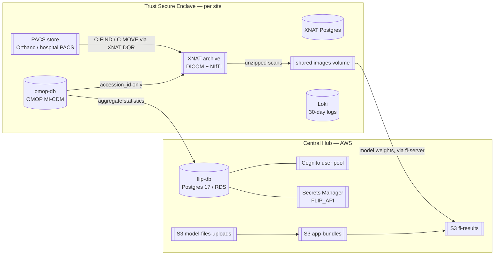
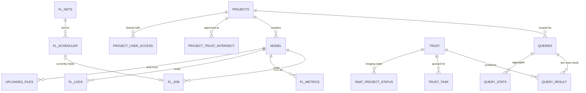
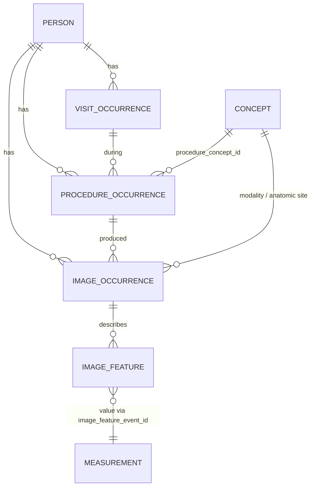
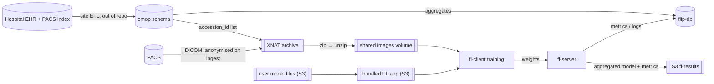
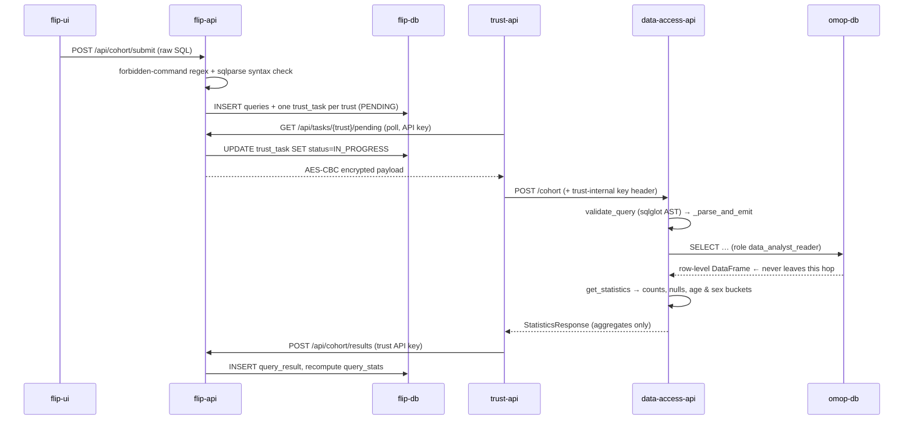

> Source: `github.com/londonaicentre/FLIP` (branch `develop`, commit `b8d91808`) · Date: 2026-09-10 · Mode: Explain · Data system: **Hybrid** (OLTP app DB + clinical CDM read store + blob/object lake + ML-run provenance) · Upstream: Apache-2.0 (Guy's and St Thomas' NHS Foundation Trust & King's College London)
> See also: [System & OOP Architecture](/case-studies/systems/flip/) · [OMOP Database Deep-Dive](/case-studies/systems/flip-omop-db/) · [Client Node ↔ Hospital Integration](/case-studies/systems/flip_client_node_integration/)

---

## 1. Overview

FLIP manages three physically separated classes of data, and the separation *is* the
architecture:

1. **Coordination state** (cloud) — projects, models, FL jobs, task queue, cohort
   *statistics*. Never patient-level.
2. **Clinical + imaging data** (inside each Trust) — an OMOP CDM Postgres database and a
   DICOM archive. Never leaves the Trust network.
3. **Artefacts** (cloud object storage) — user-uploaded training code, bundled FL apps,
   aggregated model weights and metrics.

The privacy model is a *data-gravity* model: the algorithm travels to the data, and only
aggregates, accession numbers (within the Trust) and model weights travel back.

**Data-system classification — Hybrid**, with the evidence:

| Sub-type | Evidence |
| --- | --- |
| OLTP app DB | SQLModel table classes in `flip-api/src/flip_api/db/models/{main_models,user_models}.py`; Postgres 17 (`deploy/compose.development.yml`, RDS in `deploy/providers/AWS/services.tf`) |
| Clinical CDM read store | `omop` schema, read-only role `data_analyst_reader` (`trust/data-access-api/data_access_api/config.py`, `.env.development.example:155`); fixture `trust/trust-api/tests/integration/fixtures/omop_seed.sql` |
| Blob / object lake | Five `*_BUCKET` settings in `flip-api/src/flip_api/config.py`; XNAT archive + Orthanc storage bind mounts in the trust compose files |
| ML-run provenance | `FLJob`, `FLMetrics`, `FLLogs`, `ModelsAudit`, `ProjectsAudit`, `XNATProjectStatus` |

**Tech:** PostgreSQL 17 (hub + OMOP + XNAT), SQLModel/SQLAlchemy + psycopg2 (hub),
SQLAlchemy + `pandas.read_sql` (data-access-api), asyncpg (imaging-api → XNAT DB), boto3 →
S3, AWS Cognito, AWS Secrets Manager, Grafana Loki (logs), plain filesystem volumes for
DICOM/NIfTI.

---

## 2. Data Landscape

Every store the system reads or writes, and which side of the trust boundary it sits on.



`xdb` (XNAT Postgres) and `loki` have no edge crossing the boundary by design: import status is
read Trust-side only, and logs never leave the site at all. **Only two arrows cross from Trust to
Cloud in the whole platform** — aggregate cohort statistics, and model weights.

| Store | Engine / Kind | Holds | Written by | Read by |
| --- | --- | --- | --- | --- |
| `flip-db` | Postgres 17 (RDS in prod) | Projects, models, FL jobs/metrics/logs, trusts, `trust_task` queue, cohort queries + stats, roles/permissions, audit | `flip-api` | `flip-api` |
| Cognito user pool | AWS managed | User identity, email, MFA/TOTP enrolment | Cognito / `flip-api` admin calls | `flip-api`, `flip-ui` |
| Secrets Manager `FLIP_API` | AWS managed | `aes_key`, DB password, `trust_api_key_hashes`, internal-service key hash (prod only) | Terraform / operators | `flip-api` (`utils/get_secrets.py`) |
| S3 `…-model-files-uploads` | Object store | User-uploaded model/training files under `uploaded/<model_id>/` | Browser via pre-signed PUT | `flip-api`, FL bundler |
| S3 `…-fl-results` | Object store | Federated results under `results/<model_id>` | `fl-server` | `flip-api` → pre-signed GET |
| S3 `…-app-bundles` | Object store | `base-application/<backend>/` static job-type files; `app_destinations/<model_id>` bundled apps | `flip-api` bundler, FL server | `fl-api`, `fl-server` |
| S3 `…-ui` + CloudFront | Object store | Static `flip-ui` build | `make deploy-ui` | Browsers |
| S3 artifacts bucket | Object store | XNAT WAR + plugin JARs | CI | XNAT image build |
| `omop-db` | Postgres, schema `omop` | OMOP CDM + MI-CDM imaging extension — the clinical system of record for cohorts | Hospital ETL (out of repo scope) | `data-access-api` (read-only role) |
| XNAT Postgres | Postgres | XNAT data model + DQR queues (`xhbm_queued_pacs_request`, `xhbm_executed_pacs_request`, `xhbm_direct_archive_session`) | XNAT | XNAT, `imaging-api` (read-only, async) |
| XNAT archive | Host filesystem (bind mount) | Anonymised DICOM + derived NIfTI, keyed project/subject/experiment | XNAT SCP receiver, `imaging-api` upload | XNAT, `imaging-api` download |
| PACS store | Orthanc `/var/lib/orthanc/db` (mock) or hospital PACS | Source DICOM studies | Hospital modalities | XNAT DQR |
| Shared images volume | Bind mount `${BASE_IMAGES_DOWNLOAD_DIR}` → `/app/data/images` | `<net_id>/<accession_id>/…` unzipped scans for training | `imaging-api` | `fl-client` |
| Query cache | In-process dict (`services/query_cache.py`) | Cohort DataFrames, TTL 60 d, ≤64 entries, ≤50 000 rows | `data-access-api` | `data-access-api` |
| Loki | TSDB on filesystem | Container logs, `retention_period: 720h` | Alloy (Docker socket) | Grafana |

> The two *mocks* — `trust/orthanc` and `trust/omop-db` (image `ghcr.io/londonaicentre/omop-db`)
> — are stand-ins for hospital systems. They are present in **both** the development and
> production trust compose files; a real site swaps them for its own PACS and OMOP instance.

---

## 3. Data Models / Schema

### 3.1 Hub — conceptual view



### 3.2 Hub — physical detail for the load-bearing tables

Source: `flip-api/src/flip_api/db/models/main_models.py`. All PKs are `UUID` with
`default_factory=uuid4` unless stated.

| Table | Key columns | Notes |
| --- | --- | --- |
| `projects` | `id` PK, `owner_id`, `status`, `deleted`, `dicom_to_nifti` | `status ∈ UNSTAGED / STAGED / APPROVED`. `owner_id` is a Cognito `sub` — **no FK** (Cognito is the user SoR). `deleted` is a soft-delete flag. |
| `trust` | `id` PK, `name`, `last_heartbeat` | `last_heartbeat` written by `POST /trust/{name}/heartbeat`; staleness threshold `HEARTBEAT_TIMEOUT_SECONDS=30`. |
| `trust_task` | `id` PK, `trust_id` FK **indexed**, `task_type`, `payload`, `status`, `result`, `retry_count`, `created_at`, `updated_at` | The durable outbound work queue. `payload`/`result` are JSON *strings*, not JSONB. `payload` is AES-encrypted only in transit, not at rest. |
| `queries` | `id` PK, `project_id` FK, `query` (raw SQL), `created` | The researcher's cohort SQL, stored verbatim and replayed at every Trust. |
| `query_result` | `id` PK, `query_id` FK, `trust_id` FK, `data` | One row per (query, trust); `data` is a JSON string of that Trust's aggregate stats. |
| `query_stats` | `id` PK, `query_id` FK, `stats` | Cross-trust aggregate, assembled in `private_services/receive_cohort_results.py`. |
| `model` | `id` PK, `project_id` FK, `owner_id`, `status`, `deleted` | `status ∈ PENDING → INITIATED → PREPARED → TRAINING_STARTED → RESULTS_UPLOADED` (or `ERROR`/`STOPPED`). |
| `fl_nets` / `fl_scheduler` / `fl_job` | `fl_scheduler.net_id` FK, `fl_scheduler.job_id` FK, `fl_job.model_id` FK | A "net" is one federation (server + API + one client per Trust). `fl_scheduler.status ∈ AVAILABLE / BUSY` is the concurrency lock. `fl_job.clients` is a JSON column. |
| `fl_metrics` | `model_id` FK, `trust`, `global_round`, `label`, `result` (float) | Per-round, per-trust training metrics pushed by the FL server. |
| `fl_logs` | `model_id` FK, `trust_name`, `success`, `log` | Free-text FL run log lines. |
| `uploaded_files` | `id` PK, `model_id` FK, `name`, `status`, `size`, `type`, `tag` | Metadata only — bytes live in S3. |
| `xnat_project_status` | `project_id` FK, `trust_id` FK, `xnat_project_id`, `retrieve_image_status`, `last_reimport`, `reimport_count` | Mirrors per-Trust XNAT import progress on the hub. `MAX_REIMPORT_COUNT=5`. |
| `user_role` / `roles` / `permission` / `role_permission` | composite PK `(user_id, role_id)` on `user_role` | `user_id` is a Cognito `sub` with a deliberate no-FK comment in `user_models.py`. Roles: `ADMIN`, `RESEARCHER`, `OBSERVER` with fixed seed UUIDs. |
| `projects_audit` / `models_audit` / `users_audit` | `action`, `user_id`, `audit_date` | Append-only audit trails. |
| `site_banner` / `site_config` | `site_config.key` PK **indexed**, `value` bool | Operational feature flags / banner. |

### 3.3 Trust — OMOP MI-CDM (conceptual)

The physical schema is documented table-by-table in
[flip-omop-db-architecture.md §4](/case-studies/systems/flip-omop-db/). Conceptually:



**The single most load-bearing column in the whole platform is
`omop.image_occurrence.accession_id`.** It is the only join key between the clinical world
(OMOP) and the imaging world (PACS/XNAT), and the only column `imaging-api` is allowed to
read out of a cohort (see §4.2).

### 3.4 Trust — XNAT

Two shapes matter to FLIP:

- **The XNAT object model** — Project → Subject → Experiment (labelled with the accession
  number) → Scan → Resource (`DICOM`, `NIFTI`). This is what `imaging-api` walks when
  building a download URL (`services/download.py::format_download_url`).
- **Three DQR bookkeeping tables**, mapped read-only in
  `trust/imaging-api/imaging_api/db/models.py`:

  | Table | Columns FLIP reads | Meaning |
  | --- | --- | --- |
  | `xhbm_queued_pacs_request` | `accession_number`, `status`, `xnat_project` | Retrieval queued, not yet sent |
  | `xhbm_executed_pacs_request` | `accession_number`, `status`, `xnat_project` | Retrieval sent to PACS, in flight |
  | `xhbm_direct_archive_session` | `folder_name`, `status`, `project` | Session landing in the archive |

  `get_import_status` diffs these three against the cohort's accession list and the XNAT
  experiment labels to produce `successful / processing / queued / failed / queue_failed`.

---

## 4. Dataflow & Lineage

### 4.1 The three pipelines



### 4.2 Traced lineage — one cohort query, end to end

This is the path that decides what is allowed to cross the trust boundary.



**The disclosure controls on that path, in order:**

| Control | Where | Effect |
| --- | --- | --- |
| Forbidden-command regex + `sqlparse` | `cohort_services/submit_cohort_query.py` | Cheap hub-side reject |
| `MAX_QUERY_LENGTH = 10_240` | `services/cohort.py` | Parser DoS guard |
| Single-statement, SELECT-shaped AST | `validate_query` (sqlglot) | No stacking, no DDL/DML/`COPY` |
| `ALLOWED_SCHEMA = "omop"` | `validate_query` | Blocks `pg_catalog` / `information_schema` enumeration |
| Literal-only `LIMIT`/`OFFSET` | `validate_query` | Defeats `LIMIT CASE WHEN …` blind extraction |
| Parse-then-re-emit | `_parse_and_emit` | Breaks the injection taint chain before the engine |
| Postgres role `data_analyst_reader` | OMOP DB image | `SELECT` only; DDL/DML revoked |
| `COHORT_QUERY_THRESHOLD = 10` | `receive_cohort_query`, `get_statistics` | Small cohorts return no statistics at all |
| `verify_cardinality`, `make_other_category` | `services/cohort.py` | Low-count buckets collapse into `Other` |
| Server-side projection to `accession_id` | `routers/cohort.py::get_accession_ids` | The imaging path sees **only** accession numbers — the query is wrapped as `SELECT accession_id FROM (<query>) AS cohort_subquery` |

### 4.3 Traced lineage — imaging, PACS to GPU

1. `handle_create_imaging` → `imaging-api` creates the XNAT project, users, prearchive
   settings and (if `dicom_to_nifti`) a per-project `ScanEvent:CREATED` → `dcm2niix` event
   subscription.
2. `retrieve_images_for_project` asks `data-access-api` for the accession list, then for
   each accession runs a DQR study query (`POST /xapi/dqr/query/studies`) against the
   registered PACS and collects `studyInstanceUid`.
3. `queue_image_import_request` posts the batch to `POST /xapi/dqr/import`; XNAT issues the
   DICOM retrieve and receives the study on its own SCP receiver (AE title `XNAT`).
4. **On ingest, the site-wide `anon_script.das` strips PHI** — patient birth date/address/
   telephone, institution, referring/performing physicians, accession number tag, plus
   hashed pseudonymisation of Study/Series/SOP UIDs, and sets *Patient Identity Removed*.
5. `dcm2niix` fires per-project and writes a `NIFTI` resource alongside the `DICOM` one.
6. `POST /download/images/{net_id}` zips the requested resources from XNAT, unzips into
   `${BASE_IMAGES_DOWNLOAD_DIR}/<net_id>/<accession_id>/`, deletes the zip, and returns the
   path — the same host directory the `fl-client` container has mounted at
   `/app/data/images`. **The handoff between the imaging service and the trainer is a shared
   filesystem, not an API.**
7. Derived artefacts (segmentations, etc.) can be pushed back with `PUT /upload/images/{net_id}`,
   which creates a scan + resource and PUTs each file into XNAT.

### 4.4 Traced lineage — model artefacts

`browser --pre-signed PUT (≤600 s)--> s3://…-model-files-uploads/uploaded/<model_id>/`
→ `flip-api` bundles it with the job-type's static files from
`s3://…-app-bundles/base-application/<FL_BACKEND>/` into
`s3://…-app-bundles/app_destinations/<model_id>`
→ `fl-api` submits to `fl-server` → clients train → `fl-server` writes the aggregated model
to `s3://…-fl-results/results/<model_id>` and pushes metrics/logs to `flip-api` with the
internal service key → the researcher downloads via a pre-signed GET.

---

## 5. System of Record & Ownership

| Entity | Authoritative store | Derived / cached copies | Notes |
| --- | --- | --- | --- |
| User identity | **Cognito user pool** | `projects.owner_id`, `user_role.user_id`, `project_user_access.user_id` (bare UUIDs, no FK); XNAT local accounts per Trust | Deliberate — `user_models.py` documents the no-FK choice. XNAT accounts are a *propagated copy*: the `update_user_profile` task keeps enable/disable in sync one-way, hub → Trust. |
| Authorisation (roles/permissions) | `flip-db` (`roles`, `permission`, `role_permission`, `user_role`) | — | Seeded with fixed UUIDs (`RoleRef`, `PermissionRef`). |
| Project / model metadata | `flip-db` | XNAT project title embeds `<name>:<project_id>-FL-Project` | |
| Cohort definition (the SQL) | `flip-db` `queries.query` | Replayed at each Trust; not stored Trust-side | |
| Cohort *membership* (which patients) | **OMOP DB at each Trust** | Accession IDs held transiently in `imaging-api` memory; `xnat_project_status` on the hub holds only counts/status | No patient identifier is persisted on the hub. |
| Patient clinical + imaging metadata | **OMOP DB at each Trust** | data-access-api in-process cache (60 d TTL) | Hospital ETL owns it; FLIP never writes. |
| DICOM pixel data | **Hospital PACS** | XNAT archive (anonymised copy) → shared images volume (unzipped working copy) | Two derived copies inside the Trust; neither leaves it. |
| Import progress | **XNAT Postgres** (`xhbm_*`) | `xnat_project_status` on the hub (counts only) | Hub copy is refreshed by the `get_imaging_status` task. |
| Trust work queue | `flip-db` `trust_task` | — | Single source; trusts hold no queue of their own. |
| FL run provenance | `flip-db` (`fl_job`, `fl_metrics`, `fl_logs`) + S3 `fl-results` | — | Metrics in Postgres, weights in S3. |
| Secrets | **Secrets Manager** (prod) / `.env.*` (dev) | AES key cached in-process (`_aes_key_cache`); key hashes cached (`_trust_api_key_hashes_cache`) | Caches are process-lifetime — rotating a key requires a redeploy. |

**Multi-source-of-truth flags:**

- **User enable/disable** exists in Cognito *and* in every Trust's XNAT. Reconciliation is
  one-way and best-effort (a `update_user_profile` task per Trust); a failed task leaves the
  copies divergent until the stale-task recovery job retries.
- **Import status** exists in XNAT's `xhbm_*` tables *and* in `xnat_project_status`. The hub
  copy is a poll-refreshed snapshot, so it is always at least one poll interval stale.
- **`SCANNED_MODEL_FILES_BUCKET` and `UPLOADED_MODEL_FILES_BUCKET` currently resolve to the
  same S3 prefix** (`.env.development.example:357–362` carries an explicit `FIXME`) — the
  AV-scan promotion step is not implemented, so "scanned" is a naming fiction today.

---

## 6. Storage & Access

**Hub Postgres.** Only two explicit indexes exist beyond the primary keys —
`trust_task.trust_id` and `site_config.key`. The hot query is the poll:

```sql
SELECT * FROM trust_task
WHERE trust_id = :id AND status = 'PENDING'
ORDER BY created_at
LIMIT 50;                      -- PENDING_TASKS_LIMIT
```

Every registered Trust runs this every `POLL_INTERVAL_SECONDS` (default 5).
`(trust_id, status, created_at)` is a composite index this schema does not yet have; at
present the `trust_id` index plus a filter is doing the work. The comment in
`trust_tasks.py` also notes the query intentionally omits `FOR UPDATE SKIP LOCKED` —
correct only while each Trust runs exactly **one** poller replica.

Worth noticing: `get_pending_tasks` and `trust_heartbeat` each carry
`@limiter.limit("12/minute")`, keyed by the `trust_name` path parameter
(`utils/rate_limiter.py`). A 5-second poll interval produces exactly 12 calls/minute to each
— **the default configuration sits precisely at the ceiling**, with no headroom for a retry
or clock jitter before a 429.

**OMOP.** FLIP declares no indexes here: the schema is the hospital's, and query shape is
whatever the researcher wrote. The cost controls are the 10 KiB query cap, the read-only
role, and the result cache.

**Result cache.** `data-access-api` keeps a bounded in-process dict keyed by
`sha256(normalised SQL + params)`: TTL 60 days, max 64 entries, results over 50 000 rows are
not cached, oldest-entry eviction. It survives restarts not at all, and is per-container —
so scaling `data-access-api` horizontally multiplies both memory use and cache misses.
It also means a repeated cohort query can return a **60-day-old** answer even after the
OMOP data has been refreshed.

**Object storage.** Pre-signed PUT URLs are hard-capped at
`MAX_PUT_PRESIGNED_URL_TTL_SECONDS = 600` because a leaked URL is a writable capability.
`AWS_ENDPOINT_URL_S3` is pinned to the *regional* endpoint in both dev and prod compose to
avoid the global-endpoint DNS propagation lag for new non-`us-east-1` buckets.

**Imaging.** The shared volume is the throughput-critical path: XNAT streams a zip
(`requests` with `stream=True`, 1 KiB chunks), it is unzipped in place, and the zip removed.
Both the `net_id` and the `accession_id`/`resource_type` components of the destination path
are `realpath`-checked against the base directory, and zip entries are validated for zip-slip
before extraction. There is **no eviction policy on this volume** — downloads accumulate per
net until an operator clears them.

**Logs.** Loki uses filesystem TSDB with `retention_period: 720h` and a compactor sweeping
every 10 minutes. Entirely Trust-local; nothing ships to the hub.

---

## 7. Lifecycle & Governance

### Schema evolution

**There is no migration framework in this repository.** `flip-api`'s entrypoint runs
`seed_essential_data.py`, which calls `SQLModel.metadata.create_all(engine)` and then seeds
roles, permissions, trusts, FL nets, the scheduler, site config and the banner. `create_all`
is additive-only: it creates missing tables, and silently ignores changed columns on
existing ones. Column-level changes to `flip-db` therefore require a manual DDL step —
`role_permissions.py` says as much in a comment ("that would need an explicit migration, not
a seed"). The OMOP DB is shipped as a **populated data volume**, so FLIP never runs DDL
against a hospital's production OMOP.

### Retention & deletion

| Data | Policy | Evidence |
| --- | --- | --- |
| Container logs | 30 days, then compacted away | `loki-config.yml: retention_period: 720h` |
| Cohort result cache | 60 days TTL, LRU-ish eviction at 64 entries | `CACHE_TTL_DAYS`, `CACHE_MAX_ENTRIES` |
| Projects, models | **Soft delete** (`deleted: bool`) — rows are retained | `main_models.py` |
| XNAT imaging projects | Hard delete via `delete_imaging` task; queued DQR requests cancelled first | `services/projects.py::delete_queued_import_requests` |
| `trust_task` rows | No purge job found — the queue table grows unbounded | absence of evidence; see §8 |
| `fl_logs`, `fl_metrics`, audit tables | No purge job found — append-only | same |
| Downloaded scans on the shared volume | No cleanup job found | same |
| Pre-signed PUT URLs | ≤600 s | `utils/s3_client.py` |

### Classification & de-identification

- **PHI never reaches the hub by design.** The three exit paths from a Trust are: aggregate
  statistics (threshold- and cardinality-suppressed), task results (JSON status/IDs), and FL
  model weights. `MAX_TASK_RESULT_LENGTH = 10_000_000` is enforced as a Pydantic
  `max_length` on `TaskResultInput.result`, capping what a Trust can push back per task.
- **DICOM de-identification happens at XNAT ingest**, site-wide, before anything is
  archived — `anon_script.das` applied via `PUT /xapi/anonymize/site` with
  `anonymizationEnabled: true` on the SCP receiver. It is covered by a test pack
  (`trust/xnat/tests/`) that applies the rules to a synthetic PHI-laden study and asserts the
  result is clean.
- **`accession_id` is not encrypted at rest in OMOP** — the code carries explicit
  `TODO Unlike in the old repo, accession numbers are now not encrypted in OMOP database`
  comments in `imaging-api/services/retrieval.py`. It *is* a direct identifier in the
  hospital's own namespace and stays Trust-side.
- **Transport encryption between hub and Trust** is AES-256-CBC with a random IV and PKCS7
  padding over a shared `AES_KEY_BASE64` (`utils/encryption.py`) — applied to task payloads
  and project IDs, on top of TLS. The same symmetric key is shared by the hub and every
  Trust; it is not per-trust.
- **Authorisation to read data** is layered: Cognito JWT + optional TOTP MFA gate
  (`ENFORCE_MFA`, default `True`) → RBAC permissions → per-trust API key (SHA-256 hashes,
  `hmac.compare_digest`) → per-trust internal service key on every trust-internal call →
  Postgres read-only role.

---

## 8. Open Questions & External Assumptions

Things the repository evidence cannot settle. None of these are asserted as facts above.

1. **OMOP ETL is entirely out of scope of this repo.** How a hospital populates
   `omop.person` / `image_occurrence`, at what cadence, and with what pseudonymisation is
   site-specific. The only hard contract FLIP imposes is that
   `image_occurrence.accession_id` resolves in the site's PACS.
2. **True retention policy for hub tables.** No purge, archive or TTL job exists for
   `trust_task`, `fl_logs`, `fl_metrics`, `query_result`, `query_stats` or the audit tables.
   Whether that is intentional (audit requirement) or simply unbuilt is not recorded.
3. **Shared-volume cleanup.** Nothing in the repo deletes downloaded scans from
   `${BASE_IMAGES_DOWNLOAD_DIR}`. On a long-lived Trust host this is the most likely disk
   exhaustion point.
4. **Backup and DR.** RDS backup retention, S3 versioning/lifecycle and Trust-side volume
   backups are not visible in the Terraform files reviewed here.
5. **National Data Opt-Out handling.** `docs/source/deploy-flip/deploy-flip-node-in-tre.rst`
   states the on-premise OMOP DB is "updated via National Data Opt-Out", but no code or
   configuration in this repo implements or verifies that — it is a site ETL responsibility.
6. **AV scanning of uploaded model files** is stubbed out (commented-out SNS handler in
   `file_services/uploaded_file.py`, and the shared-prefix `FIXME`). Treat uploaded training
   code as unscanned.
7. **Cross-trust record linkage.** Nothing prevents the same patient appearing at two
   Trusts and being counted twice in an aggregate. Whether that matters is a study-design
   question, not something the platform detects.
8. **Concurrency assumption on the task queue.** The lack of `SKIP LOCKED` means running two
   `trust-api` replicas for one Trust would execute tasks twice. This is documented in a code
   comment but not enforced anywhere.
