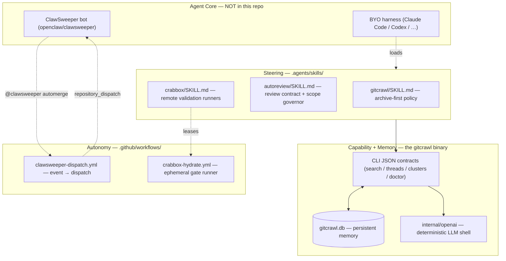
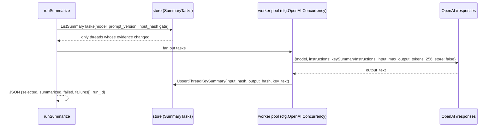
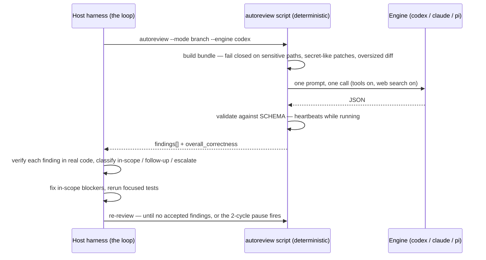
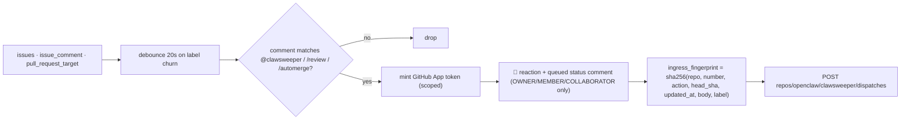

> Source: [openclaw/gitcrawl](https://github.com/openclaw/gitcrawl) (`main` @ `93643f0`, v0.9.6+unreleased) · Date: 2026-09-12 · Mode: Explain · Type: **Hybrid (C), Pack-leaning**
> See also: [System & OOP Architecture](./gitcrawl_system_oop_architecture.md) · [Data Architecture](./gitcrawl_data_architecture.md)

---

## 1. Overview

**There is no agent inside gitcrawl.** No reasoning loop, no tool registry, no context window, no `while tool_use`. What the repo contains instead is the *surround* — three things an agentic system needs, built by someone who assumed the agent would be supplied from outside:

1. **A memory organ.** The SQLite archive plus its JSON command surface is persistent, retrievable, freshness-bounded memory about a GitHub repository — exactly the organ a coding agent lacks. `README.md`'s first sentence says the tool is "for maintainers **and agents**."
2. **A steering pack.** `.agents/skills/{gitcrawl,autoreview,crabbox}/SKILL.md` — authored instruction files that install into a BYO harness (Claude Code, Codex, and others) and tell it when to reach for that memory, when not to, and where the boundaries are.
3. **A trigger surface.** `.github/workflows/clawsweeper-dispatch.yml` converts GitHub events and `@clawsweeper` comment commands into `repository_dispatch` calls against an autonomous bot that lives in a different repository.

Plus one genuinely embedded LLM use: `internal/openai` calls embeddings and a bounded Responses request for key summaries. That is *LLM-as-a-feature behind a deterministic shell*, not an agent — no tools, no loop, `store: false`, `max_output_tokens: 256`.

**Type: Hybrid (C), Pack-leaning.** Evidence, applying the "judge by `src/`, not the dotfiles" rule in reverse:

| Check | Result |
|---|---|
| Loop/dispatch machinery in `internal/`? | **No.** `internal/openai` has retry loops, not reasoning loops. `Summarize`/`Embed` are single request-response |
| Tool registry, provider abstraction, model registry? | **No.** One provider (OpenAI-compatible), two fixed operations |
| Authored agent content? | **Yes.** 3 `SKILL.md` files, one 8,982-line skill script, one scoped `AGENTS.md` |
| Harness config for the repo's *own* development? | **No root `AGENTS.md`/`CLAUDE.md`, no `.mcp.json`** — unusual for an OpenClaw repo, and itself a finding |
| Autonomous trigger? | **Yes,** but the agent it triggers (`openclaw/clawsweeper`) is not in this repo |

So the honest framing: **gitcrawl is an organ and a pack, not a brain.** The brain is always somewhere else — a human's harness, or ClawSweeper.

---

## 2. Agentic Anatomy

Solid lines = present in this repo. Dashed = the organ exists but lives outside the evidence boundary.



---

## 3. The Core

### 3.1 The absent loop, and what stands in for it

`.agents/skills/gitcrawl/SKILL.md` *is* the control flow. It does not describe a program; it describes a decision procedure the harness executes with its own loop:

```
1. Resolve scope        → owner/repo, number, cluster id, keyword, label, state, date range
2. Check freshness      → gitcrawl doctor --json  (only for "recent/current" questions)
3. Read                 → CLI for normal reads; sqlite3 -readonly for exact counts/rankings
4. Report               → absolute date spans, repo names, numbers, cluster ids, known gaps
```

Its governing rule is a **cache-first policy with an explicit escape hatch**: "Use local archive data first… Browse or hit live GitHub APIs only when the local archive is stale, missing the requested scope, or the user asks for current external context." And the escape hatch is bounded rather than banned — the skill teaches `--sync-if-stale 5m` as the agent-preferred form, so staleness has a number attached instead of a vibe.

It also does something most skills omit: it tells the agent what *not* to do when a specific failure appears. `gitcrawl gh` exits 2 with a migration note, and the skill pre-empts the agent's natural repair instincts — "This is a command migration, not an authentication failure: do not run `octopool login`, change tokens, auth, PATH, or config, or bypass the existing shim." That is failure-mode steering, encoded as content.

### 3.2 The embedded deterministic shell (the only LLM in `internal/`)



Every property here is chosen to make a non-deterministic component behave like a deterministic one, which is the same discipline the codebase applies elsewhere:

- **Stable I/O contract** — `summaryResult` JSON with per-failure detail (`status`, `type`, `code`, `message`), not free text.
- **Mockable seam** — `openai.Client` takes an injectable `HTTPClient`, `Now`, and `Sleep`; tests never touch the network.
- **Pinned prompt and model** — `keySummaryInstructions` is a const, `prompt_version` is part of the row's unique key, and both `provider` and `model` are stored alongside the output.
- **Idempotence by hash** — `input_hash` gates whether a call happens at all; `output_hash` records what came back.
- **Bounded blast radius** — 256 output tokens, `store: false` (no server-side retention), capped response read at 4 MiB, retry with jitter and a 5-minute elapsed ceiling.

The prompt itself is a small piece of prompt engineering worth quoting, because it targets the downstream *machine* consumer rather than a human reader: *"Produce a compact key summary for duplicate detection… at most three short lines… Preserve concrete errors, file paths, versions, and issue references… Do not speculate or add facts that are not in the evidence."* The output is embedding fodder and clustering evidence, so it is tuned for discriminative signal, not readability.

Embeddings are the same shape: `text-embedding-3-small`, 1024 dimensions, batch 64, inputs capped at 6,000 runes / 7,000 bytes, and vectors invalidated whenever the model or the rune cap changes.

### 3.3 The autoreview loop — a two-level design

`.agents/skills/autoreview/` is the one place a real agentic loop appears, and it is deliberately **split across two levels**:

- **The script is single-shot.** `scripts/autoreview` (8,982 lines of Python) builds *one* bundle, calls *one* engine (or a parallel panel of reviewers via `--reviewers codex,claude,pi`), validates *one* JSON result against a strict `SCHEMA` (`findings[]` with `title`/`body`/`priority` P0–P3/`confidence` 0–1/`category`/`code_location`, plus `overall_correctness`), and exits. The SKILL states this explicitly: "Do not invoke built-in `codex review`, nested reviewers, or reviewer panels from inside the review."
- **The iteration lives in the harness.** The review → verify each finding against real code → fix → rerun-focused-tests → re-review cycle is a *contract in the SKILL*, executed by the host agent's own loop.



Two guardrails in that loop are unusual enough to name. The **scope governor** freezes a baseline (original request, target branch, owner boundary, changed files, non-test LOC) and forces every finding into one of three buckets — in-scope blocker / follow-up / stop-and-escalate — with hard stop conditions: diff grows past 2× the original files or LOC, two patch cycles without convergence, or the best fix becomes "define the canonical contract first." It is an explicit answer to the classic agent failure of a review turning into a rewrite. And **engine substitution is forbidden**: "Never switch or override the requested review engine/model except for the documented Codex Sol-to-Terra account-access fallback." Capacity errors and rate limits keep the same engine, so a review's provenance stays honest.

---

## 4. Context & Memory

The interesting inversion: **gitcrawl's whole database is the agent's persistent memory, and none of it is in the agent's context window until asked for.** Every design choice around output shape is really context-budget engineering.

| Mechanism | Where | What it buys the agent |
|---|---|---|
| Persistent store | `gitcrawl.db` | Recall across sessions, machines, and harnesses — no re-fetching |
| Retrieval | `search` keyword / semantic / hybrid; `neighbors`; `clusters` | Three retrieval strategies over the same memory; hybrid degrades to keyword when no vectors exist |
| Freshness gate | `--sync-if-stale <duration>`, `doctor --json` | Bounded staleness instead of unbounded live calls; a machine-readable readiness gate |
| Projection | `--json number,title,url` (gh-compatible field lists) | The agent asks for the four fields it needs, not the whole row |
| Truncation | `--body-chars 600`, `--limit N` | Explicit context budget per call |
| Compaction | `capture` → `gitcrawl.capture.v1` | A deterministic, **code-free** conversation snapshot — patches excluded by construction |
| Stream discipline | stdout = results, stderr = diagnostics | `… \| jq` never has to strip log noise from the payload |
| Escape hatch | `sqlite3 -readonly "$(gitcrawl doctor --json \| jq -r .db_path)"` | Exact counts and rankings without a `sql` subcommand — with "Do not run mutating SQL" as the paired rule |

There is no summarization-based compaction of an agent transcript here, because there is no transcript here. The equivalent organ is `thread_key_summaries`: a three-line LLM compression of each thread, stored durably and keyed to a revision, so the *memory itself* is pre-compacted for whoever reads it next.

---

## 5. Capabilities

| Organ | Where it lives | Code or content |
|---|---|---|
| **Tools** (from the agent's view) | The `gitcrawl` CLI: `search`, `threads`, `clusters`, `cluster-detail`, `neighbors`, `runs`, `doctor`, `status`, `capture`, `code index`, plus governance verbs | Core code (`internal/cli`) — an agent-facing surface, not an in-process tool registry |
| **Skills** | `.agents/skills/gitcrawl/SKILL.md`, `autoreview/SKILL.md`, `crabbox/SKILL.md` | Authored content, with YAML `name`/`description` frontmatter for harness discovery |
| **Skill scripts** | `.agents/skills/autoreview/scripts/{autoreview, autoreview_test.py, test-review-harness*}` | Authored content shipping executable tooling — Python + a PowerShell variant for native Windows |
| **MCP** | — | **Absent.** No `.mcp.json`, no MCP client, no server. The integration contract is a CLI with JSON output |
| **Providers** | `internal/openai` (OpenAI-compatible, retargetable via `--embed-base-url`); autoreview's 7 engines (`codex`, `claude`, `droid`, `copilot`, `pi`, `opencode`, `cursor`) | Core code for the former; authored content for the latter |
| **Live GitHub reads** | Delegated to **Octopool** (`octopool gh …` or a symlinked binary) | External — deliberately removed from gitcrawl in the `gh` migration |
| **Remote compute** | `.crabbox.yaml` + `crabbox/SKILL.md` + `.github/workflows/crabbox-hydrate.yml` | Config + content. The broker provisions the box (AWS spot, `most-available`, on-demand fallback after 120s, five regions) or delegates to Blacksmith Testbox; the workflow is `workflow_dispatch`-only and hydrates a named lease onto an ephemeral self-hosted runner |

The AX quality of the CLI surface is the reason this works as a tool. Errors teach the next move rather than just failing — `gitcrawl gh` prints the exact replacement commands; `refresh` with all three stages disabled says "refresh requires at least one selected stage"; cloud-mode `code index` says "code search requires a local gitcrawl database". Field lists mirror `gh` exactly so existing `jq` filters transfer unchanged. `doctor --json` is a purpose-built readiness probe. These are the properties that make a deterministic tool safe to hand an agent.

---

## 6. Orchestration & Autonomy

### 6.1 The trigger surface

`clawsweeper-dispatch.yml` is the most agentic file in the repository — a hardened ingress that turns repository activity into work for an autonomous bot:



Every element is a guardrail:

- **Least privilege, two tokens.** The dispatch token is scoped to `repositories: clawsweeper` with `permission-contents: write`; a *separate* target token gets `permission-issues: write` + `permission-pull-requests: read` only for reacting and posting the ack comment. Neither is a blanket PAT.
- **Authorization gate.** The acknowledgement comment is only posted when `author_association` is `OWNER`, `MEMBER`, or `COLLABORATOR` — a drive-by commenter cannot make the bot look like it accepted their command.
- **Idempotency / supersede.** The `ingress_fingerprint` hashes the exact PR state (head SHA, `updated_at`, body, label). `supersedes_in_progress` is set for `edited`/`synchronize`/`ready_for_review`, and a `concurrency` group with `cancel-in-progress` prevents a burst of edits from queuing a burst of agent runs.
- **Loop breaker.** Bot-authored `labeled`/`unlabeled` events are skipped, and comments carrying a `clawsweeper-proof-nudge` marker are ignored — the bot cannot re-trigger itself.
- **`pull_request_target` handled honestly.** It carries an inline `zizmor: ignore[dangerous-triggers]` justification: "maintainer-owned external dispatch; no checkout or untrusted PR code execution." The workflow never checks out the PR.

### 6.2 Human-in-the-loop, expressed as data boundaries

gitcrawl's HITL story is not a confirmation prompt — it is a **write boundary encoded in the architecture**, which is stronger:

| Boundary | Enforcement |
|---|---|
| No GitHub write-back, ever | `internal/github/client.go` exposes only `Get*`/`List*`. Local closes, exclusions, and canonical picks stay local (`SKILL.md` §Maintainer Boundaries) |
| Archive state ≠ current GitHub state | The skill says so explicitly and requires bare-PATH `gh` for final merge/comment decisions |
| No mutating SQL | "Use local maintainer commands for overrides instead of writing database rows directly" |
| Release publication | Human-dispatched only. Local publishing is disabled — `make release` and `scripts/package-release.sh` refuse and print the official command; the sole path is `gh workflow run release-unified.yml -f version=X.Y.Z` from protected `main` (`docs/releasing.md`) |
| Cloud cutover | `--stage-only` uploads and validates without moving readers; `--allow-incomplete` is an explicit opt-in override |
| Review scope | The autoreview scope governor's stop-and-escalate class hands control back to the human |
| Portable refresh | Strict admission refuses dirty checkouts, hooks, filters, submodules, alternates; "An occupied lock is a refusal, not a reason to kill another process" |

That last line is the house style in one sentence: an agent encountering a lock is told, in content, not to be clever about it.

### 6.3 Subagents and sessions

**Absent from this repo.** No spawn/isolate/merge orchestration, no session store, no event bus. The nearest thing is autoreview's `--panel` / `--reviewers codex,claude,pi`, which runs multiple review *engines* concurrently over the same bundle and merges their findings — a fan-out over models, not over agents, with `--allow-partial-panel` to tolerate one failing. The SKILL keeps it opt-in: "Multi-reviewer panels are opt-in only. Use them when explicitly requested or when risk justifies the extra spend."

---

## 7. Extension Points

Adding an organ here means adding **content or configuration**, never a plugin:

- **A new skill** — drop `.agents/skills/<name>/SKILL.md` with `name` + `description` frontmatter. Note the ownership rule in `autoreview/AGENTS.md`: the canonical source is `openclaw/agent-skills`, changes are made and validated *there* first, then the complete directory is synced downstream, and "Never create repo-local behavior variants." Two of the three skills in this repo are vendored copies under that rule.
- **A new agent-facing command** — add a `case` to the `switch` in `internal/cli/app.go:Run`, a `run*` method, a `--json` payload, and help text.
- **A new review engine** — add a `run_<engine>` function and register it in `run_engine`'s dispatch (already seven).
- **A different embedding provider** — `gitcrawl configure --embed-base-url` retargets at any OpenAI-compatible endpoint, including a local model, with no code change.
- **A shared memory for a team of agents** — publish a portable store; every agent's `gitcrawl` reads the same pruned snapshot from Git without any of them holding a GitHub token.
- **A new autonomous trigger** — add a workflow that `repository_dispatch`es with its own `event_type`.

---

## 8. Organ Presence Matrix

| Organ | Present? | Where | Notes |
|---|---|---|---|
| Reasoning loop | ❌ in repo / ⚠️ external | host harness; `.agents/skills/*/SKILL.md` describes the procedure | The pack supplies the *policy*; the harness supplies the *loop* |
| Model / provider layer | ⚠️ partial | `internal/openai/client.go`, `crawlkit/embed` | One provider family, two operations. Retargetable base URL. autoreview adds 7 CLI engines as content |
| System prompt / constitution | ⚠️ partial | `keySummaryInstructions` (const); each `SKILL.md` | No root `AGENTS.md`/`CLAUDE.md` — the repo does not steer agents working *on itself*, only agents *using* it |
| Context window management | n·a | — | No transcript exists in-process |
| Compaction / summarization | ✅ | `thread_key_summaries`, `--body-chars`, `--limit`, `capture` v1 | Compaction of the *memory*, not of a conversation |
| Memory (persistent) | ✅ **strongest organ** | `gitcrawl.db`, portable store, cloud archive | Survives sessions, machines, and harness changes |
| Memory (working) | n·a | — | Belongs to the calling harness |
| Tools | ✅ (as a surface) | `internal/cli` — the CLI *is* the toolset | No in-process registry; JSON contracts + stable exit codes are the ABI |
| Skills | ✅ | `.agents/skills/{gitcrawl,autoreview,crabbox}/` | 3 packs; 2 vendored from `openclaw/agent-skills` |
| MCP | ❌ | — | No `.mcp.json`, no client, no server. A deliberate-looking bet on CLI+JSON over MCP |
| Subagents | ⚠️ partial | autoreview `--panel` / `--reviewers` | Parallel review engines over one bundle; no spawn/isolate/merge of agents |
| Hooks · triggers · scheduling | ✅ | `clawsweeper-dispatch.yml`, `crabbox-hydrate.yml`; cron/systemd/launchd recipes in `docs/automation.md` | Event-driven and time-driven refresh are both first-class |
| Permissions / guardrails / HITL | ✅ | read-only GitHub client; scoped App tokens; `author_association` gate; scope governor; `--stage-only`; strict portable admission | Enforced structurally, not by prompting |
| Session / state / event bus | ❌ | — | `cluster_events` is a domain audit log, not an agent event bus |
| Autonomous agent itself | ⚠️ external | `openclaw/clawsweeper` | Dispatched from here, implemented elsewhere |

---

## 9. Glossary & Open Questions

**Glossary**

| Term | Meaning |
|---|---|
| **Pack** | Authored content (`SKILL.md`, scripts, config) that installs into a BYO harness rather than implementing one |
| **ClawSweeper** | The OpenClaw autonomous maintenance bot. Triggered from this repo via `repository_dispatch`; implemented in `openclaw/clawsweeper`. Commands: `@clawsweeper`, `/review`, `/autoclose`, `/automerge` |
| **Octopool** | The org-authenticated pooled `gh` read relay that took over gitcrawl's retired `gh` shim. Owns its own cache, which portable stores never carry |
| **Crabbox** | Remote-runner orchestration for gate suites — brokered AWS spot (`cbx_…`) or delegated Blacksmith Testbox (`tbx_…`) |
| **Ingress fingerprint** | `sha256` over `(repo, number, action, head_sha, updated_at, body, label)`, giving ClawSweeper an idempotency and supersede key |
| **Scope governor** | The autoreview rule set that classifies every finding as in-scope blocker / follow-up / stop-and-escalate and halts runaway fix loops |
| **Bounded staleness** | The `--sync-if-stale <duration>` pattern: answer from cache, but never from a cache older than N |

**Open questions**

- **The agent is not in the repo.** ClawSweeper's loop, prompts, model, permissions, and merge policy are entirely outside the evidence boundary. This document describes the socket, not the plug.
- **Why no MCP?** For a tool this obviously agent-shaped, the absence of an MCP server is conspicuous. Nothing in the repo explains whether it is a considered rejection (CLI+JSON is simpler, streams to `jq`, and works in any harness) or simply not yet built.
- **No root `AGENTS.md` / `CLAUDE.md`.** Agents working *on* gitcrawl get no repo-level steering — no build/test conventions, no architecture pointers. Given the maturity of everything else here, this reads as a gap rather than a choice. (`.claude/` in this checkout contains only a `.cc-writes` scratch directory created by the session that produced these notes — it is not repo content.)
- **Skill drift is possible.** `autoreview` and `crabbox` are vendored copies whose canonical home is `openclaw/agent-skills`. There is no automated freshness check in this repo — the drain obligation is enforced by the instruction in `AGENTS.md` alone.
- **`--github-token-command` is a managed-credential seam** whose other side (the executable that mints tokens) is unspecified here. It is refused for `capture` because "offline quota provenance for managed credentials is unavailable" — implying a provenance contract that exists somewhere outside this repo.
- **Engine costs are unbounded in the pack.** autoreview tolerates a 30-minute model call with heartbeats and supports parallel panels; nothing in the repo caps spend. The SKILL's "opt-in only" language is the only brake.
