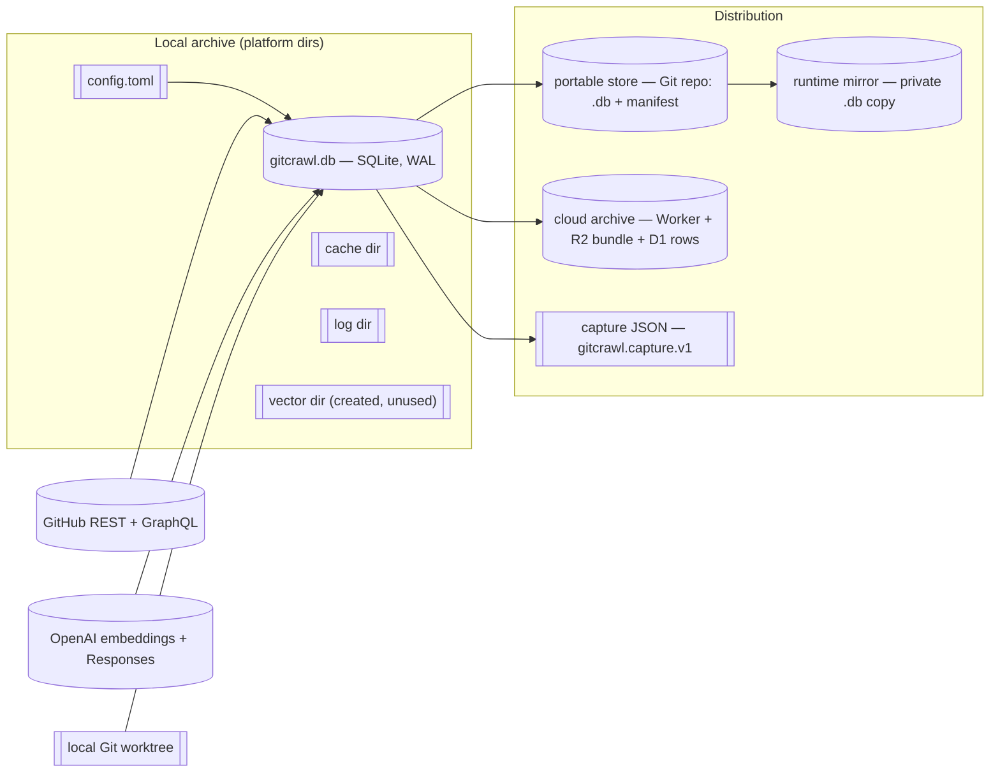
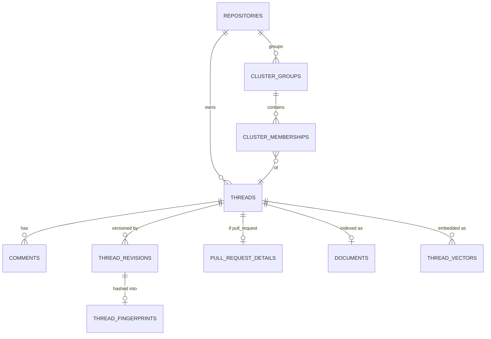
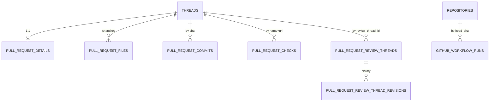
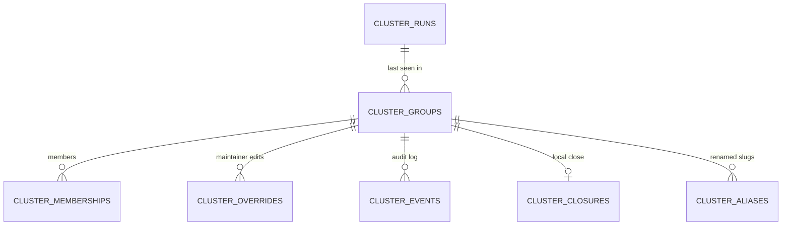
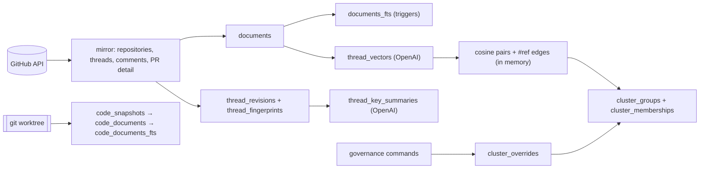
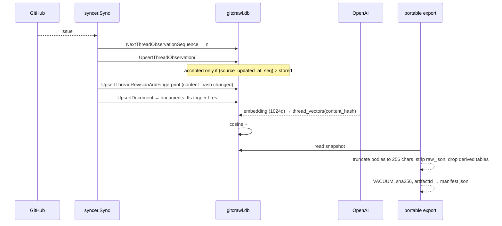

> Source: [openclaw/gitcrawl](https://github.com/openclaw/gitcrawl) (`main` @ `93643f0`, v0.9.6+unreleased) · Date: 2026-09-12 · Mode: Explain · Data system: **Hybrid — embedded OLTP (SQLite) + derived retrieval layer + snapshot distribution**
> See also: [System & OOP Architecture](./gitcrawl_system_oop_architecture.md) · [Agentic Architecture](./gitcrawl_agentic_architecture.md)

---

## 1. Overview

gitcrawl manages one thing: **a durable local replica of GitHub conversation state, plus everything derived from it.** GitHub issues and pull requests (and optionally their comments, reviews, files, commits, checks, and workflow runs) are mirrored into a single SQLite file; that mirror is then enriched into canonical documents, an FTS5 index, key summaries, embeddings, fingerprints, and similarity clusters. On top sits a thin layer of *local-only maintainer state* — closures, exclusions, canonical picks — which is the only data gitcrawl originates rather than replicates.

**Classification: Hybrid, but OLTP-first.** Evidence:

- One declarative schema — `internal/store/schema.go`, 705 lines of `create table if not exists` — with foreign keys on, WAL journaling, normalized parent/child tables and `unique(...)` natural keys. That is an OLTP app DB, and it is schema-centric.
- A derived retrieval layer keyed off content hashes (`documents`, `documents_fts`, `thread_vectors`, `thread_fingerprints`, `thread_key_summaries`) — provenance- and lineage-centric.
- Two publication boundaries producing immutable, digest-identified artifacts: **portable stores** (`internal/portable/export.go`, a pruned SQLite file + JSON manifest in Git) and **cloud archives** (`internal/cli/cloud_snapshot.go`, a gzip bundle into a Worker-fronted R2/D1). Those are blob/snapshot-shaped.

**Tech:** SQLite via `modernc.org/sqlite` (pure Go, no CGO), FTS5 virtual tables with external content, `sqlc`-generated typed queries in `internal/store/storedb`, `pragma user_version` for schema versioning, gzip for portable/cloud transport, `crawlkit/store` for open/FTS helpers.

---

## 2. Data Landscape

| Store | Engine / kind | Holds | Written by | Read by |
|---|---|---|---|---|
| `gitcrawl.db` | SQLite (WAL, FTS5) | Everything: mirror, derived text/vectors, clusters, governance, run history | `sync`, `summarize`, `embed`, `cluster`, `code index`, governance commands | every read command, TUI, exporters |
| `config.toml` | TOML | Paths, models, embedding basis, vector backend, `[remote]`, optional `[env]` secrets | `init`, `configure` | every command at startup |
| cache dir | filesystem | Runtime caches | sync/search/cluster | same |
| vector dir | filesystem | **Nothing** — created and reported, never written (see §8) | `EnsureRuntimeDirs` | — |
| Portable store | Git repo | Pruned `*.sync.db` (+ optional `.gz`) and a sibling JSON manifest | `portable export` / publisher | subscribers via `init` / `portable refresh` |
| Runtime mirror | SQLite copy | Per-machine private copy of the portable DB | `ensurePortableRuntimeDB` | all local reads (so the shared checkout stays unlocked) |
| Cloud archive | Worker + R2 + D1 | Digest-scoped gzip SQLite bundle + row batches | `cloud publish` | `status`, `search` in cloud mode |
| OS keyring | keychain / wincred / secret-service | Remote session bearer token | `remote login` | `whoami`, cloud reads |
| Capture JSON | file | Deterministic, code-free conversation snapshot | `capture` | downstream consumers |

Upstream systems outside the evidence boundary: GitHub itself, the Worker deployment, and Octopool's separate `gh` cache. gitcrawl never reads Octopool's store — `SPEC.md` is explicit that portable stores "carry repo snapshots only".

---

## 3. Data Models / Schema

~40 tables in seven families. Conceptual first, then the families that matter.

### 3.1 Conceptual — the core mirror

`threads` is the spine. Its natural key is `unique(repo_id, kind, number)`; `kind` is `check`-constrained to `('issue','pull_request')`, so issues and PRs share one physical table and one ID space — which is why cross-kind clustering needs its own similarity threshold.

### 3.2 Physical — thread core and history

| Table | Key | Notes |
|---|---|---|
| `repositories` | `id` PK, `full_name` unique | Holds `github_repo_id` + full `raw_json` |
| `threads` | `id` PK, `unique(repo_id, kind, number)` | Dual state: `state` (GitHub) and `closed_at_local`/`close_reason_local` (local-only). Carries `content_hash`, `observation_sequence`, `evidence_observation_sequence`, `evidence_source_updated_at` |
| `comments` | `unique(thread_id, comment_type, github_id)` | `comment_type` distinguishes issue comment / review / review comment. Soft-deleted via `deleted_at` + `deletion_reason`, enforced by a paired `CHECK` |
| `comment_revisions` | `id` PK | Append-only edit history per comment |
| `thread_revisions` | `id` PK | One row per observed content change: `content_hash`, `title_hash`, `body_hash`, `labels_hash`, `source_updated_at`, `observation_sequence` |
| `blobs` | `sha256` unique | Content-addressed payload store: `storage_kind` chooses `inline_text` vs `storage_path`; `raw_json`, diffs, and per-file patches point here |

The soft-delete `CHECK` is worth naming because it appears on four tables (`comments`, `pull_request_commits`, `pull_request_review_threads`, and the review-thread revisions): *either* both `deleted_at` and a non-blank `deletion_reason` are set, *or* neither is. Tombstones must be explained, at the schema level.

### 3.3 Physical — pull-request detail (hydrated on `--with pr-details`)

`pull_request_files` carries a schema comment that is a small design record in itself: its PK is `(thread_id, position)`, **not** `(thread_id, path)`, because GitHub can return two entries for the same filename in one PR (a removal and an addition). The file list is therefore modelled as a *replaceable positional snapshot*, not a durable per-file identity — with a pointer to issue #77 explaining why.

### 3.4 Physical — derived retrieval

| Table | Key | Produced by | Invalidated by |
|---|---|---|---|
| `documents` | `unique(thread_id)` | `documents.BuildWithContext` during sync | thread/comment change |
| `documents_fts` | FTS5, `content='documents'` | Three triggers (`_ai`, `_ad`, `_au`) | automatic |
| `thread_key_summaries` | `unique(revision, kind, prompt_version, provider, model)` | `summarize` → OpenAI Responses | `input_hash` mismatch |
| `thread_vectors` | `primary key(thread_id, basis, model)` | `embed` → OpenAI embeddings | `content_hash` mismatch, model change, rune-cap change |
| `thread_fingerprints` | `unique(thread_revision_id, algorithm_version)` | sync enrichment | new revision, or bumping `thread-fingerprint-v2` |
| `code_documents` | `unique(snapshot_id, path)` | `code index` | full snapshot replacement |
| `code_documents_fts` | FTS5, `content='code_documents'` | triggers | automatic |

The FTS5 tables are **external-content** indexes: the row data lives in `documents`/`code_documents` and the virtual table stores only the index, with delete-then-insert triggers keeping them in step. Search orders by `bm25(documents_fts)` and returns a `snippet(...)` excerpt.

`thread_vectors.vector_json` is a TEXT column holding the raw float array. There is no vector index, no extension: cosine similarity is computed in Go over the full loaded set.

### 3.5 Physical — clustering, and its two generations

**Durable generation (current).** `cluster_groups` is keyed `unique(repo_id, stable_key)` and `unique(repo_id, stable_slug)`, where the key is `HumanKeyForValue("repo:<id>:cluster-representative:<threadID>")` — a hash plus a two-word human slug drawn from a 200-word list. Because the identity derives from the representative thread rather than a run counter, cluster IDs survive re-clustering, and so do the overrides attached to them. `cluster_memberships` records `role` (`canonical`/`related`), `state`, `added_by`/`removed_by`, `added_reason_json`, and first/last-seen run IDs — a membership *ledger*, not a set.

**Legacy generation (read-only).** `clusters`, `cluster_members`, `similarity_edges`, `document_embeddings`, and `document_summaries` are still created by `schema.go` and still *read* — `ListRunClusterSummaries` will serve them, and `summariesByThreadIDs` reads `document_summaries` behind a `hasTable` guard — but **no production code path writes any of them**; only tests insert rows. On a database created by current gitcrawl, `latestRawClusterRunID` never matches, so `ListDisplayClusterSummaries` always falls through to the durable path. These tables exist to keep older archives and older portable snapshots readable.

### 3.6 Physical — run history and ordering

`sync_runs`, `summary_runs`, `embedding_runs`, `cluster_runs` share a shape (`repo_id`, `scope`, `status`, timestamps, `stats_json`, `error_text`). `sync_attempt_failures` is a *deduplicating* failure ledger keyed `unique(repo_id, number, operation, error_class)` with `retry_count` and `resolved_at`, so a repeatedly failing PR hydration is one row, not a log. `repo_sync_state` holds the closed-sweep watermarks that make incremental syncs safe across offline periods.

The ordering tables — `thread_observation_sequence`, `thread_child_observation_reservations`, `thread_child_observation_memberships`, `workflow_run_observation_reservations` — are covered in §7.

---

## 4. Dataflow & Lineage

### 4.1 The pipeline

Two things are deliberately *not* connected. Code documents feed FTS only — they are never embedded, never neighbours, never cluster members (`docs/code-index.md`, `docs/concepts.md`). And PR **patch text** stays in the detail cache: `documents.BuildWithContext` folds in changed *paths* and commit *subjects*, never diffs, so patches never reach the embedding input.

### 4.2 Traced lineage — one thread, end to end

Every derived artifact is gated by a hash, not a timestamp: `documents.dedupe_text`, `thread_vectors.content_hash`, `thread_key_summaries.input_hash`, `thread_fingerprints.fingerprint_hash`. Re-running `refresh` on unchanged data spends no OpenAI tokens.

### 4.3 The two publication paths

**Portable export** (`internal/portable/export.go`) runs a fixed eleven-stage pipeline — `snapshot → repository scope → profile omissions → canonical shaping → index removal → final vacuum → validation → artifact identity → compression → manifest → artifact commit`. The only supported profile is `current-state-v1`, which **clears** seven tables (all cluster governance and lineage, comment revisions, key summaries) and **excludes** eighteen categories (`raw_json`, PR file patches, `documents`, FTS, vectors, code index, run history, `similarity_edges`, `blobs`, `sync_attempt_failures`, ordinary indexes). Bodies are truncated to `--body-chars` (default 256). Index profile is `constraints-only`: unique indexes survive because they *are* constraints; everything else is dropped and rebuilt on the subscriber side. The `artifactId` is a hash computed after canonical normalization, so byte-identical content produces an identical ID regardless of row order.

**Cloud publish** (`docs/cloud-archives.md`, `internal/cli/cloud_snapshot.go`) is the opposite trade: it freezes one local SQLite image, uses its SHA-256 as snapshot identity, and ships **complete** bodies, comments, revisions, review comments, and PR patch text — gzip here is transport, not compaction. It excludes raw API payloads, blob-backed payloads, run diagnostics, the source-code index, and machine-local paths. It supports `--stage-only` to upload and validate an immutable candidate without cutting readers over, then verifies the digest, profile, generation, and dataset coverage through a reader-scoped projection before declaring success.

---

## 5. System of Record & Ownership

| Entity | System of record | Derived / cached copies | Written by |
|---|---|---|---|
| Repository, thread facts (title, body, labels, state, timestamps) | **GitHub** — local rows are a replica | `threads`, `raw_json`, `thread_revisions` | `sync` only |
| Comments, reviews, PR files/commits/checks/review threads | **GitHub** | corresponding tables | `sync --include-comments` / `--with pr-details` |
| Workflow runs | **GitHub** | `github_workflow_runs` | `sync --with pr-details` |
| **Local close** (`closed_at_local`, `close_reason_local`, `cluster_closures`) | **gitcrawl** — originated here, never pushed | — | `close-thread`, `close-cluster` |
| **Cluster identity & membership** | **gitcrawl** (`cluster_groups`, `cluster_memberships`) | — | `cluster`, `refresh` |
| **Maintainer overrides** (`cluster_overrides`) | **gitcrawl** | replayed onto memberships by `applyClusterOverrides` | `exclude-`/`include-cluster-member`, `set-cluster-canonical` |
| Documents, FTS, vectors, fingerprints, key summaries | **derived** from the mirror; safe to delete and rebuild | — | `sync`, `embed`, `summarize` |
| Code documents | **local Git worktree** | `code_snapshots`, `code_documents` | `code index` |
| Published snapshot | **the publisher's local DB** | portable store, cloud archive | `portable export`, `cloud publish` |

**Multi-source-of-truth flags — two, both benign but worth knowing:**

1. **Cluster representation is dual.** The durable `cluster_groups` tree is authoritative, but the legacy `clusters`/`cluster_members` pair is still read first by `ListDisplayClusterSummaries`. Any archive that *does* contain legacy rows (an old DB, an old portable snapshot) will show those instead of the durable ones. Current writes only touch the durable side, so the two cannot diverge going forward — but a stale archive can present a stale view.
2. **The portable runtime mirror is a copy of a copy.** The subscriber reads `runtime mirror ← portable store ← publisher's local DB ← GitHub`. `doctor` therefore reports `source_db_health` and `runtime_db_health` separately, and `dbTarget()` labels every JSON payload `direct` or `runtime-mirror` with the source path, so a caller always knows which link of the chain answered.

---

## 6. Storage & Access

**Engine pragmas** (`schema.go` header): `foreign_keys = on`, `journal_mode = wal`, `busy_timeout = 5000`. On top of the busy timeout, `withSQLiteBusyRetry` retries transient `SQLITE_BUSY` on an explicit backoff ladder (50/100/200/400/800 ms). Read-only opens have two flavours: `OpenReadOnly` and `OpenReadOnlyImmutable` (a `file:...?immutable=1` URI) — the latter for reading a snapshot nobody is writing.

**Indexes** (28 declared). The shape of the workload is readable straight off them:

| Access pattern | Index |
|---|---|
| Fetch a thread by number | `idx_threads_repo_number` |
| Triage list, hiding local closes | `idx_threads_repo_state_closed` |
| Staleness / recency ordering | `idx_threads_repo_updated` |
| Hydrated PR panes | `idx_pull_request_checks_thread_status`, `idx_pull_request_review_threads_thread_resolved` |
| Cluster browse | `idx_cluster_groups_repo_status`, `idx_cluster_memberships_thread_state` |
| Vector scope selection | `idx_thread_vectors_basis_model` |
| Run/failure inspection | `idx_sync_runs_repo_status_id`, `idx_sync_attempt_failures_repo_unresolved` |

**Search cost profile.** Keyword search is an FTS5 `MATCH` with `bm25` ordering — indexed, cheap, with a `LIKE`-based fallback (`crawlstore.EscapeLike`) when the query tokenizes to nothing. Semantic search is the expensive path: it loads **every** in-scope vector into memory, embeds the query via one OpenAI round trip, and scores exhaustively with `vector.Cosine` (`queryExact`, O(N·d)). `TopK` bounds the result, not the scan. The `turbovec` backend exists as an alternative (`crawlvector.BackendTurboVec`, tie candidates capped at 16,384) but `exact` is the default. Clustering is worse by construction: `buildDurableClusterInputs` runs a full O(N²) pair loop over all in-scope vectors before any filter applies. Both are fine at maintainer-repo scale and would be the first thing to hurt at very large N.

**Hot/cold tiering** is expressed as *what is loaded*, not where it lives: `--body-chars` on cluster detail and portable export, `--limit` on nearly everything, narrow `--json` field lists, and blob indirection (`inline_text` vs `storage_path`) keeping large payloads out of row scans.

---

## 7. Lifecycle & Governance

### 7.1 Observation ordering — the distinctive invariant

The schema's most unusual feature is a purpose-built ordering discipline, and it exists because GitHub's `updated_at` is not a reliable total order across a fan-out sync.

Each sync draws one monotonic `observation_sequence` from a single-row counter table (`thread_observation_sequence`, `UPDATE … RETURNING`). Every thread write is then compared with `compareObservationOrder`, which orders by `(source_updated_at, observation_sequence)`: a newer valid timestamp wins; if timestamps tie or are both malformed, the higher sequence wins; if both timestamps are malformed *and differ*, the write errors rather than guessing. A **negative** sequence marks a metadata-only observation whose absolute value still participates in ordering — the sign carries "how complete is this observation", the magnitude carries "when did we see it".

Child collections that are replaced wholesale (comments, PR files, commits, checks, review threads) each *reserve* a sequence per `(thread_id, family)` in `thread_child_observation_reservations`, and record which member IDs that observation covered in `thread_child_observation_memberships`. That is what makes "replace the whole set" safe when two syncs interleave: a late-arriving stale snapshot cannot delete rows a newer one just wrote. Workflow runs get the same treatment keyed by `(repo_id, head_sha)`.

Net effect: the archive converges to the newest complete observation regardless of arrival order, and the schema — not application discipline — enforces it, via `CHECK typeof(...) = 'integer'` constraints on every sequence column.

### 7.2 Schema evolution

`schemaVersion = 13`, stored in `pragma user_version`. Migration (`Store.migrate`) is not a numbered-file ladder; it is **idempotent convergence**:

1. Refuse to open a DB whose version is *newer* than the binary supports.
2. Apply the whole `create table if not exists` schema unconditionally.
3. If already at the current version, run `inspectStructuralCompatibilityMigrations` / `inspectCompatibilityMigrations` — a set of *inspectors* that ask whether the physical shape actually matches (does `pull_request_files` use the position key? does `thread_vectors` have the composite key? are the tombstone columns present?). If everything converges, return early.
4. Otherwise run the `ensure*` repair functions in a fixed order — rebuilding tables and backfilling values — set `user_version`, then **re-inspect** and fail loudly if anything is still pending (`schema migration left pending convergence: …`).

The trade: no migration history and no down-migrations, but any database at any age converges to the same shape, and drift is detectable rather than assumed. `store.InspectSchema` surfaces the same diagnostics through `doctor --json` as `db_schema` / `source_db_schema` / `runtime_db_schema`.

### 7.3 Deletion, retention, classification

- **Soft delete** is the rule for upstream-removed content: `deleted_at` + mandatory `deletion_reason`, `CHECK`-enforced, on comments, PR commits, and review threads. History tables (`comment_revisions`, `thread_revisions`, `pull_request_review_thread_revisions`) are append-only.
- **Hard delete** happens only through `on delete cascade` from `repositories`/`threads`, and through `code index`, which replaces a repository's entire code snapshot each run so renamed and deleted paths do not linger.
- **No TTL, no purge job, no archival tier.** Nothing in the schema or the command surface expires old rows. The only size controls are `portable prune --body-chars` (which shrinks the *published* artifact, not the source) and `VACUUM` inside the export pipeline.
- **Classification is by artifact, not by column.** No table carries a PII/PHI marker. Instead the *export profiles* encode sensitivity: `capture` produces an explicitly **code-free** snapshot (`gitcrawl.capture.v1`, threads and comments only, with a sanitized rate-limit observation); portable `current-state-v1` strips raw payloads and patches; cloud bundles declare **both** message-body and source-code sensitivity precisely because patch text is retained.
- **The cloud path has no delete.** `docs/cloud-archives.md` states outright that gitcrawl "intentionally has no remote deletion command" and pushes lifecycle responsibility onto the Worker operator — including for failed, superseded, and uncut staged bundles. `--stage-only` does not move that responsibility back to the client. This is the sharpest governance gap in the system, and it is documented as deliberate.
- **Credentials** never enter the database: tokens resolve from env or `[env]` in `config.toml`, remote session tokens live in the OS keyring, and portable refresh refuses URLs containing userinfo or passwords.

---

## 8. Open Questions & External Assumptions

- **`vector_dir` is dead storage.** Config defines it, `EnsureRuntimeDirs` creates it, `init`/`doctor` report it — and no code writes to it. Vectors live in `thread_vectors.vector_json` inside SQLite. `docs/concepts.md` still says "Vectors live under the platform default data directory and are referenced from the `thread_vectors` table", which is not what the code does.
- **Documentation names two tables that do not exist.** `docs/concepts.md` refers to a `durable_clusters` table (the real one is `cluster_groups`) and to `run_records` (the real ones are `sync_runs` / `summary_runs` / `embedding_runs` / `cluster_runs`). Reader beware when following the docs into SQL.
- **Five legacy tables are created but never written** (`clusters`, `cluster_members`, `similarity_edges`, `document_embeddings`, `document_summaries`). Whether they are retained deliberately for old-archive compatibility or simply not yet dropped is not stated anywhere in the repo. They are still listed in portable clear/exclude sets, which suggests deliberate.
- **`crawlkit/store` pragmas and helpers are unverified.** `crawlkit` v0.16.1 was not available locally, so what `crawlstore.Open` does beyond returning a `*sql.DB` — connection limits, additional pragmas, FTS tokenizer configuration — is inferred, not read.
- **Cloud archive schema is external.** The D1 table layout and R2 key structure live in the Worker deployment, not here. This document describes only what gitcrawl sends (`crawlremote.IngestManifest`, `IngestTableSpec`, digest-scoped gzip bundles) and what it verifies on the way back.
- **Actual retention of published artifacts is an operator policy**, unobservable from this repo — both for portable stores (Git history keeps every published snapshot forever by default) and for cloud bundles.
- **Blob garbage collection is unaddressed.** `blobs` rows are referenced with `on delete set null` from several parents, so deleting a comment or revision orphans its blob rather than removing it. The only `delete from blobs` in the codebase is the wholesale strip inside cloud snapshot preparation (`internal/cli/cloud_commands.go:1795`) — there is no local sweeper.
