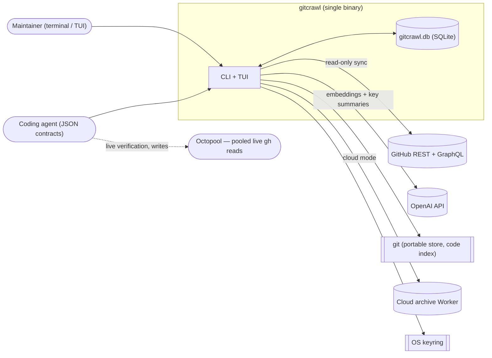
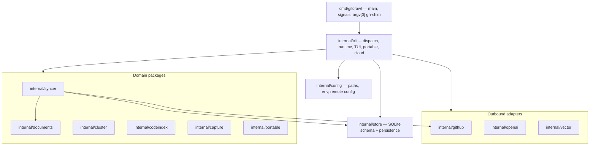
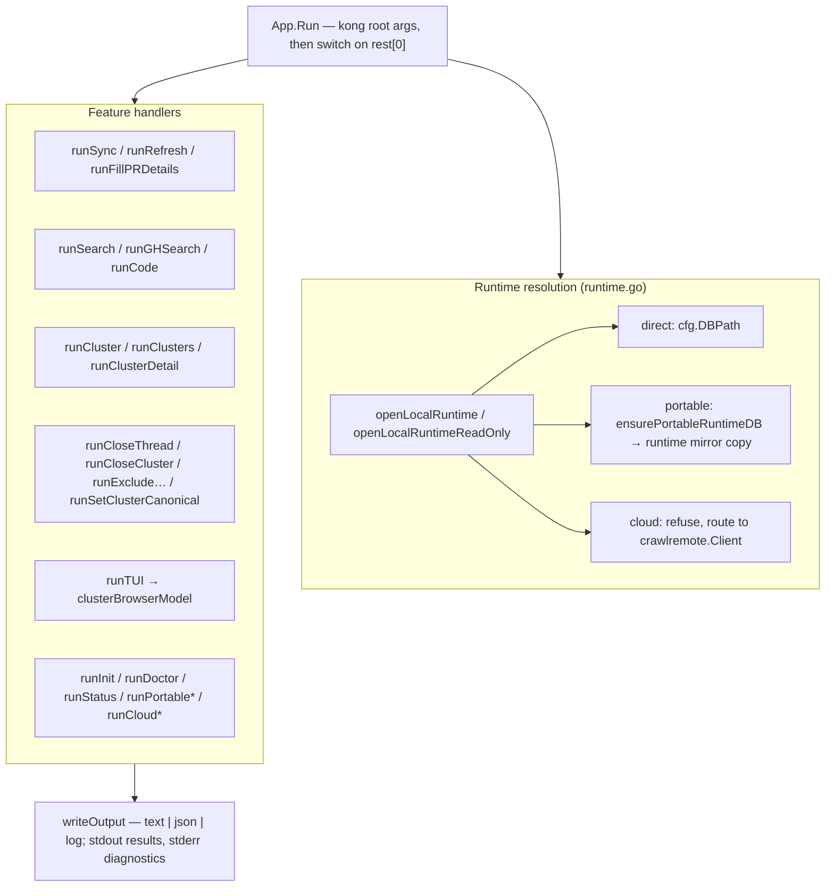
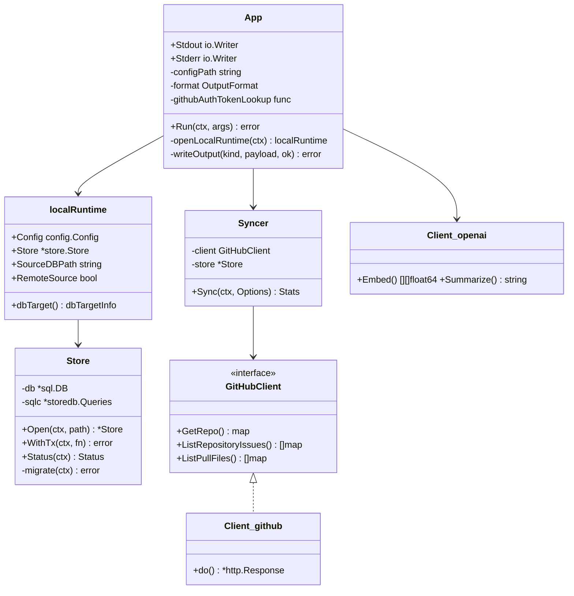
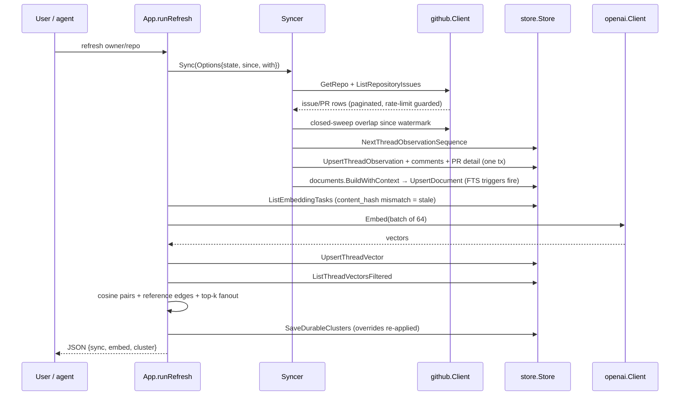
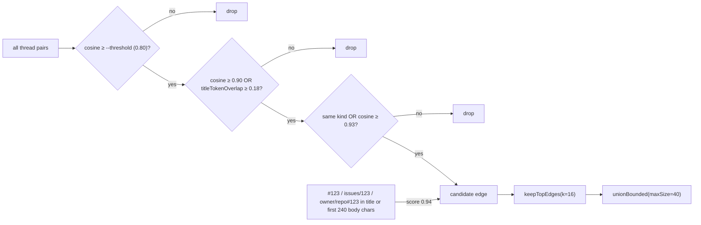

> Source: [openclaw/gitcrawl](https://github.com/openclaw/gitcrawl) (`main` @ `93643f0`, v0.9.6+unreleased) · Date: 2026-09-12 · Mode: Explain · Type: **Application**
> See also: [Data Architecture](./gitcrawl_data_architecture.md) · [Agentic Architecture](./gitcrawl_agentic_architecture.md)

---

## 1. Overview

`gitcrawl` mirrors GitHub issues and pull requests into a local SQLite archive so that maintainers **and coding agents** can search, cluster, and triage them without spending GitHub search quota and without running any service. It adds full-text search, OpenAI embeddings, similarity clustering with durable maintainer overrides, and a terminal UI — all reading the same local database.

**Type: Application.** Evidence: a single executable entrypoint at `cmd/gitcrawl/main.go`, and *every* other package sits under `internal/` — Go forbids external imports of `internal/`, so there is no public API to consume. `SPEC.md` reinforces this: "No `serve` command", no local HTTP API, no hosted runtime, no web UI.

**Stack**

| Concern | Choice | Where |
|---|---|---|
| Language | Go 1.27.1, `CGO_ENABLED=0` | `go.mod`, `.goreleaser.yaml` |
| Root flag parsing | `alecthomas/kong` | `internal/cli/app.go:parseKongArgs` |
| Subcommand flags | stdlib `flag.FlagSet` | every `run*` method |
| Storage | `modernc.org/sqlite` (pure Go), FTS5, WAL | `internal/store/schema.go` |
| Typed queries | `sqlc` → `internal/store/storedb` | `sqlc.yaml` |
| TUI | `charmbracelet/bubbletea` + `bubbles` + `lipgloss` | `internal/cli/tui.go` |
| Shared platform lib | `openclaw/crawlkit` v0.16.1 | `config`, `store`, `remote`, `control`, `mirror`, `vector`, `embed`, `progress`, `releasecheck` |
| Secrets | `zalando/go-keyring` | remote session token |

`crawlkit` is the OpenClaw-wide substrate: it owns platform config paths, SQLite open/FTS helpers, the cloud `remote` client, the `control`-plane status/manifest shapes, vector search primitives, and the embedding provider abstraction. gitcrawl is one of its consumers, not its owner.

---

## 2. System Context <!-- C4 L1 -->

Three boundaries are deliberate and load-bearing:

1. **GitHub is read-only.** `internal/github/client.go` exposes only `Get*`/`List*` methods. Local closes, exclusions, and canonical picks never write back (`docs/concepts.md`, `.agents/skills/gitcrawl/SKILL.md` §Maintainer Boundaries).
2. **No inbound network surface.** `runGHShim` prints a migration note; `case "serve"` returns `serve is not supported in gitcrawl` (`internal/cli/app.go:169`).
3. **Live GitHub reads moved out.** `gitcrawl gh` was retired in favour of Octopool (`internal/cli/gh_migrated.go`, `docs/gh-shim.md`).

---

## 3. High-Level Structure <!-- C4 L2 -->

| Path | Lines¹ | Responsibility |
|---|---:|---|
| `cmd/gitcrawl/` | 0.2k | Entrypoint, signal-cancelled context, `gh`/`gitcrawl-gh` argv[0] shim |
| `internal/cli/` | 43.5k | Command dispatch, output formatting, runtime resolution, portable & cloud commands, TUI, clustering orchestration |
| `internal/store/` | 33.7k | SQLite schema, migrations, all persistence and query surfaces |
| `internal/syncer/` | 7.2k | GitHub → SQLite mirroring workflows, closed sweep, PR hydration |
| `internal/portable/` | 4.6k | Compact SQLite snapshot export, artifact identity, manifest |
| `internal/github/` | 3.0k | REST/GraphQL client, pagination, rate-limit reserve |
| `internal/openai/` | 1.4k | Embeddings + key summaries, retry/backoff |
| `internal/config/` | 1.2k | Config TOML, platform paths, token resolution |
| `internal/capture/` | 1.1k | Deterministic code-free conversation export (`gitcrawl.capture.v1`) |
| `internal/codeindex/` | 0.5k | Tracked-source scanning from a local Git worktree |
| `internal/vector/` | 0.4k | Cosine search over in-memory vectors, backend selection |
| `internal/cluster/` | 0.3k | Union-find graph clustering with a size bound |
| `internal/documents/` | 0.2k | Canonical searchable/embeddable text per thread |
| `internal/compat/` | 0.07k | Legacy-database compatibility tests only |

¹ Including tests; the repo is test-heavy — 42 of the 82 Go files in `internal/cli` and 33 of the 66 in `internal/store` are `_test.go`, against an 85% coverage floor in `make test-coverage`.

> **Spec drift (verified).** `SPEC.md` §Architecture lists `internal/search` and `internal/tui` as packages. Neither exists. Search lives in `internal/store/search.go` + `internal/cli/gh_search.go`; the TUI is `internal/cli/tui.go` (4,928 lines). The map is accurate about intent, stale about layout.

---

## 4. Components <!-- C4 L3: inside internal/cli -->

`internal/cli` is the dominant container. It is not layered — it is a **dispatch spine plus a runtime resolver**, with feature files hanging off both.

Two component decisions dominate the package:

**Runtime resolution is the real abstraction.** Every read/write command begins with `openLocalRuntime(ctx)` or `openLocalRuntimeReadOnly(ctx)`, which returns a `localRuntime{Config, Store, SourceDBPath, RemoteSource}`. That one call absorbs three archive modes: a direct local DB; a Git-backed **portable store** (which is git-pulled if stale, validated against a sibling manifest, gzip-inflated if needed, and copied to a private *runtime mirror* so a long-lived TUI cannot block subscribers); or **cloud mode**, which refuses and routes to the remote client. Every command downstream sees one `*store.Store`.

**Clustering orchestration lives in the CLI, not in `internal/cluster`.** `internal/cluster` is a pure graph algorithm (nodes + weighted edges → components). All the domain judgement — cosine scoring, the title-token-overlap guard on weak edges, cross-kind pruning, deterministic `#123` reference edges, top-k fanout, durable-cluster identity — is in `internal/cli/app.go:buildDurableClusterInputs` (~`4727`) and `addDeterministicReferenceEdges` (~`4855`). This is the clearest candidate for extraction: the algorithm is deep and testable, but it sits in the shallowest layer.

Inside `internal/store`, the components split by table family: `threads.go`/`comments.go`/`pull_requests.go` (mirror), `documents.go`/`search.go`/`vectors.go` (derived retrieval), `clusters.go` (durable governance, ~1.5k lines), `observation_order.go`/`thread_observation.go` (write-ordering invariants), `portable.go` (export shaping), and `schema*.go` (migration + convergence diagnostics).

---

## 5. OOP & Class Architecture

Go without inheritance: the structure is **one god-struct for the CLI, one facade for storage, and narrow interfaces at each outbound edge**.

**Patterns actually in use**

| Pattern | Where | Why it is there |
|---|---|---|
| **Ports & Adapters** | `syncer.GitHubClient` (14 methods) implemented by `github.Client` | The syncer's tests drive a fake; the real client never appears in `internal/syncer` tests |
| **Facade (deep module)** | `store.Store` | ~40 tables, FTS triggers, observation ordering and migrations behind `Open` / `WithTx` / typed methods. Ousterhout-shaped: large hidden complexity, small interface |
| **Strategy** | `vector.QueryWithOptions` dispatching `BackendExact` vs `BackendTurboVec` | Vector backend is a config string (`vector_backend`), selected at query time |
| **Decorator / guard** | `rateLimitReserve` wrapping every `Client.do` | Preserves a floor of GitHub quota for other consumers of a shared token |
| **Model-View-Update (Elm)** | `clusterBrowserModel` with `Init`/`Update`/`View` | Bubbletea's contract; also gives the TUI a 15s `tuiAutoRefreshMsg` tick without threading |
| **Union-Find** | `internal/cluster.unionFind` with `unionBounded` | Connected components with a hard `--max-cluster-size` cap, applied to edges in descending score order so the strongest edges win the budget |
| **Value object + hash identity** | `store.HumanKeyForValue` → `{Hash, Slug}` from a 200-word list | Human-pronounceable durable cluster IDs (`Cluster amber-lattice`) that are stable across re-runs |

`App` is a legitimate design smell worth naming: it is a ~43k-line package's single receiver, holding output writers, config path, format, and token lookup, with ~50 `run*` methods spread over 20 files. It works because each `run*` is self-contained, but there is no seam between "parse flags", "resolve runtime", and "do the thing".

---

## 6. Key Flows

### 6.1 `gitcrawl refresh owner/repo` — the three-stage pipeline

`runRefresh` (`internal/cli/app.go:375`) runs sync → embed → cluster in order, each stage skippable with `--no-sync` / `--no-embed` / `--no-cluster`.

### 6.2 The edge-selection rule (the part that is actually clever)

Naive cosine clustering produces mega-clusters. `buildDurableClusterInputs` applies four filters in order, then bounds the merge:

Deterministic GitHub references are injected as edges at a fixed score of `0.94` (`deterministicRefScore`) — they harden weak semantic links rather than replacing them, and they too must clear the title-overlap bar unless the reference appears in the title or the first 240 characters of the body.

---

## 7. Extension Points

Extension is **configuration-shaped, not plugin-shaped** — there is no plugin loader, no registry, no dynamic dispatch beyond the command `switch`. The available seams:

- **Config file + env** (`internal/config/config.go`): DB/cache/vector/log paths, `summary_model`, `embed_model`, `embed_dimensions`, `batch_size`, `concurrency`, `embedding_basis`, `vector_backend`, TUI defaults, and a `[remote]` block. `[env]` in `config.toml` can supply `GITHUB_TOKEN`/`OPENAI_API_KEY` in place of the process environment.
- **OpenAI-compatible endpoints**: `gitcrawl configure --embed-base-url` retargets embeddings at any compatible server (a local model, a gateway) without touching code.
- **Vector backend**: `vector_backend = "exact" | "turbovec"`, resolved through `crawlkit/vector`.
- **Archive mode**: local ↔ portable (Git) ↔ cloud (Worker) are selected by config, and every read command resolves through the same `openLocalRuntime`.
- **argv[0] shim**: symlinking the binary as `gh` or `gitcrawl-gh` prepends the `gh` subcommand (`cmd/gitcrawl/main.go`).
- **Managed credentials**: `--github-token-command <absolute path>` delegates token minting to an external executable (refused for `capture`, unsupported on Windows).
- **Agent-facing content**: `.agents/skills/*/SKILL.md` — see the [Agentic Architecture](./gitcrawl_agentic_architecture.md) doc.

Adding a *command* means editing the `switch` in `app.go:Run`, adding a `run*` method, and adding its help text — a deliberate, non-extensible choice consistent with "no plugin system".

---

## 8. Key Abstractions / Glossary

| Term | Meaning |
|---|---|
| **Thread** | One GitHub issue *or* pull request. `threads.kind ∈ {issue, pull_request}`; the unifying noun of the whole system |
| **Document** | Canonical indexable text for a thread: title + body + labels + non-bot comments + (hydrated) changed paths and commit subjects. Feeds FTS and embeddings |
| **Local close** | A maintainer-only state (`closed_at_local`) that hides a thread or cluster from triage without touching GitHub |
| **Durable cluster** | A `cluster_groups` row with a stable key derived from its representative thread, so overrides survive re-clustering. Distinct from the per-run `clusters` snapshot |
| **Observation sequence** | A monotonic counter making concurrent/out-of-order writes deterministic — see the Data Architecture doc §7 |
| **Portable store** | A Git repository containing a pruned SQLite snapshot + manifest, cloned by subscribers as a read-mostly shared archive |
| **Runtime mirror** | A private copy of a portable store's DB that the CLI actually opens, so readers never hold locks on the shared checkout |
| **Capture** | `gitcrawl.capture.v1` — a deterministic, code-free JSON export of a repository's conversations |
| **Fingerprint** | `thread-fingerprint-v2`: title tokens, body token hash, linked refs, file-set hash, module buckets, and a simhash64, keyed per thread revision |
| **Reserve** | A floor of GitHub rate-limit remaining that gitcrawl refuses to spend, leaving quota for other users of a shared token |

---

## 9. Open Questions & Notes

- **`crawlkit` internals are unread.** v0.16.1 was not in the local module cache and could not be fetched in this environment. Everything said about `crawlkit/{config,store,remote,control,mirror,vector,embed,progress,releasecheck}` is inferred from call sites in this repo. The `remote` client's wire protocol, the `control` status contract, and `crawlstore.Open`'s pragmas in particular are unverified.
- **Declared-but-unimplemented commands.** `key-summaries`, `cluster-experiment`, `merge-clusters`, `split-cluster`, `export-sync`, `import-sync`, `validate-sync`, `portable-size`, `sync-status`, `optimize`, and `completion` all fall through to `notImplemented(...)` (`app.go:240`) despite being listed as public commands in `SPEC.md`. `--include-code` on `refresh` is likewise accepted and ignored.
- **`SPEC.md` package map is stale** — no `internal/search`, no `internal/tui` (see §3).
- **Where does cluster domain logic belong?** ~450 lines of scoring/evidence logic sit in `internal/cli/app.go` rather than `internal/cluster`. Whether that is deliberate (keep the algorithm package dependency-free) or drift is not recoverable from the code.
- **`App` has no seam between parsing and execution**, which is why `internal/cli` needs 42 test files to reach the coverage floor. Not a defect, but it is the package's dominant cost.
- **Octopool and ClawSweeper are referenced everywhere and present nowhere** in this repo. Their contracts (pooled `gh` cache, bot dispatch) are asserted by docs and workflows only.
