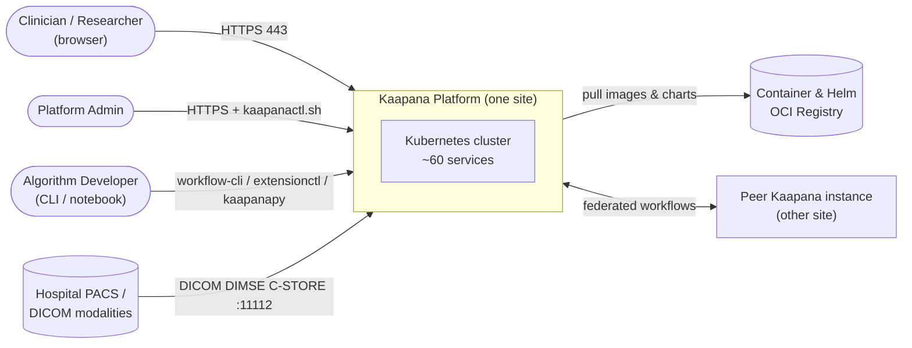
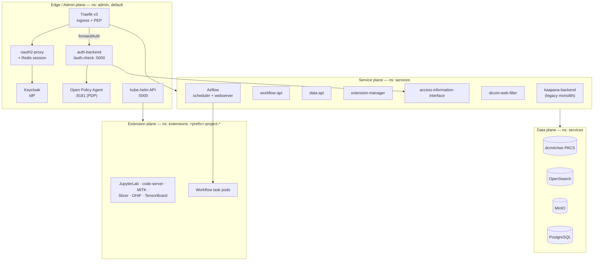
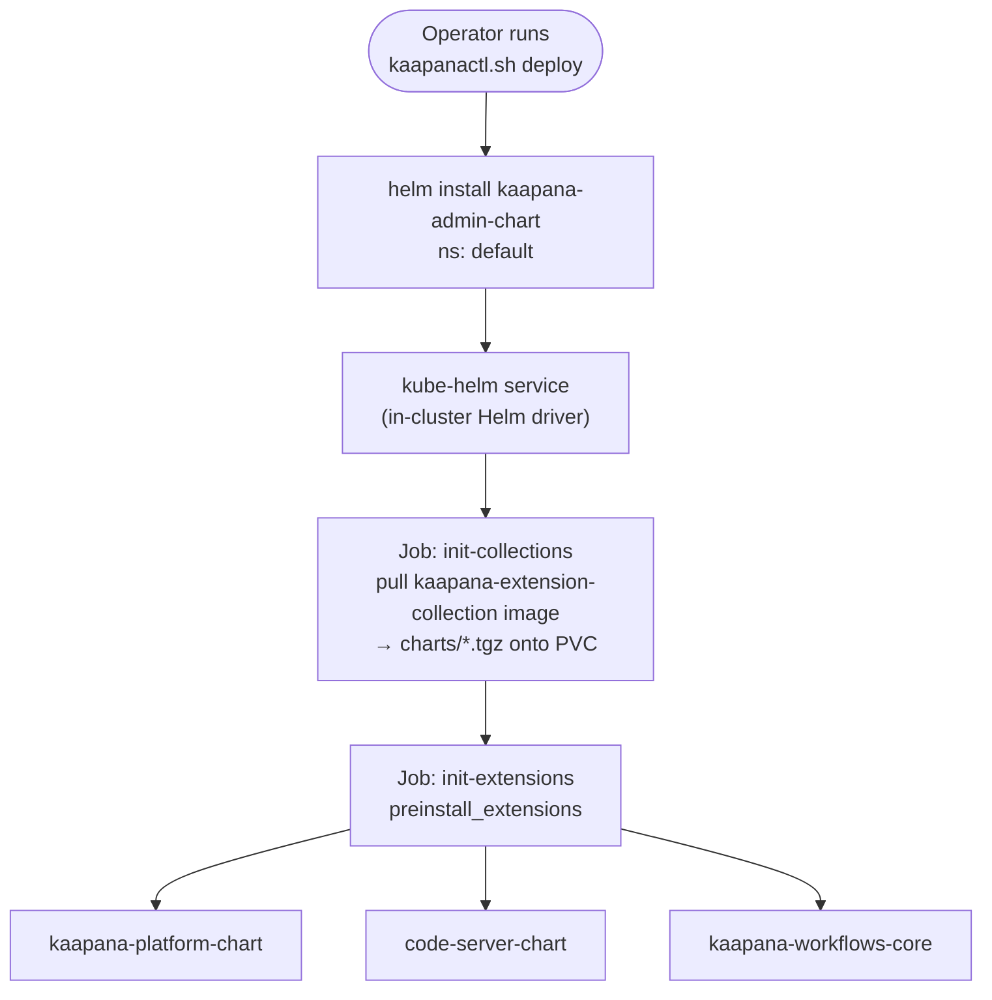
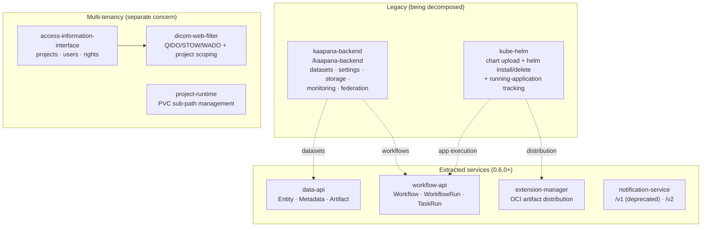
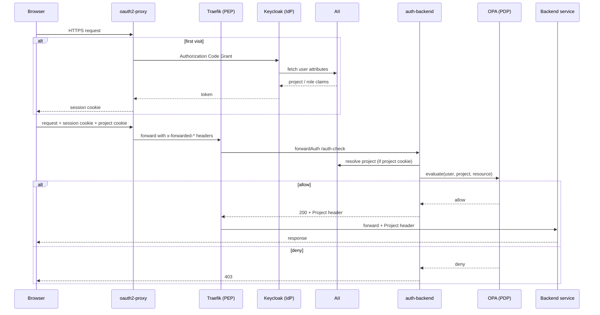
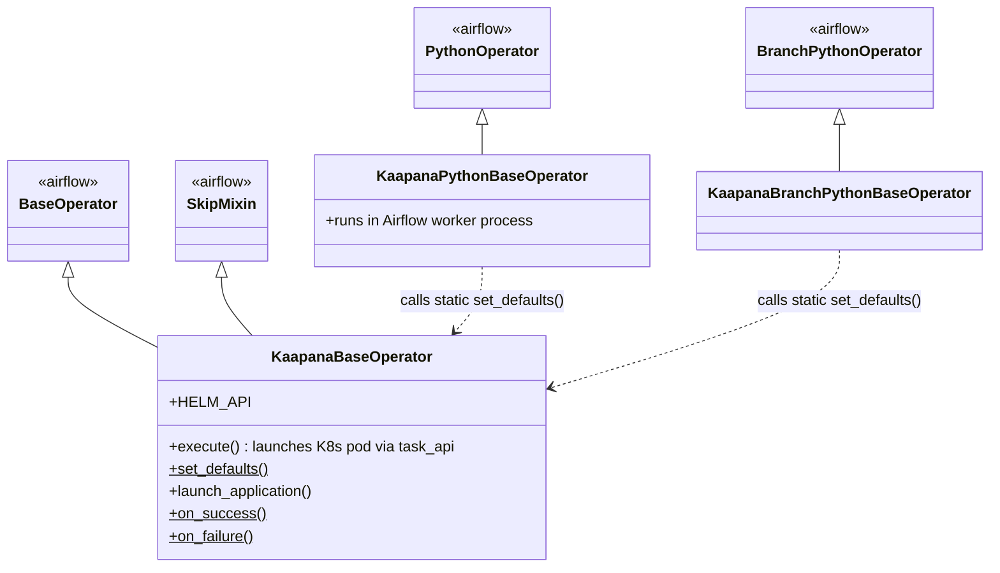
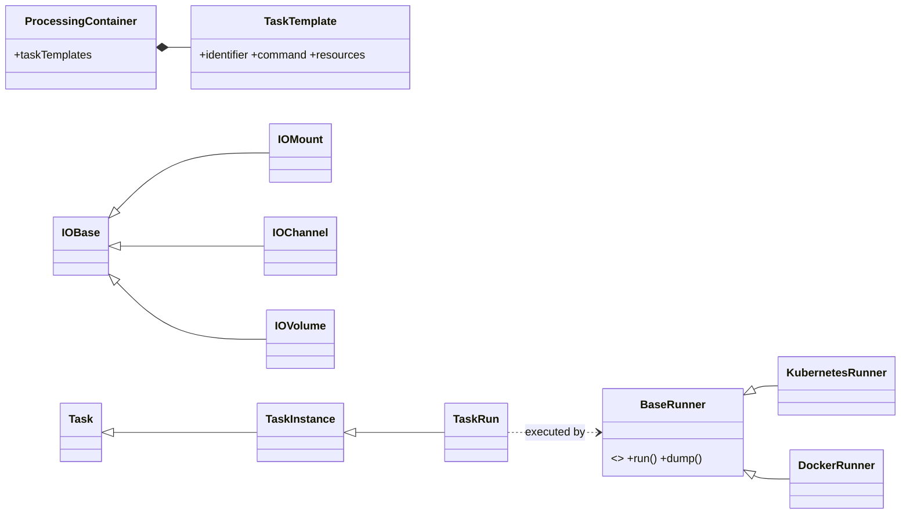
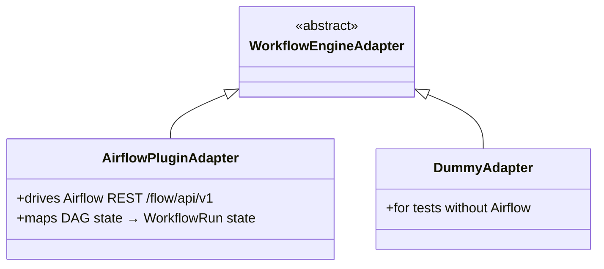
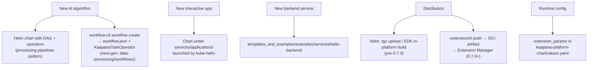

> Source: `https://github.com/kaapana/kaapana.git` @ `7d746f3` (branch `develop`, 2026-07-17) · Date: 2026-07-20 · Mode: **Explain** · Type: **Hybrid** (deployable platform + published Python libraries)
> See also: [User-Facing API & UX/DX](./kaapana_ux_design.md)

---

## 1. Overview

**Kaapana** is an open-source toolkit for provisioning medical-imaging research platforms. It is not a single application — it is a *distribution*: a curated set of ~60 containerized services, packaged as Helm charts, that install onto a Kubernetes cluster and together form a self-contained imaging research environment (PACS + object store + metadata search + workflow engine + AI pipelines + identity + monitoring), deployable inside a hospital firewall and federatable across sites.

The driving problem is stated in `README.md`: medical data cannot leave the institution, so the *computation* must travel to the data. Kaapana's answer is a platform that each site runs locally, with instance-to-instance federation for multi-center studies (RACOON, JIP, DART).

### Type classification

**Hybrid**, with evidence for both halves:

| Half | Evidence |
|---|---|
| **Application** (dominant) | `platforms/kaapana-admin-chart/Chart.yaml` (`kaapana_type: "platform"`), `kaapanactl.sh` (~2990-line install/deploy driver), `services/**/​*-chart/` Helm deployments, `.gitlab-ci.yml` deploy+integration-test stages |
| **Library** | five distributions under `lib/` with `pyproject.toml` — `kaapana-client`, `kaapana-containers`, `kaapana-extensions`, `task-api`, `kaapana-workflow-cli`; two publish `console_scripts` (`extensionctl`, `workflow-cli`); `build_cli/` publishes `kaapana-build` |

The libraries are not incidental — `task-api` defines the container-execution contract that the platform itself runs on, and `kaapana-client` (imported as `kaapanapy`) is baked into every processing image.

### Tech stack

| Layer | Technology |
|---|---|
| Orchestration | Kubernetes (microk8s reference distro; Rancher tested), Helm |
| Packaging | Docker/OCI images, Helm charts, OCI artifacts (0.7.0+) |
| Backend services | Python 3 · FastAPI · SQLAlchemy + Alembic · PostgreSQL · Pydantic v2 |
| Frontend | Vue 2 + Vuetify 2.7 (legacy landing page) · Vue 3 + Vuetify + Pinia (new UIs) |
| Workflow engine | Apache Airflow (behind an adapter interface) |
| Imaging | dcm4chee-arc 5.33.1 (PACS), OHIF, MITK, 3D Slicer, DCMTK, CTP |
| Search / metadata | OpenSearch 3.7 + OpenSearch Dashboards 3.6 |
| Object storage | MinIO |
| Identity / authz | Keycloak (OIDC) · oauth2-proxy · Open Policy Agent · Traefik v3 |
| Monitoring | Prometheus · Grafana · Loki/Promtail · Alertmanager · node-exporter |
| Build/CI | Typer-based `build_cli`, GitLab CI, Ansible (Harvester/KubeVirt), Trivy |

---

## 2. System Context (C4 L1)



Kaapana is deployed *per site*. Data enters via DICOM DIMSE (port 11112) or the web upload wizard; it never leaves. Federation moves **jobs and aggregated results**, not raw images.

---

## 3. High-Level Structure (C4 L2)

### 3.1 Repository organization

| Path | Responsibility |
|---|---|
| `platforms/` | The two top-level Helm charts: `kaapana-admin-chart` (bootstrap/control plane), `kaapana-platform-chart` (workload) |
| `services/` | Every deployed service — one dir per service, each with `*-chart/` (Helm) and/or `docker/` (image) |
| `data-processing/` | Airflow plugin, operator library, base images, AI pipelines, next-gen workflow charts |
| `lib/` | Five pip-installable Python packages (the reusable contracts) |
| `build_cli/` | `kaapana-build` — builds all images + charts, SBOMs, vuln scans, offline installer |
| `collections/kaapana-collection` | Meta-chart bundling ~35 extension charts into one installable OCI image |
| `utils/` | Base images, shared Helm library chart, storage chart, migration chart |
| `templates_and_examples/` | Scaffolds for new algorithms and services |
| `ci/` | GitLab CI code, Ansible VM provisioning, integration + Playwright tests |
| `docs/` | Sphinx documentation (the source of the concept narrative) |
| `kaapanactl.sh` | Single-file host installer + platform deployer |

### 3.2 Runtime planes



### 3.3 The two-chart bootstrap

This is the single most load-bearing structural fact, and it is not obvious from the directory names.



`platforms/kaapana-admin-chart/deployment_config.yaml` declares:

```yaml
admin_namespace: admin
services_namespace: services
extensions_namespace: extensions
kaapana_collections: [kaapana-extension-collection]
preinstall_extensions: [kaapana-platform-chart, code-server-chart, kaapana-workflows-core]
```

So **the admin chart is the only thing a human installs**; the platform chart is *extension #1*, installed by the admin chart's own `kube-helm` init job (`services/kaapana-admin/kube-helm/kube-helm-chart/templates/init_jobs.yaml`). This is why `build_cli`'s default `PLATFORM_FILTER` is `kaapana-admin-chart`, and why `kaapana-platform-chart` has no `deployment_config.yaml` of its own — it is a workload chart wearing a platform label.

---

## 4. Components (C4 L3) — the backend service landscape

Kaapana is mid-decomposition. Until 0.5.x almost all custom backend logic lived in one FastAPI app (`kaapana-backend`) with one schema. Since **0.6.0**, narrowly scoped services are being carved out one concern at a time, each following the same template: **FastAPI + its own PostgreSQL database + a dedicated Vue 3 frontend**.



### Component responsibilities

| Service | Path | Role |
|---|---|---|
| `kaapana-backend` | `services/base/kaapana-backend` | Legacy monolith. Routers `/client`, `/remote`, `/settings`, `/dataset`, `/monitoring`, `/storage`, `/admin`. Still owns DICOM metadata search (OpenSearch), settings, uploads, federation. |
| `workflow-api` | `services/base/workflow-api` | Engine-agnostic workflow model: `Workflow` → `WorkflowRevision` → `WorkflowRun` → `TaskRun`. All engine contact behind `WorkflowEngineAdapter`. |
| `data-api` | `services/base/data-api` | UUID-identified **entities** with backend-agnostic *storage coordinates* (PACS / S3 / filesystem / URL), schema-validated metadata, attached artifacts, parent links for provenance. |
| `extension-manager-service` | `services/base/extension-manager-service` | Pulls extensions as OCI artifacts from any registry; `repository/` + `installation/` routers, `dispatch/` consumers, `oci/` client. |
| `notification-service` | `services/base/notification-service` | Platform notifications (`/v1` deprecated, `/v2` current). |
| `access-information-interface` (AII) | `services/data-separation/access-information-interface` | The projects/users/rights authority. Provisions per-project MinIO buckets, OpenSearch indices, DICOM mappings and Helm namespaces (`projects/{minio,opensearch,dicom_data,kubehelm}.py`). Called by Keycloak during login for claim enrichment. |
| `dicom-web-filter` | `services/data-separation/dicom-web-filter` | DICOMweb proxy enforcing series-level project separation in front of dcm4chee. Routers per DICOMweb service: `QIDO_RS`, `STOW_RS`, `WADO_RS`, `WADO_URI`. |
| `kube-helm` | `services/kaapana-admin/kube-helm` | In-cluster Helm driver: chunked chart upload, `helm install/delete`, running-application tracking. Being split into extension-manager + workflow-api + a future Helm API. |
| `auth-backend` | `services/kaapana-admin/auth-backend` | Traefik `forwardAuth` target. Decodes JWT, optionally fetches the project from AII, asks OPA for allow/deny. |

### The authorization chain

Four things happen on every authenticated request (`docs/source/concepts/access_frontend/authorization_flow.rst`):



1. **Authentication at the edge** — oauth2-proxy terminates the OIDC code grant, reduces it to a cookie.
2. **Claim enrichment** — Keycloak calls AII at login so project/role data rides in the token instead of each service looking it up.
3. **Policy enforcement at Traefik** — Traefik is the PEP, auth-backend the adapter, OPA the PDP.
4. **Header-based trust downstream** — services trust the `Project` header Traefik attaches; they do not re-derive it.

The repo is candid about this design's costs (same doc): runtime coupling with no fallback if AII/auth-backend/OPA is down; design-time coupling across four links; project→data mappings duplicated across `kaapana-backend`, AII and dicom-web-filter; and **no standard pattern for service-to-service calls** — the whole chain assumes a browser session with a human in it.

---

## 5. OOP & Class Architecture

### 5.1 The Airflow operator hierarchy (`data-processing/kaapana-plugin/.../plugin/kaapana/operators/`)

The naming implies a tree. It is actually **three sibling roots** sharing behavior through a static method — a fact worth knowing before reading any DAG.



`KaapanaPythonBaseOperator` and `KaapanaBranchPythonBaseOperator` do **not** inherit from `KaapanaBaseOperator`. They call the static `KaapanaBaseOperator.set_defaults(self, ...)` and reuse its static lifecycle callbacks. Their two `__init__` bodies are near-verbatim copies of each other.

The real design axis is the `Local*` prefix:

| Family | Count | Execution | Examples |
|---|---|---|---|
| `KaapanaBaseOperator` subclasses | ~30 | Spawns a **Kubernetes pod** per task | `DcmSendOperator`, `GetInputOperator`, `PyRadiomicsOperator`, `Json2MetaOperator`, `ResampleOperator` |
| `KaapanaPythonBaseOperator` subclasses (`Local*`) | ~24 | Runs **in the Airflow worker process** (`LocalExecutor`), so it can reach services-namespace volumes | `LocalGetInputDataOperator`, `LocalDcm2JsonOperator`, `LocalTaggingOperator` |
| `KaapanaBranchPythonBaseOperator` subclasses | 1 | Branching | `LocalDcmBranchingOperator` |

Several operators exist as **duplicated pairs** across both families (`GetInputOperator`/`LocalGetInputDataOperator`, `Json2MetaOperator`/`LocalJson2MetaOperator`, `MinioOperator`/`LocalMinioOperator`, …). The containerized versions are the migration target.

### 5.2 The Task API — the declarative successor (`lib/task_api/`)

The most consequential abstraction in the repo. Historically every processing container was wired into a workflow by hand-written Python. Task API replaces that with a **declared contract**: a container ships a `processing-container.json` describing its task templates, I/O channels and command; a runner library executes it from that declaration alone.



Two model layers, deliberately separated:

- `task_api/processing_container/pc_models.py` — what a container **declares**: `ProcessingContainer`, `TaskTemplate`, `Resources`, `ScaleRule`, `IOMount`.
- `task_api/processing_container/task_models.py` — what a **run** looks like: `Task` → `TaskInstance` → `TaskRun`, `IOChannel`, `IOVolume`, `DockerConfig` / `K8sConfig`.

Crucially, `KaapanaBaseOperator.execute()` **no longer uses Airflow's `KubernetesPodOperator`**. It synthesizes a `TaskTemplate(identifier="main", ...)`, wraps it in a `Task`, and hands it to `KubernetesRunner.run()`. So every existing DAG already runs on Task API internally.

### 5.3 The engine adapter (`services/base/workflow-api/docker/files/app/adapters/`)



This is the seam that makes "replace Airflow" a tractable future change: the `Workflow`/`WorkflowRun`/`TaskRun` persistence model is Kaapana's own, and nothing above the adapter knows about DAGs.

### 5.4 Patterns in use

| Pattern | Where | Why |
|---|---|---|
| **Adapter** | `WorkflowEngineAdapter` (+ Airflow / Dummy) | Decouple the workflow model from Airflow; enables testing without an engine |
| **Strategy** | `BaseRunner` → `KubernetesRunner` / `DockerRunner` | Same task declaration runs on K8s in-cluster or plain Docker locally |
| **Repository** | `data-api/services/entity_repository.py`, per-domain `crud.py` modules | Isolate persistence from FastAPI routers |
| **Template Method** | `KaapanaBaseOperator.execute()` with three branches (application / dev-server / task pod) | One lifecycle, three launch strategies |
| **Sidecar / PEP-PDP** | Traefik `forwardAuth` → auth-backend → OPA | Externalize authorization from every service |
| **Plugin registry (filesystem)** | Airflow DAG PVC + Helm installer jobs | Extensions add DAGs without redeploying Airflow |
| **Declarative contract over code** | `processing-container.json` + `tasks/*.json` | Move wiring out of Python into data |

---

## 6. Key Flows

### 6.1 DICOM ingestion (the platform's front door)

```mermaid
sequenceDiagram
    participant M as Modality / DCMTK
    participant C as CTP receiver :11112
    participant P as dcm4chee PACS
    participant A as Airflow
    participant O as OpenSearch
    participant MI as MinIO

    M->>C: C-STORE (AE title = kp-&lt;dataset&gt;, called AE = kp-&lt;project-short-id&gt;)
    C->>P: store series
    C->>A: trigger service-process-incoming-dcm DAG
    A->>A: LocalDcm2JsonOperator — extract metadata
    A->>O: index into project_&lt;short_id&gt; + admin index
    A->>A: create series↔project mappings
    A->>MI: store thumbnail
    A->>A: validate DICOM
    A->>O: write validation results as metadata
    A->>MI: store HTML validation report
```

The AE-title convention is the routing mechanism: **calling AE title = project short id**, **called AE title = dataset name**. A project's short id also names its MinIO bucket (`project-<short_id>`) and OpenSearch index (`project_<short_id>`), so tenancy is legible straight through the storage layer.

### 6.2 Workflow execution

```mermaid
sequenceDiagram
    participant U as User (Workflow Execution UI)
    participant B as kaapana-backend / workflow-api
    participant A as Airflow scheduler
    participant Op as KaapanaBaseOperator
    participant R as task_api KubernetesRunner
    participant K as Kubernetes
    participant S as PACS / MinIO / OpenSearch

    U->>B: select runner instance + DAG + dataset
    B->>A: trigger DAG run (POST /kaapana/api/trigger/&lt;dag_id&gt;)
    A->>Op: execute task
    Op->>R: run(Task with synthetic TaskTemplate "main")
    R->>K: create pod (image, mounts, resources, GPU)
    K-->>R: pod phase transitions
    Op->>Op: _monitor_task_run()
    K->>S: container reads inputs / writes outputs
    Op-->>A: success / skip (exit 126) / failure
    A-->>B: DAG run state
    B-->>U: job status
```

Note `KAAPANA_SKIP_TASK_RUN_RETURN_CODE = 126` — the exit-code protocol a container uses to tell Airflow "skip me", rather than fail.

### 6.3 Build → deploy

```mermaid
sequenceDiagram
    participant D as Developer (build host)
    participant BC as kaapana-build
    participant Reg as OCI Registry
    participant Op as Operator (target host)
    participant Ctl as kaapanactl.sh
    participant Cl as Kubernetes cluster

    D->>BC: pip install -e build_cli/ ; kaapana-build
    BC->>BC: parse Dockerfiles → dependency graph → threaded builds
    BC->>BC: helm lint + kubeval every chart (fake-values.yaml)
    BC->>Reg: push images (tag = git describe) + admin chart .tgz + collection
    Op->>Ctl: sudo ./kaapanactl.sh install
    Ctl->>Op: snapd, helm, microk8s (rbac, dns, hostpath, nodeport 80-32000)
    Op->>Ctl: ./kaapanactl.sh deploy --chart .../kaapana-admin-chart:&lt;v&gt;
    Ctl->>Ctl: setup_storage_provider → setup_storage_classes → migrate
    Ctl->>Cl: helm install kaapana-admin-chart (~60 --set-string globals)
    Cl->>Reg: init-collections job pulls extension collection
    Cl->>Cl: init-extensions job installs kaapana-platform-chart, code-server, workflows-core
    Op->>Ctl: ./kaapanactl.sh deploy --check-system
```

**Build and deploy are deliberately decoupled** (`docs/source/installation_guide/build.rst`): the repo is built on one machine, artifacts land in a registry, and the deployment server only needs `kaapanactl.sh` plus registry access. Air-gapped sites use `--offline` with a pre-imported image tarball (~80 GB).

Two ancillary charts run *outside* the platform release, driven by `kaapanactl.sh`:
- `utils/kaapana-storage-chart` → release `kaapana-storageclass` in ns `kaapana-system`, creating `kaapana-hostpath-*` (single node) or `kaapana-longhorn-*` (multi-node) StorageClasses.
- `utils/migration-chart` → a one-shot `Job` (`backoffLimit: 0`) run when `$FAST_DATA_DIR/version` differs in major.minor from the target, with step scripts `migration-0.3.x-0.4.x.sh` … `migration-0.6.x-0.7.x.sh`, then uninstalled.

---

## 7. Extension Points

Kaapana is designed around extension; there are five distinct seams, at different maturity levels.



1. **Workflows / DAGs.** Legacy path: a Helm chart whose Docker image is `FROM local-only/base-installer`, copying `dags/*.py` and `plugin/` into `/kaapana/tmp/dags`; an installer job drains that onto the Airflow DAG PVC and the scheduler picks it up. Scaffold at `templates_and_examples/templates/processing-pipelines/template/`. New path: `data-processing/workflows/` — the workflow *is* a Helm chart, registered by a ConfigMap + installer job (`helpers/templates/_workflow_helpers.tpl`) against `workflow-api`, with `workflow.json` declaring `ui_form` parameters.
2. **Processing containers.** Ship a `processing-container.json` declaring task templates and I/O channels; `KaapanaTaskOperator`'s `iochannel_maps` wires an upstream output channel to a downstream input channel. Composing multi-step pipelines becomes a channel-name mapping rather than Python glue.
3. **Applications.** A chart under `services/applications/` (JupyterLab, code-server, MITK/Slicer workbench, SLIM, Collabora, TensorBoard, …), installed at runtime via `kube-helm`, or launched per-workflow via `KaapanaBaseOperator(launch_application_chart=...)`. Note `KaapanaApplicationOperator` is **explicitly deprecated** in its own docstring in favor of that kwarg.
4. **Distribution.** Two coexisting paths — the Helm `.tgz` upload (three build routes: local build + manual upload, in-platform EDK build, air-gapped transfer), and the 0.7.0 Extension Manager pulling OCI artifacts from any registry (currently `workflow-v1` content type only; task and application installers anticipated).
5. **Configuration.** `kaapana-platform-chart/values.yaml`'s `extension_params:` block is a typed schema (default/definition/type/value) surfaced directly in the extensions UI — hostname, ports, data dirs, GPU support, login branding, pull policies.

### The extension collection

`collections/kaapana-collection/` is a Helm meta-chart (`kaapana_type: extension-collection`) whose `requirements.yaml` lists ~35 charts at placeholder `version: "0.0.0"` (rewritten at build time). Its `Dockerfile` does exactly one thing: `COPY charts/*.tgz /kaapana/tmp/extensions/`. Packaged charts therefore ride *inside an OCI image*, which the `init-collections` job drains onto a PVC. This is the pre-0.7.0 distribution mechanism.

---

## 8. Key Abstractions / Glossary

| Term | Meaning |
|---|---|
| **platform** | A running Kaapana instance on a server, reached via browser. |
| **kaapana-admin-chart** | The bootstrap chart — reverse proxy, auth, kube-helm. The only chart a human installs. |
| **kaapana-platform-chart** | The workload chart (Airflow, PACS, MinIO, landing page, backends). Installed as preinstalled extension #1. |
| **project** | The multi-tenancy unit. Has an 8-char *short id* naming its MinIO bucket (`project-<id>`), OpenSearch index (`project_<id>`), and DICOM AE title. Governed by AII. |
| **dataset** | A named grouping of series within a project; set via the DICOM sending AE title (`kp-<dataset>`). |
| **workflow** | Binds jobs, their data, orchestration, and runner instances. In the new model: a versioned definition with revisions and runs. |
| **DAG** | An Airflow pipeline defined in Python linking operators output→input. |
| **operator** | An Airflow task class. `Local*` = runs in the Airflow worker; otherwise = spawns a K8s pod. |
| **processing-container** | A container that performs one processing step, declaring its contract in `processing-container.json`. |
| **task-api** | The Python library + JSON schema defining that declarative contract, plus Docker/K8s runners. |
| **extension** | An installable Helm chart or OCI artifact: a workflow, task, or application. |
| **collection** | A meta-chart bundling many extension charts into one distributable image. |
| **runner-instance** | The Kaapana instance on which a workflow's jobs actually execute (local, remote, or federated). |
| **local / remote / federated execution** | Orchestrated here and run here; orchestrated here and run elsewhere; orchestrated here and run on several instances reporting back. |

---

## 9. Open Questions & Notes

### Architectural tensions the repo names itself

- **Two operator generations run side by side.** `KaapanaBaseOperator` + ~55 subclasses (config in Python kwargs) vs `KaapanaTaskOperator` (config in JSON, lives in the *workflow-api service*, not the Airflow plugin, imported as `task_api_operators.KaapanaTaskOperator`). Only `register-dicoms` and `test-task-operator` use the new one today. Any DAG-level diagram that shows only one generation is misleading.
- **Two distribution paths.** Helm `.tgz` upload and OCI Extension Manager coexist; Extension Manager handles only `workflow-v1` so far.
- **Two workflow backends.** `kaapana-backend`'s workflow endpoints and `workflow-api` overlap during migration; `app/workflows_unused/` is dead legacy in-tree.
- **`kube-helm` does two unrelated jobs** (chart distribution + running-application tracking) and is explicitly slated to split three ways.
- **Authorization data is duplicated** across `kaapana-backend`, AII and dicom-web-filter — the docs flag that these can disagree about who owns what.
- **No service-to-service auth pattern.** The whole chain assumes a browser session; there is no client-credentials grant, by design (`docs/source/concepts/access_frontend/programmatic_access.rst`), which also means in-cluster code cannot mint its own token.

### Not determined from this pass

- The **runtime behavior of federation** (instance registration, fernet encryption, remote job confirmation) is documented at the UX level but I did not trace the `workflows/routers/remote.py` code path end to end. The docs say federation is expected to be extracted into its own FL-framework-agnostic service, but no such service exists in-tree yet.
- **Airflow's admission control** (`kubetools/utilization_service.py`, `prometheus_query.py`) gates task scheduling on cluster CPU/RAM/GPU headroom before Kubernetes sees the pod. I read the module names but not the algorithm.
- **GPU sharing by memory** rather than whole-device allocation is described in `docs/source/concepts/platform_architecture/gpu_sharing.rst`; the implementing mechanism was not traced.
- **`project-runtime`** is the only service with a Docker build but no Helm chart. Whether it is deployed by another chart's template or is not yet wired in was not established.
- **Multi-node** is supported and tested on microk8s and Rancher only. The documented portability gap is load balancing: bare metal uses `NodePort`, cloud clusters expect `LoadBalancer`, and the service type is not yet Helm-templated.
- **Version numbering is inconsistent in-tree**: charts carry placeholder `version: "0.0.0"` rewritten at build time, `kaapana-platform-chart` declares `appVersion: "0.1.4"`, while the docs and constraints files reference platform 0.7.0. The authoritative version at runtime is `git describe`, injected by `build_cli`.
