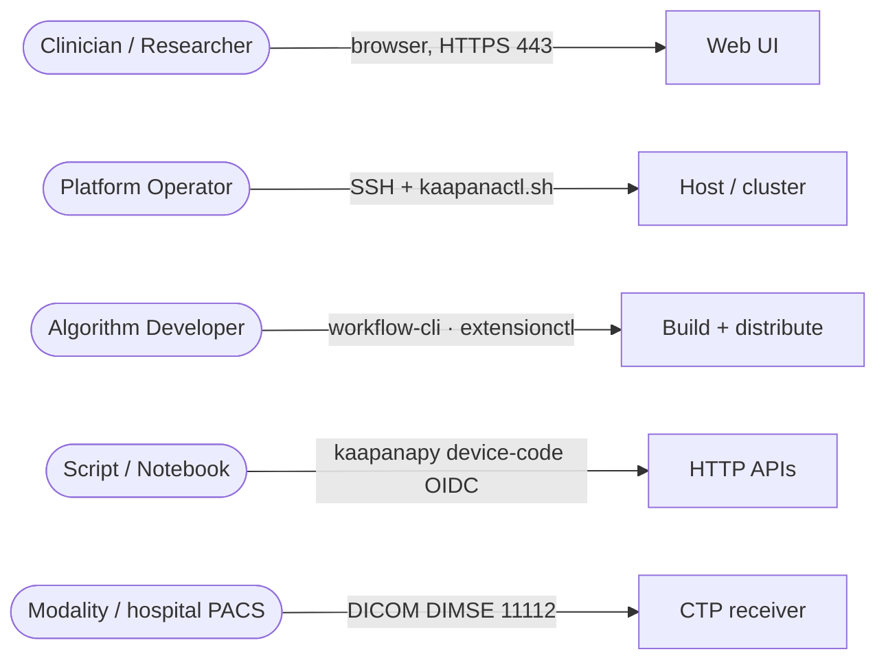
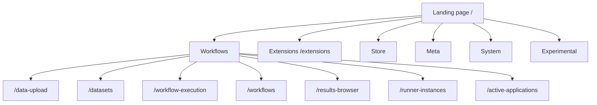
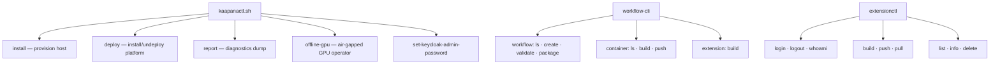
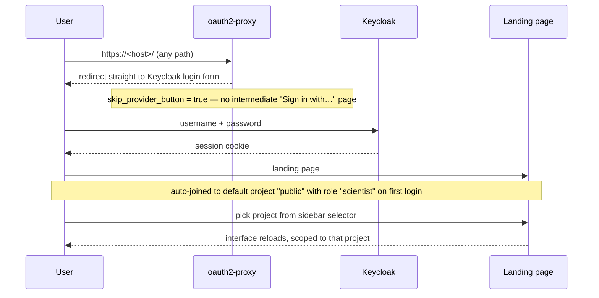
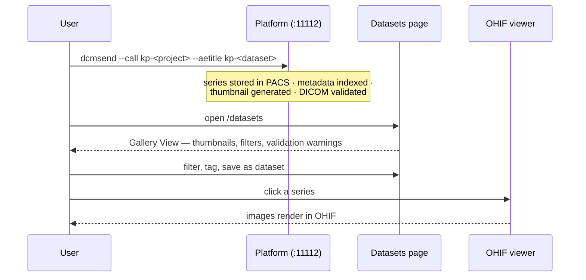
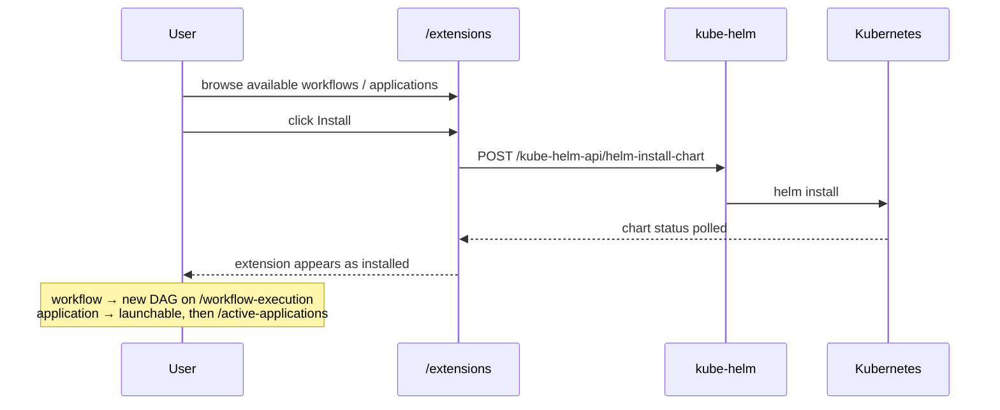
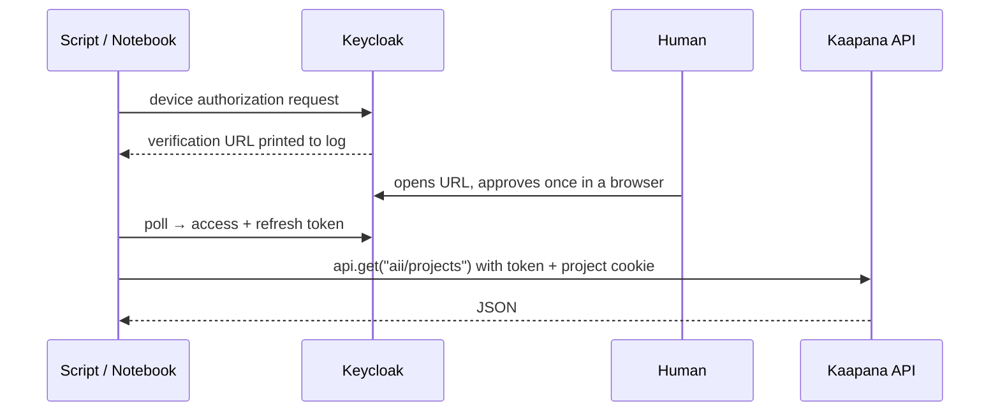
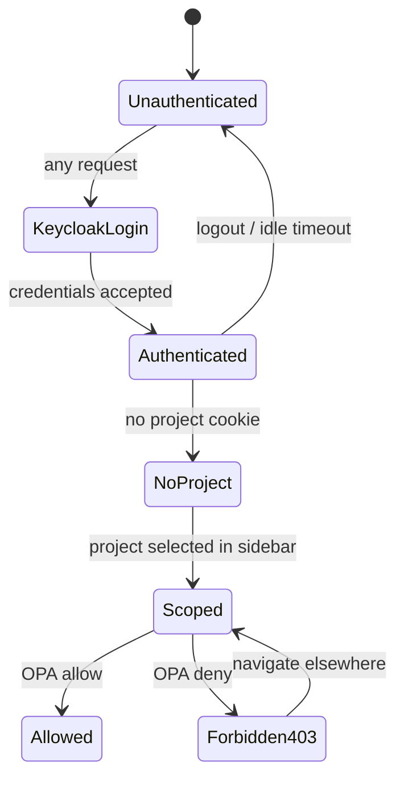

> Source: `https://github.com/kaapana/kaapana.git` @ `7d746f3` (branch `develop`, 2026-07-17) · Date: 2026-07-20 · Mode: **Explain** · Surface: **Hybrid** (GUI app + Web API + CLI + Library)
> See also: [System & OOP Architecture](./kaapana_system_oop_architecture.md)

---

## Cheat Sheet

**Send DICOM into the platform** (the primary ingress — calling AE = project, called AE = dataset):

```bash
dcmsend -v <host> 11112 \
  --aetitle kp-<dataset-name> \
  --call kp-<project-short-id> \
  --scan-directories --scan-pattern '*.dcm' --recurse <dicom-dir>
```

**Deploy / operate the platform:**

```bash
sudo ./kaapanactl.sh install                                   # provision host: snapd, helm, microk8s
./kaapanactl.sh deploy --chart <registry>/kaapana-admin-chart:<v> \
  --username <u> --password <p> --domain <fqdn> --platform-prefix <prefix>
./kaapanactl.sh deploy --check-system --platform-prefix <prefix>   # verify rollout
./kaapanactl.sh report                                          # microk8s diagnostics dump
./kaapanactl.sh deploy --undeploy                               # tear down
```

**Build the distribution** (on a separate build host):

```bash
pip install -e build_cli/
kaapana-build --default-registry <registry>          # all images + charts; -oi offline installer, -vs vuln scan
```

**Author a workflow:**

```bash
workflow-cli workflow create my-workflow -e airflow
workflow-cli workflow validate my-workflow --strict
workflow-cli container build --push --registry-prefix <registry>
workflow-cli workflow package my-workflow --lint
```

**Distribute it as an OCI extension (0.7.0+):**

```bash
extensionctl login <registry>
extensionctl build && extensionctl push
extensionctl list
```

**Call the platform from Python** (device-code OIDC — a human approves once in a browser):

```python
from kaapana_client.services.ApiService import KaapanaApiService

api = KaapanaApiService(
    root_url="https://<host>",
    project_id="d7e991b3-9463-48e7-98c2-661da8b83018",
    client_id="kaapana",
    client_secret=None,
)
api.get("aii/projects")          # endpoint is relative to root_url
```

**Key URLs** (all behind one hostname, all requiring login): `/` landing page · `/datasets` · `/workflow-execution` · `/extensions` · `/flow/home` Airflow · `/meta` OpenSearch Dashboards · `/ohif` viewer · `/minio-console` · `/auth` Keycloak · `/kaapana-backend/docs` OpenAPI.

---

## 1. Overview

Kaapana presents itself to its users as **a single website behind one hostname**. Everything — the Kaapana-authored UI, Airflow, the PACS admin console, OpenSearch Dashboards, MinIO, Keycloak, Grafana, the OHIF image viewer — lives under one domain, one login, and one left-hand sidebar. The user never sees that they are being routed to a dozen different upstream products.

Behind that GUI sit three more surfaces: a set of documented **HTTP APIs** (every backend serves `/docs` + `/openapi.json`), four **CLIs**, and a **Python SDK**.

### Surface classification: Hybrid

| Surface | User | Evidence |
|---|---|---|
| **GUI app** (dominant) | Clinician / researcher | `services/utils/base-landing-page/files/kaapana_app/src/routes/routes.ts` (11 routes), five Vue 3 micro-frontends, `docs/source/user_guide/` mirroring the sidebar 1:1 |
| **Web API** | Client developer, federated peer instance | 8 FastAPI apps with mounted routers and served OpenAPI; `dicom-web-filter` exposes standard DICOMweb |
| **CLI** | Platform operator, algorithm developer | `kaapanactl.sh` (6 subcommands), `kaapana-build`, `workflow-cli`, `extensionctl` (console_scripts in `pyproject.toml`) |
| **Library / SDK** | Algorithm developer, notebook user | `kaapana_client` (imported as `kaapanapy`, baked into every processing image), `task_api` |

### Who the user is

Four distinct personas reach the system by different doors, and the surface is genuinely different for each:



Only **three external ports** exist: 80 (redirects to HTTPS), 443, and 11112 (DICOM DIMSE). That is the entire attack and integration surface.

---

## 2. Surface Map

### 2.1 GUI — sitemap

The interface is driven by a collapsible **left sidebar** (`v-navigation-drawer`), not a top bar.



**Native Vue 2 routes** (`src/routes/routes.ts`) — the Kaapana-authored app itself:

| Route | Name | What the user does |
|---|---|---|
| `/` | `home` | Landing page (the only public route) |
| `/data-upload` | `data-upload` | Upload zip/NIfTI via browser; get a tailored `dcmsend` command |
| `/datasets` | `datasets` | Explore, filter, tag and curate series; Gallery View with thumbnails |
| `/workflow-execution` | `workflow-execution` | Configure and start a workflow (the only place runs are started) |
| `/workflows` | `workflows` | Workflow List — running/past workflows, abort, confirm remote jobs |
| `/results-browser` | `results-browser` | Browse static HTML results produced by workflows |
| `/runner-instances` | `runner-instances` | Instance Overview — register and manage federated peer instances |
| `/active-applications` | `active-applications` | See and stop running interactive apps |
| `/extensions` | `extensions` | Install/uninstall workflows and applications |
| `/web/:iFrameUrl` | `iframe-view` | Embedded external page |
| `/web/:ewSection/:ewSubSection` | `ew-section-view` | Embedded page in a nav section (guests redirected home) |

**Embedded upstream products.** The Store / Meta / System / Experimental sections are *not* hardcoded routes — they are generated from `defaultExternalWebpages.json` (in the landing-page chart's ConfigMap), filtered at runtime against `GET /kaapana-backend/get-traefik-routes` so only actually-deployed services appear:

| Section | Entries |
|---|---|
| **Store** | OHIF `/ohif/` · SLIM `/slim/` · MinIO `/minio-console/` · Documents `/collabora-wopi/` · Persistence Layer `/persistence/` |
| **Meta** | Auto-generated from OpenSearch Dashboards saved dashboards → `/meta/app/dashboards#?title=<title>&embed=true` |
| **System** | Airflow `/flow/home` · Kubernetes `/kubernetes/` · Keycloak `/auth/admin/...` · Traefik `/traefik/dashboard/` · JupyterLab `/jupyterlab` · PACS `/dcm4chee-arc/ui2/` · Prometheus · Grafana · Projects `/projects-ui/` · Documentation `/docs/` |
| **Experimental** | Workflows V2 `/workflow-ui/workflows` · Workflow Runs V2 `/workflow-ui/runs` · Data `/data-ui/` · Extension Manager `/extension-manager-ui/` |

**Vue 3 micro-frontends** (the v2 generation, surfaced only under "Experimental"):

| Mount | Routes |
|---|---|
| `/workflow-ui` | `/workflows`, `/runs` |
| `/extension-manager-ui` | `/catalog`, `/extensions`, `/repositories` |
| `/data-ui` | `/` (entities) |
| `/projects-ui` | `/`, `/project/:id`, `/role-rights` |

### 2.2 URL → service map (single hostname, Traefik)

| Path | Service | Path | Service |
|---|---|---|---|
| `/` | Landing page | `/flow` | Airflow |
| `/kaapana-backend` | Main backend API | `/pacs`, `/dcm4chee-arc` | dcm4chee PACS |
| `/workflow-api`, `/workflow-ui` | Workflow API v2 + UI | `/minio-console` | MinIO |
| `/data-api`, `/data-ui` | Data API + UI | `/ohif`, `/slim` | Image viewers |
| `/extensions-api`, `/extension-manager-ui` | Extension Manager | `/os`, `/meta` | OpenSearch + Dashboards |
| `/aii` | Access Information Interface | `/auth` | Keycloak |
| `/dicom-web-filter` | DICOMweb (project-scoped) | `/kube-helm-api` | Helm/K8s admin API |
| `/notifications` | Notification service | `/prometheus`, `/grafana`, `/loki` | Monitoring |
| `/projects-ui` | Project management | `/kubernetes`, `/traefik` | Cluster dashboards |

### 2.3 HTTP API catalog

Every backend below serves interactive OpenAPI docs at `<prefix>/docs` and a spec at `<prefix>/openapi.json`.

| API | Prefix | Notable endpoints |
|---|---|---|
| **kaapana-backend** | `/kaapana-backend` | `/client/job`, `/client/jobs`, `/client/workflow`, `/client/dags`, `/client/file` (chunked upload), `/client/get-ui-form-schemas`, `/dataset/series`, `/dataset/series/{uid}/thumbnail`, `/dataset/tag`, `/dataset/download`, `/settings`, `/monitoring/metrics`, `/storage/project-bucket-tree`, `/get-traefik-routes`, `/open-policy-data`, `/oidc-logout` |
| **kaapana-backend (federation)** | `/kaapana-backend/remote` | `/job`, `/jobs`, `/workflow`, `/sync-client-remote`, `/minio-presigned-url` — peer-instance API, token-header auth, **excluded from the login gate** |
| **Workflow API v2** | `/workflow-api/v1` | `/workflows`, `/workflows/{id}` (GET/PATCH/DELETE), `/workflows/{id}/tasks`, `/workflow-runs` (GET/POST), `/workflow-runs/{id}`, `/workflow-runs/{id}/clean`, `/workflow-runs/sync`, `/health`, **WebSocket `/ws`** |
| **Data API** | `/data-api/v1` | `/entities` (POST/GET/DELETE), `/entities/{id}`, `/entities/query`, `/metadata/keys`, `/artifacts`, `/health` |
| **Extension Manager** | `/extensions-api` | `/repositories` (CRUD), `/repositories/{id}/extensions`, `/extensions` (POST install), `/extensions/{id}/uninstall` |
| **AII** | `/aii` | `/projects` (CRUD), `/projects/{id}/archive`, `/projects/{id}/users`, `/projects/rights`, `/projects/roles`, `/users/current`, `/users/{keycloak_id}` |
| **DICOM Web Filter** | `/dicom-web-filter` | Standard DICOMweb: QIDO-RS `/studies`, `/studies/{s}/series`; WADO-RS `/studies/{s}/metadata`; STOW-RS `POST /studies`; WADO-URI `/wado-uri/wado`; plus `/studies/{s}/series/{x}/thumbnail` |
| **Notifications** | `/notifications` | `/v2` (current), `/v1` (deprecated): `POST /{project_id}/{user_id}`, `GET /`, `PUT /{id}/read` |
| **Kube-Helm** | `/kube-helm-api` | `/helm-install-chart`, `/helm-delete-chart`, `/extensions`, `/active-applications`, `/filepond-upload`, `/import-container`, `/view-chart-status` |

### 2.4 Command trees



| CLI | Distribution | Entry point | For |
|---|---|---|---|
| `kaapanactl.sh` | shipped in repo root | shell script | Operator: install host, deploy platform |
| `kaapana-build` | `pip install -e build_cli/` | `build_cli.cli:main` (Typer) | Build engineer: build all images + charts |
| `workflow-cli` | `kaapana-workflow-cli` | `workflow_cli.cli:cli` (Click) | Developer: scaffold, validate, package workflows |
| `extensionctl` | `kaapana-extensions` | `kaapana_extensions.cli:app` (Typer) | Developer: push/pull OCI extensions |
| `task_api` CLI | `task-api` | `task_api/cli.py` (Typer) — **no `console_scripts` declared**; invoke as `python -m` | Developer: run/validate a single processing container |

### 2.5 Python SDK

`kaapana_client` is published as `kaapana-client` but **imported as `kaapanapy`** (a shim distribution installed into every `base-python-cpu` image), so processing containers get it for free.

| Symbol | Purpose |
|---|---|
| `KaapanaApiService(root_url, project_id, client_id, client_secret)` | HTTP client with `.get/.post/.put/.delete/.head(endpoint, **kwargs)`; endpoints are relative |
| `get_api_service_from_env()` | Factory from env vars — works out of the box inside a JupyterLab app |
| `HelperDcmWeb`, `HelperOpensearch`, `HelperMinioSessionManager` | Direct access to PACS / index / object store |
| `get_opensearch_client()`, `get_minio_client()`, `load_workflow_config()` | Module-level conveniences for operator code |
| `NotificationService`, `Notification` | Post a notification to a user or project |
| `get_project_settings()`, `get_operator_settings()`, … | Typed pydantic settings from the injected environment |

---

## 3. Entry & Onboarding

### 3.1 The clinician's first encounter



Two onboarding details matter and are easy to miss:

- **A user is auto-added to a default project on first login** (name `public`, role `scientist`, configurable via the `defaultProject.yaml` ConfigMap in the Keycloak chart). Without this, a new user would see an empty platform.
- **The interface only works correctly once a project is selected**, because the project cookie is what triggers project-scoped policy evaluation. This is flagged as an `.. important::` in the docs, which is a fair signal that it surprises people.

Accounts are created by an admin in Keycloak (`/auth`), joining one of three groups: `kaapana_user`, `kaapana_project_manager`, `kaapana_admin`.

### 3.2 The operator's first run

Build and deploy are **deliberately decoupled** — a documented "typical misconception" is that you must clone and build on the deployment server. You do not; the deployment server needs only `kaapanactl.sh` and registry access.

```bash
# On the build host
git clone -b master https://github.com/kaapana/kaapana.git
pip install -e kaapana/build_cli
cp .env_template .env      # set DEFAULT_REGISTRY, REGISTRY_USER, REGISTRY_PW
kaapana-build

# On the target server
sudo ./kaapanactl.sh install
./kaapanactl.sh deploy --chart <registry>/kaapana-admin-chart:<version> \
  --username <u> --password <p> --domain <fqdn> --platform-prefix <prefix>
```

The deploy prints the generated Keycloak admin password to the terminal — the one credential handed back to the operator. Budget ~90 GB of disk for a full build, ~80 GB more for an offline tarball.

### 3.3 The developer's smallest hello-world

```bash
workflow-cli workflow create my-workflow -e airflow   # scaffolds Chart.yaml, values.yaml, workflow.json, a demo DAG
workflow-cli workflow validate my-workflow --strict
workflow-cli workflow package my-workflow --lint      # → .tgz to upload on /extensions
```

The older scaffold is `templates_and_examples/templates/processing-pipelines/template/` (copy, rename the two operator stubs); the tutorial algorithm is `examples/processing-pipelines/otsus-method`.

---

## 4. Key User Journeys

### 4.1 Get images in and see them



The user gets a **tailored `dcmsend` command for their deployment** from the Data Upload wizard rather than having to assemble it — a nice touch, since the AE-title convention (`--call` = project short id, `--aetitle` = dataset name) is otherwise non-obvious.

### 4.2 Run a workflow

```mermaid
sequenceDiagram
    participant U as User
    participant WE as Workflow Execution
    participant WL as Workflow List
    participant RB as Results Browser

    U->>WE: select runner instance(s)
    U->>WE: select DAG → form renders from its JSON schema
    U->>WE: select dataset (or arrive pre-filled from /datasets)
    U->>WE: Start
    WE-->>U: redirect to Workflow List
    WL-->>U: live job status; abort available
    U->>RB: browse generated HTML reports
```

`/workflow-execution` is **the only place in the platform where a run can be started** — a deliberate single point of entry. DAG-specific parameter forms are rendered from JSON schema (`@koumoul/vjsf`) served by `GET /kaapana-backend/client/get-ui-form-schemas`, so a new workflow gets a UI for free by declaring `ui_form` in its `workflow.json`.

### 4.3 Federated / remote execution

Three modes, all started from the same page:

| Mode | Orchestrated by | Runs on |
|---|---|---|
| Local | this instance | this instance |
| Remote | this instance | another instance |
| Federated | this instance | several instances, reporting back |

The trust model is explicit and mutual: peer instances register with a random 36-char token; communication can be SSL-verified and Fernet-encrypted with a 44-char key; each site chooses whether to auto-execute incoming jobs or hold them for manual confirmation in the Workflow List; and **any site can always abort jobs running on its own hardware**. That last property is the point — a site never surrenders control of its own compute.

### 4.4 Install an extension



### 4.5 Programmatic access



**Device Authorization Grant is the only supported flow.** There is no client-credentials grant, so nothing — not even code running inside the cluster — can silently mint a token; a human must approve once. A JupyterLab session launched from the Extensions page receives `KAAPANA_PROJECT_ID`, `KAAPANA_CLIENT_ID` and `KAAPANA_CLIENT_SECRET` so `get_api_service_from_env()` works immediately, but it is still **not** handed a pre-authorized token — the first call triggers the same one-time approval.

---

## 5. Interaction & State

### 5.1 Authorization outcomes



A denied request returns **403** rendered from `403.html` served by the auth-backend. Sidebar entries the user cannot reach are hidden client-side: the frontend fetches `GET /kaapana-backend/open-policy-data` and evaluates the same policy data locally. This is presentation only — the real decision is always server-side at Traefik.

### 5.2 Role → visible surface

| Keycloak group | Roles | Sees |
|---|---|---|
| `kaapana_user` | `user` | Everything in the Workflows section **except Instance Overview**; OpenSearch and MinIO scoped to project data; viewers, notifications, workbench apps |
| `kaapana_project_manager` | `+ project-manager` | All projects; full project CRUD at `/projects-ui` and System → Projects |
| `kaapana_admin` | `+ admin` | Unrestricted — `^/.*`, all methods, all projects |

### 5.3 HTTP status contract

`workflow-api` maps typed domain errors onto status codes — 404 not found, 400 validation, 409 conflict, 503 engine unavailable, 500 otherwise. The other services rely on FastAPI defaults. Unauthenticated requests to any path are **redirected to the Keycloak login form** rather than returning 401, which is right for a browser and awkward for a script that has not authenticated.

### 5.4 Workflow run states

The Workflow List surfaces per-job state and offers abort. Remote/federated jobs arriving from a peer appear **with a confirmation button** when the site has disabled auto-execution — the human gate on incoming foreign work.

A processing container signals "skip me" to Airflow with exit code **126** (`KAAPANA_SKIP_TASK_RUN_RETURN_CODE`) rather than failing — worth knowing when writing a container, since a nonzero exit is otherwise a failure.

### 5.5 Operator-facing CLI feedback

`kaapanactl.sh deploy --check-system` polls rollout status of every Deployment, StatefulSet, Pod and Job in the release manifests for `kaapana-admin-chart`, `kaapana-platform-chart` and `<prefix>-project-admin`; CI retries it 60× at 10 s intervals. `./kaapanactl.sh report` dumps microk8s diagnostics. Teardown escalates: `--undeploy` → `--no-hooks` → `--nuke-pods`.

---

## 6. Information Architecture / API Ergonomics

### 6.1 What is consistent

- **One hostname, one login, one sidebar.** Twelve upstream products are presented as sections of a single site. This is the platform's strongest UX idea.
- **Path prefix = service name.** `/kaapana-backend`, `/workflow-api`, `/data-api`, `/aii`, `/dicom-web-filter` — predictable, and each serves `/docs` at its prefix.
- **Versioned new APIs.** All 0.6.0+ services mount under `/v1`; the notification service demonstrates the deprecation pattern (`/v1` marked deprecated, `/v2` current) rather than breaking `/v1`.
- **Standards where standards exist.** `dicom-web-filter` speaks real DICOMweb (QIDO-RS / WADO-RS / STOW-RS / WADO-URI), so any DICOMweb client works. Ingress is real DIMSE on 11112, so any modality works. Auth is real OIDC.
- **Names carry through the stack.** A project's 8-char short id names its MinIO bucket (`project-<id>`), its OpenSearch index (`project_<id>`) and its DICOM AE title. An operator debugging in MinIO or OpenSearch directly can find a project's data without a lookup table.
- **Declaring a UI form is enough to get one.** `ui_form` in `workflow.json` renders as a real form via JSON schema.

### 6.2 What is inconsistent

- **Two generations coexist behind one shell.** Vue 2 + `/kaapana-backend` is the working product; Vue 3 + `/workflow-api`, `/data-api`, `/extensions-api` sits under an **"Experimental"** section. A user therefore sees "Workflows" and "Workflows V2" in the same sidebar and must know which is real. Honest, but a cost.
- **Two distribution paths for extensions.** Helm `.tgz` upload on `/extensions` and OCI artifacts via `/extension-manager-ui`, with no in-product guidance on which to use; Extension Manager handles only `workflow-v1` so far.
- **`kaapana_client` is imported as `kaapanapy`.** The package name and the import name differ, which is a real papercut when reading example code.
- **`task_api`'s CLI has no `console_scripts` entry**, unlike its three sibling CLIs — so it is invoked differently from every other tool in the family.
- **Authorization is one Rego file of regex path lists.** Adding a new ingress path without editing `data.rego` silently leaves it admin-only. The failure mode is a working service that non-admins get 403 on, with nothing pointing at the policy file.
- **The federation API sits outside the login gate** (`skip_auth_routes` includes `^/kaapana-backend/remote/.*`), protected instead by a token header. Correct for machine-to-machine, but it means the platform's single most security-sensitive surface is the one not behind the main gate.

### 6.3 Agent experience (AX)

Several surfaces here would plausibly be driven by an AI agent — a notebook agent querying data, a CI agent deploying, a coding agent scaffolding workflows. Descriptively:

**Works in an agent's favor.** Every API serves OpenAPI at a predictable path, so an agent can discover the surface rather than being told it. All four CLIs are built on Typer or Click, so `--help` is complete and machine-parseable, and `workflow-cli` even offers `--format table|simple`. The DICOMweb and OIDC surfaces are standards an agent already knows. `workflow-cli workflow validate --strict` returns a structured `ValidationReport` — a checkable contract rather than prose. Exit code 126 is a stable, branchable signal.

**Works against it.** The Device Authorization Grant requires a *human* to open a URL and approve — by design, and it is the correct security choice, but it means an unattended agent cannot bootstrap its own credentials; the docs state plainly there is "no standard pattern for in-cluster, service-to-service calls." Unauthenticated requests redirect to an HTML login page instead of returning 401, so a naive agent gets a 200 with a login form rather than a clear auth failure. And `kaapanactl.sh` emits long human-oriented console output with no `--json` mode, so an agent operating the platform must scrape text — `--quiet` exists but reduces rather than structures output.

---

## 7. Configuration & Customization

### 7.1 What the platform operator tunes

`kaapanactl.sh` carries its own configuration inside itself (`load_kaapana_config()`) — the script *is* the deployment config file, edited before running:

| Setting | Default / behavior |
|---|---|
| `FAST_DATA_DIR` / `SLOW_DATA_DIR` | both `/home/kaapana` — SSD for small hot data, HDD for images; may be identical |
| Memory split | PACS 30% / Airflow 50% / OpenSearch 20%, of 70% of host RAM |
| `AIRFLOW_PARALLELISM` | `nproc / 2` |
| `STORAGE_PROVIDER` | `hostpath` (single node) or `longhorn` (multi-node) |
| Ports | 80, 443, 11112 (`--port`; `dicom_port: "0"` disables external DICOM) |
| Login branding | header, subheader, notice, institution name and logo |
| GPU | auto-detected via `nvidia-smi`; `offline-gpu` subcommand for air-gapped |

Deploy-time flags cover the operational escape hatches: `--offline`, `--plain-http`, `--no-migration`, `--re-deploy`, `--install-certs`, `--nuke-pods`, `--import-images-tar`.

### 7.2 What the platform admin tunes at runtime

`kaapana-platform-chart/values.yaml` exposes an `extension_params:` block — a typed schema (default / definition / type / value) **surfaced directly in the Extensions UI**, so an admin edits platform settings in the browser rather than in YAML: hostname, ports, data dirs, `gpu_support`, `offline_mode`, `prefetch_extensions`, registry URL, pull policies, login branding.

Also runtime-editable: the default project a new user joins (`default-project-role-user-mapping` ConfigMap — note it requires deleting the Keycloak pod to take effect), initial projects and roles (AII chart ConfigMap), and the sidebar's external-webpage sections (`defaultExternalWebpages.json`).

### 7.3 What the end user tunes

Sidebar header controls: collapse/expand, About dialog (version, Slack, issue tracker, docs), Settings dialog, **dark-mode toggle persisted per user**, notifications, and the project selector. Per-workflow settings live at `GET/PUT /kaapana-backend/settings/workflows/{dag_id}`.

### 7.4 Build-time configuration

`kaapana-build` takes everything from environment variables (each Typer option declares an `envvar`), auto-loaded from a `.env`. `.env_template` is the canonical documented list: `DEFAULT_REGISTRY`, `REGISTRY_USER/PW`, `PLATFORM_FILTER`, `BUILD_IGNORE_PATTERNS`, `PARALLEL_PROCESSES`, `CREATE_OFFLINE_INSTALLATION`, `VULNERABILITY_SCAN`, `CACHE_FROM_TAG`.

---

## 8. Open Questions & Notes

### Observations worth flagging

- **`workflow-api` sets `allow_origins=["*"]` together with `allow_credentials=True`** (the code comment says "allow all frontend origins in dev"). Browsers reject that combination outright, so it is currently inert — but it is a permissive default sitting in a service being promoted toward production.
- **The Vue 2 landing page and Vue 3 micro-frontends have separate design systems** (Vuetify 2.7 vs Vuetify 3 + Pinia). Nothing enforces visual consistency across the boundary; a user moving into an "Experimental" section crosses into a different look.
- **Version numbering is inconsistent in-tree** — charts carry placeholder `version: "0.0.0"`, `kaapana-platform-chart` declares `appVersion: "0.1.4"`, docs reference 0.7.0. The authoritative runtime version is `git describe`, injected by `build_cli`. A user reading `Chart.yaml` will be misled.
- **`offline_access` scope is deprecated** and being phased out step by step — still requested during token exchange this release, removed next.

### Not determined from this pass

- **The Datasets page interaction model** (Gallery View, tagging, drag-select via `vue-selecto`, saved-filter semantics) was read from docs and component names, not by exercising the UI. The distinction between a *saved dataset* and a *live query* is not established here.
- **Error-body shapes** are documented only for `workflow-api`'s typed mapping. Whether the other seven APIs return a consistent error envelope was not verified — I saw the status codes, not the payloads.
- **Accessibility and i18n**: no evidence either way. No i18n library appears in the landing page's dependencies, which suggests English-only, but I did not confirm this against the components.
- **The Results Browser's content contract** — what a workflow must write, and where, for its output to appear there — was not traced. The endpoints (`/get-static-website-results*`) exist; the producing convention was not established.
- **Rate limiting, pagination and bulk-operation conventions** across the HTTP APIs were not examined.
- **Playwright UI tests** exist (`ci/ci-code/integration_tests/`, `KaapanaPlaywrightDriver.py`) and encode the real expected user journeys. Reading them would be the highest-yield next step for verifying anything in this document against actual behavior.
