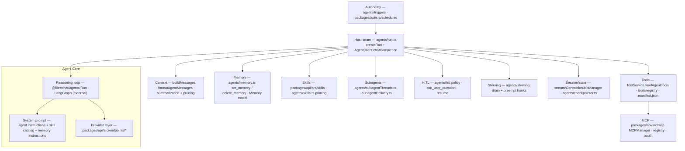
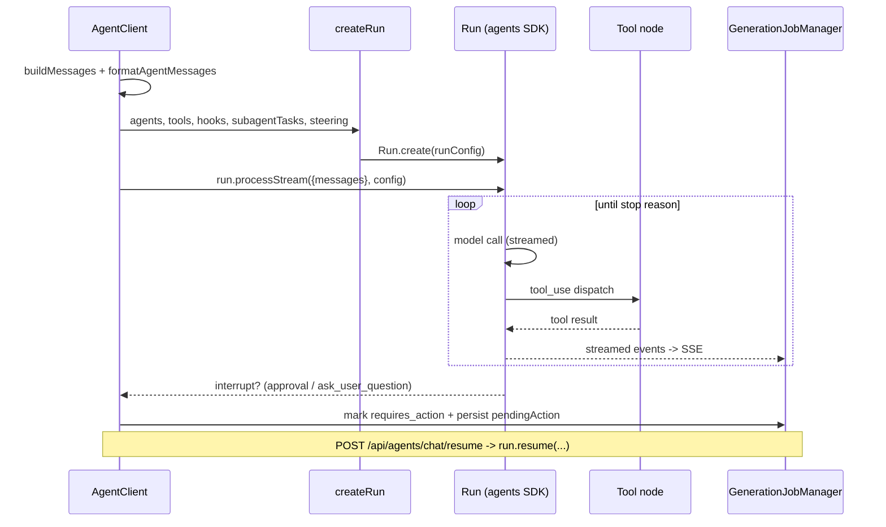
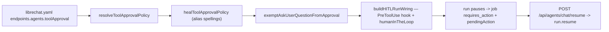

> Source: [danny-avila/LibreChat](https://github.com/danny-avila/LibreChat) (`main` @ `08c9cc3d3`, v0.8.8-rc1) · Analyzed: 2026-08-22 · Type: **Hybrid** (agent host around an external runtime)
> See also: [System & OOP Architecture](/case-studies/systems/librechat_system_oop_architecture/) — containers, components, and the class view.

---

## 1. Overview

LibreChat is a chat product with an agent runtime inside it. The distinctive thing about
its agentic anatomy is **where the split falls**: the reasoning loop itself is *not* in this
repo — it lives in `@librechat/agents` (`^3.6.9`, a LangGraph-based SDK by the same team,
source at `github.com/danny-avila/agents`). Everything *around* the loop is here, in
source: tool loading and classification, MCP client stack, skills, memory, subagents,
human-in-the-loop approval, mid-run steering, triggers, schedules, durable checkpoints, and
a resumable streaming layer.

**Type — Hybrid, host-dominant.** Not a Pack: `.claude/`, `CLAUDE.md`, and `AGENTS.md` at
the root steer *development of this repo*, not its runtime, and the organs live in `src/`.
Not a pure Runtime either: `packages/api/src/agents/run.ts` builds an `AgentInputs[]` +
`RunConfig` and hands them to `Run.create(...)`; the `while (tool_use)` control flow is the
SDK's. The right frame is **agent host**: LibreChat owns the surround and the seam, the SDK
owns the loop. A third angle applies too — LibreChat *loads* agent-native authored content
(`skill/**/SKILL.md`, Agent Plugin manifests), so it is also a harness that consumes packs.

**Substrate.** TypeScript (`packages/api`) over JavaScript Express (`api/`); LangGraph via
`@librechat/agents`; providers OpenAI / Anthropic / Google / Vertex / Bedrock / Mistral /
DeepSeek / xAI / OpenRouter / Moonshot / any OpenAI-compatible custom endpoint.

## 2. Agentic Anatomy



## 3. The Core

### 3a. Provider layer

`packages/api/src/endpoints/` holds per-family LLM config builders — `openai/config.ts`,
`anthropic/llm.ts`, `google/`, `bedrock/`, `custom/`. `providerEndpointMap`
(`librechat-data-provider`) normalizes LibreChat's `EModelEndpoint` to the SDK's
`Providers` enum inside `buildAgentInput`. Model parameters pass through
`normalizeAgentModelParameters`, and reasoning-content handling is provider-aware
(`getReasoningKey`, `isDeepSeekReasoningProvider`, `shouldReplayReasoningContent` in
`run.ts`).

### 3b. System prompt

There is no single constitution file. The model-facing instruction block is assembled per
turn from:

- `agent.instructions` → `AgentInputs.instructions`, plus `additional_instructions`
  (`run.ts` `buildAgentInput`).
- **Skill catalog** — `formatSkillCatalog` (from the SDK) over ACL-visible skills, invoked
  by `packages/api/src/agents/skills.ts` with a per-entry description cap.
- **Memory instructions** — `memoryInstructions` / `getDefaultInstructions` in
  `agents/memory.ts`, appended when the memory capability is on.
- **MCP server instructions** — `MCPManager.formatInstructionsForContext`.
- **Primed skill bodies** — manually invoked (`$skill`) or always-apply skills have their
  `SKILL.md` body injected as history messages (`injectSkillPrimes`,
  `MAX_PRIMED_SKILLS_PER_TURN = 30`).

### 3c. The loop and its host seam

`createRun` in `packages/api/src/agents/run.ts` (~1.9k lines) is the single place the whole
agentic configuration converges. It decides graph shape:

```ts
graphConfig.type = agentInputs.length > 1 || edges.length > 0 ? 'multi-agent' : 'standard'
```

…then attaches a checkpointer (only when the run can pause), a `HookRegistry`, eager
tool-execution exclusions, code-session sharing, stream circuit breakers, Langfuse config,
and subagent task wiring — and finally calls `Run.create(runConfig)`.

**Distinctive control-shape details worth knowing:**

- **Eager tool execution with an exclusion list.** The SDK speculatively runs tools
  mid-stream; `run.ts` excludes `create_file`, `edit_file`, `execute_code`, `bash_tool`,
  `ask_user_question`, `check_background_task`, and every background-capable tool, because a
  speculative side effect cannot be undone.
- **Hook ordering is load-bearing.** Activity labels register on `PostToolBatch` *before*
  the steer drain, so parts order as `[tools…, label, steer]`; deployment-plugin hooks
  register last so internal policy hooks keep their precedence.
- **Two pause mechanisms, not one.** Tool-approval HITL pauses via the SDK's
  `humanInTheLoop` switch plus a `PreToolUse` policy hook; `ask_user_question` raises a
  LangGraph `interrupt()` from *inside its own tool body* and needs only a checkpointer.
  Both are gated on `hitlCapable`, which only `AgentClient` sets — the OpenAI-compatible and
  Responses controllers cannot pause because they have no resume surface.
- **Message-to-wire boundary.** `formatAgentMessages` (SDK, called from
  `AgentClient.chatCompletion`) is the one place stored `TMessage` documents become
  LangChain `BaseMessage`s — steer parts, skill primes, and reasoning replay all have to be
  handled there or they leak into provider content.



## 4. Context & Memory

**Window assembly.** `AgentClient.buildMessages`
(`api/server/controllers/agents/client.js`) orders the branch via
`BaseClient.getMessagesForConversation`, computes and repairs per-message token counts into
an `indexTokenCountMap`, prepends file context and quotes (`prependFileContext`,
`prependQuotes` in `packages/api/src/agents/client.ts`), estimates media tokens
(`estimateMediaTokensForMessage`), then hands the result to `formatAgentMessages`.

**Compaction.** Two mechanisms, both configured per agent and passed into `AgentInputs`:

| Mechanism | Field | Source |
|---|---|---|
| Rolling summarization | `summarizationEnabled` / `summarizationConfig` / `initialSummary` | `shapeSummarizationConfig` in `run.ts` |
| Context pruning | `contextPruningConfig`, seeded by `calibrationRatio` (EMA from the prior run's `contextMeta`) | `run.ts` |
| Tool-result clamping | `maxToolResultChars` | per-agent |

**Memory** (`packages/api/src/agents/memory.ts`) is a persistent, user-scoped key–value
store exposed to the model as two tools, `set_memory` and `delete_memory`, with a
deliberately conservative prompt ("NEVER store information just because the user mentioned
it"). Storage is the `memory` collection (`packages/data-schemas/src/schema/memory.ts`),
read back by `getFormattedMemories` under a `tokenLimit` budget, managed by the user at
`/api/memories`, and scoped per agent by `memory_scope`. Enablement is gated by both admin
config (`isMemoryEnabled`) and a role permission check.

**Durable graph state** is separate from memory: `packages/api/src/agents/checkpointer.ts`
adapts LangGraph's `MongoDBSaver` so a paused run survives a process restart and can be
resumed on any replica.

## 5. Capabilities

| Organ | Where it lives | Code or content |
|---|---|---|
| Tool loading | `api/server/services/ToolService.js` (`loadAgentTools`, `loadToolsForExecution`, `loadToolDefinitionsWrapper`) | core code |
| Built-in tools | `api/app/clients/tools/structured/*.js` + `manifest.json` (Google/Tavily/Traversaal search, DALL·E 3, Flux, Stable Diffusion, Gemini/OpenAI image tools, Wolfram, OpenWeather, Azure AI Search, Calculator) | core code + JSON manifest |
| Native agent tools | `execute_code`, `bash_tool`, `read_file`, `create_file`/`edit_file` (`agents/tools.ts`), `web_search`, `file_search`, `skill`, `memory`, `ask_user_question`, `check_background_task` | core code (`Tools` enum, `AgentCapabilities`) |
| Tool classification / aliasing | `packages/api/src/tools/classification.ts` (`MCPToolAlias`), `tools/registry/`, `tools/format.ts` | core code |
| Deferred tools | `defer_loading` + SDK `tool_search`; rediscovery replayed by `extractDiscoveredToolsFromHistory` / `overrideDeferLoadingForDiscoveredTools` (`run.ts`) | core code |
| Background tools | `agents/background.ts` — `run_in_background` arg injection, `check_background_task` poll tool | core code |
| Actions (OpenAPI) | `packages/api/src/actions/`, `api/server/services/ActionService.js`, `/api/actions` | core code + user content |
| Skills | `packages/api/src/skills/` (parse, import, limits, deployment, sync) + `agents/skills.ts` (priming) | **authored content** (`SKILL.md`) loaded by core code |
| Deployment skills | `skill/<name>/SKILL.md`, loaded at startup by `initializeDeploymentSkills`, read-only, never persisted to Mongo | authored content |
| Skill sync | `api/server/services/Skills/sync` — GitHub-backed skill import | core code |
| MCP | `packages/api/src/mcp/` — `MCPManager`, `UserConnectionManager`, `ConnectionsRepository`, `registry/MCPServersRegistry.ts`, `oauth/`, `authority/`, `catalog/store.ts`; startup via `api/server/services/initializeMCPs.js`; routes at `/api/mcp` | core code + `librechat.yaml` config |
| Agent Plugins | `packages/api/src/plugins/` — manifest validation (`ai.librechat/…`), skills + hooks extensions | **extension-provided** |

**Skill priming has two modes**, and the distinction is architectural: *manual* (`$skill`
popover, capped at `MAX_MANUAL_SKILLS = 10`) is sticky — re-primed on later turns by
scanning history for `skill` tool calls — while *always-apply*
(`MAX_ALWAYS_APPLY_SKILLS = 20`) is re-resolved from fresh DB state every turn and
deliberately emits no assistant-side card, because persisting one would double-prime the
body from turn 2 onward.

**MCP is per-user, not per-process.** `MCPManager` keeps app-level connections for shared
servers but leases user connections (`withUserConnectionLease`), and the *MCP runtime
request body* (`CONTEXT.md`; `packages/api/src/mcp/request.ts`,
`api/server/services/MCPRequestContext.js`) supplies trusted chat identifiers only for the
duration of one request, so request-scoped header placeholders never persist on a shared
server definition.

## 6. Orchestration & Autonomy

### 6a. Subagents

An agent can delegate to child agents. Two execution shapes coexist:

- **Foreground / graph subagents** — `buildSubagentConfigs` in `run.ts` compiles isolated
  child `AgentInputs` into the SDK's `subagentConfigs`, bounded by `MAX_SUBAGENT_DEPTH`,
  `MAX_SUBAGENT_RUN_CONFIGS`, and `MAX_SUBAGENT_GRAPH_NODES`. `lazySubagents.ts`
  fingerprints a child agent's version (sensitive keys stripped) so configs can be cached
  and reused.
- **Detached subagent threads** — `agents/subagentThreads.ts` + `subagentTaskRouting.ts`.
  A child run becomes a durable, view-only *subagent thread* owned by one parent
  conversation, continuable by stable `threadId` under a fresh execution lease. Exactly one
  API process is the **live task owner** (holding the abort controller and a bounded control
  queue); Redis routes trusted poll/control envelopes to that owner, while Mongo persists
  only the logical thread and its continuation fence.
- **Completion wakeup** — `agents/subagentCompletionWakeup.ts` + `subagentDelivery.ts`
  pre-register a durable internal `continue` trigger *before* detaching, so a crash cannot
  lose the wakeup. Delivery waits for the child's terminal transcript, targets the exact
  parent response branch, carries task metadata (not child output), and waits for the parent
  generation to settle.
- **Billing** — child model calls never reach the parent's `streamEvents`, so
  `subagentUsageSink` (`agents/usage.ts`) collects and records them separately.

### 6b. Hooks

Two distinct hook systems, easy to conflate:

| System | Events | Registered by |
|---|---|---|
| SDK run hooks (`HookRegistry`) | `PreToolUse`, `PostToolUse`, `PostToolBatch`, `PreemptBoundary`, `SessionStart` | `createRun` — HITL policy, subagent wakeup, activity/reasoning labels, steer drain, plugin hooks |
| Deployment-plugin hooks | plugin `hooks.json` documents | `packages/api/src/agents/hooks/` + `setPluginHookSource` in `api/server/index.js`; **inert unless `DEPLOYMENT_PLUGIN_HOOKS` is set** |

### 6c. Triggers and schedules — autonomous runs

`packages/api/src/agents/triggers/` is the trusted, source-neutral boundary for
asynchronous agent work (its `README.md` is the contract). Any source — a schedule, webhook,
queue consumer, MCP integration — builds a versioned envelope via
`createAgentTriggerEnvelope` and calls `enqueueAgentTrigger`; **no adapter invokes the agent
runtime directly**. Modes are `fire`, `continue`, and `steer`. Mongo owns queue state,
leases, retry history, and dead letters; every claim is fenced by a fresh token; delivery is
at-least-once with idempotent admission and ordering lanes.

`packages/api/src/schedules/` is the cron layer on top: `startScheduleEngine` ticks every
30 s (±2 s jitter) with a 5-minute lease, computes `computeNextRunAt` from cadence, fires
through the trigger path, reconciles orphaned and abandoned runs, and skips occurrences
older than a 15-minute misfire grace so a restart doesn't burst stale chats. Schedule writes
are refused until the engine arms (`createScheduleWriteGate` in `api/server/index.js`).

### 6d. Human-in-the-loop and guardrails



- **Off by default.** Absent `toolApproval.enabled`, nothing attaches and the run is
  identical to the pre-feature path.
- **Decisions fold `deny > ask > allow`**, so host-registered programmatic hooks
  (`loadToolApprovalHooks`) can only *tighten* the configured policy. Skill-contributed
  policy is designed the same way (tighten-only), though that seam is declared and not yet
  wired.
- **Resume replays the graph identity.** `restoreResumeContext` in
  `api/server/routes/agents/chat.js` restores the paused turn's graph-determining config
  from the pending action *before* the middleware chain reads it, so a crafted resume cannot
  swap the tool set.
- Surrounding guardrails: PII filtering (`createMessageFilterPii`), moderation
  (`moderateText`), ACL checks (`canAccessAgentFromBody`, `validateConvoAccess`), balance
  checks, rate limiters, per-user concurrency (`checkAndIncrementPendingRequest`), and
  tenant isolation.

### 6e. Steering — mid-run user injection

The organ with no equivalent in most harnesses. While a turn is generating, the user can
send another message; it is queued on the generation job and drained at the next
`PostToolBatch` boundary into graph state as a `HumanMessage`
(`agents/steering/runtime.ts`, `createSteerDrainHook`). If the SDK supports preemption, a
`PreemptBoundary` hook plus a level-triggered `StreamPreemption` poll lets a steer seal an
in-flight model stream instead of waiting for the tool batch. Capability is probed at
runtime (`isSteeringSupported`, `isSteerPreemptSupported`) and the steer route returns 501
when the installed SDK can inject but not replay — draining onto an SDK that ignores
`injectedMessages` would silently discard the user's words.

### 6f. Session, state, event bus

`packages/api/src/stream/GenerationJobManager.ts` is the runtime spine: one job per
generation (`streamId`), holding buffered events, usage, the pending HITL action, the steer
queue with preempt tombstones, and the `StandardGraph` handle. It sits behind `IJobStore` /
`IEventTransport` with in-memory and Redis implementations, which is what makes streams
resumable across reconnects and — with Redis — across replicas. The browser side is
`client/src/hooks/SSE/useResumableSSE.ts` and `useStepHandler.ts`.

## 7. Extension Points

| To add… | Do this |
|---|---|
| A tool | Drop a `DynamicStructuredTool` in `api/app/clients/tools/structured/` and register it in `manifest.json`; or expose it from an MCP server; or define an Action from an OpenAPI spec |
| A skill | Put `SKILL.md` under `skill/<name>/` for deployment-wide read-only skills, create a Skill document via `/api/skills`, or point GitHub skill sync at a repo |
| An MCP server | `mcpServers` in `librechat.yaml`; OAuth-protected servers are handled by `mcp/oauth/` and reconnected by `initializeOAuthReconnectManager` |
| A subagent | Set `subagents` / `agent_ids` / `edges` on the parent agent document; depth and node counts are capped by `MAX_SUBAGENT_DEPTH` / `MAX_SUBAGENT_GRAPH_NODES` |
| A provider | `endpoints.custom` in `librechat.yaml`, or a module under `packages/api/src/endpoints/<provider>/` |
| A hook | A tool-approval hook module referenced from `endpoints.agents.toolApproval.hooks`, or an Agent Plugin shipping `hooks.json` (requires `DEPLOYMENT_PLUGIN_HOOKS`) |
| An autonomous source | Build an envelope with `createAgentTriggerEnvelope` and call `enqueueAgentTrigger` — never call the runtime directly |

## 8. Organ Presence Matrix

| Organ | Present? | Where | Notes |
|---|---|---|---|
| Reasoning loop | ⚠️ partial | `@librechat/agents` `Run` / LangGraph; seam at `packages/api/src/agents/run.ts` | **External.** The host builds `graphConfig` (`standard` vs `multi-agent`) and calls `Run.create` + `run.processStream` / `run.resume` |
| Model / provider layer | ✅ | `packages/api/src/endpoints/*`, `providerEndpointMap` | 9 provider families plus OpenAI-compatible custom endpoints |
| System prompt / constitution | ✅ | `agent.instructions` + `agents/skills.ts` catalog + `agents/memory.ts` instructions + MCP instructions | Assembled per turn; no single constitution file |
| Context window mgmt | ✅ | `AgentClient.buildMessages`, `formatAgentMessages`, `indexTokenCountMap` | Token counts persisted per message and repaired on read |
| Compaction / summarization | ✅ | `shapeSummarizationConfig`, `contextPruningConfig`, `calibrationRatio` | Rolling summary plus EMA-calibrated pruner |
| Memory (persistent) | ✅ | `packages/api/src/agents/memory.ts`, `schema/memory.ts`, `/api/memories` | Tool-driven, user-scoped, token-budgeted, permission-gated |
| Durable run state | ✅ | `agents/checkpointer.ts` (MongoDB LangGraph saver) | Attached only when a run can pause |
| Tools | ✅ | `ToolService.js`, `tools/registry`, `manifest.json`, `agents/tools.ts` | Plus deferred loading, programmatic tools, background execution |
| Skills | ✅ | `packages/api/src/skills/`, `skill/**/SKILL.md`, `agents/skills.ts` | **Authored content** loaded by core code; DB, deployment-dir, GitHub-sync, and plugin sources |
| MCP | ✅ | `packages/api/src/mcp/**`, `/api/mcp`, `initializeMCPs.js` | Full client stack: registry, per-user leases, OAuth, authority, catalog |
| Subagents | ✅ | `run.ts` `buildSubagentConfigs`; `subagentThreads.ts`, `subagentDelivery.ts`, `subagentCompletionWakeup.ts` | Foreground graph children **and** detached durable threads with owner routing |
| Hooks | ✅ | SDK `HookRegistry` in `run.ts`; `agents/hooks/` for plugin hooks | Plugin hooks inert without `DEPLOYMENT_PLUGIN_HOOKS` |
| Triggers | ✅ | `agents/triggers/` | Mongo-backed queue, fenced leases, dead letters, ordering lanes |
| Scheduling | ✅ | `packages/api/src/schedules/`, `/api/schedules` | 30 s tick, leases, misfire grace, reconciliation |
| Permissions / guardrails / HITL | ✅ | `agents/hitl/*`, `acl/`, the chat middleware chain | **Off by default**; tighten-only layering; `ask_user_question` as a second pause path |
| Steering (mid-run injection) | ✅ | `agents/steering/*`, `stream/SteeringLifecycle.ts` | Runtime-probed; route 501s when the SDK cannot replay |
| Session / state / event bus | ✅ | `stream/GenerationJobManager.ts` + `IJobStore`/`IEventTransport` | Resumable SSE; Redis for multi-replica |
| Agent-behavior observability | ✅ | `packages/api/src/langfuse/`, `agents/activityLabels/`, `agents/reasoningLabels/`, `agents/activityPhases/` | Langfuse trace id derived deterministically from `runId` |
| Sandboxed execution | ⚠️ partial | `agents/execution.ts` + external Code Interpreter API | Execution is a remote service, not in-repo; sessions shared across code and file tools via `codeSessionToolNames` |
| Agent-authored files | ⚠️ partial | `create_file` / `edit_file` (`agents/tools.ts`), `agents/skillFiles.ts` | Files live in the code sandbox session plus the storage layer, not a general VFS |

## 9. Glossary & Open Questions

**Glossary**

- **Agent run envelope** — versioned, JSON-safe request contract created after ingress auth
  and protocol validation but *before* agent/provider/tool/MCP init; carries only the
  validated payload and the minimum trusted principal identifiers, from which the execution
  host rehydrates runtime state (`CONTEXT.md`; `packages/api/src/agents/envelope.ts`).
- **MCP runtime request body** — trusted chat identifiers supplied only while an MCP server
  handles one agent request, enabling request-scoped header placeholders without retaining
  user data on a shared server definition.
- **Subagent thread** — a durable, view-only child conversation owned by one parent
  conversation and subagent identity; continued by stable `threadId` under a fresh execution
  lease. Not a human-writable chat.
- **Live subagent task owner** — the single API process holding a detached child execution,
  its abort controller, and its bounded control queue.
- **Subagent completion wakeup** — a durable internal `continue` trigger pre-registered
  before detaching, delivered after the child transcript persists, targeting the exact
  parent response branch.
- **Steer** — a user message injected into a running generation at a tool-batch (or
  preempt) boundary.
- **Deferred tool** — a tool withheld from context and discoverable at runtime via the SDK's
  `tool_search`; once discovered, `defer_loading` is overridden on subsequent turns.
- **Prime** — injecting a skill's `SKILL.md` body into the turn's message history.
- **Generation job** — the durable per-turn record keyed by `streamId` in
  `GenerationJobManager`.

**Open questions**

- **The loop is not readable here.** `node_modules/` is empty in this clone, so the actual
  ReAct/graph control flow, `formatAgentMessages`, `Run.create`, `run.resume`,
  `HookRegistry` semantics, `InMemorySubagentTaskStore`, and `formatSkillCatalog` are known
  only through LibreChat's imports, type usage, and (unusually detailed) JSDoc. Anyone
  needing the loop itself must read `github.com/danny-avila/agents`.
- **Version-conditional wiring.** Several `RunConfig` fields are documented in-source as
  "ignored by older SDK versions" (`subagentUsageSink`, `streamLimits`,
  `codeSessionToolNames`, `eagerEventToolExecution.excludeToolNames`, `graphTools`). The
  effective anatomy therefore depends on the installed `@librechat/agents` build, not on
  this source alone.
- **`tool-intent-spec.md` is a proposal.** The root-level spec describes per-call intent
  labels as a design to be implemented. `packages/api/src/agents/intent.ts` and
  `AgentCapabilities.tool_intents` exist, but this document does not claim the full feature
  as shipped.
- **Unwalked branches.** The OpenAI-compatible (`agents/openai/`) and Responses
  (`agents/responses/`) controllers reuse `createRun` but deliberately cannot pause; their
  event and handler surfaces were not traced in detail. `agents/harvest.ts`,
  `agents/prewarm.ts`, `agents/discovery.ts`, and `agents/orphans.ts` were identified by
  name and role only.
- **Nothing was executed.** The repo has no installed dependencies in this clone, so every
  claim here is static-read evidence, not observed behavior.
