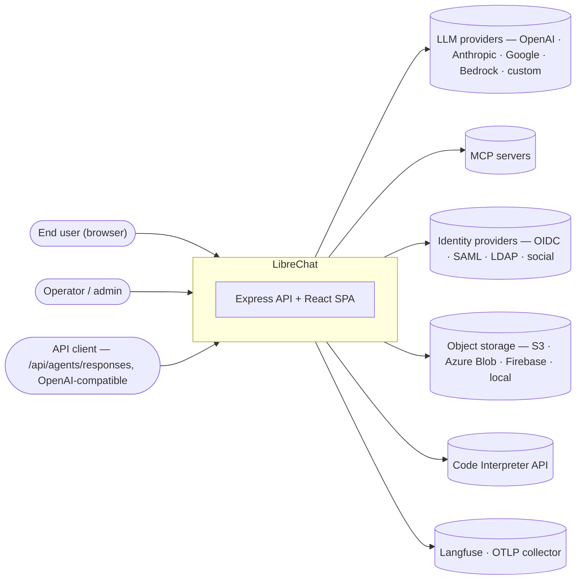
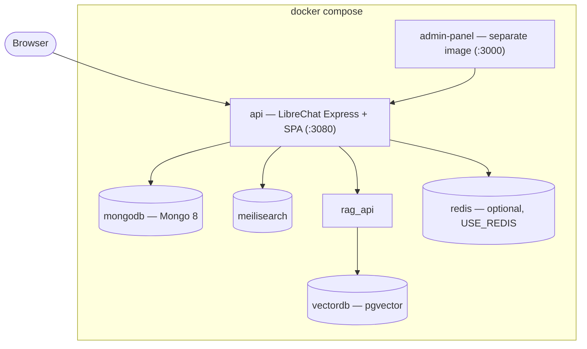
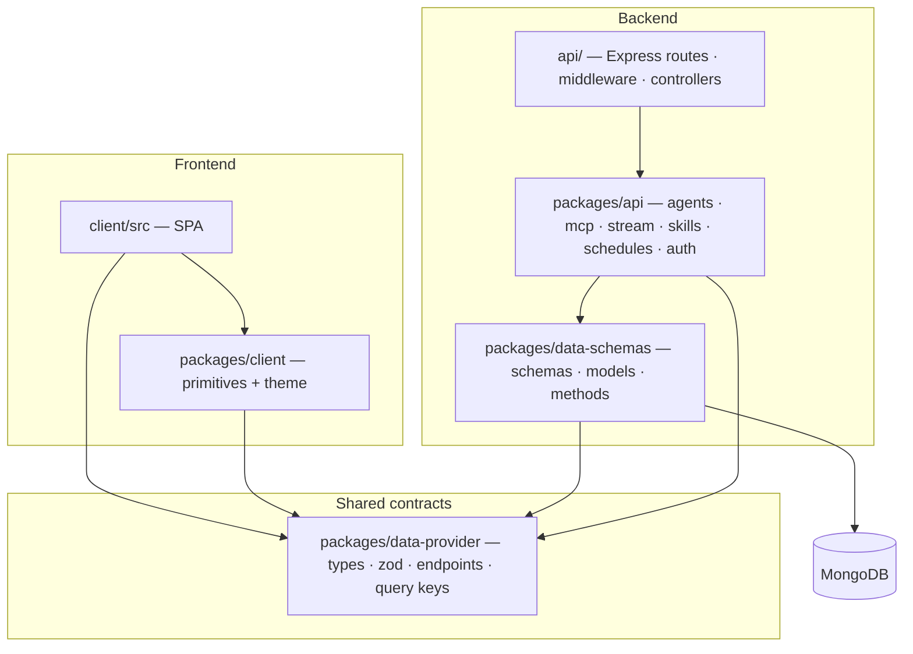
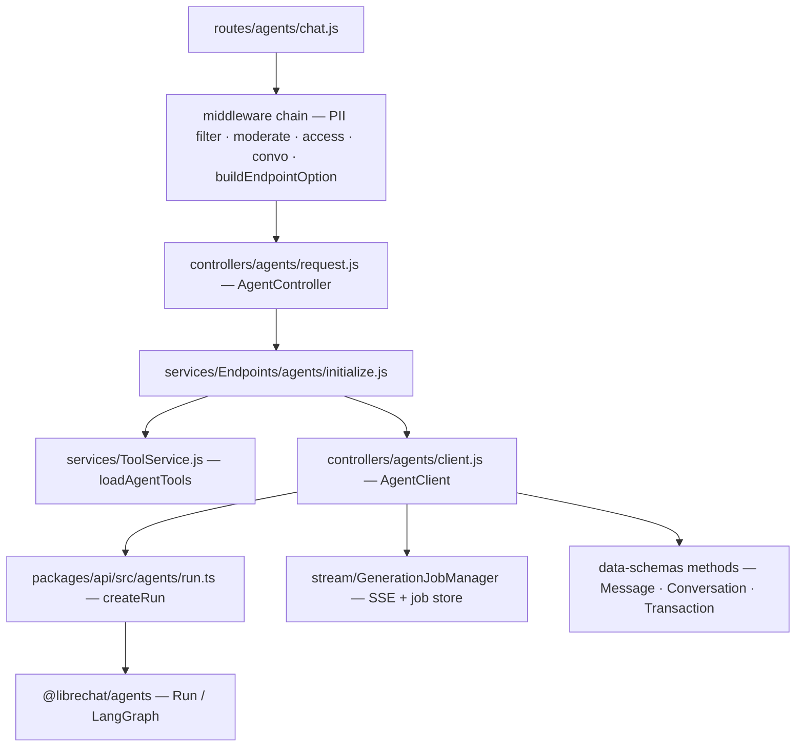
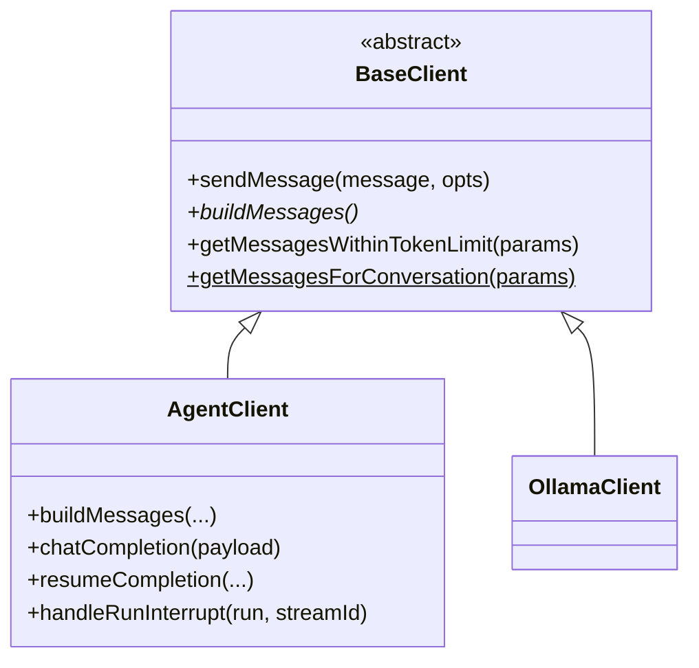
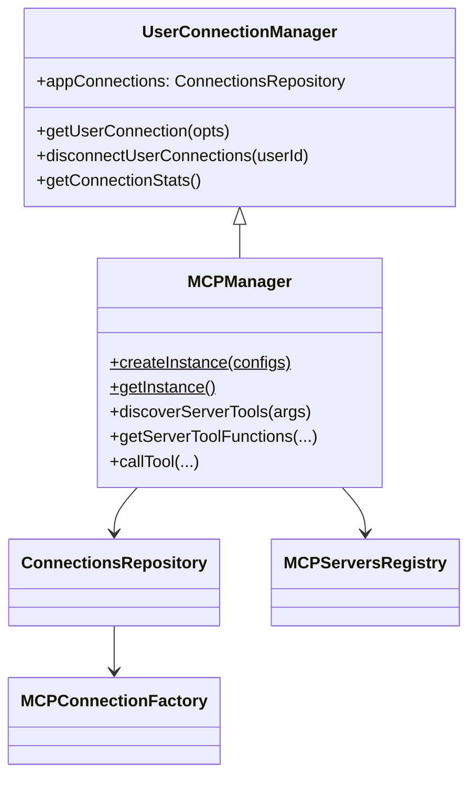
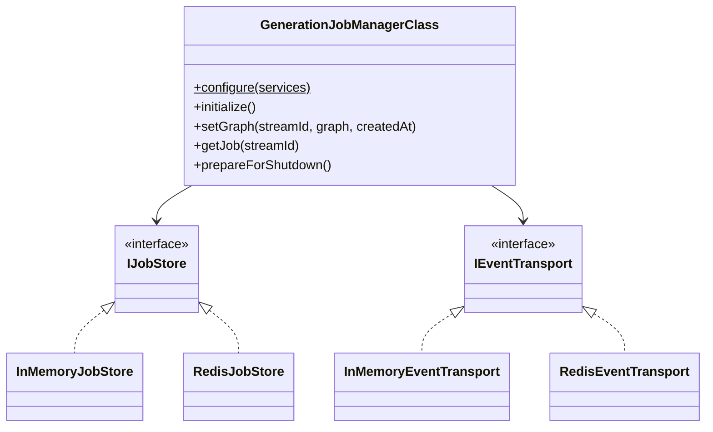
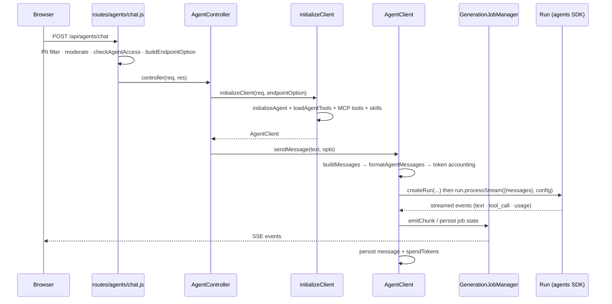
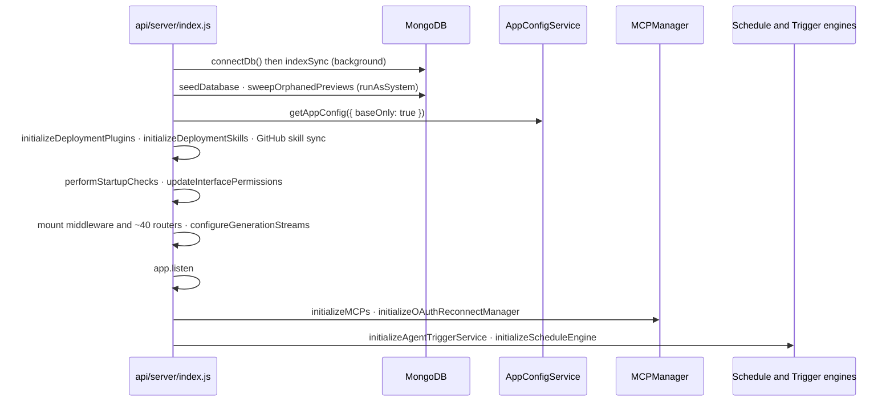

> Source: [danny-avila/LibreChat](https://github.com/danny-avila/LibreChat) (`main` @ `08c9cc3d3`, v0.8.8-rc1) · Analyzed: 2026-08-22 · Type: **Hybrid** (application-dominant)
> See also: [Agentic Architecture](/case-studies/systems/librechat_agentic_architecture/) — the agent core and the organs around it.

---

## 1. Overview

LibreChat is a self-hostable, multi-provider AI chat platform: one web UI and one API in
front of many LLM endpoints (OpenAI, Anthropic, Google/Vertex, Bedrock, Azure, and any
OpenAI-compatible "custom" endpoint), with an agent runtime, tools, MCP servers, RAG file
search, code execution, and a full auth/permissions/billing layer around it. The deployed
artifact is a single Express process that also serves the built React SPA.

**Type — Hybrid, application-dominant.** Evidence for *application*: a real bootstrap at
`api/server/index.js` (`app.listen`), `docker-compose.yml` declaring the runtime topology,
and `Dockerfile`/`helm/` for delivery. Evidence for *library*: `packages/*` are versioned
npm workspaces with their own `tsdown` builds and public entry points
(`librechat-data-provider`, `@librechat/data-schemas`, `@librechat/api`,
`@librechat/client`) — `librechat-data-provider` in particular is consumed outside this
repo. The document therefore weights containers/components/flows at full depth and treats
the packages as internal-but-published modules.

**Tech stack**

| Layer | Choice |
|---|---|
| Runtime | Node.js v24 (`.nvmrc`), npm workspaces + Turborepo (`turbo.json`) |
| Backend | Express 5 (`api/`, JavaScript) + `@librechat/api` (TypeScript) |
| Agent engine | `@librechat/agents` ^3.6.9 (LangGraph-based; source at `danny-avila/agents`) |
| Frontend | React + Vite SPA (`client/`), TanStack Query, Tailwind |
| Persistence | MongoDB via Mongoose (`packages/data-schemas`) |
| Search | Meilisearch (conversation/message index), pgvector + `rag_api` (document RAG) |
| Cache / coordination | Keyv, optional Redis (`USE_REDIS`), single or cluster mode |
| Observability | OpenTelemetry (`otel/`, `api/server/telemetry.js`), Langfuse (`packages/api/src/langfuse`) |
| Auth | Passport: local, JWT, OpenID/OIDC, SAML, LDAP, Google/GitHub/Discord/Facebook/Apple |

### Workspace map

| Workspace | Package | Language | Role |
|---|---|---|---|
| `api/` | `@librechat/backend` | JS (legacy) | Express server: routes, middleware, controllers, service glue |
| `packages/api/` | `@librechat/api` | TS | Where new backend logic lives — agents, MCP, stream, skills, schedules, auth, storage |
| `packages/data-schemas/` | `@librechat/data-schemas` | TS | Mongoose schemas, models, query methods, logger, tenant context |
| `packages/data-provider/` | `librechat-data-provider` | TS | Shared contracts: types, zod schemas, endpoints, query keys, react-query hooks |
| `packages/client/` | `@librechat/client` | TS | Shared frontend primitives and theme system |
| `client/` | — | TS/React | The SPA |

The dependency direction is strictly one-way:
`data-provider → data-schemas → packages/api → api`, and
`data-provider → packages/client → client`.

## 2. System Context

Actions (user-defined OpenAPI tools) and the built-in tool manifest
(`api/app/clients/tools/manifest.json`: Google/Tavily/Traversaal search, DALL·E, Flux,
Stable Diffusion, Wolfram, OpenWeather, Azure AI Search) add further outbound third-party
calls, all initiated by the same `api` container.

## 3. High-Level Structure

### 3a. Deployment containers

Evidence: `docker-compose.yml`, `deploy-compose.yml`, `scripts/redis-mode.sh`,
`docker-compose.langfuse-fanout.yml`.

Redis is optional but load-bearing when present: it backs the generation job store and
event transport (`packages/api/src/stream/implementations/Redis*.ts`), the shared cache
(`packages/api/src/cache/redisClients.ts`), and leader election
(`packages/api/src/cluster/LeaderElection.ts`). Without it the process falls back to
in-memory implementations and is effectively single-replica for streaming.

### 3b. Code structure

| Path | Responsibility |
|---|---|
| `api/server/index.js` | Bootstrap: DB connect, config load, plugins/skills init, middleware chain, route mounting, MCP + trigger + schedule engine startup, graceful shutdown |
| `api/server/routes/` | HTTP surface (~40 routers): `agents`, `messages`, `convos`, `files`, `mcp`, `skills`, `schedules`, `memories`, `admin/*`, `auth`, `share` |
| `api/server/middleware/` | Auth, ban, moderation, rate limits, ACL checks, `buildEndpointOption`, abort |
| `api/server/controllers/` | Request handlers; `controllers/agents/` holds the chat/resume/steer/responses controllers and `AgentClient` |
| `api/server/services/` | Glue: `Endpoints/agents/initialize.js`, `ToolService.js`, `initializeMCPs.js`, `Config/`, `Files/`, `Schedules/`, `Skills/sync` |
| `api/app/clients/` | Legacy client layer: `BaseClient`, `OllamaClient`, prompt formatting, built-in tool manifest |
| `packages/api/src/agents/` | Agent host: run assembly, skills, subagents, HITL, steering, triggers, checkpointer, memory |
| `packages/api/src/mcp/` | MCP client stack: manager, connections, registry, OAuth, authority |
| `packages/api/src/stream/` | Resumable generation: `GenerationJobManager`, job store + event transport |
| `packages/api/src/app/` | App config resolution, startup checks, metrics, shutdown |
| `packages/data-schemas/src/` | `schema/` → `models/` → `methods/`, plus migrations and tenant-scoped logging |
| `packages/data-provider/src/` | `schemas.ts`, `config.ts`, `api-endpoints.ts`, `data-service.ts`, `keys.ts`, `react-query/` |

## 4. Components — inside the `api` container

The request path is a conventional layered pipeline, with the interesting depth in the
services layer.

Cross-cutting components that every route touches:

- **App config** — `packages/api/src/app/service.ts` (`createAppConfigService`) resolves
  `librechat.example.yaml`-shaped config once, then layers per-role / per-user / per-tenant
  overrides behind a TTL cache. Consumed as `req.config`.
- **Access control** — `packages/api/src/acl/accessControlService.ts` plus
  `packages/data-schemas/src/methods/aclEntry.ts` implement resource-level ACLs
  (agents, prompts, files, shared links) on top of role permissions
  (`PermissionTypes`/`Permissions` in `data-provider`).
- **Cache** — `packages/api/src/cache/cacheFactory.ts` selects Keyv backends (memory, file,
  Mongo, Redis) per named store; `api/cache/getLogStores.js` is the legacy accessor.
- **Telemetry** — OTel SDK in `packages/api/src/telemetry/sdk.ts`, Prometheus-style
  `/metrics` from `packages/api/src/app/metrics.ts`, Langfuse tracing wired per run.

## 5. OOP & Class Architecture

LibreChat is mostly functional modules; classes appear exactly where long-lived state or
substitutable backends are needed. Four clusters matter.

### 5a. Chat clients — Template Method

`api/app/clients/BaseClient.js` defines the turn skeleton (`sendMessage` → `buildMessages`
→ `sendCompletion` → save) and leaves `buildMessages` abstract.

`AgentClient` (`api/server/controllers/agents/client.js`, ~4.1k lines) is the single
largest class in the repo and the seam between HTTP and the agent SDK.

### 5b. MCP connection management — Manager + Repository + Factory

`MCPManager` is a process singleton (`createInstance`/`getInstance`); per-user connections
are leased (`withUserConnectionLease`) so credentials and tool sets stay scoped to the
requesting principal.

### 5c. Streaming state — Strategy behind interfaces

`packages/api/src/stream/` isolates "where does generation state live" behind two
interfaces, so a single-node deploy and a Redis-backed multi-replica deploy share one
code path.

`createStreamServices()` is the factory that picks implementations from environment;
`GenerationJobManager` is exported as a configured singleton.

### 5d. Durable graph state — Adapter over LangGraph

`packages/api/src/agents/checkpointer.ts` wraps `MongoDBSaver` from
`@langchain/langgraph-checkpoint-mongodb`. LangGraph reserves `checkpoint_ns`, so the
adapter carries LibreChat's generation scope on a private configurable key
(`LIBRECHAT_CHECKPOINT_NAMESPACE_KEY`) and maps it into the storage namespace on the way
in and out — a textbook Adapter, and the reason a paused run can be resumed on any replica.

### 5e. Data access — Schema → Model → Methods

`packages/data-schemas` uses a consistent three-file idiom per entity:
`schema/agent.ts` (Mongoose schema) → `models/agent.ts` (model registration) →
`methods/agent.ts` (typed query functions). Consumers never touch Mongoose directly;
they import methods. Tenant isolation is enforced by `tenantStorage`/`runAsSystem`
(AsyncLocalStorage) so an unscoped query throws in strict mode.

## 6. Key Flows

### 6a. An agent chat turn (the representative path)

`GET /api/agents/chat` streaming is resumable: the browser subscribes through
`client/src/hooks/SSE/useResumableSSE.ts`, and a reconnect replays buffered events from the
job store rather than restarting generation.

### 6b. Server startup

Ordering is deliberate: `/api/agents/chat` POSTs are rejected with `503 SERVER_NOT_READY`
until the post-listen phase completes (`rejectChatStartsUntilReady`), and schedule writes
are gated separately by `createScheduleWriteGate`.

## 7. Extension Points

| Want to add | Where |
|---|---|
| A new LLM provider endpoint | `librechat.yaml` `endpoints.custom` (OpenAI-compatible), or a first-class module under `packages/api/src/endpoints/<provider>/` |
| A built-in tool | `api/app/clients/tools/structured/<Tool>.js` + an entry in `manifest.json`; loaded by `api/app/clients/tools/util` |
| An external tool surface | An MCP server in `librechat.yaml` `mcpServers`, or an Action (OpenAPI spec) via `/api/actions` |
| A shared instruction capability | A `SKILL.md` folder under `skill/` (deployment skills), a DB Skill via `/api/skills`, or GitHub sync (`api/server/services/Skills/sync`) |
| A packaged extension | Agent Plugins: `packages/api/src/plugins/` reads `ai.librechat/…` manifests; hooks require `DEPLOYMENT_PLUGIN_HOOKS` opt-in |
| A tool-approval policy | `endpoints.agents.toolApproval` in config, plus programmatic hook modules loaded by `loadToolApprovalHooks` |
| Frontend appearance | Semantic theme roles in `packages/client` (theme definitions are data — see `CONTEXT.md`), never feature-local palette CSS |
| Storage / CDN backend | `packages/api/src/storage/` and `packages/api/src/cdn/` (S3, Azure, Firebase, CloudFront, local) |

## 8. Key Abstractions / Glossary

- **Endpoint** (`EModelEndpoint`) — a provider family: `openAI`, `azureOpenAI`, `anthropic`,
  `google`, `bedrock`, `custom`, `assistants`, `azureAssistants`, `agents`.
- **Agent** — a persisted configuration (model, instructions, tools, skills, subagents,
  capabilities) stored as an `agent` document; **ephemeral agent** is the same shape
  synthesized per request for a plain chat.
- **AppConfig** — the resolved, override-layered configuration object attached as
  `req.config`.
- **Generation job** — the durable record of one streaming turn (`GenerationJobManager`),
  keyed by `streamId`; carries buffered events, pending HITL actions, and the steer queue.
- **Agent run envelope** — versioned, JSON-safe request contract created after ingress auth
  and before any agent/tool/MCP init (see `CONTEXT.md`; `packages/api/src/agents/envelope.ts`).
- **Principal / ACL entry** — the subject (user, group, role, public) and the grant record
  that authorizes a resource operation.
- **Tenant** — an isolation scope threaded through `tenantStorage`; strict mode rejects
  unscoped queries, and `runAsSystem` is the explicit escape hatch for startup work.

## 9. Open Questions & Notes

- **`@librechat/agents` is not vendored here.** `node_modules/` is empty in this clone, so
  everything about the graph engine below the `Run.create` / `run.processStream` /
  `run.resume` seam is inferred from LibreChat's imports and JSDoc, not read. Its source
  lives at `github.com/danny-avila/agents`.
- **Repo state.** `git log` shows this working tree at `v0.8.8-rc1` with features (subagent
  threads, steering, activity/reasoning labels, agent plugins, schedules, triggers) that
  read as in-flight development. `tool-intent-spec.md` at the repo root is an explicit
  *proposal*, not a description of shipped behavior — parts of it (`agents/intent.ts`,
  `AgentCapabilities.tool_intents`) exist, so treat that file as forward-looking.
- **Admin panel is out of tree.** `docker-compose.yml` pulls
  `registry.librechat.ai/clickhouse/librechat-admin-panel`; only its API surface
  (`/api/admin/*`) is visible here.
- **`src/` at the repo root** contains only `tests/`, and `e2e/` holds Playwright specs;
  neither is part of the runtime structure described above.
- **Not covered.** Assistants/Azure-Assistants endpoints (a parallel legacy path under
  `api/server/services/AssistantService.js`), the file pipeline's OCR/parsing branches, and
  the i18n/locale machinery are real but architecturally secondary; they are noted, not
  mapped.
