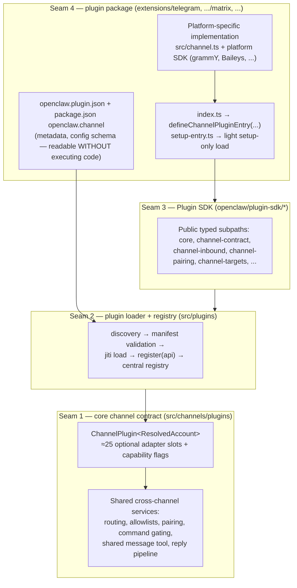
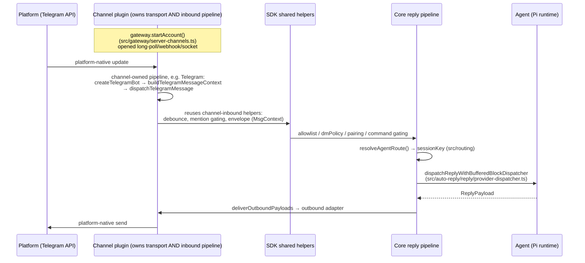

> Source: https://github.com/openclaw/openclaw · Date: 2026-08-11 · Mode: Explain
> See also: [System Architecture Overview](./openclaw_system_architecture.md)

**The question:** how does one codebase integrate 20+ messaging providers (Telegram, WhatsApp, Discord, Slack, Signal, iMessage, Matrix, MS Teams, Zalo, …) without collapsing into per-provider `if` statements? **The short answer:** a microkernel/plugin architecture where *every* channel — including the "built-in" ones — is a plugin package implementing one rich core-owned contract (`ChannelPlugin`), registered through a manifest-first loader into a central registry, while all cross-channel policy (routing, security, pairing, command gating, the shared `message` tool) stays in core.

## 1. Where the seams are

Four nested boundaries, from outside in:



### Seam 1 — the `ChannelPlugin` contract (`src/channels/plugins/types.plugin.ts`)

The heart of the design. A channel is a **bag of small, optional adapters** behind one type:

```ts
export type ChannelPlugin<ResolvedAccount = any, Probe = unknown, Audit = unknown> = {
  id: ChannelId;
  meta: ChannelMeta;                    // label, docs path, aliases, ordering
  capabilities: ChannelCapabilities;    // feature flags (see §3)
  config: ChannelConfigAdapter<ResolvedAccount>;   // resolveAccount / inspectAccount
  configSchema?: ChannelConfigSchema;   // JSON-schema-like, drives UI + validation
  setup?: ChannelSetupAdapter;          // onboarding wizard hooks
  pairing?: ChannelPairingAdapter;      // DM pairing-code flow
  security?: ChannelSecurityAdapter<ResolvedAccount>;  // dmPolicy + allowFrom
  outbound?: ChannelOutboundAdapter;    // sendText / sendMedia / sendPoll
  gateway?: ChannelGatewayAdapter<ResolvedAccount>;    // start/stop account runtime
  status?: ChannelStatusAdapter<ResolvedAccount, Probe, Audit>;
  messaging?: ChannelMessagingAdapter;  // target parsing/resolution
  threading?: ChannelThreadingAdapter;  // reply-to semantics
  streaming?: ChannelStreamingAdapter;
  actions?: ChannelMessageActionAdapter; // describeMessageTool(...) discovery
  directory?: ChannelDirectoryAdapter;  // peers/groups listing
  mentions?: ChannelMentionAdapter;
  commands?: ChannelCommandAdapter;
  heartbeat?: ChannelHeartbeatAdapter;
  agentTools?: ChannelAgentToolFactory | ChannelAgentTool[];
  // ... ~10 more optional slots (auth, approvals, allowlist, bindings, lifecycle, resolver, elevated, agentPrompt)
};
```

Core code never talks to grammY or Baileys; it drives these adapters. A channel implements only what its platform supports — everything else is `undefined` and core falls back to shared behavior.

### Seam 2 — manifest-first loading + central registry (`src/plugins/`)

The load pipeline (documented in `docs/plugins/architecture.md`, implemented in `src/plugins/discovery.ts`, `manifest.ts`, `loader.ts`, `registry.ts`):

1. **Discovery** — find candidate plugin roots (bundled `extensions/`, workspace paths, global installs).
2. **Manifest validation** — read `openclaw.plugin.json` + the `openclaw` block of `package.json` *without executing plugin code*. This control-plane/data-plane split lets OpenClaw validate config, render setup UIs, and explain disabled plugins with zero plugin code running.
3. **Enablement gates** — allow/deny lists, path-safety checks (entry escaping plugin root, world-writable paths ⇒ rejected).
4. **Runtime load** — enabled plugins load in-process via jiti; their `register(api)` runs and calls `api.registerChannel(...)` (and possibly `registerHttpRoute`, `registerCli`, …).
5. **Registry consumption** — everything lands in one central registry; the rest of core reads *only* the registry. One-way flow: `plugin module → registry ← core runtime`.

Two refinements that make this cheap at startup:

- **Four registration modes**, resolved in `src/plugins/loader.ts`: `full` | `setup-runtime` | `setup-only` | `cli-metadata`. An unconfigured channel loads its slim `setup-entry.ts` (declared as `package.json` `openclaw.setupEntry`) and still appears in onboarding pickers and root CLI help — without paying for its platform SDK.
- **A dual registry** (`src/plugins/registry.ts`): `registry.channelSetups` (metadata/setup surface, populated always) vs `registry.channels` (runtime surface, populated only for full loads). Duplicate channel ids are rejected with a diagnostic rather than silently shadowed.

Channel lookup is then trivial and cached (`src/channels/plugins/registry.ts`):

```ts
export function listChannelPlugins(): ChannelPlugin[]        // sorted by CHAT_CHANNEL_ORDER + meta.order
export function getChannelPlugin(id: ChannelId): ChannelPlugin | undefined
```

Note `ChannelId` in `src/channels/plugins/types.core.ts`: `ChatChannelId | (string & {})` — the classic built-ins (`src/channels/ids.ts`) get ordering/autocomplete, but the union stays **open** so plugin channels are first-class ids, not an afterthought.

### Seam 3 — the Plugin SDK import boundary (`src/plugin-sdk/`)

Extensions may import **only** `openclaw/plugin-sdk/*` subpaths (enforced by boundary guards in CI, documented in `extensions/AGENTS.md`). The SDK re-exports the contract types plus *shared machinery* so channels don't reimplement it:

- `plugin-sdk/core` — `defineChannelPluginEntry`, `createChatChannelPlugin`, `createChannelPluginBase`
- `plugin-sdk/channel-contract`, `channel-inbound` (debounce, mention matching, envelope helpers), `channel-pairing`, `channel-reply-pipeline`, `channel-targets`, `channel-actions`, `directory-runtime`, `webhook-ingress`, …

A real bundled channel entry is ~10 lines (`extensions/telegram/index.ts`):

```ts
import { defineChannelPluginEntry } from "openclaw/plugin-sdk/core";
import { telegramPlugin } from "./src/channel.js";

export default defineChannelPluginEntry({
  id: "telegram",
  name: "Telegram",
  plugin: telegramPlugin as ChannelPlugin,
  setRuntime: setTelegramRuntime,
});
```

### Seam 4 — the plugin package itself

Each channel is a workspace package with a standard shape (`docs/plugins/sdk-channel-plugins.md`):

```
extensions/telegram/
├── package.json           # "openclaw": { channel: {...}, install: {...} } catalog metadata
├── openclaw.plugin.json   # id, channels list, config schema
├── index.ts               # full entry (defineChannelPluginEntry)
├── setup-entry.ts         # light entry, loaded when channel disabled/unconfigured
├── api.ts / runtime-api.ts  # the package's OWN public barrels (core may use these, never src/**)
└── src/                   # private platform-specific code (grammY bot, handlers, media)
```

The `setupEntry` split is a deliberate performance seam: onboarding and status flows load a slim module instead of the whole platform SDK.

## 2. Inbound and outbound flow through the seams



- **Inbound is plugin-owned end to end, by design** — both the transport (webhook via `api.registerHttpRoute({auth: "plugin", ...})`, or a socket/long-poll started from the `gateway` lifecycle adapter) *and* the inbound pipeline. `docs/plugins/sdk-channel-plugins.md` states it plainly: "Inbound message handling is channel-specific. Each channel plugin owns its own inbound pipeline." There is **no single inbound entry point** channels must call (`dispatchInboundMessage` in `src/auto-reply/dispatch.ts` exists but is not the universal path — Telegram, for example, ends its own chain in `dispatchReplyWithBufferedBlockDispatcher`). Uniformity comes instead from the shared helper barrel `openclaw/plugin-sdk/channel-inbound` (debounce, DM guard, envelope formatting, mention gating) plus contract test suites (§3) — convention enforced by tests, not by a type signature.
- **Envelopes have names**: inbound normalizes to `MsgContext` (`src/auto-reply/templating.ts` — flat, template-interpolatable fields); replies come back as `ReplyPayload` (`src/auto-reply/types.ts`); delivery reports as `OutboundDeliveryResult` (`src/infra/outbound/deliver.ts`).
- **Outbound is centrally dispatched with graceful degradation**: `deliverOutboundPayloads` (`src/infra/outbound/deliver.ts`) tries the richest adapter the channel implements — `sendPayload` (interactive/channel-data payloads) → `sendFormattedText` → chunked `sendText` → `sendFormattedMedia`/`sendMedia`. Only `sendText` is mandatory.
- **Outbound is capability-dispatched**: core's shared `message` tool asks the plugin's `actions.describeMessageTool(ctx)` what actions/schema fragments to expose for the *current* channel, then executes through the plugin's action adapter. One agent-facing tool, N channel implementations — schemas and dispatch can't drift apart because they're returned together (`docs/plugins/architecture.md`, "Channel plugins and the shared message tool").

## 3. Design techniques used (named, with evidence)

| Technique | Where | What it buys |
|---|---|---|
| **Microkernel / plugin architecture** | core `src/` + `extensions/*` | Adding channel #24 touches zero core dispatch code; it's a new package |
| **Adapter pattern (fine-grained)** | `ChannelPlugin`'s ~25 adapter slots (`types.adapters.ts`) | Core drives platform differences through narrow interfaces; plugins implement only what fits |
| **Registry pattern, one-way** | `src/plugins/registry.ts`, `src/channels/plugins/registry.ts` | Core has ONE integration point ("read the registry"), never special-cases plugin modules |
| **Manifest-first / declarative metadata** | `openclaw.plugin.json`, `package.json` `openclaw.channel` | Validation, catalogs, setup UI without executing untrusted code; safety gates before runtime |
| **Capability flags over type-switching** | `ChannelCapabilities` (`chatTypes, polls, reactions, edit, threads, media, blockStreaming...`, `types.core.ts:232`) + message-capability matrix | Core degrades gracefully per platform instead of branching on channel id |
| **Facade + declarative builder** | `createChatChannelPlugin` / `createChannelPluginBase` (`plugin-sdk/core`) | A new channel passes declarative options (`security.dm`, `pairing.text`, `outbound.attachedResults`); the builder composes the low-level adapters — Ousterhout-style deep module |
| **Normalization to a common envelope** | `plugin-sdk/channel-inbound`, `src/auto-reply/envelope.ts` | One inbound pipeline (debounce, commands, routing, session) for all platforms |
| **Shared policy in core, transport in plugins** | `src/channels/` (allow-from, pairing, command-gating), `src/routing/` | Security-critical logic (untrusted DMs!) is written once and uniformly enforced |
| **Open string-union ids** | `ChannelId = ChatChannelId \| (string & {})` | Plugin channels are first-class without core enumerating them |
| **Interface segregation + optionality** | Nearly every `ChannelPlugin` field optional | Minimum viable channel = `id` + `setup`; grow adapter by adapter |
| **Dogfooding the public boundary** | All built-ins live in `extensions/` under the same SDK rules (`extensions/AGENTS.md`) | The third-party contract is exercised by 20+ first-party channels daily; it can't silently rot (one asymmetry — see §5) |
| **Contract tests as the real enforcement** | `src/channels/plugins/contracts/suites.ts`: `installChannelPluginContractSuite`, plus per-surface suites (actions, setup, status, outbound, messaging, threading, directory, gateway — the eight keys in `contracts/manifest.ts`); each plugin ships a ~6-line test invoking them (e.g. `extensions/telegram/src/inbound.contract.test.ts`) | Since nearly every adapter is *optional*, the type system can't enforce cross-channel consistency — installable test suites do. Ownership/API drift is separately machine-checked (`src/plugins/contracts/registry.ts`, `plugin-sdk:api:check`) |
| **Lazy loading seams** | `setupEntry`, `deferConfiguredChannelFullLoadUntilAfterListen`, `registerCliMetadata` vs `registerFull` | Startup and setup flows don't pay for heavy platform SDKs |
| **Capability-contract layering (DIP)** | plugin ownership model (`docs/plugins/architecture.md`) | Channels consume core capability contracts (TTS, media understanding); vendor plugins register implementations; neither knows the other |

### The ownership rule that keeps it clean

From `docs/plugins/architecture.md`: **plugin = ownership boundary, capability = core contract.** When a channel needs something new, the sequence is: define the capability contract in core → expose it through the SDK typed surface → let plugins register/consume it. Never a vendor-specific reach-in to core, never a channel importing another plugin's internals.

## 4. What it takes to add a new channel

1. New package with `openclaw.plugin.json` (`kind: "channel"`, config schema) + `package.json` `openclaw.channel` catalog metadata.
2. `src/channel.ts`: `createChatChannelPlugin({ base, security.dm, pairing.text, threading, outbound })` — declarative options for the common 90%.
3. `index.ts`: `defineChannelPluginEntry(...)`; `setup-entry.ts`: `defineSetupPluginEntry(...)`.
4. Inbound: register a webhook route or start a socket in the gateway lifecycle adapter; normalize; dispatch.
5. Colocated Vitest tests against the plugin object (no live platform needed for the contract surface).

Pairing, allowlists, command gating, session routing, the agent loop, the `message` tool, media understanding, and TTS all come for free from core.

## 5. Open Questions & Notes

- **Where the "same boundary as third parties" claim bends:** `PluginRuntimeChannel` (`src/plugins/runtime/types-channel.ts`) carries per-vendor namespaces (`discord`, `slack`, `matrix`, `signal`, `whatsapp`, `line`) exposing privileged helpers that a third-party channel cannot replicate. Bundled channels are *mostly* on the public boundary, not entirely.
- `CHAT_CHANNEL_ORDER` in `src/channels/ids.ts` lists only 9 classic ids and is **display ordering only** (unlisted channels fall back to `meta.order`/999). The authoritative channel catalog is whatever plugin manifests declare — 21 channel-declaring plugins at exploration time.
- The shared `message` tool is backed by two closed enums: `CHANNEL_MESSAGE_ACTION_NAMES` (57 action names, `src/channels/plugins/message-action-names.ts`) and `CHANNEL_MESSAGE_CAPABILITIES` (`interactive|buttons|cards|components|blocks`).
- `src/channels/plugins/bundled.ts` is a second, independent jiti loader for bundled channels (`listBundledChannelPlugins`, `requireBundledChannelPlugin`) used by contract tests and setup paths — distinct from the main plugin loader.
- The exact runtime wiring of `setRuntime`/`setTelegramRuntime` (a runtime-store injection seam per plugin) was noted but not traced in depth.
- `src/channels/plugins/` still contains a few channel-named helper files (`whatsapp-shared.ts`, `bluebubbles-actions.ts`) — pragmatic exceptions where core needs channel-aware glue; the stated direction is to keep such seams generic.
- Legacy hook-only plugins (`before_agent_start`) remain supported as a compatibility path alongside capability registration; channels documented here use the capability model.
- The SDK docs undercount the surface: `scripts/lib/plugin-sdk-entrypoints.json` lists 227 subpaths (17 `channel-*`); the docs enumerate ~13.
