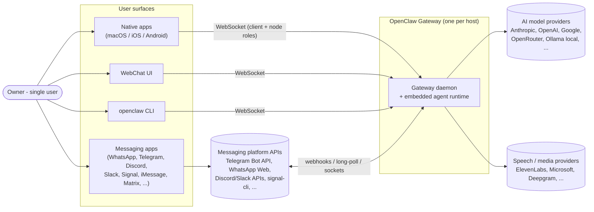
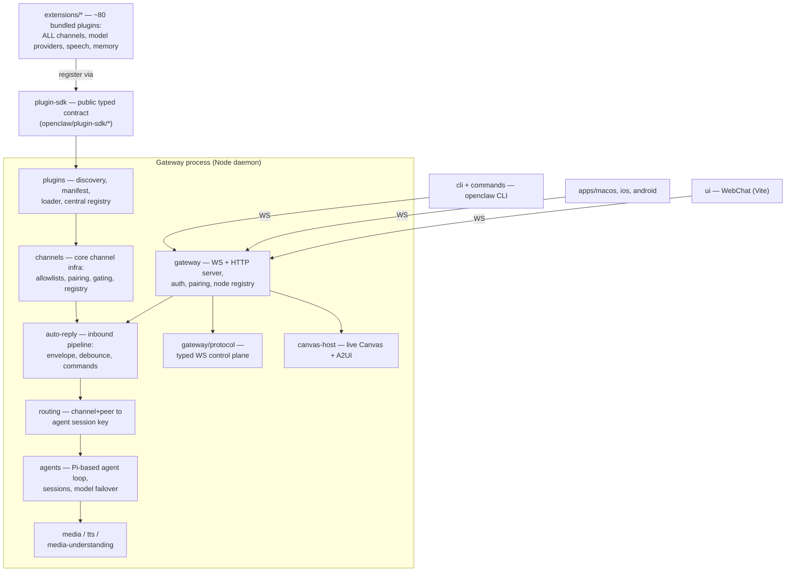
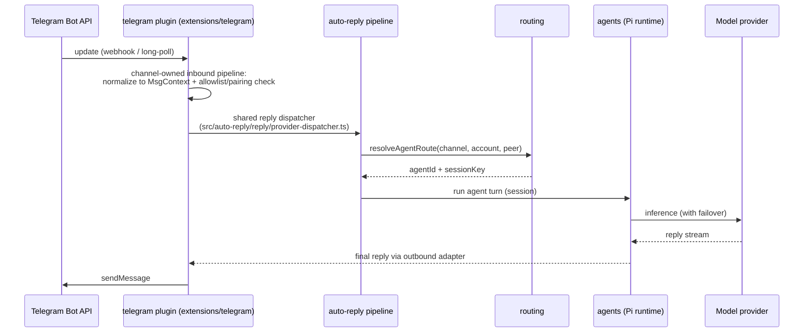

> Source: https://github.com/openclaw/openclaw · Date: 2026-08-11 · Mode: Explain · Type: Application
> See also: [Messaging Channels Integration Techniques](./openclaw_messaging_channels_integration.md)

Scope note: per request this document covers **C4 Level 1 (System Context)** and **Level 2 (High-Level Structure)** only. Component-level (C3) detail for the most architecturally interesting subsystem — the messaging-channel plugin boundary — lives in the sibling document above.

## 1. Overview

OpenClaw is a **personal AI assistant you self-host on your own devices**. It answers you on the messaging platforms you already use (WhatsApp, Telegram, Discord, Slack, Signal, iMessage, Matrix, Microsoft Teams, and ~20 more), can speak/listen on macOS/iOS/Android, and renders a live "Canvas". The heart of the system is a single long-lived **Gateway** daemon that owns all messaging connections and the agent runtime; everything else (CLI, native apps, web UI, device nodes) is a client of that Gateway (`README.md:21-24`, `docs/concepts/architecture.md`).

**Type: Application** — evidence: an executable entry point (`bin: {"openclaw": "openclaw.mjs"}` in `package.json`, bootstrapping `src/entry.ts`), a daemon server (`openclaw gateway`, installed as a launchd/systemd service), and packaged native apps under `apps/`. It also *behaves* like a platform: a large public Plugin SDK (`src/plugin-sdk/`) makes it a hybrid at the extension boundary.

**Tech stack**

| Aspect | Choice | Evidence |
|---|---|---|
| Language | TypeScript (ESM), strict | `tsconfig.json`, repo-wide |
| Runtime | Node 22.16+ / 24; Bun optional for dev | `README.md:52` |
| Package layout | pnpm workspace monorepo (`src/` core + `extensions/*` bundled plugins + `apps/` + `ui/`) | `pnpm-workspace.yaml` |
| Agent engine | `@mariozechner/pi-agent-core`, `pi-ai`, `pi-coding-agent` ("Pi") | `package.json` dependencies |
| Wire protocol | WebSocket (`ws`) with TypeBox-schema'd frames; JSON Schema + Swift codegen | `src/gateway/protocol/schema.ts`, `docs/concepts/architecture.md:109-113` |
| HTTP | `express` 5 / `hono` (webhooks, canvas host) | `package.json` |
| Validation | TypeBox (`@sinclair/typebox`) for protocol/tool schemas, `zod` at config boundaries | `package.json` |
| CLI | `commander` | `package.json`, `src/cli/` |
| Tests | Vitest (forks pool), colocated `*.test.ts` | `vitest.config.ts` |

## 2. System Context (C4 L1)

One human **owner** (this is deliberately a *single-user* assistant) reaches the assistant through many surfaces. The Gateway is the only process that talks to the outside world.

Key context facts, all from `docs/concepts/architecture.md`:

- A **single Gateway per host** owns all messaging surfaces (e.g., it is the only place a WhatsApp/Baileys session is opened).
- Control-plane clients (mac app, CLI, web UI, automations) connect over **WebSocket** on `127.0.0.1:18789` by default; remote access goes through Tailscale/SSH tunnels, same handshake.
- **Nodes** (macOS/iOS/Android/headless devices) connect to the *same* WebSocket server but declare `role: node` and expose device commands (`canvas.*`, `camera.*`, `screen.record`, `location.get`). Device pairing with challenge signing gates every connection.
- Inbound DMs from messaging platforms are treated as **untrusted input** — a pairing/allowlist policy layer sits in front of the agent (`README.md:112-120`).

## 3. High-Level Structure (C4 L2)

### Container/package map

| Path | Responsibility |
|---|---|
| `src/entry.ts`, `openclaw.mjs` | Process entry: CLI bootstrap, respawn plan, env normalization |
| `src/cli/`, `src/commands/` | `openclaw` CLI — onboarding wizard, channel/plugin/gateway management; a WS client of the Gateway |
| `src/gateway/` | The daemon: WebSocket control plane, HTTP server (webhooks + canvas), device/node auth & pairing, config reload, health |
| `src/gateway/protocol/` | Typed wire contract (TypeBox schemas → JSON Schema → generated Swift models). Protocol changes are versioned contract changes |
| `src/agents/` | Embedded agent runtime built on the Pi engine: session management, auth-profile rotation/failover, tools, subagents |
| `src/auto-reply/` | Inbound message pipeline: envelope building, debounce, command detection/registry, dispatch to agent (`dispatchInboundMessage` in `src/auto-reply/dispatch.ts`) |
| `src/routing/` | Maps `(channel, accountId, peer)` → agent id + session key (`resolveAgentRoute` in `src/routing/resolve-route.ts`) |
| `src/channels/` | **Core channel infrastructure** (not the channels themselves): plugin registry & adapter types, allowlists, pairing, command gating, outbound dispatch, status |
| `src/plugins/` | Plugin system: discovery, `openclaw.plugin.json` manifest validation, jiti in-process loader, central capability registry, contract enforcement |
| `src/plugin-sdk/` | The **public, versioned SDK surface** (`openclaw/plugin-sdk/*` subpaths) — the only door plugins may use into core |
| `extensions/` | ~80 bundled workspace plugins: **every messaging channel** (`telegram`, `whatsapp`, `discord`, `slack`, `signal`, `imessage`, `matrix`, `msteams`, ...), model providers (`anthropic`, `openai`, `google`, `ollama`, ...), speech (`elevenlabs`), memory, tools |
| `src/media*`, `src/tts/`, `src/image-generation/` | Media pipeline: understanding (image/audio/video), TTS/STT, generation — capability contracts implemented by provider plugins |
| `src/canvas-host/` | Agent-editable live Canvas + A2UI host, served by the Gateway HTTP server |
| `src/config/` | Config schema/loading (`~/.openclaw`), SecretRef semantics |
| `apps/macos`, `apps/ios`, `apps/android` | Native clients/nodes (menubar app hosts the Gateway on macOS) |
| `ui/` | WebChat web UI (Vite) speaking the Gateway WS API |

### The one architectural decision to remember

**Everything vendor- or platform-specific is a plugin; core owns only contracts and orchestration.** Even the "built-in" channels (Telegram, WhatsApp…) and model providers (Anthropic, OpenAI…) live in `extensions/` as bundled plugins consuming the same `openclaw/plugin-sdk/*` surface offered to third parties (`extensions/AGENTS.md`). Core (`src/`) owns the generic agent loop, the routing/security/pairing policy layer, the plugin registry, and the typed Gateway protocol. This is a microkernel-style architecture; the mechanics are dissected in the [channels integration doc](./openclaw_messaging_channels_integration.md).

## 4. Key Flow (representative, end-to-end)

One inbound chat message, traced at container level:

(Streaming/partial replies are intentionally **not** delivered to external messaging surfaces — only final replies; internal UIs may stream.)

## 5. Deeper Levels

C3 components, the OOP/class view of the channel contract, and extension points are covered — for the messaging subsystem, which is where the design earns its keep — in [Messaging Channels Integration Techniques](./openclaw_messaging_channels_integration.md).

## 6. Open Questions & Notes

- The macOS menubar app appears to be the supervisor of the Gateway on Mac (repo `CLAUDE.md` local-runtime notes); on Linux/servers it's launchd/systemd (`README.md:61`). Exact supervision matrix per platform not traced further.
- `src/node-host/`, `src/acp/`, and `Swabble/` were not explored; they look like node-side runtime, agent-client-protocol support, and an auxiliary project respectively — unverified.
- Version `2026.3.30` in `package.json` is the CLI/npm version at exploration time.
