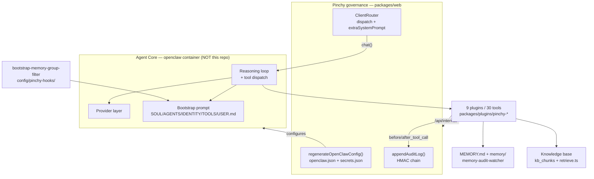
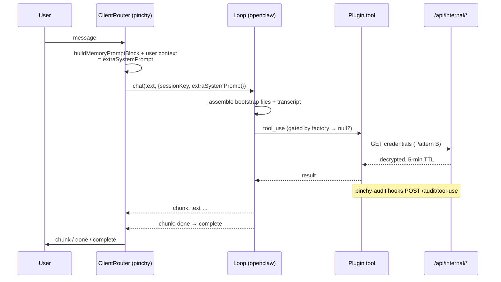
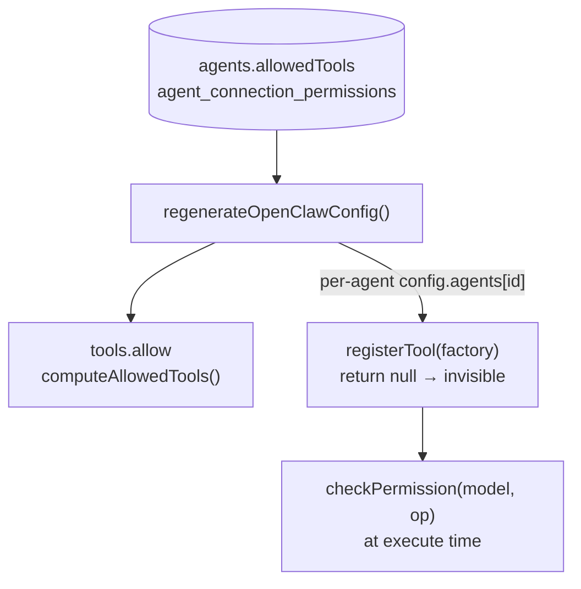

> Source: [heypinchy/pinchy](https://github.com/heypinchy/pinchy) (`main` @ `55343d0c`, v0.8.0) · Analyzed: 2026-07-20 · Type: **Hybrid** (embedded agent + authored agent-native content)
> See also: [System & OOP Architecture](./pinchy_system_oop_architecture.md) — containers, components, and the class view.

---

## 1. Overview

Pinchy is an **application with an agent inside it, plus the scaffolding that governs that agent**. The agent's CPU — the reasoning loop that calls an LLM until a stop reason and dispatches tool calls — is *not in this repository*. It lives in the `openclaw` npm package (`2026.7.1`), running as a sibling Docker container. Pinchy owns everything around that CPU: which model it may use, which tools exist and which agent may see each one, what its system prompt says, where its memory lives, what gets recorded when it acts, and who is allowed to talk to it at all.

The interesting consequence: **Pinchy governs an agent it does not run.** Its primary control surface is not a function call but a *generated configuration file*. `regenerateOpenClawConfig()` compiles the database — agents, permissions, groups, connections, skills — into `openclaw.json` and `secrets.json`, which the runtime then obeys. Governance is a compiler, not an interceptor.

### Type classification — Hybrid (C)

Judged by `src/`, per the disambiguation rule:

- **Not a Runtime (B).** No loop exists in this repo. `grep` finds no `while`-until-stop-reason, no tool-dispatch switch, no provider SDK calls building a messages array. `openclaw` appears only as a **devDependency** of `packages/web`; the production dependency is `openclaw-node` `0.13.1`, a WebSocket *client*. `packages/web/src/server/client-router.ts` consumes `openclawClient.chat()` as an `AsyncGenerator<ChatChunk>` — it drains a loop someone else runs.
- **Not a pure Pack (A).** It ships far more than instruction files: an HTTP/WS application, a database, a permission model, nine plugin packages implementing 30 tools.
- **Hybrid**, therefore, on both counts: an application with an embedded agent as its core feature, *and* a producer of agent-native authored content — `SOUL.md` bodies in `personality-presets.ts`, `SKILL.md` files under `lib/skills/`, per-agent `AGENTS.md` generated from templates, and an OpenClaw hook handler in `config/pinchy-hooks/`.

### Substrate

TypeScript throughout. Harness: OpenClaw 2026.7.x over its WebSocket gateway. Models: Anthropic, OpenAI, Google, Ollama Cloud, Ollama local, and a bundled llama.cpp GGUF for embeddings. Channels: web chat and Telegram.

---

## 2. Agentic Anatomy

Read the diagram as a **control plane / data plane split**. Pinchy's boxes never sit between the loop and the model; they sit *upstream* (config generation, prompt assembly, dispatch) and *downstream* (audit capture, credential vending). The agent runs unsupervised in between — which is precisely why every tool it can reach is a Pinchy-authored plugin that phones home.

---

## 3. The Core

### Where the loop is, and what Pinchy sees of it

The loop is opaque. What Pinchy observes is a chunk stream, drained in `ClientRouter.pipeStream()` (`src/server/client-router.ts`). The chunk kinds it handles reveal the loop's shape:

| Chunk | What it implies about the loop |
|---|---|
| `userMessagePersisted` | The runtime — not Pinchy — owns conversation history |
| `text` | Token streaming from the provider |
| `done` | End of **one agent turn**; Pinchy rotates `messageId` and keeps listening |
| `complete` | End of the **whole run** — the loop reached a stop reason |
| `error` | Provider or dispatch failure, classified by `agent-error-classifier.ts` |

The `done`-then-more-then-`complete` pattern is the tell: this is a **nested loop**. An inner loop runs tool calls to completion within a turn; an outer loop may produce several turns before the run ends. Tool calls themselves are invisible on this stream — Pinchy learns about them out-of-band, through the `pinchy-audit` plugin's hooks. That asymmetry is deliberate and it is the whole reason the audit plugin exists.

### One agent turn, end to end

### The prompt is assembled in three layers, split by who may delete each

This is the sharpest design decision in the system, stated explicitly in `lib/memory-prompt.ts`:

| Layer | Files / mechanism | Editable by |
|---|---|---|
| **User-authored** | `SOUL.md`, `AGENTS.md` (`ALLOWED_FILES`) | The user, freely |
| **Platform-generated on disk** | `IDENTITY.md`, `TOOLS.md`, `USER.md` | Regenerated; user edits are overwritten |
| **Platform-generated per turn** | `extraSystemPrompt`, rebuilt on every dispatch | Nobody |

*A platform capability must never live in a layer a user can delete.* Memory instructions, the current user's name and context, and the first-turn greeting note all go in layer 3 — because a user who deletes `AGENTS.md` must not thereby silently disable memory.

Bootstrap sizes feed `bootstrap-caps.ts`, which raises OpenClaw's default 12,000-character cap per agent. That matters more here than upstream: `build.ts` deliberately keeps `SOUL.md` / `AGENTS.md` / `IDENTITY.md` **out** of the agent's readable paths, so OpenClaw's "read AGENTS.md for the full content" escape hatch does not work — truncation would be silent and permanent.

### Model layer

`resolveModelForTemplate(hint)` dispatches over five provider strategies. A `ModelHint` is `{tier: fast|balanced|reasoning, taskType?, capabilities?}`; unsatisfiable capability requests raise `TemplateCapabilityUnavailableError` rather than silently degrading.

`lib/model-resolver/blocklist.ts` is the most epistemically careful file in the repo. Three rules today, each with a written incident behind it:

- `/deepseek-r1/i` — tool calling unreliable without `reasoning:false`
- `/-preview\b/i` — preview models leak tool calls as plain `default_api` text
- `/minimax-m…/` — nested arrays collapse to `{"item": …}`, arguments arrive positional; 20/60 mangled calls measured against 0/112 for kimi-k2.6

The minimax comment then **downgrades its own evidence**, noting the eval sweep grades outcomes and never inspects a tool-call payload, so the number grounds a suspicion rather than proving a mechanism. `AGENTS.md` encodes the same restraint as policy: *"A flag is a reason to look, never a reason to block."* Of four flagged eval cells, only one became a blocklist rule; the others were judgement and honesty defects, handled by ranking.

---

## 4. Context & Memory

### Two memory tiers, one write tool

| Tier | Location | Written by |
|---|---|---|
| Long-term | `<workspace>/MEMORY.md` | The agent, via `pinchy_write` |
| Daily notes | `<workspace>/memory/YYYY-MM-DD.md` | The agent, via `pinchy_write` |

`MEMORY.md` is granted in `build.ts` as a **file** entry, not the workspace root — so the agent can rewrite its memory but never its own identity or instructions. `memory/` is granted as a subtree.

`buildMemoryPromptBlock(allowedTools)` returns `null` unless `pinchy_write` is granted. An agent with no write path *cannot* persist memory, and telling it otherwise reproduces the exact hallucination the block exists to prevent.

That block's most instructive content is a **recall fallback**. OpenClaw's `memory_search` rides an embedding index that was dead in production (memory-core defaults to an `openai` embedding provider with no key → zero indexed chunks → tool returns `disabled`). The agent then confabulated an explanation — "the memory index changed, tell me again." The block now steers to the always-working path (`pinchy_read` on `MEMORY.md`, `pinchy_ls` to discover topic notes) and explicitly forbids inventing a reason or asking the user to repeat something already saved. The root cause was fixed too: `build.ts` pins `memorySearch.provider: "local"` to a bundled EmbeddingGemma-300m GGUF, chosen because no key-less multilingual alternative works offline.

### Compaction — configured, not implemented

Compaction lives in OpenClaw. Pinchy's involvement is two-sided:

- It **disables** OpenClaw's native pre-compaction memory flush (`compaction.memoryFlush.enabled = false`), because that routine hardcodes built-in `read`/`write` tools Pinchy never grants. It ran with zero tools, flailed through "tool not found", returned `NO_REPLY`, and consumed the user's inbound turn — in production it silently dropped a Telegram receipt image.
- It **observes** compaction indirectly. `usage_records.contextTokens` records the prompt size of a turn's *last* call. A drop between consecutive turns is the only visible evidence that compaction fired, since OpenClaw emits no compaction event. The column comment records the 2026-07-15 incident that motivated it: an agent at ~170k context with a 1M-configured window never tripped the threshold and began fabricating tool results.

### Memory is audited by watching the filesystem

There is no memory-write API to instrument, so `lib/memory-audit-watcher/` chokidar-watches the workspace volume, diffs `MEMORY.md` and `memory/*.md` on change, and emits `agent.memory_changed` audit rows with added/removed line counts. Details that matter: polling is on by default (a Docker bind mount does not propagate container-side creates to host `fs.watch`); an initial `scanning` phase populates snapshots without emitting (those files predate the process); and an `inflight` map serialises events per path so the snapshot map cannot be read-then-written racily.

### Context injection

`lib/context-sync.ts` writes `users.context` into `USER.md` for personal agents and the `org_context` setting for shared ones. The agent maintains this itself: `pinchy_save_user_context` and `pinchy_save_org_context` are how Smithers records what it learns during the onboarding interview.

---

## 5. Capabilities

| Organ | Where it lives | Code or content |
|---|---|---|
| Tools | `packages/plugins/pinchy-*/index.ts` — 30 tools across 9 plugins | Core code (plugin-provided) |
| Tool declaration | each `openclaw.plugin.json#contracts.tools` | Authored content |
| Skills | `packages/web/src/lib/skills/<id>/SKILL.md` (`web-search`, `email`) | Authored content |
| Personalities | `lib/personality-presets.ts` → `soulMd` per preset | Authored content |
| Agent instructions | `lib/agent-templates/generate-agents-md.ts` → per-agent `AGENTS.md` | Generated content |
| MCP | — | **Absent** (see §8) |

### The tool inventory

| Plugin | Tools | Credential pattern |
|---|---|---|
| `pinchy-odoo` | 19 — `odoo_read`, `odoo_create`, `odoo_write`, `odoo_reconcile`, `odoo_confirm_order`, `odoo_attach_file`, … | B |
| `pinchy-email` | 6 — `email_list/read/search/get_attachment/draft/send` | B |
| `pinchy-files` | 3 — `pinchy_ls`, `pinchy_read`, `pinchy_write` | local FS |
| `pinchy-web` | 2 — `pinchy_web_search`, `pinchy_web_fetch` | B |
| `pinchy-docs` | 2 — `docs_list`, `docs_read` | local FS |
| `pinchy-context` | 2 — `pinchy_save_user_context`, `pinchy_save_org_context` | gateway token |
| `pinchy-knowledge` | 1 — `knowledge_search` | gateway token |
| `pinchy-audit` | 0 — hooks only | gateway token |
| `pinchy-transcript` | 0 — hooks only | gateway token |

### Permission enforcement is three layers deep

1. **Outer boundary — `tools.allow`.** `computeAllowedTools()` returns every Pinchy plugin tool name (derived from the manifests, so it cannot drift) plus exactly three built-ins: `memory_search`, `memory_get`, `session_status`. With no `tools.profile` set, OpenClaw treats `allow` as absolute, so this is **fail-closed against built-ins Pinchy has never heard of** — including ones a future OpenClaw version adds. This is the same superset for every agent; it is not the per-agent gate.
2. **Per-agent gate — the tool factory.** `registerTool` takes a *factory* invoked per session with `ctx.agentId`. Returning `null` makes the tool invisible to that agent. This is where `agents.allowedTools` actually bites.
3. **Per-operation gate — execute time.** Even a visible tool re-checks: `checkPermission(permissions, model, operation)` in the Odoo and email plugins, driven by `agent_connection_permissions` rows.

The README's claim — *"A 'read Odoo sales orders' tool, not `exec`"* — is literally what layer 1 implements. `group:fs` is denied outright; `pinchy_write` is the only writer the agent has.

### Opaque capability tokens

`_pinchy_ref` (`pinchy-odoo/integration-ref.ts`) is `pinchy_ref:v1:<base64url(AES-256-GCM)>` sealing `{integrationType, connectionId, model, id, label, companyId?}`. It is a **synthetic field** — stripped before any query reaches Odoo, attached to every returned record. Two properties follow: the model cannot forge a record reference, and `assertNoCrossCompanyRefs()` can refuse a cross-company write from the embedded `companyId` without an extra round trip.

The error design is worth stealing. `MalformedIntegrationRefError` (not a valid ref at all) and a plain `Error` (valid but wrong connection) are separate types, discriminated by `instanceof` rather than message text — because on 2026-07-15 an agent reported 11 model-garbled refs as "does not belong to this Odoo connection" and sent the investigation down a key-rotation dead end.

---

## 6. Orchestration & Autonomy

### Hooks — the only place Pinchy runs code inside the agent's turn

Two mechanisms, and they are different in kind:

| Hook | Where | Fires on | Does |
|---|---|---|---|
| `pinchy-audit` | plugin, `index.ts` | `before_tool_call`, `after_tool_call` | POSTs sanitised tool params + outcome to `/api/internal/audit/tool-use` |
| `pinchy-transcript` | plugin, `index.ts` | `message_received`, `message_sent` | Mirrors channel messages into `channel_messages`; copies inbound media out of OpenClaw's `0700` store |
| `bootstrap-memory-group-filter` | `config/pinchy-hooks/handler.mjs` → `/opt/pinchy-hooks` | `agent:bootstrap` | Strips `MEMORY.md` from bootstrap when the session key is a **group** session |

That last one is a genuine agentic guardrail: without it, memory the agent formed in one user's DM would be injected into a shared group chat. It **fails loud, not open** — it warns if the event lacks `bootstrapFiles[]` or a string `sessionKey`, because silence would mean the filter is not running and nobody would know.

### Autonomous triggers

| Trigger | File | Cadence |
|---|---|---|
| Email workflows (Inbox Agent) | `lib/email-workflows/sweep.ts`, `server/inbox-sweep.ts` | 15 min, 30 s startup delay |
| KB reindex | `server/kb-index-worker.ts` | Queue-driven (`kb_index_jobs`) |
| Run watchdog | `server/run-watchdog.ts` | 30 s tick; aborts runs with no first chunk after 180 s |
| Channel health | `server/channel-health-watchdog.ts` | 30 s; audits degraded→failed→recovered, can auto-disable |
| Audit chain verify | `server/audit-verify-job.ts` | Hourly + post-startup |

Background agent runs produce `notifications` rows, never chat messages — a deliberate separation so an autonomous run cannot silently interleave into a human conversation.

### Guardrails and HITL

| Guardrail | Mechanism |
|---|---|
| Tool allow-list | Three layers, §5 |
| Path containment | Two-stage in `lib/agent-file-access.ts`: lexical `resolve()` (no FS touch, so an out-of-scope probe never hits disk), then realpath re-check to defeat planted symlinks. Deny-by-default; **404 only for paths genuinely in scope**, so probing never reveals existence |
| Cross-company writes | `assertNoCrossCompanyRefs()` from the sealed ref |
| Credential blast radius | Pattern B: 5-minute TTL, invalidated on 401 |
| Tamper evidence | HMAC chain with `prevHmac` linking; `pg_advisory_xact_lock` serialises appends so concurrent writers cannot fork the chain |
| Group memory leakage | The bootstrap hook above |
| Model capability | `blocklist.ts` + `validateAgentModel()` |

There is **no interactive approval gate** — no "the agent wants to send this email, approve?" step. Governance is *ex ante* (what the agent may do at all) and *ex post* (a signed record of what it did), not *in medias res*. For a platform whose pitch is autonomous agents rather than flow builders, that is a coherent position, but it is a real product boundary: a mis-scoped `email_send` grant has no second line of defence.

### Session & identity

Session keys are `agent:<agentId>:direct:<userId>` or `agent:<id>:<channel>:group:<peer>`, always derived server-side. `/api/internal/channel-messages` re-derives the agent and peer **from the session key and ignores the body** — a plugin cannot attribute a message to another agent. `SessionPokeBridge` fans body-free change notifications to a user's other devices, routed by the server-subscribed key.

### Evaluation — agent reliability as a committed artifact

`packages/web/eval/` is a 7-scenario benchmark over an Odoo invoice-booking task, with a KB-retrieval sibling under `eval/kb/`. Three design choices make it more than a scoreboard:

- **Oracles.** Each scenario ships a hand-authored golden trajectory *and* a canonical wrong one with the `FailureTag` the grader must assign — so grader regressions are caught without live model runs.
- **A triage ledger.** `triage-ledger.ts` demands a committed verdict (`blocked` or `accepted`, with prose reasoning) for every capable-model-scored-zero cell. `scorecard-triage-guard.test.ts` fails both drift directions: a flagged cell with no entry, *and* an entry whose cell no longer flags. A verdict must not outlive its evidence.
- **A canary.** `EVAL_CANARY_GUID` detects training contamination of the published dataset.

The motivating failure is recorded in `AGENTS.md`: a 0/12 score sat in the repo for four days before the same defect hit production, because nothing wired the number to the blocklist.

---

## 7. Extension Points

| To add… | How |
|---|---|
| **A tool** | `registerTool(api, schema, {name}, handler)` → declare in `contracts.tools` (OpenClaw 5.3+ silently ignores undeclared tools) → add a `TriggerConfig` to the fake-Ollama server → assert via `pollAuditForTool` |
| **A ref-based tool** | Add a `RefDispatchProbe` to `REF_DISPATCH_PROBES`; the fake LLM resolves the ref at runtime by first dispatching `odoo_read`, exactly as a real model would. A new ref tool with neither coverage nor a `PENDING_E2E` exemption fails CI |
| **A skill** | `src/lib/skills/<id>/SKILL.md` + add to `KNOWN_SKILLS`; written to `<workspace>/skills/<id>/` at config-regenerate time, where OpenClaw auto-discovers it at highest precedence |
| **A personality** | Add a `PersonalityPreset` with its `soulMd` body |
| **A hook** | Drop a handler in `config/pinchy-hooks/`; `build.ts` unions the dir into `hooks.internal.load.extraDirs` |
| **A provider / model** | Resolver under `lib/model-resolver/providers/`, plus a secret prefix in `openclaw-plaintext-scanner.ts` |

---

## 8. Organ Presence Matrix

| Organ | Present? | Where | Notes |
|---|---|---|---|
| Reasoning loop | ⚠️ external | `openclaw` container | Not in this repo. Pinchy drains `chat()` as an `AsyncGenerator` and infers a nested inner/outer shape from `done` vs `complete` |
| Model / provider layer | ✅ | `lib/model-resolver/`, `lib/provider-models.ts` | 5 providers; capability-aware selection; evidence-based blocklist |
| System prompt | ✅ | 3 layers — workspace files + `extraSystemPrompt` | Split by who may delete each layer |
| Context window mgmt | ⚠️ external | OpenClaw | Pinchy sets `contextTokens` policy caps and `bootstrapMaxChars` |
| Compaction | ⚠️ configured | `build.ts` | Native memory-flush **disabled**; compaction observed only via a `contextTokens` drop |
| Memory (persistent) | ✅ | `MEMORY.md` + `memory/`, `memory-audit-watcher/` | Agent-written via `pinchy_write`; audited by filesystem watch |
| Memory (semantic index) | ⚠️ partial | OpenClaw memory-core, pinned to a local GGUF | Was dead in production; prompt now carries a documented fallback |
| Retrieval / RAG | ✅ | `lib/knowledge/`, `kb_chunks` | bge-m3 1024-dim, hybrid vector + FTS fused by RRF (k=60), path-filtered by `allowed_paths` |
| Tools | ✅ | 9 plugins, 30 tools | Registry → manifest → factory gate → execute-time permission |
| Skills | ✅ | `lib/skills/` | Only two (`web-search`, `email`); empty list correctly excludes OpenClaw's 58 bundled desktop skills |
| **MCP** | ❌ | — | **Absent.** No MCP client, server, or `.mcp.json`. All external capability arrives through first-party plugins — consistent with a governance product that must own the audit and permission path end to end, but it means every integration is a bespoke plugin with its own mock, compose overlay and CI job |
| **Subagents** | ❌ | — | **Absent** in Pinchy. The bootstrap hook's session-key parser recognises a `subagent` form, so the runtime supports them; Pinchy neither spawns nor governs them. A gap worth naming: a subagent would inherit tools with no Pinchy-level policy of its own |
| Hooks / triggers | ✅ | `pinchy-audit`, `pinchy-transcript`, `config/pinchy-hooks/` | Plus five scheduled workers |
| Permissions / guardrails | ✅ | Three-layer allow-list, path containment, sealed refs | Strongest organ in the system |
| **HITL** | ❌ | — | **Absent by design.** No mid-run approval gate; governance is ex ante + ex post |
| Session / event bus | ✅ | `ClientRouter`, `ActiveRuns`, `SessionPokeBridge` | Server-derived session keys; multi-device fan-out |
| Evaluation | ✅ | `packages/web/eval/` | Oracles, triage ledger, contamination canary — rare to find committed |

---

## 9. Glossary & Open Questions

### Glossary

| Term | Meaning |
|---|---|
| **Session key** | `agent:<agentId>:direct:<userId>` or `agent:<id>:<channel>:group:<peer>`. Always server-derived |
| **Soul** | An agent's personality document (`SOUL.md`), loaded as bootstrap context. Four presets ship: the-butler, the-professor, the-pilot, the-coach |
| **Smithers** | The per-user personal assistant, seeded on first login with the `the-butler` soul |
| **Bootstrap files** | `AGENTS.md`, `SOUL.md`, `TOOLS.md`, `IDENTITY.md`, `USER.md`, `HEARTBEAT.md`, `BOOTSTRAP.md` — what OpenClaw reads to build the system prompt |
| **`extraSystemPrompt`** | The per-turn platform prompt layer, rebuilt on every dispatch |
| **Pattern B** | A plugin holds only an opaque `connectionId`; real credentials are fetched per call and cached ~5 min |
| **`_pinchy_ref`** | An AES-GCM-sealed record reference; synthetic, never present in Odoo |
| **Capable model** | In the eval guard: median pass rate ≥ 0.5 across other capability scenarios — the anchor that makes a zero informative |
| **Oracle** | A hand-authored golden + canonical-wrong trajectory pair that tests the grader itself |

### Open questions

1. **The loop's real control shape is inferred, not read.** `openclaw` was not installed in this clone (`node_modules` absent), so everything in §3 about nested turns, tool dispatch and compaction thresholds comes from Pinchy's consumption of the chunk stream and from comments in `build.ts`. Reading OpenClaw 2026.7.1's source would confirm or correct it.
2. **How much steering do the tool *descriptions* do?** The plugins carry substantial prompt-engineering inside tool metadata — `PRODUCT_REF_DISAMBIGUATION_HINT`, `formatMultiMatchError`, the Odoo schema-compaction layer that shrinks a model definition to fit a context window. That is real agentic design living in error strings, and it was not systematically inventoried here.
3. **Is the absent HITL gate a decision or a gap?** Nothing in the repo argues for or against an approval step. Given that `email_send` and `odoo_write` are grantable, and that the audit trail is explicitly *ex post*, it seems worth an explicit ADR either way.
4. **Subagent governance is undefined.** The runtime supports subagent sessions; Pinchy has no policy for them. If OpenClaw can spawn one, whose `allowedTools` does it inherit, and which `agentId` does the audit hook attribute its tool calls to? The `extractAgentIdFromSessionKey` fallback in `pinchy-audit` suggests this path is at least reachable.
5. **Two embedding stacks are easy to confuse** — EmbeddingGemma-300m (memory, local GGUF) versus bge-m3 @ 1024-dim (knowledge base, Ollama). Different models, dimensions, storage and failure modes. Likewise two different `contextTokens`: a static policy cap in `ollama-cloud-models.ts` and a measured per-turn value in `usage_records`. The codebase flags both collisions; new work should keep them flagged.
