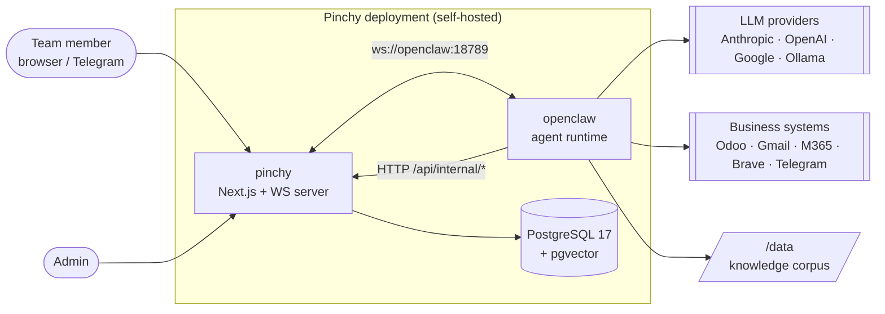
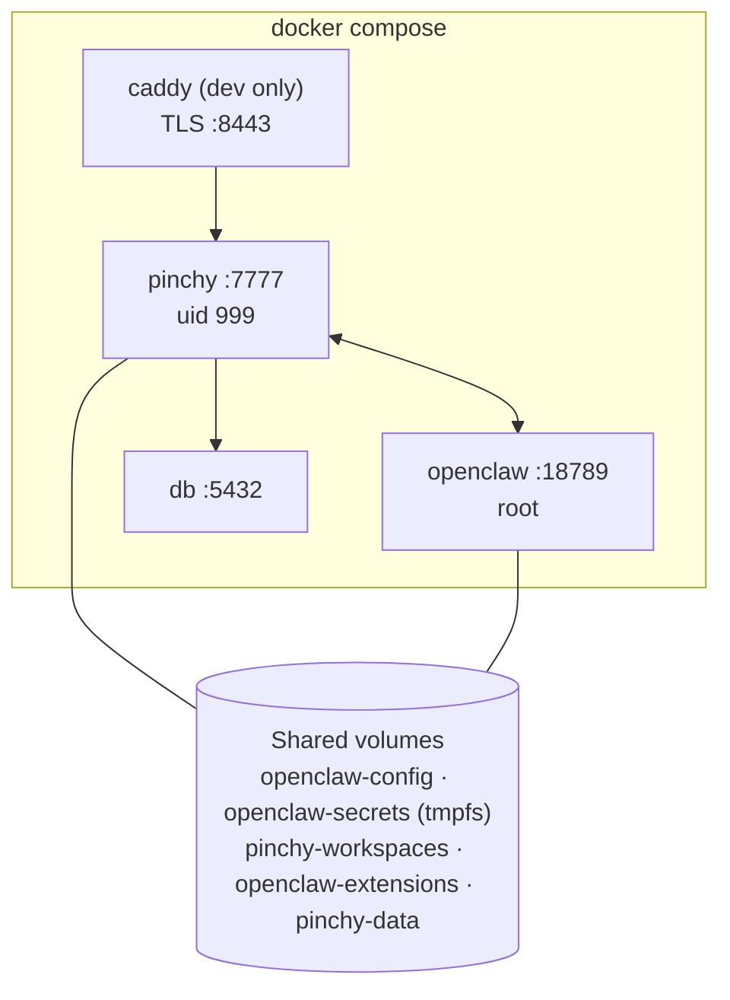
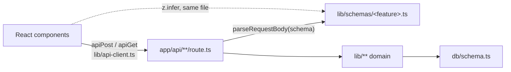
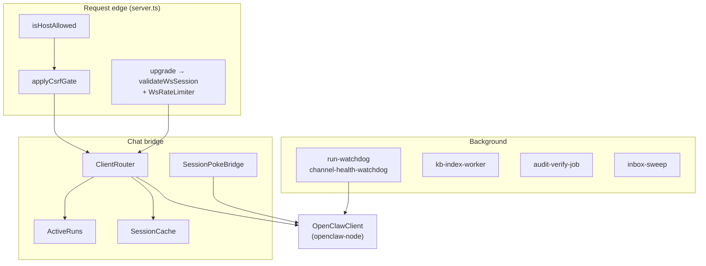
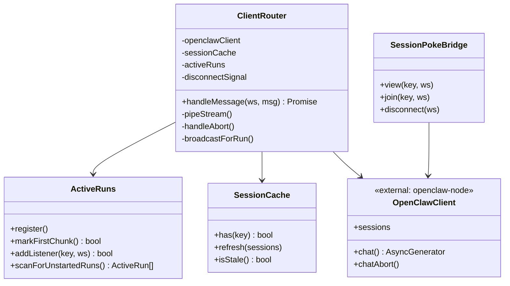
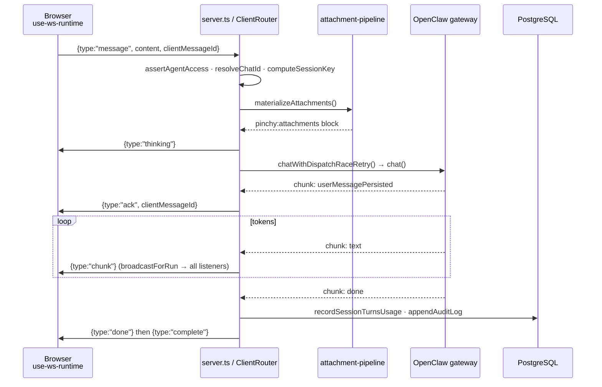
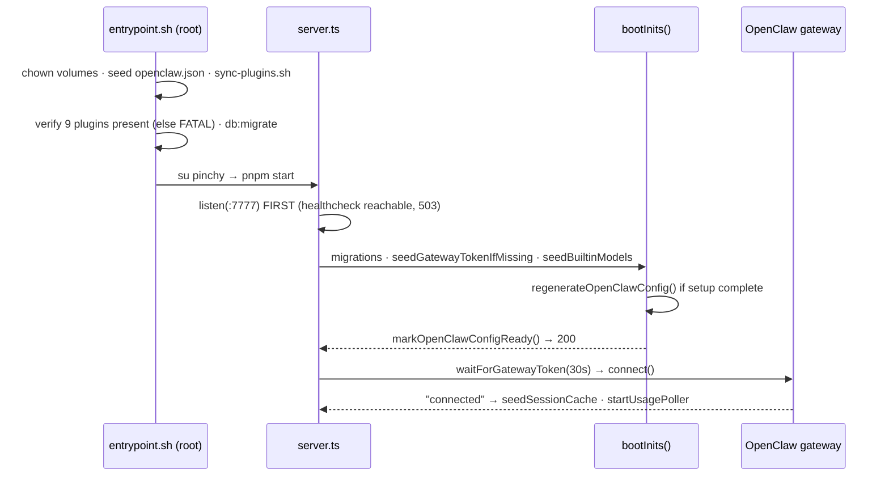

> Source: [heypinchy/pinchy](https://github.com/heypinchy/pinchy) (`main` @ `55343d0c`, v0.8.0) · Analyzed: 2026-07-20 · Type: **Application**
> See also: [Agentic Architecture](./pinchy_agentic_architecture.md) — the agent core and the organs around it.

---

## 1. Overview

**Pinchy is an enterprise governance layer wrapped around the OpenClaw agent runtime.** OpenClaw supplies the agent brain — the reasoning loop, tool execution, session history, memory index. Pinchy supplies everything a company needs before it will let that brain touch its data: authentication, per-agent tool allow-lists, a tamper-evident audit trail, user/group access control, credential custody, and a one-command self-hosted deployment.

The governing design rule (`AGENTS.md`): *"OpenClaw is the runtime. Do not rebuild capabilities OpenClaw already provides; wrap, extend, and govern it."*

### Type classification — Application

Evidence: a custom HTTP/WebSocket server bootstrap at `packages/web/server.ts` (not stock `next start`), a container entrypoint `entrypoint.sh`, and four `docker-compose*.yml` stacks. No package is published — the root `package.json` is `"private": true`, as is `packages/web`. The nine `packages/plugins/pinchy-*` packages look library-ish but are **not** distributed: `config/sync-plugins.sh` copies them into a shared Docker volume for the OpenClaw container to load. They are an internal extension surface, not a public API — so this is an Application with a plugin seam, not a Hybrid.

### Tech stack

| Layer | Technology |
|---|---|
| Frontend | Next.js 16, React 19, Tailwind v4, shadcn/ui (`radix-ui`), `@assistant-ui/react` (patched), zustand |
| Server | Custom Node server (`packages/web/server.ts`) hosting Next + `ws` WebSocketServer |
| Auth | Better Auth 1.6 (`admin` plugin, DB sessions), `bcryptjs` legacy-hash fallback |
| Data | PostgreSQL 17 (`pgvector/pgvector:pg17-trixie`), Drizzle ORM, `postgres` driver |
| Agent runtime | OpenClaw `2026.7.1` in a sibling container; `openclaw-node` `0.13.1` WS client |
| Embeddings | bge-m3 @ 1024-dim via Ollama `/api/embed` (KB); EmbeddingGemma-300m GGUF via `node-llama-cpp` (memory) |
| Integrations | `odoo-node`, `imapflow`, `nodemailer`, Gmail/Graph REST, Brave Search |
| Crypto | AES-256-GCM (secrets, refs), HMAC-SHA256 (audit chain), ES256 JWT (licence) |
| Tests | Vitest, Playwright (7 configs), `node --test` for scripts |
| Deploy | Docker Compose, GHCR images · License AGPL-3.0 |

---

## 2. System Context

Two things in this picture are unusual and worth internalising early:

1. **The arrow between `web` and `oc` runs both ways over different transports.** Pinchy dials *out* to the gateway over WebSocket to dispatch chats; OpenClaw plugins dial *back in* over HTTP to `/api/internal/*` to fetch credentials and post audit rows. Neither container fully trusts the other's inputs.
2. **`oc` — not `web` — holds every outbound third-party connection.** The web tier never calls Odoo or Gmail during a chat. It only hands out short-lived decrypted credentials on request. That inversion is what makes per-agent permissions enforceable at the tool boundary.

---

## 3. High-Level Structure

### 3.1 Containers

**Startup order is inverted from intuition:** `openclaw` `depends_on: pinchy (service_healthy)`, because Pinchy owns `openclaw.json` and the gateway token. `entrypoint.sh` therefore seeds a minimal `{"gateway":{"mode":"local","bind":"lan"}}` before Node boots — Docker will not copy image files into an already-mounted volume, so without the seed OpenClaw restart-loops on "Missing config". The health gate is `GET /api/internal/openclaw-config-ready`, which is deliberately public *and* loopback-only in `host-check.ts`.

### 3.2 Source tree

| Path | Responsibility |
|---|---|
| `packages/web/server.ts` | Process bootstrap: HTTP + WS server, host/CSRF gates, boot inits, background workers, gateway client, ordered shutdown |
| `packages/web/src/app/api/**` | 86 route handlers — the REST surface |
| `packages/web/src/server/**` | Server-only runtime: gateway client, per-socket router, run registry, watchdogs, workers |
| `packages/web/src/lib/**` | Domain logic: agents, auth, audit, encryption, knowledge, models, licence, config generation |
| `packages/web/src/db/**` | Drizzle schema, enums, pgvector custom type |
| `packages/web/src/components/**`, `hooks/**` | React UI and the browser-side WS runtime |
| `packages/plugins/pinchy-*` | Nine OpenClaw plugins — the agent's tools and hooks |
| `config/` | Base `openclaw.json`, startup/sync scripts, the one internal hook, seven mock servers |
| `scripts/lib/*.mjs` | CI drift guards (each paired with a `.test.mjs`) |
| `docs/` | Astro Starlight site; also read at runtime by the `pinchy-docs` tool |

### 3.3 The layer rule that shapes everything

One Zod schema per feature is imported by **both** the route (for `parseRequestBody`) and the client component (for `z.infer` on the request body). Contract drift between client payload and server validator becomes a compile error rather than a runtime 400. Raw `fetch` in client components is forbidden; the typed helpers in `lib/api-client.ts` throw `ApiError`, which components surface via `toast.error(e.message)`.

---

## 4. Components — inside the `pinchy` container

| Component | File | Responsibility |
|---|---|---|
| `ClientRouter` | `src/server/client-router.ts` | One per browser socket. Authorises, resolves session keys, dispatches to the gateway, normalises the stream back. The heart of the system (~1930 lines) |
| `ActiveRuns` | `src/server/active-runs.ts` | Server-wide in-flight run registry; also the per-run listener set powering multi-socket fan-out |
| `SessionCache` | `src/server/session-cache.ts` | TTL'd set of session keys the gateway is known to hold — union-merges, never shrinks |
| `SessionPokeBridge` | `src/server/session-poke-bridge.ts` | Refcounted upstream subscription fanning **body-free** `poke` frames to other devices |
| `WsRateLimiter` | `src/server/ws-rate-limit.ts` | Per-IP upgrade rate, per-user concurrent connection cap |
| `ChannelHealthMonitor` | `src/server/channel-health-watchdog.ts` | Polls `channels.status()`; audits degraded→failed→recovered transitions |
| `regenerateOpenClawConfig` | `src/lib/openclaw-config/build.ts` | Projects the DB into `openclaw.json` + `secrets.json` — the compiler at the heart of governance |

### The single most load-bearing function

`regenerateOpenClawConfig()` is where Pinchy's product promise becomes a file on disk. It reads agents, `agent_connection_permissions`, settings and skills, deep-merges over the existing config, and emits: `tools.allow` (the global tool allow-list from `computeAllowedTools()`), one `plugins.entries.<id>` block per plugin carrying a per-agent config map, `hooks.internal.load.extraDirs`, bootstrap character caps, and the secrets bundle. It ends by validating every emitted plugin entry against that plugin's manifest schema — so a config that would silently mis-configure a plugin fails at write time rather than at tool-call time.

---

## 5. OOP & Class Architecture

Pinchy is mostly **modules of functions**, not class hierarchies — idiomatic modern TypeScript. Classes appear exactly where there is per-instance mutable state to own.

### Patterns actually in use

| Pattern | Where | Why |
|---|---|---|
| **Adapter** | `pinchy-email/email-adapter.ts` ← `gmail-adapter` / `graph-adapter` / `imap-adapter` | One `EmailAdapter` interface; three wire protocols behind six stable tool names |
| **Factory + null-object gate** | every plugin's `registerTool(factory)` | The factory returns `null` to make a tool *invisible* to an agent — the real per-agent permission point |
| **Dependency injection via deps object** | `WatchdogDeps`, `ChannelHealthDeps`, `IngestDeps`, `RetrieveDeps` | Time (`now`), DB, and audit writers are injected so pure logic is testable without fake timers or a live stack |
| **Singleton-on-globalThis** | `active-runs-singleton.ts`, `openclaw-client.ts`, `session-poke-bridge-singleton.ts` | Next.js may load API routes in a *different module context* than `server.ts`; `globalThis` is the only shared slot |
| **Strategy** | `lib/model-resolver/providers/*.ts` behind `resolveModelForTemplate` | Five provider-specific model-selection algorithms, one entry point |
| **Custom type / value object** | `db/vector.ts` `vector` | Drizzle has no pgvector support; `toDriver`/`fromDriver` bridge `number[]` ↔ pgvector literal |
| **Opaque handle (capability token)** | `pinchy-odoo/integration-ref.ts` | An AES-GCM-sealed `_pinchy_ref` carries `{connectionId, model, id, companyId}` so a record reference cannot be forged or cross-tenant replayed |
| **Null object** | `NEVER_DISCONNECTS`, `createColdStartStatusBroadcaster()` | Guarantees honest behaviour before the gateway client exists, instead of null-checks everywhere |

`ClientRouter` deserves a note on interface depth: it exposes **one** public method, `handleMessage(ws, message)`, over roughly a dozen private ones. Three inbound frame types (`message`, `history`, `abort`) and a large private surface for stream piping, error classification, persistence and fan-out. That is a deep module in Ousterhout's sense — a very simple interface hiding a lot of protocol complexity.

---

## 6. Key Flows

### 6.1 A chat message, end to end

Notes that explain otherwise-baffling code:

- **History is not Pinchy's.** There is no `messages` table for web chat. `userMessagePersisted` is OpenClaw's acknowledgement, and `handleHistory` reads the transcript back with `sessions.history(sessionKey)`. Pinchy's DB writes are side-channels: usage, errors, audit.
- **The run is registered at dispatch**, not at first chunk — so a backend that never answers is still visible to `run-watchdog`.
- **Every chunk is streamed through `iterateUntilAborted`**, racing each `next()` against a disconnect signal. Without it, `openclaw-node`'s generator hangs forever on a mid-stream disconnect, leaking the heartbeat and the `ActiveRuns` entry.
- **`activeRuns.setContent` runs in the same synchronous block as the broadcast**, so a reconnect snapshot can neither double-count nor drop a chunk.
- **Other devices get a body-free `poke`** routed by the *server-subscribed* key, never the client-supplied one. Worst-case leak is "a session changed"; the device then re-pulls through the cookie-authorised path.

### 6.2 Boot sequence

The server listens **before** `bootInits()` runs, so the Compose healthcheck endpoint is reachable (returning 503) while migrations proceed. Each init step is individually try/caught so no single failure aborts the rest, and `markOpenClawConfigReady()` is unconditional — an operator must be able to reach the UI to fix a broken DB.

---

## 7. Extension Points

| To add… | Do this |
|---|---|
| **A tool on an existing plugin** | `registerTool(...)` in `index.ts` → add the name to `contracts.tools` → add a `TriggerConfig` to `e2e/shared/fake-ollama/fake-ollama-server.ts` → assert via `pollAuditForTool` in the suite's spec. OpenClaw 5.3+ *silently ignores* `registerTool` calls not declared in the manifest |
| **A whole plugin** | Scaffold `openclaw.plugin.json` + `index.ts` + `config-schema.test.ts` → add the id to `KNOWN_PINCHY_PLUGINS` **and** to exactly one of `INTERNAL_PLUGINS` / `EXTERNAL_INTEGRATION_PLUGINS` (a compile-time `_assertCovers` fails otherwise) → emit config in `build.ts` → add it to `EXPECTED_PLUGINS` in `entrypoint.sh`. External ones additionally need a `config/<suffix>-mock/`, a compose overlay, a Playwright config, an E2E spec and a CI job |
| **An agent template** | Add to `lib/agent-templates/data/` and register in `registry.ts` (order is load-bearing — it drives the selector grid) |
| **A skill** | `src/lib/skills/<id>/SKILL.md` + add the id to `KNOWN_SKILLS`; a drift guard pins the const list to on-disk truth |
| **A personality** | Add a `PersonalityPreset` (with its `soulMd`) to `PERSONALITY_PRESETS` |
| **An LLM provider** | Add a resolver under `lib/model-resolver/providers/`, defaults in `provider-models.ts`, and a key prefix in `openclaw-plaintext-scanner.ts` |
| **An OpenClaw hook** | Drop a handler in `config/pinchy-hooks/`; it ships to `/opt/pinchy-hooks`, which `build.ts` unions into `hooks.internal.load.extraDirs` |

---

## 8. Key Abstractions / Glossary

| Term | Meaning |
|---|---|
| **Agent** | A row in `agents`: name, model, `allowedTools[]`, `skills[]`, `pluginConfig`, visibility, personality. Backed by a workspace directory |
| **Workspace** | `workspaces/<agentId>/` on a shared volume — `SOUL.md`, `AGENTS.md`, `IDENTITY.md`, `TOOLS.md`, `USER.md`, `MEMORY.md`, `memory/`, `uploads/`, `skills/`. Deliberately *not* OpenClaw-native `agents/<name>/` |
| **Session key** | `agent:<agentId>:direct:<userId>` (or `:<channel>:group:<peer>`). The unit of conversation identity; derived server-side, never trusted from the client |
| **Smithers** | The personal assistant agent seeded for every user on first login |
| **SOUL.md** | An agent's personality/identity document, loaded by OpenClaw as bootstrap context |
| **`_pinchy_ref`** | `pinchy_ref:v1:<base64url(AES-256-GCM)>` — a sealed reference to an Odoo record. A *synthetic* field that never exists in Odoo |
| **Pattern A / B / C** | The three secret-handling regimes: A = OpenClaw resolves a `SecretRef`; B = plugin fetches credentials from `/api/internal/.../credentials` at call time; C = plaintext bootstrap tokens in `openclaw.json` |
| **Gateway token** | The single Bearer token every plugin uses to call back into `/api/internal/*` |
| **Row HMAC / prev HMAC** | The audit chain. `rowHmac` signs the row's fields; `prevHmac` links it to its predecessor, making deletion and reordering detectable, not just field edits |
| **Gated config** | Any `groups` row, or a shared agent with `visibility: "restricted"` — the configuration state that requires an enterprise licence |
| **Dry / Live gates** | Hermetic checks (lint, unit, mocked integration) vs. checks needing a real running stack |

---

## 9. Open Questions & Notes

**Determined by inspection but worth flagging as design tension:**

1. **`api/internal/audit/background-run` looks misfiled.** It sits under `internal/` — inheriting that prefix's CSRF exemption in `csrf-check.ts` — yet it is `withAuth`-guarded and browser-callable, exactly the shape the exemption's stated rationale assumes is absent. Domain lock still covers it and the handler validates agent access, so this is a defence-in-depth gap rather than an open hole.
2. **One gateway token serves all nine plugins.** `report-auth-failure` mitigates with an `X-Plugin-Id` allowlist, but that header is self-asserted: it bounds the audit actor name to a known set rather than authenticating it. A compromised plugin can act as any other against `/api/internal/*`.
3. **Audit sanitisation is duplicated, not shared** — `lib/audit-sanitize.ts` and `packages/plugins/pinchy-audit/index.ts`, kept in sync only by a comment. Security-relevant redaction patterns in two places is a plausible drift point.
4. **Several subsystems are explicitly single-replica**: Better Auth's rate limiter, `usage-record-rate-limiter`, the audit-failure counter, the pseudonym cache, and the KB index worker's in-process guard. The code is candid about this; it is a real horizontal-scaling constraint, not an oversight.
5. **`registerShutdownHandlers` is called three times** in `server.ts`, so `stopChannelHealth` and `stopInboxSweep` run in separate signal handlers from the ordered `buildShutdownSteps` array. The ordering guarantees documented in `shutdown-steps.ts` apply only *within* that array.

**Not determinable from this repo:**

- OpenClaw's internal architecture — the reasoning loop, tool dispatch, compaction, and memory index all live in the `openclaw` npm package (`2026.7.1`), which was not installed in this clone. Everything stated here about the runtime is inferred from Pinchy's client usage and its config schema, not read from OpenClaw source.
- Whether planned features named in `README.md` (granular RBAC, plugin marketplace, Slack) exist beyond the roadmap. Per `AGENTS.md`, marketing pages are not evidence of code — nothing in `src/` implements them today.
